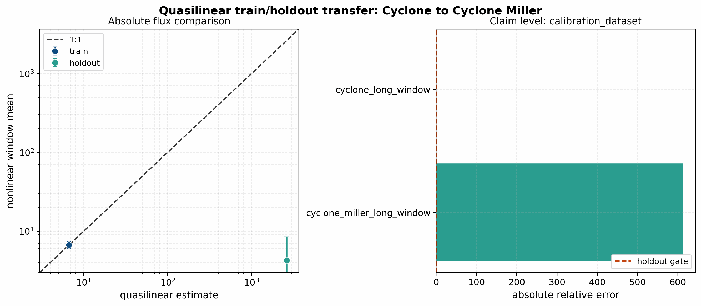
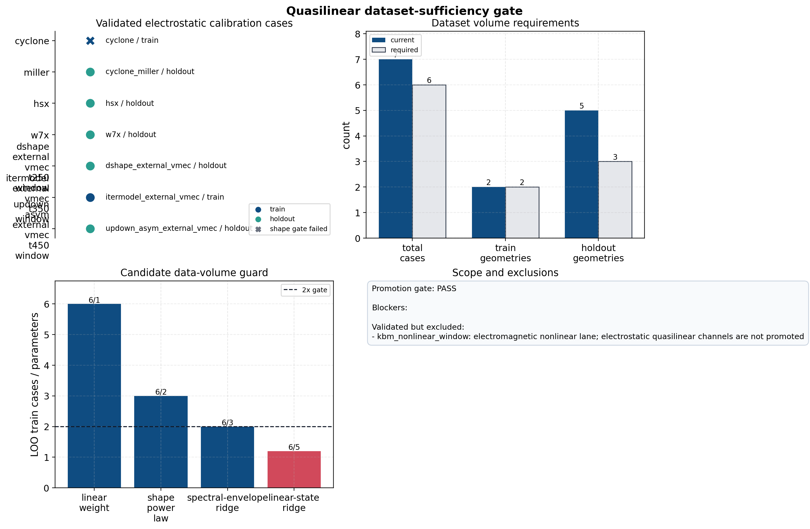
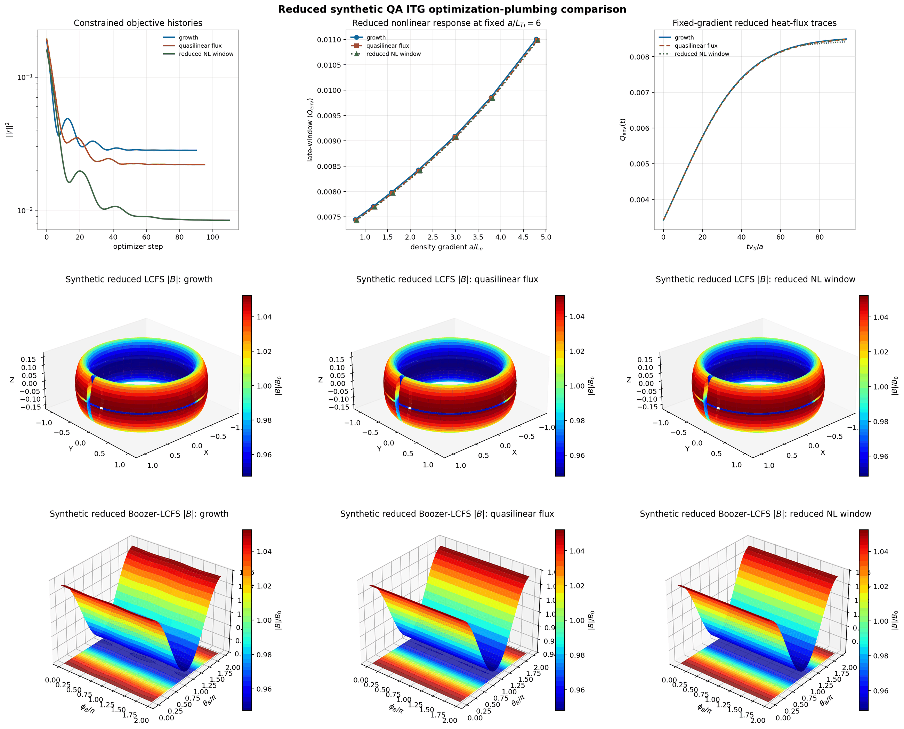

# SPECTRAX-GK

[](https://github.com/uwplasma/SPECTRAX-GK/releases)
[](https://pypi.org/project/spectraxgk/)
[](https://github.com/uwplasma/SPECTRAX-GK/actions/workflows/ci.yml)
[](https://github.com/uwplasma/SPECTRAX-GK/blob/main/LICENSE)
[](https://github.com/uwplasma/SPECTRAX-GK/blob/main/pyproject.toml)
[](https://codecov.io/gh/uwplasma/SPECTRAX-GK)

SPECTRAX-GK is a JAX-native gyrokinetic solver designed for differentiability, 
high-performance accelerator execution, and advanced stellarator optimization. 
The code employs a Hermite-Laguerre velocity space, Fourier perpendicular 
coordinates, and field-aligned flux-tube geometry to simulate linear and 
nonlinear electrostatic and electromagnetic turbulence in magnetized plasmas.

## Installation

```bash
pip install spectraxgk
```

or install the development checkout directly:

```bash
git clone https://github.com/uwplasma/SPECTRAX-GK
cd SPECTRAX-GK
pip install -e .
```

## Quickstart (Executable)

```bash
# Run the built-in default example.
spectraxgk

# The hyphenated entry point works too.
spectrax-gk

# Run directly from a checked-in TOML.
spectraxgk examples/linear/axisymmetric/cyclone.toml

# Compute linear quasilinear transport weights and write JSON/CSV artifacts.
spectraxgk run-runtime-linear \
  --config examples/linear/axisymmetric/runtime_cyclone_quasilinear.toml \
  --out tools_out/cyclone_quasilinear

# Write a restartable nonlinear NetCDF bundle.
spectraxgk run-runtime-nonlinear \
  --config examples/nonlinear/axisymmetric/runtime_cyclone_nonlinear.toml \
  --steps 200 \
  --out tools_out/cyclone_release.out.nc

# Replace the VMEC equilibrium used by a VMEC-backed TOML (model = "vmec").
spectrax-gk run \
  --config examples/nonlinear/non-axisymmetric/runtime_hsx_nonlinear_vmec_geometry.toml \
  --vmec-file /path/to/wout_HSX_QHS_vacuum_ns201.nc \
  --out tools_out/hsx_run

# Replace the imported EIK/NetCDF geometry used by an imported-geometry TOML.
# --geometry-file does not switch model="vmec" into imported-geometry mode;
# the TOML should already use model="vmec-eik", "gx-eik", or "gx-netcdf".
spectrax-gk run \
  --config examples/nonlinear/non-axisymmetric/runtime_w7x_nonlinear_imported_geometry.toml \
  --geometry-file /path/to/w7x_adiabatic_electrons.eik.nc \
  --out tools_out/w7x_run

# Turn any saved runtime bundle into a polished figure.
spectraxgk --plot tools_out/cyclone_release.out.nc
spectraxgk --plot tools_out/spectraxgk_default_linear.summary.json
```

Running `spectraxgk` with no TOML starts the default Cyclone linear example
(equivalent to the standard `examples/linear/axisymmetric/cyclone.toml`
surface), prints the fitted growth rate and frequency to the terminal, and
writes a two-panel figure to `tools_out/spectraxgk_default_linear.png`. The
left panel shows the linear `|\phi|^2` history on a log scale with the fitted
`(\gamma, \omega)` annotation. The right panel shows the normalized real and
imaginary eigenfunction.

When progress output is enabled, the executable prints live status lines with
step/time progress, wall elapsed time, and an estimated wall-clock time
remaining. Adaptive nonlinear runs also emit chunk-level elapsed/ETA updates.

The `--plot` mode reads saved runtime artifacts directly:

- linear bundles: `*.summary.json` + `*.timeseries.csv` + `*.eigenfunction.csv`
- nonlinear bundles: `*.summary.json` + `*.diagnostics.csv` or `*.out.nc`

Linear plots reproduce the two-panel growth/eigenfunction layout. Nonlinear
plots produce a three-panel diagnostic view with field amplitude/energy,
resolved diagnostics, and heat flux.

## Highlights

- **Differentiable JAX-native kernels** for gradient-based optimization and sensitivity analysis.
- **Hermite-Laguerre spectral velocity basis** providing efficient kinetic closures and multi-fidelity modeling.
- **Accelerator-ready execution** on CPUs and GPUs with JIT compilation.
- **Flexible geometry interface** supporting analytic s-alpha, Miller, and direct VMEC equilibrium imports.
- **Electromagnetic turbulence** including $(\phi, A_\parallel, B_\parallel)$ fluctuations.
- **Multi-species support** with kinetic electrons and advanced collision operators.
- **Quasilinear transport diagnostics** from linear states, with explicit
  saturation-rule metadata and electrostatic channel validation gates.
- **Automated benchmark workflows** for reproducible validation and regression tracking.


The figures above represent the validated benchmark suite, covering linear
microinstabilities and nonlinear transport across diverse magnetic
configurations. The shipped nonlinear atlas emphasizes the longest archived
windows currently tracked in the repo: KBM to about `t=400`, W7-X to about
`t=200`, and Cyclone Miller to about `t=122`. HSX is currently archived on the
closed `t=50` window; no longer-window HSX nonlinear audit artifact is currently
tracked for the release panel.

Quasilinear transport diagnostic example:


This panel is generated from `examples/linear/axisymmetric/runtime_cyclone_quasilinear.toml`.
It shows linear growth/frequency, eigenfunction-weighted `k_perp`, amplitude-normalized
heat/particle flux weights, and an explicitly uncalibrated mixing-length output. The
absolute saturated-flux claim remains gated on nonlinear train/holdout calibration.
The first Cyclone nonlinear audit is tracked in `docs/quasilinear.rst` and is
kept at `training_or_audit_only` until a held-out calibration set passes.

The first train/holdout calibration diagnostic fits one heat-flux scale on the
Cyclone nonlinear window and scores Cyclone Miller as a held-out geometry:



This held-out transfer test fails intentionally in the current release, so
SPECTRAX-GK does not claim calibrated absolute quasilinear flux prediction yet.
The result is kept because it is the correct research gate: linear weights and
gradients are available now, while saturation-rule transfer must be improved
and validated before being used for stellarator optimization claims.



The dataset-sufficiency gate keeps the same scope machine-readable. The current
four electrostatic-compatible nonlinear windows reject the simple saturation
rules, but they are not enough to promote richer absolute-flux candidates:
there is only one explicit training geometry, downstream skill gates still
fail, and electromagnetic KBM is deliberately excluded until electromagnetic
quasilinear channels are validated.

Autodiff validation (inverse/sensitivity demo):


This single-mode figure checks that the JAX derivatives are correct and shows how one measured mode constrains the gradients locally. The expected outcome is small observable and Jacobian errors, not exact parameter recovery; the shipped result is a near-perfect match in `(γ, ω)` but a visibly non-unique recovered `(R/L_Ti, R/L_n)` pair.

Autodiff validation (two-mode inverse demo):


This two-mode figure is the actual parameter-recovery validation, where the goal is to recover the planted gradients from two independent mode observables. The shipped result reaches the target to numerical precision and the autodiff Jacobian matches finite differences, which is the behavior expected from an identifiable inverse problem.

Single-point runtime TOMLs can also carry their own artifact prefix:

```toml
[output]
path = "tools_out/runtime_case"
```

The executable `--out` flag overrides the TOML value when both are present.

The shipped nonlinear W7-X and HSX runtime TOMLs already set this lightweight
artifact prefix, so long stellarator parity runs leave ``tools_out/...``
diagnostics and summaries behind without extra command-line flags. The direct Python
case wrappers now honor that TOML output contract as well, so chunked
nonlinear runs persist their evolving diagnostics through the same path.

When the nonlinear target ends in `.out.nc` or another `.nc` suffix,
SPECTRAX-GK writes a restartable NetCDF bundle, compatible with the comparison
tooling, instead of the lightweight JSON/CSV sidecars:

- `case.out.nc`: resolved nonlinear diagnostics and metadata
- `case.big.nc`: final fields and moments in real and spectral layouts
- `case.restart.nc`: restart state for continuation runs

The same runtime input can then resume from the saved restart file by setting
restart controls in the TOML:

```toml
[time]
nstep_restart = 100

[output]
path = "tools_out/cyclone_release.out.nc"
restart_if_exists = true
save_for_restart = true
append_on_restart = true
restart_with_perturb = false
```

With that configuration, rerunning the same command resumes from
`tools_out/cyclone_release.restart.nc` when it already exists and appends the
new samples to `tools_out/cyclone_release.out.nc`.

## Quickstart (Python)

```python
from spectraxgk import CycloneBaseCase, LinearParams, integrate_linear_from_config
from spectraxgk.geometry import SAlphaGeometry
from spectraxgk.grids import build_spectral_grid
import jax.numpy as jnp

cfg = CycloneBaseCase()
grid = build_spectral_grid(cfg.grid)
geom = SAlphaGeometry.from_config(cfg.geometry)
params = LinearParams()

G0 = jnp.zeros((2, 2, grid.ky.size, grid.kx.size, grid.z.size), dtype=jnp.complex64)
G0 = G0.at[0, 0, 0, 0, :].set(1.0e-3 + 0.0j)

G_t, phi_t = integrate_linear_from_config(G0, grid, geom, params, cfg.time)
```

## Autodiff demo and parallelization notes

The autodiff inverse/sensitivity example lives at
`examples/theory_and_demos/autodiff_inverse_growth.py` and generates the
figure shown above. It uses JAX autodiff on a short linear ITG window, reports
gradients against a finite-difference check, and writes a summary JSON plus
parameter sweeps for both `R/L_Ti` and `R/L_n` alongside the plot. The
single-mode panel should be read as a local inverse demo, not as a global
identifiability claim; in the shipped figure the observable errors are small
while the parameter errors remain finite for exactly that reason.
The two-mode inverse example in
`examples/theory_and_demos/autodiff_inverse_twomode.py` uses two ky modes to
stabilize the inverse problem and provides the release-grade parameter
recovery panel, closing the identifiability gap present in the single-mode
demo. Both autodiff examples now report finite-difference Jacobian checks,
Jacobian rank/conditioning, covariance, standard deviations, correlations, and
one-sigma UQ ellipse area in their summary JSON files.

The differentiable geometry bridge example lives at
`examples/theory_and_demos/differentiable_geometry_bridge.py` and writes the
publication artifact below. It validates the in-memory
`vmec_jax`/`booz_xform_jax` bridge contract used by stellarator optimization
workflows: solver-ready field-line arrays remain JAX-traceable, geometry
observable sensitivities match central finite differences, a two-parameter
inverse design recovers the target observables, and the local UQ covariance is
reported. When `vmec_jax` is available, the same artifact also checks a real
VMEC boundary-aspect derivative through its boundary Fourier API and real VMEC
metric-tensor derivatives through `vmec_jax.geom.eval_geom`. It also samples a
real stellarator VMEC field line from `vmec_jax` metric and magnetic-field
tensors to check that state-level geometry sensitivities reach field-line
observables before any SPECTRAX-GK closure approximation is introduced. The
same path now emits a direct VMEC tensor-derived SPECTRAX-GK flux-tube mapping
and checks its geometry-observable sensitivities against finite differences,
so the differentiability chain starts at `vmec_jax` state coefficients rather
than only at a Boozer spectral adapter. The validation artifact also records a
direct-VMEC-tensor vs imported-VMEC/EIK array-parity audit. A new
`vmec_jax -> booz_xform_jax` Boozer equal-arc core audit now matches the
imported convention for `bmag`, `bgrad`, `gradpar`, `q`, `s_hat`, and the
solver Jacobian at the percent level on the tracked stellarator fixture; the
same audit now reconstructs the zero-beta Boozer metric profiles `gds*`/`grho`
with worst normalized mismatch `3.45e-2` and the loaded-convention zero-beta
drift profiles `cvdrift`/`gbdrift`/`cvdrift0`/`gbdrift0` with worst normalized
mismatch `3.50e-2`. The remaining geometry promotion work is broad finite-beta
and multi-equilibrium drift parity. When
`booz_xform_jax` is available, it also runs a bounded JAX-native Boozer
spectral transform, samples the resulting Boozer `|B|` spectrum onto a
field-line flux-tube mapping, and checks both derivative paths against central
finite differences. When both optional backends are available, the artifact
also starts from a real `vmec_jax` `VMECState`, perturbs VMEC Fourier
coefficients, converts that state through `booz_xform_jax`, and differentiates
the resulting SPECTRAX-GK field-line geometry observables against central
finite differences. The remaining promotion gate is exact production drift
parity with the imported VMEC/EIK runtime path and then multi-equilibrium
transport-gradient and nonlinear-window gates through the solver.


A separate mode-21 parity matrix broadens the same Boozer equal-arc check to
the tracked QH, QI, and shaped-tokamak fixtures. The matrix is generated by
`tools/build_vmec_boozer_parity_matrix.py`, enforces `mboz,nboz >= 21`, and
passes all current core, scalar, `bgrad`, metric, and drift subgates. This is
a multi-equilibrium field-line geometry gate, not yet a production
stellarator-transport-gradient claim.


The solver-objective geometry-gradient gate differentiates actual
electrostatic linear-RHS eigenpair observables with respect to solver-ready
geometry arrays and checks the implicit left/right eigenpair sensitivities
against central finite differences. This closes the production solver contract
for `FluxTubeGeometryData` gradients. The companion full-chain gate starts
from a real `vmec_jax` state coefficient, maps through `booz_xform_jax`
with `mboz=nboz=21`, builds the SPECTRAX-GK linear RHS, and verifies the
linear eigenfrequency gradient against central finite differences. The
full-chain quasilinear gate uses a richer `Nl=2, Nm=3` moment basis and
checks `gamma`, `omega`, `<k_perp^2>`, the electrostatic heat-flux weight, and
`gamma Q_i/k_perp^2` against central finite differences with maximum relative
error `4.3e-3`. This closes the reduced linear/quasilinear stellarator
objective-gradient path on the tracked all-surface QH fixture. A second Li383
holdout now passes the same frequency and quasilinear VMEC/Boozer gradient
contracts at `mboz=nboz=21`; the combined holdout matrix has maximum relative
AD/finite-difference mismatch `4.9e-3`. This is a multi-equilibrium reduced
linear/quasilinear differentiability gate, not a nonlinear-window heat-flux
gradient claim. A memory-bounded Boozer surface stencil exists for diagnostics
and large-equilibrium probes, but it is not used for the published accuracy
claim. Nonlinear-window state-gradient gates remain future work before full
nonlinear heat-flux optimization claims.


Differentiable stellarator ITG optimization examples live in
`examples/optimization/`. They optimize the same QA, max-mode-1 control vector
with three turbulence objectives: small linear ITG growth rate, small
quasilinear ITG heat-flux proxy, and a small late-window nonlinear heat-flux
envelope. Each example reports AD-vs-finite-difference checks, UQ covariance
diagnostics, objective histories, and polished figures.




The panel above is the current release-grade differentiability gate: all three
objectives keep the optimized QA configuration near aspect ratio `7` and
`iota = 0.41` while reducing the tracked transport observables. It should be
read together with the UQ panel, which verifies AD/FD derivative parity for
each active control and estimates local Gauss-Newton covariance from the final
weighted objective residual. These are validated optimization-plumbing
diagnostics for stellarator-transport objectives, not a final absolute-flux
optimization claim. Full
`vmec_jax -> booz_xform_jax -> SPECTRAX-GK` nonlinear optimization remains
scoped to the next promotion gate: matching the production curvature/drift
convention to the imported geometry path across additional equilibria,
broadening full-chain transport-gradient checks beyond the tracked QH fixture,
and converged nonlinear audits of the optimized equilibria.

For production parallelization of independent work, use
`spectraxgk.batch_map` / `spectraxgk.ky_scan_batches` for ky scans,
sensitivity sweeps, and UQ ensembles. These helpers preserve serial ordering,
fall back to `vmap` on one device, and use JAX device batching when multiple
devices are available. For full-state fixed-step nonlinear parallelization, set
`TimeConfig.state_sharding = "auto"` (or `"ky"` / `"kx"`) in runtime TOMLs to
partition the packed state array across available JAX devices. The release-gated
nonlinear path is intentionally limited to those state axes: sharding across
the `z` FFT axis is tracked as a future domain-decomposition lane because it
requires a separate communication/layout design. The current profiler-backed
artifacts are `docs/_static/nonlinear_sharding_profile.json` for the local
control-flow gate and `docs/_static/nonlinear_sharding_profile_office_gpu.json`
for the two-GPU office identity gate. Treat both as engineering gates, not as
new runtime claims; publication speedups still need a matched CPU/GPU sweep on
benchmark-size nonlinear cases.


The ky-batch gate above is generated by
`python tools/generate_parallel_ky_scan_gate.py`. It runs the real Cyclone
linear solver serially and with fixed-shape ky batching, verifies numerical
identity for `gamma` and `omega`, and reports the observed batch speedup for
engineering tracking.

## Benchmarks

SPECTRAX-GK is rigorously validated against standard gyrokinetic benchmarks, including:
- **Linear growth rates and frequencies:** Cyclone ITG, ETG, KBM, W7-X, HSX, Miller, and KAW.
- **Nonlinear transport:** Heat flux and energy traces for ITG, KBM, and stellarator configurations.

The benchmark tooling in `tools/` ensures reproducibility and performance tracking.
For the current release pass, the accepted nonlinear validation set is Cyclone,
KBM, W7-X, HSX, Cyclone Miller, and the closed short-window full-GK ETG
nonlinear pilot. TEM and KAW stay outside the active parity claim.
The window-statistics artifact uses case-specific mean-relative gates: KBM
`0.02`, HSX `0.05`, Cyclone Miller `0.095`, and the broader release envelope
`0.10` for Cyclone and W7-X while their paper-level tightening lanes remain
open.

## Runtime and Memory


SPECTRAX-GK is optimized for performance across CPU and GPU backends. The
runtime panel above compares wall-time and peak memory usage for the shipped
benchmark cases. Performance tracking covers:

- **Cyclone ITG** (linear/nonlinear)
- **KBM** and **ETG** configurations
- **W7-X** and **HSX** stellarator geometries
- **Miller** geometry models

The refreshed shipped panel includes the W7-X and HSX linear and nonlinear
rows. Regenerate this public panel from the shipped refresh summary with:

```bash
python tools/benchmark_runtime_memory.py \
  --summary-glob tools_out/runtime_memory_summary_ship_refresh.json \
  --csv-out tools_out/runtime_memory_results_ship_refresh_regenerated.csv \
  --summary-out tools_out/runtime_memory_summary_ship_refresh_regenerated.json \
  --plot-out docs/_static/runtime_memory_benchmark.png
```

Experimental or not-yet-closed lanes such as KAW, TEM, and kinetic-electron
Cyclone are tracked separately and do not appear in the shipped runtime panel.
For the stellarator rows on `office`, the shipped panel uses pre-generated
`*.eik.nc` geometry files rather than on-the-fly VMEC regeneration. The GX
reference rows also run against a consistent local `netcdf-c` / `hdf5`
runtime stack there, because the default `office` stellarator environment
mixed incompatible HDF5 / NetCDF libraries and lacked the VMEC Python helper
dependencies needed for live geometry generation.

These shipped runtime rows are cold wall-time measurements, so the SPECTRAX-GK
nonlinear GPU entries include JAX startup/compile cost. Targeted `office` GPU
profiles on the same short nonlinear cases measured:

- Cyclone nonlinear: `warmup_time_s = 33.957`, `run_time_s = 15.054`
- KBM nonlinear: `warmup_time_s = 27.485`, `run_time_s = 9.725`

This means the current short-run Cyclone and KBM gaps are dominated much more
by cold-start overhead than by steady-state timestep throughput. In steady
state, Cyclone GPU is faster than the shipped GX runtime row, and KBM GPU is
close to parity.
The hollow diamond markers in the runtime subplot show those warm second-run
timings on top of the cold wall-time bars.

### Kernel profiling and gated fast modes


The current profiler splits the nonlinear RHS into field solve, linear RHS,
nonlinear bracket, and full RHS kernels on CPU and GPU. The latest bounded
Cyclone profile shows the compiled linear RHS, nonlinear bracket, and full RHS
are the dominant warm-throughput targets, while GPU execution reduces all
measured RHS kernels. The
companion JSON artifact records dominant kernels and grid-to-spectral speedups
so the optimization lane remains traceable and machine-checkable.

The next profiler layer resolves the linear RHS into individual term kernels.
The tracked Cyclone CPU artifact (`docs/_static/linear_rhs_terms_profile.json`)
now includes the zero-collision fast path and reports `full_linear_rhs=5.04e-2 s`
in the bounded CPU harness. The active-state companion
(`docs/_static/linear_rhs_terms_profile_z_wave_cpu.json`) injects resolved
parallel variation and shows linked-`|k_z|` hypercollisions becoming active;
zero-norm initial-state rows are retained in production until a state-window
identity gate proves they remain inactive after nonlinear evolution. The
matching `office` GPU artifact
(`docs/_static/linear_rhs_terms_profile_gpu.json`) reports
`full_linear_rhs=6.52e-3 s` on one RTX A4000, and the active-state GPU
companion reproduces the linked-`|k_z|`/hypercollision norm match.

The tracked state-window gate
(`docs/_static/linear_rhs_zero_norm_state_window_gate.json`) now makes that
policy executable: it accepts a zero-collision skip for the `nu=0` Cyclone
window but rejects skipping linked-`|k_z|` hypercollisions once a resolved
parallel perturbation is present.


The optional spectral Laguerre nonlinear mode is gated, not a default. On the
bounded `office` GPU gate it preserves scalar nonlinear diagnostics across
Cyclone, KBM, W7-X, and HSX with max relative differences below `2.2e-5`.
It speeds up Cyclone, KBM, and W7-X in that gate, but HSX is slower, so users
should treat it as an opt-in engineering mode and rerun
`python tools/gate_laguerre_nonlinear_modes.py` for their production case
before relying on it for performance claims.

Regenerate the runtime figure from collected per-case summaries with:

```bash
python tools/benchmark_runtime_memory.py \
  --summary-glob tools_out/runtime_memory_*linear.json \
  --summary-glob tools_out/runtime_memory_*nonlinear.json

# For a long office sweep, keep going after a failed row and save per-row logs.
python tools/benchmark_runtime_memory.py --continue-on-error --log-dir tools_out/runtime_memory_logs
```

The parallelization scaling figure is kept in the performance docs rather than
the top-level README. The shipped public plot focuses on the release-grade
2-device diffrax speedup curve rather than the exploratory CPU strong-scaling
study.

## Examples

The `examples/` directory is organized by physics and configuration:

- **`linear/`**: Linear microinstability drivers for axisymmetric (Tokamak) and non-axisymmetric (Stellarator) geometries.
- **`nonlinear/`**: Nonlinear turbulence simulations and transport analysis.
- **`benchmarks/`**: Scripts for replicating published benchmark results and parameter scans.
- **`theory_and_demos/`**: Pedagogical examples and demonstrations of the underlying numerical methods.

Parity-facing nonlinear examples now include:

- Cyclone ITG
- KBM
- W7-X
- HSX
- a full-GK ETG nonlinear pilot lane in `examples/nonlinear/axisymmetric/runtime_etg_nonlinear.toml`

The reduced `cETG` example remains available as a separate reduced-model
workflow; it is not the same thing as the full-GK ETG nonlinear lane.

## Documentation

Comprehensive documentation, including theory, algorithms, and API references, is available in `docs/`.

## Testing

Default `pytest` runs skip integration tests for faster feedback. Use:

```bash
pytest
pytest -m integration
python tools/run_tests_fast.py
python tools/run_wide_coverage_gate.py --shards 24 --timeout 300 --fail-under 95 --pytest-arg=-o --pytest-arg=addopts= --pytest-arg=-m --pytest-arg="not slow"
```

For laptops or shared workstations, run the same wide gate one bounded shard at
a time with `--only-shard N --keep-existing-coverage --skip-combine`, then
finish with `--combine-only --fail-under 95`; this keeps every local pytest
process under the release timeout instead of launching one long run.

## Plotting outputs

To visualize nonlinear diagnostics from a ``*.out.nc`` file:

```bash
python examples/utilities/plot_runtime_outputs.py tools_out/cyclone_nonlinear.out.nc \
  --out tools_out/cyclone_nonlinear_diagnostics.png
```

## Contributing

SPECTRAX-GK is an open-source project welcoming contributions. Whether it's improving runtimes, reducing memory usage, or expanding the physics models, your help is appreciated.

## License

MIT License.
