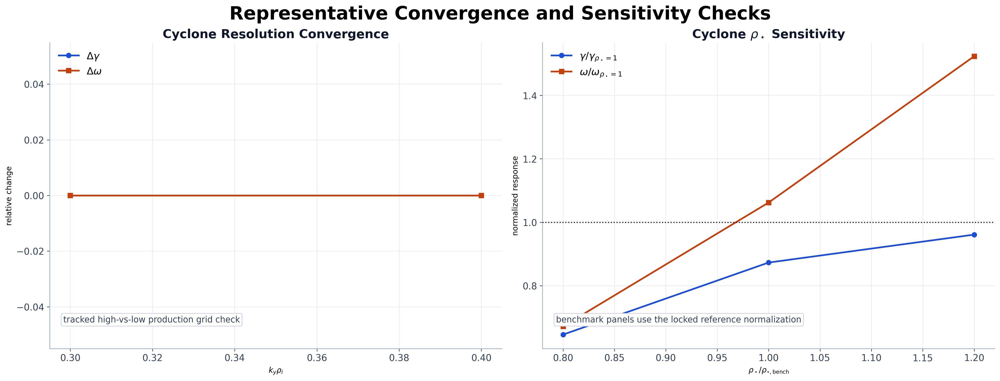
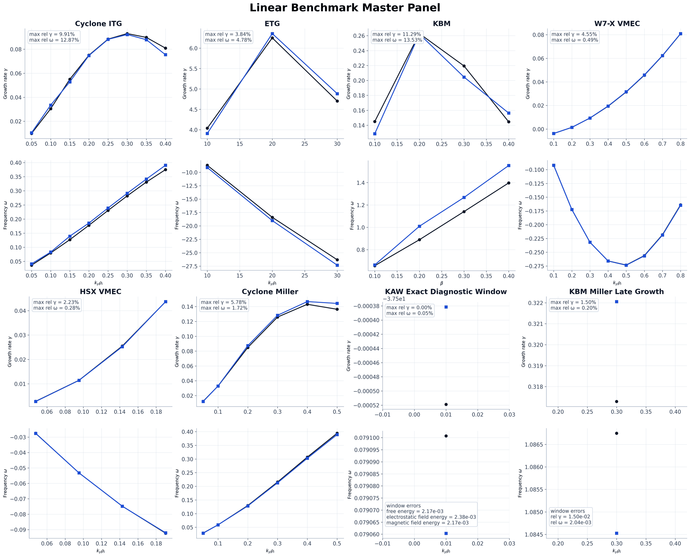
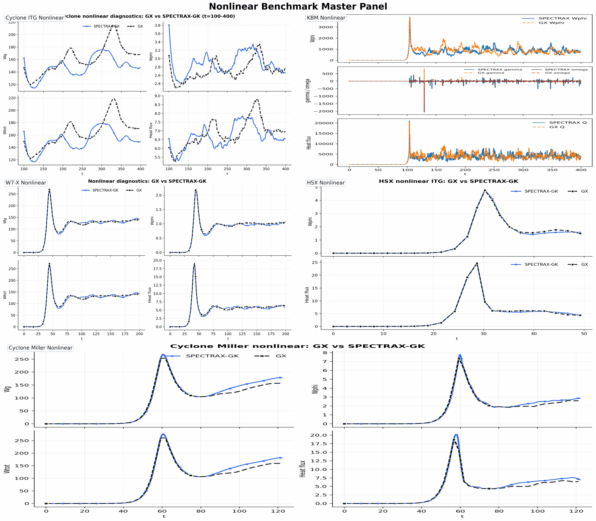
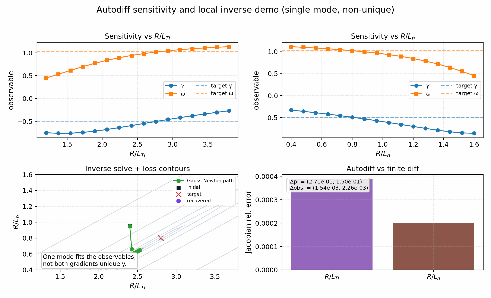
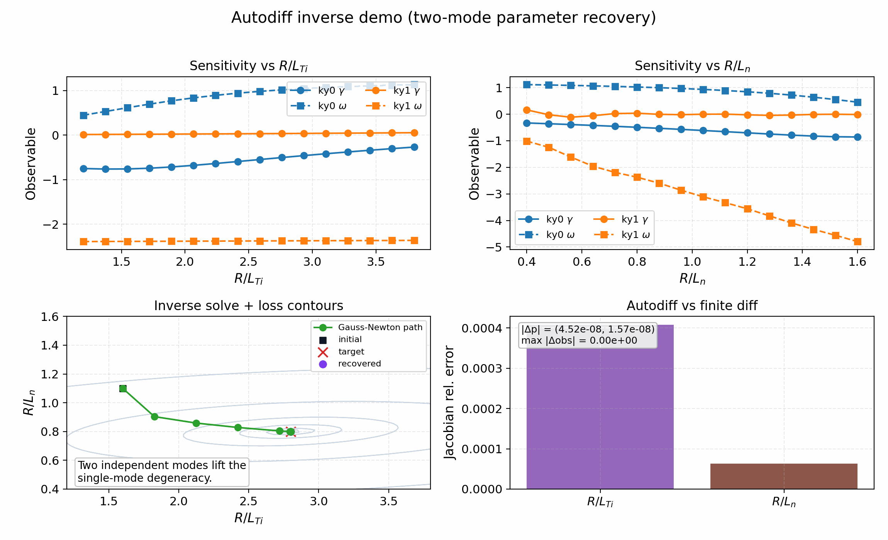

# SPECTRAX-GK

SPECTRAX-GK is a JAX-native gyrokinetic solver designed for differentiability, 
high-performance accelerator execution, and advanced stellarator optimization. 
The code employs a Hermite-Laguerre velocity space, Fourier perpendicular 
coordinates, and field-aligned flux-tube geometry to simulate linear and 
nonlinear electrostatic and electromagnetic turbulence in magnetized plasmas.







The figures above represent the validated benchmark suite, covering convergence, 
linear microinstabilities, and nonlinear transport across diverse magnetic 
configurations.

Autodiff validation (inverse/sensitivity demo):



This single-mode figure checks that the JAX derivatives are correct and shows how one measured mode constrains the gradients locally. The expected outcome is small observable and Jacobian errors, not exact parameter recovery; the shipped result is a near-perfect match in `(γ, ω)` but a visibly non-unique recovered `(R/L_Ti, R/L_n)` pair.

Autodiff validation (two-mode inverse demo):



This two-mode figure is the actual parameter-recovery validation, where the goal is to recover the planted gradients from two independent mode observables. The shipped result reaches the target to numerical precision and the autodiff Jacobian matches finite differences, which is the behavior expected from an identifiable inverse problem.

## Highlights

- **Differentiable JAX-native kernels** for gradient-based optimization and sensitivity analysis.
- **Hermite-Laguerre spectral velocity basis** providing efficient kinetic closures and multi-fidelity modeling.
- **Accelerator-ready execution** on CPUs and GPUs with JIT compilation.
- **Flexible geometry interface** supporting analytic s-alpha, Miller, and direct VMEC equilibrium imports.
- **Electromagnetic turbulence** including $(\phi, A_\parallel, B_\parallel)$ fluctuations.
- **Multi-species support** with kinetic electrons and advanced collision operators.
- **Automated benchmark workflows** for reproducible validation and regression tracking.

## Installation

```bash
pip install -e .
```

For benchmark-sensitive reproduction, use the tested numerical stack that the
public CI and tracked atlas are validated against:

- `jax>=0.8,<0.9`
- `jaxlib>=0.8,<0.9`
- `numpy>=2.3,<2.4`
- `diffrax>=0.7,<0.8`
- `equinox>=0.13,<0.14`

The code may still run on newer stacks, but parity-sensitive lanes such as TEM,
ETG branch-following, and KAW runtime examples should be audited on the tested
stack before treating a mismatch as a solver regression.
For direct reproduction of older runtime-example outputs, also run with
`JAX_ENABLE_X64=1`; the default precision policy can be faster, but it may move
parity-sensitive linear example results.

## Quickstart (CLI)

```bash
# Get information about the Cyclone base case
spectrax-gk cyclone-info

# Run the current Cyclone example from its TOML
cd examples/linear/axisymmetric && spectrax-gk cyclone.toml

# Run directly from a runtime TOML
spectrax-gk examples/linear/axisymmetric/runtime_cyclone.toml

# Write a restartable nonlinear NetCDF bundle
spectrax-gk run-runtime-nonlinear \
  --config examples/nonlinear/axisymmetric/runtime_cyclone_nonlinear_gx.toml \
  --steps 200 \
  --out tools_out/cyclone_release.out.nc

# Run a linear scan across k_y
spectrax-gk scan-runtime-linear --config examples/linear/axisymmetric/cyclone.toml
```

Single-point runtime TOMLs can also carry their own artifact prefix:

```toml
[output]
path = "tools_out/runtime_case"
```

CLI `--out` overrides the TOML value when both are present.

The shipped nonlinear W7-X and HSX runtime TOMLs already set this lightweight
artifact prefix, so long stellarator parity runs leave ``tools_out/...``
diagnostics and summaries behind without extra CLI flags. The direct Python
case wrappers now honor that TOML output contract as well, so chunked
nonlinear runs persist their evolving diagnostics through the same path.

When the nonlinear target ends in `.out.nc` or another `.nc` suffix,
SPECTRAX-GK writes a restartable NetCDF bundle, compatible with the comparison
tooling, instead of the lightweight JSON/CSV sidecars:

- `case.out.nc`: resolved nonlinear diagnostics and metadata
- `case.big.nc`: final fields and moments in real and spectral layouts
- `case.restart.nc`: restart state for continuation runs

The same runtime input can then resume from the saved restart file by setting
restart controls in the TOML:

```toml
[time]
nstep_restart = 100

[output]
path = "tools_out/cyclone_release.out.nc"
restart_if_exists = true
save_for_restart = true
append_on_restart = true
restart_with_perturb = false
```

With that configuration, rerunning the same command resumes from
`tools_out/cyclone_release.restart.nc` when it already exists and appends the
new samples to `tools_out/cyclone_release.out.nc`.

## Quickstart (Python)

```python
from spectraxgk import CycloneBaseCase, LinearParams, integrate_linear_from_config
from spectraxgk.geometry import SAlphaGeometry
from spectraxgk.grids import build_spectral_grid
import jax.numpy as jnp

cfg = CycloneBaseCase()
grid = build_spectral_grid(cfg.grid)
geom = SAlphaGeometry.from_config(cfg.geometry)
params = LinearParams()

G0 = jnp.zeros((2, 2, grid.ky.size, grid.kx.size, grid.z.size), dtype=jnp.complex64)
G0 = G0.at[0, 0, 0, 0, :].set(1.0e-3 + 0.0j)

G_t, phi_t = integrate_linear_from_config(G0, grid, geom, params, cfg.time)
```

## Autodiff demo and multi-device notes

The autodiff inverse/sensitivity example lives at
`examples/theory_and_demos/autodiff_inverse_growth.py` and generates the
figure shown above. It uses JAX autodiff on a short linear ITG window, reports
gradients against a finite-difference check, and writes a summary JSON plus
parameter sweeps for both `R/L_Ti` and `R/L_n` alongside the plot. The
single-mode panel should be read as a local inverse demo, not as a global
identifiability claim; in the shipped figure the observable errors are small
while the parameter errors remain finite for exactly that reason.
The two-mode inverse example in
`examples/theory_and_demos/autodiff_inverse_twomode.py` uses two ky modes to
stabilize the inverse problem and provides the release-grade parameter
recovery panel, closing the identifiability gap present in the single-mode
demo.

For multi-device runs, set `TimeConfig.state_sharding = "auto"` (or `"ky"`) in
runtime TOMLs to shard the packed state array across available JAX devices.
This path is supported by the diffrax integrators; when only one device is
available the run falls back to single-device execution.

## Benchmarks

SPECTRAX-GK is rigorously validated against standard gyrokinetic benchmarks, including:
- **Linear growth rates and frequencies:** Cyclone ITG, ETG, KBM, W7-X, HSX, Miller, and KAW.
- **Nonlinear transport:** Heat flux and energy traces for ITG, KBM, and stellarator configurations.

The benchmark tooling in `tools/` ensures reproducibility and performance tracking.
For the current release pass, the accepted nonlinear validation set is Cyclone,
KBM, W7-X, HSX, Cyclone Miller, and the closed short-window full-GK ETG
nonlinear pilot. TEM and KAW stay outside the active parity claim.

## Runtime and Memory


SPECTRAX-GK is optimized for performance across CPU and GPU backends. The
runtime panel above compares wall-time and peak memory usage for the shipped
1.0 benchmark cases. Performance tracking covers:

- **Cyclone ITG** (linear/nonlinear)
- **KBM** and **ETG** configurations
- **W7-X** and **HSX** stellarator geometries
- **Miller** geometry models

Experimental or not-yet-closed lanes such as KAW, TEM, and kinetic-electron
Cyclone are tracked separately and do not appear in the shipped runtime panel.
For the stellarator rows on `office`, the shipped panel uses pre-generated
`*.eik.nc` geometry files rather than on-the-fly VMEC regeneration. The GX
reference rows also run against a consistent local `netcdf-c` / `hdf5`
runtime stack there, because the default `office` stellarator environment
mixed incompatible HDF5 / NetCDF libraries and lacked the VMEC Python helper
dependencies needed for live geometry generation.

Regenerate the runtime figure from collected per-case summaries with:

```bash
python tools/benchmark_runtime_memory.py \
  --summary-glob tools_out/runtime_memory_*linear.json \
  --summary-glob tools_out/runtime_memory_*nonlinear.json

# For a long office sweep, keep going after a failed row and save per-row logs.
python tools/benchmark_runtime_memory.py --continue-on-error --log-dir tools_out/runtime_memory_logs
```

The scaling figure is kept in the performance docs rather than the top-level
README. The shipped public plot focuses on the release-grade 2-device diffrax
speedup curve; the exploratory sharded-RK2 strong-scaling sweep remains
available as raw data but is intentionally not treated as a headline result.

To regenerate strong-scaling sweeps, use:

```bash
python examples/utilities/strong_scaling_sweep.py \
  --ny 128 --nz 256 --nl 8 --nm 8 --steps 120 \
  --devices 1,2,4,8 \
  --backend cpu_sharded_large \
  --out tools_out/strong_scaling_cpu.csv
```

## Examples

The `examples/` directory is organized by physics and configuration:

- **`linear/`**: Linear microinstability drivers for axisymmetric (Tokamak) and non-axisymmetric (Stellarator) geometries.
- **`nonlinear/`**: Nonlinear turbulence simulations and transport analysis.
- **`benchmarks/`**: Scripts for replicating published benchmark results and parameter scans.
- **`theory_and_demos/`**: Pedagogical examples and demonstrations of the underlying numerical methods.

Parity-facing nonlinear examples now include:

- Cyclone ITG
- KBM
- W7-X
- HSX
- a full-GK ETG nonlinear pilot lane in `examples/nonlinear/axisymmetric/runtime_etg_nonlinear.toml`

The reduced `cETG` example remains available as a separate reduced-model
workflow; it is not the same thing as the full-GK ETG nonlinear lane.

## Documentation

Comprehensive documentation, including theory, algorithms, and API references, is available in `docs/`.

## Testing

Default `pytest` runs skip integration tests for faster feedback. Use:

```bash
pytest
pytest -m integration
python tools/run_tests_fast.py
```

## Plotting outputs

To visualize nonlinear diagnostics from a ``*.out.nc`` file:

```bash
python examples/utilities/plot_runtime_outputs.py tools_out/cyclone_nonlinear.out.nc \
  --out tools_out/cyclone_nonlinear_diagnostics.png
```

## Contributing

SPECTRAX-GK is an open-source project welcoming contributions. Whether it's improving runtimes, reducing memory usage, or expanding the physics models, your help is appreciated.

## License

MIT License.
