# SPECTRAX-GK

[](https://github.com/uwplasma/SPECTRAX-GK/releases)
[](https://pypi.org/project/spectraxgk/)
[](https://github.com/uwplasma/SPECTRAX-GK/actions/workflows/ci.yml)
[](https://github.com/uwplasma/SPECTRAX-GK/blob/main/LICENSE)
[](https://github.com/uwplasma/SPECTRAX-GK/blob/main/pyproject.toml)
[](https://codecov.io/gh/uwplasma/SPECTRAX-GK)

SPECTRAX-GK is a JAX-native gyrokinetic solver designed for differentiability,
accelerator-ready execution, and stellarator-optimization research workflows.
The code employs a Hermite-Laguerre velocity space, Fourier perpendicular 
coordinates, and field-aligned flux-tube geometry to simulate linear and 
nonlinear electrostatic and electromagnetic turbulence in magnetized plasmas.
The validated release claim is narrower than the full feature surface; use the
claim-scope ledger below before citing benchmark, quasilinear, autodiff,
refactor, or manuscript results.

## Installation

```bash
pip install spectraxgk
```

or install the development checkout directly:

```bash
git clone https://github.com/uwplasma/SPECTRAX-GK
cd SPECTRAX-GK
pip install -e .
```

## Quickstart (Executable)

```bash
# Run the built-in default example.
spectraxgk

# The hyphenated entry point works too.
spectrax-gk

# Run directly from a checked-in TOML.
spectraxgk examples/linear/axisymmetric/cyclone.toml

# Compute linear quasilinear transport weights and write JSON/CSV artifacts.
spectraxgk run-runtime-linear \
  --config examples/linear/axisymmetric/runtime_cyclone_quasilinear.toml \
  --out tools_out/cyclone_quasilinear

# Write a restartable nonlinear NetCDF bundle.
spectraxgk run-runtime-nonlinear \
  --config examples/nonlinear/axisymmetric/runtime_cyclone_nonlinear.toml \
  --steps 200 \
  --out tools_out/cyclone_release.out.nc

# Generate small VMEC-JAX equilibria locally, then run prefilled VMEC TOMLs.
pip install vmec-jax
cd examples/vmec
./generate_wouts.sh
cd ../..

spectraxgk run \
  --config examples/linear/axisymmetric/runtime_circular_vmec_linear.toml \
  --out tools_out/circular_vmec_linear

spectraxgk run \
  --config examples/nonlinear/non-axisymmetric/runtime_hsx_nonlinear_vmec_geometry.toml \
  --out tools_out/qhs_nonlinear_run

# Turn supported saved runtime artifacts into review figures.
spectraxgk --plot tools_out/cyclone_release.out.nc
spectraxgk --plot spectraxgk_default_linear.summary.json
```

Running `spectraxgk` with no TOML starts a short Cyclone initial-value linear
demo (equivalent to the standard `examples/linear/axisymmetric/cyclone.toml`
surface), prints setup and live time-integration progress with elapsed time and
ETA, and writes the demo artifacts in the current directory:

- `spectraxgk_default_linear.toml`: the input file that reproduces the run
- `spectraxgk_default_linear.summary.json`
- `spectraxgk_default_linear.timeseries.csv`
- `spectraxgk_default_linear.eigenfunction.csv`
- `spectraxgk_default_linear.png`

The figure shows the linear `|\phi|^2` time history on a log scale with the
fitted `(\gamma, \omega)` annotation, plus the normalized real and imaginary
eigenfunction. Re-run the same numerical case with
`spectraxgk run-linear --config spectraxgk_default_linear.toml --progress`.

Longer runtime commands also print live status lines with step/time progress,
wall elapsed time, and an estimated wall-clock time remaining when progress is
enabled. Adaptive nonlinear runs emit chunk-level elapsed/ETA updates.

The `--plot` mode reads saved runtime artifacts directly:

- linear bundles: `*.summary.json` + `*.timeseries.csv` + `*.eigenfunction.csv`
- nonlinear bundles: `*.summary.json` + `*.diagnostics.csv` or `*.out.nc`

Linear plots reproduce the two-panel growth/eigenfunction layout. Nonlinear
plots produce a three-panel diagnostic view with field amplitude/energy,
resolved diagnostics, and heat flux.

## Highlights

- **Differentiable JAX-native kernels** for gradient-based optimization and sensitivity analysis.
- **Hermite-Laguerre spectral velocity basis** providing efficient kinetic closures and multi-fidelity modeling.
- **Accelerator-ready execution** on CPUs and GPUs with JIT compilation.
- **Flexible geometry interface** supporting analytic s-alpha, Miller, and direct VMEC equilibrium imports.
- **Electromagnetic field-channel support** including $(\phi, A_\parallel, B_\parallel)$ fluctuations, with validation claims limited to tracked release lanes.
- **Multi-species support** with kinetic electrons and advanced collision operators.
- **Quasilinear transport diagnostics** from linear states, with explicit
  saturation-rule metadata and electrostatic channel validation gates.
- **Automated benchmark workflows** for reproducible validation and regression tracking.
- **Modular runtime/refactor surfaces** with focused tests for restart artifacts,
  diagnostics, validation gates, and public API boundaries.

## Differentiable Stellarator Optimization

For solved-boundary QA transport experiments, start from the VMEC-JAX-style scripts below. They intentionally mirror VMEC-JAX `examples/optimization/QA_optimization.py`: top-level editable constants, `MAX_MODE = 5`, `TARGET_ASPECT = 5.0`, `TARGET_IOTA = 0.41`, `IOTA_WEIGHT = 10_000.0`, and the original aspect/iota/quasisymmetry objective tuples. SPECTRAX-GK is added only as one extra transport residual in `objective_tuples`.

```bash
python examples/optimization/QA_optimization_with_growth_rate.py
python examples/optimization/QA_optimization_with_quasilinear_flux.py
python examples/optimization/QA_optimization_with_nonlinear_heat_flux.py
```

The key structure is deliberately explicit:

```python
objective_tuples = [
    (aspect.J, TARGET_ASPECT, ASPECT_WEIGHT),
    (iota.J, TARGET_IOTA, IOTA_WEIGHT),
    (qs.J, 0.0, QS_WEIGHT),
    (transport.J, 0.0, SPECTRAX_WEIGHT),
]
```

These scripts are the recommended starting point for producing real VMEC-JAX WOUTs with the same high-weight `iota = 0.41` target as the upstream QA example. Keep the SPECTRAX-GK transport weight small while tuning so the QA, aspect-ratio, and iota constraints remain the dominant solved-equilibrium gate. Full nonlinear turbulent-flux optimization claims still require matched long post-transient SPECTRAX-GK audits, seed/timestep replicates, and running-average convergence.

For a paper-facing constraints-only QA baseline, use the configurable driver
with the strict upstream preset:

```bash
python tools/vmec_jax_qa_low_turbulence_optimization.py \
  --strict-upstream-qa-baseline --solver-device gpu \
  --outdir tools_out/vmec_jax_qa_strict_baseline
```

That preset keeps the upstream objective recipe, simple seed, ESS scaling, and
`MAX_MODE = 5` controls, but increases the solve budget, tightens the outer
step tolerance, and uses a small default iota target buffer
(`target iota = 0.4102`, admission gate `iota >= 0.41`). That avoids stopping
a few `1e-7` below the lower-bound gate while preserving the same QA baseline
physics and objective weighting.

The strict constraints-only baseline audit in
`docs/_static/vmec_jax_qa_strict_baseline/summary.json` was run on the office
GPU node with the exact SciPy/ESS path. It terminates at `nfev=39` with
aspect `5.000154`, mean iota `0.4101997`, QS residual `2.60e-4`, and a passed
solved-WOUT gate. This is a QA baseline artifact only; transport reductions
must be re-audited against this stricter WOUT before being promoted relative to
it.

For algorithm comparisons, run the full `max_mode=5`, `mboz=nboz=21` sweep on
a GPU node and build the real-WOUT comparison panel with:

```bash
python tools/build_vmec_jax_qa_full_sweep_panel.py \
  --run-root tools_out/vmec_jax_qa_full_sweep_YYYYMMDD \
  --out docs/_static/vmec_jax_qa_full_sweep_panel.png
```

Add ``--pdf`` locally when a vector export is needed for a manuscript; the
repository tracks the lean PNG/JSON/CSV artifacts used by the README and docs.

That panel compares the upstream QA baseline, growth-rate, quasilinear-flux,
nonlinear-window, and projected/admission optimizer variants when available.
It plots nonlinear `Q(t)` only after matched long-window SPECTRAX-GK audit
traces exist for the final WOUTs; reduced optimizer objectives are not treated
as saturated turbulent heat flux.


The sweep above was run on the office GPU node from a clean clone with
`max_mode=5` and `mboz=nboz=21`. Direct scalar transport weighting often lowers
the reduced metric only marginally while damaging aspect ratio, iota, or
quasisymmetry. The projected/admission steps preserve the QA-style solved-WOUT
gate and improve the reduced nonlinear-window metric. The matched single-point
nonlinear audits for projected weights `5e-4` and `1e-3` both pass: all
baseline and candidate seed/timestep ensembles use `t=[350,700]`. The best
audited candidate so far is projected weight `1e-3`, which lowers the
late-window mean ion heat flux from `9.695` to `9.370` (`3.35%`, uncertainty
separation `z=1.56`). This is evidence for a scoped single-surface,
single-field-line, single-`ky` transport improvement; broad
stellarator-optimization claims still require multi-surface, multi-alpha, and
multi-`ky` promotion gates.

Scope note: the panel's matched nonlinear traces were generated from the
earlier sweep baseline. The stricter exact QA baseline above is now the
preferred constraints-only reference, so the projected-candidate nonlinear
audits should be repeated against that WOUT before claiming reductions relative
to the strict baseline.


Optimizer scope: the transport scripts default to `METHOD = "scalar_trust"`.
SPECTRAX-GK transport objectives use reverse-mode custom-VJP pieces, while the
pure VMEC-JAX dense `scipy`/`exact` least-squares path requests forward-mode
JVP columns. For publication work, use a two-stage workflow: first solve the
upstream QA baseline and verify aspect/iota/QS, then run a bounded
transport-weight refinement with AD/finite-difference gradient checks and
long-window nonlinear audits. Appending the transport tuple by itself is not a
transport-optimization success claim.

For configurable dry-runs, guarded transport-weight ladders, and solved-WOUT
admission gates, use
`tools/vmec_jax_qa_low_turbulence_optimization.py` and the
tools documented in
[Differentiable Stellarator Optimization](docs/stellarator_optimization.rst).


The panel above is the solved-VMEC QA baseline diagnostic from the local
VMEC-JAX `QA_optimization.py` workflow: the top row compares initial and
optimized LCFS boundaries colored by `|B|`, and the bottom row shows the
corresponding Boozer-LCFS `|B|` contours. It is the README-facing QA
stellarator baseline. It is not a nonlinear heat-flux optimization claim.


The optimization-status panel summarizes the current max-mode-5 QA transport
lane. The QA solved-equilibrium branch passes the aspect/iota/QS gate. The
direct scalar transport-residual branch is blocked because it breaks solved
equilibrium gates. Earlier projected-gradient artifacts in this status panel
remain useful negative controls, while the newer full max-mode-5 sweep above
adds the positive projected-weight `5e-4` and `1e-3` matched audits. Scoped quasilinear
model selection passes as a model-development diagnostic, while simple
absolute-flux quasilinear rules remain blocked. The long-window nonlinear
audits shown here are separate replicated transport-window anchors, not proof
that every reduced transport objective transfers to saturated turbulence.

## Self-Contained VMEC Geometry Examples

The VMEC-backed examples no longer require users to generate separate EIK
geometry files. The repository ships small `vmec_jax` input decks under
`examples/vmec/`; users generate `wout_*.nc` locally and the runtime TOMLs
already point to the expected relative paths. To build every bundled demo
equilibrium, run:

```bash
pip install vmec-jax
cd examples/vmec
./generate_wouts.sh
cd ../..
```

Then run the VMEC-backed examples from the repository root:

```bash
spectraxgk run --config examples/linear/axisymmetric/runtime_circular_vmec_linear.toml
spectraxgk run --config examples/linear/non-axisymmetric/runtime_hsx_linear_quasilinear.toml
spectraxgk run --config examples/linear/non-axisymmetric/runtime_w7x_linear_quasilinear_vmec.toml
```

The bundled QHS/QI/QA VMEC decks are self-contained demonstrators. Exact
machine-specific HSX or W7-X validation should use the same TOMLs with
`--vmec-file` pointing to the corresponding benchmark `wout_*.nc`.

## Runtime and Memory


SPECTRAX-GK is optimized for performance across CPU and GPU backends. The
runtime panel above compares wall-time and peak memory usage for the shipped
benchmark cases. Performance tracking covers:

- **Cyclone ITG** (linear/nonlinear)
- **KBM** and **ETG** configurations
- **W7-X** and **HSX** stellarator geometries
- **Miller** geometry models

The refreshed shipped panel includes the W7-X and HSX linear and nonlinear
rows. Regenerate this public panel from the shipped refresh summary with:

```bash
python tools/benchmark_runtime_memory.py \
  --summary-glob tools_out/runtime_memory_summary_ship_refresh.json \
  --csv-out tools_out/runtime_memory_results_ship_refresh_regenerated.csv \
  --summary-out tools_out/runtime_memory_summary_ship_refresh_regenerated.json \
  --plot-out docs/_static/runtime_memory_benchmark.png
```


## Current claim scope

The current release surface is deliberately scoped:

- Linear and nonlinear benchmark claims are tied to tracked gates and figures
  under `docs/_static`.
- The large runtime/diagnostic refactor is an infrastructure claim: extracted
  runtime startup/chunk/result helpers, validation-gate helpers, and restart
  artifact schema tests preserve public behavior. It is not a new physics,
  validation, nonlinear-optimization, or speedup claim.
- Electrostatic quasilinear weights and spectra are validated diagnostics. The
  one-constant and simple saturation-rule absolute-flux models are rejected on
  the current train/holdout portfolio; the `spectral_envelope_ridge` result is
  a scoped manuscript model-selection candidate, not a runtime/TOML
  absolute-flux predictor. Electromagnetic quasilinear calibration remains
  deferred.
- The `vmec_jax -> booz_xform_jax -> SPECTRAX-GK` path is artifact-bound:
  zero-beta equal-arc geometry parity is claimable for the rows that pass the
  current `mboz=nboz=21` parity matrix, and reduced
  linear/quasilinear/nonlinear-window-estimator gradients are claimable only on
  the tracked QH/Li383 gates. The multi-surface/alpha/`k_y` portfolio gate is
  reduced/model-development evidence for objective plumbing, not a nonlinear
  heat-flux optimization claim. A half-mesh Boozer radial-index convention fix
  restored the fixed-resolution QI row (`drift=7.13e-2 < 8e-2`) and the
  evaluated QI robustness variants at `ntheta=8,16` now pass. The broader QI
  seed campaign remains artifact-limited because three input-only QI seeds have
  no bundled `wout` references; this is not broad QI transport validation, QI
  quasilinear calibration, or QI nonlinear optimization. The actual nonlinear
  finite-difference audits are startup plumbing checks with
  `transport_average_gate = false`; they are not production turbulence-gradient
  or nonlinear heat-flux optimization claims.
- Production parallelization is currently the independent-work path for `k_y`
  scans, sensitivity sweeps, quasilinear studies, and UQ ensembles. Whole-state
  nonlinear sharding is identity-correct but remains a profiler/diagnostic
  path, not a nonlinear multi-GPU speedup claim.
- W7-X zonal long-window recurrence/damping and W7-X TEM / kinetic-electron
  extensions are deferred from the current manuscript/release scope.

The detailed claim ledger is in
[`docs/release_scope.rst`](docs/release_scope.rst).


The figures above represent the validated benchmark suite, covering linear
microinstabilities and nonlinear transport across diverse magnetic
configurations. The shipped nonlinear atlas emphasizes the longest archived
windows currently tracked in the repo: KBM to about `t=400`, W7-X to about
`t=200`, and Cyclone Miller to about `t=122`. HSX is currently archived on the
closed `t=50` window; no longer-window HSX nonlinear audit artifact is currently
tracked for the release panel.

Quasilinear transport diagnostic example:

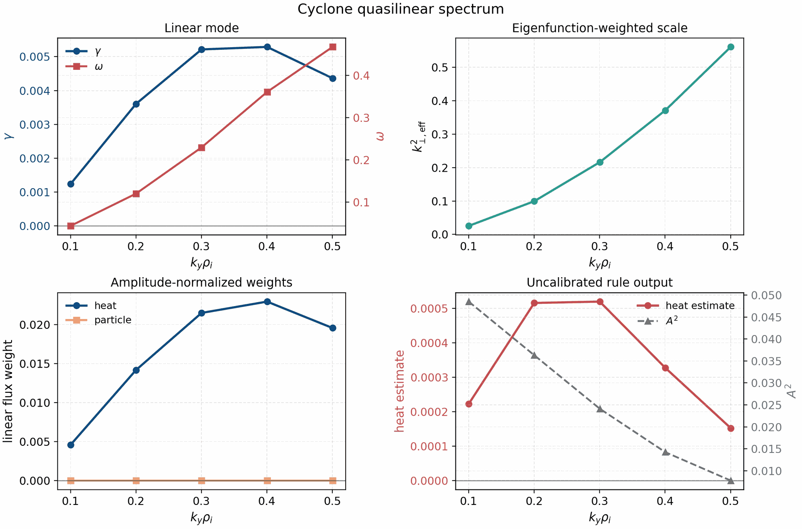

This panel is generated from `examples/linear/axisymmetric/runtime_cyclone_quasilinear.toml`.
It shows linear growth/frequency, eigenfunction-weighted `k_perp`, amplitude-normalized
heat/particle flux weights, and an explicitly uncalibrated mixing-length output. The
absolute saturated-flux claim remains gated on nonlinear train/holdout calibration.
The first Cyclone nonlinear audit is tracked in `docs/quasilinear.rst` and is
kept at `training_or_audit_only` until a held-out calibration set passes.

The manuscript-facing quasilinear calibration panel now uses the full admitted
electrostatic portfolio: two training geometries and six held-out nonlinear
windows spanning tokamak, stellarator, and external-VMEC cases.

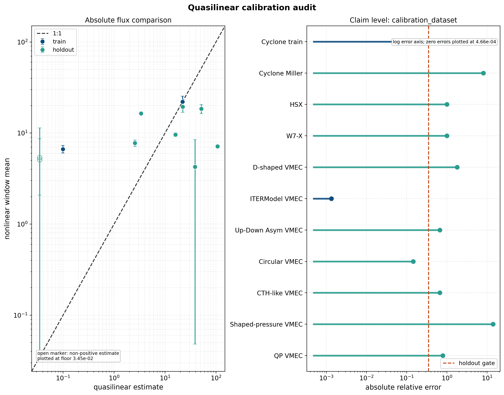

The current training set is Cyclone plus the external-VMEC ITERModel case; the
holdouts are Cyclone Miller, HSX, W7-X, D-shaped VMEC, up-down asymmetric VMEC,
and circular VMEC. This is a stronger transfer test than the earlier
Cyclone-only fit: nonlinear input validation now passes, but the fitted
one-constant mixing-length model still fails the held-out absolute-flux gate
with mean relative error about `2.11`. The circular holdout itself is predicted
well by the scaled one-constant diagnostic, but the aggregate model remains
blocked by the other held-out cases. The best current one-scalar saturation
rule remains worse than the training-mean null baseline (`2.11` versus `1.20`),
so SPECTRAX-GK does not promote any simple or user-facing absolute quasilinear
flux predictor from that legacy family.

The richer held-out candidate is now the reduced `spectral_envelope_ridge`
model below. It uses only two linear-spectrum envelope features, reaches mean
relative error about `0.295`, and clears the leave-one-geometry-out
interval-coverage gate at `7/8` on the current eight-case electrostatic portfolio. That
is the current manuscript model-selection result: the simple rules are rejected,
but a small spectrum-aware candidate is accepted as a scoped research candidate.
The model-selection status also consumes the selected optimized-equilibrium
nonlinear audit as local transport evidence, but it is not a runtime/TOML
absolute-flux predictor or universal saturation law.

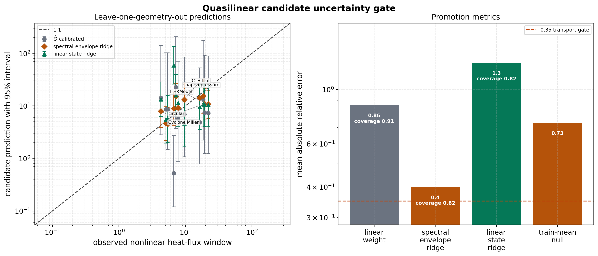

The companion holdout-gap report makes the remaining promotion blocker
explicit instead of hiding it in the calibration plot. Six holdouts are
admitted and the scoped model-selection gate passes, but the current absolute
heat-flux calibration still fails the aggregate holdout gate (`2.11 > 0.35`).
The next useful data product is therefore another independent, converged
electrostatic nonlinear holdout, preferably in the external-VMEC family, not
another unvalidated fit parameter.

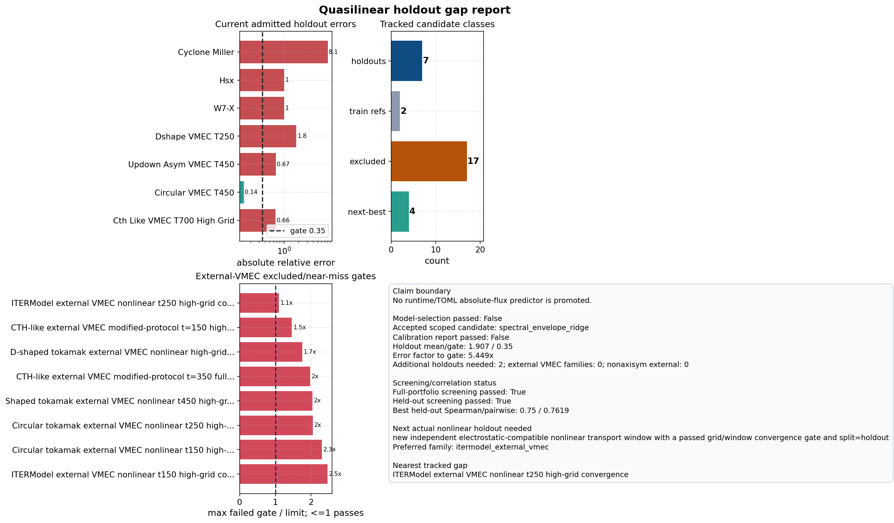

The runbook below converts that gap into a fail-closed nonlinear launch plan.
It is a planning artifact only: admission still requires the resulting
post-transient traces to pass the grid/window convergence gate and enter the
calibration metadata as `split = holdout`.

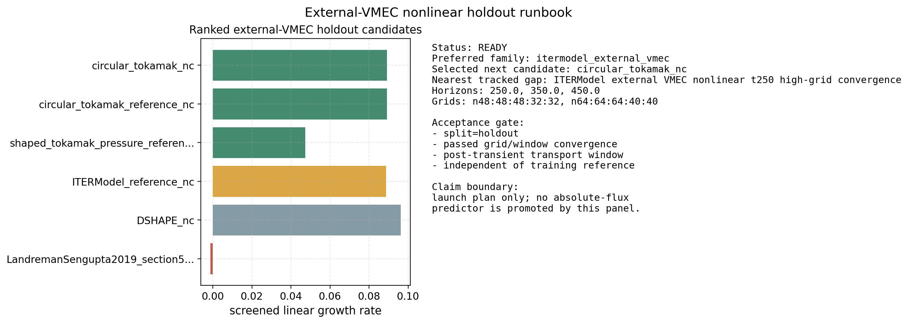

The latest new-family shaped-tokamak pressure candidate was run to `t=450` on
the office GPUs at `48x48x32` and `64x64x40`. It is finite and late-window
stable, but it is not admitted: the two grid levels differ by about `0.306` in
both common-window and least-window heat-flux means, above the `0.15`
convergence gate. The runbook now demotes unchanged reruns of that failed
family. The follow-on ITERModel `t=450` same-family audit passed
(`0.056`/`0.055` common/least grid differences), so the runbook no longer
relaunches that unchanged audit; it records that the next useful data product
must be a different independent electrostatic VMEC holdout or a materially
changed high-resolution protocol.

Two of the strongest admitted external-VMEC nonlinear holdouts are shown below.
These figures are part of the publication-facing evidence that the nonlinear
inputs are converged enough to be used as negative transfer constraints rather
than as exploratory pilots.

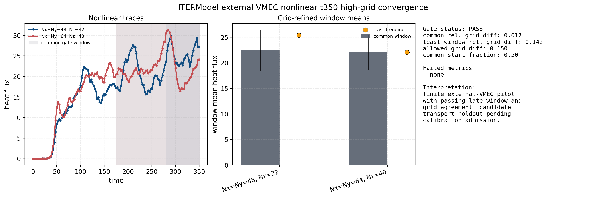

The ITERModel external-VMEC case closes at `t=350` on the `48x48x32` to
`64x64x40` ladder. Its common-window grid difference is about `0.0165`, the
least-window difference is about `0.1415`, and the trend/CV/sample-count gates
all pass.

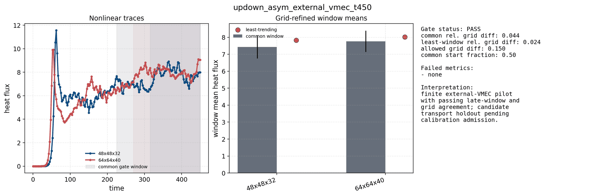

The up-down asymmetric external-VMEC tokamak closes at `t=450` on the same
ladder. Its common-window and least-window relative differences are about
`0.0435` and `0.0242`, respectively.

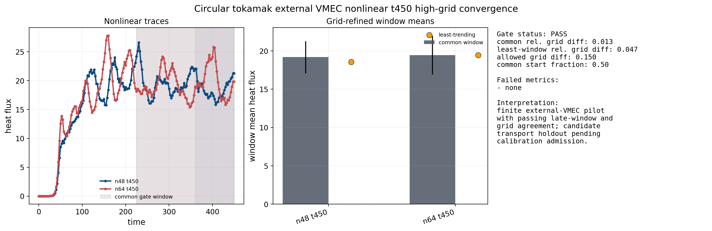

The circular external-VMEC tokamak initially failed the shorter `t=150` and
`t=250` admission gates, then closes at `t=450` on the same high-grid ladder:
the common-window and least-window grid differences are about `0.0128` and
`0.0468`. These admitted windows strengthen the quasilinear calibration dataset
without changing the core conclusion: the current absolute-flux model is still
a rejected research candidate, not a shipped predictive transport law.

The follow-up seed/timestep replicate gate initially failed at `t=450` because
one seed still had a drifting terminal window. Extending the same three
replicas to `t=700` closes the physical readiness gate on `t=[350,700]`: the
ensemble mean heat flux is `18.97`, mean relative spread is `0.035`, and
combined SEM/mean is `0.043`.

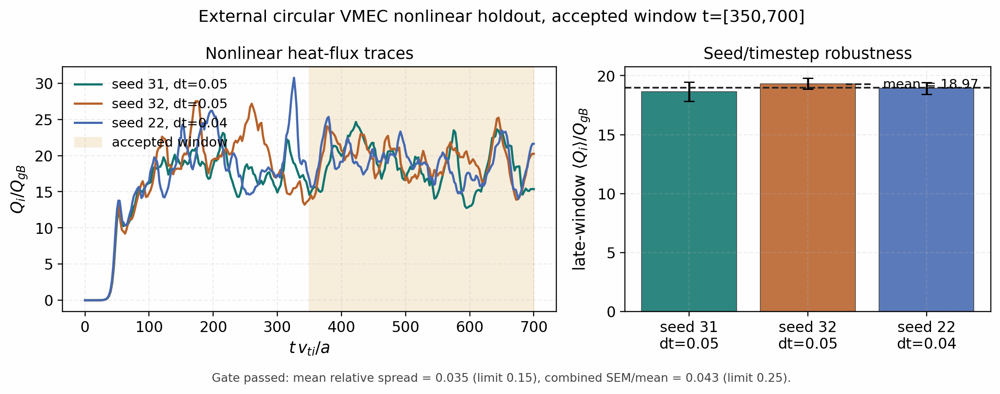

Autodiff validation (inverse/sensitivity demo):


This single-mode figure checks that the JAX derivatives are correct and shows how one measured mode constrains the gradients locally. The expected outcome is small observable and Jacobian errors, not exact parameter recovery; the shipped result is a near-perfect match in `(γ, ω)` but a visibly non-unique recovered `(R/L_Ti, R/L_n)` pair.

Autodiff validation (two-mode inverse demo):


This two-mode figure is the actual parameter-recovery validation, where the goal is to recover the planted gradients from two independent mode observables. The shipped result reaches the target to numerical precision and the autodiff Jacobian matches finite differences, which is the behavior expected from an identifiable inverse problem.

Single-point runtime TOMLs can also carry their own artifact prefix:

```toml
[output]
path = "tools_out/runtime_case"
```

The executable `--out` flag overrides the TOML value when both are present.

The shipped nonlinear W7-X and HSX runtime TOMLs already set this lightweight
artifact prefix, so long stellarator parity runs leave ``tools_out/...``
diagnostics and summaries behind without extra command-line flags. The direct Python
case wrappers now honor that TOML output contract as well, so chunked
nonlinear runs persist their evolving diagnostics through the same path.

When the nonlinear target ends in `.out.nc` or another `.nc` suffix,
SPECTRAX-GK writes a restartable NetCDF bundle, compatible with the comparison
tooling, instead of the lightweight JSON/CSV sidecars:

- `case.out.nc`: resolved nonlinear diagnostics and metadata
- `case.big.nc`: final fields and moments in real and spectral layouts
- `case.restart.nc`: restart state for continuation runs

The same runtime input can then resume from the saved restart file by setting
restart controls in the TOML:

```toml
[time]
nstep_restart = 100

[output]
path = "tools_out/cyclone_release.out.nc"
restart_if_exists = true
save_for_restart = true
append_on_restart = true
restart_with_perturb = false
```

With that configuration, rerunning the same command resumes from
`tools_out/cyclone_release.restart.nc` when it already exists and appends the
new samples to `tools_out/cyclone_release.out.nc`. Restart appends preserve the
persisted NetCDF diagnostic schema; transient in-memory traces that are not
written to `.out.nc` are not reintroduced when an existing artifact is loaded
for continuation.

## Quickstart (Python)

```python
from spectraxgk import CycloneBaseCase, LinearParams, integrate_linear_from_config
from spectraxgk.geometry import SAlphaGeometry
from spectraxgk.grids import build_spectral_grid
import jax.numpy as jnp

cfg = CycloneBaseCase()
grid = build_spectral_grid(cfg.grid)
geom = SAlphaGeometry.from_config(cfg.geometry)
params = LinearParams()

G0 = jnp.zeros((2, 2, grid.ky.size, grid.kx.size, grid.z.size), dtype=jnp.complex64)
G0 = G0.at[0, 0, 0, 0, :].set(1.0e-3 + 0.0j)

G_t, phi_t = integrate_linear_from_config(G0, grid, geom, params, cfg.time)
```

## Autodiff demo and parallelization notes

The autodiff inverse/sensitivity example lives at
`examples/theory_and_demos/autodiff_inverse_growth.py` and generates the
figure shown above. It uses JAX autodiff on a short linear ITG window, reports
gradients against a finite-difference check, and writes a summary JSON plus
parameter sweeps for both `R/L_Ti` and `R/L_n` alongside the plot. The
single-mode panel should be read as a local inverse demo, not as a global
identifiability claim; in the shipped figure the observable errors are small
while the parameter errors remain finite for exactly that reason.
The two-mode inverse example in
`examples/theory_and_demos/autodiff_inverse_twomode.py` uses two ky modes to
stabilize the inverse problem and provides the release-grade parameter
recovery panel, closing the identifiability gap present in the single-mode
demo. Both autodiff examples now report finite-difference Jacobian checks,
Jacobian rank/conditioning, covariance, standard deviations, correlations, and
one-sigma UQ ellipse area in their summary JSON files.

The differentiable geometry bridge example lives at
`examples/theory_and_demos/differentiable_geometry_bridge.py` and writes the
publication artifact below. It validates the in-memory
`vmec_jax`/`booz_xform_jax` bridge contract used by stellarator optimization
workflows: solver-ready field-line arrays remain JAX-traceable, geometry
observable sensitivities match central finite differences, a two-parameter
inverse design recovers the target observables, and the local UQ covariance is
reported. When `vmec_jax` is available, the same artifact also checks a real
VMEC boundary-aspect derivative through its boundary Fourier API and real VMEC
metric-tensor derivatives through `vmec_jax.geom.eval_geom`. It also samples a
real stellarator VMEC field line from `vmec_jax` metric and magnetic-field
tensors to check that state-level geometry sensitivities reach field-line
observables before any SPECTRAX-GK closure approximation is introduced. The
same path now emits a direct VMEC tensor-derived SPECTRAX-GK flux-tube mapping
and checks its geometry-observable sensitivities against finite differences,
so the differentiability chain starts at `vmec_jax` state coefficients rather
than only at a Boozer spectral adapter. The validation artifact also records a
direct-VMEC-tensor vs imported-VMEC/EIK array-parity audit. A new
`vmec_jax -> booz_xform_jax` Boozer equal-arc core audit now matches the
imported convention for `bmag`, `bgrad`, `gradpar`, `q`, `s_hat`, and the
solver Jacobian at the percent level on the tracked stellarator fixture; the
same audit now reconstructs the zero-beta Boozer metric profiles `gds*`/`grho`
with worst normalized mismatch `3.45e-2` and the loaded-convention zero-beta
drift profiles `cvdrift`/`gbdrift`/`cvdrift0`/`gbdrift0` with worst normalized
mismatch `3.50e-2`. The remaining geometry promotion work is finite-beta and
broader production-runtime drift parity beyond the tracked zero-beta equal-arc
fixtures. When
`booz_xform_jax` is available, it also runs a bounded JAX-native Boozer
spectral transform, samples the resulting Boozer `|B|` spectrum onto a
field-line flux-tube mapping, and checks both derivative paths against central
finite differences. When both optional backends are available, the artifact
also starts from a real `vmec_jax` `VMECState`, perturbs VMEC Fourier
coefficients, converts that state through `booz_xform_jax`, and differentiates
the resulting SPECTRAX-GK field-line geometry observables against central
finite differences. The remaining promotion gate is exact production drift
parity with the imported VMEC/EIK runtime path and then multi-equilibrium
transport-gradient and nonlinear-window gates through the solver.

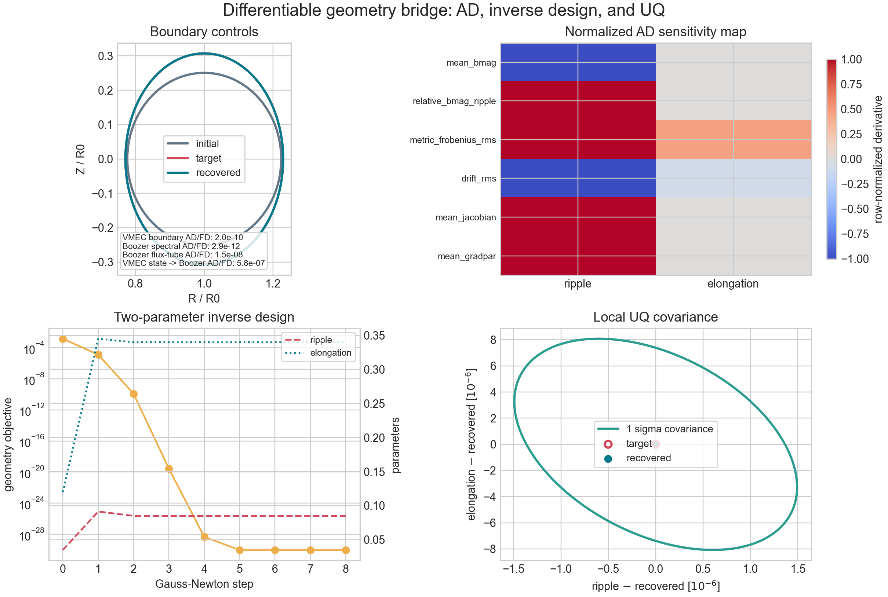

A separate mode-21 parity matrix checks the same Boozer equal-arc path on the
tracked QH, fixed-resolution QI, and shaped-tokamak fixtures. The matrix is
generated by `tools/build_vmec_boozer_parity_matrix.py` and enforces
`mboz,nboz >= 21`. The current regenerated artifact passes all matrix rows. The
evaluated QI robustness variants (`ntheta=8,16`) pass, while three QI input
seeds remain explicitly marked `missing_bundled_wout_reference` rather than
being silently promoted. This is a field-line geometry convention gate, not a
production stellarator-transport-gradient claim.

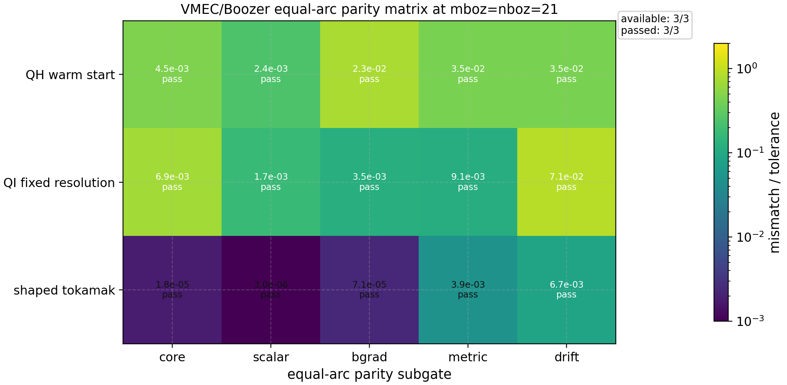

The solver-objective geometry-gradient gate differentiates actual
electrostatic linear-RHS eigenpair observables with respect to solver-ready
geometry arrays and checks the implicit left/right eigenpair sensitivities
against central finite differences. This closes the production solver contract
for `FluxTubeGeometryData` gradients. The companion full-chain gate starts
from a real `vmec_jax` state coefficient, maps through `booz_xform_jax`
with `mboz=nboz=21`, builds the SPECTRAX-GK linear RHS, and verifies the
linear eigenfrequency gradient against central finite differences. The
full-chain quasilinear gate uses a richer `Nl=2, Nm=3` moment basis and
checks `gamma`, `omega`, `<k_perp^2>`, the electrostatic heat-flux weight, and
`gamma Q_i/k_perp^2` against central finite differences with maximum relative
error `4.3e-3`. These are differentiability checks on reduced solver
observables and an uncalibrated heat-flux proxy, not calibrated absolute-flux
predictions. This closes the reduced linear/quasilinear stellarator
objective-gradient path on the tracked all-surface QH fixture. A second Li383
holdout now passes the same frequency and quasilinear VMEC/Boozer gradient
contracts at `mboz=nboz=21`; the combined holdout matrix has maximum relative
AD/finite-difference mismatch `4.9e-3` across the reduced linear/quasilinear
objectives. Companion QH and Li383 reduced nonlinear-window estimator gates
differentiate a smooth late-window heat-flux envelope through the same
`vmec_jax -> booz_xform_jax -> SPECTRAX-GK` state path; the expanded matrix
including those estimator rows has maximum relative mismatch `2.7e-2`. That
closes a multi-equilibrium bounded differentiability check for
nonlinear-window-style reduced objectives, but it is not a converged nonlinear
turbulence-gradient or optimized-equilibrium transport claim.

A compact nonlinear finite-difference audit now runs actual SPECTRAX-GK
nonlinear Cyclone startup windows at `R/LTi = base +/- step` plus a repeated
base run. It passes finite-output, repeatability, monotonic drive-response,
startup-window CV/trend, and resolved finite-difference-response gates with
response/base about `0.111`. This is only a startup-response plumbing and
conditioning check. It is not a production heat-flux average, VMEC/Boozer
nonlinear state-gradient, or optimized-equilibrium transport claim.

A companion VMEC/Boozer-perturbed audit starts from the real mode-21
`vmec_jax -> booz_xform_jax` QH state bridge, writes perturbed sampled
geometries to temporary NetCDF files, and runs compact nonlinear startup windows
at `Rcos_mid_surface_m1 = base +/- 1e-5`. It passes finite-output,
repeatability, startup-window conditioning, geometry-response, and resolved
central finite-difference response gates with response/base about `0.040`. The
forward/backward response is asymmetric and not monotone, so this is only a
VMEC/Boozer geometry-perturbed startup observable-path audit. It is not promoted
as a local nonlinear gradient, optimized-equilibrium audit, or production
heat-flux stellarator optimization claim. A memory-bounded Boozer surface
stencil exists for diagnostics and large-equilibrium probes, but it is not used
for the published linear/quasilinear accuracy claim.

For nonlinear transport claims, heat flux must be measured as a long-time
post-transient running average. The gate for future production heat-flux
optimization requires discarding the initial transient, retaining enough
post-transient samples, checking that the cumulative running mean and
independent late blocks are stable, and comparing the same late window against
the tracked nonlinear reference cases. The short FD audits above explicitly
record `transport_average_gate = false` to avoid treating startup-scale fluxes
as saturated transport.


The reduced VMEC/Boozer optimization path also has aggregate guardrails. The
multi-point gate below checks a quasilinear objective over two field lines and
two `k_y` samples at `mboz=nboz=21`; the growth-vs-quasilinear comparison shows
that growth-rate and quasilinear objectives can choose different initial VMEC
coefficient directions. The current promotion gate is therefore intentionally
blocked until an independent production-grade held-out surface or field-line
artifact passes. The alpha-heldout split shown below is a positive reduced
field-line generalization check, but it is still not a nonlinear transport
optimization claim. The surface-heldout split extends this to a true
held-out `surface_index`, and the Li383 panel checks that the same aggregate
finite-difference plus line-search machinery works on a second equilibrium.


The backend-free portfolio reducer below is the lightweight contract that
multi-surface, multi-field-line, multi-`k_y` stellarator optimization drivers
should satisfy before they rely on expensive VMEC/Boozer row producers. It checks
normalized sample/objective weights and AD/JVP/finite-difference consistency
for the aggregate scalar objective; it is not a VMEC/Boozer or nonlinear
turbulent-transport optimization claim by itself.


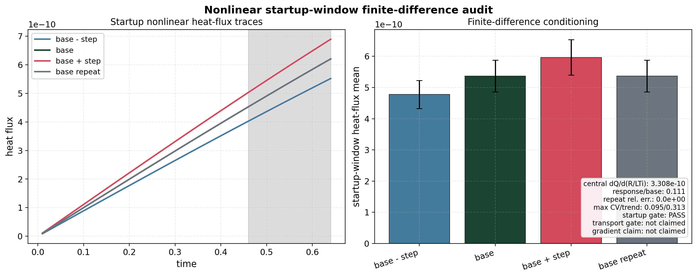

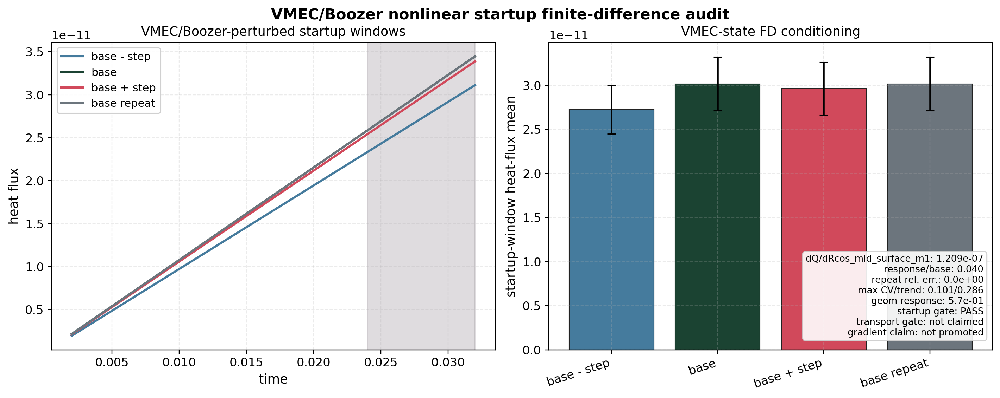

The nonlinear time-horizon audit below separates long post-transient transport
windows from startup plumbing checks and reduced nonlinear-envelope examples.
The external nfp4 QH pilot has now been extended to `t=150`, where its late
heat-flux window is meaningful rather than noise-floor-scale; it remains a
feasibility result because the `48x48x32` grid check changes the late
heat-flux level by about `52%`, and the follow-on `64x64x40` check changes it
again by about `63%`. QH is therefore excluded from quasilinear calibration
until a separate grid/window-converged transport gate passes. A new D-shaped
tokamak external-VMEC candidate now passes the longer `t=250` high-grid gate:
`48x48x32` and `64x64x40` differ by `13.9%` on the common late window and
`10.8%` on independently selected least-trending windows. A follow-up
seed/timestep replicate campaign on the `64x64x40`, `t=250` D-shaped case
passes the late-window ensemble gate on `t=[170,250]`: the three accepted
windows have mean heat fluxes `18.8`, `20.8`, and `18.1`, with mean relative
spread `0.141` below the `0.15` gate. A circular external-VMEC replicate
campaign required a longer horizon: the `t=450` ensemble spread was already
small, but seed31 failed terminal-window stationarity, so the accepted artifact
is the `t=700`, `t=[350,700]` replicate with mean relative spread `0.035` and
combined SEM/mean `0.043`. The selected optimized QA equilibrium was then run
through the same long-window protocol at `n64` with two seed replicates and one
timestep replicate. Its accepted `t=[350,700]` window has ensemble mean ion
heat flux `10.19`, mean-relative spread `0.038`, and combined SEM/mean `0.021`.
This is a passed post-transient optimized-equilibrium audit; it is not a
universal absolute-flux model and should be compared case-by-case against the
chosen baseline objective and geometry family.

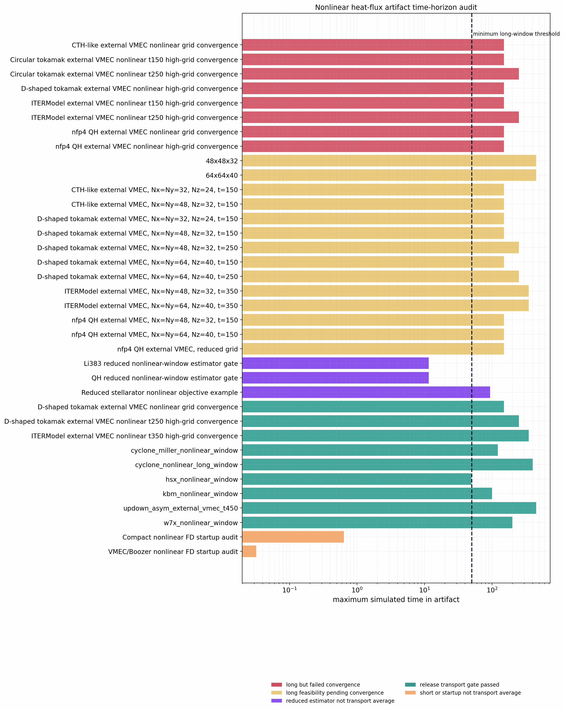

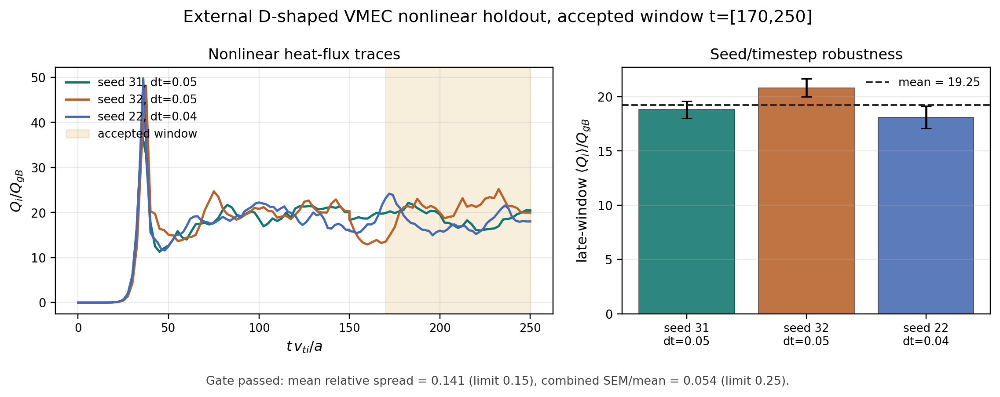


The matched no-ESS reference from the same `vmec_jax` QA campaign also passes
the same `t=[350,700]` seed/timestep ensemble gate. Against that finite-transform
reference, the optimized QA/ESS equilibrium reduces the late-window ion heat
flux from `12.50` to `10.19`, a relative reduction of `18.4%` with `7.82`
combined-SEMs separation.


An earlier aspect-6 projected VMEC-JAX transport-gradient step is documented
separately as a negative transfer audit: the reduced single-sample transport
metric improves by `3.55%`, but the matched long-window `t=[350,700]`
nonlinear ensemble comparison changes the mean heat flux from `9.833` to
`9.891` (`-0.585%` relative reduction). That older candidate is not promoted
as a nonlinear heat-flux optimum. The newer full max-mode-5 projected
weight-`5e-4` and `1e-3` audits above are positive at one `(s, alpha, ky)` point,
and the same redesign principle still applies before broad claims: cover three
surfaces, two field-line labels, and three `ky` values before promoting a
general turbulent-flux optimization result.

The production nonlinear optimization guard below is the enforced claim
boundary. It passes as a release-safety check because startup/reduced nonlinear
artifacts are scoped correctly and two long post-transient replicated holdout
ensembles pass. With the optimized-equilibrium `t=[350,700]` seed/timestep
replicate now attached, the selected optimized-equilibrium transport audit also
satisfies this guard. The claim remains bounded: this proves
that the selected optimized equilibrium has a converged replicated nonlinear
transport-window audit, not that the current quasilinear model is a universal
absolute-flux predictor or that nonlinear turbulence gradients are available.
The separate nonlinear turbulence-gradient evidence gate is stricter and
remains fail-closed after the completed QA/ESS overdetermined control campaign,
the targeted `RBC(1,1)` seed follow-up, and the bounded `ZBS(1,0)` `7.5%`
follow-up. The overdetermined `RBC(1,1)` candidate is local and
response-resolved but remains too uncertain after five-member state ensembles
(`gradient_uncertainty_rel = 0.683 > 0.5`). The newer `ZBS(1,0)` `7.5%`
follow-up is the clearest locality result: all 12 `t=900` outputs pass, the
response is resolved (`response_fraction = 0.0319`), and the finite-difference
bracket is local (`fd_asymmetry_rel = 0.044`). It still fails promotion because
the plus-state spread is too large (`mean_rel_spread = 0.196 > 0.15`) and the
propagated uncertainty is too high (`gradient_uncertainty_rel = 1.81 > 0.5`).
The current release therefore documents nonlinear turbulence-gradient evidence
as rigorous negative/model-development results, not as a promoted production
nonlinear-gradient or full nonlinear turbulent-flux optimization claim.

The next scientifically efficient step is not another blind single-coefficient
rerun. The tracked design artifact recommends keeping the claim fail-closed and
moving to explicit variance reduction, a control-variate observable, or a
better-conditioned multi-control direction before another expensive production
campaign.
A companion composite-direction manifest defines a smaller descent-oriented
QA/ESS boundary direction with the same long-window contract; that audit also
remains fail-closed after its plus-state spread and central-FD gates.
The newer QL-seeded VMEC-state screen admits `Rsin_mid_surface_m1` and
`Zcos_mid_surface_m1` as internal state-control seeds only. The first
state-to-input attempt deliberately failed closed: stellarator-symmetric
`RBC/ZBS` perturbations produced zero response in those asymmetric
`Rsin/Zcos` controls. The follow-up `LASYM=true` branch now writes and solves
four `RBS/ZBC` perturbation families, measures a full-rank `2 x 4` response
matrix with condition number `1.02`, and updates the state-control runbook with
two mapped input-control directions. This closes the mapping guardrail for
short-bracket nonlinear-gradient launches; it is not yet a promoted converged
nonlinear turbulence-gradient or optimized-equilibrium transport claim. The
checked short-bracket launch contract has also been written and its VMEC decks
have solved normally, preparing two bounded nonlinear campaign manifests for
the next evidence step. Those short-bracket nonlinear campaigns have now been
run on the office GPUs: all `18` nonlinear outputs completed, all output and
replicated-window gates passed, but both central finite-difference gates remain
blocked because `alpha_delta=1e-3` gives small response fractions
(`0.0045` and `0.0015`) with large finite-difference asymmetry. The follow-up
bracket-amplitude sweep also completed all `36` office GPU runs at
`alpha_delta=3e-3` and `1e-2` with no runtime failures. It still passes output
and ensemble gates but fails all four central finite-difference gates; the best
response fraction is only `0.0045`, far below the `0.03` resolved-response
gate. This closes the larger-single-bracket hypothesis as negative evidence;
the next nonlinear-gradient step is variance reduction, longer replicated
windows, or a better-conditioned multi-control observable, not promotion of
this single-control gradient. The bounded `ZBS(1,0)` follow-up at a `7.5%`
bracket has now been run with `12` long `t=900` office-GPU outputs. All output
gates pass over `t=[450,900]`; the baseline and minus ensembles pass, but the
plus ensemble fails the spread gate (`mean_rel_spread = 0.196 > 0.15`) and the
central finite-difference gate remains blocked by propagated uncertainty
(`gradient_uncertainty_rel = 1.81 > 0.5`). This is useful negative evidence:
the response is finally resolved (`response_fraction = 0.0319`) and local
(`fd_asymmetry_rel = 0.044`), but the plus-state variance is still too large
for a production nonlinear turbulence-gradient claim. The refreshed
next-campaign design panel now includes all `16` tracked central-FD artifacts:
zero promoted nonlinear-gradient controls, one legacy bounded-replica follow-up
candidate, and `15` cases that need replacement, locality repair, or variance
reduction before further long-window GPU time is justified. The current
top-level action is now paired-seed or control-variate variance reduction for
the plus-state limiter, not another blind long-window replica campaign. The
paired-seed runbook confirms that common-label plus-minus differences reduce
some common noise but are still too uncertain
(`paired_response_uncertainty_rel = 0.984`). A midpoint common-mode
control-variate screen is promising
(`adjusted_response_uncertainty_rel = 0.238`, `sem_reduction_fraction = 0.759`),
and the independent follow-up now closes that specific uncertainty blocker.
The `21` matched plus/minus control-mean pairs (`42` nonlinear continuations)
pass the strict late-window gate over `t=[600,1100]`: plus/minus ensemble
spread is below `0.15`, no per-seed window rows fail, and the combined
response uncertainty is `0.311 < 0.5`. This closes the
rel7.5 variance-reduced nonlinear-gradient evidence lane, not a broad
nonlinear turbulent-flux optimization claim.


The control-variate campaign has both a launch contract and a completed
independent control-mean gate for the rel7.5 evidence lane. The post-run
reduction is automated by
`tools/postprocess_nonlinear_gradient_control_mean_campaign.py`, which requires
the full matched plus/minus seed set with outputs reaching the final
post-transient window before producing the final control-mean gate. It accepts
stride-rounded final times but rejects intermediate checkpoint chunks.


Differentiable stellarator ITG optimization examples live in
`examples/optimization/` and are restricted to actual VMEC-JAX QA workflows:
linear-growth, quasilinear-flux, nonlinear-window transport-objective scripts,
and the guarded VMEC-JAX QA driver. Full
`vmec_jax -> booz_xform_jax -> SPECTRAX-GK` nonlinear optimization remains
scoped to production nonlinear turbulence-gradient or robust finite-difference
audits with converged post-transient heat-flux windows, continued
curvature/drift parity on additional equilibria, and matched
baseline-to-optimized nonlinear audits for broader geometry families.

For production parallelization of independent work, use
`spectraxgk.batch_map` / `spectraxgk.ky_scan_batches` for ky scans,
sensitivity sweeps, and UQ ensembles. Runtime `k_y` scans can select the same
independent-worker path from TOML:

```toml
[parallel]
strategy = "batch"
axis = "ky"
num_devices = 4      # or batch_size = 4
backend = "auto"     # "thread" or "process" are explicit alternatives
```

This path preserves serial ordering and uses independent solver calls; it does
not change the solver layout. Whole-state fixed-step nonlinear sharding through
`TimeConfig.state_sharding = "auto"` (or `"ky"` / `"kx"`) remains a
correctness/profiler path for partitioning the packed state array across JAX
devices. It is intentionally limited to state axes: sharding across the `z` FFT
axis is tracked as a future domain-decomposition lane because it requires a
separate communication/layout design. The current profiler-backed artifacts are
`docs/_static/nonlinear_sharding_profile.json` for the local control-flow gate
and `docs/_static/nonlinear_sharding_profile_office_gpu.json` for the two-GPU
office identity gate. Treat both as engineering gates, not as runtime speedup
claims. The matched large strong-scaling sweep in `docs/performance.rst`
confirms this conservative stance: whole-state nonlinear sharding is
identity-correct, but only modestly useful on logical CPUs and slower on two RTX
A4000 GPUs for the current decomposition. Production parallelization should
therefore focus on independent `k_y` scans, quasilinear studies, sensitivity
sweeps, and UQ/ensemble batching until a communication-aware nonlinear
decomposition has its own identity and throughput evidence.

For UQ and optimization portfolios, `spectraxgk.independent_ensemble_provenance_gate`
is the production identity/provenance check. It runs serial and
`independent_map` ensemble members, verifies result ordering and numerical
identity, checks worker clipping for oversubscribed requests, validates
deterministic reconstruction through the independent-work decomposition
contract, and confirms worker-exception metadata.


The ky-batch gate above is generated by
`python tools/generate_parallel_ky_scan_gate.py`. It runs the real Cyclone
linear solver serially and with fixed-shape ky batching, verifies numerical
identity for `gamma` and `omega`, and reports the observed batch speedup for
engineering tracking.


The large independent-`k_y` strong-scaling panel uses the real Cyclone linear
solver on 64 modes with `Ny=128`, `Nz=96`, `Nl=4`, `Nm=8`, and `240` RK2
steps per mode. It passes exact `gamma`/`omega` identity against the one-worker
reference. The refreshed release artifact reaches `7.18x` on eight local CPU
workers and `1.88x` on two RTX A4000 GPUs on `ssh office`. This is the preferred
production parallelization path for linear scans, quasilinear studies,
sensitivity sweeps, and UQ ensembles.


The closure status above is regenerated by
`python tools/build_parallelization_completion_status.py`. It marks independent
`k_y` scans and quasilinear/UQ ensembles as production-closed, while keeping
whole-state nonlinear sharding and FFT-axis decomposition diagnostic until they
have runtime communication, conservation, transport-window, and profiler-backed
speedup gates. The status JSON also embeds the UQ/optimization ensemble
provenance gate so the production independent-work lane is closed on ordering,
worker clipping, exception metadata, and deterministic reconstruction, not only
speedup and scalar identity.

The decomposition-contract gate below is the lower-level correctness ledger for
parallel work partitioning. It confirms deterministic shard assignment and
serial reconstruction identity for independent `k_y` and UQ portfolios, while
labeling nonlinear state-domain partitioning as diagnostic metadata only.

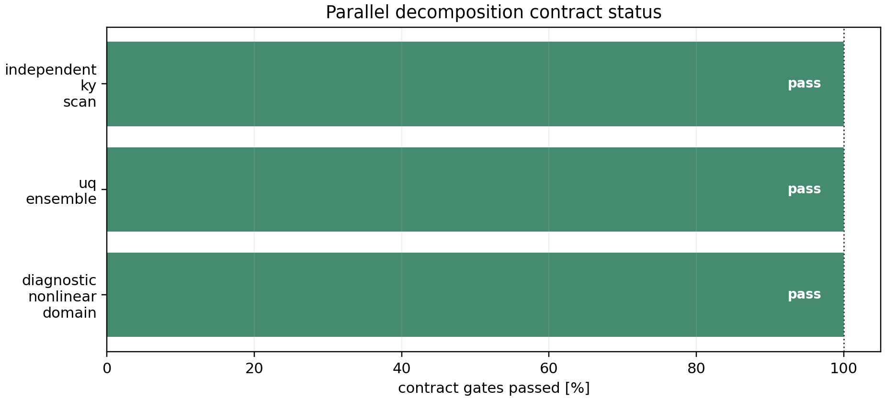


The quasilinear/UQ ensemble panel applies the same independent-worker policy
to six late-time Cyclone ITG gradient samples and five `k_y` values per sample
at `Ny=96`, `Nz=64`, `Nl=3`, `Nm=6`, and `2000` RK2 steps. It computes real
linear growth/frequency fits and a reduced mixing-length feature observable,
then checks exact serial identity. On `ssh office`, CPU process scaling reaches
`5.41x` on eight requested workers using six actual ensemble chunks, and the
two-RTX-A4000 GPU run reaches `1.71x`. This is a parallelization and UQ
plumbing result, not a promoted absolute nonlinear heat-flux model.

## Benchmarks

SPECTRAX-GK is validated against standard gyrokinetic benchmarks within the
tracked release scope:

- **Linear growth rates, frequencies, and eigenfunctions:** release-atlas cases
  including Cyclone ITG, ETG, KBM, W7-X, HSX, and shaped tokamak coverage.
- **Nonlinear transport windows:** release-gated heat-flux and energy statistics
  for Cyclone, Cyclone Miller, KBM, W7-X, and HSX.

The benchmark tooling in `tools/` ensures reproducibility and performance tracking.
For the current release pass, the accepted nonlinear validation set is Cyclone,
Cyclone Miller, KBM, W7-X, and HSX. Full-GK ETG nonlinear pilots, TEM/KAW stress
lanes, kinetic-electron extensions, and W7-X zonal-flow recurrence/damping stay
outside the active release parity claim unless a gate-indexed artifact promotes
them explicitly.
The window-statistics artifact uses case-specific mean-relative gates: KBM
`0.02`, HSX `0.05`, Cyclone Miller `0.095`, and the broader release envelope
`0.10` for Cyclone and W7-X while their paper-level tightening lanes remain
open.

## Runtime and Memory Details

Experimental or not-yet-closed lanes such as KAW, TEM, and kinetic-electron
Cyclone are tracked separately and do not appear in the shipped runtime panel.
For the stellarator rows on `office`, the shipped panel uses pre-generated
`*.eik.nc` geometry files rather than on-the-fly VMEC regeneration. The GX
reference rows also run against a consistent local `netcdf-c` / `hdf5`
runtime stack there, because the default `office` stellarator environment
mixed incompatible HDF5 / NetCDF libraries and lacked the VMEC Python helper
dependencies needed for live geometry generation.

These shipped runtime rows are cold wall-time measurements, so the SPECTRAX-GK
nonlinear GPU entries include JAX startup/compile cost. Targeted `office` GPU
profiles on the same short nonlinear cases measured:

- Cyclone nonlinear: `warmup_time_s = 33.957`, `run_time_s = 15.054`
- KBM nonlinear: `warmup_time_s = 27.485`, `run_time_s = 9.725`

This means the current short-run Cyclone and KBM gaps are dominated much more
by cold-start overhead than by steady-state timestep throughput. In steady
state, Cyclone GPU is faster than the shipped GX runtime row, and KBM GPU is
close to parity.
The hollow diamond markers in the runtime subplot show those warm second-run
timings on top of the cold wall-time bars.

### Kernel profiling and gated fast modes


The current profiler splits the nonlinear RHS into field solve, linear RHS,
nonlinear bracket, and full RHS kernels on CPU and GPU. The latest bounded
Cyclone profile shows the compiled linear RHS, nonlinear bracket, and full RHS
are the dominant warm-throughput targets, while GPU execution reduces all
measured RHS kernels. The
companion JSON artifact records dominant kernels and grid-to-spectral speedups
so the optimization lane remains traceable and machine-checkable.

The next profiler layer resolves the linear RHS into individual term kernels.
The tracked Cyclone CPU artifact (`docs/_static/linear_rhs_terms_profile.json`)
now includes the zero-collision fast path and linked-FFT refactor and reports
`full_linear_rhs=1.08e-1 s` in the bounded CPU harness. The active-state
companion
(`docs/_static/linear_rhs_terms_profile_z_wave_cpu.json`) injects resolved
parallel variation and reports `full_linear_rhs=1.27e-1 s` while showing
linked-`|k_z|` hypercollisions becoming active; apart from the accepted
zero-collision guard, zero-norm initial-state rows
remain enabled until a state-window identity gate proves they remain inactive
after nonlinear evolution. The
matching `office` GPU artifact
(`docs/_static/linear_rhs_terms_profile_gpu.json`) reports
`full_linear_rhs=5.50e-3 s` on one RTX A4000, and the active-state GPU
companion reports `5.48e-3 s` while reproducing the linked-`|k_z|`/
hypercollision norm match.

The tracked state-window gate
(`docs/_static/linear_rhs_zero_norm_state_window_gate.json`) now makes that
policy executable: it accepts a zero-collision skip for the `nu=0` Cyclone
window but rejects skipping linked-`|k_z|` hypercollisions once a resolved
parallel perturbation is present.

A larger Cyclone Miller companion profile is documented in
`docs/performance.rst` and tracked as
`docs/_static/nonlinear_rhs_profile_miller.{png,json}`. It uses
`Nx=192`, `Ny=64`, `Nz=24`, `Nl=4`, `Nm=8`. After the grid-Laguerre
`einsum` refactor, the matched one-GPU profile gives `full_rhs=1.28e-2 s` in
grid mode and `1.48e-2 s` in spectral mode. Spectral mode still reduces the
GPU nonlinear bracket by about `1.63x`, but the full-RHS timing is limited by
the combined linear-RHS/bracket graph, so the next optimization target is
linear-RHS fusion/cache layout before any broader nonlinear speedup claim.
The matched W7-X/HSX runtime-mode stellarator profiler artifact
(`docs/_static/nonlinear_rhs_profile_stellarator_runtime.json`) records W7-X
and HSX GPU full-RHS calls near `2.7e-2 s` versus CPU calls near `3.1e-1 s`;
those rows close the release-level performance evidence while keeping broader
production nonlinear speedup claims scoped to future profiler-gated work.

The full fused linear-RHS trace artifact
(`docs/_static/full_linear_rhs_trace_summary.json`) now records the Cyclone
Miller graph-level profile after electrostatic field specialization:
`warm_seconds=8.09e-2`, first compile+execute `1.40 s`, and `2225` HLO
lines. The matching pre-specialization local artifact had `warm_seconds=1.19e-1`
and `2425` HLO lines, so this is a bounded CPU graph-localization improvement,
not a broad runtime claim. The active `z_wave` companion
(`docs/_static/full_linear_rhs_trace_z_wave_summary.json`) uses the same
specialized graph and reports `warm_seconds=1.29e-1` after resolved parallel
variation is injected; that timing is not promoted as a speedup until a matched
GPU and nonlinear full-RHS profile is refreshed.


The optional spectral Laguerre nonlinear mode is gated, not a default. On the
bounded local CPU and `office` GPU gates it preserves scalar nonlinear
diagnostics across Cyclone, KBM, W7-X, and HSX. The refreshed CPU gate has
maximum relative differences below `8.9e-4` and grid/spectral runtime ratios
of `2.90`, `3.31`, `1.67`, and `0.66` for Cyclone, KBM, W7-X, and HSX,
respectively. The tracked GPU gate has maximum relative differences below
`2.2e-5` and ratios `1.66`, `2.69`, `1.63`, and `0.74`. HSX is slower on both
backends in these bounded gates, so users should treat spectral Laguerre mode
as an opt-in engineering mode and rerun
`python tools/gate_laguerre_nonlinear_modes.py` for their production case
before relying on it for performance claims.

Regenerate the runtime figure from collected per-case summaries with:

```bash
python tools/benchmark_runtime_memory.py \
  --summary-glob tools_out/runtime_memory_*linear.json \
  --summary-glob tools_out/runtime_memory_*nonlinear.json

# For a long office sweep, keep going after a failed row and save per-row logs.
python tools/benchmark_runtime_memory.py --continue-on-error --log-dir tools_out/runtime_memory_logs
```

Parallelization scaling figures are kept in the performance docs rather than
the top-level README. The shipped public claim is the independent-work path for
`k_y` scans, quasilinear studies, sensitivity sweeps, and UQ ensembles;
whole-state nonlinear sharding remains an identity/profiler artifact until a
communication-aware nonlinear decomposition has matched CPU/GPU identity and
throughput evidence.

## Examples

The `examples/` directory is organized by physics and configuration:

- **`linear/`**: Linear microinstability drivers for axisymmetric (Tokamak) and non-axisymmetric (Stellarator) geometries.
- **`nonlinear/`**: Nonlinear turbulence simulations and transport analysis.
- **`benchmarks/`**: Scripts for replicating published benchmark results and parameter scans.
- **`theory_and_demos/`**: Pedagogical examples and demonstrations of the underlying numerical methods.

Release-gated nonlinear example lanes include:

- Cyclone ITG
- Cyclone Miller
- KBM
- W7-X
- HSX

A full-GK ETG nonlinear pilot lane is also available at
`examples/nonlinear/axisymmetric/runtime_etg_nonlinear.toml`, but it remains a
pilot until its benchmark operating point, observable contract, and gate-indexed
artifact are promoted.

The reduced `cETG` example remains available as a separate reduced-model
workflow; it is not the same thing as the full-GK ETG nonlinear lane.

## Documentation

Comprehensive documentation is available in `docs/`. Start with
`docs/quickstart.rst`, then use `docs/theory.rst`, `docs/operators.rst`,
`docs/numerics.rst`, `docs/quasilinear.rst`,
`docs/stellarator_optimization.rst`, `docs/parallelization.rst`, and
`docs/release_scope.rst` for the detailed equations, numerical algorithms,
validation gates, examples, and current claim boundaries.

## Testing

Default `pytest` runs skip integration tests for faster feedback. Use:

```bash
pytest
pytest -m integration
python tools/run_tests_fast.py
python tools/run_wide_coverage_gate.py --shards 48 --timeout 300 --fail-under 95 --pytest-arg=-o --pytest-arg=addopts= --pytest-arg=-m --pytest-arg="not slow"
```

`tools/run_tests_fast.py` runs per-file pytest shards with a 300 s per-file
timeout and a 300 s total local budget by default. Use
`--total-timeout 0` only when you explicitly want the full sequential local
pass.

For laptops or shared workstations, run the same wide gate one bounded shard at
a time with `--only-shard N --keep-existing-coverage --skip-combine`, then
finish with `--combine-only --fail-under 95`. CI adds
`--require-shard-data --shard-manifest coverage-wide-shard-manifest.json` so
the final coverage badge cannot be refreshed from an incomplete shard upload.
This keeps every local pytest process under the release timeout instead of
launching one long run.

## Plotting outputs

Use `spectraxgk --plot <artifact>` for supported saved linear summary bundles
and nonlinear diagnostic/NetCDF bundles. For a nonlinear NetCDF-specific
diagnostic figure:

```bash
python examples/utilities/plot_runtime_outputs.py tools_out/cyclone_nonlinear.out.nc \
  --out tools_out/cyclone_nonlinear_diagnostics.png
```

## Contributing

SPECTRAX-GK is an open-source project welcoming contributions. Whether it's improving runtimes, reducing memory usage, or expanding the physics models, your help is appreciated.

## License

MIT License.
