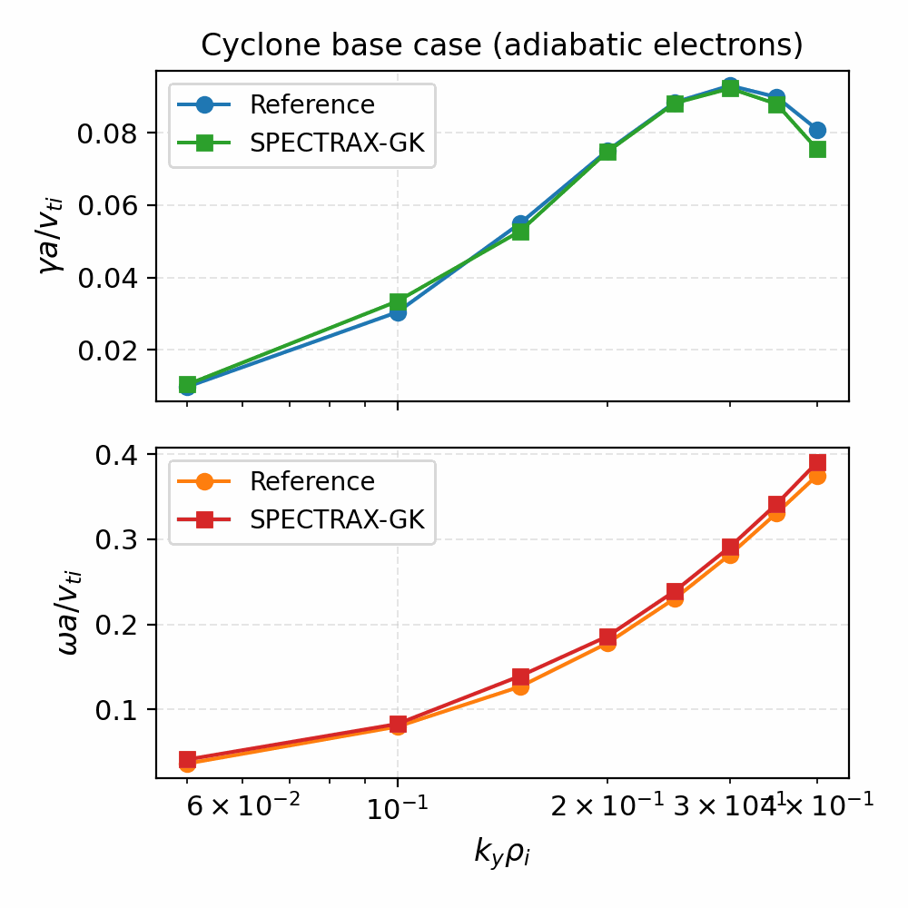

# SPECTRAX-GK

SPECTRAX-GK is a clean-room, JAX-native gyrokinetic solver designed for
performance, differentiability, and rapid experimentation. The code uses a
Hermite-Laguerre velocity-space representation with Fourier perpendicular
coordinates in a field-aligned flux-tube geometry. The initial validation target
is the **Cyclone base case** with adiabatic electrons.



## Highlights

- **JAX-first design**: fully differentiable kernels and JIT compilation.
- **Hermite-Laguerre velocity space**: compact spectral representation.
- **Field-aligned flux-tube geometry**: s-alpha analytic model (VMEC/DESC next).
- **GX-style drift physics**: curvature/grad-B/mirror couplings + diamagnetic drive.
- **Operator modes**: ``operator="gx"`` (full drift/mirror) or
  ``operator="energy"`` (reference-matching closure).
- **Stable integrators**: explicit, IMEX, and implicit time stepping options.
- **Cached operators**: precomputed geometry arrays for faster time stepping.
- **Benchmark harness**: reference data + growth-rate extraction tools + comparisons.
- **Auto window fitting**: robust growth-rate extraction from transient signals.
- **Publication-ready plots**: consistent styling and reusable plotting utilities.
- **100% test coverage**: unit, regression, and physics-based checks.

## Installation

```bash
pip install -e .
```

## Quickstart (CLI)

```bash
spectrax-gk cyclone-info
spectrax-gk cyclone-kperp --kx0 0.0 --ky 0.3
```

## Quickstart (Python)

```python
from spectraxgk import load_cyclone_reference, run_cyclone_linear

ref = load_cyclone_reference()
result = run_cyclone_linear(ky_target=0.3, steps=300, dt=0.02, method="rk4")

print(result.gamma, result.omega)
```

## Examples

```bash
python examples/basis_orthonormality.py
python examples/cyclone_geometry.py
python examples/linear_rhs_demo.py
python examples/cyclone_linear_benchmark.py
```

## Validation status

- **Cyclone base case (adiabatic electrons)**: the benchmark harness defaults
  to the energy-weighted drift closure to reproduce the published GX growth
  rates at ``k_y rho_i = 0.3`` while we validate the full GX operator across the
  ky scan.

## Figures

```bash
python tools/make_figures.py
```

## Documentation

The ReadTheDocs site provides:

- theory and equations
- numerical discretization and algorithms
- geometry and flux-tube model
- benchmark methodology and reference data
- API reference and examples

## Roadmap (high level)

1. Linear electrostatic GK operator (Hermite-Laguerre)
2. Cyclone base case linear benchmarks
3. Nonlinear E x B term and turbulence tests
4. Electromagnetic extensions, multispecies, advanced collisions
5. VMEC/DESC geometry adapters and stellarator benchmarks
6. Performance tuning and profiling

## References

- GX: a GPU-native gyrokinetic turbulence code: [Journal of Plasma Physics](https://www.cambridge.org/core/journals/journal-of-plasma-physics/article/gx-a-gpunative-gyrokinetic-turbulence-code-for-tokamak-and-stellarator-design/2C4BB81955E7E749B95B8B8141E997FA)
- Laguerre-Hermite pseudo-spectral GK: [arXiv:1708.04029](https://arxiv.org/abs/1708.04029)
- Gyrokinetic equations (Frieman & Chen, 1982): [OSTI record](https://www.osti.gov/biblio/5235502)
- Low-frequency kinetic equations (Antonsen & Lane, 1980): [OSTI record](https://www.osti.gov/biblio/5115944)
- GENE code: [J. Comput. Phys. 230, 6979 (2011)](https://www.sciencedirect.com/science/article/pii/S0021999111002609)
- stella code: [arXiv:1806.02162](https://arxiv.org/abs/1806.02162)

## Development notes

- The previous codebase is preserved on the `legacy` branch and archived in
  `legacy_archive/`.
- This branch uses a `src/` layout and enforces 100% test coverage.

## License

See `LICENSE`.
