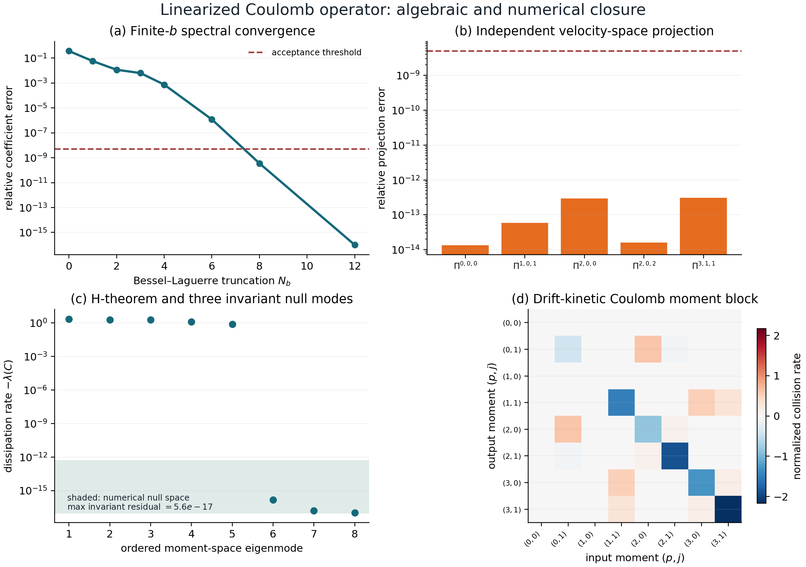
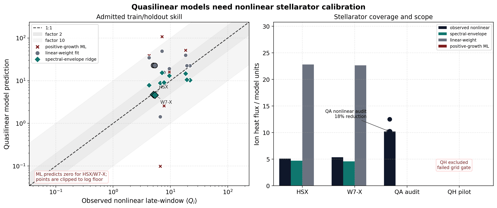

# SPECTRAX-GK

[](https://github.com/uwplasma/SPECTRAX-GK/releases)
[](https://pypi.org/project/spectraxgk/)
[](https://github.com/uwplasma/SPECTRAX-GK/actions/workflows/ci.yml)
[](https://codecov.io/gh/uwplasma/SPECTRAX-GK)
[](LICENSE)
[](pyproject.toml)

SPECTRAX-GK is a JAX-native gyrokinetic solver for linear stability,
nonlinear turbulence, differentiable analysis, and stellarator design. It uses
Fourier perpendicular coordinates, a Hermite-Laguerre velocity basis, and
field-aligned analytic, Miller, or VMEC geometry. The package runs on CPUs and
GPUs, exposes a Python API for autodiff and optimization, and provides a simple
executable for routine simulations.

## Installation

```bash
pip install spectraxgk
```

For development:

```bash
git clone https://github.com/uwplasma/SPECTRAX-GK
cd SPECTRAX-GK
pip install -e .
```

## Quickstart

Run the built-in linear initial-value example:

```bash
spectraxgk
```

The equivalent `spectrax-gk` entry point is also installed. The default run
prints setup, progress, elapsed time, and ETA, then writes its input, summary,
time series, eigenfunction, and a two-panel plot in the current directory.

Run a checked-in case or plot an existing result:

```bash
spectraxgk examples/linear/axisymmetric/cyclone.toml
spectraxgk run-runtime-nonlinear \
  --config examples/nonlinear/axisymmetric/runtime_cyclone_nonlinear.toml \
  --steps 200 --out cyclone.out.nc
spectraxgk --plot cyclone.out.nc
```

Generate the small VMEC equilibria used by the self-contained examples:

```bash
pip install vmec-jax
cd examples/vmec
./generate_wouts.sh
```

Start with the [quickstart](docs/quickstart.rst) and [input reference](docs/inputs.rst)
for linear, nonlinear, Miller, VMEC, restart, quasilinear, and plotting workflows.

## Highlights

- Electrostatic and electromagnetic gyrokinetics with kinetic or Boltzmann species.
- Linear initial-value, dominant-eigenmode, and nonlinear turbulence solvers.
- Analytic s-alpha, Miller, imported VMEC, and differentiable VMEC/Boozer geometry.
- JAX JIT, forward/reverse autodiff, implicit eigenvalue derivatives, and UQ tools.
- Quasilinear transport diagnostics with explicit saturation-rule metadata.
- CPU/GPU execution and production parallelization for independent scans and ensembles.
- Restartable NetCDF output and `spectraxgk --plot` publication-style figures.
- A limited conserving Lenard-Bernstein/Dougherty-like collision model, with
  advanced multispecies and linearized Landau operators remaining research lanes.

## Main Validation Results

The release atlas compares growth rates, frequencies, eigenfunctions, and
nonlinear transport windows with established gyrokinetic reference results.
Promoted cases include Cyclone ITG, Cyclone Miller, KBM, W7-X, and HSX, with
ETG and kinetic-electron stress cases kept at their documented claim level.


The exact equations, normalization, grids, boundary conditions, diagnostic
windows, tolerances, and artifact provenance are in the
[benchmark documentation](docs/benchmarks.rst) and
[verification matrix](docs/verification_matrix.rst). A visual overlay alone is
not treated as parity evidence.

The advanced-collision research lane now generates the complete retained
finite-Larmor Coulomb moment algebra and checks it against independent
velocity-space projection, spectral convergence, conservation, and the
H-theorem. The panel below passes all operator-level gates, but does not claim
production Landau transport yet; multispecies field coupling, conductivity,
collisional ITG, and zonal-damping gates remain required.



Equations, thresholds, machine-readable results, literature links, and the
one-command reproduction recipe are in the [collision-operator
documentation](docs/operators.rst).

## Runtime and Memory


The panel reports measured cold wall time and peak memory for the tracked CPU,
GPU, and comparison-code runs. Cold JAX rows include startup and compilation.
Prepared Python simulations avoid recompiling a fixed geometry and numerical
policy, but their CPU/GPU throughput depends on the software stack and GPU
operating state. See
[performance](docs/performance.rst) for profiler artifacts, memory accounting,
current reproducibility notes, and the distinction between executable,
prepared, and distributed runs.

## Differentiable Python API

```python
import jax.numpy as jnp

from spectraxgk import CycloneBaseCase, LinearParams, integrate_linear_from_config
from spectraxgk.core.grid import build_spectral_grid
from spectraxgk.geometry import SAlphaGeometry

cfg = CycloneBaseCase()
grid = build_spectral_grid(cfg.grid)
geometry = SAlphaGeometry.from_config(cfg.geometry)
parameters = LinearParams()
state = jnp.zeros((2, 2, grid.ky.size, grid.kx.size, grid.z.size), dtype=jnp.complex64)
state = state.at[0, 0, 0, 0, :].set(1.0e-3)
trajectory, potential = integrate_linear_from_config(
    state, grid, geometry, parameters, cfg.time
)
```

For repeated nonlinear calls with fixed geometry and numerical policy, prepare
the compiled simulation once:

```python
from spectraxgk.nonlinear import prepare_nonlinear_explicit_diagnostics

simulation = prepare_nonlinear_explicit_diagnostics(
    initial_state,
    grid,
    geometry,
    parameters,
    dt=0.02,
    steps=400,
    resolved_diagnostics=False,
)
time, diagnostics, final_state, fields = simulation.run()
```

The prepared object accepts another same-shape initial state without rebuilding
the scan. A matched rebuilt cache/parameter PyTree can also remain dynamic for
autodiff; geometry layout is fixed, and dynamic-geometry compile reuse remains
an active differentiability lane.

The planted two-mode inverse problem below recovers two gradient parameters and
checks the autodiff Jacobian against finite differences. The single-mode demo in
the docs intentionally demonstrates non-identifiability rather than exact
parameter recovery.


See [differentiable workflows](docs/differentiable_refactor_plan.rst),
[algorithms](docs/algorithms.rst), and [stellarator optimization](docs/stellarator_optimization.rst)
for JVP, VJP, implicit differentiation, conditioning, covariance, and finite-difference gates.

## Quasilinear Modeling



The current quasilinear implementation is a scoped model-development and
optimization-screening result. It supports ranking and correlation studies but
is not a runtime/TOML absolute-flux predictor. Absolute-flux
promotion remains rejected when the declared Solovev and shaped-pressure stress
outliers are retained. Model definitions, derivations, calibration splits,
uncertainty, residual anatomy, and holdout gates are in the
[quasilinear documentation](docs/quasilinear.rst).

## QA ITG Optimization

The VMEC-JAX-style examples append a SPECTRAX-GK growth-rate, quasilinear, or
nonlinear-window residual to the aspect-ratio, mean-iota, and quasisymmetry
objective tuples. The baseline follows the max-mode-5 QA workflow; all
transport comparisons use solved VMEC equilibria.


These rows are not promoted turbulent-flux designs. Their matched long
post-transient nonlinear audits use converged post-transient heat-flux windows
and do not show a statistically significant reduction relative to the strict
QA baseline. They are useful negative transfer evidence for improving objective
conditioning and optimizer choice.

The RBC(1,1) scan is a landscape and noise/convergence diagnostic, not a source
of admitted optimized candidates. It compares linear growth, all shipped
quasilinear rules, and replicated long-window nonlinear transport.


Reproducible scripts are in [examples/optimization](examples/optimization), and
full objective equations, optimizer policies, comparison fingerprints, and
long-window audits are in the [optimization documentation](docs/stellarator_optimization.rst).

## Parallelization

Production parallelization currently covers independent `k_y` scans,
quasilinear/UQ ensembles, and file-backed independent tasks with deterministic
ordering and serial identity gates. Sensitivity sweeps can use the same deterministic independent-work reconstruction, but they need a dedicated
matched scaling artifact before any speedup claim is promoted.

Nonlinear whole-state and domain decomposition remain diagnostic. Species-first
and Hermite-second decomposition, explicit Hermite halo exchange, field-moment
collectives, and physical transport-window identity must pass before a
nonlinear parallelization speedup is claimed. See [parallelization](docs/parallelization.rst).

## Current Claim Scope

Validated release claims are bounded by the [release scope](docs/release_scope.rst):

- Standard electrostatic/electromagnetic full gyrokinetics is validated only on
  the promoted cases and observables in the verification matrix.
- Quasilinear outputs are diagnostics and screening models, not universal
  absolute nonlinear heat-flux predictions.
- Nonlinear optimization evidence requires matched, replicated, long
  post-transient windows; startup or reduced envelopes are not production evidence.
- W7-X zonal long-window recurrence/damping and W7-X TEM / kinetic-electron extensions are deferred.
- Production nonlinear domain decomposition, equilibrium ExB flow shear,
  species-coupled collisions, and linearized Landau/Sugama operators remain open.

## Examples and Documentation

The repository keeps small runnable examples under:

- [`examples/linear`](examples/linear): axisymmetric and stellarator linear runs.
- [`examples/nonlinear`](examples/nonlinear): nonlinear turbulence and restarts.
- [`examples/optimization`](examples/optimization): differentiable QA workflows.
- [`examples/theory_and_demos`](examples/theory_and_demos): numerical and autodiff demonstrations.
- [`benchmarks`](benchmarks): comparison inputs, drivers, and compact result indexes.

Detailed user and developer documentation:

- [Physics and equations](docs/theory.rst)
- [Operators and models](docs/operators.rst)
- [Numerics and solvers](docs/numerics.rst)
- [Geometry](docs/geometry.rst)
- [Outputs and plotting](docs/outputs.rst)
- [Testing and validation](docs/testing.rst)
- [Code structure](docs/code_structure.rst)
- [Roadmap](docs/roadmap.rst)

## Testing

```bash
pytest
python tools/release/run_test_gates.py fast
python tools/release/run_test_gates.py wide-coverage \
  --shards 48 --timeout 300 --fail-under 95 \
  --pytest-arg=-o --pytest-arg=addopts= --pytest-arg=-m --pytest-arg="not slow"
python -m sphinx -W -b html docs docs/_build/html
```

The package-wide CI coverage gate is at least 95%. Physics, convergence,
comparison, differentiability, and performance gates are required in addition
to line coverage.

## License

SPECTRAX-GK is distributed under the [MIT License](LICENSE).
