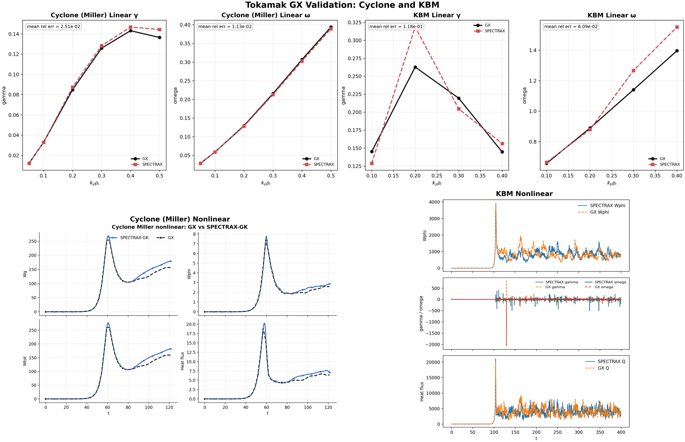

# SPECTRAX-GK

SPECTRAX-GK is a clean-room, JAX-native gyrokinetic solver designed for
performance, differentiability, and rapid experimentation. The code uses a
Hermite-Laguerre velocity-space representation with Fourier perpendicular
coordinates in a field-aligned flux-tube geometry. The initial validation target
is the **Cyclone base case** with adiabatic electrons, plus ETG and KBM scans.



Top panel: Cyclone and KBM parity against GX, including linear eigenfunctions,
linear growth/frequency scans, and nonlinear time traces for growth rate,
frequency, and heat flux. The panel now uses GX-matched runtime configs
(same integrator family and normalization contract; no manual `flux_scale` or
`wphi_scale` calibration in the Cyclone config). KBM nonlinear traces are drawn
from the longer dense-cadence run (`t_max=0.50`) and clipped to the
branch-consistent window (`t<=0.35`) for fair parity visualization.

The current KBM GX mismatch table is stored in
`docs/_static/kbm_gx_mismatch.csv`.

## Highlights

- **JAX-first design**: fully differentiable kernels and JIT compilation.
- **Hermite-Laguerre velocity space**: compact spectral representation.
- **Field-aligned flux-tube geometry**: s-alpha analytic model (VMEC/DESC next).
- **Full drift/mirror physics**: curvature/grad-B/mirror couplings + diamagnetic drive.
- **Electromagnetic fields**: coupled :math:`(\\phi, A_\\parallel, B_\\parallel)` solve.
- **Term toggles**: switch linear-operator components via ``LinearTerms``.
- **Field-aligned grid controls**: ``y0``, ``ntheta``, and ``nperiod`` inputs.
- **Stable integrators**: explicit, IMEX, and implicit time stepping options.
- **GX-style RK4**: CFL-based timestep selection + GX growth-rate diagnostics.
- **Cached operators**: precomputed geometry arrays for faster time stepping.
- **Benchmark harness**: reference data + growth-rate extraction tools + comparisons.
- **ETG trend checks**: reduced electron-scale grids for linear trend validation.
- **Auto window fitting**: robust growth-rate extraction from transient signals.
- **Publication-ready plots**: consistent styling and reusable plotting utilities.
- **100% test coverage**: unit, regression, and physics-based checks.

## Installation

```bash
pip install -e .
```

## Quickstart (CLI)

```bash
spectrax-gk cyclone-info
spectrax-gk cyclone-kperp --kx0 0.0 --ky 0.3
spectrax-gk run-linear --config examples/configs/cyclone.toml --plot --outdir docs/_static
spectrax-gk scan-linear --config examples/configs/etg.toml --plot --outdir docs/_static
```

## Quickstart (Python)

```python
from spectraxgk import load_cyclone_reference, run_cyclone_linear

ref = load_cyclone_reference()
result = run_cyclone_linear(ky_target=0.3, method="rk4")

print(result.gamma, result.omega)
```

GX-style RK4 integration (GX timestep selection + growth-rate diagnostics):

```python
from spectraxgk import CycloneBaseCase, GXTimeConfig, integrate_linear_gx
from spectraxgk.geometry import SAlphaGeometry
from spectraxgk.grids import build_spectral_grid
from spectraxgk.linear import LinearParams, build_linear_cache

cfg = CycloneBaseCase()
grid = build_spectral_grid(cfg.grid)
geom = SAlphaGeometry.from_config(cfg.geometry)
params = LinearParams()
cache = build_linear_cache(grid, geom, params, Nl=16, Nm=8)

G0 = jnp.zeros((16, 8, grid.ky.size, grid.kx.size, grid.z.size), dtype=jnp.complex64)
time_cfg = GXTimeConfig(t_max=10.0, dt=0.01, fixed_dt=False)

t, phi_t, gamma_t, omega_t = integrate_linear_gx(G0, grid, cache, params, geom, time_cfg)
```

## Config-driven integration

```python
import jax.numpy as jnp
from spectraxgk import CycloneBaseCase, LinearParams, integrate_linear_from_config
from spectraxgk.geometry import SAlphaGeometry
from spectraxgk.grids import build_spectral_grid

cfg = CycloneBaseCase()
grid = build_spectral_grid(cfg.grid)
geom = SAlphaGeometry.from_config(cfg.geometry)
params = LinearParams()

G0 = jnp.zeros((2, 2, grid.ky.size, grid.kx.size, grid.z.size), dtype=jnp.complex64)
G0 = G0.at[0, 0, 0, 0, :].set(1.0e-3 + 0.0j)

G_t, phi_t = integrate_linear_from_config(G0, grid, geom, params, cfg.time)
```

By default, ``TimeConfig`` enables the diffrax Heun solver. Set
``use_diffrax=False`` to run the built-in fixed-step integrators.

## Examples

```bash
python examples/basis_orthonormality.py
python examples/cyclone_geometry.py
python examples/diffrax_linear_demo.py
python examples/linear_rhs_demo.py
python examples/example.py
python examples/cyclone_linear_benchmark.py
python examples/etg_linear_benchmark.py
python examples/gradB_coupling_hl_1d.py
python examples/kbm_beta_scan.py
python examples/two_stream_hermite_1d.py
```

Diffrax is enabled by default for the ETG/KBM examples. To force the
fixed-step integrators, pass ``--no-diffrax``:

```bash
python examples/etg_linear_benchmark.py --no-diffrax
python examples/kbm_beta_scan.py --no-diffrax
```

## Validation status

- **Cyclone base case (adiabatic electrons)**: the benchmark harness reproduces
  published growth rates and real frequencies across the reduced ky scan using
  the full drift/mirror operator and GX-style RK4 diagnostics. Low-ky points
  require longer ``t_max`` windows to converge to reference values.
- **ETG linear trend**: growth rates remain positive across reduced electron-scale
  gradients; real frequencies follow the electron diamagnetic direction.
- **KBM beta scan**: electromagnetic transition between ITG and KBM branches,
  with GX as the parity baseline for linear and nonlinear diagnostics.

## Figures

```bash
python tools/make_figures.py
```

## Integrator benchmark

```bash
python tools/benchmark_integrators.py
```

## Figure parameters

### Cyclone base case (adiabatic electrons, GX Fig. 1)

| Parameter | Value |
| --- | --- |
| Geometry | q=1.4, s_hat=0.8, epsilon=0.18, R0=2.77778 |
| Gradients | R/LTi=2.49, R/LTe=0.0, R/Ln=0.8 |
| Species | ions (Z=1, m=1), adiabatic electrons (tau_e=1) |
| Electromagnetic | beta=0, A_parallel=off, B_parallel=off |
| Collisions | nu_i=1.0e-2, GX-style hypercollisions (kz-proportional) on |
| Operator toggles | streaming/mirror/curvature/grad-B/diamagnetic on; nonlinear off |
| Grid | Nx=1, Ny=24, Nz=96, y0=20, ntheta=32, nperiod=2 |
| Velocity resolution | Nl=6, Nm=16 (legacy figure); GX-style runs use per-ky balanced resolution |
| External references | GX paper Fig. 1 + GS2 + stella (matched cyclone setup) |


GX-style balanced runs (moderate cost, against GX):

| ky rho_i | Nl | Nm | t_max | gamma | omega | rel gamma | rel omega |
| --- | --- | --- | --- | --- | --- | --- | --- |
| 0.05 | 16 | 8 | 80 | 0.00994 | 0.0413 | +1.2% | +13% |
| 0.10 | 16 | 8 | 20 | 0.0299 | 0.0790 | -1.8% | -1.1% |
| 0.20 | 24 | 12 | 20 | 0.0762 | 0.1853 | +1.6% | +4.2% |
| 0.30 | 24 | 12 | 10 | 0.0904 | 0.2906 | -2.8% | +3.1% |

### ETG (GS2 primary, stella secondary)

| Parameter | Value |
| --- | --- |
| Geometry | q=1.5, s_hat=0.8, epsilon=0.18, R0=3.0 |
| Gradients | ion: R/LTi=0, R/Lni=0; electron: R/LTe=2.49, R/Lne=0.8 |
| Species | two-species kinetic ions + electrons, Te/Ti=1, mi/me=3670 |
| Electromagnetic | beta=1.0e-5, electrostatic (A_parallel=off, B_parallel=off in reference runs) |
| Collisions | nu_i=0, nu_e=0, GX-style hypercollisions on |
| Operator toggles | streaming/mirror/curvature/grad-B/diamagnetic on; nonlinear off |
| Grid | Nx=1, Ny=96, Nz=96, ntheta=32, nperiod=2 |
| Time integration | fixed-step IMEX2 scan path (default), Diffrax adaptive optional |
| Velocity resolution | Nl=10, Nm=12 |
| Tuned ETG scales | omega_d_scale=0.4, omega_star_scale=0.8 |
| External references | GS2 NetCDF outputs (primary), stella (secondary consistency check) |


Cross-code mismatch (same ETG setup above):

- GS2 vs SPECTRAX: mean `|rel_gamma| = 8.243%`, mean `|rel_omega| = 29.894%`
- stella vs SPECTRAX: mean `|rel_gamma| = 24.792%`, mean `|rel_omega| = 6.735%`

### KBM ky scan (GX parity closure)

| Parameter | Value |
| --- | --- |
| Geometry | q=1.4, s_hat=0.8, epsilon=0.18, R0=2.77778 |
| Gradients | R/LTi=2.49, R/LTe=2.49, R/Ln=0.8 |
| Species | ions + electrons, Te/Ti=1, mi/me=3670 |
| Electromagnetic | fixed beta_ref=0.015 (GX `kbm_salpha.in`), A_parallel=on, B_parallel=off |
| Collisions | nu_i=0, nu_e=0, hypercollisions=off |
| Operator toggles | streaming/mirror/curvature/grad-B/diamagnetic on; nonlinear off |
| Grid | Nx=1, Ny=12, Nz=96, y0=10, ntheta=32, nperiod=2 |
| Velocity resolution | Nl=8, Nm=24 |
| Time integration (cross-code) | fixed-step IMEX2 (scan default), Diffrax adaptive optional |
| Fit policy (cross-code) | mode extracted at the selected ky/kx with midplane-aware signal extraction, log-linear auto-windowing |
| Reference | GX matched-input electromagnetic ky scan |

KBM GX parity set (matched-input run plumbing):


## Cross-code performance (staging)

Representative point timings on the current development workstation
(SPECTRAX includes first-run JAX compile overhead):

| Benchmark point | SPECTRAX-GK | GX | GS2 | stella |
| --- | --- | --- | --- | --- |
| Cyclone ky=0.3 (time, peak RSS) | 31.5 s, 664 MB | pending (GPU run) | 4.82 s, 35 MB | pending |

## Documentation

The ReadTheDocs site provides:

- theory and equations
- numerical discretization and algorithms
- geometry and flux-tube model
- benchmark methodology and reference data
- API reference and examples

## Roadmap (high level)

1. Linear electrostatic GK operator (Hermite-Laguerre)
2. Cyclone base case linear benchmarks
3. Nonlinear E x B term and turbulence tests
4. Electromagnetic extensions, multispecies, advanced collisions
5. VMEC/DESC geometry adapters and stellarator benchmarks
6. Performance tuning and profiling

## References

- Laguerre-Hermite pseudo-spectral GK: [arXiv:1708.04029](https://arxiv.org/abs/1708.04029)
- Gyrokinetic equations (Frieman & Chen, 1982): [OSTI record](https://www.osti.gov/biblio/5235502)
- Low-frequency kinetic equations (Antonsen & Lane, 1980): [OSTI record](https://www.osti.gov/biblio/5115944)
- GENE code: [J. Comput. Phys. 230, 6979 (2011)](https://www.sciencedirect.com/science/article/pii/S0021999111002609)
- stella code: [arXiv:1806.02162](https://arxiv.org/abs/1806.02162)

## Development notes

- The previous codebase is preserved on the `legacy` branch and archived in
  `legacy_archive/`.
- This branch uses a `src/` layout and enforces 100% test coverage.

## License

See `LICENSE`.
