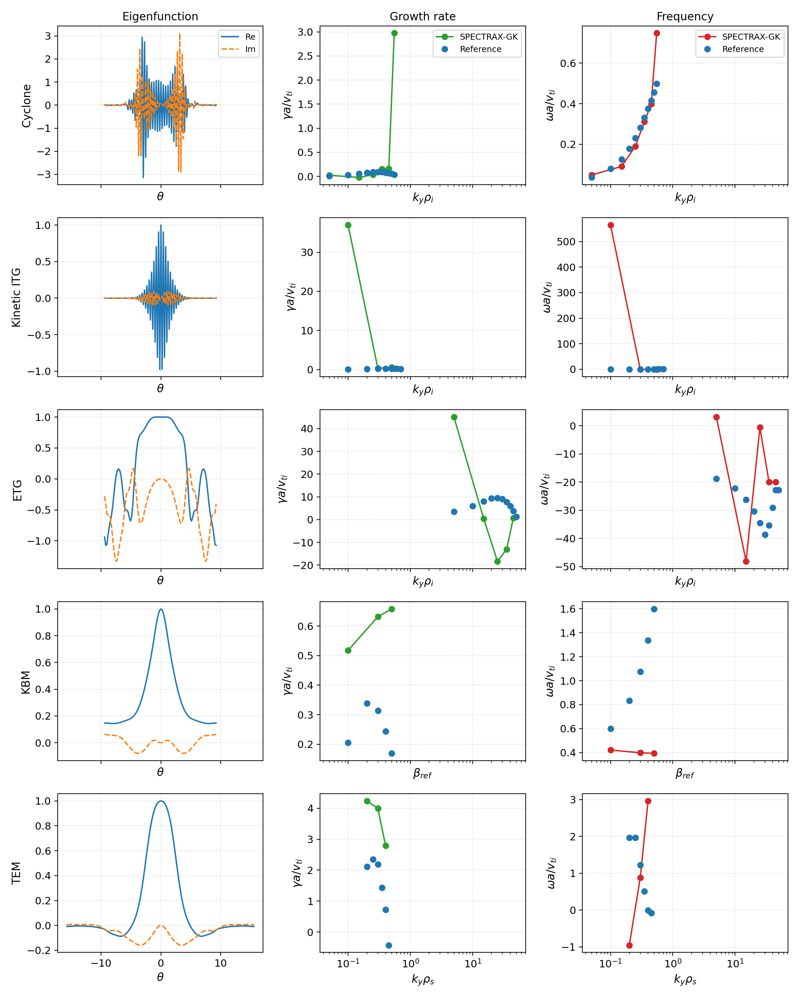
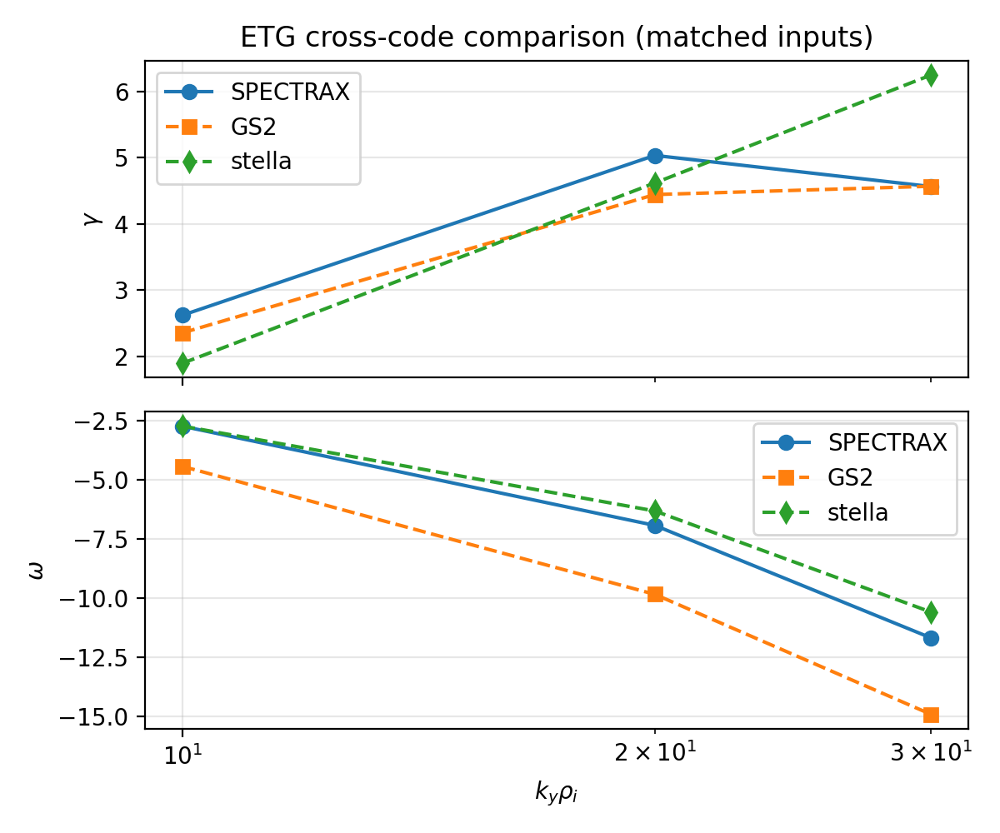
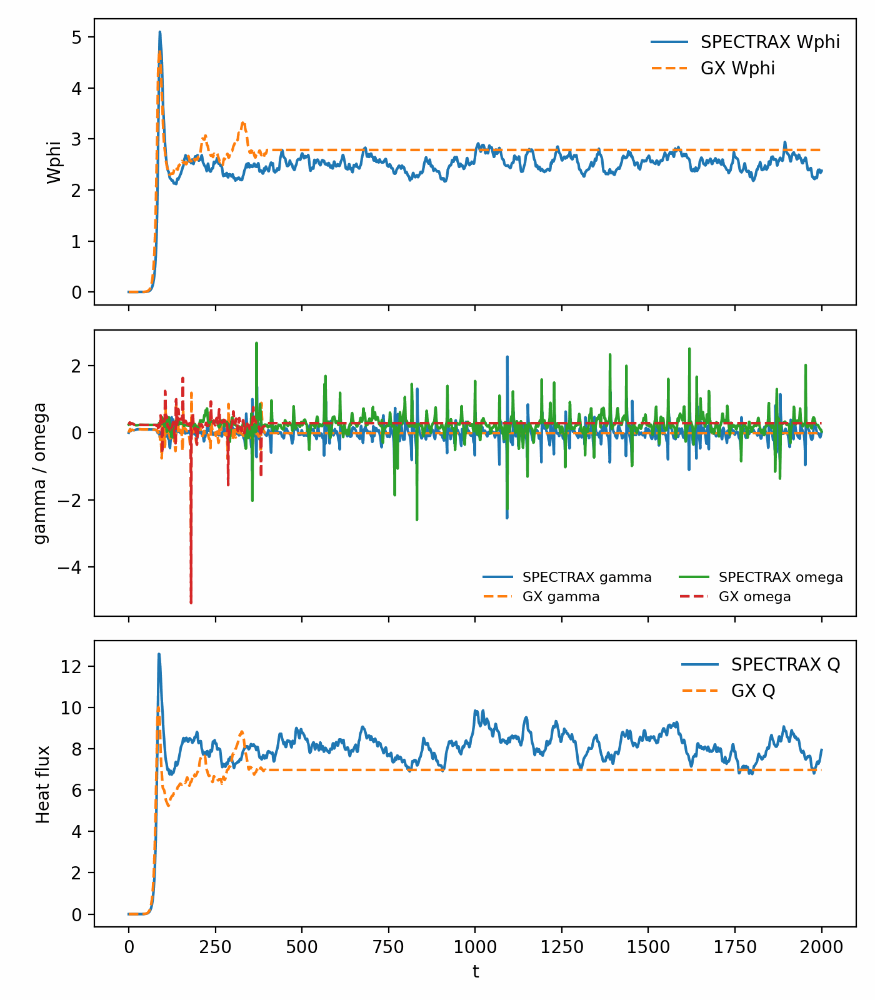

Benchmarks
==========

Benchmark runners default to a matrix-free Krylov/Arnoldi eigen solver for
linear scans, which avoids long explicit time integrations when only growth
rates and frequencies are required. Fixed-step or diffrax time integrators
remain available by setting ``solver="time"`` in the benchmark helpers (or by
calling ``integrate_linear`` directly). A small runtime/memory comparison script
is available in ``tools/benchmark_integrators.py``.

For newcomer-friendly runs, set ``solver="auto"`` and ``fit_signal="auto"``.
This selects between Krylov/time paths and between ``phi``/density diagnostics
using the same windowing rules as the manual fits, and falls back when a
non-finite or strongly damped branch is detected. Advanced users can still
pin any solver or diagnostic choice explicitly.

For GX-aligned time integration and diagnostics, SPECTRAX-GK includes a
``integrate_linear_gx`` path that mirrors GX’s RK4 timestep selection and
growth-rate extraction.

The Krylov solver applies a mild frequency cap (``KrylovConfig.omega_cap_factor``)
to avoid selecting spurious high-frequency Ritz values when multiple branches are
present. ``KrylovConfig.mode_family`` and ``KrylovConfig.shift_selection`` add
case-aware targeting for shift-invert runs, and ``KrylovConfig.fallback_method``
controls fallback when a shift-invert solve lands on a non-physical branch.
Set ``omega_cap_factor=0`` to disable frequency capping.

Normalization scalings
----------------------

Per-case normalization factors are applied to the diamagnetic and curvature
frequencies to align with published reference data. The canonical source is
``spectraxgk.normalization`` (``get_normalization_contract(case)``); benchmark
constants remain compatibility aliases.

.. list-table:: Calibration scalings (current code defaults)
   :header-rows: 1

   * - Case
     - ``omega_d_scale``
     - ``omega_star_scale``
   * - Cyclone (adiabatic)
     - ``1.0``
     - ``1.0``
   * - ETG
     - ``0.4``
     - ``0.8``
   * - KBM
     - ``1.0``
     - ``0.8``

Diagnostic reporting normalization is controlled independently via
``diagnostic_norm``:

- ``none``: report raw solver values.
- ``gx`` / ``rho_star``: report ``rho_star * (gamma, omega)``.

Performance defaults
--------------------

Current defaults prioritize robust runs for mixed stiffness:

- ``TimeConfig(use_diffrax=True, diffrax_solver="Dopri8", diffrax_adaptive=True)``
- ``progress_bar=False`` by default for scan throughput and cleaner JIT behavior.
- ``streaming_fit=True`` in scan helpers to avoid storing full time traces unless
  explicitly requested.
- ``ky_batch>1`` with ``fixed_batch_shape=True`` to keep batch shapes constant
  across scans and avoid tail-batch recompiles.

Profiling snapshot (Cyclone, ``ky=0.3``, ``Nl=16``, ``Nm=48``, ``t_max=20``, ``dt=0.01``):

- compile+warmup: ~27.5 s
- steady run: ~24.9 s
- reference output: ``gamma=0.0873``, ``omega=0.2907`` (close to reference)

RHS HLO profiling shows the primary compile/runtime pressure comes from scan
loops and update-heavy kernels (high ``while``/``scatter`` counts in the
compiled HLO). For large scans, prefer:

- ``progress_bar=False``
- consistent ``dt/steps`` to avoid recompilation
- ``sample_stride>1`` to reduce diagnostics overhead
- ``diagnostics_stride>1`` to compute GX-style diagnostics less frequently
- Krylov scan mode for linear eigenvalue-only workflows

Cyclone Base Case (Linear, Adiabatic Electrons)
-----------------------------------------------

The Cyclone base case is the canonical ion-temperature-gradient validation
target. SPECTRAX-GK ships a reference dataset stored in:

- ``spectraxgk/data/cyclone_reference_adiabatic.csv``

The benchmark harness loads these values and compares growth rates and
frequencies across a reduced :math:`k_y` scan on the field-aligned grid.

GX parity mode
^^^^^^^^^^^^^^
SPECTRAX-GK includes a GX parity mode for Cyclone that mirrors GX’s default
choices for geometry normalization and growth-rate extraction:

* ``drift_scale=1.0`` (GX normalization for curvature/grad-B drifts).
* Midplane sampling at ``z_index = nz//2 + 1`` (GX growth-rate diagnostic).
* GX-style RK4 integration with adaptive timestep (CFL-based) and
  instantaneous ``phi``-ratio extraction for ``(gamma, omega)``.

The Cyclone base case enables GX parity by default (``gx_parity=True``). To
turn it off or override individual pieces, pass explicit configuration
overrides (e.g. custom ``geometry.drift_scale``, solver selection, or
``gx_parity=False`` in the Cyclone benchmark helpers).

.. list-table:: Cyclone base case parameters (GX Fig. 1)
   :header-rows: 1

   * - Parameter
     - Value
   * - Geometry
     - ``q=1.4``, ``s_hat=0.8``, ``epsilon=0.18``, ``R0=2.77778``
   * - Gradients
     - ``R/LTi=2.49``, ``R/LTe=0.0``, ``R/Ln=0.8``
   * - Species
     - ions only; adiabatic electrons with ``tau_e=1``
   * - Electromagnetic
     - ``beta=0``, ``A_parallel=off``, ``B_parallel=off``
   * - Collisions
     - ``nu_i=1e-2``, GX-style hypercollisions (kz-proportional) on
   * - Operator toggles
     - streaming/mirror/curvature/grad-B/diamagnetic on; nonlinear off
   * - Grid
     - ``Nx=1, Ny=24, Nz=96, y0=20, ntheta=32, nperiod=2``
   * - Velocity resolution
     - ``Nl=6, Nm=16`` (legacy figure generation); GX-aligned scans use
       per-ky balanced resolutions below.
   * - Reference
     - [GX]_

   GX parity summary panel for Cyclone and KBM, combining linear
   eigenfunction overlays, linear ``k_y`` growth/frequency scans, and
   nonlinear time traces of growth rate, frequency, and heat flux.

Regenerate this panel with:

- ``python tools/compare_gx_linear.py --gx /path/to/itg_salpha_adiabatic_electrons.out.nc --out docs/_static/cyclone_gx_mismatch.csv``
- ``python tools/compare_gx_kbm.py --gx /path/to/kbm_salpha.out.nc --out docs/_static/kbm_gx_mismatch.csv``
- ``python tools/make_gx_cyclone_kbm_panel.py --out docs/_static/gx_cyclone_kbm_panel.png``

.. figure:: _static/cyclone_comparison.png
   :align: center
   :alt: Cyclone base case comparison

   Cyclone base case growth rates and real frequencies comparing SPECTRAX-GK
   against GX (published reference), GS2, and stella.

.. csv-table:: Cyclone GS2 mismatch table (tuned)
   :file: _static/cyclone_gs2_mismatch.csv
   :header-rows: 1

.. csv-table:: Cyclone stella mismatch table (tuned)
   :file: _static/cyclone_stella_mismatch.csv
   :header-rows: 1

.. list-table:: Cyclone base case (GX-style integrator, balanced resolution)
   :header-rows: 1

   * - ky rho_i
     - Nl
     - Nm
     - t_max
     - gamma
     - omega
     - rel gamma
     - rel omega
   * - 0.05
     - 16
     - 8
     - 80
     - 0.00994
     - 0.0413
     - +1.2%
     - +13%
   * - 0.10
     - 16
     - 8
     - 20
     - 0.0299
     - 0.0790
     - -1.8%
     - -1.1%
   * - 0.20
     - 24
     - 12
     - 20
     - 0.0762
     - 0.1853
     - +1.6%
     - +4.2%
   * - 0.30
     - 24
     - 12
     - 10
     - 0.0904
     - 0.2906
     - -2.8%
     - +3.1%

Low-ky points converge slowly in time; even with ``t_max=80`` the ``ky=0.05``
frequency remains elevated relative to the reference. Further convergence may
require longer windows or higher velocity resolution.

ETG (GS2/Stella Cross-Code)
---------------------------

The ETG cross-code tuning workflow uses matched GS2/stella NetCDF outputs and
SPECTRAX fixed-step IMEX growth extraction for the same
``(ky, geometry, species, gradients)``.

.. list-table:: ETG cross-code parameters
   :header-rows: 1

   * - Parameter
     - Value
   * - Geometry
     - ``q=1.5``, ``s_hat=0.8``, ``epsilon=0.18``, ``R0=3.0``
   * - Gradients
     - ion: ``R/LTi=0``, ``R/Lni=0``; electron: ``R/LTe=2.49``, ``R/Lne=0.8``
   * - Species
     - two-species kinetic ions + electrons, ``Te/Ti=1``, ``mi/me=3670``
   * - Electromagnetic
     - electrostatic reference (``beta=1e-5``, ``A_parallel=off``, ``B_parallel=off``)
   * - Collisions
     - ``nu_i=0``, ``nu_e=0``, GX-style hypercollisions on
   * - Operator toggles
     - streaming/mirror/curvature/grad-B/diamagnetic on; nonlinear off
   * - Grid
     - ``Nx=1, Ny=96, Nz=96, ntheta=32, nperiod=2``
   * - Linear scan mode
     - fixed-step IMEX2 extraction (scan default), Diffrax adaptive optional
   * - Velocity resolution
     - ``Nl=10, Nm=12``
   * - Tuned ETG scales
     - ``omega_d_scale=0.4``, ``omega_star_scale=0.8``

.. csv-table:: ETG GS2 mismatch table (tuned)
   :file: _static/etg_gs2_mismatch.csv
   :header-rows: 1

.. csv-table:: ETG stella mismatch table (tuned)
   :file: _static/etg_stella_mismatch.csv
   :header-rows: 1

ETG branch-isolation diagnostics
^^^^^^^^^^^^^^^^^^^^^^^^^^^^^^^^

For high-:math:`k_y` ETG branch selection checks, use:

- ``python tools/etg_branch_isolation.py``
- ``python tools/compare_rhs_terms.py --case etg --ky 5 --adiabatic-ions --Ny 24 --Lx 6.28 --Ly 6.28 --y0 0.2 --Nl 48 --Nm 16 --boundary linked``
- ``python tools/compare_rhs_terms.py --case etg --ky 25 --adiabatic-ions --Ny 24 --Lx 6.28 --Ly 6.28 --y0 0.2 --Nl 48 --Nm 16 --boundary linked``
- ``python tools/etg_physics_audit.py --ky 5 --Nl 48 --Nm 16``
- ``python tools/etg_physics_audit.py --ky 25 --Nl 48 --Nm 16``

KBM (Electromagnetic Beta Scan)
-------------------------------

Electromagnetic ballooning validation uses a fixed :math:`k_y` and a scan over
:math:`\beta_{ref}`. Primary closure is now against GX (s-alpha geometry). Use
``benchmarks/linear/KBM/kbm_salpha.in`` in the GX repository and
``tools/compare_gx_kbm.py`` in SPECTRAX-GK to regenerate the mismatch tables.

.. list-table:: KBM parameters (GX s-alpha matched-input set)
   :header-rows: 1

   * - Parameter
     - Value
   * - Geometry
     - ``q=1.4``, ``s_hat=0.8``, ``epsilon=0.18``, ``R0=2.77778``
   * - Gradients
     - ``R/LTi=2.49``, ``R/LTe=2.49``, ``R/Ln=0.8``
   * - Species
     - ions + electrons, ``Te/Ti=1``, ``mi/me=3670``
   * - Electromagnetic
     - ``beta_ref`` scan, ``A_parallel=on``, ``B_parallel=off``
   * - Collisions
     - ``nu_i=0``, ``nu_e=0``, GX-style hypercollisions on
   * - Operator toggles
     - streaming/mirror/curvature/grad-B/diamagnetic on; nonlinear off
   * - Grid
     - ``Nx=1, Ny=16, Nz=96, y0=10, ntheta=32, nperiod=2``
   * - Velocity resolution
     - ``Nl=16, Nm=48`` (GX parity target)
   * - Time integration (cross-code)
     - GX-style RK4 with adaptive dt (parity); fixed-step IMEX2 for scan speed
   * - Fit policy (cross-code)
     - mode extracted at selected ``(ky, kx, z_mid)`` with log-linear
       auto-windowing (conservative amplitude-capped windows)
   * - Reference
     - GX linear KBM (s-alpha geometry, matched-input set)

KBM GX cross-code run
^^^^^^^^^^^^^^^^^^^^^

We execute a matched-input KBM cross-code set at ``ky=0.3`` with
``beta_ref = [0.1, 0.2, 0.3, 0.4, 0.5]`` for GX and SPECTRAX. Use:

- ``python tools/compare_gx_kbm.py --gx /path/to/kbm_salpha.out.nc --out docs/_static/kbm_gx_mismatch.csv``

The KBM mismatch table is regenerated locally (not committed) and summarized
in the run logs once parity closes.

KBM nonlinear term parity (GX)
^^^^^^^^^^^^^^^^^^^^^^^^^^^^^^

For nonlinear KBM parity, we compare GX and SPECTRAX term dumps at one time
step (same state, same grid, same normalization). The GX run uses
``GX_DUMP_NL_DERIVS=1`` and ``GX_DUMP_NL_TERMS=1`` so each nonlinear building
block is exported:

- ``dJ0phi_dx``, ``dJ0phi_dy``
- ``dg_dx``, ``dg_dy``
- ``bracket_real`` (real-space Poisson bracket)
- ``exb_total`` (spectral E×B increment)
- ``bracket_apar`` and ``flutter`` (electromagnetic nonlinear split)
- ``total`` (final nonlinear RHS increment)

Reference command (SPECTRAX side):

- ``python tools/compare_gx_nonlinear_terms.py --gx-dir /path/to/gx/dumps --gx-out /path/to/kbm_salpha_nonlinear.out.nc --case kbm --ky 0.3 --kx-order native``

The comparator now supports GX dump folders directly:

- ``rhs_terms_shape.txt`` is optional (it is inferred from GX input/output plus dump vectors).
- ``nl_apar.bin`` / ``nl_bpar.bin`` are accepted directly (no manual renaming).

For terms whose reference amplitudes are near machine zero, use absolute
differences as the acceptance metric (relative errors can be numerically large
with tiny denominators).

Reduced ky scan tables
----------------------

The reduced scan tables below are generated by ``tools/make_tables.py``. The
low-order table provides a quick regression target, while the higher-order
one demonstrates convergence of the Hermite–Laguerre expansion.

Low-order scan (``Nl=2, Nm=4``):

.. csv-table:: Cyclone base case reduced scan (low order)
   :file: _static/cyclone_scan_table_lowres.csv
   :header-rows: 1

Higher-order scan (``Nl=3, Nm=6``):

.. csv-table:: Cyclone base case reduced scan (higher order)
   :file: _static/cyclone_scan_table_highres.csv
   :header-rows: 1

Convergence summary:

.. csv-table:: Cyclone base case convergence check
   :file: _static/cyclone_scan_convergence.csv
   :header-rows: 1

Field-aligned regression
------------------------

We track a reduced :math:`k_y` scan on the field-aligned grid
(``Nx=1, Ny=24, Nz=96, y0=20, ntheta=32, nperiod=2``) with
``Nl=6, Nm=12`` to guard against regressions in geometry, normalization, and
operator assembly:

.. csv-table:: Field-aligned reduced scan
   :file: _static/cyclone_full_operator_scan_table.csv
   :header-rows: 1

Normalization sensitivity
-------------------------

A short scan over ``rho_star`` reports the mean ratios
``|gamma|/gamma_ref`` and ``|omega|/omega_ref`` for the reduced ky subset:

.. csv-table:: rho_star convergence scan
   :file: _static/cyclone_rhostar_convergence.csv
   :header-rows: 1

Cross-code runtime and memory (representative points)
-----------------------------------------------------

The table below is a staging table for the cross-code performance appendix.
Values are wall-clock and peak RSS on the current development workstation.
SPECTRAX numbers currently include first-run JAX compilation overhead.

.. list-table:: Runtime and memory comparison (staging)
   :header-rows: 1

   * - Benchmark point
     - SPECTRAX-GK
     - GX
     - GS2
     - stella
   * - Cyclone ``ky=0.3`` (s, MB)
     - ``31.5 s, 664 MB`` (first-run JIT)
     - pending (GPU run)
     - ``4.82 s, 35 MB``
     - pending (timing harness update)
   * - ETG ``ky=20`` (s, MB)
     - pending
     - pending (GPU run)
     - pending
     - pending
   * - KBM ``beta_ref=0.3`` (s, MB)
     - pending
     - pending (GPU run)
     - pending
     - pending

Reference mismatch tables
-------------------------

The tables below compare the current solver outputs to the digitized reference
datasets, reporting absolute values and relative errors (``rel_*``). These are
regenerated by ``tools/make_tables.py``.

.. csv-table:: Cyclone mismatch table
   :file: _static/cyclone_mismatch_table.csv
   :header-rows: 1

.. csv-table:: ETG mismatch table
   :file: _static/etg_mismatch_table.csv
   :header-rows: 1

.. csv-table:: KBM mismatch table
   :file: _static/kbm_mismatch_table.csv
   :header-rows: 1

Linear benchmark completion status
----------------------------------

Completed for the current linear phase:

- Cyclone (adiabatic electrons): GX/GS2/stella cross-code figures and mismatch tables.
- ETG: GS2/stella cross-code figures and mismatch tables.
- KBM: GX primary electromagnetic closure with mismatch tables and figure.
- Published, reproducible parameter tables for each figure in README/docs.

Remaining before freezing a publication release:

- optional stella electromagnetic re-validation on a stella build/config where
  ``beta`` and ``fapar`` are confirmed active in the documented model.
- optional CPU/GPU runtime parity study with standardized hardware-normalized
  benchmark scripts for SPECTRAX, GS2, and GX.

Reproducibility
---------------

To regenerate the benchmark tables and figures:

.. code-block:: bash

   python tools/make_tables.py
   python tools/make_figures.py

To diagnose stiff outliers in Krylov-based mismatch tables (most commonly in
high-ky KBM points), enable the implicit spot-check mode. This
re-runs the worst-mismatch points with a robust implicit solver (GMRES +
Hermite-line streaming preconditioner) and prints the comparison:

.. code-block:: bash

   python tools/make_tables.py --stiff-spot-check

For direct GS2-vs-SPECTRAX checks from GS2 NetCDF output:

.. code-block:: bash

   python tools/compare_gs2_linear.py \
     --gs2-out /path/to/gs2_case.out.nc \
     --case cyclone \
     --spectrax-integrator gx \
     --Nl 48 --Nm 16 \
     --dt 0.01 --steps 3000 \
     --ref-gamma-scale 2.0 --ref-omega-scale 2.0 \
     --out-csv docs/_static/gs2_linear_mismatch.csv

The helper reads GS2 ``omega_average`` at the final time and emits a mismatch
CSV with ``ky, gamma_ref, omega_ref, gamma_spectrax, omega_spectrax, rel_*``.
``--spectrax-integrator gx`` uses the GX-style SPECTRAX growth extraction path
for more robust cross-code comparisons. ``--ref-*-scale`` is provided to align
normalization conventions when comparing to external code outputs.
Cyclone comparisons use the same flux-tube theta domain as the benchmark case
(``ntheta=32``, ``nperiod=2``) to avoid geometry-window mismatches.

For direct stella-vs-SPECTRAX checks from stella NetCDF output:

.. code-block:: bash

   python tools/compare_stella_linear.py \
     --stella-out /path/to/stella_case.out.nc \
     --case cyclone \
     --spectrax-integrator gx \
     --Nl 48 --Nm 16 \
     --dt 0.01 --steps 3000 \
     --ref-gamma-scale 2.0 --ref-omega-scale 2.0 \
     --out-csv docs/_static/stella_linear_mismatch.csv

The stella helper reads ``omega`` and averages the last fraction of finite
samples (controlled by ``--stella-navg-frac``) before emitting the mismatch CSV.
The same ``--ref-*-scale`` and ``--spectrax-integrator`` options are available
for ETG comparisons.
For ETG cases, if ``--R-over-LTe`` is omitted, the comparison drivers
default it to ``--R-over-LTi``. For ETG with kinetic ions
(``--no-etg-adiabatic-ions``), the drivers default to ``R/LTi_i=0`` and
``R/Ln_i=0`` while keeping electron gradients nonzero.

Recommended ETG cross-code command (GS2 or stella):

.. code-block:: bash

   python tools/compare_gs2_linear.py \
     --case etg \
     --gs2-out /path/to/etg_case.out.nc \
     --spectrax-integrator gx \
     --q 1.5 --s-hat 0.8 --epsilon 0.18 --R0 3.0 \
     --R-over-LTe 2.49 --R-over-Ln 0.8 --no-etg-adiabatic-ions \
     --Ny 96 --Nz 96 --Nl 10 --Nm 12 \
     --dt 2e-4 --steps 12000 --sample-stride 10 \
     --etg-omega-d-scale 0.4 --etg-omega-star-scale 0.8 \
     --out-csv docs/_static/etg_gs2_mismatch.csv

   python tools/plot_etg_crosscode.py \
     --gs2-csv docs/_static/etg_gs2_mismatch.csv \
     --stella-csv docs/_static/etg_stella_mismatch.csv \
     --out docs/_static/etg_gs2_stella_comparison.png

Nonlinear Cyclone diagnostics
-----------------------------

Nonlinear Cyclone runs use GX-style diagnostics in both GX and SPECTRAX-GK.
The comparison below plots the GX and SPECTRAX diagnostics for a matched
nonlinear Cyclone case (same grid and time stepping):

   Nonlinear Cyclone diagnostics (GX vs SPECTRAX-GK): Wg, Wphi, Wapar, total
   energy, heat flux, and particle flux.

Reference data extraction
-------------------------

The Cyclone and KBM reference CSVs are extracted from external solver outputs
via the helper script:

.. code-block:: bash

   python tools/extract_cyclone_reference.py \
     /path/to/itg_salpha_adiabatic_electrons_correct.out.nc \
     src/spectraxgk/data/cyclone_reference_adiabatic.csv

Update this step only when the reference dataset changes.
