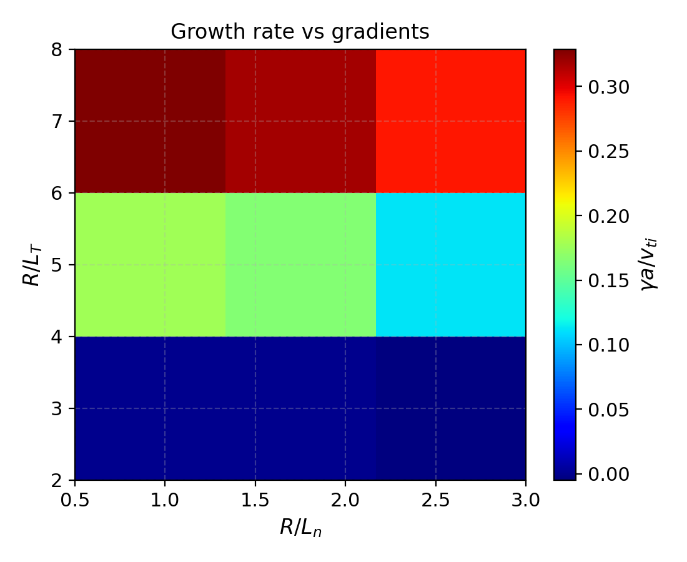
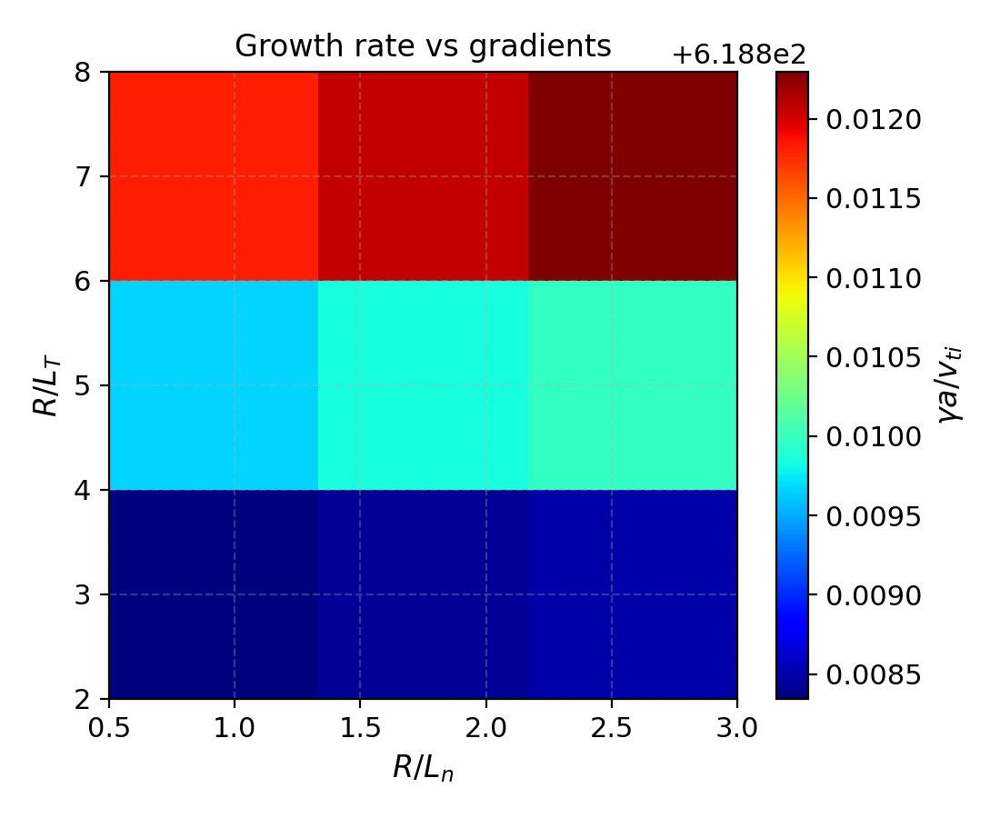
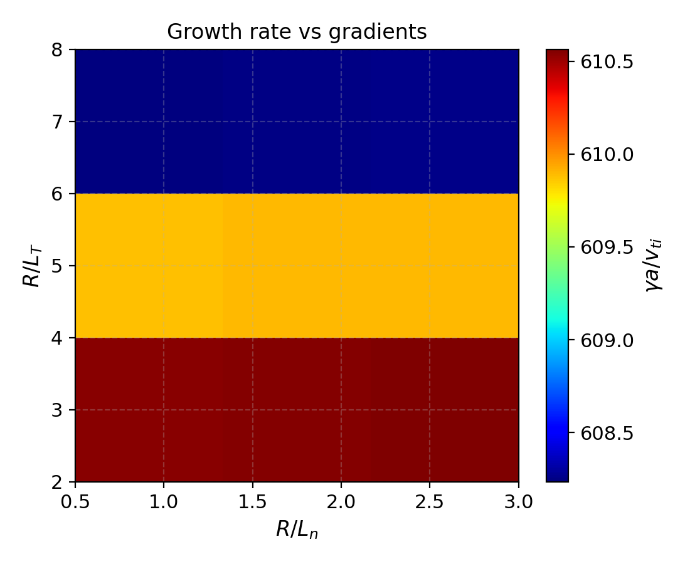
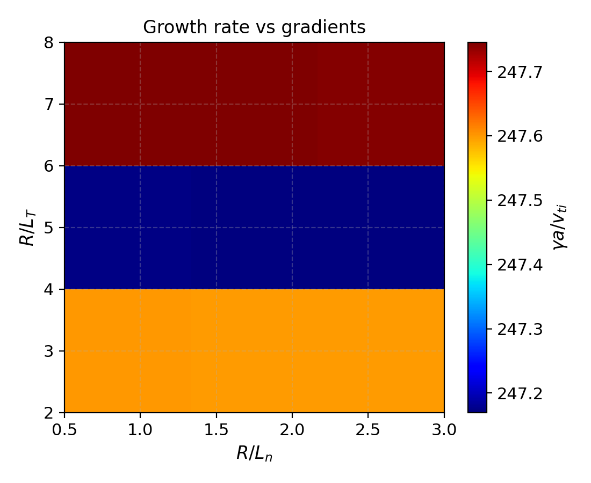

Benchmarks
==========

Cyclone Base Case (Linear, Adiabatic Electrons)
-----------------------------------------------

The Cyclone base case is the canonical ion-temperature-gradient validation
target. SPECTRAX-GK ships a reference dataset stored in:

- ``spectraxgk/data/cyclone_reference_adiabatic.csv``

The benchmark harness loads these values and compares growth rates and
frequencies across a reduced :math:`k_y` scan on the field-aligned grid.

.. figure:: _static/linear_summary.png
   :align: center
   :alt: Linear validation summary

   Multi-panel summary of eigenfunctions, growth rates, and frequencies
   across the linear benchmark suite.

.. figure:: _static/cyclone_comparison.png
   :align: center
   :alt: Cyclone base case comparison

   Cyclone base case growth rates and real frequencies comparing SPECTRAX-GK
   against the published reference dataset.

Kinetic-Electron ITG (Ion-Scale)
--------------------------------

Kinetic electrons introduce the trapped-electron and ion-scale branches used
in published validation studies. The ion-scale kinetic-electron reference data are
stored in:

- ``spectraxgk/data/cyclone_reference_kinetic.csv``

These values are used in the multi-panel validation figure and in the
kinetic-electron regression checks.

ETG (Electron-Scale)
--------------------

Electron-temperature-gradient validation uses a reduced electron-scale box
and a digitized reference dataset from the published electron-scale scan:

- ``spectraxgk/data/etg_reference.csv``

The scan is plotted alongside the SPECTRAX-GK output in the validation
summary figure.

KBM (Electromagnetic Beta Scan)
-------------------------------

Electromagnetic ballooning validation uses a fixed :math:`k_y` and a scan over
:math:`\beta_{ref}`. The reference data are stored in:

- ``spectraxgk/data/kbm_reference.csv``

TEM (Trapped-Electron Mode)
---------------------------

The TEM validation case follows the s-alpha parameters reported in Frei et al.
with steep gradients (:math:`R/L_{Ti} = R/L_{Te} = R/L_n = 20`),
:math:`q=2.7`, :math:`\hat{s}=0.5`, :math:`\epsilon=0.18`, and
:math:`m_e/m_i = 0.0027`. The digitized low-:math:`k_y` reference branch is
stored in:

- ``spectraxgk/data/tem_reference.csv``

Reduced ky scan tables
----------------------

The reduced scan tables below are generated by ``tools/make_tables.py``. The
low-order table provides a quick regression target, while the higher-order
one demonstrates convergence of the Hermite–Laguerre expansion.

Low-order scan (``Nl=2, Nm=4``):

.. csv-table:: Cyclone base case reduced scan (low order)
   :file: _static/cyclone_scan_table_lowres.csv
   :header-rows: 1

Higher-order scan (``Nl=3, Nm=6``):

.. csv-table:: Cyclone base case reduced scan (higher order)
   :file: _static/cyclone_scan_table_highres.csv
   :header-rows: 1

Convergence summary:

.. csv-table:: Cyclone base case convergence check
   :file: _static/cyclone_scan_convergence.csv
   :header-rows: 1

Field-aligned regression
------------------------

We track a reduced :math:`k_y` scan on the field-aligned grid
(``Nx=1, Ny=24, Nz=96, y0=20, ntheta=32, nperiod=2``) with
``Nl=6, Nm=12`` to guard against regressions in geometry, normalization, and
operator assembly:

.. csv-table:: Field-aligned reduced scan
   :file: _static/cyclone_full_operator_scan_table.csv
   :header-rows: 1

Normalization sensitivity
-------------------------

A short scan over ``rho_star`` reports the mean ratios
``|gamma|/gamma_ref`` and ``|omega|/omega_ref`` for the reduced ky subset:

.. csv-table:: rho_star convergence scan
   :file: _static/cyclone_rhostar_convergence.csv
   :header-rows: 1

Gradient heatmaps
-----------------

Growth-rate heatmaps summarise the dependence on :math:`R/L_T` and
:math:`R/L_n` for the major validation cases.

   Cyclone growth rates versus gradients.

   Kinetic-electron (ion-scale) growth rates versus gradients.

   Electron-scale ETG growth rates versus gradients.

   TEM growth rates versus gradients.

Reproducibility
---------------

To regenerate the benchmark tables and figures:

.. code-block:: bash

   python tools/make_tables.py
   python tools/make_figures.py

Reference data extraction
-------------------------

The Cyclone and KBM reference CSVs are extracted from external solver outputs
via the helper script:

.. code-block:: bash

   python tools/extract_cyclone_reference.py \
     /path/to/itg_salpha_adiabatic_electrons_correct.out.nc \
     src/spectraxgk/data/cyclone_reference_adiabatic.csv

Update this step only when the reference dataset changes.
