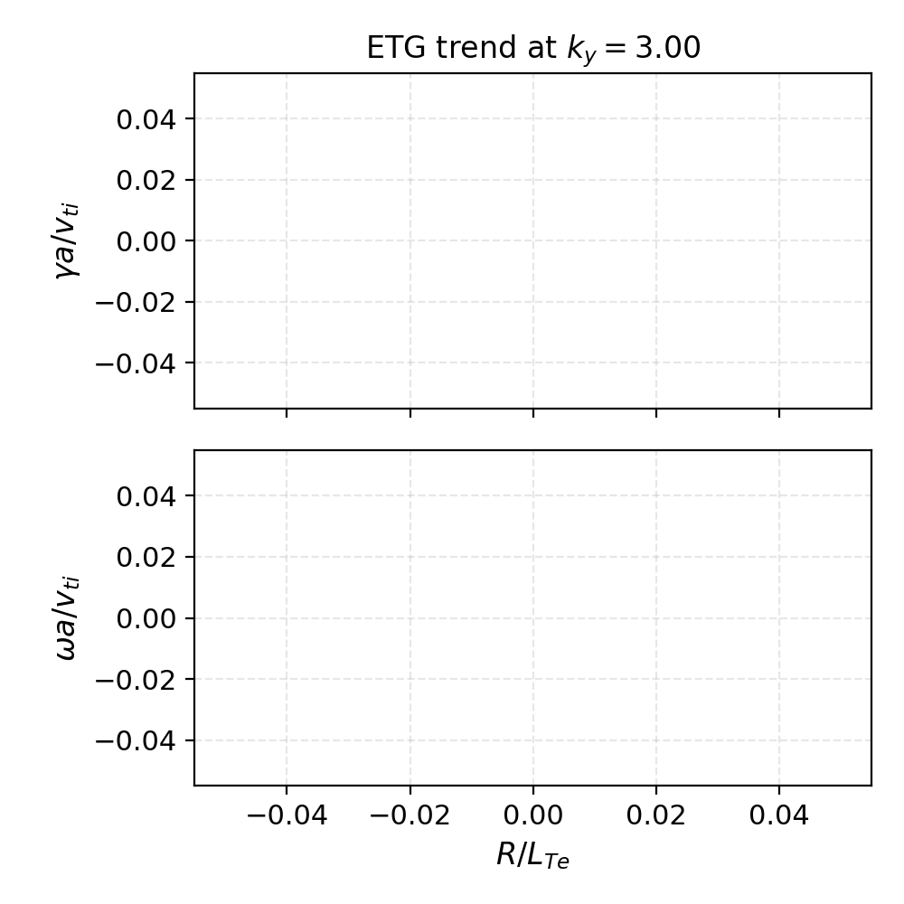
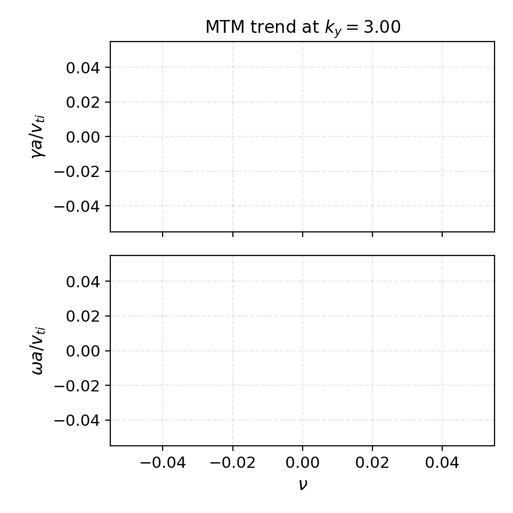

Benchmarks
==========

Cyclone Base Case (Linear, Adiabatic Electrons)
------------------------------------------------

We include a reference dataset for the linear Cyclone base case derived from
published s-alpha benchmark results with adiabatic electrons. [Dimits00]_ The
values are stored in:

- ``spectraxgk/data/cyclone_reference_adiabatic.csv``

These correspond to normalized growth rates and real frequencies commonly used
in linear Cyclone validation. The harness loads these values and provides
utilities to extract growth rates from time series signals. The linear operator
includes curvature, grad-:math:`B`, and mirror couplings in s-alpha geometry,
along with the energy-weighted diamagnetic drive. Small normalization parameters
(``rho_star``, ``omega_d_scale``, ``omega_star_scale``) provide controlled
scaling studies and sensitivity checks during validation.

.. figure:: _static/cyclone_comparison.png
   :align: center
   :alt: Cyclone base case comparison

   Cyclone base case growth rates and real frequencies comparing SPECTRAX-GK
   (linear operator) against the published reference dataset.

How to run the harness
----------------------

.. code-block:: bash

   python examples/cyclone_linear_benchmark.py

Reproducibility
---------------

To regenerate the benchmark tables and figures:

.. code-block:: bash

   python tools/make_tables.py
   python tools/make_figures.py

To reproduce the normalization sweep used in the full-operator tables:

.. code-block:: bash

   python tools/calibrate_cyclone.py \
     --rho-star 0.5 0.75 1.0 1.25 \
     --omega-d-scale 0.8 1.0 1.2 \
     --omega-star-scale 0.8 1.0 1.2 \
     --Nl 6 --Nm 12 --steps 800 --dt 0.01 \
     --output-csv docs/_static/cyclone_full_operator_sweep.csv

The reference CSV can be re-extracted from an external solver output using:

.. code-block:: bash

   python tools/extract_cyclone_reference.py \
     /path/to/itg_salpha_adiabatic_electrons_correct.out.nc \
     src/spectraxgk/data/cyclone_reference_adiabatic.csv

This step is only needed when updating the external benchmark source (see
References).

Benchmark harness
-----------------

The Python helper ``run_cyclone_linear`` runs a short linear simulation and
extracts growth rates using a log-amplitude and phase fit. When
``auto_window=True`` (the default), the harness scans for the most exponential
portion of the time history to reduce sensitivity to early transients. The
auto-window helper supports ``start_fraction``, ``growth_weight``, and
``require_positive`` to bias the fit toward stable eigenmode growth when
transients are present. The benchmark harness defaults to the full drift/mirror
operator (``operator="full"``) with the baseline normalization described in
:doc:`normalization`. Mode extraction can use a fixed ``z_index`` or a
projected, max-amplitude, or SVD-based time series.

Default Cyclone scaling parameters:

- ``omega_d_scale = 1.0``
- ``omega_star_scale = 1.0``
- ``rho_star = 1.0``
- ``method="rk4"`` (explicit), ``mode_method="svd"`` (eigenmode extraction)
- ``operator="full"`` (full drift/mirror operator)

Reduced ky scan tables
----------------------

The reduced scan tables below are generated by ``tools/make_tables.py`` using
the default linear operator on the regression grid. The low-order table uses a
moderate resolution suitable for quick checks, while the higher-order table
uses :math:`N_l=6`, :math:`N_m=12` to demonstrate convergence of the
Hermite–Laguerre expansion.

Low-order (production) scan:

.. csv-table:: Cyclone base case reduced scan (low order)
   :file: _static/cyclone_scan_table_lowres.csv
   :header-rows: 1

Low-order settings: ``Nl=4``, ``Nm=8``, ``dt=0.01``, ``steps=800`` (auto
window), ``Nz=96``.

Higher-order scan:

.. csv-table:: Cyclone base case reduced scan (higher order)
   :file: _static/cyclone_scan_table_highres.csv
   :header-rows: 1

Higher-order settings: ``Nl=6``, ``Nm=12``, ``dt=0.01``, ``steps=800``,
``method="rk4"`` (auto window).

Convergence summary:

.. csv-table:: Cyclone base case convergence check
   :file: _static/cyclone_scan_convergence.csv
   :header-rows: 1

Field-aligned regression
------------------------

We include a regression test that runs the full drift/mirror operator on the
field-aligned grid (``y0``, ``ntheta``, ``nperiod``) and compares against the
Cyclone reference values. This guards against regressions in geometry and
normalization while keeping the test representative of the production
configuration.

The table below tracks the field-aligned output for a reduced ky scan with
``Nx=1, Ny=24, Nz=96, y0=20, ntheta=32, nperiod=2`` and
``Nl=6, Nm=12``.

.. csv-table:: Full-operator reduced scan (field-aligned grid)
   :file: _static/cyclone_full_operator_scan_table.csv
   :header-rows: 1

We also track sensitivity to the perpendicular scale factor ``rho_star`` by
scanning a small range around unity and reporting mean ratios
(``|gamma|/gamma_ref``, ``|omega|/omega_ref``) across the reduced ky subset:

.. csv-table:: Full-operator rho_star convergence scan
   :file: _static/cyclone_rhostar_convergence.csv
   :header-rows: 1

Validation tolerances
---------------------

The physics regression checks currently use ``rtol=0.2`` for the single-mode
Cyclone check (gamma) and ``rtol=0.1`` for the frequency. The reduced ky scan
uses ``rtol=0.25`` for gamma and ``rtol=0.1`` for omega. The reduced tables
above provide context for tightening these tolerances as higher resolution
tables are updated.

ETG Linear Trend (Reduced Electron-Scale Grid)
----------------------------------------------

SPECTRAX-GK includes a reduced electron-temperature-gradient (ETG) benchmark
that targets the electron-scale branch on a compact flux-tube grid. The
benchmark uses a reduced mass ratio (``mass_ratio=100`` by default) and a
smaller perpendicular box (``Lx=Ly=6.28``) to resolve modes with
:math:`k_y \rho_e \sim 0.3` without requiring extreme resolution.

   ETG growth rates and real frequencies versus :math:`R/L_{Te}` at
   :math:`k_y=3.0` on the reduced electron-scale grid.

.. csv-table:: ETG trend table
   :file: _static/etg_trend_table.csv
   :header-rows: 1

To regenerate the ETG trend table and figure:

.. code-block:: bash

   python tools/make_tables.py
   python tools/make_figures.py

MTM Linear Trend (Reduced Collisional Branch)
---------------------------------------------

The reduced microtearing (MTM) benchmark follows the collisional
electron-driven branch on the same electron-scale grid. The reference scan
tracks how the growth rate and frequency respond to weak collisionality (the
growth rate decreases with increasing :math:`\nu`) while keeping the
temperature-gradient drive fixed.

   MTM trend versus collisionality at :math:`k_y=3.0` on the reduced grid.

.. csv-table:: MTM trend table
   :file: _static/mtm_trend_table.csv
   :header-rows: 1

The MTM trend table is regenerated together with the ETG trend by
``tools/make_tables.py``. Both ETG/MTM tables are designed as lightweight
trend checks before introducing full electromagnetic coupling.
