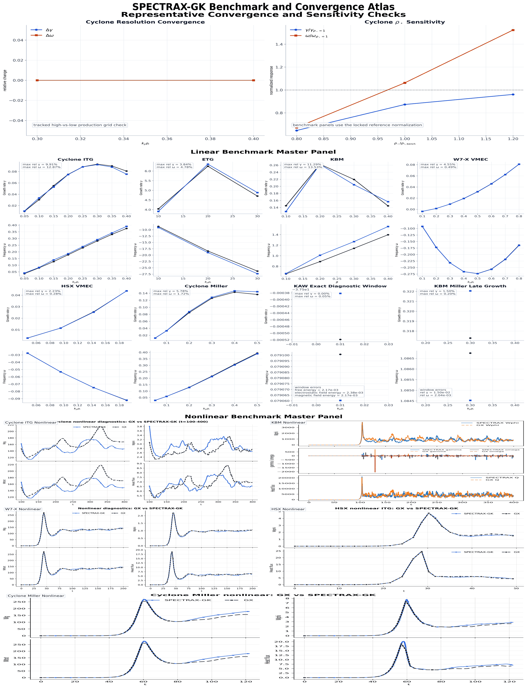
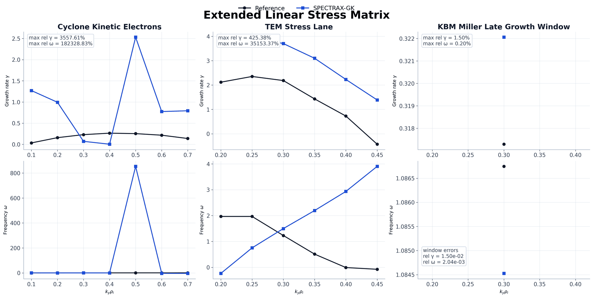

Benchmarks
==========

SPECTRAX-GK’s benchmark figures are organized as a compact atlas instead of a
case-by-case gallery. The layout follows the standard gyrokinetic comparison
pattern:

- linear growth-rate and real-frequency overlays versus ``k_y`` (or ``beta``),
- nonlinear time traces of heat flux, free energy, electrostatic field energy,
  and magnetic field energy when present,
- compact panels that separate exact diagnostic closures from broader stress
  lanes.

The figures in this page are generated directly from tracked CSV assets and
curated comparison traces in ``docs/_static``.

Figure generation
-----------------

Regenerate the atlas figures with:

.. code-block:: bash

   python tools/make_benchmark_atlas.py

The atlas builder now reads its inputs from
``tools/benchmark_atlas_manifest.toml`` and writes a machine-readable summary to
``tools_out/benchmark_atlas_summary.json`` so the panel provenance stays
explicit.

This produces the tracked atlas panels:

- ``docs/_static/benchmark_core_linear_atlas.png``
- ``docs/_static/benchmark_core_nonlinear_atlas.png``
- ``docs/_static/benchmark_convergence_panel.png``
- ``docs/_static/benchmark_readme_panel.png``
- ``docs/_static/benchmark_extended_linear_panel.png``

PDF copies are emitted alongside each PNG for manuscript workflows.

Fresh-run refresh workflow
--------------------------

The tracked atlas is now paired with a refresh manifest:

.. code-block:: bash

   python tools/run_benchmark_refresh.py --list

The refresh runner executes the benchmark matrix in manifest order from
``tools/benchmark_refresh_manifest.toml`` and writes a summary to
``tools_out/benchmark_refresh_summary.json``. Jobs that depend on reference data declare explicit environment-variable requirements for their argument bundles, so the refresh pipeline can be rerun without editing the Python scripts themselves.

Example:

.. code-block:: bash

   python tools/run_benchmark_refresh.py --job cyclone-core-assets --job benchmark-atlas

Tracked benchmark metrics
-------------------------

The benchmark atlas uses the same small set of physically interpretable metrics
throughout:

- growth rate ``gamma``
- real frequency ``omega``
- ion heat flux
- free energy
- electrostatic field energy (legacy variable name ``Wphi``)
- magnetic field energy when ``A_parallel`` or ``B_parallel`` are active

At the README level, these metrics are intentionally packed into one compact
publication panel plus one separate runtime/memory panel. The atlas therefore
answers two questions:

- which branches and diagnostics are being tracked for validation,
- which shipped cases have measured CPU/GPU/runtime-memory coverage.

Representative convergence gate
-------------------------------

The benchmark suite makes convergence explicit instead of leaving it implicit
in the chosen production grids. The tracked convergence tile uses the Cyclone
ITG lane to show:

- grid convergence on the production linear scan at representative
  ``k_y`` values,
- response sensitivity to the benchmark-normalized ``rho_star`` scaling.

.. figure:: _static/benchmark_convergence_panel.png
   :width: 100%
   :align: center
   :alt: Representative convergence panel

   Representative convergence and sensitivity gate. This panel is included in
   the README publication summary so convergence is visible alongside the validation
   figures rather than being left implicit.

Primary publication set
-----------------------

The headline validation set is limited to the full-gyrokinetic lanes that are
already used in the current validation and regression workflow:

- Cyclone ITG linear and nonlinear
- KBM linear and nonlinear
- W7-X VMEC linear and nonlinear
- HSX VMEC linear and nonlinear
- Cyclone Miller geometry linear and nonlinear

The README atlas also includes one extended linear strip for exploratory or
stress lanes that are still useful to show publicly without folding them into
the primary validation claim:

- Cyclone kinetic electrons
- TEM

.. figure:: _static/benchmark_core_linear_atlas.png
   :width: 100%
   :align: center
   :alt: Core linear benchmark atlas

   Linear benchmark master panel. This panel keeps the headline linear
   coverage on one page: Cyclone ITG, ETG, KBM, W7-X, HSX, Cyclone Miller,
   KAW, and the KBM Miller late-growth replay.

.. figure:: _static/benchmark_core_nonlinear_atlas.png
   :width: 100%
   :align: center
   :alt: Core nonlinear benchmark atlas

   Nonlinear benchmark master panel. This panel groups the tracked nonlinear
   overlays used in the public benchmark set: Cyclone, KBM, W7-X, HSX,
   Cyclone Miller, and the reduced cETG comparison.

For the current release pass, Cyclone, KBM, W7-X, HSX, and Cyclone Miller are
treated as the acceptable nonlinear validation set. ETG nonlinear remains a
tracked pilot lane, while TEM and KAW are intentionally kept out of the active
parity claim until their separate recovery work is finished.

Interpretation of validation
----------------------------

The atlas intentionally mixes two classes of evidence:

- broad benchmark overlays over scanned parameters such as ``k_y`` or
  ``beta``,
- exact-window or exact-diagnostic closures on selected lanes.

Only the exact-window closures should be read as strict small-tolerance validation
gates. In the current tracked set those are:

- KAW exact diagnostic window
- KBM Miller late-growth replay

The broader scanned benchmark panels are coverage figures, not universal
``rtol <= 3e-2`` claims for every tile. They remain valuable because they show
which branches and diagnostics are being tracked across the codebase.

Benchmark-specific replay knobs used to regenerate these figures stay confined
to the benchmark builders in ``tools/``. They are not promoted into generic
runtime defaults for the solver or the shipped example drivers.

For the current stellarator nonlinear pair, the tracked public figures should
also be read asymmetrically:

- HSX nonlinear is currently acceptable on the best validated ``t <= 50`` trace
  and remains part of the public benchmark set.
- W7-X nonlinear is still an active repair lane. The tracked figure should show
  the best currently validated ``t <= 200`` trace, but it should not yet be
  interpreted as a closed small-tolerance parity result.

README summary panel
--------------------

   Publication-facing benchmark summary. The README panel is intentionally
   limited to the convergence gate plus the linear and nonlinear master panels
   so the top-level presentation stays compact. In practice that means one
   image for validation/convergence coverage and one separate image for runtime and
   peak-memory measurements.

Extended stress matrix
----------------------

Not every benchmark lane belongs in the headline validation claim. The
extended linear stress matrix keeps exploratory or still-evolving lanes
visible without mixing them into the primary publication set.

The current extended panel covers:

- Cyclone kinetic electrons
- TEM (literature-backed stress lane)
- KBM Miller exact late growth window

   Extended linear stress matrix. These lanes remain visible for solver stress
   testing, but they are intentionally separated from the main publication
   panel.

The TEM row is provisional. The shipped ``tem_reference.csv`` is digitized from
the literature rather than sourced from a GX benchmark dump, and the exact case
definition behind that digitized curve is still being reassembled. It should be
read as a tracked stress lane, not as a closed GX-parity result.

Case groups
-----------

Tokamak core cases
^^^^^^^^^^^^^^^^^^

- Cyclone ITG: linear ``gamma``/``omega`` scans and nonlinear transport traces
- KBM: linear branch-following scans and nonlinear transport traces
- Cyclone Miller geometry: imported linear scan and nonlinear time-trace audit

Stellarator core cases
^^^^^^^^^^^^^^^^^^^^^^

- W7-X VMEC: short-window linear scans and nonlinear transport traces
- HSX VMEC: short-window linear scans and nonlinear transport traces

Reduced and stress cases
^^^^^^^^^^^^^^^^^^^^^^^^

- ETG: linear benchmark overlays
- KAW: exact late-time diagnostic reconstruction and exact-window energy audit
- KBM Miller: exact late-time growth replay on the tracked low-``k_y`` branch
- Cyclone kinetic electrons: extended linear stress lane
- TEM: extended linear stress lane

Notes on interpretation
-----------------------

The atlas is split deliberately. The README stays limited to a compact
publication panel, while this page keeps the larger linear, nonlinear, and
stress figures visible without claiming that every scanned point is an exact
closure.
