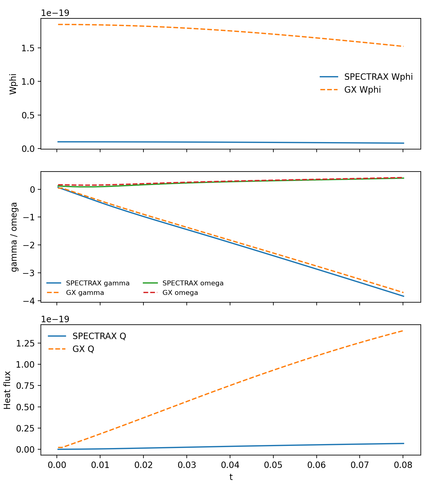
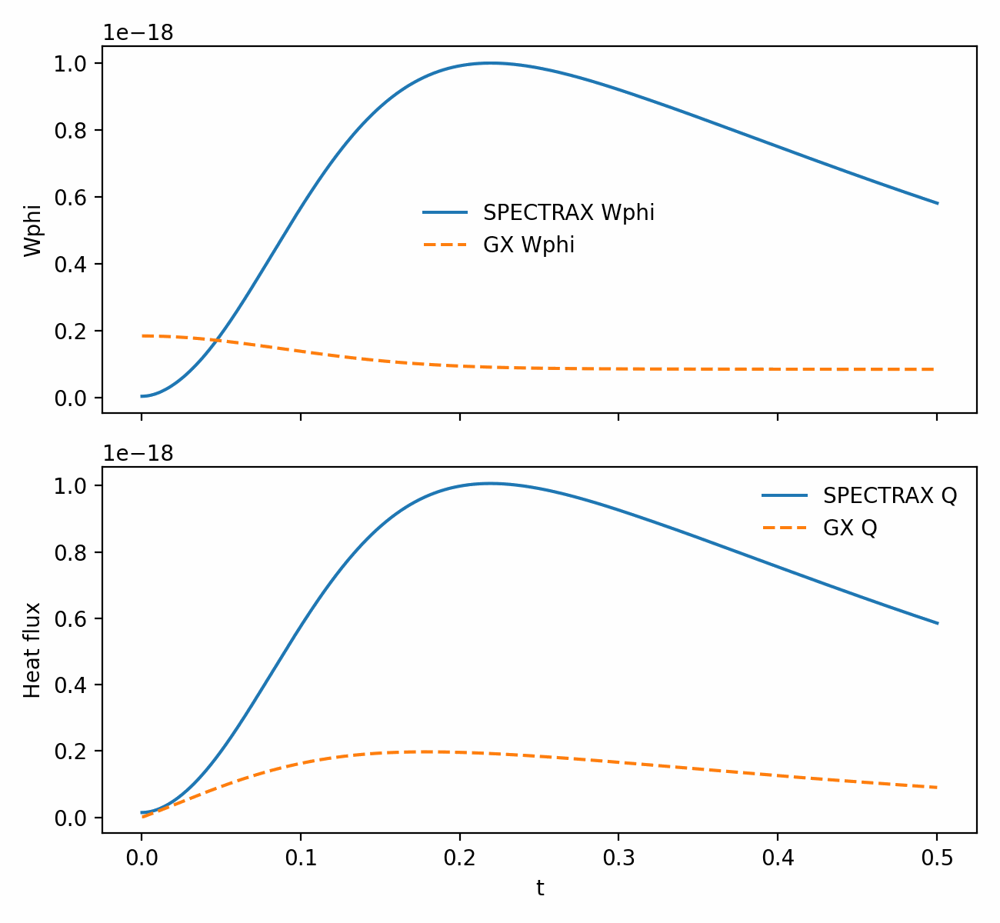
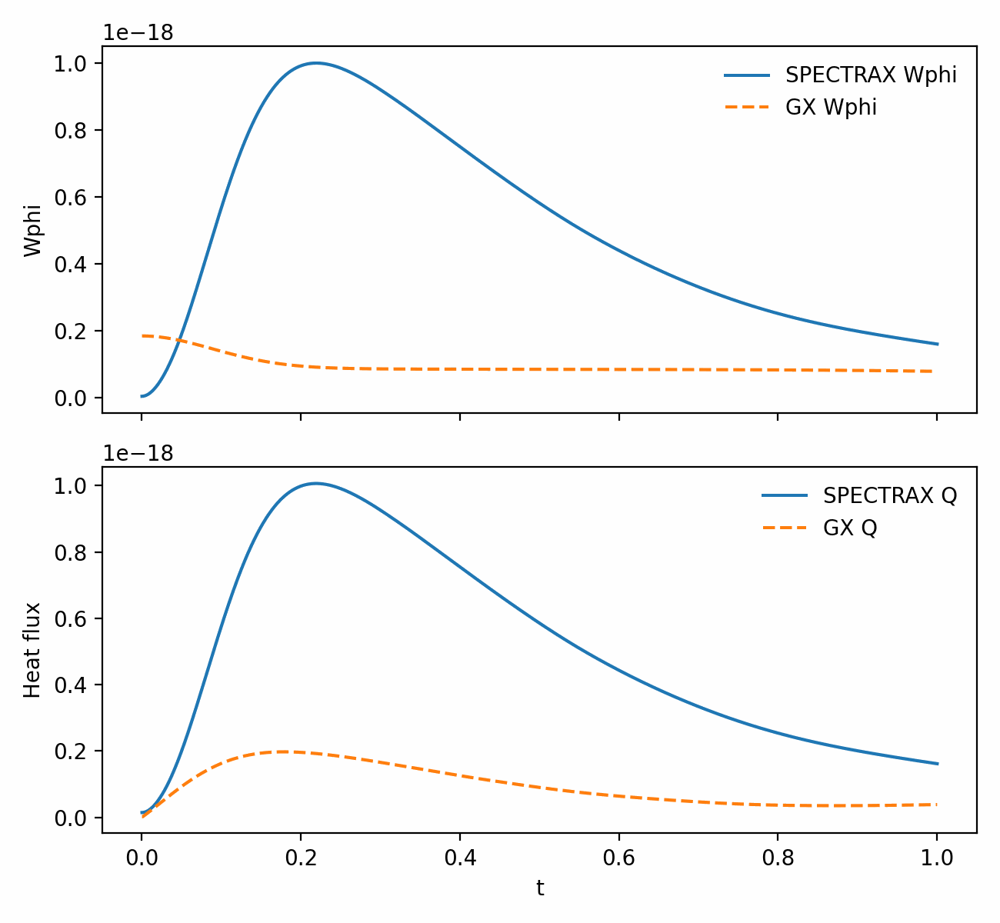
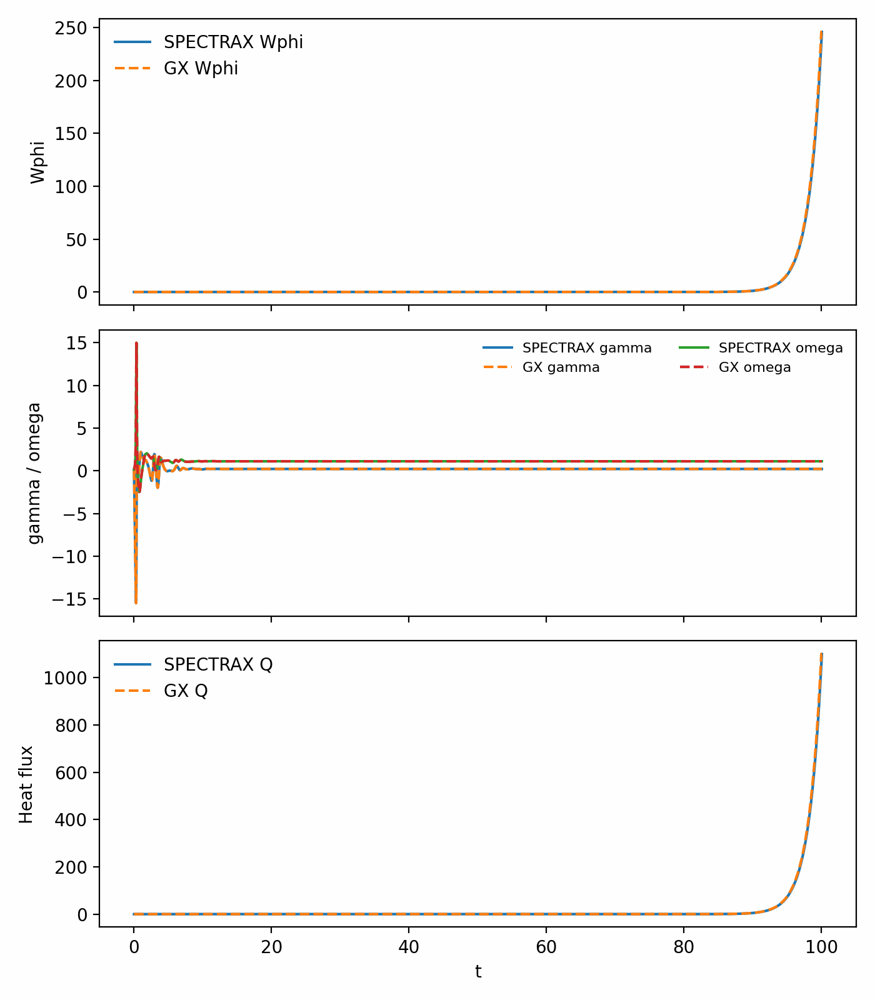
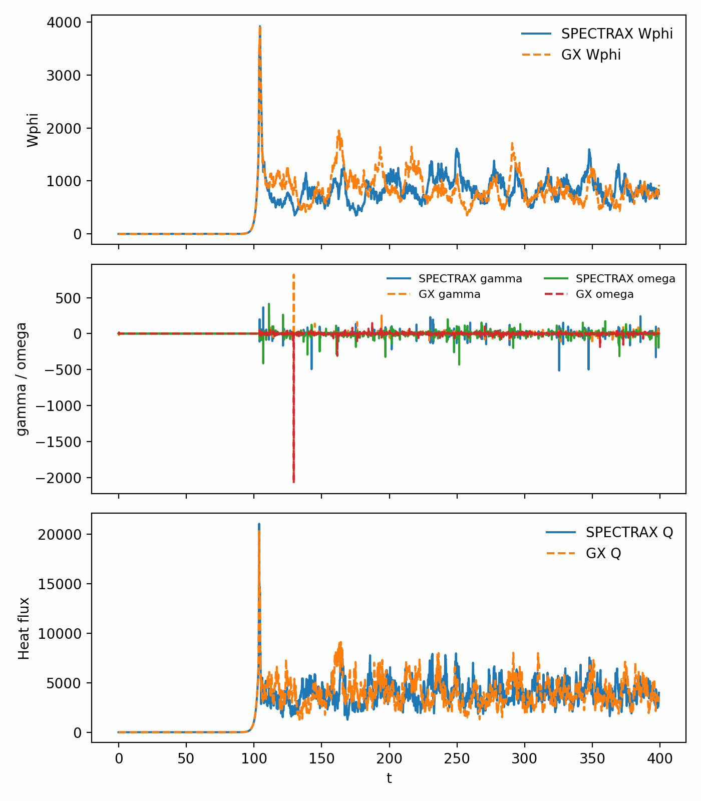
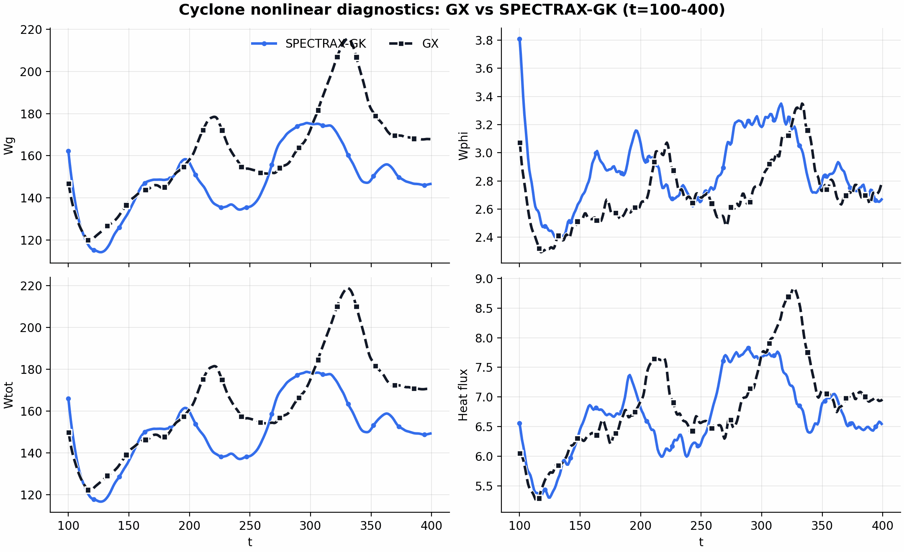

Benchmarks
==========

Benchmark runners default to a matrix-free Krylov/Arnoldi eigen solver for
linear scans, which avoids long explicit time integrations when only growth
rates and frequencies are required. Fixed-step or diffrax time integrators
remain available by setting ``solver="time"`` in the benchmark helpers (or by
calling ``integrate_linear`` directly). A small runtime/memory comparison script
is available in ``tools/benchmark_integrators.py``.

For newcomer-friendly runs, set ``solver="auto"`` and ``fit_signal="auto"``.
This selects between Krylov/time paths and between ``phi``/density diagnostics
using the same windowing rules as the manual fits, and falls back when a
non-finite or strongly damped branch is detected. Advanced users can still
pin any solver or diagnostic choice explicitly.

For the GX KBM comparison anchors (``ky rho_i = 0.1, 0.3, 0.4``), auto mode uses a
deterministic locked solver choice so repeated scans do not drift between
branches. The lock is implemented in ``select_kbm_solver_auto`` and can be
overridden by setting ``solver`` explicitly.

For GX-aligned time integration and diagnostics, SPECTRAX-GK includes a
``integrate_linear_gx`` path that mirrors GX’s RK4 timestep selection and
growth-rate extraction.

The Krylov solver applies a mild frequency cap (``KrylovConfig.omega_cap_factor``)
to avoid selecting spurious high-frequency Ritz values when multiple branches are
present. ``KrylovConfig.mode_family`` and ``KrylovConfig.shift_selection`` add
case-aware targeting for shift-invert runs, and ``KrylovConfig.fallback_method``
controls fallback when a shift-invert solve lands on a non-physical branch.
Set ``omega_cap_factor=0`` to disable frequency capping.

Normalization scalings
----------------------

Per-case normalization factors are applied to the diamagnetic and curvature
frequencies to align with published reference data. The canonical source is
``spectraxgk.normalization`` (``get_normalization_contract(case)``); benchmark
constants remain compatibility aliases.

.. list-table:: Calibration scalings (current code defaults)
   :header-rows: 1

   * - Case
     - ``omega_d_scale``
     - ``omega_star_scale``
   * - Cyclone (adiabatic)
     - ``1.0``
     - ``1.0``
   * - ETG
     - ``0.4``
     - ``0.8``
   * - KBM
     - ``1.0``
     - ``0.8``

Diagnostic reporting normalization is controlled independently via
``diagnostic_norm``:

- ``none``: report raw solver values.
- ``gx`` / ``rho_star``: report ``rho_star * (gamma, omega)``.

Performance defaults
--------------------

Current defaults prioritize robust runs for mixed stiffness:

- ``TimeConfig(use_diffrax=True, diffrax_solver="Dopri8", diffrax_adaptive=True)``
- ``progress_bar=False`` by default for scan throughput and cleaner JIT behavior.
- ``streaming_fit=True`` in scan helpers to avoid storing full time traces unless
  explicitly requested.
- ``ky_batch>1`` with ``fixed_batch_shape=True`` to keep batch shapes constant
  across scans and avoid tail-batch recompiles.

Profiling snapshot (Cyclone, ``ky=0.3``, ``Nl=16``, ``Nm=48``, ``t_max=20``, ``dt=0.01``):

- compile+warmup: ~27.5 s
- steady run: ~24.9 s
- reference output: ``gamma=0.0873``, ``omega=0.2907`` (close to reference)

RHS HLO profiling shows the primary compile/runtime pressure comes from scan
loops and update-heavy kernels (high ``while``/``scatter`` counts in the
compiled HLO). For large scans, prefer:

- ``progress_bar=False``
- consistent ``dt/steps`` to avoid recompilation
- ``sample_stride>1`` to reduce diagnostics overhead
- ``diagnostics_stride>1`` to compute GX-style diagnostics less frequently
- Krylov scan mode for linear eigenvalue-only workflows

Cyclone Base Case (Linear, Adiabatic Electrons)
-----------------------------------------------

The Cyclone base case is the canonical ion-temperature-gradient validation
target. SPECTRAX-GK ships a reference dataset stored in:

- ``spectraxgk/data/cyclone_reference_adiabatic.csv``

The benchmark harness loads these values and compares growth rates and
frequencies across a reduced :math:`k_y` scan on the field-aligned grid.

GX-aligned mode
^^^^^^^^^^^^^^^
SPECTRAX-GK includes a GX-aligned mode for Cyclone that mirrors GX’s default
choices for geometry normalization and growth-rate extraction:

* ``drift_scale=1.0`` (GX normalization for curvature/grad-B drifts).
* Midplane sampling at ``z_index = nz//2 + 1`` (GX growth-rate diagnostic).
* GX-style RK4 integration with adaptive timestep (CFL-based) and
  instantaneous ``phi``-ratio extraction for ``(gamma, omega)``.
* GX timestep cap semantics (``dt_max = dt`` when ``dt_max`` is unset).
* GX validity mask for growth diagnostics (non-zero real and imaginary parts).

The Cyclone base-case helpers use these GX-aligned settings by default.
Individual pieces can still be overridden through explicit runtime/config
choices (e.g. custom ``geometry.drift_scale`` or solver selection).

.. list-table:: Cyclone base case parameters (GX Fig. 1)
   :header-rows: 1

   * - Parameter
     - Value
   * - Geometry
     - ``q=1.4``, ``s_hat=0.8``, ``epsilon=0.18``, ``R0=2.77778``
   * - Gradients
     - ``R/LTi=2.49``, ``R/LTe=0.0``, ``R/Ln=0.8``
   * - Species
     - ions only; adiabatic electrons with ``tau_e=1``
   * - Electromagnetic
     - ``beta=0``, ``A_parallel=off``, ``B_parallel=off``
   * - Collisions
     - ``nu_i=1e-2``, GX-style hypercollisions (kz-proportional) on
   * - Operator toggles
     - streaming/mirror/curvature/grad-B/diamagnetic on; nonlinear off
   * - Grid
     - ``Nx=1, Ny=24, Nz=96, y0=20, ntheta=32, nperiod=2``
   * - Velocity resolution
     - ``Nl=6, Nm=16`` (legacy figure generation); GX-aligned scans use
       per-ky balanced resolutions below.
   * - Reference
     - [GX]_

.. figure:: _static/linear_summary.png
   :align: center
   :alt: GX comparison summary for Cyclone and KBM

   GX comparison summary panel for Cyclone and KBM, combining linear
   eigenfunction overlays, linear ``k_y`` growth/frequency scans, and
   nonlinear time traces of growth rate, frequency, and heat flux.

Regenerate this panel with:

- ``python tools/compare_gx_linear.py --gx /path/to/itg_salpha_adiabatic_electrons.out.nc --out docs/_static/cyclone_gx_mismatch.csv``
- ``python tools/compare_gx_kbm.py --gx /path/to/kbm_salpha.out.nc --gx-big /path/to/kbm_salpha.big.nc --branch-policy fixed --solver gx_time --out docs/_static/kbm_gx_mismatch.csv``
- ``python tools/make_gx_cyclone_kbm_panel.py --out docs/_static/gx_cyclone_kbm_panel.png``

By default, ``make_gx_cyclone_kbm_panel.py`` uses:

- Cyclone nonlinear diagnostics from the GX-matched runtime config
  (same RK family/CFL controls as GX, and no manual ``flux_scale`` or
  ``wphi_scale`` override in the config).
- Cyclone and KBM long nonlinear windows (``t=400`` for both cases). The KBM
  panel uses the full transport horizon while capping nonlinear ``gamma`` and
  ``omega`` to the earlier startup window where those single-mode diagnostics
  remain interpretable.
- A GX-style time-integrated SPECTRAX KBM eigenfunction (not a standalone
  Krylov vector) so the plotted mode is selected the same way as GX.

.. figure:: _static/cyclone_comparison.png
   :align: center
   :alt: Cyclone base case comparison

   Cyclone base case growth rates and real frequencies comparing SPECTRAX-GK
   against GX (published reference), GS2, and stella.

.. csv-table:: Cyclone GS2 mismatch table (tuned)
   :file: _static/cyclone_gs2_mismatch.csv
   :header-rows: 1

.. csv-table:: Cyclone stella mismatch table (tuned)
   :file: _static/cyclone_stella_mismatch.csv
   :header-rows: 1

.. list-table:: Cyclone base case (GX-style integrator, balanced resolution)
   :header-rows: 1

   * - ky rho_i
     - Nl
     - Nm
     - t_max
     - gamma
     - omega
     - rel gamma
     - rel omega
   * - 0.05
     - 16
     - 8
     - 80
     - 0.00994
     - 0.0413
     - +1.2%
     - +13%
   * - 0.10
     - 16
     - 8
     - 20
     - 0.0299
     - 0.0790
     - -1.8%
     - -1.1%
   * - 0.20
     - 24
     - 12
     - 20
     - 0.0762
     - 0.1853
     - +1.6%
     - +4.2%
   * - 0.30
     - 24
     - 12
     - 10
     - 0.0904
     - 0.2906
     - -2.8%
     - +3.1%

Low-ky points converge slowly in time; even with ``t_max=80`` the ``ky=0.05``
frequency remains elevated relative to the reference. Further convergence may
require longer windows or higher velocity resolution.

W7-X imported GX geometry (linear ITG)
--------------------------------------

SPECTRAX-GK can now run linear GX-time diagnostics directly on GX/VMEC
``*.eik.nc`` field-line geometry. The current short-window parity anchor uses
the GX W7-X adiabatic-electron ITG example with the imported geometry file
``itg_w7x_adiabatic_electrons.eik.nc`` and the corrected GX ``t=2`` output.

Regenerate the tracked mismatch table with:

- ``python tools/compare_gx_imported_linear.py --gx /path/to/itg_w7x_adiabatic_electrons.out.nc --geometry-file /path/to/itg_w7x_adiabatic_electrons.eik.nc --ky 0.1 0.2 0.3 0.4 --out docs/_static/w7x_linear_t2_scan.csv``

The comparison tool reads the sampled geometry and the GX output time grid,
infers the real-FFT ``ky`` layout from the GX file, converts the GX end-damping
input into the solver-side RHS coefficient, and reports per-``ky`` mismatch in
``omega``, ``gamma``, and GX-style field-energy diagnostics.

.. csv-table:: W7-X imported-geometry mismatch table (GX ``t=2``)
   :file: _static/w7x_linear_t2_scan.csv
   :header-rows: 1

The low-``ky`` W7-X branch is close to marginal, so the tracked table records
both absolute and floor-regularized relative ``gamma`` errors. For
``ky = 0.2`` to ``0.4``, the current imported-geometry parity is within about
``4.3e-5`` mean relative error in ``omega`` and about ``0.4%`` to ``1.0%`` in
``gamma`` over the sampled GX time grid.

ETG (GS2/Stella Cross-Code)
---------------------------

The ETG cross-code tuning workflow uses matched GS2/stella NetCDF outputs and
SPECTRAX fixed-step IMEX growth extraction for the same
``(ky, geometry, species, gradients)``.

.. list-table:: ETG cross-code parameters
   :header-rows: 1

   * - Parameter
     - Value
   * - Geometry
     - ``q=1.5``, ``s_hat=0.8``, ``epsilon=0.18``, ``R0=3.0``
   * - Gradients
     - ion: ``R/LTi=0``, ``R/Lni=0``; electron: ``R/LTe=2.49``, ``R/Lne=0.8``
   * - Species
     - two-species kinetic ions + electrons, ``Te/Ti=1``, ``mi/me=3670``
   * - Electromagnetic
     - electrostatic reference (``beta=1e-5``, ``A_parallel=off``, ``B_parallel=off``)
   * - Collisions
     - ``nu_i=0``, ``nu_e=0``, GX-style hypercollisions on
   * - Operator toggles
     - streaming/mirror/curvature/grad-B/diamagnetic on; nonlinear off
   * - Grid
     - ``Nx=1, Ny=96, Nz=96, ntheta=32, nperiod=2``
   * - Linear scan mode
     - fixed-step IMEX2 extraction (scan default), Diffrax adaptive optional
   * - Velocity resolution
     - ``Nl=10, Nm=12``
   * - Tuned ETG scales
     - ``omega_d_scale=0.4``, ``omega_star_scale=0.8``

.. image:: _static/etg_gs2_stella_comparison.png
   :width: 85%
   :alt: ETG cross-code comparison (SPECTRAX vs GS2 vs stella)

.. csv-table:: ETG GS2 mismatch table (tuned)
   :file: _static/etg_gs2_mismatch.csv
   :header-rows: 1

.. csv-table:: ETG stella mismatch table (tuned)
   :file: _static/etg_stella_mismatch.csv
   :header-rows: 1

ETG branch-isolation diagnostics
^^^^^^^^^^^^^^^^^^^^^^^^^^^^^^^^

For high-:math:`k_y` ETG branch selection checks, use:

- ``python tools/etg_branch_isolation.py``
- ``python tools/compare_rhs_terms.py --case etg --ky 5 --adiabatic-ions --Ny 24 --Lx 6.28 --Ly 6.28 --y0 0.2 --Nl 48 --Nm 16 --boundary linked``
- ``python tools/compare_rhs_terms.py --case etg --ky 25 --adiabatic-ions --Ny 24 --Lx 6.28 --Ly 6.28 --y0 0.2 --Nl 48 --Nm 16 --boundary linked``
- ``python tools/etg_physics_audit.py --ky 5 --Nl 48 --Nm 16``
- ``python tools/etg_physics_audit.py --ky 25 --Nl 48 --Nm 16``

KBM (Electromagnetic Ky Scan)
-----------------------------

For GX comparison closure we match GX's ``kbm_salpha.in`` benchmark directly:
fixed :math:`\beta_{ref}` with a :math:`k_y` scan in s-alpha geometry. Use
``benchmarks/linear/KBM/kbm_salpha.in`` in the GX repository and
``tools/compare_gx_kbm.py`` in SPECTRAX-GK to regenerate the mismatch tables.

.. list-table:: KBM parameters (GX s-alpha matched-input set)
   :header-rows: 1

   * - Parameter
     - Value
   * - Geometry
     - ``q=1.4``, ``s_hat=0.8``, ``epsilon=0.18``, ``R0=2.77778``
   * - Gradients
     - ``R/LTi=2.49``, ``R/LTe=2.49``, ``R/Ln=0.8``
   * - Species
     - ions + electrons, ``Te/Ti=1``, ``mi/me=3670``
   * - Electromagnetic
     - fixed ``beta_ref=0.015``, ``A_parallel=on``, ``B_parallel=off``
   * - Collisions
     - ``nu_i=0``, ``nu_e=0``, GX-style hypercollisions on
   * - Operator toggles
     - streaming/mirror/curvature/grad-B/diamagnetic on; nonlinear off
   * - Grid
     - ``Nx=1, Ny=16, Nz=96, y0=10, ntheta=32, nperiod=2``
   * - Velocity resolution
     - ``Nl=16, Nm=48`` (GX comparison target)
   * - Time integration (cross-code)
     - GX-style RK4 with adaptive dt (comparison); fixed-step IMEX2 for scan speed
  * - Fit policy (cross-code)
    - projected complex mode signal extracted from the selected ``(ky, kx)``
      structure, with GX-time averaging or log-linear auto-windowing as needed
   * - Reference
     - GX linear KBM (s-alpha geometry, matched-input set)

KBM GX cross-code run
^^^^^^^^^^^^^^^^^^^^^

We execute a matched-input KBM cross-code set on the GX ``ky`` grid
(``ky rho_i = [0.1, 0.2, 0.3, 0.4, 0.5]``). Use:

- ``python tools/compare_gx_kbm.py --gx /path/to/kbm_salpha.out.nc --gx-big /path/to/kbm_salpha.big.nc --branch-policy fixed --solver gx_time --mode-method project --out docs/_static/kbm_gx_mismatch.csv``

The default KBM harness is now deterministic: one chosen solver is used across
the whole ``ky`` scan, and the output table includes ``eig_overlap_gx``,
``eig_rel_l2``, and ``eig_overlap_prev`` so branch continuity can be audited
separately from ``gamma``/``omega`` mismatch. The legacy GX-scored
per-point solver picker is still available through
``--branch-policy gx-ref-auto`` for forensic studies, but it is no longer the
default benchmark mode. When a fixed-solver scan still jumps between nearby
KBM branches, ``--branch-policy continuation`` scores the candidate solvers by
``gamma``/``omega`` mismatch together with GX overlap and previous-``ky`` mode
continuity, making the branch choice explicit instead of silently changing the
physics extraction rule point-by-point. For branch-isolation studies with the
Krylov solver, ``--krylov-gx-shift`` additionally seeds shift-invert with the
GX reference eigenvalue so the harness can ask for the same branch explicitly.
The harness now defaults to ``--mode-method project`` so the reported
``gamma``/``omega`` follow the same projected-mode extraction used by the KBM
benchmark API instead of silently dropping back to a midplane-only signal.
Explicit Krylov shifts now bypass the built-in KBM target sweep instead of being
silently retargeted to the default heuristic branches. When an explicit shift is
used, the Krylov entry point also honors the requested seed source, so
shift-invert can reuse a propagator/power seed instead of always restarting
from the raw initial condition. The benchmark harness keeps that seed source
explicit via ``--krylov-gx-shift-source`` instead of hardwiring one KBM policy.

KBM nonlinear term comparison (GX)
^^^^^^^^^^^^^^^^^^^^^^^^^^^^^^^^^^

For nonlinear KBM comparison, we compare GX and SPECTRAX term dumps at one time
step (same state, same grid, same normalization). The GX run uses
``GX_DUMP_NL_DERIVS=1`` and ``GX_DUMP_NL_TERMS=1`` so each nonlinear building
block is exported:

- ``dJ0phi_dx``, ``dJ0phi_dy``
- ``dg_dx``, ``dg_dy``
- ``bracket_real`` (real-space Poisson bracket)
- ``exb_total`` (spectral E×B increment)
- ``bracket_apar`` and ``flutter`` (electromagnetic nonlinear split)
- ``total`` (final nonlinear RHS increment)

Reference command (SPECTRAX side):

- ``python tools/compare_gx_nonlinear_terms.py --gx-dir /path/to/gx/dumps --gx-out /path/to/kbm_salpha_nonlinear.out.nc --case kbm --ky 0.3 --kx-order native``

The comparator now supports GX dump folders directly:

- ``rhs_terms_shape.txt`` is optional (it is inferred from GX input/output plus dump vectors).
- ``--Nl`` / ``--Nm`` default to the dump metadata instead of hard-coded values.
- ``--y0`` defaults to the positive-``ky`` GX grid spacing, so the reconstructed
  SPECTRAX grid matches the dump's field-line box unless you override it.
- ``nl_apar.bin`` / ``nl_bpar.bin`` are accepted directly (no manual renaming).

For terms whose reference amplitudes are near machine zero, use absolute
differences as the acceptance metric (relative errors can be numerically large
with tiny denominators).

For nonlinear diagnostic comparison (``Wg``, ``Wphi``, ``Wapar``, heat/particle
fluxes), we now use the same scale-aware relative-error denominator for both
the short-window and long-window KBM gates. The earlier apparent late-time KBM
collapse was traced to three parity issues outside the core GX-aligned equations:

- the GX-aligned KBM runtime examples had incorrectly disabled linked-end damping,
- the GX real-FFT nonlinear bracket reconstruction was missing the required
  ``kx`` reversal for the negative-``ky`` block, and
- the long-horizon restart study had been seeded from GX ``g_state.bin`` from
  the linear-term dump path instead of the exact RK4 stage-0 state
  (``rk4_stage0_g_state.bin``).

KBM nonlinear short-time diagnostics comparison (dense GX cadence)
^^^^^^^^^^^^^^^^^^^^^^^^^^^^^^^^^^^^^^^^^^^^^^^^^^^^^^^^^^^^^^^^^^

Before long-run KBM comparison, we run a short-window diagnostic check with dense
GX writes so ``omega`` is compared at near-identical times instead of sparse
interpolation.

GX (office GPU) dense-cadence runs:

- ``kbm_salpha_nonlinear_short_dense.in`` with ``nwrite=2`` and fixed ``dt``
  at matched-input settings.
- Outputs used for comparison gates:
  ``.cache/gx/kbm_salpha_nonlinear_short_dense.out.nc`` (``t_max=0.08``),
  ``.cache/gx/kbm_salpha_nonlinear_t0p20_dense.out.nc`` (``t_max=0.20``).

SPECTRAX matched comparison probes:

- ``python -m spectraxgk.cli run-runtime-nonlinear --config examples/configs/runtime_kbm_nonlinear_gx_short.toml --steps 267 --out .cache/spectrax/kbm_nonlinear_diag_short_3e4.csv``
- ``python -m spectraxgk.cli run-runtime-nonlinear --config examples/configs/runtime_kbm_nonlinear_gx_seed.toml --steps 667 --out .cache/spectrax/kbm_nonlinear_diag_t0p20.csv``

The GX-aligned KBM runtime examples now use the same electron mass as the GX
reference inputs (``m_e = 2.7e-4`` in ion-mass units). Using the physical
``m_e/m_i`` ratio here introduced a persistent ``A_parallel``/transport bias in
the nonlinear KBM comparison even when the equations and diagnostics matched.

Comparison:

- ``python tools/compare_gx_nonlinear.py --gx .cache/gx/kbm_salpha_nonlinear_t0p20_dense.out.nc --spectrax .cache/spectrax/kbm_nonlinear_diag_t0p20.csv --out docs/_static/nonlinear_kbm_diag_compare_short_dense.png``
- ``python tools/compare_gx_nonlinear.py --gx .cache/gx/kbm_salpha_nonlinear_t0p20_dense.out.nc --spectrax .cache/spectrax/kbm_nonlinear_diag_t0p20.csv --early-tmax 0.1 --late-tmin 1.0 --rtol-early-Wg 0.05 --rtol-early-heat 0.25 --rtol-late-Wg 0.5 --rtol-late-heat 1.0``

The nonlinear comparator now uses a scale-aware relative-error denominator
instead of a fixed floor. This avoids artificially tiny relative errors when a
channel amplitude is near machine zero and supports two tolerance regimes:

- strict early-time gate (``t <= 0.1``) for deterministic startup parity,
- relaxed late-time gate (``t >= 1`` by default) for branch-sensitive nonlinear drift.

For channels with very small amplitudes (especially early fluxes), the
comparator also supports absolute-error fallbacks in each window:

- ``--atol-early-Wg``, ``--atol-early-heat``, ``--atol-early-pflux``
- ``--atol-late-Wg``, ``--atol-late-heat``, ``--atol-late-pflux``

Each window/channel passes if either ``rel_error <= rtol`` or
``abs_error <= atol``.

GX stores ``Wapar`` with a duplicated species axis in the nonlinear diagnostics
output. The GX comparison tools therefore use the first GX species entry for
``Wapar`` instead of summing over species, while ``Wg``, ``Wphi``, heat flux,
and particle flux continue to sum across species in the usual way.

Observed in this short-window gate:

- ``Wphi`` and heat-flux channels remain near machine-level comparison.
- ``omega`` mismatch is reduced by using the denser GX cadence and a stable
  SPECTRAX step size (``dt=3e-4``), with late-window ``omega`` mismatch
  significantly smaller than early-transient mismatch.
  For the current ``t_max=0.20`` gate, mean relative ``omega`` error is
  ``~6.9%`` over the full window and ``~3.9%`` for ``t >= 0.02``.

   Short-window nonlinear KBM diagnostics comparison using a denser GX write
   cadence (``nwrite=2``).

KBM nonlinear horizon extension (same locked seed)
^^^^^^^^^^^^^^^^^^^^^^^^^^^^^^^^^^^^^^^^^^^^^^^^^^^

Using the same locked short-gate settings (RK4, ``dt=3e-4``, GX diagnostics
mode reduction, ``Nl=4``, ``Nm=8``, ``ky=0.3``), we extended the run horizon:

- ``t_max=0.50`` against ``.cache/gx/kbm_salpha_nonlinear_t0p50_dense.out.nc``
- ``t_max=1.00`` against ``.cache/gx/kbm_salpha_nonlinear_t1p00_dense.out.nc``

Findings:

- ``Wphi`` and heat-flux channels remain close in relative error
  (order ``1e-7``).
- ``omega`` remains good in the early/mid window, then diverges as the run
  enters nonlinear branch-sensitive dynamics.
- In the ``t_max=1.00`` run, the first persistent drift appears around
  ``t ~ 0.35`` (5e-2 window bins), after which instantaneous ``gamma``/``omega``
  mismatches are no longer a robust comparison metric.

For this regime, comparison acceptance should use:

- short/early-window instantaneous ``gamma``/``omega`` checks, and
- late-window averaged energy/flux diagnostics.

   Nonlinear KBM diagnostics comparison extension to ``t_max=0.50``.

   Nonlinear KBM diagnostics comparison extension to ``t_max=1.00``.

Long-horizon KBM comparison (current matched run: ``t = 100``) uses the same
two-window acceptance pattern:

- strict startup gate (``t <= 0.2``), and
- relaxed late-time gate (``t >= 20``), with optional absolute-error fallback
  for near-zero flux channels.

With the corrected runtime config and full-spectrum real-FFT bookkeeping, the
matched ``t=100`` KBM run passes both the strict startup window and the
relaxed late-time pointwise window against GX. The current end-to-end mean
relative errors over the full ``t=100`` trace are approximately
``Wg=6.54e-3``, ``Wphi=6.54e-3``, ``Wapar=6.54e-3``,
``heat_flux=6.53e-3``, ``particle_flux=6.54e-3``,
``gamma=7.13e-3``, and ``omega=1.85e-4``. An exact-state restart from the GX
RK4 stage-0 dump at ``t≈5`` also matches the GX continuation through
``t=20`` at roughly ``8e-4`` relative error, confirming that the matched
nonlinear solver path is aligned before the turbulence decorrelates.

   Nonlinear KBM long-horizon diagnostics (GX vs SPECTRAX-GK), now passing the
   strict early-time and relaxed late-time tolerance windows on the matched
   ``t=100`` run.

For the extended ``t=400`` KBM run we no longer use pointwise late-time
interpolation as the primary acceptance metric. Once the saturated turbulence
decorrelates, the physically relevant parity target is the late-window
statistics on each code's native time grid:

- strict startup gate from a dense GX reference run (``t <= 0.2``), and
- late-window statistical gate from the long GX run (``t >= 20``),
  comparing window means and standard deviations of ``Wg``, ``Wphi``,
  ``Wapar``, heat flux, and particle flux.

Using that two-reference workflow, the current ``KBM t=400`` run passes both
windows. The startup mismatch stays at about ``1e-5`` relative error in
``Wg``, heat flux, and particle flux when compared against the dense
``t=0.20`` GX file, while the long-window statistical mismatch against the
``t=400`` GX trace is about ``5.6%`` for ``Wg``, ``4.9%`` for heat flux, and
``5.9%`` for particle flux (max of mean/std relative error over ``t >= 20``).

   Nonlinear KBM extended comparison to ``t=400``. Startup parity is checked
   against the dense short GX reference, while the late saturated regime is
   assessed by native-grid window statistics instead of pointwise interpolation.

Reduced ky scan tables
----------------------

The reduced scan tables below are generated by ``tools/make_tables.py``. The
low-order table provides a quick regression target, while the higher-order
one demonstrates convergence of the Hermite–Laguerre expansion.

Low-order scan (``Nl=2, Nm=4``):

.. csv-table:: Cyclone base case reduced scan (low order)
   :file: _static/cyclone_scan_table_lowres.csv
   :header-rows: 1

Higher-order scan (``Nl=3, Nm=6``):

.. csv-table:: Cyclone base case reduced scan (higher order)
   :file: _static/cyclone_scan_table_highres.csv
   :header-rows: 1

Convergence summary:

.. csv-table:: Cyclone base case convergence check
   :file: _static/cyclone_scan_convergence.csv
   :header-rows: 1

Field-aligned regression
------------------------

We track a reduced :math:`k_y` scan on the field-aligned grid
(``Nx=1, Ny=24, Nz=96, y0=20, ntheta=32, nperiod=2``) with
``Nl=6, Nm=12`` to guard against regressions in geometry, normalization, and
operator assembly:

.. csv-table:: Field-aligned reduced scan
   :file: _static/cyclone_full_operator_scan_table.csv
   :header-rows: 1

Normalization sensitivity
-------------------------

A short scan over ``rho_star`` reports the mean ratios
``|gamma|/gamma_ref`` and ``|omega|/omega_ref`` for the reduced ky subset:

.. csv-table:: rho_star convergence scan
   :file: _static/cyclone_rhostar_convergence.csv
   :header-rows: 1

Cross-code runtime and memory (representative points)
-----------------------------------------------------

The table below is a staging table for the cross-code performance appendix.
Values are wall-clock and peak RSS on the current development workstation.
SPECTRAX numbers currently include first-run JAX compilation overhead.

.. list-table:: Runtime and memory comparison (staging)
   :header-rows: 1

   * - Benchmark point
     - SPECTRAX-GK
     - GX
     - GS2
     - stella
   * - Cyclone ``ky=0.3`` (s, MB)
     - ``31.5 s, 664 MB`` (first-run JIT)
     - pending (GPU run)
     - ``4.82 s, 35 MB``
     - pending (timing harness update)
   * - ETG ``ky=20`` (s, MB)
     - pending
     - pending (GPU run)
     - pending
     - pending
   * - KBM ``beta_ref=0.3`` (s, MB)
     - pending
     - pending (GPU run)
     - pending
     - pending

Reference mismatch tables
-------------------------

The tables below compare the current solver outputs to the digitized reference
datasets, reporting absolute values and relative errors (``rel_*``). These are
regenerated by ``tools/make_tables.py``.

.. csv-table:: Cyclone mismatch table
   :file: _static/cyclone_mismatch_table.csv
   :header-rows: 1

.. csv-table:: ETG mismatch table
   :file: _static/etg_mismatch_table.csv
   :header-rows: 1

.. csv-table:: KBM mismatch table
   :file: _static/kbm_mismatch_table.csv
   :header-rows: 1

Linear benchmark completion status
----------------------------------

Completed for the current linear phase:

- Cyclone (adiabatic electrons): GX/GS2/stella cross-code figures and mismatch tables.
- ETG: GS2/stella cross-code figures and mismatch tables.
- KBM: GX primary electromagnetic closure with mismatch tables and figure.
- Published, reproducible parameter tables for each figure in README/docs.

Remaining before freezing a publication release:

- optional stella electromagnetic re-validation on a stella build/config where
  ``beta`` and ``fapar`` are confirmed active in the documented model.
- optional CPU/GPU runtime comparison study with standardized hardware-normalized
  benchmark scripts for SPECTRAX, GS2, and GX.

Reproducibility
---------------

To regenerate the benchmark tables and figures:

.. code-block:: bash

   python tools/make_tables.py
   python tools/make_figures.py

To diagnose stiff outliers in Krylov-based mismatch tables (most commonly in
high-ky KBM points), enable the implicit spot-check mode. This
re-runs the worst-mismatch points with a robust implicit solver (GMRES +
Hermite-line streaming preconditioner) and prints the comparison:

.. code-block:: bash

   python tools/make_tables.py --stiff-spot-check

For direct GS2-vs-SPECTRAX checks from GS2 NetCDF output:

.. code-block:: bash

   python tools/compare_gs2_linear.py \
     --gs2-out /path/to/gs2_case.out.nc \
     --case cyclone \
     --spectrax-integrator gx \
     --Nl 48 --Nm 16 \
     --dt 0.01 --steps 3000 \
     --ref-gamma-scale 2.0 --ref-omega-scale 2.0 \
     --out-csv docs/_static/gs2_linear_mismatch.csv

The helper reads GS2 ``omega_average`` at the final time and emits a mismatch
CSV with ``ky, gamma_ref, omega_ref, gamma_spectrax, omega_spectrax, rel_*``.
``--spectrax-integrator gx`` uses the GX-style SPECTRAX growth extraction path
for more robust cross-code comparisons. ``--ref-*-scale`` is provided to align
normalization conventions when comparing to external code outputs.
Cyclone comparisons use the same flux-tube theta domain as the benchmark case
(``ntheta=32``, ``nperiod=2``) to avoid geometry-window mismatches.

For direct stella-vs-SPECTRAX checks from stella NetCDF output:

.. code-block:: bash

   python tools/compare_stella_linear.py \
     --stella-out /path/to/stella_case.out.nc \
     --case cyclone \
     --spectrax-integrator gx \
     --Nl 48 --Nm 16 \
     --dt 0.01 --steps 3000 \
     --ref-gamma-scale 2.0 --ref-omega-scale 2.0 \
     --out-csv docs/_static/stella_linear_mismatch.csv

The stella helper reads ``omega`` and averages the last fraction of finite
samples (controlled by ``--stella-navg-frac``) before emitting the mismatch CSV.
The same ``--ref-*-scale`` and ``--spectrax-integrator`` options are available
for ETG comparisons.
For ETG cases, if ``--R-over-LTe`` is omitted, the comparison drivers
default it to ``--R-over-LTi``. For ETG with kinetic ions
(``--no-etg-adiabatic-ions``), the drivers default to ``R/LTi_i=0`` and
``R/Ln_i=0`` while keeping electron gradients nonzero.

Recommended ETG cross-code command (GS2 or stella):

.. code-block:: bash

   python tools/compare_gs2_linear.py \
     --case etg \
     --gs2-out /path/to/etg_case.out.nc \
     --spectrax-integrator gx \
     --q 1.5 --s-hat 0.8 --epsilon 0.18 --R0 3.0 \
     --R-over-LTe 2.49 --R-over-Ln 0.8 --no-etg-adiabatic-ions \
     --Ny 96 --Nz 96 --Nl 10 --Nm 12 \
     --dt 2e-4 --steps 12000 --sample-stride 10 \
     --etg-omega-d-scale 0.4 --etg-omega-star-scale 0.8 \
     --out-csv docs/_static/etg_gs2_mismatch.csv

   python tools/plot_etg_crosscode.py \
     --gs2-csv docs/_static/etg_gs2_mismatch.csv \
     --stella-csv docs/_static/etg_stella_mismatch.csv \
     --out docs/_static/etg_gs2_stella_comparison.png

Nonlinear Cyclone diagnostics
-----------------------------

Nonlinear Cyclone runs use GX-style diagnostics in both GX and SPECTRAX-GK.
The comparison below plots the GX and SPECTRAX diagnostics for a matched
nonlinear Cyclone case over the refreshed ``t = 400`` horizon. We use strict
startup checks for ``t <= 0.1`` and relaxed late-time checks for
``t >= 100``.

   Nonlinear Cyclone diagnostics (GX vs SPECTRAX-GK): Wg, Wphi, Wapar, total
   energy, heat flux, and particle flux over the ``t = 400`` matched horizon.

Reference data extraction
-------------------------

The Cyclone and KBM reference CSVs are extracted from external solver outputs
via the helper script:

.. code-block:: bash

   python tools/extract_cyclone_reference.py \
     /path/to/itg_salpha_adiabatic_electrons_correct.out.nc \
     src/spectraxgk/data/cyclone_reference_adiabatic.csv

Update this step only when the reference dataset changes.
