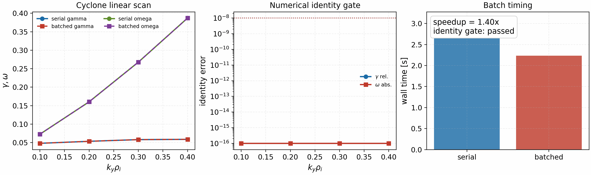

Examples
========

The ``examples`` directory is organized around two layers:

- case-backed runtime drivers that map directly onto the tracked runtime TOMLs,
- focused demos and benchmark helpers for theory, operators, and scan workflows.

Config-backed runtime cases
---------------------------

These scripts are the closest match to the production benchmark workflows.
They load the checked-in runtime TOMLs and expose only the most useful runtime
overrides at the command line.

Tokamak cases
^^^^^^^^^^^^^

.. code-block:: bash

   python examples/linear/axisymmetric/cyclone_runtime_linear.py
   python examples/nonlinear/axisymmetric/cyclone_runtime_nonlinear.py --steps 200
   python examples/nonlinear/axisymmetric/cetg_runtime_nonlinear.py --steps 1000
   python examples/linear/axisymmetric/etg_runtime_linear.py
   python examples/linear/axisymmetric/kaw_runtime_linear.py
   python examples/linear/axisymmetric/kbm_runtime_linear.py
   python examples/nonlinear/axisymmetric/kbm_runtime_nonlinear.py --steps 200
   python examples/nonlinear/axisymmetric/miller_nonlinear_runtime.py --steps 200

Stellarator and imported-geometry cases
^^^^^^^^^^^^^^^^^^^^^^^^^^^^^^^^^^^^^^^

.. code-block:: bash

   python examples/linear/non-axisymmetric/w7x_linear_imported_geometry.py \
     --geometry-file /path/to/itg_w7x_adiabatic_electrons.eik.nc

   python examples/linear/non-axisymmetric/hsx_linear_imported_geometry.py \
     --geometry-file /path/to/hsx_linear.eik.nc

   python examples/nonlinear/non-axisymmetric/w7x_nonlinear_imported_geometry.py \
     --geometry-file /path/to/w7x_adiabatic_electrons.eik.nc

   python examples/nonlinear/non-axisymmetric/hsx_nonlinear_imported_geometry.py \
     --geometry-file /path/to/hsx_nonlinear.eik.nc

   export W7X_VMEC_FILE=/absolute/path/to/wout_w7x.nc
   export HSX_VMEC_FILE=/absolute/path/to/wout_HSX_QHS_vac.nc
   python examples/nonlinear/non-axisymmetric/w7x_nonlinear_vmec_geometry.py --steps 200
   python examples/nonlinear/non-axisymmetric/hsx_nonlinear_vmec_geometry.py --steps 200

For the VMEC-backed stellarator examples, omit ``--steps`` when you want the
default adaptive horizon. Set ``--steps`` only when you intentionally want a
short profiling or diagnostic window. For longer W7-X nonlinear runs, keep
adaptive timesteps enabled (the default for the examples) or reduce ``dt`` if
you need a fixed-step stability study.

The shipped nonlinear stellarator runtime TOMLs now also emit artifact bundles
under ``tools_out/`` by default:

- ``tools_out/w7x_nonlinear_vmec_runtime.diagnostics.csv``
- ``tools_out/hsx_nonlinear_vmec_runtime.diagnostics.csv``
- ``tools_out/w7x_nonlinear_imported_runtime.diagnostics.csv``

Those diagnostics and their matching ``*.summary.json`` files are the intended
inputs for the parity helpers under ``tools/``.
The direct Python runtime wrappers now route through the same artifact-aware
nonlinear path as the executable, so long adaptive runs update that bundle as each
chunk completes.

Runtime TOML entry points
-------------------------

When you want the full config surface instead of the thin case wrappers, use
the executable or the generic example drivers directly. These runtime utilities are
best treated as solver-smoke and exploration entry points; the benchmark
examples remain the audited parity surface for ETG and the other validation
lanes:

.. code-block:: bash

   python examples/utilities/runtime_from_toml.py --config examples/linear/axisymmetric/runtime_cyclone.toml
   python examples/utilities/runtime_from_toml.py --config examples/linear/axisymmetric/runtime_etg.toml
   python examples/utilities/runtime_from_toml.py --config examples/linear/axisymmetric/runtime_kbm.toml
   python examples/linear/axisymmetric/etg_linear_auto.py --outdir tools_out/etg_auto

   spectrax-gk run-runtime-linear \
     --config examples/linear/non-axisymmetric/runtime_w7x_linear_imported_geometry.toml

   spectrax-gk examples/linear/axisymmetric/runtime_cyclone.toml

Scaling utilities
-----------------

For production parallelization of independent scans and UQ ensembles, prefer
the package helpers:

.. code-block:: python

   import jax.numpy as jnp
   import spectraxgk as sgk

   ky = jnp.asarray([0.1, 0.2, 0.3, 0.4])
   chunks = sgk.ky_scan_batches(ky, n_batches=2)
   values = sgk.batch_map(lambda x: jnp.asarray([x, x**2]), ky, batch_size=2)

These helpers preserve serial ordering and fall back to a one-device ``vmap``
path on laptops. Multi-device runs should still be checked against the serial
result before publication speedups are claimed.

For a solver-backed identity gate, run the Cyclone ``k_y``-batch scan artifact:

.. code-block:: bash

   python tools/generate_parallel_ky_scan_gate.py

   Real Cyclone linear solver comparison between serial and fixed-shape
   ``k_y``-batched scans. The figure verifies that ``gamma`` and ``omega``
   are identical while reporting the observed batch speedup separately.

Use the strong-scaling sweep helper to collect parallelization timings for the
distributed linear RK2 loop:

.. code-block:: bash

   python examples/utilities/strong_scaling_sweep.py \
     --ny 128 --nz 256 --nl 8 --nm 8 --steps 120 \
     --devices 1,2,4,8 \
     --backend cpu_parallel_large \
     --out tools_out/strong_scaling_cpu.csv

On multi-GPU systems, point ``--devices`` at the available accelerators and
update ``--backend`` accordingly (for example ``cuda_parallel_large``). The
backend labels are just sweep names for the output table; they do not change
the runtime physics or solver path.

Plotting outputs
----------------

To visualize nonlinear diagnostic histories from ``*.out.nc`` files:

.. code-block:: bash

   python examples/utilities/plot_runtime_outputs.py tools_out/cyclone_release.out.nc \
     --out tools_out/cyclone_release_diagnostics.png

Geometry examples
-----------------

VMEC and Miller geometry usage examples are documented in :doc:`geometry`.

Nonlinear restart and continuation
----------------------------------

The tracked nonlinear runtime path supports a NetCDF ``out/big/restart``
bundle together with continuation from the saved restart state.

One-shot nonlinear bundle write:

.. code-block:: bash

   spectrax-gk run-runtime-nonlinear \
     --config examples/nonlinear/axisymmetric/runtime_cyclone_nonlinear.toml \
     --steps 200 \
     --out tools_out/cyclone_release.out.nc

For the short GX-reference Cyclone replay (`t_max = 5`, no collisions), use
``examples/nonlinear/axisymmetric/runtime_cyclone_nonlinear_short.toml``.
That file pins the short-run dissipation contract explicitly
(``p_hyper = 2``, ``damp_ends_amp = 0``) instead of relying on the longer
production defaults.

Restart-aware TOML snippet:

.. code-block:: toml

   [time]
   nstep_restart = 100

   [output]
   path = "tools_out/cyclone_release.out.nc"
   restart_if_exists = true
   save_for_restart = true
   append_on_restart = true
   restart_with_perturb = false

With that configuration, rerunning the same nonlinear command resumes from
``tools_out/cyclone_release.restart.nc`` when it already exists and appends the
continued history to ``tools_out/cyclone_release.out.nc``. This is the
recommended user-facing workflow for long nonlinear turbulence jobs.

Geometry helper workflows
-------------------------

The runtime geometry path can generate imported geometry files from VMEC and
Miller inputs when the external helper scripts are available:

.. code-block:: bash

   export W7X_VMEC_FILE=/absolute/path/to/wout_w7x.nc
   export HSX_VMEC_FILE=/absolute/path/to/wout_HSX_QHS_vac.nc
   export SPECTRAX_BOOZ_XFORM_JAX_PATH=/absolute/path/to/booz_xform_jax
   python tools/generate_gx_vmec_eik.py \
     --config examples/nonlinear/non-axisymmetric/runtime_hsx_nonlinear_vmec_geometry.toml

   python tools/generate_gx_miller_eik.py \
     --config examples/nonlinear/axisymmetric/runtime_cyclone_nonlinear_miller.toml

Benchmark and scan helpers
--------------------------

These scripts produce the scan-level plots and tables used in the benchmark
discussion:

.. code-block:: bash

   python examples/benchmarks/cyclone_linear_benchmark.py
   python examples/linear/axisymmetric/etg_linear_auto.py
   python examples/benchmarks/etg_linear_benchmark.py
   python examples/benchmarks/kbm_beta_scan.py
   python examples/benchmarks/kinetic_linear_benchmark.py
   python examples/benchmarks/tem_linear_benchmark.py

Foundational demos
------------------

These smaller examples are useful for understanding the numerical building
blocks without running a full benchmark case:

.. code-block:: bash

   python examples/benchmarks/basis_orthonormality.py
   python examples/theory_and_demos/cyclone_geometry.py
   python examples/theory_and_demos/autodiff_inverse_growth.py
   python examples/theory_and_demos/autodiff_inverse_twomode.py
   python examples/theory_and_demos/diffrax_linear_demo.py
   python examples/theory_and_demos/example.py
   python examples/theory_and_demos/gradB_coupling_hl_1d.py
   python examples/theory_and_demos/linear_rhs_demo.py
   python examples/theory_and_demos/two_stream_hermite_1d.py

The autodiff demos write summary JSON plus `R/L_Ti` and `R/L_n` sweep CSVs in
the chosen output directory alongside the publication-ready plots. The
single-mode figure is a local inverse/sensitivity example; the two-mode figure
is the release-grade parameter-recovery validation.

.. figure:: _static/autodiff_inverse_growth.png
   :width: 90%
   :align: center

   Single-mode inverse/sensitivity demo. The goal is to verify the autodiff
   Jacobian and show what one measured mode constrains locally; the expected
   outcome is small observable and derivative error, not unique recovery of
   both gradients. The shipped result matches that expectation: `(gamma, omega)`
   are reproduced closely while the recovered `(R/L_Ti, R/L_n)` remains offset
   because the one-mode inverse is not globally identifiable.

.. figure:: _static/autodiff_inverse_twomode.png
   :width: 90%
   :align: center

   Two-mode inverse validation. The goal is to recover the planted gradients
   from two independent mode observables and verify that the autodiff Jacobian
   stays consistent with finite differences. The shipped result reaches the
   target to numerical precision and is the reviewer-facing parameter-recovery
   validation.

Secondary slab workflow
-----------------------

.. code-block:: bash

   python -m spectraxgk.cli run-runtime-linear \
     --config examples/benchmarks/runtime_secondary_slab.toml

   python examples/benchmarks/secondary_slab_workflow.py

The staged helper runs the linear seed, writes a restart state in the runtime
binary layout, and then launches the nonlinear follow-up with the matching
restart and fixed-mode controls used in the tracked secondary benchmark.

Reduced-model runtime
---------------------

.. code-block:: bash

   python examples/nonlinear/axisymmetric/cetg_runtime_nonlinear.py --steps 1000
   spectrax-gk examples/nonlinear/axisymmetric/runtime_cetg_reference.toml --steps 1000

The reduced collisional slab ETG workflow uses the dedicated cETG runtime
solver rather than the full-GK field solve path.

Full-GK ETG nonlinear pilot
---------------------------

.. code-block:: bash

   python examples/nonlinear/axisymmetric/etg_runtime_nonlinear.py --steps 200
   JAX_ENABLE_X64=1 spectrax-gk examples/nonlinear/axisymmetric/runtime_etg_nonlinear.toml --steps 200

This is the full-GK two-species ETG nonlinear pilot lane. It is intentionally
separate from the reduced cETG workflow. The shipped contract now matches the
audited GX short-window startup path: ``Lx = 1.25`` for the linked ETG box and
``gaussian_init = true`` with ``init_single = false`` because GX reads
``init_single`` from its ``[Expert]`` section, not from ``[Initialization]``.
