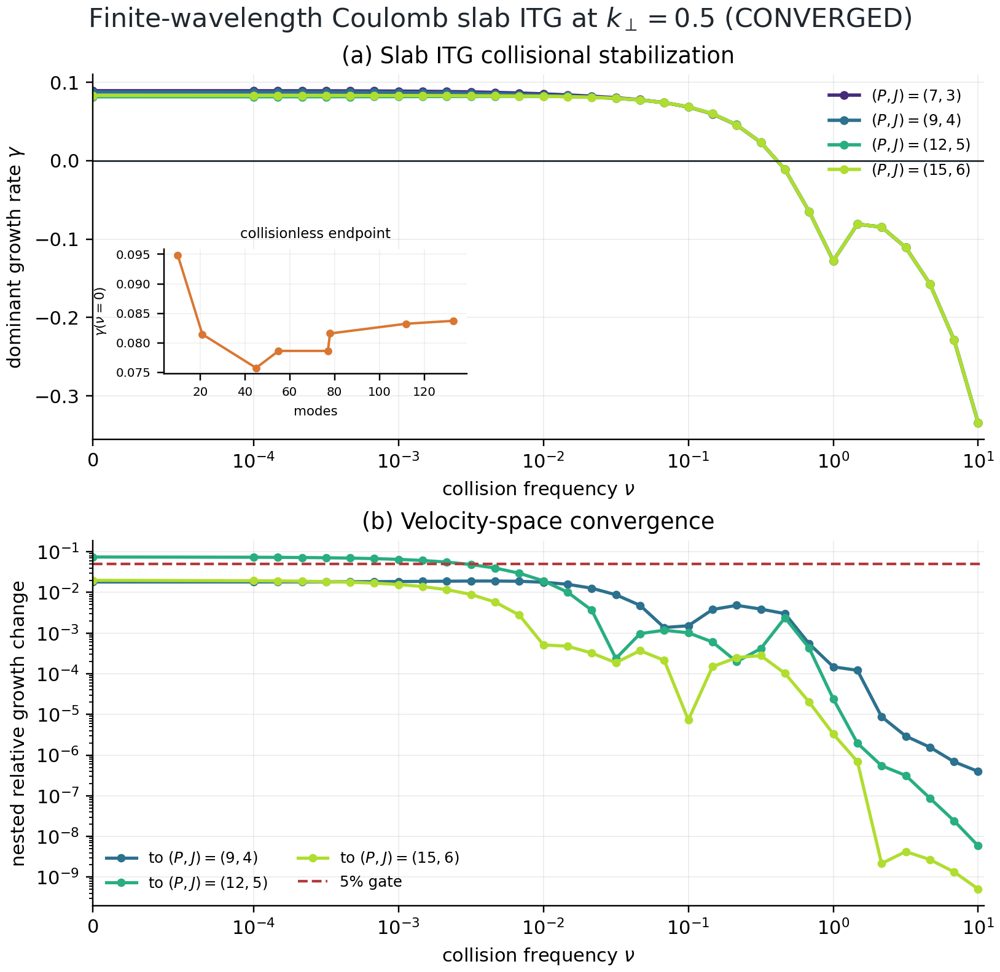
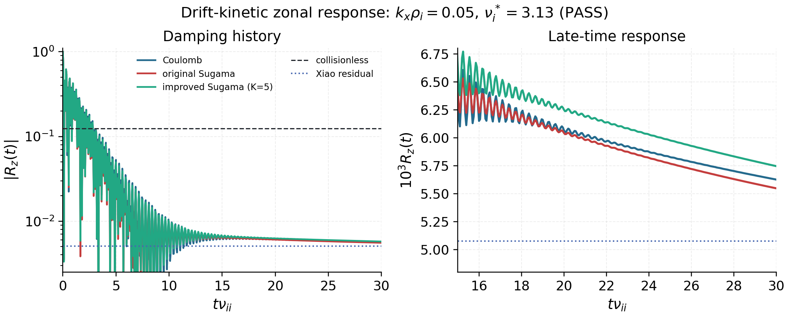

Numerics
========

Spectral discretization
-----------------------

Perpendicular spatial coordinates are discretized with Fourier modes on a
uniform grid in :math:`x` and :math:`y`, while the parallel coordinate is
resolved in real space along the field line. The velocity space uses a
Hermite-Laguerre basis. The resulting data layout for a single species is

``(N_l, N_m, N_y, N_x, N_z)``.

Algorithm mapping (numerics → code)
-----------------------------------

The core numerical algorithms and their implementation entry points are:

- **Hermite–Laguerre pseudo-spectral expansion**:
  :mod:`spectraxgk.core.velocity`.
- **Gyroaverage / polarization**:
  :func:`spectraxgk.core.velocity.J_l_all`,
  :func:`spectraxgk.linear.quasineutrality_phi`.
- **Centered periodic derivative in z**:
  :func:`spectraxgk.linear.grad_z_periodic`.
- **Hermite ladder streaming**:
  :func:`spectraxgk.linear.streaming_term`.
- **Curvature / grad-B / mirror couplings**:
  :func:`spectraxgk.linear.linear_rhs_cached`,
  :func:`spectraxgk.geometry.SAlphaGeometry.drift_components`,
  :func:`spectraxgk.geometry.SAlphaGeometry.bgrad`.
- **Diamagnetic drive**:
  :func:`spectraxgk.linear.diamagnetic_drive_coeffs`.
- **Time integration (explicit RK, IMEX)**:
  :func:`spectraxgk.linear.integrate_linear`.
- **CFL-controlled RK4 (adaptive step control, streaming diagnostics)**:
  :func:`spectraxgk.integrate_linear_explicit`
  (implemented in :func:`spectraxgk.solvers.time.explicit.integrate_linear_explicit`).
- **Diffrax integration (explicit/implicit/IMEX)**:
  :func:`spectraxgk.solvers.time.integrate_linear_diffrax`,
  :func:`spectraxgk.solvers.time.integrate_nonlinear_diffrax`.
- **Config-driven runner**:
  :func:`spectraxgk.solvers.time.runners.integrate_linear_from_config`.
- **Implicit solve (Backward Euler + GMRES)**:
  :func:`spectraxgk.linear.integrate_linear`.
- **Structured Hermite-line solves and bounded-memory Jacobians**:
  `SOLVAX <https://github.com/uwplasma/SOLVAX>`_ provides the reusable
  tridiagonal and autodiff primitives; SPECTRAX-GK retains physical layout,
  coefficients, tolerances, and acceptance policy.
- **Nonlinear IMEX (implicit linear + explicit nonlinear)**:
  :func:`spectraxgk.nonlinear.integrate_nonlinear`.

JAX execution model
-------------------

The implementation leverages the following JAX primitives:

- **JIT compilation**: ``jax.jit`` is used in
  :func:`spectraxgk.linear.integrate_linear` to stage time-stepping
  kernels.
- **Loop fusion**: ``jax.lax.scan`` drives the time integration loop.
- **FFT grids**: ``jax.numpy.fft.fftfreq`` is used in
  :func:`spectraxgk.core.grid.build_spectral_grid`.
- **Sparse Krylov solver**: ``solvax.gmres`` is used for implicit linear and
  nonlinear IMEX time steps through one shared SPECTRAX-GK policy adapter.
  Nonlinear IMEX reverse mode wraps the tolerance-controlled solve with
  ``solvax.linear_solve``. Its implicit-function VJP solves the transposed
  linear system instead of differentiating dynamic GMRES iterations; plain and
  checkpointed two-step trajectories agree with centered finite differences.
  A separate gate rebuilds the gyrokinetic cache and matrix-free operator from
  a traced :math:`R/L_{T_i}` and verifies that the VJP includes both right-hand
  side and operator dependence.
  Shift-invert eigenmode extraction temporarily retains the prior JAX GMRES
  route because its branch-continuity gate has not passed with the replacement.
- **Backend-aware Hermite line solve**: ``solvax.tridiagonal_solve`` uses a
  deterministic Thomas recurrence on CPU and the fused JAX/vendor path on
  accelerators. SPECTRAX-GK moves only the Hermite system axis; all remaining
  dimensions are independent line-solve columns.
- **Memory-bounded sensitivities**: ``solvax.chunked_jacfwd`` underlies the
  geometry gradient report when ``jacobian_chunk_size`` is set. Chunking
  changes batching and peak memory, not the mathematical JVP columns. Without
  a chunk request, ``jacobian_mode="auto"`` uses forward mode for few controls
  and reverse mode for few observables; the resolved mode is recorded and
  checked against finite differences.
- **Stencil operations**: ``jax.numpy.roll`` and ``jax.numpy.pad`` implement
  the centered ``z`` derivative and Hermite/Laguerre ladder couplings in
  :func:`spectraxgk.linear.grad_z_periodic`,
  :func:`spectraxgk.linear.streaming_term`,
  :func:`spectraxgk.linear.apply_hermite_v`,
  :func:`spectraxgk.linear.apply_laguerre_x`.

These links are clickable in the HTML docs via the ``viewcode`` extension.

Structured solver dependency contract
-------------------------------------

SPECTRAX-GK requires ``solvax>=0.7.3,<0.8``. Version 0.7.3 is the current
admitted release because its complex Krylov and structured-solve interfaces
pass the downstream linear, IMEX, geometry-gradient, and implicit-objective
suite on the current JAX stack. The release also retains current-JAX
linear-transpose compatibility, complex CPU/GPU tridiagonal identity gates,
and strict type information. Generic numerical
algebra lives in SOLVAX; gyrokinetic state layout, linked-boundary assembly,
preconditioner coefficients, eigenbranch tracking, transport windows, and
physics gates remain in SPECTRAX-GK.

The admitted migration covers the Hermite-line tridiagonal solve,
memory-chunked geometry Jacobians, and implicit linear/nonlinear time-step
GMRES. Implicit time stepping now exposes one FGMRES algorithm with explicit
tolerance, restart, iteration-limit, and physical-preconditioner controls;
the obsolete backend-name selector has been removed.

Shift-invert remains explicitly excluded. In its current streaming test, both
inner solvers stagnate above the requested tolerance and their small solution
difference changes the selected outer eigenbranch. The prior JAX route remains
in that one call site until preconditioning/recycling improvements pass inner
residual, eigenpair residual, eigenvalue, and eigenvector-overlap gates.

Time integration algorithms
---------------------------

The linear solver supports:

- **Forward Euler** (``method="euler"``) and **RK2/RK4** explicit schemes for
  non-stiff runs.
- **reference-compatible RK4 with CFL step control**
  (``integrate_linear_explicit``). The timestep is recomputed from the linear
  max-frequency estimate using the benchmark-locked CFL rule, and growth rates
  are extracted from the midplane ``phi`` ratio using the same diagnostic
  convention as the tracked comparison data.
- **IMEX (semi-implicit)** where the collisional/hyper-diffusion terms are
  treated implicitly and the remaining terms explicitly.
- **Backward Euler + GMRES** in ``method="implicit"`` for stiff scans, with a
  diagonal preconditioner that includes damping and drift/mirror diagonals.
- **IMEX (implicit linear operator + explicit nonlinear term)** in
  ``method="imex"`` for nonlinear runs, using the same GMRES-based linear
  solve and preconditioner. Reverse derivatives use the converged-system
  implicit derivative, so the gradient does not depend on the number of Krylov
  iterations except through primal/transpose solve accuracy.

These are all implemented in :func:`spectraxgk.linear.integrate_linear` and
share the cached operator data assembled by
:func:`spectraxgk.linear.build_linear_cache`.

Diffrax integration
-------------------

Diffrax-backed solvers are available via
:func:`spectraxgk.solvers.time.integrate_linear_diffrax` and
:func:`spectraxgk.solvers.time.integrate_nonlinear_diffrax`. Explicit
solvers (e.g., ``Tsit5``) and implicit/IMEX solvers (e.g., ``KenCarp``) are
supported. Progress reporting is disabled by default; enable it by setting
``TimeConfig.progress_bar=True`` (or ``progress_bar=True`` in the integrator
call). Diffrax currently emits a warning when evolving complex-valued states;
the solvers still run, but treat this as experimental behavior.

Use :class:`spectraxgk.config.TimeConfig` and
:func:`spectraxgk.solvers.time.runners.integrate_linear_from_config` to select diffrax
integration from input configuration without changing call sites. By default,
``TimeConfig`` enables diffrax with a fixed-step Dopri8 solver; set
``use_diffrax=False`` to force the built-in fixed-step integrators.

For distributed parallelization, set ``TimeConfig.state_sharding = "auto"``
(or ``"ky"`` / ``"kx"`` for the release-gated nonlinear path) to partition the
packed state array over multiple JAX devices. This is honored by diffrax
integrations and by the fixed-step nonlinear scan through
``integrate_nonlinear_sharded``. When only one device is visible, the
parallelization request is ignored and the run proceeds on a single device
while preserving the same control-flow path for identity testing. The nonlinear
config path intentionally rejects ``"z"`` sharding because the current
multi-device FFT-axis decomposition has not passed the identity gate.
On macOS you can emulate multiple CPU devices with
``XLA_FLAGS=--xla_force_host_platform_device_count=2`` for non-FFT-axis
parallelization checks, but the nonlinear whole-state ``pjit`` profile skips
active multi-device CPU sharding by default because current JAX/XLA CPU FFT
layouts can abort before Python can catch a failure. Multi-GPU artifacts remain
the release reference for active nonlinear state-sharding diagnostics, and
production nonlinear speedup claims still require separate identity,
transport-window, and profiler gates.

For scan workloads, the default path is custom fixed-step ``imex2`` with
``TimeConfig.use_diffrax=False``. This keeps stepping shape-stable and improves
throughput for multi-ky scans. Diffrax adaptive stepping remains available as
an optional mode through ``TimeConfig.use_diffrax=True``.

Adaptive differentiation is an explicit API policy rather than an accidental
property of the controller. For a low-dimensional tangent direction, call
:func:`spectraxgk.solvers.time.integrate_linear_diffrax` with
``derivative_mode="forward"``. This selects native JAX rules and supports a
JVP through the accepted adaptive trajectory. The release gate uses a nonzero
thermodynamic-drive tangent: it agrees with a centered finite difference to
``1.9e-5`` relative error, and changing ``rtol`` from ``1e-3`` to ``3e-4``
changes the objective and tangent by less than ``2e-4`` relative. The default
``derivative_mode="reverse"`` retains the custom-VJP field solve used by
scalar objectives. With ``checkpoint=True``, adaptive Tsit5 uses Diffrax's
recursive checkpoint adjoint; its reverse gradient matches both the forward
JVP and centered finite difference to ``1.9e-5`` relative on the same physical
observable. Adaptive reverse mode without checkpointing remains unpromoted
because its direct adjoint exceeded the bounded local memory envelope.

Nonlinear FFT bracket
---------------------

The nonlinear :math:`E\times B` term is evaluated pseudospectrally using
FFT-based derivatives in the perpendicular plane. By default SPECTRAX-GK uses
the compressed real-FFT path (``TimeConfig.compressed_real_fft = true``), which computes
gradients from the Nyquist-compressed (``N_y/2+1``) spectrum using the
benchmark-compatible compressed wavenumber layout: non-negative ``k_y`` (including positive
Nyquist when ``N_y`` is even) and a positive Nyquist multiplier on the ``k_x``
axis when ``N_x`` is even. The result is then expanded back to full
:math:`k_y`. This matches the tracked nonlinear reference layout and minimizes
memory traffic. Set ``compressed_real_fft = false`` to use the full complex FFT bracket
instead.

For electromagnetic nonlinear runs, SPECTRAX-GK stacks the gyro-averaged
potentials ``J0*phi``, ``J0*apar``, and the ``bpar`` correction into a single
FFT batch. This collapses multiple rFFT/iFFT passes into one pipeline per
step and reuses the same real-space gradients for all channels.
Laguerre/Bessel factors on the benchmark quadrature grid (``J0`` and ``J1/alpha``) are
precomputed once per grid and cached in the linear operator, so the nonlinear
kernel only applies them via inexpensive elementwise multiplies.
For nonlinear runs that do not require the benchmark quadrature grid, set
``TimeConfig.laguerre_nonlinear_mode="spectral"`` to skip the Laguerre
quadrature transform and instead use the spectral gyroaverage factors ``Jl``
directly. The default ``"grid"`` mode applies the quadrature
transform.

Equilibrium-flow shearing coordinates
--------------------------------------

The validated coordinate kernel
:func:`spectraxgk.operators.nonlinear.projection.advance_shearing_coordinates`
follows a shearing wave according to

.. math::

   k_x^*(t) = k_x(0) - k_y\,\gamma_E t.

This model isolates perpendicular equilibrium-flow decorrelation. It does not
include a parallel-velocity-gradient drive, which is a distinct physical term
and requires its own normalization, instability, and transport gates
[Schekochihin12]_ [Ball19]_. The
matched comparison campaign uses the same scope: continuous :math:`k_x^*`
geometry updates, nearest-cell remapping, and the residual nonlinear FFT phase,
without claiming a toroidal-rotation or parallel-flow-shear model.

When the displacement crosses half a radial Fourier cell, the state is moved
to the nearest :math:`k_x` mode. The residual sub-cell displacement is retained
both in the effective wavenumber and in the real-space phase
:math:`\exp(i\,\delta k_x x)`. Modes leaving the two-thirds retained band are
zeroed rather than wrapped around the FFT grid. Retaining this residual phase
implements the corrected-remap principle and avoids the non-convergent smeared
nonlinear coupling of integer-only wavevector remapping [McMillan19]_. Tests
cover zero-shear identity,
the analytic shearing-wave trajectory, norm-preserving forward/inverse remaps,
the de-alias boundary, and JAX tangents with respect to both :math:`\gamma_E`
and the radial scale against centered finite differences.

The integer nearest-mode decision is piecewise constant and therefore uses a
stopped tangent. Continuous effective wavenumbers and phases remain
differentiable between the measure-zero remap events. This kernel is not yet a
shipped equilibrium-flow-shear model. The periodic/linked-boundary cache updater
:func:`spectraxgk.operators.linear.cache_builder.update_linear_cache_for_sheared_kx`
already rebuilds :math:`k_\perp^2`, drift frequencies, gyroaverages, Bessel
tables, field-solve inputs, bracket multipliers, and hyperdiffusion from the
two-dimensional effective :math:`k_x` grid. Its zero-shear arrays and complete
linear RHS reproduce the static-cache path, and its nonzero-shear tangent agrees
with finite differences. The full-complex nonlinear bracket uses split
transforms to apply the residual radial phase between the :math:`k_x` and
:math:`k_y` FFTs; a canonical-coordinate invariance test verifies that the
Poisson bracket is unchanged by the shear-coordinate transformation. The
full-complex state is projected onto its Hermitian subspace after every remap
and Runge--Kutta stage, matching the real-field constraint implicit in the
production real-FFT layout. Without this projection a physical pilot accumulated
a 3.15% conjugate-symmetry defect by :math:`t=5`; the corrected trajectory keeps
that residual at machine zero. The compressed bracket can also evaluate this
fractional state in canonical shearing coordinates: the common residual phase
of the distribution and potential cancels from their Poisson bracket, leaving
the row-relative :math:`k_x` mesh. Direct full/compressed bracket, JAX-tangent,
three-step state, and heat-flux gates agree within ``2e-5`` relative tolerance.
The
research function
:func:`spectraxgk.nonlinear.integrate_nonlinear_sheared` verifies zero-shear
trajectory identity and cumulative full-step remapping. Its midpoint RK2 and
three-stage Heun RK3 routes evaluate each RHS in the correctly remapped stage
coordinate basis and return each derivative to the step basis before combining
stages. Both recover their designed orders on a physical drift/diamagnetic
trajectory. A
fixed-window Cyclone-like linear ITG pilot is converged to below 1% under a
factor-two timestep refinement and reduces the final potential norm by more
than 20% when :math:`\gamma_E=1`. This is the expected decorrelation direction
when the shearing rate exceeds the instability rate [Biglari90]_ [Waltz95]_,
but it is not a nonlinear transport validation.

Standard linked flux tubes use the cache-normalized radial spacing selected by
the twist-and-shift construction. The equilibrium-flow displacement is constant
along a fixed-:math:`k_y` linked chain, so the chain topology and endpoint
separation are unchanged while :math:`k_\perp`, drifts, gyroaverages, and field
operators are rebuilt. RK2 and RK3 recover the established linked trajectory
exactly at zero shear. At nonzero shear, tests preserve every linked-neighbor
spacing and compare the cache tangent with a centered finite difference.
Non-twist flux tubes remain unsupported because their radial coordinate is
:math:`z` dependent.

The fixed-step ``method="imex"`` route applies explicit nonlinear forcing in the
current sheared basis, remaps its right-hand side and warm start to
:math:`t_{n+1}`, rebuilds the matrix-free endpoint operator, and solves

.. math::

   [I-\Delta t L(t_{n+1})]G_{n+1}
   = G_n^* + \Delta t\,N(G_n,t_n)^*.

The tolerance-controlled solve uses the shared SOLVAX implicit derivative rule.
It is exactly identical to the static linked IMEX trajectory at zero shear,
recovers first-order convergence on a physical nonzero-shear trajectory, and
passes endpoint heat-flux plus JVP/VJP finite-difference gates. Adaptive sheared
IMEX and custom collision operators remain explicitly rejected.

State-only campaigns may set ``return_fields=False``. This follows the main
nonlinear-integrator contract and avoids the endpoint field/RHS evaluation and
field-history allocation on every step; the default retains field histories for
diagnostic compatibility. State-only and field-returning trajectories satisfy
the same zero-shear identity gate.

Field-returning and transport scans reuse each accepted endpoint RHS and field
solve as the next step's initial evaluation. The carried physical time ensures
the reused derivative and shearing basis are identical. This removes one
redundant RHS evaluation per step without altering the Runge--Kutta tableau;
the state-only path remains separate so it never computes fields solely for
reuse.

:func:`spectraxgk.nonlinear.integrate_nonlinear_sheared_transport` records the
canonical per-species gyro-Bohm heat flux at every accepted step. It uses
the same flux-surface quadrature and transport kernel as production nonlinear
diagnostics and evaluates that kernel with the instantaneous sheared cache. The
returned ``ShearedTransportTrace`` stores only the final distribution plus time,
and heat-flux traces, avoiding distribution- and field-history allocations.
Its default ``differentiable=True`` path traces the JAX-native field solve so
both forward JVP and reverse gradient reach the transport objective; both agree
with a centered finite difference in the validated mini-case. Setting
``differentiable=False`` selects the faster custom-VJP production field solve,
and a numerical-identity gate confirms that this policy switch does not alter
the trajectory or heat flux.

Setting ``fixed_dt=False`` applies the same production nonlinear CFL policy
used by the main diagnostic integrator. The accepted step combines conservative
linear-frequency bounds with the instantaneous pseudo-spectral
:math:`E\times B` frequency and is clipped by ``dt_min`` and ``dt_max``. The
trace's ``time`` array then records the nonuniform accepted-time grid, while
``steps`` is an explicit work budget. Time, step size, shearing remaps, fields,
and transport remain inside the JAX scan so tangents propagate through the
piecewise-smooth adaptive policy away from clipping and remap transitions.
Long campaigns can continue from ``final_state`` using the previous terminal
``time`` and accepted step as ``initial_time`` and ``initial_dt``. A chunked
versus single-scan identity gate covers the absolute shearing basis, state, and
heat-flux trace.

Treatment effects are evaluated with
:func:`spectraxgk.matched_nonlinear_transport_report`, not by comparing two
instantaneous chaotic traces. The baseline and treatment first pass independent
post-transient finite-sample, running-mean drift, terminal-mean, block count,
and conservative SEM gates. Only then is the relative mean reduction reported;
its uncertainty separation uses the quadrature sum of the two block/bootstrap
SEMs. A drifting source window therefore blocks a treatment claim even when its
provisional mean is lower.

The first full-grid internal transport campaign uses ``64x64x24`` spatial
resolution, ``Nl=4``, ``Nm=8``, periodic ``x0=y0=28.2``, adaptive Heun RK3,
``dt_max=0.02``, and x64 precision. Over the independently selected
``t=[240,300]`` window, both the unsheared and ``gamma_E=0.01`` traces pass the
finite-sample, 12-block, running-drift, terminal-mean, and bootstrap-SEM gates.
Their heat fluxes are ``10.5009 +/- 0.0949`` and ``9.8603 +/- 0.0569``, giving a
``6.10%`` reduction with ``5.79`` quadrature-SEM separation. Moving the lower
window bound from ``t=240`` through ``t=280`` preserves the reduction direction
(``4.46--6.28%``). This closes the internal saturated-transport check for the
periodic research path.

A clean external comparison campaign used the same ``64x64x24``, ``Nl=4``,
``Nm=8``, periodic-domain contract and evolved both references from identical
initial states to ``t=300``. Over ``t=[240,300]``, the comparison traces pass the
same finite-sample, stationarity, and uncertainty checks but give
``5.9963 +/- 0.0321`` without shear and ``6.0014 +/- 0.0416`` with shear. The
corresponding ``-0.084%`` reduction is only ``-0.10`` combined SEM and disagrees
with the internal ``6.10%`` response. This is negative parity evidence, not a
flow-suppression result. A dealiased real-field regression shows that the
full-complex and compressed-real Poisson brackets agree before and immediately
after both integer and fractional remaps. A short physical sheared integration
also reproduces the full-complex state and heat-flux trace with the canonical
compressed bracket. A subsequent source audit localized a time-discretization
difference: the external adaptive RK3 route advances shear once with the
previous step size before selecting the next ``dt`` and holds that coordinate
basis fixed across all RK stages. SPECTRAX-GK advances accepted physical time
and evaluates each stage in its exact shearing basis. The ``-0.084%`` result is
therefore negative cross-discretization evidence, not a model-identical parity
failure. Linked-boundary and fixed-step IMEX implementation gates now pass.

A bounded fixed-step source-localization probe confirms that the external
shearing path is active when the time policy is controlled. On a deterministic
reduced periodic Cyclone-like case with :math:`\gamma_E=0.5`, the terminal
``Phi2`` treatment ratios are ``0.64032``, ``0.64051``, and ``0.64060`` for
``dt=0.02``, ``0.01``, and ``0.005``. The corresponding startup heat-flux
ratios change from ``0.5079`` to ``0.5142`` and are not used as transport
evidence. This closes only the short fixed-step response check.

The subsequent full-resolution fixed-step campaign used the same
``64x64x24``, ``Nl=4``, ``Nm=8``, periodic weak-shear contract through
``t=300``. The internal fixed-IMEX baseline and treatment remained finite, but
both failed the predeclared ``t=[240,300]`` stationarity policy. Their means are
``15.4508 +/- 0.2628`` and ``16.1948 +/- 0.1602``, a 4.82% increase rather than
the required reduction. An independent fixed-RK4 comparison completed the same
grid, timestep, duration, seed, dissipation, and diagnostic contract. Both of
its windows pass the drift, terminal-mean, block, and SEM gates, with
``11.7154 +/- 0.2157`` and ``14.6236 +/- 0.1407``. This is a 24.82% increase,
resolved by 11.29 combined SEM. Integrator-specific absolute trajectories are
not claimed identical; the important result is that neither fixed-step audit
supports the earlier adaptive suppression claim.

RK3 remains useful for bounded research campaigns because it expands the stable
explicit operating envelope without changing the coordinate or transport
definitions. This path is a numerical foundation, not a promoted physical
model. The compressed-real bracket is an opt-in research route, while non-twist
and linked boundaries remain distinct: linked standard tubes are gated, while
non-twist tubes fail closed. The failed matched-response gate keeps flow shear
out of input files and executable claims. The compact machine-readable record
is ``docs/_static/flow_shear_fixed_step_response_gate.json``; large raw states
and comparison outputs are intentionally not tracked.

De-aliasing and hyperdiffusion
------------------------------

Nonlinear brackets are filtered using the standard ``2/3`` de-alias mask. The
mask lives on the spectral grid and is applied after each bracket evaluation.
Additional numerical stabilization is provided by hyperdiffusion in
:math:`k_\perp` (``TermConfig.hyperdiffusion`` / ``D_hyper`` settings), which
acts as a scale-selective damping term and is treated implicitly in IMEX
schemes.

Performance tuning
------------------

SPECTRAX-GK includes several performance-oriented options that preserve
end-to-end JAX differentiability:

- **Streaming growth-rate fits**: use
  :func:`spectraxgk.solvers.time.integrate_linear_diffrax_streaming`
  to compute ``(gamma, omega)`` online without storing time series. This reduces
  memory pressure during long scans. The streaming fit supports ``phi`` or
  density moments via ``fit_signal`` and uses a fixed ``tmin/tmax`` window.
- **Batched ky scans**: pass ``ky_batch>1`` to the benchmark scan helpers to
  integrate multiple ky values at once using a sliced ky grid. Set
  ``fixed_batch_shape=True`` (default) to edge-pad the final batch and avoid
  recompilation on short tail batches.
- **Stacked FFT channels**: nonlinear brackets batch ``phi/apar/bpar`` into a
  single FFT pipeline so the spatial derivatives are computed once and reused
  across fields. This removes redundant transforms and reduces FFT calls.
- **Donation and parallelized buffers**: time integrators donate state buffers
  in JIT-compiled paths to reduce allocations. The diffrax integrators accept a
  ``state_sharding`` argument if you want to preserve explicit JAX
  parallelization on the state array.
- **Implicit preconditioning hooks**: ``implicit_preconditioner`` accepts
  ``"auto"/"diag"/"physics"/"block"`` (full diagonal preconditioner),
  ``"damping"`` (collisional/hyper-only), ``"pas"`` (PAS line preconditioner),
  ``"pas-coarse"`` (line + coarse correction in kx/linked-kx chains),
  ``"hermite-line"``
  (Hermite streaming line solve in ``m`` at fixed :math:`k_z`), or
  ``"hermite-line-coarse"`` (Hermite line solve + kx-coarse correction), or
  ``"identity"`` to disable preconditioning.
- **Shift-invert preconditioning hooks**: the shift-invert Krylov solver uses
  GMRES solves for ``(A - \sigma I)^{-1}``. Configure
  ``KrylovConfig.shift_preconditioner`` to accelerate these solves with
  ``"damping"`` (element-wise inverse of the collisional/hyper damping).
  ``"hermite-line"`` and ``"hermite-line-coarse"`` remain accepted aliases but
  currently resolve to that conservative damping preconditioner; the real-time
  IMEX Hermite factorization is not a valid complex shift preconditioner.
  A dedicated complex block implementation must pass inner and outer residual
  gates before those aliases can advertise streaming-line acceleration.
  A preconditioned solve is checked against the original shifted system; if its
  true residual exceeds the requested tolerance by an order of magnitude, the
  solve is retried without that preconditioner, starting from the finite
  rejected iterate so useful Krylov progress is not discarded. This prevents
  convergence in a transformed norm from hiding a poor physical solve.
  Every returned pair is checked with the matrix-free relative residual
  :math:`\lVert Av-\lambda v\rVert/
  \max(\lVert Av\rVert,|\lambda|\lVert v\rVert)`. Configure the acceptance
  threshold with ``KrylovConfig.shift_outer_residual_tol``; the default is
  ``0.1``. Rejected primary and fallback pairs raise instead of returning a
  plausible frequency with an unconverged eigenvector.
- **Arnoldi breakdown policy**: a candidate basis direction is retained only
  when its norm exceeds a dtype-scaled threshold relative to the applied
  operator. Exact and numerical happy breakdown therefore terminate the
  resolved subspace instead of amplifying roundoff into a spurious mode.
- **Physical Ritz refinement**: after selecting a shift-invert Ritz vector,
  the solver recomputes its eigenvalue with the physical-operator Rayleigh
  quotient. For a fixed vector this scalar minimizes the Euclidean residual;
  it removes avoidable error from mapping an inexact inverse Ritz value through
  ``lambda = sigma + 1 / mu``. The outer residual gate remains mandatory.
- **Interior-eigenvalue restart boundary**: an augmented retained-Ritz
  prototype was tested against the physical KBM operator and removed. At
  matched ``Nl=8, Nm=24`` resolution, retaining two and four nearby vectors
  selected damped or opposite-frequency branches and changed the outer
  residual from ``0.881`` to ``0.922`` and ``0.991``. Merely carrying several
  Ritz vectors is therefore not treated as Krylov--Schur: a future retained
  implementation must perform ordered Schur compression or an equivalently
  branch-preserving correction. Two further physical discriminators were also
  rejected at reduced ``Nl=4, Nm=8`` resolution. An exact projected
  Jacobi--Davidson correction solved its correction equation to relative
  residual ``0.035`` but worsened the eigenpair residual from ``0.742`` to
  ``0.876`` on the first step. Ordered complex-Schur compression retaining four
  vectors selected a damped branch and changed the residual from ``0.755`` to
  ``0.956`` while costing about ``61`` seconds per restart. A propagated seed
  reduced the residual to ``0.521`` but selected the wrong damped branch. These
  failures rule out one-vector projection, generic thick restart, and seed
  changes as release repairs. The next candidate must couple the field and
  low-moment blocks or use a two-sided interior-eigenvalue correction, and must
  pass branch identity, physical residual, runtime, and peak-memory gates.
  A bounded A4000 check at ``Nl=8, Nm=24`` reached only ``0.429`` after three
  projected corrections from ``0.975`` and moved to the wrong high-frequency
  branch; the projected systems themselves remained poorly converged. The
  failure therefore persists beyond the smallest CPU discriminator.
  A two-sided variant also failed because its adjoint inverse iterations had
  residuals between ``0.67`` and ``2.12``; its first accurately solved
  projected correction still worsened the physical residual to ``0.870``. A
  matrix-free low-moment block preconditioner that retained the self-consistent
  field response cost ``240`` seconds versus ``30`` seconds for the damping
  baseline and returned residual ``0.972`` on the wrong branch. Future work
  must therefore assemble and factor a genuinely reduced field/moment Schur
  block rather than nesting another full-operator Krylov solve.
  That reduced-block route was subsequently tested with a ``1536 x 1536``
  complex field/moment block. Assembly took ``0.49`` seconds, factorization
  ``0.15`` seconds, and storage ``36`` MiB, so construction was not the
  bottleneck. However, diagonal and Hermite-line high-moment complements
  returned physical residuals ``0.936`` and ``0.999`` on incorrect branches,
  each taking about ``55`` seconds and more than ``1.3`` GB resident memory.
  The omitted high-moment drift/mirror coupling is therefore material; adding
  more coarse layers is not an accepted path without a new spectral
  transformation and an independently converged physical discriminator.
  JAX's current Schur primitive is CPU-only, so it is not used in the CPU/GPU
  solver API. See the
  `SLEPc Krylov--Schur documentation
  <https://slepc.upv.es/release/manualpages/EPS/EPSKRYLOVSCHUR.html>`_ and
  `harmonic extraction guidance
  <https://slepc.upv.es/release/manualpages/EPS/EPS_HARMONIC.html>`_.
- **Targeted shift-invert mode selection**: set ``KrylovConfig.mode_family``
  (for example ``"cyclone"``, ``"etg"``, ``"kbm"``) and
  ``KrylovConfig.shift_selection`` to stabilize branch selection in stiff
  spectra. KBM uses the positive reported-frequency convention in the tracked
  benchmark table, so its matrix eigenvalue target lies on the negative
  imaginary axis. ``KrylovConfig.fallback_method`` controls the automatic
  fallback policy when shift-invert returns a non-finite, strongly damped, or
  high-residual mode.
- **Reusable IMEX operators**: nonlinear IMEX runs can prebuild and reuse the
  matrix-free linear operator with
  :func:`spectraxgk.nonlinear.build_nonlinear_imex_operator` and pass it to
  :func:`spectraxgk.nonlinear.integrate_nonlinear_imex_cached` via
  ``implicit_operator``. When ``apar=bpar=0``, the IMEX fixed-point and
  post-step field paths use the same electrostatic compiled linear-RHS route as
  the explicit nonlinear RHS, avoiding unused electromagnetic Hamiltonian
  branches while preserving the generic-RHS identity gate.

Automatic solver + fit-signal selection
---------------------------------------

For newcomer-friendly runs, the benchmark and runtime drivers accept
``solver="auto"`` and ``fit_signal="auto"``. The auto solver tries the
preferred path for the case (time integration for ion-scale Cyclone/KBM
benchmarks, Krylov for ETG) and falls back to the alternative if the returned
``(gamma, omega)`` is non-finite or violates ``require_positive``. The auto
fit-signal choice computes both ``phi`` and density moment time traces (when
available), scores each using the same windowing rules (``R^2`` of log-amplitude
and phase fits plus an optional growth-rate weight), and selects the higher
score. To make this decision robust, auto mode disables streaming fits and
stores the minimal time traces needed for the comparison.

Advanced users can override these defaults in TOML or Python drivers by setting
``solver="time"``/``"krylov"`` and ``fit_signal="phi"``/``"density"`` together
with custom fit-window parameters.

Implementation note:

- **Cached hypercollision factors**: the linear cache now stores the Hermite–
  Laguerre hypercollision ratios and masks to avoid repeated power operations
  inside the RHS assembly.

Custom collision operators
--------------------------

The shipped conserving long-wavelength model is independently exposed as
``drift_kinetic_dougherty_contribution``. It implements Appendix C, equation
(C6), of `Frei, Hoffmann & Ricci (2022)
<https://doi.org/10.1017/S0022377822000344>`_ in SPECTRAX-GK's
Hermite--Laguerre ordering. The test suite verifies exact agreement between
that equation-level kernel and the production finite-Larmor-radius operator at
``b=0``, its density/momentum/thermal null moments, non-positive quadratic
rate, and collision-frequency JVP against centered finite differences. At
finite ``b``, the suite independently reconstructs the gyroaveraged flow and
temperature moments in Mandell et al. equations (3.39)--(3.42), verifies the
free-energy dissipation identity in equation (4.10), and measures first-order
convergence to the drift-kinetic equation as ``b`` tends to zero. This is not a
Sugama/Coulomb promotion: those operators require the complete
mass/temperature-ratio-dependent test- and field-particle coefficients and
their own ITG, zonal, conductivity, entropy, and convergence gates.

``conservative_full_f_dougherty_cross_moments`` separately implements only the
cross-species primitive-moment targets in equations (2.11)--(2.12) of
`Francisquez et al. (2022) <https://doi.org/10.1017/S0022377822000289>`_. The
tests check those formulas directly, pairwise momentum and energy conservation,
positive target temperatures, equal-species limits, and AD/FD agreement. The
multispecies gate covers several spatial samples and :math:`d_v=1,2,3`, and
checks that a uniform velocity offset shifts only the target flow. It is useful
when developing a future nonlinear full-distribution collision operator, but it
is not itself that operator and is not routed through the current delta-f
gyrokinetic evolution.

The full finite-Larmor-radius coefficient formulas contain deeply nested,
cancellation-sensitive sums. Following the implementation guidance in the
same reference, the planned advanced operator will generate those coefficients
offline with multiple-precision arithmetic, record normalization/provenance
and checksums with the resulting tables, and load only compact arrays into the
JAX runtime. Direct evaluation of the published sums in runtime ``float64`` is
not an accepted implementation path. The generated tables must first pass
symmetry, conservation, adjointness, and entropy gates before any transport
benchmark can promote the operator.

The exact Bessel--Laguerre kernel entering those sums is already implemented as
``core.velocity.bessel_laguerre_kernels``. Its recurrence is differentiable,
avoids factorial overflow, and is independently checked by velocity-space
quadrature and the finite-:math:`b` truncation behavior reported by
`Frei et al. (2021) <https://doi.org/10.1017/S0022377821000761>`_. The
associated-Laguerre prefactors for :math:`J_m`, :math:`m=0,1,2`, additionally
reconstruct the independent Bessel functions over velocity space. The
Appendix-A Coulomb speed integrals :math:`e_k` and :math:`E_k` are generated at
80-digit precision and checked independently by improper quadrature for several
orders and unequal thermal-speed ratios. Their test- and field-particle speed
moments from equations (A5) and (A13) additionally match direct Maxwellian
quadrature for unequal masses and temperatures, including equal-species
density and momentum invariant endpoints. Generalized-Laguerre monomial
coefficients from equation (3.10) reconstruct independent polynomials through
order eight. The cancellation-sensitive basis transforms and test-/field-
particle matrix contractions remain offline-generator work; these exact
primitives must not be interpreted as a complete finite-:math:`b` Sugama or
Coulomb operator. The required transform formulas have been located in
`Jorge, Ricci & Loureiro (2017) <https://arxiv.org/abs/1709.01411>`_, Appendix
A, equation (A4), and `Jorge, Frei & Ricci (2019)
<https://arxiv.org/abs/1906.03252>`_, Appendix B, equations (B5)--(B6); their
printed normalization is checked against the defining basis identity rather
than treated as an independent source of truth.

That isotropic transform is now implemented with 80-digit nested sums and only
casts at the generated-table boundary. Independent velocity quadrature and
forward/inverse shell products pass through total degree 12, including a shell
with condition number above :math:`10^8`. The finite-:math:`m` extension remains
implemented as lower-triangular parity blocks through reduced degree six for
:math:`m=0,1,2,3`. A convention factor :math:`2(-1)^m` is required for direct
velocity projection and pointwise basis reconstruction. Because literal
equation (B6) does not invert the finite-:math:`m` blocks, the generator inverts
the full forward matrix with 80-digit arithmetic as an independent oracle.
Frei et al. (2021), equation (3.33), includes the required weighted Laguerre
contraction and matches that inverse for all tested :math:`m=0,1,2,3` blocks;
it is the scalar inverse used for subsequent sums. Complete collision
contractions and conductivity, ITG, zonal-response, and velocity-resolution
gates remain required before runtime promotion.

The associated-Laguerre product coefficients in equations (3.36)--(3.37) and
(3.44)--(3.45) are evaluated by the same multiprecision generator and
reconstruct their defining products pointwise. Equation (3.35)'s finite-
:math:`b` gyro-moment-to-spherical-moment map then combines those products,
the finite-:math:`m` basis transform, and the exact :math:`K_n(b)` kernel.
Independent Bessel-weighted velocity projection verifies six coefficients
through :math:`m=3`; agreement between 20- and 32-term sums provides a local
truncation gate. These intermediate coefficients are not direct runtime APIs.

At the drift-kinetic endpoint the generator removes Bessel orders
:math:`n>0` and azimuthal harmonics :math:`m>0` before forming contractions;
their coefficients vanish exactly at :math:`b=0`. A bitwise regression against
the unspecialized pre-change path and a tracked Bessel-order-independence gate
protect the algebra. For the converged eight-mode
:math:`(p_{\max},j_{\max})=(6,3)` probe this reduces generation from 11.1 to
4.24 seconds without changing either test- or field-particle matrices.
The collision-table subcommands also avoid importing the runtime, JAX, or any
device backend; benchmark and solver dependencies are loaded only by the
subcommands that use them. This keeps offline arbitrary-precision generation
CPU-only even on GPU hosts. The development extra installs ``gmpy2`` so
``mpmath`` can use its GMP backend for these exact offline tables; it is not a
runtime dependency and does not alter stored coefficients. A matched
:math:`(5,2)` office probe retained the checksum and reduced generation by
18% relative to the pure-Python multiprecision backend.
The general finite-:math:`b` contraction remains too expensive for the full
conductivity resolution. It now evaluates equation (A4)'s basis transform as
an exact polynomial projection followed by analytic Gaussian and Laguerre
moments, replacing a six-deep combinatorial sum. Independent velocity
quadrature and inverse-shell gates are unchanged. After factoring
:math:`s_\perp^m`, the finite-:math:`m` associated basis is also transformed by
direct polynomial projection; the separately factorized equation-(B5) overlap
is retained as an independent oracle. A representative :math:`(5,2)`
two-wavelength build falls from 26.41 to 12.44 seconds with the same checksum;
:math:`(7,3)` falls from 411.22 to 247.04 seconds on the office CPU. Remaining
contractions now evaluate Laguerre products through cached analytic moments,
hoist wavelength/angular factors, group all radial indices sharing one speed
contraction, and collapse equation (3.33)'s auxiliary Laguerre sum by
orthogonality into one weighted polynomial projection. With shared pair
caches, the exact :math:`(9,4)`, Bessel-argument :math:`B=0.5` build falls from
464.05 to 183.59 seconds while preserving all six arrays and checksum
-152.93360627939981. Matrices take 156.68 seconds and the four polarization
vectors 26.91 seconds. These transformations reorder exact multiprecision
algebra; they do not truncate the collision model.

Correct full-block indexing gives 3.74% and 1.28% test/field matrix changes
between :math:`(7,3)` and :math:`(9,4)`, with nonzero polarization changes
below :math:`1.2\times10^{-8}`. The GMP-backed :math:`(12,5)` point then
completes in 556.21 seconds; its common :math:`(9,4)` test/field blocks change
by 2.87% and 1.07%, and polarization changes remain below
:math:`10^{-11}`. ``collision_finite_wavelength_generation_hierarchy.json``
records the prospective 5% intermediate-resolution coefficient pass. The
transport gate below applies the stricter growth-rate protocol rather than
promoting coefficient convergence by itself.
This distinction matters: Frei, Hoffmann & Ricci normalize the Bessel argument
as :math:`B=k_\perp\sqrt{2\tau}`. At :math:`\tau=1`, the existing
:math:`B=0.5` hierarchy corresponds to paper :math:`k_\perp=0.5/\sqrt{2}`;
their :math:`k_\perp=0.5` convergence point requires :math:`B=1/\sqrt{2}`.
The runtime interpolation uses the same convention explicitly through
:math:`B=\sqrt{2b_\mathrm{cache}}`.
At that required wavelength, exact :math:`(7,3)`, :math:`(9,4)`, and
:math:`(12,5)` builds complete in 43.48, 145.71, and 557.87 seconds on the
office CPU. The common test/field matrix changes are 5.87%/2.35% from
:math:`(7,3)` to :math:`(9,4)`, then 4.38%/1.92% from :math:`(9,4)` to
:math:`(12,5)`; the latter passes the prospective 5% intermediate gate.
Polarization-vector changes are below :math:`2.2\times10^{-9}` at the latter
step. These are coefficient-hierarchy results, not a collisional-ITG
acceptance claim. The paper-facing growth scan below now supplies the required
demonstrably equivalent converged resolution.

The exact generator subsequently contracts the Bessel expansion with each
Laguerre product before applying the inverse Hermite--Laguerre transform. It
also caches the shared Poisson/Bessel kernels and uses the associated basis's
exact reduced-degree support. On the local CPU, the same archived
:math:`(7,3)`, :math:`(9,4)`, and :math:`(12,5)` tables rebuild in 11.35,
37.27, and 139.42 seconds. Every one of the six generated arrays is bitwise
identical to its archived GMP result. These timings establish generator
efficiency and identity only; a bounded :math:`(15,6)` probe still required
350.84 seconds for its matrix before polarization, so the paper endpoint
requires the planned shared-precompute Hermite decomposition rather than an
unbounded serial run.

That decomposition now forks only complete output-Hermite matrix rows after
serial polarization has populated the shared transform and speed caches.
At :math:`(12,5)`, four local CPU workers reduce the exact total from 139.42
to 110.13 seconds; all six arrays remain bitwise identical. The matrix tail
takes 46.26 seconds after 63.88 seconds of shared polarization precomputation.
This is a scoped offline-generator improvement, not linear strong scaling:
the measured serial fraction is retained explicitly and polarization is not
forked. Eight matrix workers subsequently completed the exact
:math:`(15,6)` table in 261.39 seconds, including 142.93 seconds of serial
polarization work; its checksum is -423.2127750524206.

The drift-kinetic generator has a separate polynomial-support decomposition.
It evaluates independent multiprecision speed moments with fork workers and
optionally performs only the final dense contraction in float64. The latter
changes the P12/J5 matrices by :math:`1.4\times10^{-16}` relative L2. On the
36-core validation host, 28 workers generated the inclusive P24/J10 Coulomb
endpoint (275 moments) in 181.24 seconds. Its checksum is
``-1365.8775659269347``; an independently generated P20/J5 common block agrees
to :math:`7.3\times10^{-17}` relative L2, while density, momentum, energy,
symmetry, and non-positive-spectrum checks pass to roundoff.

The runtime-level scan below applies those exact tables through the complete
solved-field RHS at the paper's homogeneous-slab parameters. It confirms
collisional stabilization and closes the equivalent growth-convergence gate.
From :math:`(12,5)` to :math:`(15,6)`, the maximum growth-rate change is 1.99%
over all collision frequencies and 0.037% over the unstable
:math:`\nu\geq0.03` interval, both below the fixed 5% gate. An independent
collisionless hierarchy checks the remaining high-order endpoint: the
:math:`(15,6)` to :math:`(18,6)` change is 0.59%. Thus the expensive finite-
collision :math:`(18,6)` table is not required to establish equivalent growth
convergence. This closes the scoped homogeneous-slab ITG gate; it does not
promote the finite-wavelength operator to input files because the independent
collisional zonal-response gate remains open.
Machine-readable values and every gate are retained in
:download:`collision_finite_wavelength_itg_convergence.json
<_static/collision_finite_wavelength_itg_convergence.json>`.

   Exact paper-wavelength slab-ITG hierarchy. The :math:`(15,6)` finite-
   collision scan and independent :math:`(18,6)` collisionless endpoint pass
   the fixed equivalent-convergence gates.

The panel is regenerated with the existing artifact owner after exact table
archives are built with ``build_finite_wavelength_coulomb_pair_tables``::

   python tools/artifacts/build_linear_validation_artifacts.py collision-itg \
     --table finite_b_P7_J3.npz --table finite_b_P9_J4.npz \
     --table finite_b_P12_J5.npz --table finite_b_P15_J6.npz

For a fixed-wavelength zonal-response audit, generate a compact endpoint
archive instead of a full two-dimensional interpolation table::

   python tools/artifacts/build_linear_validation_artifacts.py collision-endpoint \
     --out finite_b_zonal_P24_J10_kx020.npz \
     --bessel-argument 0.282842712474619 --maximum-hermite-order 24 \
     --maximum-laguerre-order 10 --maximum-angular-bessel-order 4 \
     --maximum-bessel-laguerre-order 6 --digits 32 --worker-count 16

This command records every truncation, timing, and checksum in the archive.
It is a coefficient diagnostic, not a complete zonal table: on the paper
Miller surface the local Bessel argument varies along the field line. For the
one-species zonal problem, generate the required equal-target/source diagonal
table by repeating ``--bessel-argument`` over a grid that covers the measured
field-line interval::

   python tools/artifacts/build_linear_validation_artifacts.py collision-diagonal-table \
     --out finite_b_zonal_P24_J10_diagonal.npz \
     --bessel-argument 0.126 --bessel-argument 0.140 \
     --bessel-argument 0.155 --bessel-argument 0.254 \
     --bessel-argument 0.282 --bessel-argument 0.311 \
     --maximum-hermite-order 24 --maximum-laguerre-order 10 \
     --maximum-angular-bessel-order 4 \
     --maximum-bessel-laguerre-order 6 --digits 32 --worker-count 16

The generator prints each expensive phase, shares wavelength-independent
Coulomb speed coefficients across the complete grid, and writes coefficients
in the runtime Laguerre convention. A nested B-grid trace comparison remains
mandatory because the illustrative grid above is coverage, not an interpolation
convergence claim.

Run one table through the common zonal integrator with::

   python tools/artifacts/build_zonal_flow_artifacts.py \
     simulate-collisional-zonal-finite-b \
     --config benchmarks/collisional_zonal_response.toml \
     --table-archive finite_b_zonal_P24_J10_diagonal.npz \
     --model coulomb \
     --kx 0.1 --out-csv finite_b_zonal_kx010.csv \
     --dt 0.005 --maximum-normalized-time 30 --sample-stride 10 --nz 32

The runner rejects the wrong archive scope or Laguerre convention, malformed
resolution metadata, non-finite coefficients, and tables that do not cover the
actual field-line Bessel-argument range. The same command with ``--kx 0.2``
produces the second Figure-13 wavelength once the table and moment hierarchy
have passed their nested convergence gates. Select ``--model original_sugama``
or ``--model improved_sugama`` with the corresponding converted archive; a
model/archive mismatch fails before integration.

For the :math:`k_x=0.2` run, add ``--out-sections-csv sections.csv``. The
integrator advances first to :math:`t\nu=5`, retains that state, and then
continues to :math:`t\nu=30`, so producing Figure 14 does not repeat the first
part of the trace. At the outboard midplane it reconstructs the modulus of the
gyrocenter perturbation from Frei, Ernst & Ricci (2022), equation (52),

.. math::

   g_i/F_{Mi} = \sum_{p,j} N_i^{pj}
      \frac{H_p(s_{\parallel i})}{\sqrt{2^p p!}}L_j(x_i),

with the runtime's equivalent signed-Laguerre convention. The output contains
the cuts in :math:`s_{\parallel i}` at :math:`x_i=0` and in :math:`x_i` at
:math:`s_{\parallel i}=0`, each normalized to its maximum. A density-only
manufactured state independently recovers the two Maxwellian cuts. The
publication panel overlays those analytical Maxwellians as dashed references,
following Figure 14 of the source paper.

The tracked lower-hierarchy interpolation pilot is
``docs/_static/collision_finite_wavelength_zonal_b_grid_pilot.json``. At
:math:`(P,J)=(7,3)` through :math:`t\nu=2`, refining from four to six B-grid
points changes the normalized traces by relative :math:`L_2` errors
:math:`1.40\times10^{-4}` at :math:`k_x=0.1` and
:math:`3.68\times10^{-4}` at :math:`k_x=0.2`. This passes the declared
:math:`10^{-3}` interpolation gate but deliberately does not promote moment
resolution or the paper's :math:`t\nu=30` trace.

Velocity-space convergence is tracked independently in
``docs/_static/collision_finite_wavelength_zonal_moment_hierarchy.json``.
Adjacent physical traces are normalized by their common initial potential and
must satisfy both a 5% relative :math:`L_2` bound and a 5% maximum-deviation
bound at :math:`k_x=0.1` and :math:`0.2`. The P7/J3 to P12/J5 changes are
19.2% and 12.0% in relative :math:`L_2`; P12/J5 to P15/J6 still changes by
8.90% and 9.93%. The latter maximum deviations are 6.89% and 5.82%.
The four-point P18/J7 extension costs 189.06 seconds and changes the P15/J6
traces by 3.86% at :math:`k_x=0.1` and 7.16% at :math:`k_x=0.2`; the first
wavelength passes both criteria while the second still fails relative
:math:`L_2`. A four-wavelength P21/J8 table then completes in 584.73 seconds
with the decomposition described below. Its change from P18/J7 is 2.37% at
:math:`k_x=0.1` and 5.60% at :math:`k_x=0.2`; both maximum-deviation tests pass,
but the second relative-:math:`L_2` test narrowly remains open. Consequently
the tracked hierarchy shows monotone convergence but is not a substitute for
the paper-required P24/J10 traces.
Reproduce the report with::

   python tools/artifacts/build_zonal_flow_artifacts.py \
     collisional-zonal-moment-gate \
     --level 7 3 p7_kx010.csv p7_kx020.csv \
     --level 12 5 p12_kx010.csv p12_kx020.csv \
     --level 15 6 p15_kx010.csv p15_kx020.csv \
     --level 18 7 p18_kx010.csv p18_kx020.csv \
     --level 21 8 p21_kx010.csv p21_kx020.csv \
     --out-json collision_finite_wavelength_zonal_moment_hierarchy.json

An adjacent hierarchy can be derived from one authoritative high-order table
without recomputing or interpolating any coefficient. The projection keeps the
principal Hermite--Laguerre subspace in the runtime's Hermite-major ordering,
projects every collision matrix and polarization vector with the same indices,
and records the parent resolution and checksum::

   python tools/artifacts/build_linear_validation_artifacts.py \
     collision-project-table \
     --source P24_J10_coulomb.npz \
     --out P21_J8_coulomb.npz \
     --maximum-hermite-order 21 \
     --maximum-laguerre-order 8

This is a Galerkin truncation study of the same generated operator. It cannot
expand an archive, silently change its wavelength grid, or support a physics
claim beyond the source archive's declared collision model.

The bounded archive generator uses a separate, prospectively gated
optimization. Every transform, collision moment, and projection coefficient is
still evaluated at the requested multiprecision; only the final dense
projection-vector contraction is performed in the float64 precision of the
stored table. The tracked P12/J5 six-wavelength gate in
``docs/_static/collision_finite_wavelength_table_contraction_gate.json`` gives
relative errors below :math:`6.4\times10^{-16}` across all matrices and
polarization vectors, and reduces eight-worker generation from 86.79 to 40.67
seconds (2.13x). The matched P12/J5 :math:`k_x=0.1` physical trace is bitwise
identical in every saved real and imaginary sample. This optimization affects
offline table generation, not the collision equations or runtime operator.
The same archive path factors the Bessel/Laguerre projection that is independent
of spherical and Hermite indices. A matched P18/J7, :math:`B=0.16` endpoint
retains checksum ``-604.0543094294402`` while reducing matrix assembly from
141.18 to 138.91 seconds and total generation from 235.12 to 229.70 seconds.
This measured but modest reduction is retained; it does not by itself make the
P24/J10 campaign tractable.

For high-order tables, independent Bessel-argument points can also be assigned
to separate processes. The default ``--wavelength-worker-count 1`` retains the
lower-memory shared algebra cache. Setting, for example,
``--worker-count 28 --wavelength-worker-count 4`` runs four points concurrently
with seven inner angular/row workers per point. Every point still shares the
wavelength-independent multiprecision speed coefficients, while its mutable
algebra cache remains process-local. A serial-versus-decomposed archive test
gates all six stored arrays to roundoff; this is an offline table-generation
strategy and is not evidence for simulation-runtime strong scaling.

If a complete high-order table cannot finish inside one bounded process, the
same equations can be generated as resumable angular shards. The production
command constructs the wavelength-independent speed coefficients once, forks
all ``M=0,...,4`` writers from that copy-on-write cache, and combines the
complete set in deterministic angular order::

   python tools/artifacts/build_linear_validation_artifacts.py \
     collision-shared-angular-table \
     --out finite_b_zonal_P24_J10_diagonal.npz \
     --bessel-argument 0.12 --bessel-argument 0.16 \
     --bessel-argument 0.24 --bessel-argument 0.32 \
     --maximum-hermite-order 24 --maximum-laguerre-order 10 \
     --maximum-angular-bessel-order 4 \
     --maximum-bessel-laguerre-order 6 --digits 32 \
     --worker-count 30 --wavelength-worker-count 2

The command retains sibling ``*_m0.npz`` through ``*_m4.npz`` files as
restartable evidence. Repeating the shared-table command validates and reuses
matching finite shards, skips precomputation when all are complete, and
redistributes the total worker budget across only the missing harmonics.
Existing complete shards can also be recombined without regeneration using::

   python tools/artifacts/build_linear_validation_artifacts.py \
     collision-combine-angular-shards \
     --shard finite_b_zonal_P24_J10_diagonal_m0.npz \
     --shard finite_b_zonal_P24_J10_diagonal_m1.npz \
     --shard finite_b_zonal_P24_J10_diagonal_m2.npz \
     --shard finite_b_zonal_P24_J10_diagonal_m3.npz \
     --shard finite_b_zonal_P24_J10_diagonal_m4.npz \
     --out finite_b_zonal_P24_J10_diagonal.npz

At P24/J10, even one angular harmonic evaluated at two wavelengths exceeded
the 600-second campaign bound. The bounded production checkpoint is therefore
one ``(B,m)`` equation block. Generate each block with a single
``--bessel-argument``, ``--angular-order m``, and
``--wavelength-worker-count 1``; combine the five harmonics at each wavelength
with ``collision-combine-angular-shards``. Finally concatenate the complete
single-wavelength tables without recomputing coefficients::

   python tools/artifacts/build_linear_validation_artifacts.py \
     collision-combine-wavelength-tables \
     --table finite_b_zonal_P24_J10_B012.npz \
     --table finite_b_zonal_P24_J10_B016.npz \
     --table finite_b_zonal_P24_J10_B024.npz \
     --table finite_b_zonal_P24_J10_B032.npz \
     --out finite_b_zonal_P24_J10_diagonal.npz

Both combiners verify complete angular ownership, matching equation and
resolution metadata, finite arrays, and a strictly ordered nonoverlapping
wavelength grid. This 20-block layout is exact additive checkpointing of the
published equations; it neither changes the collision model nor weakens the
P24/J10 acceptance criteria.

The combiner rejects missing/duplicate harmonics, metadata mismatches, and
non-finite arrays. A unit-level equation gate verifies that the ordered sum of
single-harmonic matrices and polarization vectors reproduces the monolithic
archive to roundoff. This is checkpointing of an additive analytical sum, not
a reduced collision model. The production-topology P12/J5 check is retained in
``collision_finite_wavelength_angular_shard_gate.json``: both matrix relative
:math:`L_2` errors are below :math:`5.8\times10^{-16}`, and all four
polarization vectors are bitwise identical.

The radial order six follows the convergence statement in
`Frei, Ernst & Ricci (2022) <https://arxiv.org/abs/2202.06293>`_; the separate
angular cutoff must pass a nested endpoint or observable-level convergence
check before use. The current P12/J5 check at
:math:`B=\sqrt{2}\,0.2` changes the most sensitive matrix norm by
:math:`1.24\times10^{-7}` between angular orders four and six. The command
generates exact Coulomb coefficients only; the full finite-wavelength Sugama
terms in the `2021 gyro-moment collision derivation
<https://arxiv.org/abs/2104.11480>`_ remain an
independent implementation and validation requirement.

An independent homogeneous-slab matrix reconstruction now evaluates equations
(2.14)--(2.18) directly at :math:`k_\perp=0.5`,
:math:`k_\parallel=0.1`, :math:`\eta=3`, and :math:`\tau=1`. It exposed and
fixed a separate truncation-boundary error: the distribution moment
:math:`N_{p,J+1}` is zero, but the analytically known Bessel coefficient
:math:`K_{J+1}` in equation (2.16a) is not. Retaining that coefficient makes
every collisionless runtime matrix entry agree with the published hierarchy
to roundoff in x64 and within :math:`2\times10^{-6}` in default precision.
The drift-kinetic generator still evaluates
collapsed equations
(3.53)--(3.56) directly: its :math:`(20,5)` response is the validated transport
path, whereas finite-:math:`b` still requires the independent zonal-response
gate. These are local algorithm timings, not portable runtime-performance
claims.

That contraction is now implemented offline. Equations (3.48)--(3.49) produce
test and field matrices in Hermite-major order, while equations (3.41) and
(3.50) produce separately coupled polarization vectors for target and source
species. The :math:`b=0` endpoint recovers the independent drift-kinetic
Coulomb coefficients and passes symmetry, negative-semidefinite, density,
momentum, and energy gates. Direct :math:`J_0J_m` quadrature verifies the
polarization coefficient. Runtime promotion still requires the independent
collisional zonal-response benchmark.

The tracked ``collision_operator_verification.json`` and matching panel in
:doc:`operators` turn this into a numerical gate rather than a visual claim.
The present level covers arbitrary-precision coefficient generation, direct
manufactured velocity-space projection, Bessel-sum convergence, the three
collision-invariant null modes, and non-positive entropy production. Its
coupled spherical/radial scan rejects the former low-order cutoff at 29%
relative error and admits :math:`(p_{\max},j_{\max})=(8,4)` at
:math:`8.68\times10^{-7}` against a converged :math:`(9,4)` reference. The
drift-kinetic driven response now has its separate paper-scale
Hermite/Laguerre scan. Finite-:math:`b` runtime-table convergence,
Spitzer--Härm and Braginskii transport, collision-frequency convergence, and
finite-:math:`b` slab ITG have separate closed gates; collisionless versus
collisional zonal response is the remaining promotion gate. Finite-:math:`b`
gyrocenter density is deliberately not treated as a local invariant: the
tracked test, field, and combined :math:`O(b^2)` density-row gates resolve the
classical gyro-diffusion discussed after equation (3.5) of Frei et al. (2021).
Particle-space conservation would require evaluating the pre-gyroaverage
operator at fixed particle position; it cannot be reconstructed from the
gyrophase-independent runtime matrix.

The finite-wavelength ITG promotion target follows the convergence section of
`the 2022 finite-wavelength ITG study by Frei, Hoffmann & Ricci
<https://arxiv.org/abs/2201.02860>`_. Its first
gate is the :math:`k_\perp=0.5`, :math:`k_\parallel=0.1`, :math:`\eta=3`,
:math:`R_B=0.1` collisionality scan through :math:`(P,J)=(18,6)`. The
independent follow-ups hold :math:`P=18` for the perpendicular-wavenumber/J
scan, use :math:`J=10` for the weak-collision P-scan and :math:`P=32` for the
J-scan, and vary magnetic-gradient strength separately. Analytical peak
estimates are context, not numerical acceptance data.

The strongly collisional stage now has a differentiable constrained-response
solver rather than a matrix-distance surrogate. It removes stated invariant
modes, solves the remaining dense moment system on device, and differentiates
the resulting current through the same JAX solve. Analytic damping, long-time
matrix-exponential, JIT, and centered finite-difference checks close this
algorithmic layer. The direct Coulomb hierarchy is resolved through
:math:`(P,J)=(20,5)`: its largest current change from :math:`(15,5)` is
:math:`1.66\times10^{-4}` over :math:`Z=1,2,5,10,100`, below the fixed 0.5%
gate. The Spitzer--Härm normalization is closed for this unmagnetized,
equal-temperature drift-kinetic problem. With
:math:`\widehat E=eE/(m_ev_{Te}\nu_{ee})`, the computed ratio
:math:`(u_e/v_{Te})/\widehat E` is
:math:`\sigma_\parallel/[n_e e^2/(m_e\nu_{ee})]`. Substituting the collision
frequency and Spitzer conductivity gives the high-charge limit
:math:`64/[3\,2^{3/2}\pi Z]`. The :math:`Z=100` Coulomb result is 7.453% below
this limit, inside the prospectively fixed 8% gate. The source is also converted
to the paper's :math:`eE/(\sqrt{m_eT_e}\nu_{ee})=10^{-3}` convention; Coulomb,
original Sugama, and improved Sugama all reach their matrix steady state by
:math:`t\nu_{ee}=50` and remain linear over fields from :math:`10^{-4}` to
:math:`10^{-2}`.

The original-Sugama hierarchy is generated at equal temperature from the
Coulomb test matrix plus the unique self-adjoint low-rank momentum/energy
restoration. The improved hierarchy evaluates the Coulomb Braginskii
:math:`N` matrix, removes its momentum-restoring Schur complement, and applies
the exact drift-kinetic basis transforms through :math:`K=5` in
multiprecision. The two constructions recover the independently tabulated C6
and C103 coefficients and reproduce the published low- and high-charge current
ordering without fitting response data. At the converged endpoint, the largest
improved-to-Coulomb current difference is 0.307%, the
:math:`K=4\rightarrow5` change is 0.439%, and the final velocity-hierarchy
change is 0.0237%.

Rosenbluth--Hinton residual flow is collisionless and is therefore not used as
a substitute for the Hinton--Rosenbluth collisional damping test.
The collisional gate follows Figures 12--14 of `Frei, Ernst & Ricci (2022)
<https://arxiv.org/abs/2202.06293>`_ rather than an unrelated collisionless
zonal benchmark. It uses ion--ion collisions at :math:`q=1.4`,
:math:`\epsilon=0.1`, and :math:`\nu_i^*=3.13`, with the paper's converged
:math:`(P,J)=(24,10)` hierarchy. Required outputs are the drift-kinetic
:math:`k_x=0.05` response, finite-Larmor :math:`k_x=0.1` and 0.2 responses,
Coulomb/original-Sugama/improved-Sugama ordering, the Xiao long-time estimate

.. math::

   R_z(\infty) =
   \frac{\epsilon^2/q^2}{1 + \epsilon^2/q^2},

and parallel/perpendicular sections of the perturbed distribution at
:math:`t\nu=5`. The stated :math:`q` and :math:`\epsilon` give
:math:`R_z(\infty)=0.00508`; this is deliberately distinct from the
collisionless Rosenbluth--Hinton estimate. Lower moment counts or collisionless
residual agreement are
development evidence, not substitutes for that converged gate.

The paper normalization is converted explicitly rather than fitted,

.. math::

   \nu = \frac{\nu_i^*\epsilon^{3/2}}{\sqrt{2}q}
       = 0.0499921,

so a trace through :math:`t\nu=30` evolves to solver time approximately 600.
The canonical geometry and time contract is
``benchmarks/collisional_zonal_response.toml``. Its Miller surface sets
``rhoc/R0=0.1`` explicitly; changing only the analytic ``epsilon`` metadata
would leave the generated surface at the wrong aspect ratio. The dense
drift-kinetic matrix acts on evolved gyrocenter :math:`g` moments, following
Frei, Ernst & Ricci (2022), Eq. (73), rather than on the post-field
Hamiltonian. One drift-kinetic model trace
is reproduced from an offline P24/J10 matrix archive with::

   python tools/artifacts/build_zonal_flow_artifacts.py \
     simulate-collisional-zonal-dk \
     --config benchmarks/collisional_zonal_response.toml \
     --model-archive collisional_zonal_dk_p24j10.npz \
     --model coulomb --out-csv coulomb_zonal_trace.csv

The runner rejects a requested radial mode if it is outside the grid's active
linear spectrum, records imaginary-response contamination and the tail median,
and keeps the generated dense archive outside the repository. Coulomb,
original-Sugama, and improved-Sugama runs use the same initial state, grid, and
time discretization.

   Drift-kinetic Figure-12 validation at :math:`(P,J)=(24,10)`. The late-window
   medians are 0.00565 (original Sugama), 0.00572 (Coulomb), and 0.00585
   (improved Sugama, :math:`K=5`) against the Xiao estimate 0.00508. Original
   Sugama damps most strongly, while improved Sugama has the smaller RMS error
   relative to Coulomb over :math:`t\nu\leq10`. The passing JSON gate and
   replayable traces are :download:`available here
   <_static/collision_drift_kinetic_zonal_response.json>` and
   :download:`here <_static/collision_drift_kinetic_zonal_response.csv>`.

The acceptance contract is implemented by the existing zonal-artifact owner::

   python tools/artifacts/build_zonal_flow_artifacts.py collisional-zonal \
     --traces collisional_zonal_traces.csv \
     --sections collisional_zonal_velocity_sections.csv \
     --out-json collisional_zonal_gate.json \
     --out-png collisional_zonal_gate.png

Trace rows contain ``model,kx,t_nu,response,p_max,j_max``. Velocity-section
rows add ``coordinate,abscissa,normalized_distribution`` and are evaluated at
:math:`k_x=0.2`, :math:`t\nu=5`. The gate requires all three collision models,
all three radial wavenumbers, normalized-time coverage through 30, the
:math:`(24,10)` hierarchy, the Xiao residual at :math:`k_x=0.05`, OS/IS/Coulomb
late-time ordering at finite wavelength, improved-Sugama proximity to Coulomb
over :math:`t\nu\leq10`, and both velocity sections. Missing data fail closed;
the tool does not infer a pass from a lower-resolution or collisionless trace,
and the command exits nonzero while any gate remains open.

Nonlinear full-distribution Landau collisions are a separate future model, not
an extension flag on this linearized matrix. A dense precomputed collision
tensor would have prohibitive basis scaling. The planned route follows the
one-centre Coulomb/Talmi formulation of `Jorge et al. (2026)
<https://arxiv.org/abs/2606.31035>`_: approximate the Boys kernel with a
controlled sum of exponentials, contract the resulting separable factors
matrix-free, rotate between oscillator and Hermite--Laguerre bases, and project
roundoff-level particle, momentum, and energy defects. Generic separable
Kronecker contractions and differentiable constrained solves belong in
`SOLVAX <https://github.com/uwplasma/SOLVAX>`_; gyrokinetic normalization,
species coupling, and Landau physics remain SPECTRAX-GK responsibilities. Any
implementation must reproduce manufactured dense low-order tensors, quadrature
refinement, Maxwellian stationarity, conservation, entropy production,
isotropic relaxation, two-species equilibration, JVP/VJP checks, and measured
memory scaling before runtime exposure.

For unlike species, runtime interpolation is two-dimensional: target
:math:`k_\perp\rho_a` controls the outer/test factors and source
:math:`k_\perp\rho_b` controls the field-particle moment map. The pure JAX
kernel contracts the resulting test block with :math:`G_a`, the field block
with :math:`G_b`, and the four polarization vectors with the solved
:math:`\phi`. This ordering is JIT- and JVP-gated and prevents the common error
of applying the complete finite-wavelength matrix to the nonadiabatic
Hamiltonian response, which would count the pullback field terms twice.

Python workflows may supply any JAX-compatible object implementing
``apply(context)`` to ``linear_rhs``, ``linear_rhs_cached``,
``integrate_linear``, or ``nonlinear_rhs_cached`` through the
``collision_operator`` keyword. The returned array is the unit-weight
collisional contribution and must match the distribution-state shape. The
configured collision term weight multiplies this contribution; built-in
collisions are disabled, while hypercollisions remain independent.

Custom operators currently support serial explicit and IMEX linear
integration, cached nonlinear RHS evaluation, and serial explicit nonlinear
state integration. Implicit solves, diagnostic scans, and decomposed state
integration reject this option until their operator, observable, and
preconditioner contracts can include the same model exactly. This boundary is
appropriate for differentiable collision-model research because state, cache,
and parameter arrays remain inside the JAX trace while artifact writing and
configuration parsing remain outside it.

The context contains both the evolved distribution :math:`G` and the
post-field Hamiltonian response :math:`H`, plus the solved fields, cache, and
parameters. This is required for gyroaveraged field-particle terms and keeps
the callback differentiable without repeating the field solve.

An operator may additionally satisfy ``SplitCollisionOperator`` by defining
``split_step(context, dt)``. This advertises a valid
finite-time update; the general runtime does not route it until the
operator-specific invariant and entropy gates pass. Built-in
``collision_split`` applies only to diagonal hypercollisions. Conserving
collisions stay in the assembled RHS so their low-order field-particle terms
cannot be dropped by diagonal operator splitting.

Gyroaverage and polarization
----------------------------

The Laguerre gyroaverage coefficients follow the Laguerre–Hermite convention
used in Hermite–Laguerre gyrokinetic moment closures,

.. math::

   J_\ell(b) = \frac{1}{\ell!}\left(-\frac{b}{2}\right)^\ell e^{-b/2},

with :math:`b = k_\perp^2 \rho^2`. This definition is consistent with the
Laguerre projection of the gyroaveraged potential in the Hermite–Laguerre
closure used by the linear operator.

Parallel streaming
------------------

The streaming operator is applied in real space using a spectral periodic
derivative in :math:`z` (FFT-based, via ``jax.numpy.fft``) and the Hermite
ladder coupling

.. math::

   \mathcal{L}_m[H] = \sqrt{m+1} H_{m+1} + \sqrt{m} H_{m-1}.

In the current linked-FFT formulation we apply the parallel derivative to the
non-adiabatic moments plus explicit field terms before the Hermite ladder is
applied. In other words, the streamed quantity is

.. math::

   \tilde{G}_{\ell m} = G_{\ell m}
   + \frac{Z_s}{T_s} J_\ell \phi\,\delta_{m0}
   - \frac{Z_s v_{th}}{T_s} J_\ell A_\parallel\,\delta_{m1}
   + J_\ell^B B_\parallel\,\delta_{m0},

so that the current streaming term uses :math:`\partial_z \tilde{G}` instead of
the full :math:`H_{\ell m}` derivative. This matches the ordering and ghost
exchange used by GX’s ``grad_parallel_linked`` operator.

Curvature, grad-B, and mirror couplings
---------------------------------------

The magnetic drift terms follow a Laguerre-Hermite stencil: curvature
(``cv``) couples Hermite indices :math:`m\pm 2`, grad-:math:`B` (``gb``) couples
Laguerre indices :math:`\ell\pm 1`, and the mirror term couples :math:`m\pm 1`
and :math:`\ell\pm 1` with a :math:`b^\prime(\theta)` prefactor. These couplings
are applied directly to the gyrokinetic variable :math:`H_{\ell m}` built from
the non-adiabatic moments and the gyroaveraged potential.

Putting the pieces together, the linear operator is assembled from:

- **Streaming**: :math:`v_{th}\,\partial_z` with Hermite ladder couplings.
- **Mirror**: :math:`b'(\theta)` coupling across :math:`(\ell\pm1, m\pm1)`.
- **Curvature drift**: ``cv_d`` coupling across :math:`m\pm2`.
- **Grad-B drift**: ``gb_d`` coupling across :math:`\ell\pm1`.
- **Diamagnetic drive**: :math:`\omega_*` energy-weighted source in ``m=0,2``.

Operator toggles start from :class:`spectraxgk.linear.LinearTerms` and are
converted into one canonical :class:`spectraxgk.terms.TermConfig` through
:func:`spectraxgk.linear.linear_terms_to_term_config`. The same modular RHS
path is then used by fixed-step linear integrators, diffrax integrators,
Krylov operator applications, and nonlinear IMEX linear solves.

The RHS is assembled in :mod:`spectraxgk.terms` via
:func:`spectraxgk.terms.assemble_rhs_cached`, which sums per-term kernels
(streaming, mirror, drifts, diamagnetic drive, collisions, hyper-collisions,
and end damping). This keeps the physics core branch-free and easier to extend,
while preserving JAX differentiability and performance.

For the explicit equations and per-parameter operator definitions, see
:doc:`operators`.

Field solve and electromagnetic coupling
----------------------------------------

Electrostatic runs solve quasineutrality for :math:`\phi` with optional
Boltzmann response (``tau_e``). Electromagnetic runs solve the coupled
quasineutrality/perpendicular-Ampere system for :math:`(\phi, B_\parallel)` and
then compute :math:`A_\parallel` from parallel Ampere’s law. The implementation
is in :mod:`spectraxgk.terms.fields` and is called from
:func:`spectraxgk.terms.assemble_rhs_cached`.

Normalization control
---------------------

``LinearParams`` exposes a ``rho_star`` factor that scales the perpendicular
wave numbers used in the drift and drive terms. This allows fine adjustments
of the effective :math:`k_\perp \rho` without changing the FFT grid spacing.

Diamagnetic drive
-----------------

The diamagnetic drive is written in the standard energy form,

.. math::

   \mathcal{D}_{\ell m} = i \omega_*\, J_\ell(b)\, \phi
   \left[1 + \eta_i \left(\mathcal{E}_{\ell m} - \frac{3}{2}\right)\right],

where :math:`\omega_* = k_y R/L_n`, :math:`\eta_i = (R/L_T)/(R/L_n)`, and
:math:`\mathcal{E}_{\ell m}` is the Hermite–Laguerre energy operator applied to
the basis. The coefficients are generated by
:func:`spectraxgk.linear.diamagnetic_drive_coeffs`.

Time integration
----------------

The linear system is integrated using explicit fixed-step schemes (Euler, RK2,
RK4) implemented inside a ``jax.lax.scan`` loop. For higher-order Hermite-Laguerre
scans, the ``imex`` and ``implicit`` options provide additional stability by
treating damping terms implicitly. RK4 remains the default for the Cyclone
harness.

Boundary damping
----------------

For field-aligned domains with extended :math:`z` coverage, the linear operator
optionally applies a smooth end-cap damping profile (matching the analytic
linked-boundary taper used in flux-tube calculations). The damping profile is
controlled by:

- ``damp_ends_widthfrac``: fraction of the domain used for the taper.
- ``damp_ends_amp``: damping amplitude applied to :math:`H_{\ell m}`.

The damping is only applied to nonzonal modes (:math:`k_y>0`) and can be
disabled by setting ``damp_ends_amp = 0`` in ``LinearParams``.

Dealiasing
----------

Nonlinear E×B terms use the 2/3 de-aliasing rule in perpendicular Fourier space,
consistent with standard pseudo-spectral practice. The current implementation
applies the mask before and after the real-space bracket evaluation.

Nonlinear Electromagnetic Terms
-------------------------------

The nonlinear kernel evaluates gyro-averaged Poisson brackets in spectral space
and converts to real space only for the perpendicular derivatives. The E×B term
advects each Hermite–Laguerre moment with a gyro-averaged potential
:math:`\chi = J_0 \phi + J_1 b_\parallel` (implemented via :math:`J_l` and
:math:`J_l^B` in the Laguerre basis). The electromagnetic flutter contribution
uses :math:`\{g_m, J_0 A_\parallel\}` and couples adjacent Hermite moments with the
standard ladder factors, matching the GX nonlinear formulation. See
FC82, AL80, and GX in :doc:`references` for the governing electromagnetic
gyrokinetic equations and GX's implementation details.
