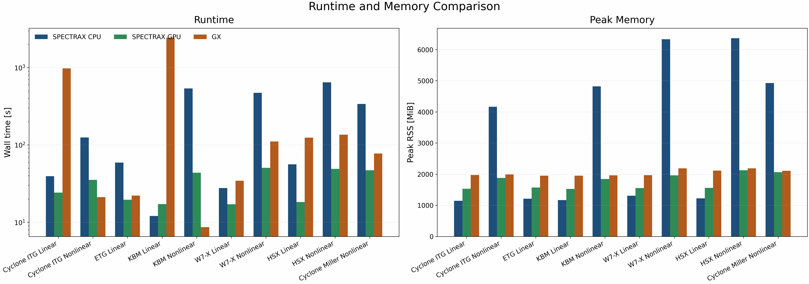

Performance
===========

JAX performance model
---------------------

SPECTRAX-GK uses JAX to compile array kernels ahead of time, enabling
vectorized, accelerator-ready performance while retaining automatic
differentiation. The linear operator and time integrator are designed to be
``jit``-friendly and to avoid Python-side loops in performance-critical paths.

The linear solver precomputes geometry-dependent arrays (gyroaverage
coefficients, drift components, mirror term, and zero-mode masks) in a ``LinearCache`` to
avoid recomputing them at each time step. This cache is reused inside the JIT
compiled integrator.

Cache profiling
---------------

We include a small timing harness that compares cached and uncached RHS
evaluation on a modest grid:

.. code-block:: bash

   python tools/profile_linear_cache.py

On a reference CPU run (Nx=Ny=16, Nz=32, Nl=2, Nm=4), this reported:

.. code-block:: text

   uncached_s=0.000426
   cached_s=0.000455
   speedup=0.94x

The exact speedup depends on hardware and problem size. As more geometry and
operator terms are cached (cv/gb/bgrad, hyper ratios), the overhead balance may
shift; in this run the cached path was roughly cost-neutral.

Nonlinear profiling
-------------------

For end-to-end nonlinear performance, use the dedicated Cyclone profiling
driver. It supports Perfetto traces, XLA HLO dumps, and memory snapshots.

.. code-block:: bash

   python tools/profile_nonlinear_cyclone.py \
     --trace-dir /tmp/spectrax_nl_trace \
     --xla-dump-dir /tmp/spectrax_nl_xla \
     --steps 400 --dt 0.0377 --Nl 4 --Nm 8

The trace directory can be opened with Perfetto. For GPU profiling, set
``JAX_PLATFORM_NAME=gpu`` before invoking the script.

Recent nonlinear profiling (Cyclone, benchmark-locked config)
-------------------------------------------------------------

Reference run configuration (March 4, 2026):

- ``ky=0.3``, ``Nl=4``, ``Nm=8``
- ``dt=0.01``, ``steps=400``
- ``sample_stride=10``, ``diagnostics_stride=10``
- ``tools/profile_nonlinear_cyclone.py`` with the tracked Cyclone runtime config

CPU profiling (Apple CPU, JAX CPU backend):

.. code-block:: text

   warmup_time_s=117.803
   run_time_s=109.147

GPU profiling (A100-class GPU, JAX CUDA backend):

.. code-block:: text

   warmup_time_s=38.950
   run_time_s=21.350

HLO summary (``jit_scan.*_after_optimizations``):

- CPU: ``fft=623``, ``scatter=72``, ``gather=375``, ``dot=88``, ``fusion=1053``
- GPU: ``fft=440``, ``scatter=30``, ``gather=322``, ``dot=44``, ``fusion=831``

The nonlinear RHS remains FFT-heavy with nontrivial gather/scatter density.
Primary optimization targets are the FFT pipeline (channel stacking, reuse of
real-space gradients) and scatter removal in linked-FFT paths.

GPU memory report (jit_scan module):

- Total bytes used: ``228.21 MiB`` (XLA memory usage report).

Nonlinear benchmark harness
---------------------------

To capture per-step runtime and end-of-run diagnostics, use the nonlinear
benchmark harness:

.. code-block:: bash

   python tools/benchmark_nonlinear_suite.py --steps 200 --dt 0.0377 \
     --out /tmp/spectrax_nl_bench.csv

To test the faster spectral nonlinear mode (no Laguerre quadrature grid):

.. code-block:: bash

   python tools/benchmark_nonlinear_suite.py --laguerre-mode spectral

You can optionally pass a reference-code log file to compare runtime per step:

.. code-block:: bash

   python tools/benchmark_nonlinear_suite.py --gx-log /path/to/gx_run.out

Runtime comparison (nonlinear Cyclone)
--------------------------------------

Using the same profiling setup (400 steps):

.. code-block:: text

   SPECTRAX CPU: 0.27287 s / step
   SPECTRAX GPU: 0.05338 s / step

The dominant remaining cost is still the nonlinear FFT pipeline with
gather/scatter-heavy kernels in the bracket assembly path.

Spectral nonlinear mode (fast toggle)
-------------------------------------

The spectral nonlinear mode skips Laguerre quadrature for the nonlinear bracket
(``laguerre_nonlinear_mode = "spectral"`` or ``"fast"``). On the same Cyclone
setup, the observed runtimes were:

.. code-block:: text

   SPECTRAX GPU: 0.09617 s / step  (≈1.18× faster than grid mode)
   SPECTRAX CPU: 0.76575 s / step  (≈0.88×, slower than grid mode)

Cyclone comparison impact (benchmark diagnostics, t≤7.6):

- Wg mean abs rel: 5.4%
- Wphi mean abs rel: 11.2%
- Heat flux mean abs rel: 10.7%

The diagnostics agreement is essentially unchanged relative to grid mode for this case, but
the speedup is modest; larger gains will require further FFT fusion and scatter
elimination.

Runtime and memory comparison workflow
--------------------------------------

For the publication runtime comparison pass, use the manifest-driven runner:

.. code-block:: bash

   python tools/benchmark_runtime_memory.py --list
   python tools/benchmark_runtime_memory.py --dry-run --case cyclone-linear --backend spectrax_cpu
   python tools/benchmark_runtime_memory.py --continue-on-error --log-dir tools_out/runtime_memory_logs

The runner reads ``tools/runtime_memory_manifest.toml`` and writes:

- ``tools_out/runtime_memory_results.csv``
- ``tools_out/runtime_memory_summary.json``
- ``tools_out/runtime_memory_logs/*.stdout.log``
- ``tools_out/runtime_memory_logs/*.stderr.log``
- ``docs/_static/runtime_memory_benchmark.png``

The manifest is designed to hold three rows per case:

- ``spectrax_cpu``
- ``spectrax_gpu``
- ``gx``

Each row may also carry a ``host`` so the same runner can execute local and
remote measurements through one manifest while still collecting wall time and
peak RSS from the target machine.

The checked-in case inventory for the 1.0 release panel covers the shipped
runtime families:

- Cyclone ITG linear and nonlinear
- ETG linear
- KBM linear and nonlinear
- W7-X linear and nonlinear
- HSX linear and nonlinear
- Cyclone Miller nonlinear

These rows are the ones shown in the README/runtime panel. ETG nonlinear,
KAW, and TEM remain separate tracked work items and are intentionally excluded
from the shipped runtime figure until their release-grade benchmark contracts
are closed.

For the stellarator rows on the `office` benchmark host, the shipped panel
uses pre-generated `*.eik.nc` geometry files instead of live VMEC
regeneration. The GX reference rows on that host also need a consistent local
`netcdf-c` / `hdf5` runtime stack; the default `office` stellarator runtime
environment mixed incompatible HDF5 / NetCDF libraries and lacked the Python
geometry helper dependencies needed for VMEC-driven geometry generation.

Final runtime/memory figure
---------------------------

The runtime subplot uses a log scale because the measured wall times span
roughly three orders of magnitude across the linear, nonlinear, and imported
geometry cases. The memory subplot stays linear because the peak RSS spread is
much narrower.

The assembled figure is generated from the collected per-case summaries with
``tools/benchmark_runtime_memory.py --summary-glob ...`` and written to:

- ``docs/_static/runtime_memory_benchmark.png``
- ``docs/_static/runtime_memory_benchmark.pdf``

The published runtime figure complements the atlas instead of duplicating it:
the atlas carries growth/frequency and nonlinear transport/energy comparisons,
while the runtime figure carries CPU/GPU/reference wall time and peak RSS for
the shipped runtime cases.

Cached basis indices
--------------------

To reduce per-step overhead, the linear cache now stores Laguerre/Hermite index
arrays (:math:`l`, :math:`m`) and derived coefficients (``l+1``, ``m+1``,
``sqrt(m)``, ``sqrt(m+1)``). These are reused inside the mirror/curvature
terms and the implicit preconditioner instead of re-allocating on every RHS
call. The change is small in absolute cost for low-order runs, but becomes
noticeable in higher-order scans and tight profiling loops.

GMRES preconditioner iterations
--------------------------------

For the implicit linear solver, we include a small iteration-count harness that
solves a reduced system and compares the GMRES iteration count with multiple
preconditioners:

- ``diag``: full diagonal (damping + drift + mirror)
- ``pas``: PAS line preconditioner (streaming + diagonal damping/drifts)
- ``pas-coarse``: line + kx-coarse additive correction (Schur-style)
- ``hermite-line``: Hermite streaming line solve (tridiagonal in ``m`` at fixed :math:`k_z`)
- ``hermite-line-coarse``: Hermite line solve + kx-coarse correction

.. code-block:: bash

   python tools/profile_gmres_precond.py

On the reference run (Nl=2, Nm=3, Ny=4, Nz=8), this reported:

.. code-block:: text

   iters_plain=6
   iters_diag=6
   iters_pas=6
   iters_pas_coarse=6
   iters_hermite_line=4
   iters_hermite_line_coarse=4

On a larger run (Ny=8, Nz=64, Nl=12, Nm=12, dt=0.1), this reported:

.. code-block:: text

   iters_plain=38
   iters_diag=38
   iters_pas=39
   iters_pas_coarse=39
   iters_hermite_line=22
   iters_hermite_line_coarse=22

JIT considerations
------------------

The linear integrator is ``jit``-compiled with the number of steps and method
as static arguments. The operator term switches (:class:`spectraxgk.linear.LinearTerms`)
should also remain static inside a compiled loop to avoid recompilation. The
cached operator arrays can be constructed once and reused across multiple runs
to avoid repeated geometry setup costs.

Planned optimizations
---------------------

- ``vmap`` over species and parameter scans
- ``pjit``/sharding for multi-device acceleration
- FFT acceleration and layout tuning
- operator fusion for nonlinear terms

Linear-to-nonlinear optimization roadmap
----------------------------------------

The current benchmark runtime gap on CPU is dominated by JAX compile latency and repeated small-shape scan launches. The next implementation phase
targets both linear and nonlinear performance with a single operator strategy:

1. **Compile-once scan kernels**

   - enforce fixed batch shapes across ``ky`` and ``beta`` scans,
   - pre-JIT a small set of canonical ``(Nl, Nm, Ny, Nz)`` signatures,
   - cache compiled executables on disk for repeated benchmark sweeps.

2. **Operator fusion in RHS assembly**

   - merge streaming/mirror/curvature/grad-B stencils into one fused kernel,
   - remove scatter-heavy intermediate writes,
   - keep field coupling and species sums contiguous in memory.

3. **Matrix-free eigen path as default for linear scans**

   - use Krylov/shift-invert for scan tables and figures,
   - reserve long time integration for spot-check diagnostics only.

4. **Preconditioner reuse**

   - persist Hermite-line and shift-invert preconditioner structures across
     neighboring scan points (same geometry/grid),
   - reuse Jacobian-like linearization objects in IMEX stages.

5. **Streaming diagnostics by default**

   - avoid storing full time traces unless explicitly requested,
   - compute growth/frequency online from selected mode signals.

These steps are chosen to carry directly into nonlinear runs, where the same
fused RHS, scan batching, and preconditioner reuse will dominate throughput and
memory behavior.
