Performance
===========

JAX performance model
---------------------

SPECTRAX-GK uses JAX to compile array kernels ahead of time, enabling
vectorized, accelerator-ready performance while retaining automatic
differentiation. The linear operator and time integrator are designed to be
``jit``-friendly and to avoid Python-side loops in performance-critical paths.

The linear solver precomputes geometry-dependent arrays (gyroaverage
coefficients, drift components, mirror term, and zero-mode masks) in a ``LinearCache`` to
avoid recomputing them at each time step. This cache is reused inside the JIT
compiled integrator.

Cache profiling
---------------

We include a small timing harness that compares cached and uncached RHS
evaluation on a modest grid:

.. code-block:: bash

   python tools/profile_linear_cache.py

On a reference CPU run (Nx=Ny=16, Nz=32, Nl=2, Nm=4), this reported:

.. code-block:: text

   uncached_s=0.000426
   cached_s=0.000455
   speedup=0.94x

The exact speedup depends on hardware and problem size. As more geometry and
operator terms are cached (cv/gb/bgrad, hyper ratios), the overhead balance may
shift; in this run the cached path was roughly cost-neutral.

No speedup claim should be made from a local profile, scaling panel, or
parallelization artifact unless the matching numerical-identity gate and
hardware-specific profiler artifact are cited together. Current production
parallelization claims are limited to independent-work batching; whole-state
nonlinear sharding remains a diagnostic/profiler path.

Nonlinear profiling
-------------------

For end-to-end nonlinear performance, use the dedicated Cyclone profiling
driver. It supports Perfetto traces, XLA HLO dumps, and memory snapshots.

.. code-block:: bash

   python tools/profile_nonlinear_cyclone.py \
     --trace-dir /tmp/spectrax_nl_trace \
     --xla-dump-dir /tmp/spectrax_nl_xla \
     --steps 400 --dt 0.0377 --Nl 4 --Nm 8

The trace directory can be opened with Perfetto. For GPU profiling, set
``JAX_PLATFORM_NAME=gpu`` before invoking the script.
JAX writes the trace under
``<trace-dir>/plugins/profile/<timestamp>/*.trace.json.gz`` together with the
corresponding ``*.xplane.pb`` metadata; the same directory can be opened in
XProf, while the optional ``memory.prof`` snapshot can be inspected with
``pprof`` or XProf's memory tooling.

JAX/XProf operational notes
---------------------------

Two JAX runtime details matter when reading short-run performance numbers:

- JAX's persistent compilation cache can remove repeated recompilation cost for
  fixed signatures. For repeated local profiling runs, set
  ``JAX_COMPILATION_CACHE_DIR`` before the first compilation. This is useful
  for engineering sweeps, but the shipped runtime panel should remain a cold
  end-to-end measurement unless stated otherwise.
- JAX GPU runs preallocate most device memory by default. When diagnosing an
  out-of-memory failure on a shared machine, use
  ``XLA_PYTHON_CLIENT_PREALLOCATE=false`` or a reduced
  ``XLA_PYTHON_CLIENT_MEM_FRACTION`` during the profiling run. Those knobs are
  useful for debugging and tracing, but they should not silently change the
  published benchmark contract.

Recent nonlinear profiling (Cyclone, benchmark-locked config)
-------------------------------------------------------------

Reference run configuration (March 4, 2026):

- ``ky=0.3``, ``Nl=4``, ``Nm=8``
- ``dt=0.01``, ``steps=400``
- ``sample_stride=10``, ``diagnostics_stride=10``
- ``tools/profile_nonlinear_cyclone.py`` with the tracked Cyclone runtime config

CPU profiling (Apple CPU, JAX CPU backend):

.. code-block:: text

   warmup_time_s=117.803
   run_time_s=109.147

GPU profiling (A100-class GPU, JAX CUDA backend):

.. code-block:: text

   warmup_time_s=38.950
   run_time_s=21.350

HLO summary (``jit_scan.*_after_optimizations``):

- CPU: ``fft=623``, ``scatter=72``, ``gather=375``, ``dot=88``, ``fusion=1053``
- GPU: ``fft=440``, ``scatter=30``, ``gather=322``, ``dot=44``, ``fusion=831``

The nonlinear RHS remains FFT-heavy with nontrivial gather/scatter density.
Primary optimization targets are the FFT pipeline (channel stacking, reuse of
real-space gradients) and scatter removal in linked-FFT paths.

GPU memory report (jit_scan module):

- Total bytes used: ``228.21 MiB`` (XLA memory usage report).

Nonlinear benchmark harness
---------------------------

To capture per-step runtime and end-of-run diagnostics, use the nonlinear
benchmark harness:

.. code-block:: bash

   python tools/benchmark_nonlinear_suite.py --steps 200 --dt 0.0377 \
     --out /tmp/spectrax_nl_bench.csv

The harness records scalar diagnostics through the compact diagnostics path, so
it measures runtime without materializing mode-resolved history arrays unless a
separate publication artifact explicitly requests them.

To test the optional spectral nonlinear mode (no Laguerre quadrature grid):

.. code-block:: bash

   python tools/benchmark_nonlinear_suite.py --laguerre-mode spectral

You can optionally pass a reference-code log file to compare runtime per step:

.. code-block:: bash

   python tools/benchmark_nonlinear_suite.py --gx-log /path/to/gx_run.out

RHS kernel profile (nonlinear Cyclone)
--------------------------------------

The RHS split profiler measures field solve, nonlinear bracket, linear RHS, and
full RHS kernels after compilation:

.. code-block:: bash

   python tools/profile_nonlinear_step_split.py \
     --config examples/nonlinear/axisymmetric/runtime_cyclone_nonlinear_short.toml \
     --repeats 10 \
     --out docs/_static/nonlinear_rhs_profile_gpu.csv

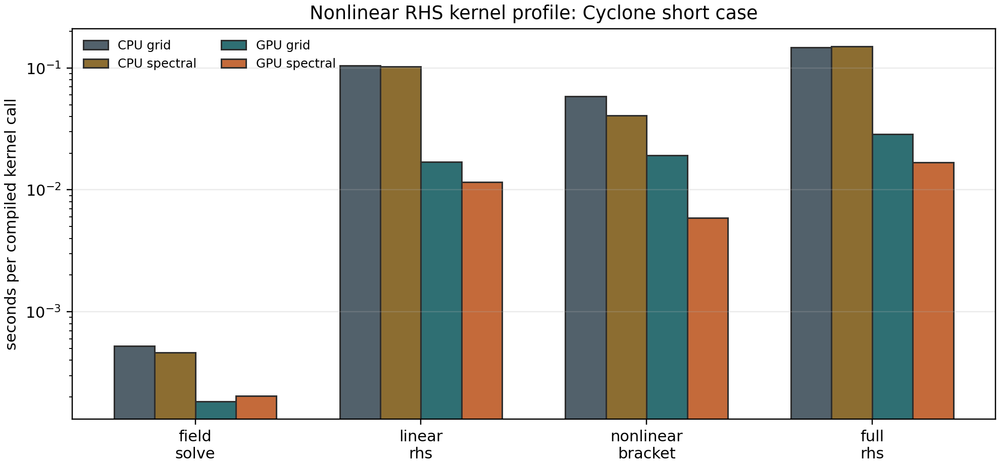

The current bounded Cyclone profile separates CPU and ``office`` GPU timings
for default grid-mode and optional spectral-mode nonlinear brackets. The
machine-readable companion ``docs/_static/nonlinear_rhs_profile.json`` records
the dominant measured kernel, kernel fractions relative to the full RHS, and
grid-to-spectral speedups for each backend. The May 9, 2026 refresh used the
same short-case 10-repeat harness on local CPU and one ``office`` RTX A4000
with ``CUDA_VISIBLE_DEVICES=0`` after the linear-RHS fast-path and linked-FFT
refactor tranche. The GPU environment reported
``jax==0.6.2``/``jaxlib==0.6.2``; these are profiler-local hot-path
measurements, not a broad production runtime claim. The refreshed GPU
grid-mode split is:

.. code-block:: text

   field_solve=4.65e-4 s
   nonlinear_bracket=3.36e-3 s
   linear_rhs=6.13e-3 s
   full_rhs=9.66e-3 s

The same GPU profile with ``laguerre_mode="spectral"`` measured
``nonlinear_bracket=1.50e-3 s`` and ``full_rhs=6.38e-3 s``. CPU full-RHS
timings from the same harness were ``1.01e-1 s`` for grid mode and
``7.73e-2 s`` for spectral mode. The short-harness spectral full-RHS ratios
are now ``1.30`` on CPU and ``1.51`` on GPU for this Cyclone case, while the
nonlinear-bracket-only ratios are ``1.54`` on CPU and ``2.24`` on GPU. The
spectral mode therefore remains an opt-in mode guarded by the case-level
parity gate below rather than a global default.

The dominant remaining warm-throughput cost is the compiled linear RHS, with
the nonlinear FFT pipeline still relevant for larger production grids. The next
performance step is to repeat this split on larger benchmark-size cases and
then use profiler traces to decide whether fusion, layout changes, or
production decomposition give the largest verified win.

Benchmark-size Cyclone Miller RHS profile
-----------------------------------------

The larger Cyclone Miller profile uses the shipped nonlinear Miller input with
``Nx=192``, ``Ny=64``, ``Nz=24``, ``Nl=4``, and ``Nm=8``. This is still a
single compiled-RHS split profile rather than a full transport-average runtime
claim, but it is large enough to expose a different bottleneck balance than the
short Cyclone case.

.. code-block:: bash

   python tools/profile_nonlinear_step_split.py \
     --config examples/nonlinear/axisymmetric/runtime_cyclone_nonlinear_miller.toml \
     --repeats 5 \
     --out docs/_static/nonlinear_rhs_profile_miller_cpu.csv

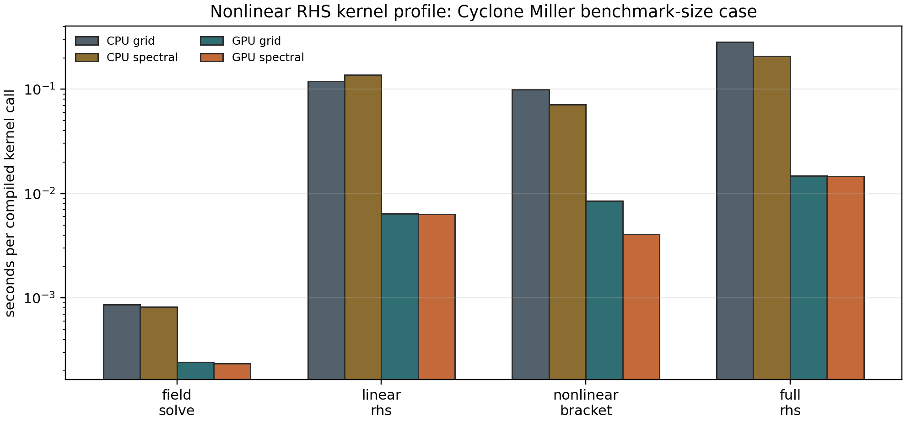

The May 10, 2026 local CPU refresh after the independent-worker
parallelization tranche measured CPU full-RHS timings of ``3.48e-1 s`` in grid
mode and ``2.20e-1 s`` in spectral Laguerre mode, with measured sub-kernels
``linear_rhs=1.24e-1 s`` and ``nonlinear_bracket=9.89e-2 s`` in grid mode. On
one ``office`` RTX A4000, the tracked artifact still records corresponding
full-RHS timings of ``1.28e-2 s`` and ``1.48e-2 s``. Spectral mode reduces the
GPU nonlinear bracket by ``1.63x``, but the full GPU RHS remains faster in grid
mode because the optimized Laguerre transform removes enough layout overhead
while preserving the production grid-quadrature convention. The CPU refresh
continues to point the next optimization pass at linear-RHS fusion/cache
layout and larger-grid bracket decomposition, not at claiming a broad
nonlinear speedup from spectral mode alone.

The full fused nonlinear-RHS trace companion is generated with:

.. code-block:: bash

   python tools/profile_full_nonlinear_rhs_trace.py \
     --config examples/nonlinear/axisymmetric/runtime_cyclone_nonlinear_miller.toml \
     --ky 0.3 \
     --Nl 4 \
     --Nm 8 \
     --repeats 5 \
     --summary-json docs/_static/full_nonlinear_rhs_trace_summary.json

The tracked local CPU artifact
``docs/_static/full_nonlinear_rhs_trace_summary.json`` reports
``warm_seconds=3.35e-1`` and ``3343`` HLO lines. The matched one-RTX-A4000
artifact ``docs/_static/full_nonlinear_rhs_trace_gpu_summary.json`` reports
``warm_seconds=1.28e-2`` and ``3336`` HLO lines. The GPU token triage is
dominated by reshapes (``1545``), broadcasts (``1822``), multiplies (``871``),
FFTs (``229``), slices (``215``), and reductions (``132``). This confirms that
the next nonlinear performance tranche should target fused layout and bracket
data movement rather than claiming a new runtime speedup from the linear-RHS
specialization alone. The same tranche removed a duplicated non-Laguerre field
mask from the nonlinear bracket path and then replaced the Laguerre-grid
``moveaxis``/``tensordot``/``moveaxis`` transforms with precision-controlled
``einsum`` calls. Transform-only CPU/GPU probes showed exact agreement with
the previous algebra at the tested precision; on one RTX A4000 the full fused
nonlinear-RHS trace improved from ``1.49e-2 s`` to ``1.28e-2 s`` while
transposes dropped from ``44`` to ``32``. This is a bounded profiler-state
source improvement, not a full transport runtime claim.

Runtime-mode stellarator RHS smoke profile
------------------------------------------

The release-performance gate also tracks W7-X and HSX at their documented
adiabatic-electron nonlinear runtime mode (``Nx=96``, ``Ny=96``, ``Nz=48``,
``Nl=4``, ``Nm=8``, and the runtime ``k_y=1/21``). These are not full
transport-average timings; they are single-state RHS split profiles used to
verify that the optimized grid-Laguerre path, VMEC/EIK geometry inputs, and
CPU/GPU hot-path accounting remain consistent on non-axisymmetric cases.

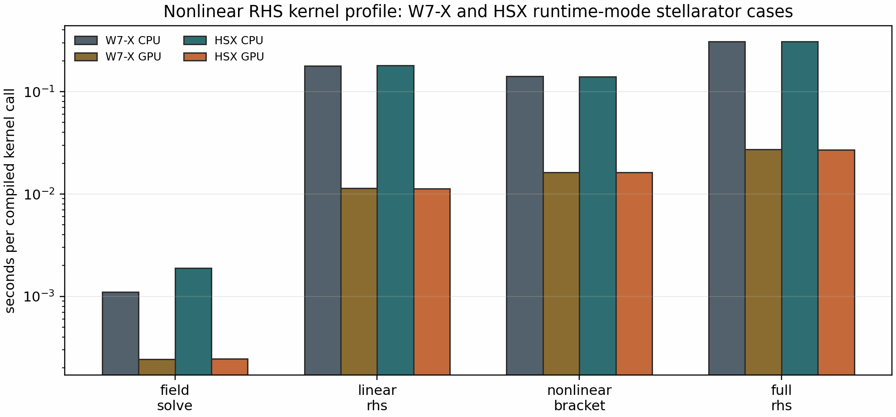

The tracked artifact
``docs/_static/nonlinear_rhs_profile_stellarator_runtime.json`` reports W7-X
CPU/GPU full-RHS timings of ``3.09e-1 s`` and ``2.73e-2 s`` and HSX CPU/GPU
full-RHS timings of ``3.09e-1 s`` and ``2.71e-2 s``. In both stellarator
runtime-mode profiles the GPU row is dominated by the nonlinear bracket
(``~59-60%`` of the measured full RHS), with the linear RHS contributing
``~42%``. That closes the release-level performance evidence: CPU/GPU
profiler artifacts are current, the sharding identity gate is tracked, and the
documentation makes only bounded profiler claims. Further nonlinear speedup
work should target larger-state bracket/linear-RHS layout and must keep using
identity gates before any production runtime claim.

Linear RHS term profile
-----------------------

The linear RHS split profiler drills into the compiled linear contribution used
inside nonlinear runs:

.. code-block:: bash

   python tools/profile_linear_rhs_terms.py \
     --config examples/nonlinear/axisymmetric/runtime_cyclone_nonlinear.toml \
     --ky 0.3 \
     --Nl 4 \
     --Nm 8 \
     --repeats 8 \
     --out docs/_static/linear_rhs_terms_profile_cpu.csv \
     --summary-json docs/_static/linear_rhs_terms_profile.json

After the zero-collision fast path and linked-FFT refactor, the May 9, 2026
CPU Cyclone artifact reports ``full_linear_rhs=1.08e-1 s`` for the compiled
full linear RHS call in this profiling harness. The independently timed term
kernels sum to ``1.68e-2 s``; this remaining gap is a localization signal, not
a speedup claim, because the full path recomputes the field solve, ``H``
assembly, and all weighted contributions as one compiled graph. The largest
standalone terms are hypercollisions (``2.39e-3 s``), linked ``|k_z|`` setup
(``2.38e-3 s``), and streaming (``2.34e-3 s``). The accepted
zero-collision branch now costs ``1.11e-3 s`` in the standalone CPU timing and
is guarded by the state-window identity gate below.

The active-state CPU companion
``docs/_static/linear_rhs_terms_profile_z_wave_cpu.json`` profiles the same
state after injecting a resolved parallel perturbation. There the hypercollision
and linked ``|k_z|`` norms are both ``2.35e-4`` and the linked ``|k_z|`` path
costs ``2.33e-3 s`` on CPU. This is the artifact that should be used for
linked-``|k_z|`` optimization decisions; the initial-state profile is only a
zero-source baseline.

For the larger Cyclone Miller benchmark-size RHS profile above, the active-state
CPU companion is
``docs/_static/linear_rhs_terms_profile_miller_cpu.json``. It uses the same
``Nl=4``, ``Nm=8``, ``k_y=0.3`` state as the nonlinear Miller profiler and
reports ``full_linear_rhs=2.93e-1 s`` with independently timed terms summing to
``4.83e-2 s``. The largest nonzero standalone row is streaming
(``7.33e-3 s``), followed by linked ``\partial_z`` (``6.39e-3 s``), linked
``|k_z|`` (``6.18e-3 s``), and hypercollisions (``6.20e-3 s``). That keeps the
next bounded optimization focused on full-graph layout/fusion and reusable
state transforms rather than making a standalone-term speedup claim.

The matching ``office`` GPU profile is tracked in
``docs/_static/linear_rhs_terms_profile_gpu.json`` and
``docs/_static/linear_rhs_terms_profile_gpu.csv``. On one RTX A4000 with the
same ``jax==0.6.2``/``jaxlib==0.6.2`` environment used for the nonlinear RHS
refresh, it reports ``full_linear_rhs=5.50e-3 s`` and independently timed terms
summing to ``3.41e-3 s``. The accepted zero-collision branch costs
``1.24e-4 s`` in the standalone GPU timing; hypercollisions and linked
``|k_z|`` remain present as separately profiled rows. The active-state GPU
companion
``docs/_static/linear_rhs_terms_profile_z_wave_gpu.json`` activates the same
operator pair with matched norms ``2.35e-4`` and records linked ``|k_z|`` at
``3.63e-4 s`` with ``full_linear_rhs=5.48e-3 s``.

The companion state-window gate is generated with:

.. code-block:: bash

   python tools/gate_linear_rhs_zero_norm_state_window.py \
     --config examples/nonlinear/axisymmetric/runtime_cyclone_nonlinear.toml \
     --ky 0.3 \
     --Nl 4 \
     --Nm 8 \
     --out-json docs/_static/linear_rhs_zero_norm_state_window_gate.json

The current gate passes by accepting the zero-collision skip for this
``nu=0`` Cyclone window while rejecting a hypercollision skip: the initial
state has zero relative hypercollision skip error, but the resolved
``z``-varying state reaches ``3.59e-3``. This protects the optimization path
from incorrectly disabling linked ``|k_z|`` hypercollisions based only on the
initial-state profile.

Full fused linear RHS trace
---------------------------

The term profiler above times independently isolated kernels. The companion
full-graph profiler lowers and times the production ``linear_rhs_cached`` entry
point for a real runtime TOML so optimization work can target the compiled
graph seen by executable linear runs rather than only the standalone assembly
helper:

.. code-block:: bash

   python tools/profile_full_linear_rhs_trace.py \
     --config examples/nonlinear/axisymmetric/runtime_cyclone_nonlinear_miller.toml \
     --ky 0.3 \
     --Nl 4 \
     --Nm 8 \
     --repeats 3 \
     --summary-json docs/_static/full_linear_rhs_trace_summary.json

The May 11, 2026 local CPU production-path artifacts record
``source="spectraxgk.linear.linear_rhs_cached"`` and
``force_electrostatic_fields=true``. The initial-state companion reports
``warm_seconds=1.54e-1`` and ``compile_execute_seconds=1.02``. The active
``z_wave`` companion injects resolved parallel variation and reports
``warm_seconds=8.38e-2`` with the same specialized HLO shape. Both summaries
contain ``2779`` HLO lines and highlight the remaining graph-level pressure
points: broadcasts (``983`` coarse token hits), reshapes (``578``), FFT
mentions (``312``), reductions (``316``), multiplies (``200``), and gathers
(``51``). These are localization metrics, not standalone runtime claims. The
source-path change means these artifacts should be compared against future
production-path refreshes, not against older lower-level assembly-helper
artifacts.

The May 11, 2026 one-RTX-A4000 production-path artifacts
``docs/_static/full_linear_rhs_trace_gpu_summary.json`` and
``docs/_static/full_linear_rhs_trace_gpu_z_wave_summary.json`` report
``source="spectraxgk.linear.linear_rhs_cached"``, ``2779`` HLO lines, and
``force_electrostatic_fields=true``. The initial and active ``z_wave`` states
measure ``warm_seconds=5.13e-3`` and ``5.15e-3``, respectively. These GPU
artifacts show that the production linear-RHS path remains about five
milliseconds on one RTX A4000 for this benchmark-size RHS call, but they remain
kernel-localization evidence rather than a full nonlinear runtime claim.

Parallelization scaling guardrail
---------------------------------

The legacy two-device linear scaling figure remains an engineering artifact, not
the headline production parallelization claim. Current user-facing scaling
claims should point to the independent ``k_y`` scan and quasilinear/UQ ensemble
figures below, because those paths preserve serial ordering and have explicit
solver-observable identity gates.

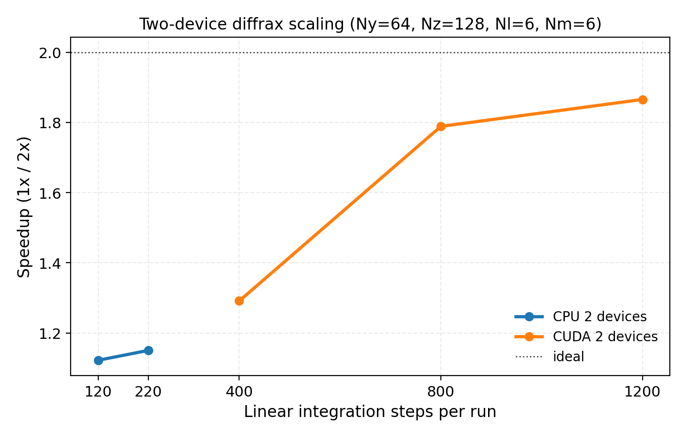

The raw sweep data lives in ``docs/_static/scaling_speedup_data.csv`` and can
be replotted with:

.. code-block:: bash

   python tools/plot_scaling_speedup.py

The exploratory distributed-RK2 strong-scaling data is still tracked for
engineering work, but it is intentionally not presented as a headline
publication figure because the current curve is dominated by communication
overhead rather than near-ideal scaling.

Production parallelization should start with independent work rather than
nonlinear domain decomposition. The public helpers
``spectraxgk.ky_scan_batches`` and ``spectraxgk.batch_map`` split ``k_y``
scans, sensitivity sweeps, and UQ ensembles while preserving serial ordering.
On one device they reduce to batched ``vmap`` execution; on multiple devices
they use JAX device batching and trim padded edge samples deterministically.
Every performance claim from this path should include a numerical-identity
gate against the serial result before a speedup plot is promoted.

For the release-scale CPU/GPU panels below, the acceptance contract is
machine-checkable: the combined ``*_large`` artifact must cite split CPU and
GPU JSON/CSV/PNG/PDF companions, each split artifact must include the grid,
warmup/repeat policy, backend/device counts, positive timing samples, and
per-row identity results, and any speedup statement must name the artifact that
supports it. Whole-state nonlinear sharding uses the same large-run artifact
shape, but its timing ratios remain profiler evidence and not a production
nonlinear speedup claim unless a future matched workload refresh adds the
missing full nonlinear communication and transport gates.

The first release-grade gate for this policy is a real Cyclone linear
``k_y``-scan comparison:

.. image:: _static/parallel_ky_scan_gate.png
   :alt: SPECTRAX-GK ky-batch parallelization identity gate
   :align: center

It is regenerated with:

.. code-block:: bash

   python tools/generate_parallel_ky_scan_gate.py

This gate runs the same linear solver serially and with fixed-shape
``k_y`` batching, checks ``gamma`` and ``omega`` numerical identity, and
reports observed speedup as an engineering metric. The gate intentionally does
not claim nonlinear domain scaling; that remains a separate communication and
FFT-decomposition problem.

The complementary logical-CPU gate exercises the public
``RuntimeParallelConfig`` and ``batch_map`` interface on a structured JAX
pytree output. It is not a gyrokinetic physics validation; it verifies that the
parallel API preserves serial numerical identity for independent scan/UQ-style
workloads before those workloads are connected to heavier solver paths.

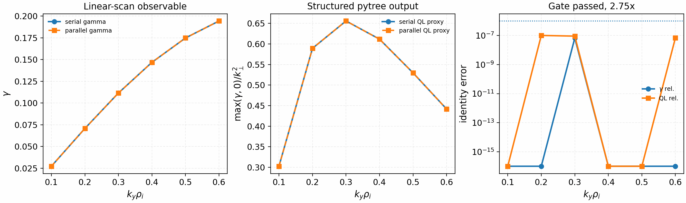

It is regenerated with:

.. code-block:: bash

   python tools/generate_logical_cpu_parallel_scan_gate.py --logical-devices 2

The tracked artifact used two logical CPU devices and passed the identity gate:
``max_gamma_rel_error=6.7e-8``, ``max_ql_rel_error=1.1e-7``, and
``max_omega_abs_error=0``. The observed timing is retained as engineering
metadata only; a speedup claim requires a solver-backed workload and fresh
CPU/GPU profiler artifacts.

The solver-backed strong-scaling artifact now exercises that production
policy on a larger real Cyclone linear scan with 64 independent
``k_y`` values, ``Ny=128``, ``Nz=96``, ``Nl=4``, ``Nm=8``, and ``240`` RK2
steps per mode. Each worker performs one warmup scan before the timed repeats,
and every multi-worker result is compared against the one-worker reference for
``gamma`` and ``omega`` identity:

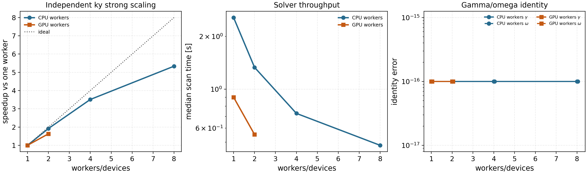

It is regenerated with:

.. code-block:: bash

   KY=$(python -c "print(','.join(f'{0.04 + 0.0125*i:.3f}' for i in range(64)))")

   python tools/profile_independent_ky_scan_scaling.py \
     --backend cpu --devices 1,2,4,8 \
     --ky "$KY" \
     --ny 128 --nz 96 --nl 4 --nm 8 --steps 240 \
     --out-prefix docs/_static/independent_ky_scan_scaling_cpu_large

   python tools/profile_independent_ky_scan_scaling.py \
     --backend gpu --devices 1,2 \
     --ky "$KY" \
     --ny 128 --nz 96 --nl 4 --nm 8 --steps 240 \
     --out-prefix docs/_static/independent_ky_scan_scaling_gpu_large

   python tools/plot_independent_ky_scan_scaling.py

The May 12, 2026 refresh passes the identity gate with zero reported
``gamma``/``omega`` mismatch. CPU process scaling reaches ``1.94x`` on two
workers, ``3.78x`` on four workers, and ``7.18x`` on eight workers. The
two-GPU RTX A4000 run reaches ``1.88x`` with about ``94%`` parallel
efficiency. This is the current recommended production parallelization path
for linear scans, quasilinear studies, sensitivity sweeps, and UQ ensembles:
it has much better scaling behavior than whole-state nonlinear sharding
because communication is restricted to post-run result aggregation.

The release closure status is machine-readable and separates production claims
from diagnostic decomposition work:

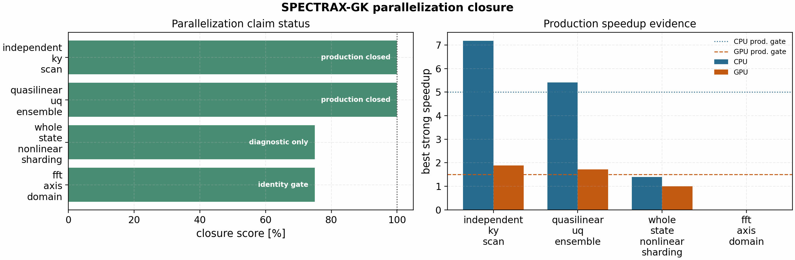

It is regenerated with:

.. code-block:: bash

   python tools/build_parallelization_completion_status.py

The tracked ``docs/_static/parallelization_completion_status.json`` reports
``production_completion_percent = 100`` for independent ``k_y`` scans and
quasilinear/UQ ensembles. The same artifact keeps whole-state nonlinear
sharding and FFT-axis decomposition at diagnostic status until runtime
distributed communication, conservation, transport-window, and profiler-backed
speedup gates are closed.

The nonlinear state-domain prototype now has a stronger diagnostic gate in
``docs/_static/nonlinear_domain_parallel_identity_gate.json``. In addition to
the one-step serial-vs-halo-decomposed state check, the embedded
``nonlinear_domain_transport_window_identity`` report advances a short
fixed-step window and compares boundary identity plus mass, free-energy-proxy,
and boundary-flux-proxy traces. Those trace drifts are agreement metadata for
the diagnostic local stencil only. They do not validate production conservation,
distributed FFT routing, field solves, benchmark transport windows, or any
speedup claim.

The same independent-worker policy is also gated on a quasilinear/UQ-style
ensemble: six late-time Cyclone ITG gradient samples, five ``k_y`` values per
sample, ``Ny=96``, ``Nz=64``, ``Nl=3``, ``Nm=6``, and ``2000`` RK2 steps per
mode. Each worker computes real late-time linear growth/frequency fits and a
reduced mixing-length feature observable. The observable is useful for
parallelization and UQ plumbing, but it is not promoted as an absolute
nonlinear heat-flux predictor.

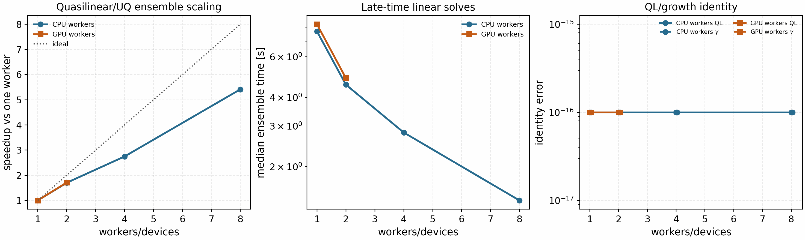

It is regenerated with:

.. code-block:: bash

   python tools/profile_quasilinear_uq_ensemble_scaling.py \
     --backend cpu --devices 1,2,4,8 \
     --out-prefix docs/_static/quasilinear_uq_ensemble_scaling_cpu_large

   python tools/profile_quasilinear_uq_ensemble_scaling.py \
     --backend gpu --devices 1,2 \
     --out-prefix docs/_static/quasilinear_uq_ensemble_scaling_gpu_large

   python tools/plot_quasilinear_uq_ensemble_scaling.py

The May 10, 2026 ``office`` sweep passes the serial identity gate for both the
reduced quasilinear proxy and ``gamma``. The CPU run reaches ``1.70x`` on two
workers, ``2.75x`` on four workers, and ``5.41x`` on eight requested workers
using six actual ensemble chunks. The two-GPU RTX A4000 run reaches ``1.71x``
with about ``86%`` parallel efficiency. This closes the release engineering
gate for quasilinear calibration grids, finite-difference checks, sensitivity
sweeps, and UQ ensembles that can be decomposed into independent solver calls.

The production nonlinear-decomposition plan follows the same conservative
rule. ``spectraxgk.build_velocity_sharding_plan`` records a GX-inspired
species-first, Hermite-second velocity-space layout, including which axes need
Hermite ghost exchange and which axes need field-solve reductions and
broadcasts. This is planning metadata, not yet a nonlinear speedup path. It is
used to keep future ``shard_map`` work explicit about communication before any
transport-runtime claim is made.

The first concrete communication-kernel gate is the Hermite ghost exchange.
It uses ``jax.shard_map`` to exchange nearest-neighbor Hermite moments across a
two-device logical CPU mesh and compares the result against the full-array
reference shift with zero physical boundaries:

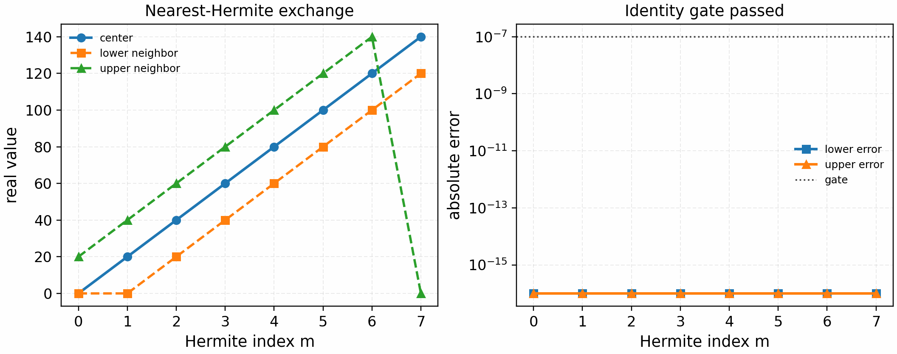

It is regenerated with:

.. code-block:: bash

   python tools/generate_hermite_exchange_gate.py --logical-devices 2

The tracked artifact passes with zero reported lower/upper neighbor error. It
only validates the communication primitive. A production nonlinear
velocity-space decomposition still needs field-reduction/broadcast gates,
streaming-operator identity gates, full-RHS identity gates, and profiler
artifacts before any speedup claim.

The matching velocity-space field-reduction gate validates the second required
communication primitive. It reduces the Hermite-sharded local contributions
with ``lax.psum`` and compares against the full-array reference sum:

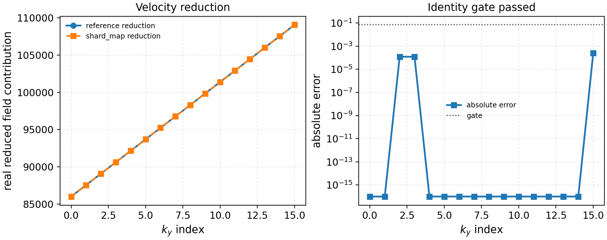

It is regenerated with:

.. code-block:: bash

   python tools/generate_velocity_field_reduce_gate.py --logical-devices 2

The tracked artifact passes with ``max_abs_error=3.9e-6`` under an absolute
tolerance of ``1e-5``. This tolerance reflects expected float32 roundoff from a
different reduction tree; it is not a physics tolerance. The next gate must
combine Hermite exchange and field reduction with the actual streaming
coefficients.

The electrostatic field-reduction gate applies the same ``lax.psum`` pattern
to the actual ``m=0`` density moment used by quasineutrality and compares the
resulting ``phi`` against the production field solve:

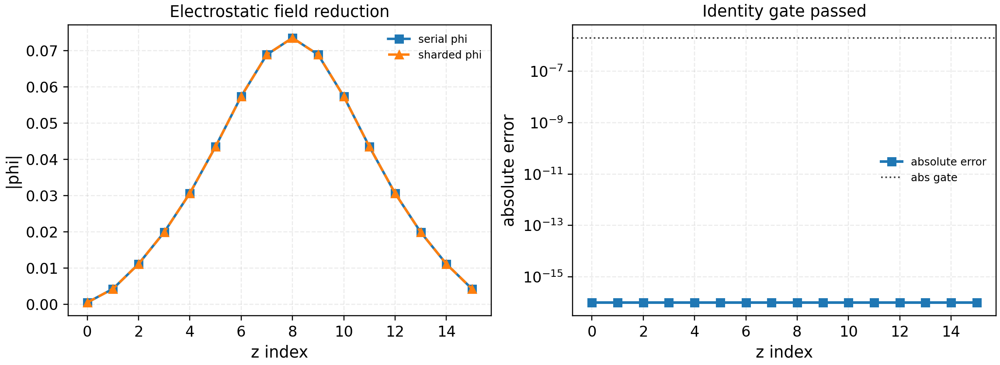

It is regenerated with:

.. code-block:: bash

   python tools/generate_electrostatic_field_reduce_gate.py --logical-devices 2

The tracked artifact passes exactly on the current single-species periodic
gate with ``phi_norm=1.68e-1`` and zero reported absolute/relative error. This
is the first true sharded field-reduction solve gate; multi-species,
linked-boundary, electromagnetic, and nonlinear field solves remain separate
gates.

That coefficient gate is now tracked separately. It applies the
``sqrt(m+1)`` upper-neighbor and ``sqrt(m)`` lower-neighbor Hermite streaming
ladder on top of the shard-map exchange and records the paired field-reduction
error:

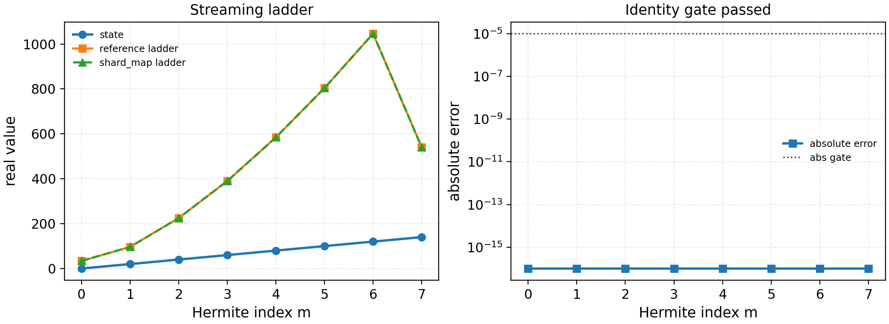

It is regenerated with:

.. code-block:: bash

   python tools/generate_hermite_streaming_ladder_gate.py --logical-devices 2

The tracked artifact passes with zero ladder error and records an accompanying
Hermite field-reduction error of ``1.9e-6``. This closes the communication and
coefficient layer for a one-dimensional Hermite mesh. The next step is an
opt-in linear streaming microkernel that includes the actual parallel
derivative contract.

The electrostatic drift-slice gate then uses offset-1 and offset-2 Hermite
exchanges for mirror and curvature terms, together with the electrostatic
field-reduction gate:

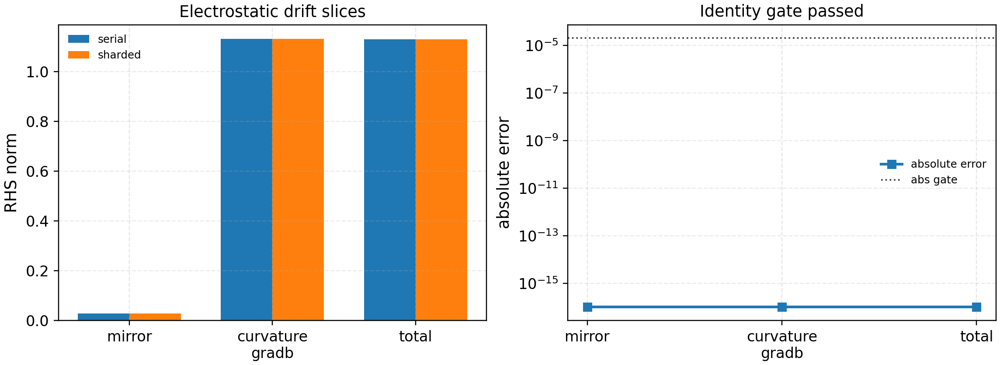

It is regenerated with:

.. code-block:: bash

   python tools/generate_electrostatic_drift_gate.py --logical-devices 2

The tracked artifact passes with ``phi_norm=1.21e-1`` and zero reported
absolute/relative error for the mirror, curvature/grad-B, and combined drift
slices. This is a single-species periodic electrostatic identity gate, not a
full-RHS, linked-boundary, electromagnetic, or nonlinear performance claim.
The gated slices are available together through
``spectraxgk.linear_rhs_parallel_cached`` with
``RuntimeParallelConfig(strategy="velocity", axis="hermite",
backend="electrostatic_linear_slices")``.

The electrostatic diamagnetic-drive gate validates the remaining local
electrostatic drive slice. It uses the Hermite-sharded electrostatic field
reduction, then applies the local ``m=0`` and ``m=2`` density/temperature
gradient masks on each Hermite shard:

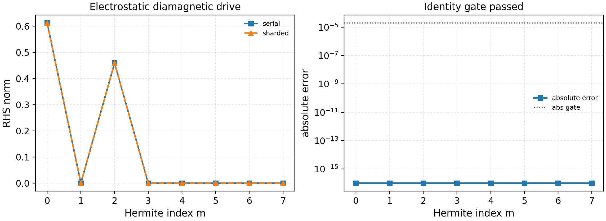

It is regenerated with:

.. code-block:: bash

   python tools/generate_electrostatic_diamagnetic_gate.py --logical-devices 2

The tracked artifact passes with ``phi_norm=1.68e-1`` and zero reported
absolute/relative error against the production diamagnetic-only linear RHS.
The opt-in ``backend="electrostatic_linear_slices"`` route now combines
streaming, mirror, curvature, grad-B, and diamagnetic slices. It still rejects
collision, electromagnetic, linked-boundary, multi-species, and nonlinear
terms until each path has its own identity gate.

The periodic linear-streaming microkernel gate then adds the spectral
parallel derivative along the field-line direction and compares the resulting
``shard_map`` path directly against the production
``spectraxgk.terms.operators.streaming_term``:

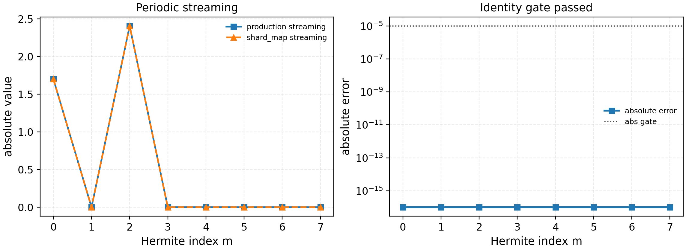

It is regenerated with:

.. code-block:: bash

   python tools/generate_periodic_streaming_microkernel_gate.py --logical-devices 2

The tracked artifact passes with zero reported absolute and relative error.
This is still a linear streaming microkernel gate, not a full linear RHS or
nonlinear performance claim.

The next release gate exercises the same periodic streaming path through the
production ``linear_rhs_cached`` call graph. The artifact disables all
non-streaming terms, keeps electromagnetic channels off, and uses non-density
Hermite moments so that the electrostatic field solve is exactly zero:

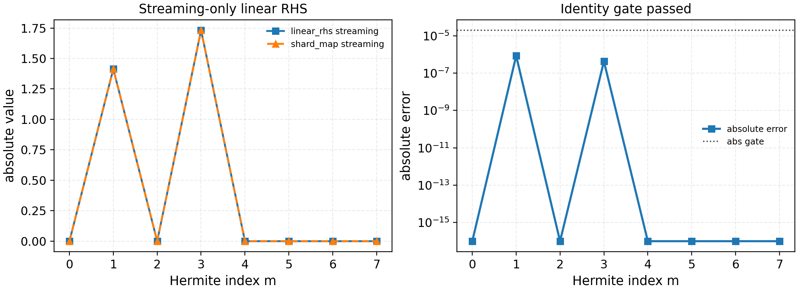

It is regenerated with:

.. code-block:: bash

   python tools/generate_linear_rhs_streaming_gate.py --logical-devices 2

The tracked artifact passes with ``max_abs_error=9.7e-7``,
``max_rel_error=5.6e-7``, and ``phi_norm=0``. This closes a streaming-only
linear-RHS identity gate. It deliberately does not claim full-RHS, nonlinear,
or production speedup parity; those remain separate gates with additional
field-solve, drive, collision, bracket, and profiler coverage.

For code-level experiments the same route is available through
``spectraxgk.linear_rhs_parallel_cached`` with
``RuntimeParallelConfig(strategy="velocity", axis="hermite",
backend="streaming_only")``. The helper rejects any non-streaming term weights
so this remains a disabled-by-default diagnostic path rather than a hidden
solver change.

The follow-on electrostatic streaming gate keeps the term weights identical
but initializes an ``m=0`` density perturbation so that the production
electrostatic field solve produces nonzero ``phi``. It then compares
``linear_rhs_cached`` against the explicit
``backend="streaming_electrostatic"`` route:

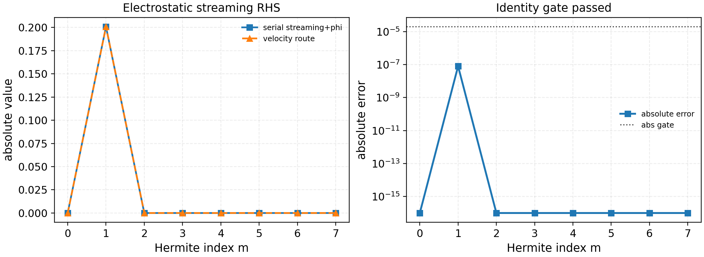

It is regenerated with:

.. code-block:: bash

   python tools/generate_linear_rhs_streaming_electrostatic_gate.py --logical-devices 2

The tracked artifact passes with ``phi_norm=1.34e-1``,
``max_phi_abs_error=1.9e-9``, ``max_abs_error=1.4e-7``, and
``max_rel_error=4.1e-7``. The field solve uses the single-species
Hermite-sharded electrostatic reduction gate above; this validates the
field-reduction-to-streaming call graph before the drift, diamagnetic-drive,
and nonlinear paths are introduced.

The current composed electrostatic linear-RHS gate then exercises the opt-in
``backend="electrostatic_linear_slices"`` route against the serial production
RHS with streaming, mirror, curvature, grad-B, and diamagnetic drive enabled:

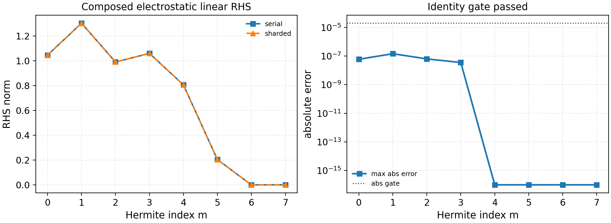

It is regenerated with:

.. code-block:: bash

   python tools/generate_linear_rhs_electrostatic_slices_gate.py --logical-devices 2

The tracked artifact passes with ``phi_norm=1.68e-1``,
``max_abs_error=1.5e-7``, ``max_rel_error=3.7e-7``, and zero reported
electrostatic-potential error. This is the current single-species periodic
electrostatic linear-RHS identity gate for velocity-space parallelization. It
is not a linked-boundary, collision, electromagnetic, nonlinear, or speedup
claim.

The matching engineering profile intentionally stays separate from the
identity gate:

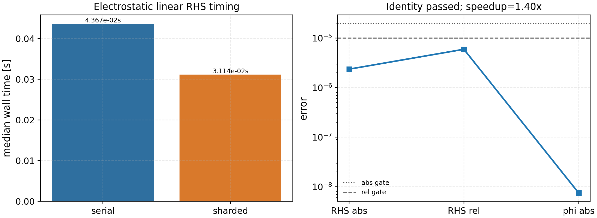

It is regenerated with:

.. code-block:: bash

   python tools/profile_linear_rhs_parallel_slices.py \
     --logical-devices 8 --nl 4 --nm 128 --ny 32 --nz 128 --rtol 1e-5

The tracked CPU artifact uses a Hermite-heavy workload and keeps the sharded
route within a float32 reduction-order engineering tolerance:
``max_abs_error=2.4e-6``, ``max_rel_error=6.0e-6``, and
``max_phi_abs_error=7.5e-9``. The warm timings are
``serial_median_s=4.37e-2``, ``sharded_median_s=3.11e-2``, and
``speedup=1.40x`` on eight logical CPU devices. This remains an engineering
profile rather than a publication speedup claim; the stricter small-grid
identity gate above is the release correctness gate.

A compact CPU sweep maps the same opt-in route across Hermite resolution and
logical device count:

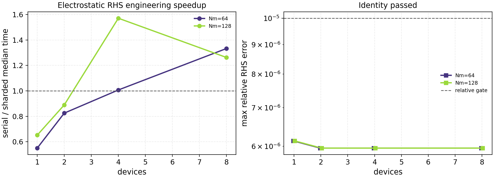

It is regenerated with:

.. code-block:: bash

   python tools/profile_linear_rhs_parallel_slices_sweep.py \
     --platform cpu --devices 1,2,4,8 --nms 64,128 \
     --nl 4 --ny 32 --nz 128 --rtol 1e-5

The tracked sweep passes identity for all points. It shows the current
Hermite-sharded electrostatic route is overhead-limited at one and two logical
CPU devices, becomes competitive near four devices, and reaches the best
bounded engineering point of ``1.57x`` at ``Nm=128`` on four logical CPU
devices. This figure is a regime map for development, not a broad scaling
claim. The machine-readable release contract is
``docs/_static/linear_rhs_parallel_slices_sweep.json`` with CSV/PNG/PDF
companions.

The same profiler can target GPUs on the office node:

.. code-block:: bash

   PYTHONPATH=/tmp/spectrax-gk-profile/src python3 \
     tools/profile_linear_rhs_parallel_slices.py \
     --platform gpu --logical-devices 2 \
     --nl 4 --nm 64 --ny 32 --nz 128 --rtol 1e-5 \
     --out-prefix docs/_static/linear_rhs_parallel_slices_profile_gpu

The tracked two-RTX-A4000 artifact passes the engineering identity check
(``max_abs_error=1.9e-6``, ``max_rel_error=4.7e-6``), but it is much slower
than the single-GPU serial JIT path (``speedup=0.03x``). This keeps the GPU
Hermite-sharding lane open: do not claim GPU speedup until the communication
layout is redesigned or a larger production workload shows a real gain.

Fixed-step nonlinear state sharding
-----------------------------------

The fixed-step nonlinear runner now has the same full-state sharding contract
as the linear path for release-gated state axes. Set
``TimeConfig.state_sharding = "auto"`` (or a concrete axis such as ``"ky"`` or
``"kx"``) with ``use_diffrax = false`` to route through
``spectraxgk.integrate_nonlinear_sharded``. The implementation uses a ``pjit``
scan and preserves the serial Runge-Kutta update; it is therefore an
identity-gated state-sharding primitive, not a halo-exchange FFT domain
decomposition claim. Sharding the ``z`` FFT axis is deliberately not exposed as
a release-gated nonlinear runtime path because the current JAX/XLA FFT layout
does not pass the multi-device identity gate.

The profiler/identity artifact is generated with:

.. code-block:: bash

   python tools/profile_nonlinear_sharding.py \
     --sharding auto --sharding-options auto,kx \
     --out-json docs/_static/nonlinear_sharding_profile.json

The JSON records device count, requested sharding axis, warm serial/sharded
timings, profiler-trace status, final-state errors, final-field/RHS diagnostic
errors, and the fastest identity-preserving candidate among the requested
state-axis options. The
local checked-in artifact is deliberately small and only establishes the
control-flow and single-device identity gate. The two-GPU office artifact at
``docs/_static/nonlinear_sharding_profile_office_gpu.json`` records active
``auto``/``kx`` state sharding with zero final-state, final-field, and final-RHS
diagnostic error on both candidate axes. In the current bounded run the
requested ``auto`` path is slower (``0.81x``), while the best
identity-preserving candidate is explicit ``kx`` sharding at about ``0.96x``.
That is not a speedup, so this artifact should be treated as a correctness and
profiler-localization gate rather than a publication runtime claim.

The larger strong-scaling sweep is regenerated with isolated subprocesses so
each device count gets a clean JAX runtime:

.. code-block:: bash

   python tools/profile_nonlinear_sharding_sweep.py \
     --backend cpu --devices 1,2,4,8 \
     --nx 24 --ny 48 --nz 96 --nl 4 --nm 8 --steps 8 \
     --out-prefix docs/_static/nonlinear_sharding_strong_scaling_cpu_large

   python tools/profile_nonlinear_sharding_sweep.py \
     --backend gpu --devices 1,2 \
     --nx 48 --ny 96 --nz 128 --nl 4 --nm 8 --steps 12 \
     --out-prefix docs/_static/nonlinear_sharding_strong_scaling_gpu_xlarge

   python tools/plot_nonlinear_sharding_strong_scaling.py

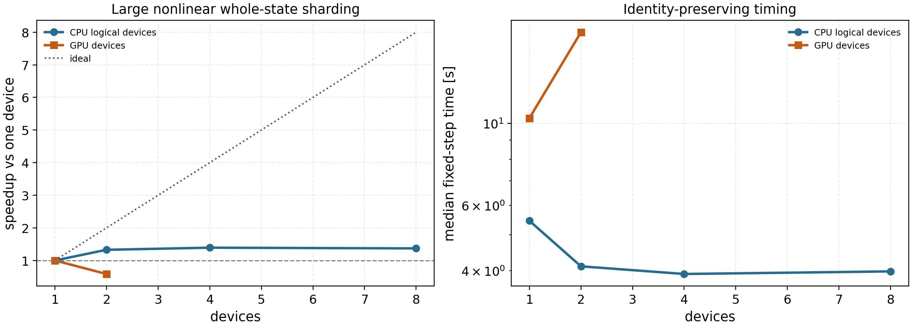

The May 10, 2026 large sweep passes the final-state identity gate at every
tracked point. The CPU logical-device path improves from one to four devices
but saturates at about ``1.39x`` and does not improve further at eight logical
devices. The two-RTX-A4000 GPU path is slower than one GPU even for the larger
``Nx=48, Ny=96, Nz=128, Nl=4, Nm=8`` fixed-step case, with a measured speedup
of about ``0.63x``. This makes the technical conclusion explicit: the current
whole-state nonlinear sharding path is useful as a correctness/profiler gate,
but production parallelization should prioritize independent ``k_y`` scans,
UQ/ensemble batching, and a redesigned communication-aware nonlinear domain
decomposition before any nonlinear multi-GPU speedup claim is made.

This claim boundary is mirrored in :doc:`parallelization` and
:doc:`release_scope`. If a future optimization changes the conclusion, refresh
the CPU and GPU sweep artifacts before changing README or release-note wording.

Spectral nonlinear mode (gated fast toggle)
-------------------------------------------

The spectral nonlinear mode skips Laguerre quadrature for the nonlinear bracket
(``laguerre_nonlinear_mode = "spectral"`` or ``"fast"``). It is not the default
mode because the speedup is case and backend dependent. The release gate runs
the same bounded nonlinear case twice, once with default grid-mode brackets and
once with spectral brackets, then compares end-of-run scalar diagnostics.

.. code-block:: bash

   python tools/gate_laguerre_nonlinear_modes.py \
     --case cyclone --case kbm --case w7x --case hsx \
     --out-json docs/_static/laguerre_mode_gate.json \
     --out-csv docs/_static/laguerre_mode_gate.csv \
     --plot-out docs/_static/laguerre_mode_gate.png

For a GPU reference artifact, run the same command on the target GPU node with
GPU-specific output paths, for example:

.. code-block:: bash

   python tools/gate_laguerre_nonlinear_modes.py \
     --case cyclone --case kbm --case w7x --case hsx \
     --out-json docs/_static/laguerre_mode_gate_gpu.json \
     --out-csv docs/_static/laguerre_mode_gate_gpu.csv \
     --plot-out docs/_static/laguerre_mode_gate_gpu.png

For W7-X/HSX runs, pass ``--w7x-geometry-file`` and
``--hsx-geometry-file`` if the local pre-generated ``*.eik.nc`` files live
outside the default cache paths.

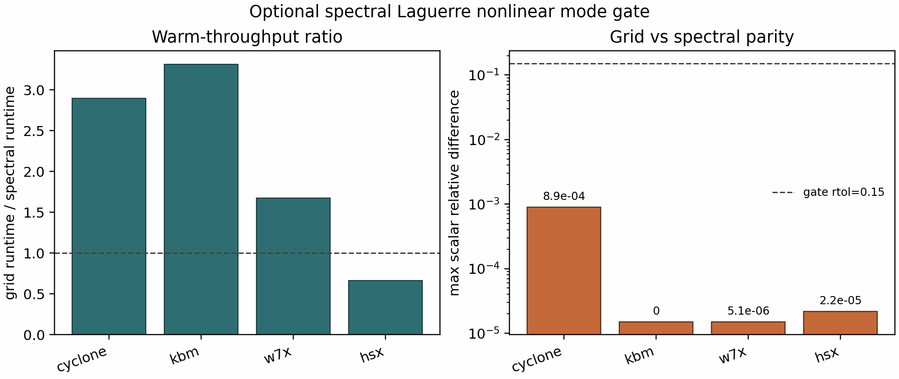

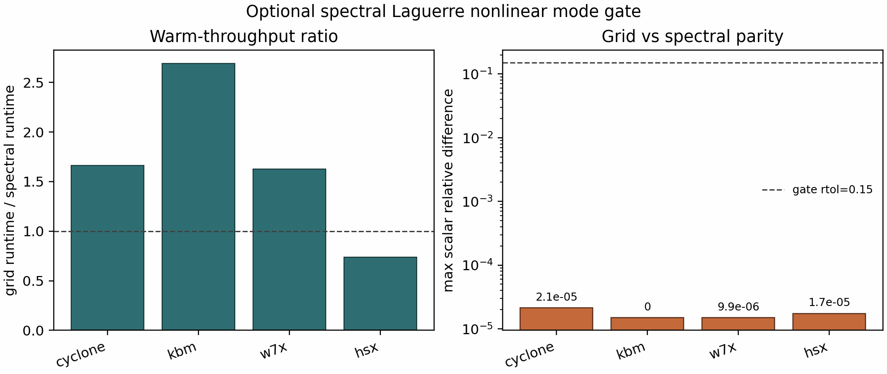

On the bounded local CPU gate, Cyclone, KBM, W7-X, and HSX all passed the
scalar-diagnostic parity threshold with maximum relative differences below
``8.9e-4``. The measured grid/spectral runtime ratios were:

- Cyclone: ``2.90``
- KBM: ``3.31``
- W7-X: ``1.67``
- HSX: ``0.66``

On the bounded ``office`` GPU gate, all four cases also passed with maximum
relative differences below ``2.2e-5``. The measured grid/spectral runtime
ratios were:

- Cyclone: ``1.66``
- KBM: ``2.69``
- W7-X: ``1.63``
- HSX: ``0.74``

Because HSX is slower in both bounded gates, the spectral mode should be
treated as a validated optional engineering mode, not a global fast default.
Production use should rerun the gate on the target case and backend before
claiming speedup.

Runtime and memory comparison workflow
--------------------------------------

For the publication runtime comparison pass, use the manifest-driven runner:

.. code-block:: bash

   python tools/benchmark_runtime_memory.py --list
   python tools/benchmark_runtime_memory.py --dry-run --case cyclone-linear --backend spectrax_cpu
   python tools/benchmark_runtime_memory.py --continue-on-error --log-dir tools_out/runtime_memory_logs

The runner reads ``tools/runtime_memory_manifest.toml`` and writes:

- ``tools_out/runtime_memory_results.csv``
- ``tools_out/runtime_memory_summary.json``
- ``tools_out/runtime_memory_logs/*.stdout.log``
- ``tools_out/runtime_memory_logs/*.stderr.log``
- ``docs/_static/runtime_memory_benchmark.png``

The manifest is designed to hold three rows per case:

- ``spectrax_cpu``
- ``spectrax_gpu``
- ``gx``

Each row may also carry a ``host`` so the same runner can execute local and
remote measurements through one manifest while still collecting wall time and
peak RSS from the target machine.
Rows may also carry a ``profile_command``. When that secondary command succeeds
and prints ``warmup_time_s=...`` / ``run_time_s=...``, the runner merges those
warm measurements back into the same CSV/JSON summary row as the cold pass.
If a profiling command prints ``warmup_time_s=...`` or ``run_time_s=...``, the
runner also records those fields in the CSV/JSON summary so cold and warm JAX
timings can be tracked without a separate sidecar note.

The checked-in case inventory for the current release panel covers the shipped
runtime families:

- Cyclone ITG linear and nonlinear
- ETG linear
- KBM linear and nonlinear
- W7-X linear and nonlinear
- HSX linear and nonlinear
- Cyclone Miller nonlinear

These rows are the ones shown in the README/runtime panel. ETG nonlinear,
KAW, and TEM remain separate tracked work items and are intentionally excluded
from the shipped runtime figure until their release-grade benchmark contracts
are closed.

For the stellarator rows on the `office` benchmark host, the shipped panel
uses pre-generated `*.eik.nc` geometry files instead of live VMEC
regeneration. The GX reference rows on that host also need a consistent local
`netcdf-c` / `hdf5` runtime stack; the default `office` stellarator runtime
environment mixed incompatible HDF5 / NetCDF libraries and lacked the Python
geometry helper dependencies needed for VMEC-driven geometry generation.

Final runtime/memory figure
---------------------------

.. image:: _static/runtime_memory_benchmark.png
   :alt: Runtime and memory comparison across published benchmark cases
   :width: 100%

The runtime subplot uses a log scale because the measured wall times span
roughly three orders of magnitude across the linear, nonlinear, and imported
geometry cases. The memory subplot stays linear because the peak RSS spread is
much narrower.

The assembled figure is generated from the collected per-case summaries with
``tools/benchmark_runtime_memory.py --summary-glob ...`` and written to:

- ``docs/_static/runtime_memory_benchmark.png``
- ``docs/_static/runtime_memory_benchmark.pdf``

For the shipped refresh shown here, use the successful release summary rather
than the older interrupted summary that contains failed W7-X/HSX nonlinear
rows:

.. code-block:: bash

   python tools/benchmark_runtime_memory.py \
     --summary-glob tools_out/runtime_memory_summary_ship_refresh.json \
     --csv-out tools_out/runtime_memory_results_ship_refresh_regenerated.csv \
     --summary-out tools_out/runtime_memory_summary_ship_refresh_regenerated.json \
     --plot-out docs/_static/runtime_memory_benchmark.png

The published runtime figure complements the atlas instead of duplicating it:
the atlas carries growth/frequency and nonlinear transport/energy comparisons,
while the runtime figure carries CPU/GPU/reference wall time and peak RSS for
the shipped runtime cases.

Interpretation of short nonlinear GPU rows
------------------------------------------

The shipped runtime panel reports cold wall time. For the JAX backends, this
includes startup and compilation, so short nonlinear cases can look worse than
their steady-state throughput would suggest.

Targeted ``office`` GPU profiles on the same shipped short nonlinear configs
measured:

.. code-block:: text

   Cyclone nonlinear: warmup_time_s=33.957  run_time_s=15.054
   KBM nonlinear:     warmup_time_s=27.485  run_time_s= 9.725

Compared with the cold runtime panel rows:

- Cyclone nonlinear GPU: ``38.27 s`` in the shipped panel, versus ``15.05 s``
  for the second run on the same compiled executable.
- KBM nonlinear GPU: ``44.33 s`` in the shipped panel, versus ``9.73 s`` for
  the second run on the same compiled executable.

This changes the optimization reading:

- the current short-run Cyclone GPU deficit in the shipped panel is primarily a
  cold-start effect, since the warm run is already faster than the tracked GX
  row,
- the current short-run KBM GPU gap is mostly compile amortization, with warm
  performance already close to GX.

The runtime figure now overlays those warm second-run measurements as hollow
diamond markers on the runtime bars wherever ``run_time_s`` is present in the
summary input.

The highest-value performance work for these short nonlinear lanes is therefore
compile/startup reduction and executable reuse, not just per-step kernel work.

Startup phase profiler
----------------------

For cold-start deep dives, use the dedicated startup profiler:

.. code-block:: bash

   python tools/profile_runtime_startup.py \
     --config examples/nonlinear/axisymmetric/runtime_cyclone_nonlinear.toml \
     --ky 0.3 --Nl 4 --Nm 8 --compile-steps 1 \
     --json-out tools_out/startup_cyclone_gpu.json \
     --csv-out tools_out/startup_cyclone_gpu.csv

The profiler breaks the cold path into the main setup and first-compile phases:

- runtime config load
- geometry resolution
- grid/default construction
- parameter and term setup
- initial-condition construction
- linear-cache construction
- first field solve compile+execute
- first linear/full RHS compile+execute
- first nonlinear integrator compile+execute

It supports ``--trace-dir`` and ``--memory-profile`` for XProf/Perfetto
inspection with phase-level annotations, and ``--debug-log-cache`` /
``--explain-cache-misses`` for JAX cache diagnostics when a repeated compile
path looks suspicious.
By default the trace tools now start JAX profiling with
``python_tracer_level=0`` and ``host_tracer_level=0``. On the lightweight
``office`` environment this avoids the optional TensorFlow Python-hook import
path, so traces are emitted cleanly without installing TensorFlow just to
silence profiler startup noise.

The current ``office`` GPU startup profiles for the shipped short nonlinear
cases show the same dominant structure:

- Cyclone nonlinear startup total: ``35-36 s`` after the low-rank
  collision-cache and host-cache cleanup passes (previously ``41.47 s`` on the
  earlier office snapshot)
- KBM nonlinear startup total: ``32.23 s``
- dominant phases in both cases:

  - ``compile_first_integrator_run``: about ``22 s`` (Cyclone), ``19.28 s`` (KBM)
  - ``build_linear_cache``: about ``5.6 s`` (Cyclone), ``7.73 s`` (KBM)
  - ``compile_first_linear_rhs`` / ``compile_first_full_rhs``: another
    ``3.0 + 3.0 s`` (Cyclone) or ``1.7 + 1.7 s`` (KBM)

So the next high-value performance work is no longer the analytic geometry
startup path or the collision prefactor path; it is the first compiled
nonlinear integrator path, followed by the remaining Laguerre and drift/cache
construction subphases.

To break the cache-construction lump down further, use:

.. code-block:: bash

   python tools/profile_linear_cache_build.py \
     --config examples/nonlinear/axisymmetric/runtime_cyclone_nonlinear.toml \
     --Nl 4 --Nm 8 \
     --json-out tools_out/linear_cache_cyclone_gpu.json \
     --csv-out tools_out/linear_cache_cyclone_gpu.csv

The current ``office`` GPU decomposition for the shipped Cyclone short
nonlinear lane is:

- total measured decomposition: ``6.86 s`` after the low-rank collision-cache,
  host-cache, and broadcasted-gyroaverage passes
- dominant subphases:

  - ``gyro_bessel_cache``: ``1.33 s``
  - ``laguerre_cache``: ``1.21 s``
  - ``kperp_and_drifts``: ``0.99 s``
  - ``geometry_coefficients``: ``0.68 s``
  - ``collision_and_damping_cache``: ``0.17 s``

The low-rank collision cache, host-built moment/damping factors, and
broadcasted gyroaverage construction remove the old collision/damping
bottleneck from the cache profile. The overall cold-start wall clock is still
dominated by the first nonlinear integrator compile. The next cache-build
optimization work should therefore focus on Laguerre and drift/cache
construction, while the broader startup campaign should prioritize the first
integrator compile surface.

Cached basis indices
--------------------

To reduce per-step overhead, the linear cache now stores Laguerre/Hermite index
arrays (:math:`l`, :math:`m`) and derived coefficients (``l+1``, ``m+1``,
``sqrt(m)``, ``sqrt(m+1)``). These are reused inside the mirror/curvature
terms and the implicit preconditioner instead of re-allocating on every RHS
call. The change is small in absolute cost for low-order runs, but becomes
noticeable in higher-order scans and tight profiling loops.

GMRES preconditioner iterations
--------------------------------

For the implicit linear solver, we include a small iteration-count harness that
solves a reduced system and compares the GMRES iteration count with multiple
preconditioners:

- ``diag``: full diagonal (damping + drift + mirror)
- ``pas``: PAS line preconditioner (streaming + diagonal damping/drifts)
- ``pas-coarse``: line + kx-coarse additive correction (Schur-style)
- ``hermite-line``: Hermite streaming line solve (tridiagonal in ``m`` at fixed :math:`k_z`)
- ``hermite-line-coarse``: Hermite line solve + kx-coarse correction

.. code-block:: bash

   python tools/profile_gmres_precond.py

On the reference run (Nl=2, Nm=3, Ny=4, Nz=8), this reported:

.. code-block:: text

   iters_plain=6
   iters_diag=6
   iters_pas=6
   iters_pas_coarse=6
   iters_hermite_line=4
   iters_hermite_line_coarse=4

On a larger run (Ny=8, Nz=64, Nl=12, Nm=12, dt=0.1), this reported:

.. code-block:: text

   iters_plain=38
   iters_diag=38
   iters_pas=39
   iters_pas_coarse=39
   iters_hermite_line=22
   iters_hermite_line_coarse=22

JIT considerations
------------------

The linear integrator is ``jit``-compiled with the number of steps and method
as static arguments. The operator term switches (:class:`spectraxgk.linear.LinearTerms`)
should also remain static inside a compiled loop to avoid recompilation. The
cached operator arrays can be constructed once and reused across multiple runs
to avoid repeated geometry setup costs. Nonlinear IMEX paths now reuse the
electrostatic compiled linear-RHS route whenever ``apar=bpar=0``; this is a
bounded fast path for adiabatic-electron electrostatic runs, not a new runtime
claim until a fresh end-to-end profile is recorded.

Planned optimizations
---------------------

- ``vmap`` over species and parameter scans
- JAX mesh-based parallelization across multiple devices
- FFT acceleration and layout tuning
- operator fusion for nonlinear terms

Linear-to-nonlinear optimization roadmap
----------------------------------------

The current benchmark runtime gap on CPU is dominated by JAX compile latency and repeated small-shape scan launches. The next implementation phase
targets both linear and nonlinear performance with a single operator strategy:

1. **Compile-once scan kernels**

   - enforce fixed batch shapes across ``ky`` and ``beta`` scans,
   - pre-JIT a small set of canonical ``(Nl, Nm, Ny, Nz)`` signatures,
   - cache compiled executables on disk for repeated benchmark sweeps.

2. **Operator fusion in RHS assembly**

   - merge streaming/mirror/curvature/grad-B stencils into one fused kernel,
   - remove scatter-heavy intermediate writes,
   - keep field coupling and species sums contiguous in memory.

3. **Matrix-free eigen path as default for linear scans**

   - use Krylov/shift-invert for scan tables and figures,
   - reserve long time integration for spot-check diagnostics only.

4. **Preconditioner reuse**

   - persist Hermite-line and shift-invert preconditioner structures across
     neighboring scan points (same geometry/grid),
   - reuse Jacobian-like linearization objects in IMEX stages.

5. **Streaming diagnostics by default**

   - avoid storing full time traces unless explicitly requested,
   - compute growth/frequency online from selected mode signals.

These steps are chosen to carry directly into nonlinear runs, where the same
fused RHS, scan batching, and preconditioner reuse will dominate throughput and
memory behavior.
