Quasilinear Transport
=====================

SPECTRAX-GK can compute quasilinear transport diagnostics from a linear
eigenstate or late-time linear state. The implementation deliberately separates
the exact linear diagnostic from any saturation model:

* **linear weights** are amplitude-normalized heat and particle fluxes computed
  with the same diagnostic kernels used by runtime simulations;
* **saturation rules** are named, serialized model assumptions that convert a
  linear mode into a trend-level saturated estimate;
* **calibrated absolute flux claims** require nonlinear training and holdout
  validation and should not be inferred from the uncalibrated rules alone.

Current validated scope
-----------------------

The current implementation supports electrostatic channels only:

.. code-block:: toml

   [quasilinear]
   enabled = true
   mode = "weights"
   saturation_rule = "none"
   amplitude_normalization = "phi_rms"
   kperp_average = "phi_weighted"
   channels = ["es"]

The diagnostic writes:

* ``*.quasilinear.summary.json`` with growth rate, frequency, normalization,
  ``kperp_eff2``, species weights, and saturation metadata;
* ``*.quasilinear_species.csv`` with species-resolved heat and particle flux
  weights and, when requested, saturated estimates.
* ``*.quasilinear_spectrum.csv`` for serial ``scan-runtime-linear`` runs with
  quasilinear diagnostics enabled.

For linked-boundary or imported-geometry scans, ``*.quasilinear_spectrum.csv``
stores two perpendicular-mode coordinates: ``ky`` is the requested scan
coordinate used for ordering and plotting, while ``mode_ky`` is the selected
signed grid-mode coordinate used internally by the linear solve. This prevents
negative-branch aliases from corrupting publication spectra while preserving
the exact selected mode metadata.

Literature anchors and claim policy
-----------------------------------

The SPECTRAX-GK quasilinear layer follows the same separation used in modern
reduced gyrokinetic transport workflows:

* the linear gyrokinetic eigenproblem determines growth rates, frequencies,
  eigenfunctions, cross-phases, and species-resolved flux weights;
* a separate saturation rule converts those linear quantities into fluctuation
  amplitudes;
* nonlinear simulations or experimental transport databases are required before
  claiming calibrated absolute fluxes.

This separation is central to early nonlinear tests of quasilinear transport
models [Waltz09]_, to the QuaLiKiz derivation [Stephens21]_, to profile-
evolution use cases [Citrin17]_, and to broader quasilinear-model validation
reviews [Staebler24]_. Parker et al. [Parker23]_ show why saturation rules must
be treated as model assumptions rather than consequences of the linear solve
alone. SAT3 [Dudding22]_ and SAT3-NN [Sar26]_ are useful longer term targets
because they use spectrum-aware, database-calibrated saturation information
instead of a single uncalibrated mixing-length constant.

For stellarator optimization, SPECTRAX-GK currently treats quasilinear fluxes as
research diagnostics and optimization proxies, following the microstability
optimization motivation in [Jorge24]_. The present release does **not** claim a
validated absolute nonlinear flux predictor: the first Cyclone-to-Cyclone-Miller
train/holdout gate deliberately fails, and that failure is preserved as a
model-development constraint.

Executable usage
----------------

.. code-block:: bash

   spectraxgk run-runtime-linear \
     --config examples/linear/axisymmetric/runtime_cyclone_quasilinear.toml \
     --out tools_out/cyclone_quasilinear

or enable the diagnostic for another linear runtime TOML:

.. code-block:: bash

   spectraxgk run-runtime-linear \
     --config examples/linear/axisymmetric/runtime_cyclone.toml \
     --quasilinear \
     --ql-mode saturated \
     --ql-saturation-rule mixing_length \
     --ql-normalization phi_rms \
     --ql-csat 1.0 \
     --out tools_out/cyclone_quasilinear

For a ky spectrum, use serial scan evaluation:

.. code-block:: bash

   spectraxgk scan-runtime-linear \
     --config examples/linear/axisymmetric/runtime_cyclone_quasilinear.toml \
     --ky-values 0.1,0.2,0.3,0.4 \
     --quasilinear \
     --out tools_out/cyclone_quasilinear_scan

Then render the spectrum:

.. code-block:: bash

   python tools/plot_quasilinear_spectrum.py \
     --spectrum tools_out/cyclone_quasilinear_scan.quasilinear_spectrum.csv \
     --out docs/_static/quasilinear_cyclone_spectrum.png

The shaped-tokamak Miller companion uses the same pattern, with the positive
``ky`` range resolved by the nonlinear run's ``Ny=64`` grid:

.. code-block:: bash

   spectraxgk scan-runtime-linear \
     --config examples/linear/axisymmetric/runtime_cyclone_miller_quasilinear.toml \
     --ky-values 0.1,0.2,0.3,0.4,0.5 \
     --quasilinear \
     --out docs/_static/quasilinear_cyclone_miller_spectrum_scan

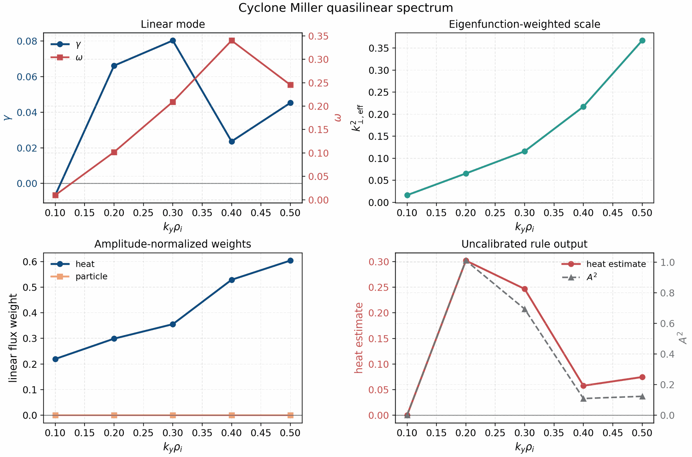

Model details
-------------

Linear eigenproblem
^^^^^^^^^^^^^^^^^^^

For a fixed flux-tube geometry and perpendicular mode, the linear runtime solves
the matrix-free system

.. math::

   \frac{\partial G}{\partial t} = \mathcal{L}(\mathbf{p}) G,
   \qquad
   \mathcal{L} v_j = \lambda_j v_j,

where ``G`` is the Hermite-Laguerre gyrocenter moment state, ``v_j`` is a right
eigenvector, and

.. math::

   \lambda_j = \gamma_j - i\omega_j.

The sign convention above matches the runtime output: ``gamma`` is the growth
rate and ``omega`` is the physical mode frequency reported by the executable.
The operator is assembled by :mod:`spectraxgk.linear`,
:mod:`spectraxgk.terms.assembly`, and the individual term modules under
:mod:`spectraxgk.terms`.

Field solve and linear weights
^^^^^^^^^^^^^^^^^^^^^^^^^^^^^^

Given a linear state ``G``, SPECTRAX-GK first reconstructs fields with
``compute_fields_cached``. In the currently validated electrostatic path the
quasilinear diagnostic uses ``phi`` and sets ``A_parallel = B_parallel = 0``.
Electromagnetic quasilinear channels remain disabled until the field-channel
normalization and nonlinear-calibration gates are complete.

The species heat and particle weights are computed with the same diagnostic
kernels used for nonlinear runtime outputs. For the electrostatic heat-flux
channel, the code contracts the radial ``E x B`` velocity factor with the
Hermite-Laguerre pressure moment:

.. math::

   v_{E,x,k} = i k_y \phi_k,

.. math::

   \overline{p}_{s,k} =
   \sum_\ell \left(J_{\ell s}^{(\mathrm{fac})} G_{\ell,0,s,k}
   + \frac{1}{\sqrt{2}} J_{\ell s} G_{\ell,2,s,k}\right),

.. math::

   Q_{s,k}^{(\mathrm{ES})} =
   \Re\left[v_{E,x,k}^* \overline{p}_{s,k}\right] W_k.

Here ``W_k`` includes the positive-ky Hermitian factor, the dealias mask, the
flux-surface Jacobian/``grad rho`` weight, species density/temperature factors,
and the selected diagnostic flux scale. The particle-flux channel uses the
density moment

.. math::

   \overline{n}_{s,k} = \sum_\ell J_{\ell s} G_{\ell,0,s,k},
   \qquad
   \Gamma_{s,k}^{(\mathrm{ES})} =
   \Re\left[v_{E,x,k}^* \overline{n}_{s,k}\right] W_{\Gamma,k},

but it is zero for the one-ion adiabatic-electron cases because there is no
kinetic electron species carrying particle transport. The implemented formulas
live in :func:`spectraxgk.diagnostics.gx_heat_flux_species`,
:func:`spectraxgk.diagnostics.gx_particle_flux_species`, and
``_gx_heat_flux_channel_contrib_species`` in
:mod:`spectraxgk.diagnostics`.

Amplitude normalization and effective scale
^^^^^^^^^^^^^^^^^^^^^^^^^^^^^^^^^^^^^^^^^^^

The implemented effective perpendicular scale is

.. math::

   k_{\perp,\mathrm{eff}}^2 =
   \frac{\langle k_\perp^2 |\phi|^2 \rangle}
        {\langle |\phi|^2 \rangle},

where the average uses the runtime spectral and flux-tube volume weights. Heat
and particle flux weights are divided by the selected amplitude normalization,
making them invariant under eigenfunction phase rotations and amplitude
rescalings.

The normalized linear weights are therefore

.. math::

   \widehat{Q}_{s} =
   \frac{\sum_k Q_{s,k}^{(\mathrm{ES})}}{\mathcal{N}_\phi},
   \qquad
   \widehat{\Gamma}_{s} =
   \frac{\sum_k \Gamma_{s,k}^{(\mathrm{ES})}}{\mathcal{N}_\phi}.

The default normalization is

.. math::

   \mathcal{N}_\phi =
   \sum_{k_x,k_y,z} w_{k_x,k_y,z} |\phi_{k_x,k_y}(z)|^2,

with the same Hermitian and flux-tube weights used by
:func:`spectraxgk.quasilinear.spectral_phi_weights`.

Supported amplitude normalizations are:

* ``phi_rms``: weighted ``|\phi|^2`` average;
* ``phi_midplane``: maximum midplane ``|\phi|^2``;
* ``field_energy``: electrostatic field-energy normalization.

Supported saturation rules are:

* ``none``: write linear weights only;
* ``mixing_length``: ``A^2 = C_sat max(gamma - gamma_floor, 0) / kperp_eff2``;
* ``lapillonne_2011``: currently the same audited scaling contract as
  ``mixing_length`` until the broader model-specific validation suite is added.

The current mixing-length output is

.. math::

   A_k^2 =
   C_{\mathrm{sat}}\,
   \frac{\max(\gamma_k-\gamma_{\mathrm{floor}},0)}
        {k_{\perp,\mathrm{eff},k}^2},

.. math::

   Q_{s,k}^{(\mathrm{sat})} = A_k^2 \widehat{Q}_{s,k},
   \qquad
   \Gamma_{s,k}^{(\mathrm{sat})} = A_k^2 \widehat{\Gamma}_{s,k}.

This is intentionally the simplest possible baseline. It is useful for
software validation and sensitivity studies, but Parker-style saturation-rule
comparisons [Parker23]_, SAT3/SAT3-NN-style spectrum-aware rules
[Dudding22]_ [Sar26]_, and nonlinear holdout tests are required before it can
be used as a predictive absolute-flux model.

Implementation map
------------------

.. list-table::
   :header-rows: 1

   * - Layer
     - Source
     - Responsibility
   * - Quasilinear weights
     - :mod:`spectraxgk.quasilinear`
     - phase/amplitude-invariant ``k_perp`` scale, heat and particle weights,
       and saturated outputs
   * - Diagnostic kernels
     - :mod:`spectraxgk.diagnostics`
     - heat, particle, field-energy, volume-factor, and resolved flux
       contractions shared by linear and nonlinear paths
   * - Runtime plumbing
     - :mod:`spectraxgk.runtime`, :mod:`spectraxgk.runtime_artifacts`
     - single-run and scan execution, TOML/executable overrides, JSON/CSV
       artifact writing
   * - Input schema
     - :mod:`spectraxgk.runtime_config`, :mod:`spectraxgk.io`
     - ``[quasilinear]`` configuration and round-trip serialization
   * - Calibration reports
     - :mod:`spectraxgk.quasilinear_calibration`
     - train/holdout/audit schemas, nonlinear-window ingestion, scale fitting,
       and report scoring
   * - Plotting tools
     - ``tools/plot_quasilinear_spectrum.py`` and
       ``tools/plot_quasilinear_calibration.py``
     - publication-facing spectrum and calibration figures
   * - Differentiability gates
     - :mod:`spectraxgk.autodiff_validation`
     - finite-difference checks, covariance diagnostics, dense operator
       fixtures, and implicit isolated-eigenpair sensitivities

Algorithmic workflow
--------------------

For one linear mode:

.. code-block:: text

   build grid, geometry, species, and linear cache
   solve the linear eigenproblem or fit the late-time linear state
   reconstruct phi from the eigenvector/state
   compute kperp_eff2 from |phi|^2 weights
   compute heat and particle flux contractions using runtime diagnostic kernels
   divide by the requested amplitude normalization
   optionally apply a named saturation rule
   write summary JSON and species CSV artifacts

For a serial ``ky`` scan:

.. code-block:: text

   for requested ky in ky_values:
       select the closest grid mode
       run the single-mode linear solve
       compute quasilinear payload
       store requested ky and selected signed mode_ky
   write *.scan.csv and *.quasilinear_spectrum.csv

For nonlinear calibration:

.. code-block:: text

   integrate or load nonlinear diagnostic CSV over a declared time window
   integrate/sum the linear quasilinear spectrum
   create train, holdout, or audit calibration points
   optionally fit one multiplicative scale on train points only
   score holdout points against an explicit mean-relative-error gate

Numerics and differentiability
------------------------------

SPECTRAX-GK production linear solves remain matrix-free. Dense matrices are
only materialized in tiny validation fixtures through
:func:`spectraxgk.autodiff_validation.explicit_complex_operator_matrix`.

Eigenvalue sensitivities use JAX derivatives of the matrix entries and the
standard isolated-branch relation

.. math::

   \frac{\partial \lambda}{\partial p_i}
   =
   w^\dagger
   \frac{\partial \mathcal{L}}{\partial p_i}
   v,
   \qquad
   w^\dagger v = 1,

where ``v`` and ``w`` are right and left eigenvectors. Eigenfunction-dependent
observables use the implicit perturbation system

.. math::

   \begin{bmatrix}
   \mathcal{L} - \lambda I & -v \\
   w^\dagger & 0
   \end{bmatrix}
   \begin{bmatrix}
   \partial_i v \\
   \partial_i \lambda
   \end{bmatrix}
   =
   \begin{bmatrix}
   -(\partial_i \mathcal{L})v \\
   0
   \end{bmatrix}.

The gauge condition ``w^\dagger \partial_i v = 0`` makes the derivative unique
for phase-invariant observables. This path is now tested on a tiny
SPECTRAX-GK linear-RHS fixture and compared against nearest-branch central
finite differences. Direct JAX differentiation through non-Hermitian
eigenvectors is
still explicitly guarded because JAX does not provide that JVP; the implicit
path is the supported validation route.

Validation gates
----------------

The fast test suite currently checks:

* TOML and executable plumbing for ``[quasilinear]``;
* phase and amplitude invariance of the linear weights;
* explicit rejection of unvalidated electromagnetic channels;
* artifact serialization for summary and species tables;
* a small Krylov runtime smoke test.
* autodiff-vs-finite-difference and tangent checks for the reduced
  mixing-length objective ``[gamma, kperp_eff2, flux_weight]``.
* branch-isolated eigenvalue AD-vs-finite-difference checks, which are the
  lightweight gate used before differentiating full linear growth/frequency
  outputs.
* a tiny dense SPECTRAX-GK linear-RHS fixture that materializes the otherwise
  matrix-free operator, disables the production custom-VJP field solve for
  forward-mode validation, and checks an isolated eigenvalue derivative against
  central finite differences.
* an explicit guard showing that direct JAX differentiation through
  non-Hermitian eigenvectors is unsupported;
* an implicit left/right eigenpair sensitivity gate for phase-invariant
  eigenfunction observables, including a tiny SPECTRAX-GK linear-RHS
  quasilinear-style objective checked against finite differences.

Implicit sensitivity example
^^^^^^^^^^^^^^^^^^^^^^^^^^^^

The user-facing example
``examples/theory_and_demos/quasilinear_implicit_sensitivity.py`` applies the
implicit gate to a tiny Cyclone linear-RHS fixture. The differentiated
observable is

.. math::

   \mathbf{y}
   =
   \left[
   \gamma,\,
   \omega,\,
   k_{\perp,\mathrm{eff}}^2,\,
   \widehat{Q}_i,\,
   Q_i^{(\mathrm{ML})}
   \right],

where ``Q_i^(ML)`` is the uncalibrated mixing-length heat-flux proxy computed
from the linear heat-flux weight. The parameter vector is
``[R/L_n, R/L_Ti]``. The goal is not to claim nonlinear-flux prediction from
this tiny fixture; the goal is to verify that a phase-invariant quasilinear
observable can be differentiated through an isolated non-Hermitian eigenbranch
without relying on unsupported JAX eigenvector derivatives.

.. code-block:: bash

   python examples/theory_and_demos/quasilinear_implicit_sensitivity.py \
     --outdir docs/_static

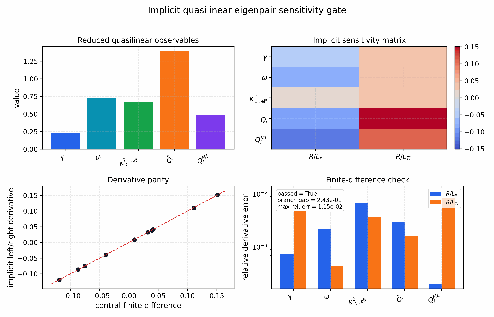

The lower panels compare the implicit left/right derivative against central
finite differences that follow the nearest isolated eigenvalue branch. The
tracked artifact passes with maximum relative derivative error around
``1.2e-2`` and branch gap around ``2.4e-1``. Those values are stored in
``docs/_static/quasilinear_implicit_sensitivity.json`` so documentation figures
and tests use the same audit payload.

The manuscript-level validation plan adds nonlinear calibration and holdout
studies across axisymmetric and stellarator cases before making absolute
transport-prediction claims. The model and calibration policy follows the
quasilinear derivation and saturation-rule validation philosophy in
[Stephens21]_ and [Parker23]_.

Calibration reports
-------------------

Calibration artifacts should use ``spectraxgk.quasilinear_calibration`` so
training, holdout, and audit points carry the same schema. A report is promoted
to ``calibrated_absolute_flux`` only when it contains at least one training
point, at least one holdout point, and the holdout mean-relative-error gate
passes. Otherwise the claim is demoted to ``calibration_dataset`` or
``training_or_audit_only``. This keeps README, docs, and manuscript figures from
claiming absolute nonlinear transport prediction from an uncalibrated
saturation rule.

Existing nonlinear window summaries can be converted into calibration points
with ``calibration_point_from_nonlinear_window_summary`` when the summary points
to either a diagnostics CSV or a SPECTRAX-GK runtime NetCDF file. CSV inputs use
the ``t`` column and the selected heat-flux column, usually ``heat_flux``.
NetCDF inputs use ``Grids/time`` and map ``heat_flux`` to
``Diagnostics/HeatFlux_st``; ``heat_flux_es``, ``heat_flux_apar``, and
``heat_flux_bpar`` map to the corresponding ``Diagnostics/HeatFlux*_st``
variables. Species are summed by default for NetCDF variables with shape
``(time, species)``; pass ``--species-index`` to the report builder when an
ion-only or electron-only nonlinear target is needed. The helper uses the
summary's ``tmin``/``tmax`` window when present, otherwise the full finite time
range, and records the mean and standard deviation of the selected heat-flux
observable.

.. code-block:: bash

   python tools/build_quasilinear_calibration_report.py \
     --points docs/_static/quasilinear_calibration_points.json \
     --out docs/_static/quasilinear_calibration_report.json \
     --saturation-rule mixing_length

The first tracked audit point maps the Cyclone quasilinear spectrum above to
the long-window nonlinear Cyclone heat-flux diagnostic. It is intentionally an
``audit`` point, not a calibrated transport claim:

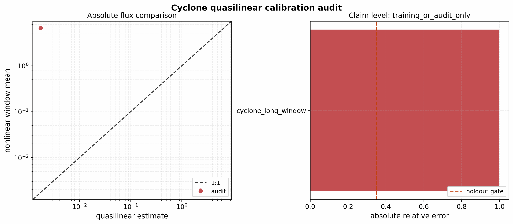

With ``C_sat = 1`` the simple mixing-length rule underpredicts the absolute
nonlinear heat flux by orders of magnitude. This is the expected outcome for an
uncalibrated saturation rule and is precisely why the report remains at
``training_or_audit_only``. A paper-level absolute-flux claim requires a
documented training set, held-out nonlinear cases, and passed holdout gates.

The same report can also be generated directly from a quasilinear spectrum and
a nonlinear gate summary:

.. code-block:: bash

   python tools/build_quasilinear_calibration_report.py \
     --spectrum docs/_static/quasilinear_cyclone_spectrum_scan.quasilinear_spectrum.csv \
     --nonlinear-summary docs/_static/nonlinear_cyclone_gate_summary.json \
     --split audit \
     --case cyclone_long_window \
     --geometry cyclone \
     --electron-model adiabatic \
     --saturation-rule mixing_length \
     --out docs/_static/quasilinear_cyclone_calibration_audit_report.json

   python tools/plot_quasilinear_calibration.py \
     --report docs/_static/quasilinear_cyclone_calibration_audit_report.json \
     --out docs/_static/quasilinear_cyclone_calibration_audit.png

Train/holdout transfer
----------------------

The first geometry-transfer gate fits a single multiplicative heat-flux scale
on the Cyclone long-window nonlinear diagnostic and holds out the Cyclone
Miller nonlinear window. This is the minimal one-constant calibration expected
of a simple mixing-length saturation rule: if it fails, the missing ingredient
is not just a constant ``C_sat``.

.. image:: _static/quasilinear_cyclone_miller_train_holdout.png
   :alt: Quasilinear train/holdout calibration from Cyclone to Cyclone Miller
   :width: 100%

The tracked report is ``calibration_dataset`` and ``passed = false``. The
Cyclone-fitted scale is ``C_sat = 3839.966`` for the current normalization, but
the held-out Cyclone Miller error is much larger than the ``0.35`` mean
relative gate. That failure is retained as a manuscript-facing result: it
demonstrates that the implemented linear weights and nonlinear-window ingestion
are working, while a transferable saturation model remains an open research
task.

The report is generated with:

.. code-block:: bash

   python tools/build_quasilinear_calibration_report.py \
     --points docs/_static/quasilinear_cyclone_miller_train_holdout_points.json \
     --fit-train-scale \
     --out docs/_static/quasilinear_cyclone_miller_train_holdout_report.json

   python tools/plot_quasilinear_calibration.py \
     --report docs/_static/quasilinear_cyclone_miller_train_holdout_report.json \
     --out docs/_static/quasilinear_cyclone_miller_train_holdout.png

Non-axisymmetric HSX holdout
----------------------------

The first non-axisymmetric quasilinear calibration audit uses the same HSX
adiabatic-electron ITG setup as the tracked nonlinear window gate. The linear
quasilinear spectrum is generated from the checked-in VMEC equilibrium:

.. code-block:: bash

   spectraxgk scan-runtime-linear \
     --config examples/linear/non-axisymmetric/runtime_hsx_linear_quasilinear.toml \
     --ky-values 0.047619047619047616,0.09523809523809523,0.14285714285714285,0.19047619047619047,0.23809523809523808,0.2857142857142857 \
     --Nl 4 --Nm 8 --solver time --dt 0.005 --steps 400 \
     --quasilinear \
     --out docs/_static/quasilinear_hsx_spectrum_scan \
     --no-progress

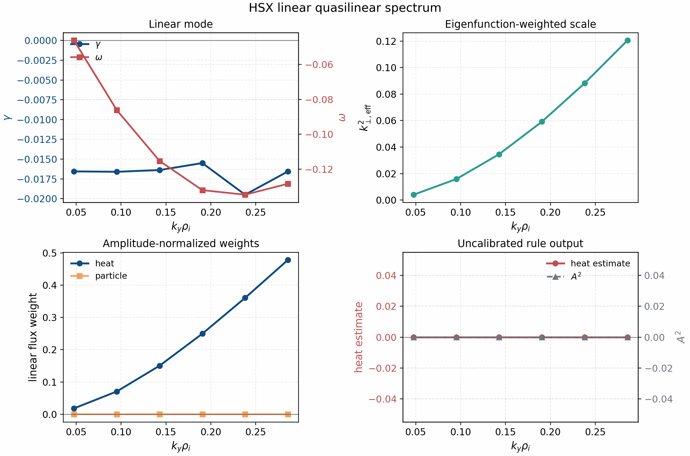

All scanned HSX branches in this short linear spectrum are stable under the
current ``gamma_floor = 0`` mixing-length rule, so the uncalibrated saturated
heat-flux estimate is exactly zero even though the nonlinear HSX heat-flux
window is finite. This is a useful negative result: it shows that the current
one-constant mixing-length rule is not a transferable stellarator transport
model and that branch coverage/saturation physics must be improved before
absolute stellarator quasilinear-flux claims.

The combined Cyclone-train, Cyclone-Miller-holdout, and HSX-holdout report is
generated with:

.. code-block:: bash

   python tools/build_quasilinear_calibration_report.py \
     --points docs/_static/quasilinear_cyclone_miller_train_holdout_points.json \
     --spectrum docs/_static/quasilinear_hsx_spectrum_scan.quasilinear_spectrum.csv \
     --nonlinear-summary docs/_static/nonlinear_hsx_gate_summary.json \
     --split holdout \
     --case hsx_nonlinear_window \
     --geometry hsx \
     --electron-model adiabatic \
     --fit-train-scale \
     --out docs/_static/quasilinear_hsx_train_holdout_report.json

   python tools/plot_quasilinear_calibration.py \
     --report docs/_static/quasilinear_hsx_train_holdout_report.json \
     --out docs/_static/quasilinear_hsx_train_holdout.png

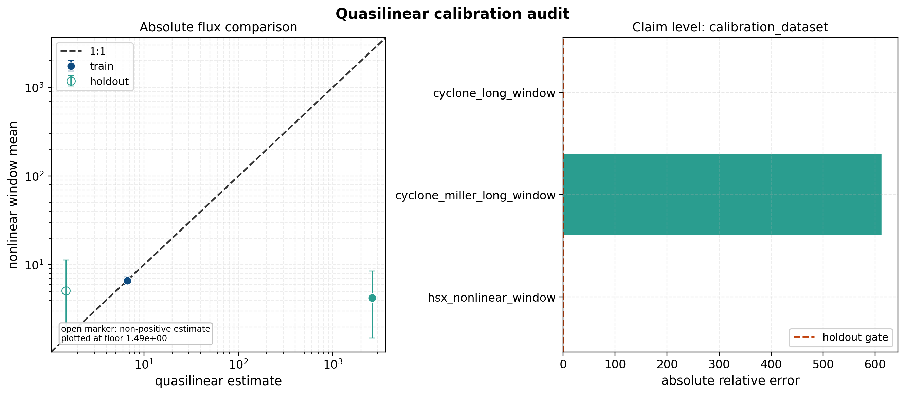

The report remains ``calibration_dataset`` and ``passed = false``. In the
absolute-flux panel, open markers denote non-positive quasilinear estimates that
are plotted at the documented log-axis floor. The HSX point has a finite
nonlinear heat-flux window mean but zero current mixing-length prediction, so
the relative error is one by construction.

W7-X NetCDF nonlinear-window path
---------------------------------

W7-X uses the same calibration machinery, but the tracked nonlinear window is a
runtime NetCDF file rather than a diagnostics CSV. The report builder therefore
uses the NetCDF ingestion path described above. A reproducible linear
quasilinear spectrum should be generated from a VMEC source, not from an
ignored local ``tools_out/*.eik.nc`` file:

.. code-block:: bash

   export W7X_VMEC_FILE=/path/to/wout_w7x.nc
   spectraxgk scan-runtime-linear \
     --config examples/linear/non-axisymmetric/runtime_w7x_linear_quasilinear_vmec.toml \
     --ky-values 0.047619047619047616,0.09523809523809523,0.14285714285714285,0.19047619047619047,0.23809523809523808,0.2857142857142857 \
     --Nl 4 --Nm 8 --solver time --dt 0.005 --steps 400 \
     --quasilinear \
     --out docs/_static/quasilinear_w7x_spectrum_scan \
     --no-progress

The tracked W7-X spectrum artifact was generated from the W7-X benchmark VMEC
equilibrium available on the office machine at
``/home/rjorge/gx_refs/main_clean_20260312/nonlinear/w7x/wout_w7x.nc``. The
equilibrium itself is not shipped in the repository, so users who want to
regenerate the artifact must point ``W7X_VMEC_FILE`` at an equivalent W7-X VMEC
file.

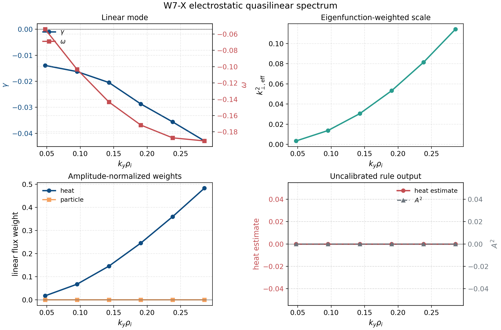

All six short-window W7-X linear branches in the tracked electrostatic
adiabatic-electron scan are stable under the current ``gamma_floor = 0`` rule.
As for HSX, this makes the uncalibrated saturated mixing-length flux zero even
though the nonlinear heat-flux window is finite. The W7-X nonlinear NetCDF
window is added to the same train/holdout report with:

.. code-block:: bash

   python tools/build_quasilinear_calibration_report.py \
     --points docs/_static/quasilinear_cyclone_miller_train_holdout_points.json \
     --spectrum docs/_static/quasilinear_w7x_spectrum_scan.quasilinear_spectrum.csv \
     --nonlinear-summary docs/_static/nonlinear_w7x_gate_summary.json \
     --split holdout \
     --case w7x_nonlinear_window \
     --geometry w7x \
     --electron-model adiabatic \
     --fit-train-scale \
     --out docs/_static/quasilinear_w7x_train_holdout_report.json

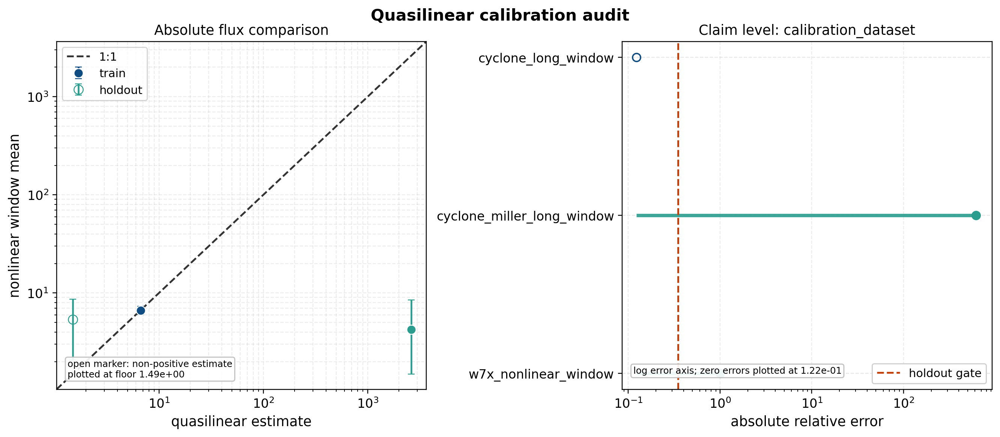

The report remains ``calibration_dataset`` and ``passed = false``. The
Cyclone-fitted one-constant rule overpredicts Cyclone Miller, while the W7-X
stable branches underpredict the finite nonlinear window by construction. This
is retained as a negative absolute-flux result and should not be presented as a
validated W7-X transport model.

The normalized W7-X spectrum-shape gate does pass when the linear
heat-flux-weight distribution is compared with the resolved nonlinear
``HeatFlux_kyst`` spectrum from the NetCDF output:

.. code-block:: bash

   python tools/plot_quasilinear_spectrum_shape_gate.py \
     --spectrum docs/_static/quasilinear_w7x_spectrum_scan.quasilinear_spectrum.csv \
     --nonlinear tools_out/final_nonlinear_audit/w7x_spectrax_current_adaptive_t200.out.nc \
     --out docs/_static/quasilinear_w7x_spectrum_shape_gate.png \
     --ql-column heat_flux_weight_total \
     --nonlinear-variable Diagnostics/HeatFlux_kyst \
     --tv-gate 0.2 \
     --cosine-gate 0.95 \
     --title "W7-X quasilinear/nonlinear ky-spectrum shape gate"

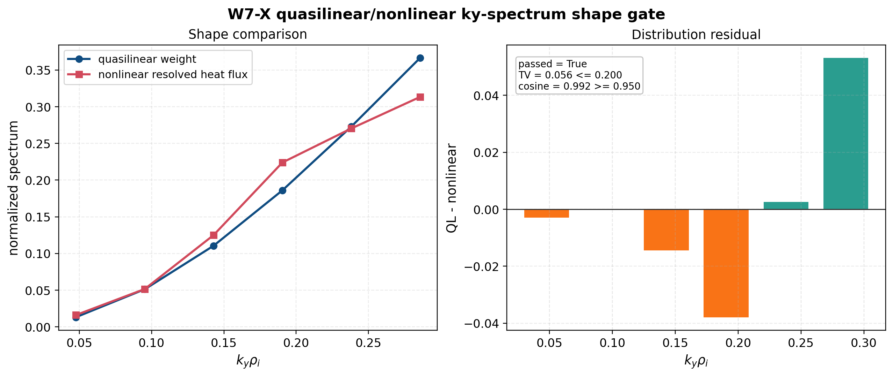

The tracked W7-X shape gate passes with total-variation distance about
``0.056`` and cosine similarity about ``0.992``. This supports the
linear-spectrum shape diagnostic for W7-X under the current setup, while the
absolute saturated-flux model remains rejected by the train/holdout report.

The same HSX artifacts also close the first real spectrum-shape gate. This gate
does **not** use the saturated flux, because the current stable-branch
mixing-length rule would erase the spectrum. Instead it compares the normalized
linear heat-flux-weight spectrum against the normalized nonlinear
``HeatFlux_kyst`` spectrum averaged over the resolved nonlinear diagnostics:

.. code-block:: bash

   python tools/plot_quasilinear_spectrum_shape_gate.py \
     --spectrum docs/_static/quasilinear_hsx_spectrum_scan.quasilinear_spectrum.csv \
     --nonlinear tools_out/final_nonlinear_audit/hsx_nonlinear_t50.out.nc \
     --out docs/_static/quasilinear_hsx_spectrum_shape_gate.png \
     --ql-column heat_flux_weight_total \
     --nonlinear-variable Diagnostics/HeatFlux_kyst \
     --time-max 49.2 \
     --tv-gate 0.2 \
     --cosine-gate 0.95 \
     --title "HSX quasilinear/nonlinear ky-spectrum shape gate"

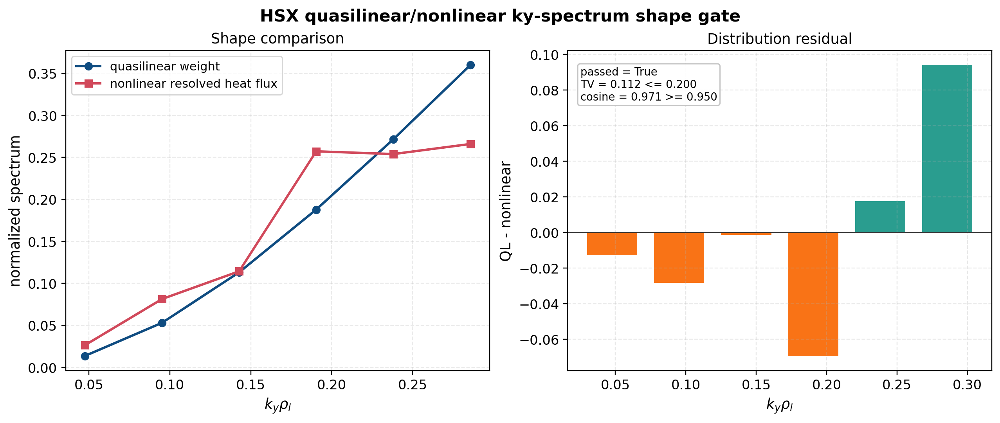

The tracked HSX shape gate passes with total-variation distance about ``0.11``
and cosine similarity about ``0.97``. This supports the linear spectrum-shape
diagnostic while still rejecting any absolute saturated-flux claim from the
current uncalibrated rule.

Axisymmetric spectrum-shape gates
---------------------------------

The same spectrum-shape extraction is also tracked for the electrostatic
axisymmetric adiabatic-electron nonlinear windows. These gates compare only the
normalized ``ky`` distribution of the linear heat-flux weight against the
resolved nonlinear ``HeatFlux_kyst`` spectrum. They do not test the absolute
mixing-length heat-flux level.

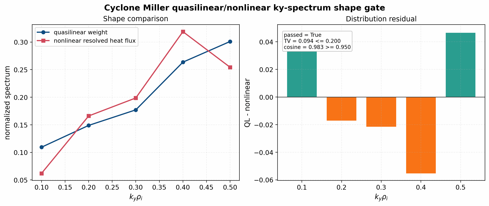

Cyclone Miller passes the initial shape gate with total-variation distance
about ``0.094`` and cosine similarity about ``0.983``. This is a useful positive
gate: the linear heat-flux-weight spectrum and the resolved nonlinear heat-flux
spectrum place comparable weight across the scanned ``ky`` range under the
current window.

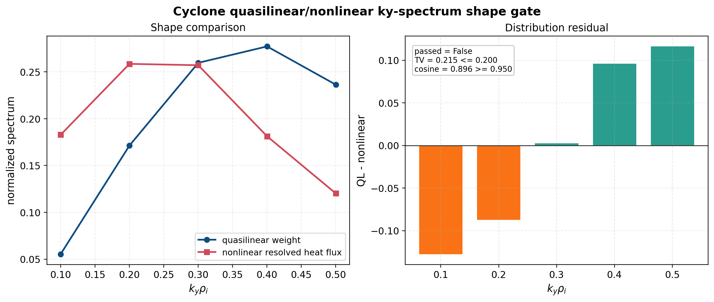

The long-window Cyclone shape gate is intentionally retained as a failed gate:
it gives total-variation distance about ``0.215`` and cosine similarity about
``0.896`` against the current ``TV <= 0.2`` and ``cosine >= 0.95`` criteria.
The mismatch is concentrated in the low- and high-``ky`` tails, which points to
a saturation/intensity-model limitation or a window/branch-selection issue
rather than a failed file-ingestion path. This is a paper-facing negative
result and should guide the next quasilinear saturation-model sweep.

KBM is not included in the current spectrum-shape quasilinear gate because the
tracked KBM validation lane is electromagnetic, while the implemented
quasilinear diagnostic currently validates only electrostatic field channels.
KBM should enter this section only after electromagnetic quasilinear weights
for ``A_parallel`` and ``B_parallel`` have independent normalization and
finite-difference/linear-diagnostic gates.
