Quasilinear Transport
=====================

SPECTRAX-GK can compute quasilinear transport diagnostics from a linear
eigenstate or late-time linear state. The implementation deliberately separates
the exact linear diagnostic from any saturation model:

* **linear weights** are amplitude-normalized heat and particle fluxes computed
  with the same diagnostic kernels used by runtime simulations;
* **saturation rules** are named, serialized model assumptions that convert a
  linear mode into a trend-level saturated estimate;
* **calibrated absolute flux claims** require nonlinear training and holdout
  validation and should not be inferred from the uncalibrated rules alone.

Current validated scope
-----------------------

The current implementation supports electrostatic channels only:

.. code-block:: toml

   [quasilinear]
   enabled = true
   mode = "weights"
   saturation_rule = "none"
   amplitude_normalization = "phi_rms"
   kperp_average = "phi_weighted"
   channels = ["es"]

The diagnostic writes:

* ``*.quasilinear.summary.json`` with growth rate, frequency, normalization,
  ``kperp_eff2``, species weights, and saturation metadata;
* ``*.quasilinear_species.csv`` with species-resolved heat and particle flux
  weights and, when requested, saturated estimates.
* ``*.quasilinear_spectrum.csv`` for serial ``scan-runtime-linear`` runs with
  quasilinear diagnostics enabled.

For linked-boundary or imported-geometry scans, ``*.quasilinear_spectrum.csv``
stores two perpendicular-mode coordinates: ``ky`` is the requested scan
coordinate used for ordering and plotting, while ``mode_ky`` is the selected
signed grid-mode coordinate used internally by the linear solve. This prevents
negative-branch aliases from corrupting publication spectra while preserving
the exact selected mode metadata.

Literature anchors and claim policy
-----------------------------------

The SPECTRAX-GK quasilinear layer follows the same separation used in modern
reduced gyrokinetic transport workflows:

* the linear gyrokinetic eigenproblem determines growth rates, frequencies,
  eigenfunctions, cross-phases, and species-resolved flux weights;
* a separate saturation rule converts those linear quantities into fluctuation
  amplitudes;
* nonlinear simulations or experimental transport databases are required before
  claiming calibrated absolute fluxes.

This separation is central to early nonlinear tests of quasilinear transport
models [Waltz09]_, to the QuaLiKiz derivation [Stephens21]_, to profile-
evolution use cases [Citrin17]_, and to broader quasilinear-model validation
reviews [Staebler24]_. Parker et al. [Parker23]_ show why saturation rules must
be treated as model assumptions rather than consequences of the linear solve
alone. SAT3 [Dudding22]_ and SAT3-NN [Sar26]_ are useful longer term targets
because they use spectrum-aware, database-calibrated saturation information
instead of a single uncalibrated mixing-length constant.

For stellarator optimization, SPECTRAX-GK currently treats quasilinear fluxes as
research diagnostics and optimization proxies, following the microstability
optimization motivation in [Jorge24]_. The present release does **not** claim a
validated absolute nonlinear flux predictor: the first Cyclone-to-Cyclone-Miller
train/holdout gate deliberately fails, and that failure is preserved as a
model-development constraint.

Executable usage
----------------

.. code-block:: bash

   spectraxgk run-runtime-linear \
     --config examples/linear/axisymmetric/runtime_cyclone_quasilinear.toml \
     --out tools_out/cyclone_quasilinear

or enable the diagnostic for another linear runtime TOML:

.. code-block:: bash

   spectraxgk run-runtime-linear \
     --config examples/linear/axisymmetric/runtime_cyclone.toml \
     --quasilinear \
     --ql-mode saturated \
     --ql-saturation-rule mixing_length \
     --ql-normalization phi_rms \
     --ql-csat 1.0 \
     --out tools_out/cyclone_quasilinear

For a ``ky`` spectrum, use the independent-scan path. ``--workers`` can
parallelize the per-``ky`` linear solves and quasilinear state extraction while
preserving the serial ordering of the output spectrum:

.. code-block:: bash

   spectraxgk scan-runtime-linear \
     --config examples/linear/axisymmetric/runtime_cyclone_quasilinear.toml \
     --ky-values 0.1,0.2,0.3,0.4 \
     --quasilinear \
     --workers 2 \
     --out tools_out/cyclone_quasilinear_scan

Then render the spectrum:

.. code-block:: bash

   python tools/plot_quasilinear_spectrum.py \
     --spectrum tools_out/cyclone_quasilinear_scan.quasilinear_spectrum.csv \
     --out docs/_static/quasilinear_cyclone_spectrum.png

The shipped worker-identity gate for this path is generated with:

.. code-block:: bash

   JAX_ENABLE_X64=1 python tools/generate_quasilinear_runtime_parallel_gate.py \
     --workers 2 \
     --ky 0.1 0.2 \
     --out-prefix docs/_static/quasilinear_runtime_parallel_gate

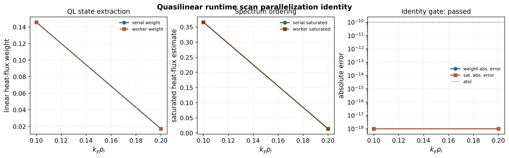

   Serial and worker-parallel ``scan-runtime-linear`` quasilinear spectra from
   the same runtime configuration. The gate checks ordered state-extraction
   identity for the linear heat-flux weight and the saturated heat-flux
   estimate; any timing metadata is reported for engineering tracking only,
   not as a production speedup claim.

The shaped-tokamak Miller companion uses the same pattern, with the positive
``ky`` range resolved by the nonlinear run's ``Ny=64`` grid:

.. code-block:: bash

   spectraxgk scan-runtime-linear \
     --config examples/linear/axisymmetric/runtime_cyclone_miller_quasilinear.toml \
     --ky-values 0.1,0.2,0.3,0.4,0.5 \
     --quasilinear \
     --out docs/_static/quasilinear_cyclone_miller_spectrum_scan

.. image:: _static/quasilinear_cyclone_miller_spectrum.png
   :alt: Cyclone Miller quasilinear spectrum
   :width: 100%

Model details
-------------

Linear eigenproblem
^^^^^^^^^^^^^^^^^^^

For a fixed flux-tube geometry and perpendicular mode, the linear runtime solves
the matrix-free system

.. math::

   \frac{\partial G}{\partial t} = \mathcal{L}(\mathbf{p}) G,
   \qquad
   \mathcal{L} v_j = \lambda_j v_j,

where ``G`` is the Hermite-Laguerre gyrocenter moment state, ``v_j`` is a right
eigenvector, and

.. math::

   \lambda_j = \gamma_j - i\omega_j.

The sign convention above matches the runtime output: ``gamma`` is the growth
rate and ``omega`` is the physical mode frequency reported by the executable.
The operator is assembled by :mod:`spectraxgk.linear`,
:mod:`spectraxgk.terms.assembly`, and the individual term modules under
:mod:`spectraxgk.terms`.

Field solve and linear weights
^^^^^^^^^^^^^^^^^^^^^^^^^^^^^^

Given a linear state ``G``, SPECTRAX-GK first reconstructs fields with
``compute_fields_cached``. In the currently validated electrostatic path the
quasilinear diagnostic uses ``phi`` and sets ``A_parallel = B_parallel = 0``.
Electromagnetic quasilinear channels remain disabled until the field-channel
normalization and nonlinear-calibration gates are complete.

The species heat and particle weights are computed with the same diagnostic
kernels used for nonlinear runtime outputs. For the electrostatic heat-flux
channel, the code contracts the radial ``E x B`` velocity factor with the
Hermite-Laguerre pressure moment:

.. math::

   v_{E,x,k} = i k_y \phi_k,

.. math::

   \overline{p}_{s,k} =
   \sum_\ell \left(J_{\ell s}^{(\mathrm{fac})} G_{\ell,0,s,k}
   + \frac{1}{\sqrt{2}} J_{\ell s} G_{\ell,2,s,k}\right),

.. math::

   Q_{s,k}^{(\mathrm{ES})} =
   \Re\left[v_{E,x,k}^* \overline{p}_{s,k}\right] W_k.

Here ``W_k`` includes the positive-ky Hermitian factor, the dealias mask, the
flux-surface Jacobian/``grad rho`` weight, species density/temperature factors,
and the selected diagnostic flux scale. The particle-flux channel uses the
density moment

.. math::

   \overline{n}_{s,k} = \sum_\ell J_{\ell s} G_{\ell,0,s,k},
   \qquad
   \Gamma_{s,k}^{(\mathrm{ES})} =
   \Re\left[v_{E,x,k}^* \overline{n}_{s,k}\right] W_{\Gamma,k},

but it is zero for the one-ion adiabatic-electron cases because there is no
kinetic electron species carrying particle transport. The implemented formulas
live in :func:`spectraxgk.diagnostics.gx_heat_flux_species`,
:func:`spectraxgk.diagnostics.gx_particle_flux_species`, and
``_gx_heat_flux_channel_contrib_species`` in
:mod:`spectraxgk.diagnostics`.

Amplitude normalization and effective scale
^^^^^^^^^^^^^^^^^^^^^^^^^^^^^^^^^^^^^^^^^^^

The implemented effective perpendicular scale is

.. math::

   k_{\perp,\mathrm{eff}}^2 =
   \frac{\langle k_\perp^2 |\phi|^2 \rangle}
        {\langle |\phi|^2 \rangle},

where the average uses the runtime spectral and flux-tube volume weights. Heat
and particle flux weights are divided by the selected amplitude normalization,
making them invariant under eigenfunction phase rotations and amplitude
rescalings.

The normalized linear weights are therefore

.. math::

   \widehat{Q}_{s} =
   \frac{\sum_k Q_{s,k}^{(\mathrm{ES})}}{\mathcal{N}_\phi},
   \qquad
   \widehat{\Gamma}_{s} =
   \frac{\sum_k \Gamma_{s,k}^{(\mathrm{ES})}}{\mathcal{N}_\phi}.

The default normalization is

.. math::

   \mathcal{N}_\phi =
   \sum_{k_x,k_y,z} w_{k_x,k_y,z} |\phi_{k_x,k_y}(z)|^2,

with the same Hermitian and flux-tube weights used by
:func:`spectraxgk.quasilinear.spectral_phi_weights`.

Supported amplitude normalizations are:

* ``phi_rms``: weighted ``|\phi|^2`` average;
* ``phi_midplane``: maximum midplane ``|\phi|^2``;
* ``field_energy``: electrostatic field-energy normalization.

Supported saturation rules are:

* ``none``: write linear weights only;
* ``mixing_length``: ``A^2 = C_sat max(gamma - gamma_floor, 0) / kperp_eff2``;
* ``lapillonne_2011``: currently the same audited scaling contract as
  ``mixing_length`` until the broader model-specific validation suite is added.
* ``linear_weight``: ``A^2 = C_sat``. This is a diagnostic intensity rule used
  to test whether the linear flux-weight spectrum alone transfers across
  geometries.
* ``absolute_growth_mixing_length``: ``A^2 = C_sat |gamma| / kperp_eff2``.
  This gives stable short-window branches nonzero diagnostic intensity and is
  included only for saturation-model stress tests, not as a validated physical
  rule.

The current mixing-length output is

.. math::

   A_k^2 =
   C_{\mathrm{sat}}\,
   \frac{\max(\gamma_k-\gamma_{\mathrm{floor}},0)}
        {k_{\perp,\mathrm{eff},k}^2},

.. math::

   Q_{s,k}^{(\mathrm{sat})} = A_k^2 \widehat{Q}_{s,k},
   \qquad
   \Gamma_{s,k}^{(\mathrm{sat})} = A_k^2 \widehat{\Gamma}_{s,k}.

This is intentionally the simplest possible baseline. It is useful for
software validation and sensitivity studies, but Parker-style saturation-rule
comparisons [Parker23]_, SAT3/SAT3-NN-style spectrum-aware rules
[Dudding22]_ [Sar26]_, and nonlinear holdout tests are required before it can
be used as a predictive absolute-flux model.

The reduced objective helper
``spectraxgk.quasilinear.quasilinear_feature_objective`` supports the same
diagnostic rules for differentiability tests from feature vectors
``[gamma, kperp_eff2, flux_weight]``. The fast suite checks the resulting
Jacobians against central finite differences before these objectives are used
in optimization examples.

Implementation map
------------------

.. list-table::
   :header-rows: 1

   * - Layer
     - Source
     - Responsibility
   * - Quasilinear weights
     - :mod:`spectraxgk.quasilinear`
     - phase/amplitude-invariant ``k_perp`` scale, heat and particle weights,
       and saturated outputs
   * - Diagnostic kernels
     - :mod:`spectraxgk.diagnostics`
     - heat, particle, field-energy, volume-factor, and resolved flux
       contractions shared by linear and nonlinear paths
   * - Runtime plumbing
     - :mod:`spectraxgk.runtime`, :mod:`spectraxgk.runtime_artifacts`
     - single-run and scan execution, TOML/executable overrides, JSON/CSV
       artifact writing
   * - Input schema
     - :mod:`spectraxgk.runtime_config`, :mod:`spectraxgk.io`
     - ``[quasilinear]`` configuration and round-trip serialization
   * - Calibration reports
     - :mod:`spectraxgk.quasilinear_calibration`
     - train/holdout/audit schemas, nonlinear-window ingestion, scale fitting,
       and report scoring
   * - Plotting tools
     - ``tools/plot_quasilinear_spectrum.py`` and
       ``tools/plot_quasilinear_calibration.py``
     - publication-facing spectrum and calibration figures
   * - Differentiability gates
     - :mod:`spectraxgk.autodiff_validation`
     - finite-difference checks, covariance diagnostics, dense operator
       fixtures, and implicit isolated-eigenpair sensitivities

Algorithmic workflow
--------------------

For one linear mode:

.. code-block:: text

   build grid, geometry, species, and linear cache
   solve the linear eigenproblem or fit the late-time linear state
   reconstruct phi from the eigenvector/state
   compute kperp_eff2 from |phi|^2 weights
   compute heat and particle flux contractions using runtime diagnostic kernels
   divide by the requested amplitude normalization
   optionally apply a named saturation rule
   write summary JSON and species CSV artifacts

For a serial ``ky`` scan:

.. code-block:: text

   for requested ky in ky_values:
       select the closest grid mode
       run the single-mode linear solve
       compute quasilinear payload
       store requested ky and selected signed mode_ky
   write *.scan.csv and *.quasilinear_spectrum.csv

For nonlinear calibration:

.. code-block:: text

   integrate or load nonlinear diagnostic CSV over a declared time window
   integrate/sum the linear quasilinear spectrum
   create train, holdout, or audit calibration points
   optionally fit one multiplicative scale on train points only
   score holdout points against an explicit mean-relative-error gate

Numerics and differentiability
------------------------------

SPECTRAX-GK production linear solves remain matrix-free. Dense matrices are
only materialized in tiny validation fixtures through
:func:`spectraxgk.autodiff_validation.explicit_complex_operator_matrix`.

Eigenvalue sensitivities use JAX derivatives of the matrix entries and the
standard isolated-branch relation

.. math::

   \frac{\partial \lambda}{\partial p_i}
   =
   w^\dagger
   \frac{\partial \mathcal{L}}{\partial p_i}
   v,
   \qquad
   w^\dagger v = 1,

where ``v`` and ``w`` are right and left eigenvectors. Eigenfunction-dependent
observables use the implicit perturbation system

.. math::

   \begin{bmatrix}
   \mathcal{L} - \lambda I & -v \\
   w^\dagger & 0
   \end{bmatrix}
   \begin{bmatrix}
   \partial_i v \\
   \partial_i \lambda
   \end{bmatrix}
   =
   \begin{bmatrix}
   -(\partial_i \mathcal{L})v \\
   0
   \end{bmatrix}.

The gauge condition ``w^\dagger \partial_i v = 0`` makes the derivative unique
for phase-invariant observables. This path is now tested on a tiny
SPECTRAX-GK linear-RHS fixture and compared against nearest-branch central
finite differences. Direct JAX differentiation through non-Hermitian
eigenvectors is
still explicitly guarded because JAX does not provide that JVP; the implicit
path is the supported validation route.

Validation gates
----------------

The fast test suite currently checks:

* TOML and executable plumbing for ``[quasilinear]``;
* phase and amplitude invariance of the linear weights;
* explicit rejection of unvalidated electromagnetic channels;
* artifact serialization for summary and species tables;
* a small Krylov runtime smoke test.
* autodiff-vs-finite-difference and tangent checks for the reduced
  mixing-length objective ``[gamma, kperp_eff2, flux_weight]``.
* branch-isolated eigenvalue AD-vs-finite-difference checks, which are the
  lightweight gate used before differentiating full linear growth/frequency
  outputs.
* a tiny dense SPECTRAX-GK linear-RHS fixture that materializes the otherwise
  matrix-free operator, disables the production custom-VJP field solve for
  forward-mode validation, and checks an isolated eigenvalue derivative against
  central finite differences.
* an explicit guard showing that direct JAX differentiation through
  non-Hermitian eigenvectors is unsupported;
* an implicit left/right eigenpair sensitivity gate for phase-invariant
  eigenfunction observables, including a tiny SPECTRAX-GK linear-RHS
  quasilinear-style objective checked against finite differences.

Implicit sensitivity example
^^^^^^^^^^^^^^^^^^^^^^^^^^^^

The user-facing example
``examples/theory_and_demos/quasilinear_implicit_sensitivity.py`` applies the
implicit gate to a tiny Cyclone linear-RHS fixture. The differentiated
observable is

.. math::

   \mathbf{y}
   =
   \left[
   \gamma,\,
   \omega,\,
   k_{\perp,\mathrm{eff}}^2,\,
   \widehat{Q}_i,\,
   Q_i^{(\mathrm{ML})}
   \right],

where ``Q_i^(ML)`` is the uncalibrated mixing-length heat-flux proxy computed
from the linear heat-flux weight. The parameter vector is
``[R/L_n, R/L_Ti]``. The goal is not to claim nonlinear-flux prediction from
this tiny fixture; the goal is to verify that a phase-invariant quasilinear
observable can be differentiated through an isolated non-Hermitian eigenbranch
without relying on unsupported JAX eigenvector derivatives.

.. code-block:: bash

   python examples/theory_and_demos/quasilinear_implicit_sensitivity.py \
     --outdir docs/_static

.. image:: _static/quasilinear_implicit_sensitivity.png
   :alt: Implicit quasilinear eigenpair sensitivity validation
   :width: 100%

The lower panels compare the implicit left/right derivative against central
finite differences that follow the nearest isolated eigenvalue branch. The
tracked artifact passes with maximum relative derivative error around
``1.2e-2`` and branch gap around ``2.4e-1``. Those values are stored in
``docs/_static/quasilinear_implicit_sensitivity.json`` so documentation figures
and tests use the same audit payload.

The manuscript-level validation plan adds nonlinear calibration and holdout
studies across axisymmetric and stellarator cases before making absolute
transport-prediction claims. The model and calibration policy follows the
quasilinear derivation and saturation-rule validation philosophy in
[Stephens21]_ and [Parker23]_.

Calibration reports
-------------------

Calibration artifacts should use ``spectraxgk.quasilinear_calibration`` so
training, holdout, and audit points carry the same schema. A report is promoted
to ``calibrated_absolute_flux`` only when it contains at least one training
point, at least one holdout point, and the holdout mean-relative-error gate
passes. Otherwise the claim is demoted to ``calibration_dataset`` or
``training_or_audit_only``. This keeps README, docs, and manuscript figures from
claiming absolute nonlinear transport prediction from an uncalibrated
saturation rule.

Train and holdout points must also be tied to a passed nonlinear validation
gate before they can be used in calibration. The audit tool
``tools/check_quasilinear_calibration_inputs.py`` enforces that rule by matching
each point's ``nonlinear_artifact`` to tracked nonlinear gate metadata. It
passes for the current Cyclone, Cyclone Miller, HSX, W7-X, and D-shaped
external-VMEC calibration
inputs, and it would fail if an exploratory or non-converged pilot such as the
CTH-like external-VMEC feasibility trace were inserted as a train/holdout
point.

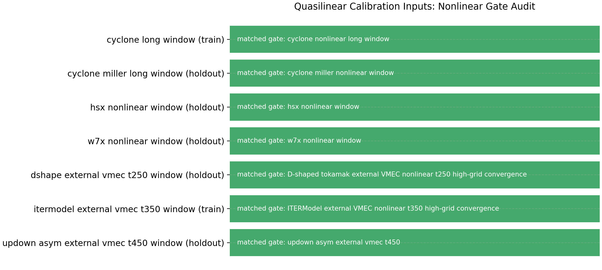

Existing nonlinear window summaries can be converted into calibration points
with ``calibration_point_from_nonlinear_window_summary`` when the summary points
to either a diagnostics CSV or a SPECTRAX-GK runtime NetCDF file. CSV inputs use
the ``t`` column and the selected heat-flux column, usually ``heat_flux``.
NetCDF inputs use ``Grids/time`` and map ``heat_flux`` to
``Diagnostics/HeatFlux_st``; ``heat_flux_es``, ``heat_flux_apar``, and
``heat_flux_bpar`` map to the corresponding ``Diagnostics/HeatFlux*_st``
variables. Species are summed by default for NetCDF variables with shape
``(time, species)``; pass ``--species-index`` to the report builder when an
ion-only or electron-only nonlinear target is needed. The helper uses the
summary's ``tmin``/``tmax`` window when present, otherwise the full finite time
range, and records the mean and standard deviation of the selected heat-flux
observable.

.. code-block:: bash

   python tools/build_quasilinear_calibration_report.py \
     --points docs/_static/quasilinear_calibration_points.json \
     --out docs/_static/quasilinear_calibration_report.json \
     --saturation-rule mixing_length

The first tracked audit point maps the Cyclone quasilinear spectrum above to
the long-window nonlinear Cyclone heat-flux diagnostic. It is intentionally an
``audit`` point, not a calibrated transport claim:

.. image:: _static/quasilinear_cyclone_calibration_audit.png
   :alt: Cyclone quasilinear calibration audit against nonlinear heat flux
   :width: 100%

With ``C_sat = 1`` the simple mixing-length rule underpredicts the absolute
nonlinear heat flux by orders of magnitude. This is the expected outcome for an
uncalibrated saturation rule and is precisely why the report remains at
``training_or_audit_only``. A paper-level absolute-flux claim requires a
documented training set, held-out nonlinear cases, and passed holdout gates.

The same report can also be generated directly from a quasilinear spectrum and
a nonlinear gate summary:

.. code-block:: bash

   python tools/build_quasilinear_calibration_report.py \
     --spectrum docs/_static/quasilinear_cyclone_spectrum_scan.quasilinear_spectrum.csv \
     --nonlinear-summary docs/_static/nonlinear_cyclone_gate_summary.json \
     --split audit \
     --case cyclone_long_window \
     --geometry cyclone \
     --electron-model adiabatic \
     --saturation-rule mixing_length \
     --out docs/_static/quasilinear_cyclone_calibration_audit_report.json

   python tools/plot_quasilinear_calibration.py \
     --report docs/_static/quasilinear_cyclone_calibration_audit_report.json \
     --out docs/_static/quasilinear_cyclone_calibration_audit.png

Train/holdout transfer
----------------------

The first geometry-transfer gate fits a single multiplicative heat-flux scale
on the Cyclone long-window nonlinear diagnostic and holds out the Cyclone
Miller nonlinear window. This is the minimal one-constant calibration expected
of a simple mixing-length saturation rule: if it fails, the missing ingredient
is not just a constant ``C_sat``.

.. image:: _static/quasilinear_cyclone_miller_train_holdout.png
   :alt: Quasilinear train/holdout calibration from Cyclone to Cyclone Miller
   :width: 100%

The tracked report is ``calibration_dataset`` and ``passed = false``. The
Cyclone-fitted scale is ``C_sat = 3839.966`` for the current normalization, but
the held-out Cyclone Miller error is much larger than the ``0.35`` mean
relative gate. That failure is retained as a manuscript-facing result: it
demonstrates that the implemented linear weights and nonlinear-window ingestion
are working, while a transferable saturation model remains an open research
task.

The report is generated with:

.. code-block:: bash

   python tools/build_quasilinear_calibration_report.py \
     --points docs/_static/quasilinear_cyclone_miller_train_holdout_points.json \
     --fit-train-scale \
     --out docs/_static/quasilinear_cyclone_miller_train_holdout_report.json

   python tools/plot_quasilinear_calibration.py \
     --report docs/_static/quasilinear_cyclone_miller_train_holdout_report.json \
     --out docs/_static/quasilinear_cyclone_miller_train_holdout.png

Non-axisymmetric HSX holdout
----------------------------

The first non-axisymmetric quasilinear calibration audit uses the same HSX
adiabatic-electron ITG setup as the tracked nonlinear window gate. The linear
quasilinear spectrum is generated from the checked-in VMEC equilibrium:

.. code-block:: bash

   spectraxgk scan-runtime-linear \
     --config examples/linear/non-axisymmetric/runtime_hsx_linear_quasilinear.toml \
     --ky-values 0.047619047619047616,0.09523809523809523,0.14285714285714285,0.19047619047619047,0.23809523809523808,0.2857142857142857 \
     --Nl 4 --Nm 8 --solver time --dt 0.005 --steps 400 \
     --quasilinear \
     --out docs/_static/quasilinear_hsx_spectrum_scan \
     --no-progress

.. image:: _static/quasilinear_hsx_spectrum.png
   :alt: HSX quasilinear spectrum
   :width: 100%

All scanned HSX branches in this short linear spectrum are stable under the
current ``gamma_floor = 0`` mixing-length rule, so the uncalibrated saturated
heat-flux estimate is exactly zero even though the nonlinear HSX heat-flux
window is finite. This is a useful negative result: it shows that the current
one-constant mixing-length rule is not a transferable stellarator transport
model and that branch coverage/saturation physics must be improved before
absolute stellarator quasilinear-flux claims.

The combined Cyclone-train, Cyclone-Miller-holdout, and HSX-holdout report is
generated with:

.. code-block:: bash

   python tools/build_quasilinear_calibration_report.py \
     --points docs/_static/quasilinear_cyclone_miller_train_holdout_points.json \
     --spectrum docs/_static/quasilinear_hsx_spectrum_scan.quasilinear_spectrum.csv \
     --nonlinear-summary docs/_static/nonlinear_hsx_gate_summary.json \
     --split holdout \
     --case hsx_nonlinear_window \
     --geometry hsx \
     --electron-model adiabatic \
     --fit-train-scale \
     --out docs/_static/quasilinear_hsx_train_holdout_report.json

   python tools/plot_quasilinear_calibration.py \
     --report docs/_static/quasilinear_hsx_train_holdout_report.json \
     --out docs/_static/quasilinear_hsx_train_holdout.png

.. image:: _static/quasilinear_hsx_train_holdout.png
   :alt: Quasilinear train/holdout calibration including HSX
   :width: 100%

The report remains ``calibration_dataset`` and ``passed = false``. In the
absolute-flux panel, open markers denote non-positive quasilinear estimates that
are plotted at the documented log-axis floor. The HSX point has a finite
nonlinear heat-flux window mean but zero current mixing-length prediction, so
the relative error is one by construction.

W7-X NetCDF nonlinear-window path
---------------------------------

W7-X uses the same calibration machinery, but the tracked nonlinear window is a
runtime NetCDF file rather than a diagnostics CSV. The report builder therefore
uses the NetCDF ingestion path described above. A reproducible linear
quasilinear spectrum should be generated from a VMEC source, not from an
ignored local ``tools_out/*.eik.nc`` file:

.. code-block:: bash

   export W7X_VMEC_FILE=/path/to/wout_w7x.nc
   spectraxgk scan-runtime-linear \
     --config examples/linear/non-axisymmetric/runtime_w7x_linear_quasilinear_vmec.toml \
     --ky-values 0.047619047619047616,0.09523809523809523,0.14285714285714285,0.19047619047619047,0.23809523809523808,0.2857142857142857 \
     --Nl 4 --Nm 8 --solver time --dt 0.005 --steps 400 \
     --quasilinear \
     --out docs/_static/quasilinear_w7x_spectrum_scan \
     --no-progress

The tracked W7-X spectrum artifact was generated from the W7-X benchmark VMEC
equilibrium available on the office machine at
``/home/rjorge/gx_refs/main_clean_20260312/nonlinear/w7x/wout_w7x.nc``. The
equilibrium itself is not shipped in the repository, so users who want to
regenerate the artifact must point ``W7X_VMEC_FILE`` at an equivalent W7-X VMEC
file.

.. image:: _static/quasilinear_w7x_spectrum.png
   :alt: W7-X quasilinear spectrum
   :width: 100%

All six short-window W7-X linear branches in the tracked electrostatic
adiabatic-electron scan are stable under the current ``gamma_floor = 0`` rule.
As for HSX, this makes the uncalibrated saturated mixing-length flux zero even
though the nonlinear heat-flux window is finite. The W7-X nonlinear NetCDF
window is added to the same train/holdout report with:

.. code-block:: bash

   python tools/build_quasilinear_calibration_report.py \
     --points docs/_static/quasilinear_cyclone_miller_train_holdout_points.json \
     --spectrum docs/_static/quasilinear_w7x_spectrum_scan.quasilinear_spectrum.csv \
     --nonlinear-summary docs/_static/nonlinear_w7x_gate_summary.json \
     --split holdout \
     --case w7x_nonlinear_window \
     --geometry w7x \
     --electron-model adiabatic \
     --fit-train-scale \
     --out docs/_static/quasilinear_w7x_train_holdout_report.json

.. image:: _static/quasilinear_w7x_train_holdout.png
   :alt: Quasilinear train/holdout calibration including W7-X
   :width: 100%

The report remains ``calibration_dataset`` and ``passed = false``. The
Cyclone-fitted one-constant rule overpredicts Cyclone Miller, while the W7-X
stable branches underpredict the finite nonlinear window by construction. This
is retained as a negative absolute-flux result and should not be presented as a
validated W7-X transport model.

The manuscript-facing combined holdout panel now puts two training geometries
(Cyclone and the admitted external-VMEC ITERModel case) together with five
held-out nonlinear windows: Cyclone Miller, HSX, W7-X, the admitted D-shaped
external-VMEC case, and the admitted up-down asymmetric external-VMEC case.

.. image:: _static/quasilinear_stellarator_train_holdout.png
   :alt: Combined quasilinear train/holdout calibration including stellarator and external VMEC holdouts
   :width: 100%

This combined report is also ``calibration_dataset`` and ``passed = false``.
It is the clearest current figure for the absolute-flux story: one-constant
mixing length does not transfer across the present tokamak, stellarator, and
external-VMEC nonlinear windows. The fitted heat-flux scale uses only the two
training points and still leaves the five holdouts at mean absolute relative
error about ``2.57``, with the worst held-out error about ``8.08``. The
external-VMEC points are included only after their high-grid convergence gates
passed: D-shaped tokamak at ``t = 250``, ITERModel at ``t = 350``, and the
up-down asymmetric tokamak at ``t = 450``. The result is useful precisely
because it blocks premature absolute quasilinear transport claims and motivates
the next saturation-model sweep.

Saturation-rule sweep
---------------------

The first saturation-rule sweep compares three one-scalar intensity rules using
the same train/holdout split: fit one multiplicative scale on the two training
geometries and score all five holdouts. The tested rules are the current
positive-growth mixing-length rule, the raw linear heat-flux weight, and an
absolute-growth mixing-length diagnostic that gives stable branches nonzero
intensity. The last rule is included only as a diagnostic stress test; it is
not a validated physical saturation rule.

.. code-block:: bash

   python tools/plot_quasilinear_saturation_rule_sweep.py \
     --workers 4 \
     --out docs/_static/quasilinear_saturation_rule_sweep.png

``--workers`` parallelizes the independent case-row extraction while preserving
the same ordered report as the serial run. It does not change the underlying
quasilinear spectra, nonlinear window summaries, or validation gates.

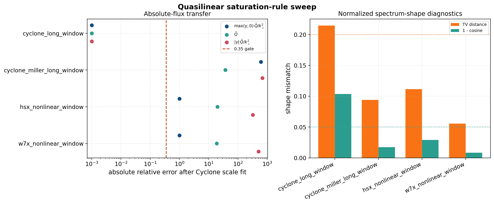

All tested one-scalar rules fail the held-out absolute-flux gate. The current
positive-growth mixing-length rule is still the best of the three, but its
holdout mean absolute relative error is about ``2.51``. The raw linear-weight
rule is worse at about ``3.19``, and the absolute-growth diagnostic is worse
again at about ``3.96``. The figure also reports a training-mean null baseline;
that null gives holdout mean relative error about ``1.39``. It is not a
quasilinear model, but it is a necessary reviewer check: no calibrated
saturation rule should be promoted unless it beats this null baseline as well
as the linear-weight baseline. The JSON companion carries the same
``promotion_gate`` and currently has no accepted rules. This narrows the next
research task: the admitted external-VMEC cases strengthen the negative
transfer evidence, but absolute-flux prediction still needs a richer
saturation/intensity model than any one-scalar fit tested here.

Shape-aware saturation diagnostic
---------------------------------

The next diagnostic tests whether the missing information can be captured by a
single low-dimensional shape envelope. It first forms the normalized nonlinear
to quasilinear spectrum-shape ratio,

.. math::

   R_j(k_y) =
   \frac{P^{\mathrm{NL}}_j(k_y)}
        {P^{\mathrm{QL}}_j(k_y) + \epsilon},
   \qquad
   P(k_y) = \frac{Q(k_y)}{\sum_{k_y} Q(k_y)},

and fits a shared exponent with per-case intercepts,

.. math::

   \log R_j(k_y) = a_j
      + p \log\left(\frac{k_y}{k_{y,\mathrm{ref}}}\right) + \epsilon_j .

The held-out prediction uses only training nonlinear shapes, training scalar
fluxes, and the held-out linear spectrum. It then fits the absolute heat-flux
scale on the training cases and scores the held-out nonlinear window. The
tracked figure uses ``--passed-shape-only`` for the exponent fit, so the
failed Cyclone shape gate does not contaminate the shape correction used for
the other geometries.

.. code-block:: bash

   python tools/plot_quasilinear_shape_aware_saturation.py \
     --passed-shape-only \
     --out docs/_static/quasilinear_shape_aware_saturation.png

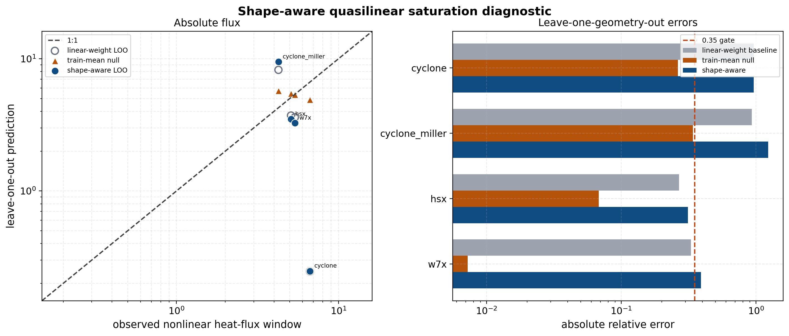

This is a useful negative result. The shape-aware power law gives mean
leave-one-geometry-out absolute relative error about ``0.664``, while the
linear-weight baseline gives about ``0.624``. Both fail the ``0.35`` absolute
transport gate, and the shape-aware model does not improve the mean held-out
score. The figure also includes a deliberately simple training-mean null
baseline; it gives mean relative error about ``0.170`` on this small dataset
because the archived nonlinear windows have similar absolute heat-flux levels.
That null baseline is not a quasilinear model, but it is the right reviewer
check: a calibrated saturation model should beat this baseline before being
used for absolute transport or optimization claims. This closes the
one-exponent saturation-envelope test and motivates a richer calibrated model
with branch/state features, uncertainty diagnostics, and electromagnetic
extensions. Its JSON companion also carries ``promotion_gate.passed = false``
so the rejected model cannot be accidentally promoted by downstream scripts.

Candidate uncertainty gate
--------------------------

The candidate uncertainty gate adds prediction intervals to the same
leave-one-geometry-out protocol. For each held-out geometry, the candidate is
calibrated on the remaining cases, the training log-residuals define a
``95%`` prediction interval, and the held-out point is scored against the
nonlinear heat-flux window. A candidate is promoted only if it:

* passes the ``0.35`` mean-relative transport gate;
* beats the training-mean null baseline;
* beats the linear-weight baseline when it is a new non-baseline model;
* reaches the interval-coverage gate;
* passes candidate-specific eligibility checks such as minimum training-set
  size relative to the number of fitted parameters and matrix conditioning.

.. code-block:: bash

   python tools/plot_quasilinear_candidate_uncertainty.py \
     --workers 4 \
     --out docs/_static/quasilinear_candidate_uncertainty.png

``--workers`` parallelizes the leave-one-geometry-out holdout rows. The JSON
report records the worker count and the identity contract; the numerical
acceptance remains the same as the serial report.

.. image:: _static/quasilinear_candidate_uncertainty.png
   :alt: Quasilinear candidate uncertainty gate
   :width: 100%

The richer ``spectral_envelope_ridge`` candidate is now accepted on the current
seven-case electrostatic portfolio. It uses only two linear-spectrum envelope
features, the positive-growth ``k_y`` centroid and the heat-flux-weighted
``k_y`` width, in a three-parameter log-linear ridge fit (intercept plus two
features). On leave-one-geometry-out scoring it reaches mean relative error
about ``0.244`` with interval coverage about ``0.857``. That beats both the
training-mean null baseline (about ``0.821`` on this seven-case leave-one-out
metric) and the calibrated linear-weight baseline (about ``0.929``). The
legacy one-scalar rules remain rejected, and the broader four-feature
``linear_state_ridge`` candidate remains ineligible because its five fitted
parameters still exceed the current training-volume gate. This is the intended
research posture: accept the smallest candidate that passes held-out skill and
coverage, while retaining the simpler failed models as reviewer-facing
negative controls.

All three model-development reports above now carry an ``input_validation``
block. It is generated from the nonlinear summary gates before model fitting,
so these figures can only be regenerated from nonlinear windows that already
passed their validation gates. This is intentionally stricter than a finite-run
check: exploratory external-VMEC pilots remain useful for planning, but they
cannot enter these quasilinear model diagnostics until their convergence and
validation gates pass.

Dataset-sufficiency gate
------------------------

The current electrostatic-compatible dataset is large enough to reject simple
saturation-rule hypotheses and to promote a bounded richer candidate, but it is
still not large enough to justify every higher-parameter model class. The
dataset-sufficiency gate makes that reviewer-facing scope explicit before any
model fit is attempted. It requires:

* nonlinear input summaries that have already passed their validation gates;
* at least six electrostatic-compatible calibration cases;
* at least two explicit training geometries and three held-out geometries;
* enough leave-one-out training cases per fitted parameter for richer
  candidates;
* passed downstream saturation-rule and uncertainty/skill gates.

.. code-block:: bash

   python tools/plot_quasilinear_dataset_sufficiency.py \
     --out docs/_static/quasilinear_dataset_sufficiency.png

.. image:: _static/quasilinear_dataset_sufficiency.png
   :alt: Quasilinear dataset-sufficiency promotion gate
   :width: 100%

The tracked gate now passes for the current seven-case electrostatic dataset.
There are seven admitted cases, two explicit training geometries, and five
held-out geometries. That is enough data volume for the one-parameter
linear-weight candidate, the two-parameter shape-power-law candidate, and the
three-parameter ``spectral_envelope_ridge`` candidate, though not yet for the
five-parameter ``linear_state_ridge`` model. Promotion is therefore scoped:
the accepted candidate is the reduced spectral-envelope model documented above,
while higher-parameter candidates remain blocked by the train-to-parameter
ratio gate. KBM is still listed as a validated but excluded nonlinear case
because the present quasilinear diagnostics are electrostatic; electromagnetic
quasilinear field-channel normalization and calibration remain separate future
work.

VMEC equilibrium portfolio for future holdouts
----------------------------------------------

The next quasilinear promotion attempt needs more matched nonlinear holdout
windows, not more fit parameters. The local ``vmec_jax`` checkout includes a
useful portfolio of small VMEC equilibria that can seed those future linear
scans and nonlinear validation runs without adding the VMEC files to the
SPECTRAX-GK repository. The inventory tool records file sizes, checksums,
``nfp``, resolution, aspect ratio, edge rotational transform, beta, and a
selection score for follow-up cases:

.. code-block:: bash

   python tools/plot_vmec_jax_equilibrium_inventory.py \
     --data-dir /Users/rogeriojorge/local/vmec_jax/examples/data \
     --out docs/_static/vmec_jax_equilibrium_inventory.png

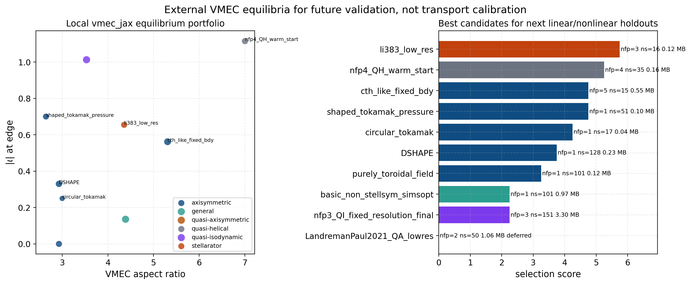

The current inventory finds ``10`` local VMEC equilibria. The best immediate
linear/nonlinear holdout candidates are ``wout_li383_low_res.nc``,
``wout_nfp4_QH_warm_start.nc``, ``wout_cth_like_fixed_bdy.nc``,
``wout_shaped_tokamak_pressure.nc``, ``wout_circular_tokamak.nc``,
``wout_DSHAPE.nc``, and ``wout_purely_toroidal_field.nc``. The
``wout_LandremanPaul2021_QA_lowres.nc`` fixture is deliberately deferred by the
inventory gate because its VMEC reference scale metadata are degenerate
(``Aminor_p = Rmajor_p = aspect = volume = 0``), which is not a valid input to
the current VMEC-to-EIK runtime path.

The first bounded smoke scans use ``ky = 0.10, 0.20``, ``Nl = 2``,
``Nm = 4``, ``dt = 0.005``, and ``80`` explicit time steps to check only that
the geometry path, linear solve, and quasilinear-feature writer are finite.
They are intentionally short and should not be interpreted as optimized
physics scans:

.. list-table::
   :header-rows: 1

   * - VMEC fixture
     - smoke result
     - sampled growth rates
   * - ``wout_li383_low_res.nc``
     - finite stable branches
     - ``-0.0258, -0.0297``
   * - ``wout_nfp4_QH_warm_start.nc``
     - finite stable branches
     - ``-0.0243, -0.0186``
   * - ``wout_cth_like_fixed_bdy.nc``
     - finite stable branches
     - ``-0.0230, -0.0282``
   * - ``wout_shaped_tokamak_pressure.nc``
     - finite stable branches
     - ``-0.0669, -0.0562``

These are **not** accepted quasilinear transport calibration points yet. Each
candidate must first get a reproducible production-resolution SPECTRAX-GK
linear quasilinear scan, a matched nonlinear heat-flux window, and a passed
nonlinear comparison/physics gate before entering the leave-one-out
calibration reports above.

The first full-``ky`` follow-up kept the same W7-X-style VMEC runtime TOML but
used ``Nl = 4``, ``Nm = 8``, and ``400`` explicit time steps over the six-point
stellarator ``ky`` grid used elsewhere in this documentation. Li383 remains
stable over that short linear scan, with ``gamma`` decreasing from about
``-0.022`` to ``-0.078``. The shaped-tokamak fixture is also stable over the
same grid, with ``gamma`` increasing from about ``-0.080`` to ``-0.0186`` but
not crossing zero. The nfp4 QH and CTH-like fixtures are more useful for the
next validation lane: QH reaches ``gamma = 0.0328`` at ``ky = 0.2857``, while
CTH-like reaches ``gamma = 0.0488`` at the same sampled ``ky``. The figures
below are still linear-feasibility artifacts only; they motivate matched
nonlinear windows but do not validate an absolute quasilinear saturation rule.

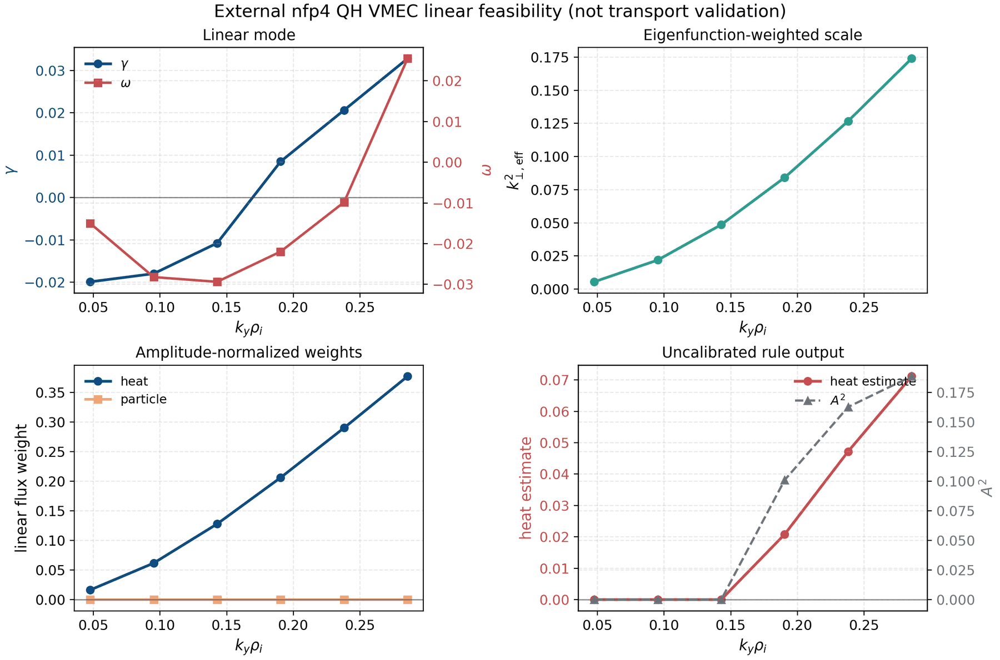

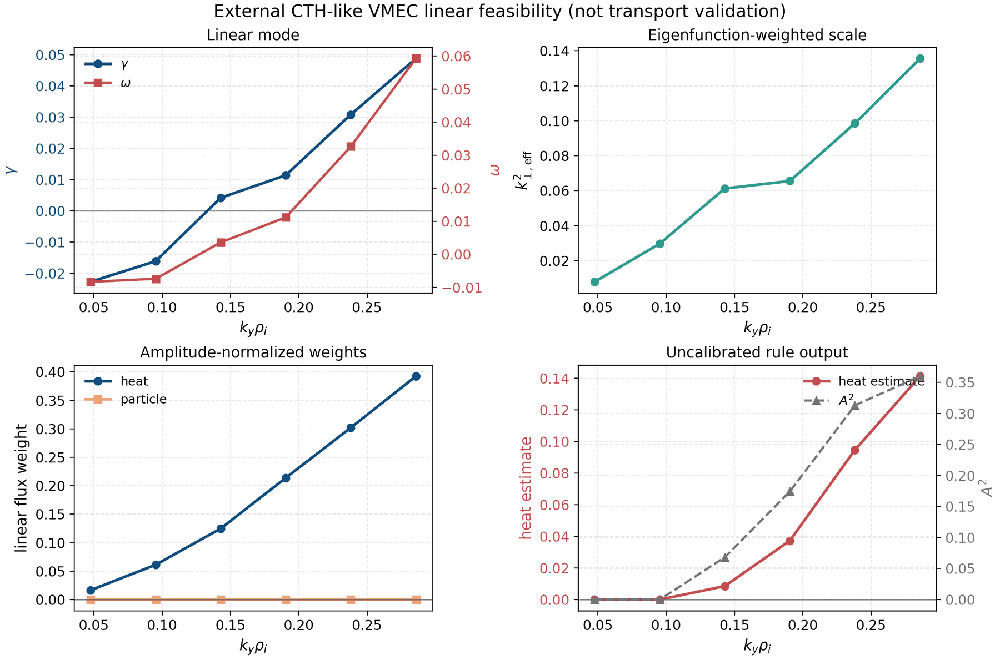

The QH convergence failure triggered a broader candidate screen before any
additional nonlinear promotion. The five-point screen uses
``ky = 0.095, 0.190, 0.286, 0.381, 0.476``, ``Nx = Ny = 48``, ``Nz = 32``,
``Nl = 4``, ``Nm = 8``, and ``400`` explicit RK4 steps. Among the finite
external-VMEC candidates, ``wout_DSHAPE.nc`` is the strongest unstable branch
with ``gamma = 0.096`` at ``ky = 0.476``. Circular tokamak and ITER-model
fixtures are close behind, while QI/QA/QH reference fixtures are stable or fail
the current geometry screen. The screen output is tracked as
``docs/_static/external_vmec_candidate_linear_screen.csv``.

Nonlinear follow-up configs for these external VMEC candidates should be
generated with ``tools/write_external_vmec_holdout_configs.py`` rather than by
hand. The standard command writes matched ``48x48x32`` and ``64x64x40`` TOMLs
for a ``t = 150`` initial run and a ``t = 250`` restart continuation, plus a
JSON manifest containing the launch commands and restart-copy commands. This
keeps every candidate on the same ITG/adiabatic-electron physics, dissipation,
sampling, and output convention before the convergence gate decides whether
the case is admissible.

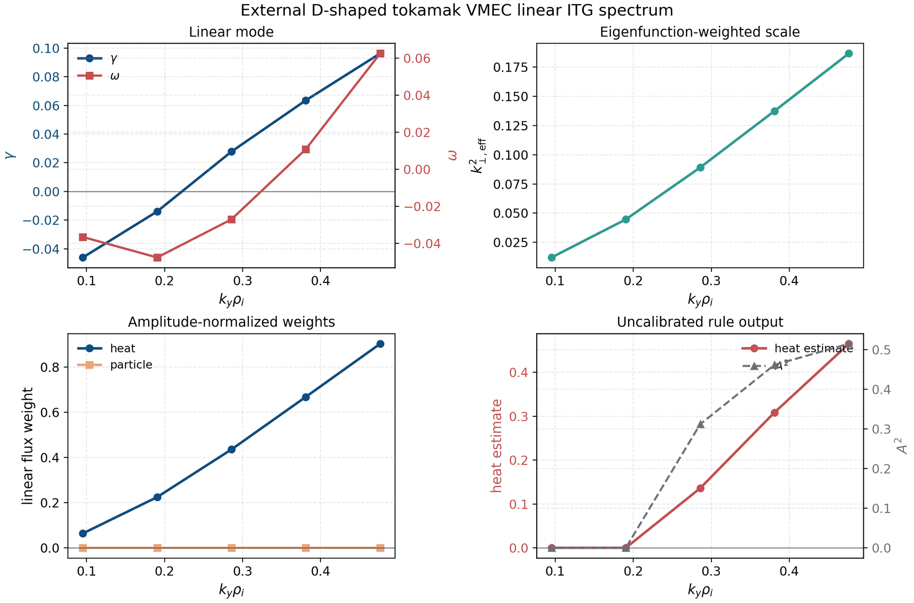

D-shaped tokamak nonlinear pilots were then run on the office GPUs with the
same ITG/adiabatic-electron physics as the QH and CTH-like pilots. The
``t = 150`` low-to-mid-grid gate passes immediately: ``Nx = Ny = 32``,
``Nz = 24`` and ``Nx = Ny = 48``, ``Nz = 32`` differ by only ``0.039`` on the
common late-window mean and ``0.050`` on the least-trending-window mean. The
``t = 150`` mid-to-high-grid gate is close but not acceptable, with
``0.201`` common-window and ``0.262`` least-window relative differences. This
is exactly why the time-window check is required before promoting a run.

Extending the ``48x48x32`` and ``64x64x40`` runs from ``t = 150`` to
``t = 250`` closes the gate. The common-window means are about ``16.1`` and
``18.5`` with symmetric relative difference ``0.139``; the independently
selected least-trending-window means are about ``15.9`` and ``17.7`` with
relative difference ``0.108``. Both are below the ``0.15`` threshold, and the
trend/CV/sample-count gates also pass. D-shaped tokamak is therefore the first
external-VMEC nonlinear transport holdout from this campaign admitted into the
quasilinear calibration report. Admission does not promote the current
absolute-flux model: the Cyclone-trained one-constant mixing-length estimate
overpredicts this D-shaped holdout by about two orders of magnitude.

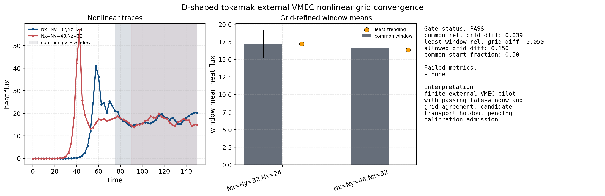

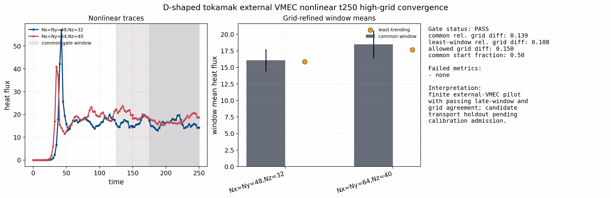

The circular-tokamak follow-up was intentionally not admitted. It is useful as
an explicit negative convergence result. At ``t = 150`` the ``48x48x32`` to
``64x64x40`` pair had excellent grid agreement but still failed the common and
least-window trend gates. Extending both runs to ``t = 250`` removed the trend
issue, but the common-window coefficient of variation rose to about ``0.229``
and the common/least-window grid differences rose to about ``0.180`` and
``0.307``. That moves in the wrong direction, so the correct action is to keep
the circular VMEC case out of the calibration set rather than to keep extending
it indefinitely.

The next screened unstable axisymmetric external-VMEC candidate,
``wout_ITERModel_reference.nc``, does close the gate after one bounded
extension ladder. The ``t = 150`` pair was already close: the common-window
grid difference was only about ``0.073``, but the ``64x64x40`` trace was still
drifting on the common window and the least-window difference was about
``0.164``, slightly above the ``0.15`` threshold. Extending the same
``48x48x32`` and ``64x64x40`` runs first to ``t = 250`` and then to
``t = 350`` closes the gate cleanly. At ``t = 350`` the common-window
heat-flux means are about ``22.41`` and ``22.05``, the common-window symmetric
relative difference is only ``0.0165``, the least-window difference is
``0.1415``, and all trend/CV/sample-count gates pass. ITERModel is therefore
admitted as the second external-VMEC nonlinear transport holdout from this
campaign. As with D-shaped tokamak, this strengthens the negative-transfer
evidence for the current one-constant mixing-length model rather than rescuing
it: the observed heat flux is about ``22.0`` while the uncalibrated
quasilinear prediction is only about ``0.389``.

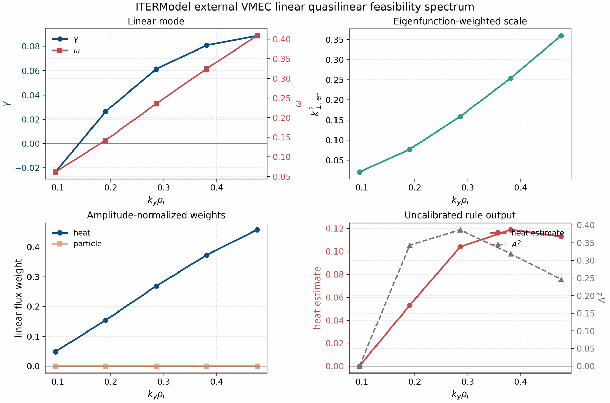

.. image:: _static/external_vmec_itermodel_t350_high_grid_convergence_gate.png
   :alt: External ITERModel VMEC nonlinear t350 high-grid convergence gate
   :width: 100%

The next screened unstable external-VMEC tokamak candidate,
``wout_up_down_asymmetric_tokamak_reference.nc``, also closes after a bounded
extension ladder. At ``t = 150`` the grid difference already passed
(``0.138``), but the ``64x64x40`` common-window trend was still too large
(``7.32e-3`` per time unit). Extending both runs to ``t = 250`` reduced the
common-window relative difference to ``0.0411`` and the least-window
difference to ``0.0499``, but the common-window trend on the lower grid was
still slightly above threshold (``2.78e-3`` versus ``2.0e-3``). A final
extension to ``t = 450`` closes the gate cleanly: the common-window heat-flux
means are about ``7.43`` and ``7.76``, the common-window symmetric relative
difference is ``0.0435``, the least-window difference is ``0.0242``, and both
common and least-window trend/CV/sample-count gates pass. This case is now the
third admitted external-VMEC nonlinear transport holdout in the tracked
stellarator/tokamak calibration portfolio.

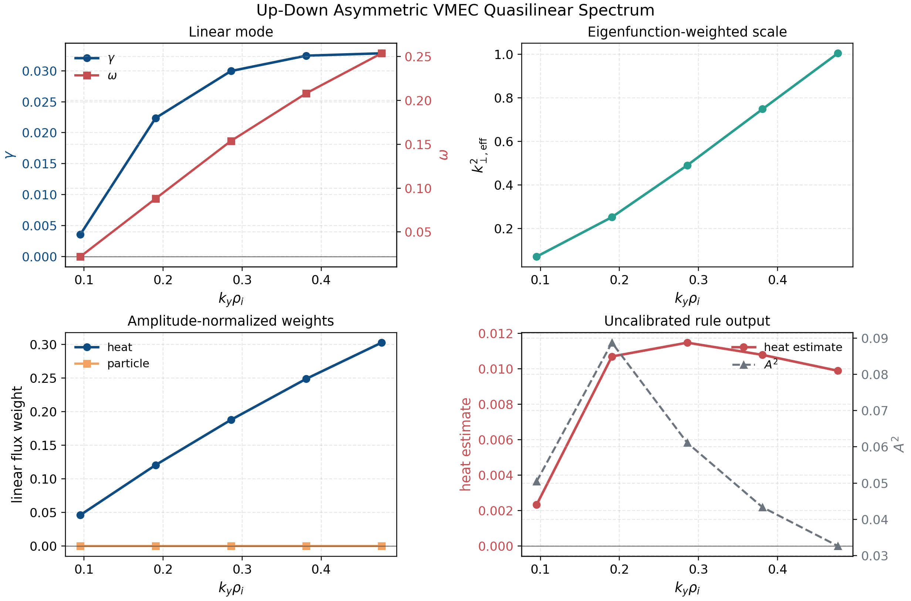

.. image:: _static/external_vmec_updown_asym_t450_high_grid_convergence_gate.png
   :alt: External up-down asymmetric tokamak VMEC nonlinear t450 high-grid convergence gate
   :width: 100%

A reduced-grid nonlinear QH pilot has also been run locally at
``Nx = Ny = 32``, ``Nz = 24``, ``Nl = 4``, ``Nm = 8``, and ``dt = 0.05`` using
the same VMEC fixture. The original ``t = 20`` trace was intentionally not
promoted: its late-half mean heat flux was only about ``1.78e-4`` and still
growing. The lane has now been extended from the saved nonlinear state to
``t = 150``. The longer trace reaches a meaningful post-transient heat-flux
level: the least-trending window is ``t = 77.55`` to ``150.00``, with mean heat
flux about ``19.6``, standard deviation about ``1.14``, and relative linear
trend about ``-3.25e-4`` per time unit. This closes the specific concern that
the QH pilot was only measuring a startup/noise-floor heat flux. It is still a
reduced-grid feasibility result, not a calibrated transport holdout, until a
grid/window convergence gate passes.

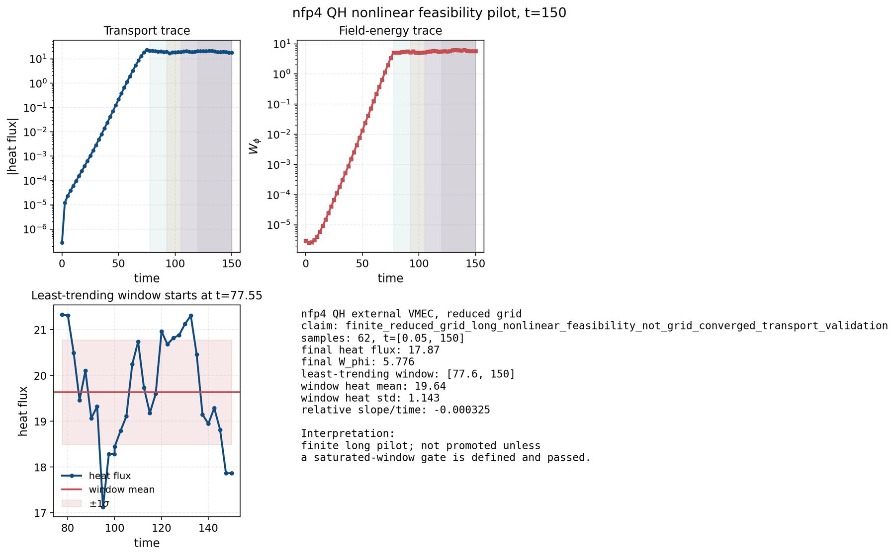

A higher-grid QH companion run at ``Nx = Ny = 48`` and ``Nz = 32`` was then
run on the office GPU to the same ``t = 150`` horizon. It is finite and has a
flat late trace, but the late heat-flux level changes materially: the common
late-window mean is about ``11.6`` instead of ``19.8``, and the independently
selected least-trending means are about ``12.0`` instead of ``19.6``. The
resulting symmetric relative grid differences are about ``0.523`` on the
common window and ``0.480`` on the least-trending windows, both above the
``0.15`` gate.

The follow-on ``Nx = Ny = 64`` and ``Nz = 40`` run is also finite to
``t = 150``, but it moves the transport level again instead of confirming the
``48x48x32`` point: the common-window mean is about ``6.0`` and the
least-trending mean is about ``5.8``. The mid-to-high-grid symmetric relative
differences are about ``0.630`` and ``0.704``. QH is therefore a useful
negative convergence result, not a new quasilinear calibration holdout.

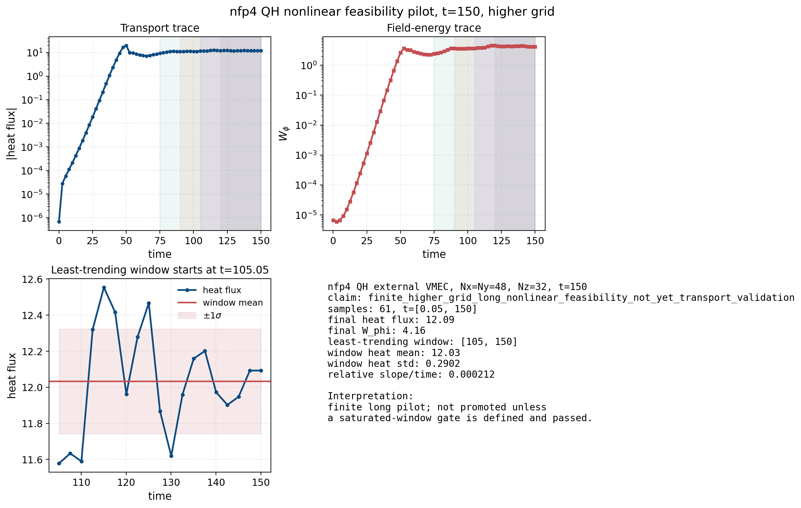

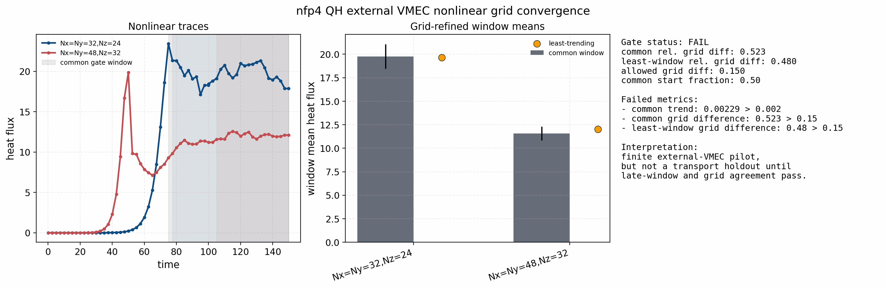

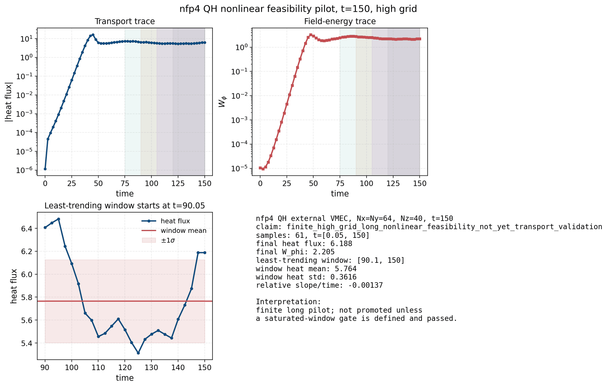

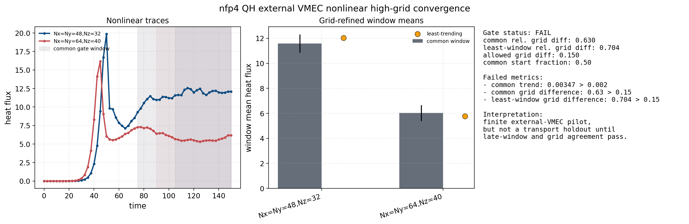

The same reduced-grid protocol was then applied to the CTH-like fixture and
extended on the office GPU to ``t = 150``. The run remains finite and develops a
clear late nonlinear state: the least-trending tracked window is
``t = 75.05`` to ``150.00`` with mean heat flux about ``23.1``, standard
deviation about ``1.79``, and relative linear trend about ``1.2e-3`` per time
unit. This is the strongest current external-VMEC nonlinear candidate. It is
still kept as a feasibility pilot, not a transport-calibration holdout, because
no external-VMEC nonlinear acceptance gate has been defined for this fixture
and no independent reference or production-resolution convergence check has
passed yet.

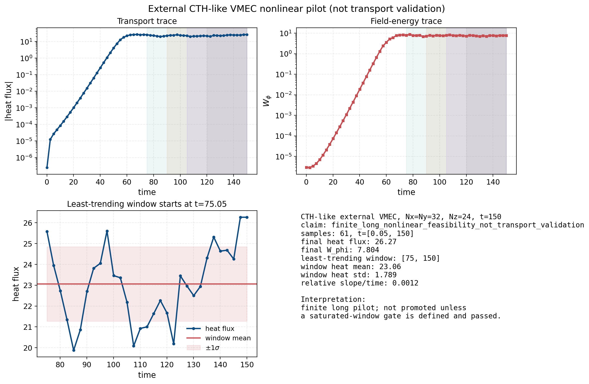

The first bounded grid check repeats the same run at ``Nx = Ny = 48`` and
``Nz = 32``. It is also finite to ``t = 150`` and has a flatter late trace, but
the transport level changes materially: the common ``t = 75.05`` to ``150.00``
window has mean heat flux about ``12.8`` rather than ``23.1``, and the
least-trending ``t = 120.05`` to ``150.00`` window has mean heat flux about
``14.5``. This is a useful negative convergence result. CTH-like should not be
used as a quasilinear calibration holdout until the grid, hypercollision, and
window-selection protocol are frozen and the production-resolution comparison
passes a case-specific tolerance.

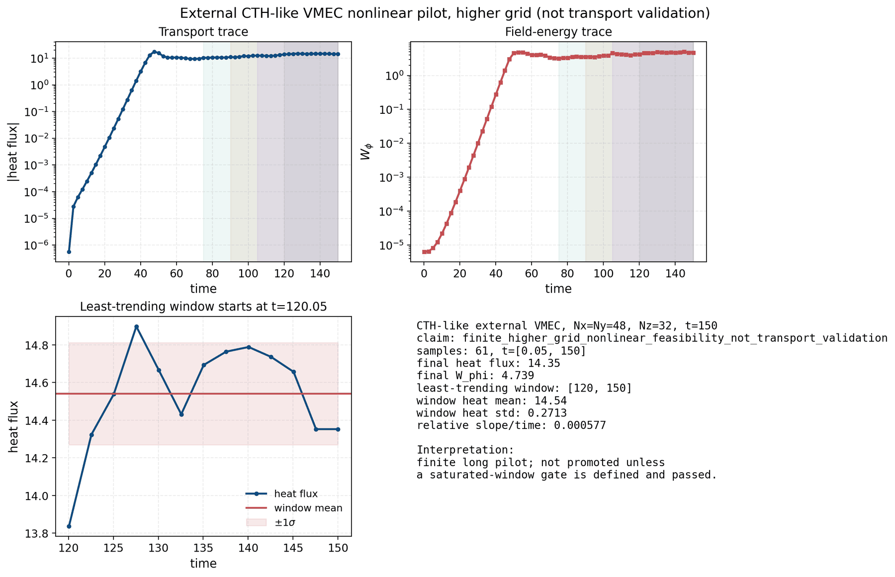

The explicit convergence gate follows the same evidence chain used in
nonlinear gyrokinetic benchmark papers: time traces and saturated heat-flux
windows are compared, and the candidate is not promoted unless the heat flux is
robust to resolution and window choice. This mirrors the Cyclone and W7-X
time-trace/convergence practice in [Dimits00]_ and [GX]_, while the
stellarator-domain sensitivity documented by [Sanchez21]_ motivates keeping
external-VMEC cases behind a conservative gate until flux-tube and resolution
choices are fixed. The current CTH-like pair fails the common-window stationarity
and grid-refinement requirements: the common-window symmetric relative
heat-flux difference is about ``0.571`` and the least-trending-window
difference is about ``0.453``, both above the ``0.15`` production threshold.
That threshold is intentionally strict enough to match the order of
nonlinear heat-flux convergence tolerances reported for Laguerre-Hermite
gyrokinetic calculations in [GX]_. Long turbulent time series can still be
physically informative, as emphasized by W7-X heat-flux time-series analyses
[Papadopoulos23]_, but they are not calibration data until this gate passes.

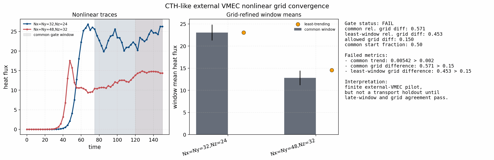

The nonlinear time-horizon audit below is a guardrail for the manuscript and
documentation. It classifies archived heat-flux artifacts by their actual time
coverage and claim level. The long matched nonlinear gates for Cyclone,
Cyclone Miller, KBM, W7-X, and HSX pass the current release comparison
envelopes. D-shaped tokamak now passes the external-VMEC ``t = 250`` high-grid
convergence gate and is ready for calibration-report admission. The QH and
CTH-like external-VMEC traces are long feasibility pilots that still need
convergence gates. The compact finite-difference audits
remain startup plumbing checks, and the differentiable nonlinear-window
optimization examples remain reduced-envelope estimators rather than production
nonlinear transport averages.

.. image:: _static/nonlinear_transport_time_horizon_audit.png
   :alt: Nonlinear transport time-horizon audit
   :width: 100%

The normalized W7-X spectrum-shape gate does pass when the linear
heat-flux-weight distribution is compared with the resolved nonlinear
``HeatFlux_kyst`` spectrum from the NetCDF output:

.. code-block:: bash

   python tools/plot_quasilinear_spectrum_shape_gate.py \
     --spectrum docs/_static/quasilinear_w7x_spectrum_scan.quasilinear_spectrum.csv \
     --nonlinear tools_out/final_nonlinear_audit/w7x_spectrax_current_adaptive_t200.out.nc \
     --out docs/_static/quasilinear_w7x_spectrum_shape_gate.png \
     --ql-column heat_flux_weight_total \
     --nonlinear-variable Diagnostics/HeatFlux_kyst \
     --tv-gate 0.2 \
     --cosine-gate 0.95 \
     --title "W7-X quasilinear/nonlinear ky-spectrum shape gate"

.. image:: _static/quasilinear_w7x_spectrum_shape_gate.png
   :alt: W7-X quasilinear and nonlinear ky-spectrum shape gate
   :width: 100%

The tracked W7-X shape gate passes with total-variation distance about
``0.056`` and cosine similarity about ``0.992``. This supports the
linear-spectrum shape diagnostic for W7-X under the current setup, while the
absolute saturated-flux model remains rejected by the train/holdout report.

The same HSX artifacts also close the first real spectrum-shape gate. This gate
does **not** use the saturated flux, because the current stable-branch
mixing-length rule would erase the spectrum. Instead it compares the normalized
linear heat-flux-weight spectrum against the normalized nonlinear
``HeatFlux_kyst`` spectrum averaged over the resolved nonlinear diagnostics:

.. code-block:: bash

   python tools/plot_quasilinear_spectrum_shape_gate.py \
     --spectrum docs/_static/quasilinear_hsx_spectrum_scan.quasilinear_spectrum.csv \
     --nonlinear tools_out/final_nonlinear_audit/hsx_nonlinear_t50.out.nc \
     --out docs/_static/quasilinear_hsx_spectrum_shape_gate.png \
     --ql-column heat_flux_weight_total \
     --nonlinear-variable Diagnostics/HeatFlux_kyst \
     --time-max 49.2 \
     --tv-gate 0.2 \
     --cosine-gate 0.95 \
     --title "HSX quasilinear/nonlinear ky-spectrum shape gate"

.. image:: _static/quasilinear_hsx_spectrum_shape_gate.png
   :alt: HSX quasilinear and nonlinear ky-spectrum shape gate
   :width: 100%

The tracked HSX shape gate passes with total-variation distance about ``0.11``
and cosine similarity about ``0.97``. This supports the linear spectrum-shape
diagnostic while still rejecting any absolute saturated-flux claim from the
current uncalibrated rule.

Axisymmetric spectrum-shape gates
---------------------------------

The same spectrum-shape extraction is also tracked for the electrostatic
axisymmetric adiabatic-electron nonlinear windows. These gates compare only the
normalized ``ky`` distribution of the linear heat-flux weight against the
resolved nonlinear ``HeatFlux_kyst`` spectrum. They do not test the absolute
mixing-length heat-flux level.

.. image:: _static/quasilinear_cyclone_miller_spectrum_shape_gate.png
   :alt: Cyclone Miller quasilinear and nonlinear ky-spectrum shape gate
   :width: 100%

Cyclone Miller passes the initial shape gate with total-variation distance
about ``0.094`` and cosine similarity about ``0.983``. This is a useful positive
gate: the linear heat-flux-weight spectrum and the resolved nonlinear heat-flux
spectrum place comparable weight across the scanned ``ky`` range under the
current window.

.. image:: _static/quasilinear_cyclone_spectrum_shape_gate.png
   :alt: Cyclone quasilinear and nonlinear ky-spectrum shape gate
   :width: 100%

The long-window Cyclone shape gate is intentionally retained as a failed gate:
it gives total-variation distance about ``0.215`` and cosine similarity about
``0.896`` against the current ``TV <= 0.2`` and ``cosine >= 0.95`` criteria.
The mismatch is concentrated in the low- and high-``ky`` tails, which points to
a saturation/intensity-model limitation or a window/branch-selection issue
rather than a failed file-ingestion path. This is a paper-facing negative
result and should guide the next quasilinear saturation-model sweep.

KBM is not included in the current spectrum-shape quasilinear gate because the
tracked KBM validation lane is electromagnetic, while the implemented
quasilinear diagnostic currently validates only electrostatic field channels.
KBM should enter this section only after electromagnetic quasilinear weights
for ``A_parallel`` and ``B_parallel`` have independent normalization and
finite-difference/linear-diagnostic gates.
