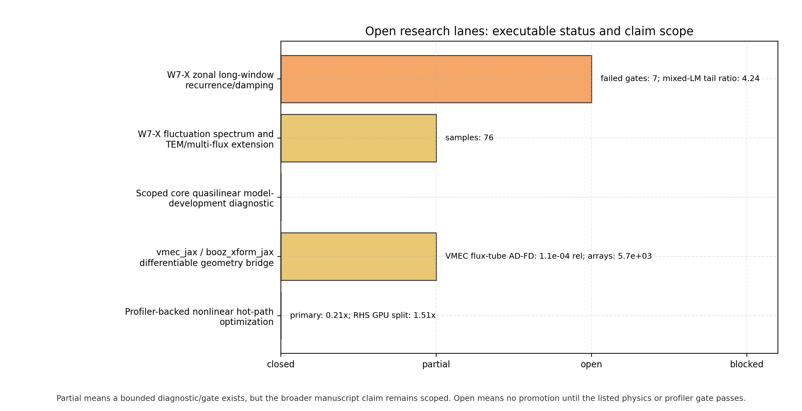
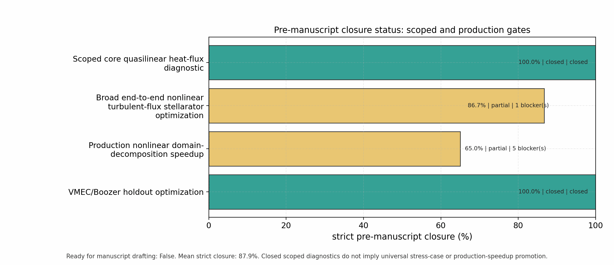
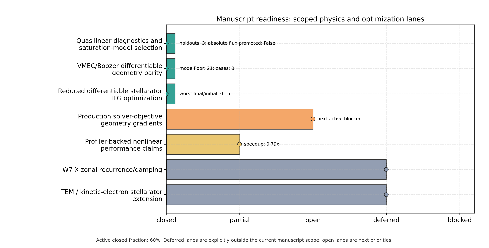

Roadmap
=======

SPECTRAX-GK is being developed as a research-grade, JAX-native gyrokinetic
solver: accurate against independent benchmarks, differentiable end to end,
fast enough for scoped production studies, and simple enough for researchers to
run, test, and extend.

Current target
--------------

The active milestone is not just "more features". The release target is a
validated codebase with:

- documented install, run, plot, and artifact workflows;
- literature-anchored physics gates for linear, nonlinear, response-function,
  geometry, and autodiff examples;
- measured cold-start, warm-runtime, memory, and parallelization behavior;
- CI gates that cover unit tests, regression tests, docs, packaging, and
  selected validation artifacts;
- clear module boundaries so equations, numerics, runtime I/O, plotting, and
  benchmark policy can be tested independently.

The roadmap is not itself a claim ledger. Use :doc:`release_scope` for the
current artifact-backed boundary between release-ready, deferred, and explicitly
unpromoted claims.

Pre-release scope
-----------------

The pre-release lane is limited to work that can be bounded, tested, and
documented without changing the physics claim surface:

- keep the refreshed runtime/memory panel complete for Cyclone, Cyclone
  Miller, KBM, W7-X, and HSX release rows;
- tighten case-specific nonlinear window-statistics gates where the frozen
  reference windows support it;
- strengthen autodiff validation with finite-difference checks, sensitivity
  map conditioning, and UQ covariance metadata;
- add the Phase-A ``vmec_jax`` / ``booz_xform_jax`` bridge contract into the
  existing sampled flux-tube geometry interface;
- land production parallelization first for independent ``k_y`` scans and UQ
  ensembles, with serial numerical-identity gates. The first closed artifact
  is ``docs/_static/parallel_ky_scan_gate.png`` from
  ``tools/generate_parallel_ky_scan_gate.py``;
- keep nonlinear hot-path optimization profiling-driven and tied to existing
  window-statistics and exact-state gates.

Current pre-release status snapshot:

- Release-ready technical lanes are those backed by tracked CI,
  documentation, refactor, parallelization, profiler, and guardrail artifacts;
  remaining manuscript physics lanes are tracked separately and must not be
  counted as shipped claims.
- runtime/memory and nonlinear atlas figures include W7-X and HSX release rows;
- the large runtime/diagnostics refactor has a release-engineering boundary:
  extracted startup/chunk/result/artifact helpers and validation-policy modules
  preserve public behavior, including restartable NetCDF append schema, but do
  not by themselves promote new physics or speedup claims;
- targeted nonlinear coverage now exercises explicit diagnostic branches,
  Hermitian projection, fixed-mode frequency extraction, IMEX nonlinear terms,
  and scalar/gyroaveraged electromagnetic bracket components;
- autodiff UQ validation includes finite-difference demo checks, closed-form
  Gauss-Newton covariance checks, rank-deficient sensitivity-map checks, and an
  explicit rejection path for empty parameter maps;
- solver-objective geometry-gradient validation now includes an actual
  electrostatic linear-RHS implicit-eigenpair gate for growth rate, real
  frequency, ``<k_perp^2>``, linear heat/particle-flux weights, and a
  mixing-length heat-flux proxy with respect to solver-ready geometry arrays,
  plus a mode-21 full-chain ``vmec_jax`` state-coefficient to
  ``booz_xform_jax`` to SPECTRAX-GK eigenfrequency-gradient artifact at
  ``docs/_static/vmec_boozer_solver_frequency_gradient_gate.png`` and a
  matching quasilinear heat-flux-weight gradient artifact at
  ``docs/_static/vmec_boozer_quasilinear_gradient_gate.png``, plus a bounded
  reduced nonlinear-window estimator-gradient artifacts for QH and Li383 at
  ``docs/_static/vmec_boozer_nonlinear_window_gradient_gate.png`` and
  ``docs/_static/vmec_boozer_li383_nonlinear_window_gradient_gate.png``; the
  companion compact nonlinear startup-window finite-difference observable
  audit at ``docs/_static/nonlinear_window_fd_audit.png`` / ``.json`` closes
  only the startup-response plumbing and conditioning path; the companion
  VMEC/Boozer-perturbed nonlinear startup-window FD audit at
  ``docs/_static/vmec_boozer_nonlinear_window_fd_audit.png`` / ``.json``
  starts from a real mode-21 ``vmec_jax -> booz_xform_jax`` state perturbation
  and closes the imported-geometry startup observable path while recording that
  the local forward/backward response is asymmetric. Both short FD artifacts
  explicitly keep their transport-average gates false; VMEC/Boozer nonlinear
  turbulence gradients, long post-transient running-average heat-flux windows,
  and optimized-equilibrium nonlinear audits remain promotion requirements;
- the Phase-A differentiable-geometry bridge is an in-memory sampled
  flux-tube contract with 100% targeted coverage, optional
  ``vmec_jax`` / ``booz_xform_jax`` discovery, tracer-safe mapping into
  ``FluxTubeGeometryData``, real ``vmec_jax`` metric-tensor derivatives, a
  real non-axisymmetric VMEC field-line tensor derivative through
  ``vmec_jax.geom`` plus ``vmec_jax.vmec_bcovar``, a direct VMEC
  tensor-derived flux-tube mapping derivative, a direct-VMEC-tensor vs
  imported-VMEC/EIK array-parity audit, a Boozer equal-arc core parity audit
  that closes the ``bmag``/``bgrad``/``gradpar``/Jacobian, zero-beta
  ``gds*``/``grho`` metric convention, and zero-beta loaded drift convention at
  release tolerance, a separate ``mboz=nboz=21`` QH/QI/tokamak parity matrix
  artifact at ``docs/_static/vmec_boozer_parity_matrix.png``, a real
  ``vmec_jax`` ``VMECState`` to ``booz_xform_jax`` to SPECTRAX-GK derivative
  gate, and a
  tracked AD-vs-finite-difference inverse/UQ artifact at
  ``docs/_static/differentiable_geometry_bridge.png``;
- the fixed-resolution QI row in the parity matrix is admitted only at
  ``mboz=nboz=21`` after low-mode Boozer settings are rejected; after the
  Boozer half-mesh convention fix, the current regenerated artifact passes QI
  drift at about ``7.13e-2`` against the ``8e-2`` tolerance and the evaluated
  QI ``ntheta=8,16`` variants pass. The full QI seed campaign remains
  artifact-limited by missing bundled ``wout`` references and is not broad QI
  transport validation, quasilinear calibration, or nonlinear optimization;
- production parallelization is currently claimed only for independent
  ``k_y``/batch/quasilinear/sensitivity/UQ-style workloads, including the
  runtime scan ``[parallel] strategy = "batch"`` path for independent
  ``k_y`` scans. Solver-layout sharding paths remain diagnostic or
  communication-gated, not production nonlinear domain decomposition;
- release-level performance evidence is closed with the refreshed
  runtime/memory panel, CPU/GPU nonlinear RHS split profiles, fused full-RHS
  traces, W7-X/HSX runtime-mode stellarator profiles, and the nonlinear
  sharding identity gate. This supports bounded profiler claims only; broad
  production nonlinear speedup and nonlinear domain-decomposition claims remain
  future profiler-gated work.

Executable open-lane status
---------------------------

The active post-``v1.5`` research lanes are now summarized by
``tools/build_open_research_lane_status.py``. The generated artifact is a
claim-scope gate, not a substitute for the underlying physics figures. It reads
the W7-X zonal, W7-X fluctuation-spectrum, quasilinear holdout, differentiable
geometry, and nonlinear-profiler artifacts and reports whether each lane is
closed, partial, open, or blocked.

In the broader research tracker, the current snapshot has two closed
release/research-support lanes: nonlinear
holdouts for the scoped quasilinear model-development claim and
profiler-backed nonlinear hot-path localization. W7-X fluctuation/TEM and the
broader differentiable-geometry bridge remain partial bounded diagnostics,
while W7-X long-window zonal recurrence remains open. This keeps the
README/docs claim surface honest while still preserving publication-ready
diagnostic panels for the pieces that are already reproducible.

Current manuscript-scope readiness is tracked separately by
``tools/build_manuscript_readiness_status.py`` because W7-X zonal recurrence
and TEM/kinetic-electron extensions are intentionally deferred from this
manuscript. In that narrower scope, the quasilinear lane is closed as a
validated diagnostic/model-selection result rather than as an absolute-flux
predictor, VMEC/Boozer equal-arc geometry parity is closed for the current
artifact-passing ``mboz=nboz=21`` rows, including fixed-resolution QI after the
half-mesh convention fix. The evaluated QI robustness variants pass, while the
full QI seed campaign is artifact-limited by missing bundled ``wout`` files.
The reduced
differentiable stellarator ITG optimization examples are closed with AD/FD
gates. The solver-objective geometry-gradient
lane has passed actual linear-RHS gates at the solver-ready geometry contract
plus mode-21 VMEC/Boozer state-to-solver eigenfrequency, quasilinear
heat-flux-weight, and reduced nonlinear-window-estimator gates on QH and Li383
holdouts. Compact nonlinear startup-window finite-difference observable audits
are tracked at ``docs/_static/nonlinear_window_fd_audit.png`` / ``.json`` and
``docs/_static/vmec_boozer_nonlinear_window_fd_audit.png`` / ``.json``. These
short artifacts validate plumbing only and explicitly are not heat-flux
transport averages. The production guard at
``docs/_static/production_nonlinear_optimization_guard.png`` / ``.json`` records
that D-shaped and circular long post-transient replicate ensembles now pass as
holdout evidence, and the selected optimized QA equilibrium now has its own
replicated ``t=[350,700]`` post-transient transport-window audit. The strict
``t=1500`` growth/QL/nonlinear-window optimized-candidate traces close the
optimized-equilibrium ensemble-count requirement. A matched
finite-transform no-ESS reference from the same VMEC-JAX campaign now also
passes the same ensemble protocol, and the optimized QA/ESS equilibrium reduces
the audited late-window heat flux by ``18.4%``. This is one positive scoped
audit. Production promotion remains blocked until three matched
baseline-to-optimized audits pass, along with the strict replicated-holdout
breadth, local-gradient conditioning, and converged long post-transient
running-average heat-flux windows required before claiming a production
nonlinear heat-flux stellarator optimizer.
The latest QL-seeded nonlinear-gradient control screen admits
``Rsin_mid_surface_m1`` and ``Zcos_mid_surface_m1`` as internal VMEC-state
controls. The first measured mapping response is a negative result:
stellarator-symmetric ``RBC/ZBS`` perturbations have zero response in those
admitted asymmetric controls. The follow-up ``LASYM=true`` ``RBS/ZBC`` branch
now passes the state-to-input mapping gate with rank ``2`` and condition number
about ``1.02``, so ``docs/_static/nonlinear_gradient_state_control_runbook.json``
can emit checked short-bracket launch directions. The launch writer now also
has normally terminated VMEC decks and prepared bounded nonlinear campaign
manifests for both mapped controls. The first bounded nonlinear audit has now
run all ``18`` short-bracket outputs and passed output/ensemble gates, but it
fails central finite-difference promotion because the ``1e-3`` bracket has
unresolved, asymmetric response. The follow-up bracket-amplitude sweep has also
run all ``36`` ``alpha_delta=3e-3`` and ``1e-2`` office-GPU outputs with no
runtime failures. Output and ensemble gates remain stable, but all four
central-FD gates still fail; the best response fraction is about ``0.0045``
against the ``0.03`` gate. The remaining open work is therefore not a larger
single-control bracket, but lower-variance evidence through longer
post-transient windows, paired replicas, or better-conditioned multi-control
observables before any production nonlinear-gradient claim.

Pre-manuscript closure gates
----------------------------

The four lanes required before manuscript drafting now have a separate strict
dashboard generated by ``tools/build_pre_manuscript_closure_status.py``. This
dashboard is intentionally stricter than release readiness: a scoped diagnostic
or one positive candidate audit does not close a broad manuscript claim.

Current strict closure is ``87.9%`` on average, so manuscript drafting remains
blocked by broad nonlinear optimization and nonlinear domain speedup, not by
the scoped QL diagnostic. The required order is:

- scoped core quasilinear heat-flux diagnostic: closed for the declared
  10-case core portfolio. The Solovev and shaped-pressure stress outliers
  remain visible negative evidence, so universal runtime absolute-flux
  promotion stays deferred;
- broad end-to-end nonlinear turbulent-flux stellarator optimization: promote
  only after at least three independent matched baseline-vs-optimized
  long-window transport audits. The generic replicated-holdout lane is frozen
  at three accepted long-window holdout ensembles; no additional holdouts are
  active for this tranche. The optimized-equilibrium trace-count requirement is closed by the
  selected t700 optimized-equilibrium audit plus the strict t1500 growth/QL/
  nonlinear-window candidate trace ensembles;
- production nonlinear domain-decomposition speedup: implement a real
  communication-aware nonlinear decomposed RHS/integrator path and require
  serial-vs-decomposed transport-window identity plus large-grid CPU and
  multi-GPU speedup ``>=1.5`` before any speedup claim;
- VMEC/Boozer holdout optimization: closed for the current pre-manuscript gate
  after adding the production-scope QH held-out surface/field-line nonlinear
  transport artifact with same-WOUT provenance through
  ``vmec_jax -> booz_xform_jax -> SPECTRAX-GK``. Broader optimization claims
  still require nonlinear transport-gradient and second-equilibrium nonlinear
  transport validation.

The VMEC-JAX aspect-6 QA transport restart now has a measured reduced
transport-gradient diagnostic and a solved-gate projected line-search bracket.
The explicit single-sample nonlinear-window metric decreases from
``0.0580559`` to ``0.0559975`` at projected step ``1e-3`` while the physical
aspect/iota/QS gates pass; the next step ``2e-3`` is rejected by the QS gate.
This closes the local-sensitivity question for the current scalar-weight
ladder failure and the projected line-search/admission path is now reusable.
The matched long-window nonlinear audit for the earlier aspect-6 accepted
``1e-3`` candidate is negative: both baseline and projected-candidate
seed/timestep ensembles pass
their ``t=[350,700]`` gates, but the projected candidate raises the ensemble
mean heat flux slightly from ``9.833`` to ``9.891`` (relative reduction
``-0.00585``). The next implementation task is therefore not to promote this
boundary step, but to add better-conditioned multi-sample objectives and
matched long-window audits before any turbulent-flux optimization claim. The
new ``qa_projected_transport_step1e3_redesign_report.json`` gate now records
that requirement explicitly and recommends an 18-point reduced objective over
three surfaces, two field-line labels, and three ``k_y`` values.
The stricter rerun-WOUT top-12 QA edge campaign used that 18-point coverage
and improved the reduced metric by ``2.29%``, but its matched long-window
nonlinear audit still failed promotion with only ``0.58%`` reduction and
uncertainty z-score ``0.20``. The companion
``strict_qa_top12_edge_redesign_report.json`` therefore marks the next blocker
as predictive transfer margin and uncertainty separation, not merely sample
coverage.

Before tagging, the latest public ``main`` CI run must pass repo hygiene, mypy,
quick shards, docs/packaging, fast coverage, and the full wide-coverage matrix.
The configured wide-coverage job enforces ``95%`` package-wide coverage. Some
individual modules can still sit below ``95%`` because the gate is package-wide;
notably ``nonlinear.py`` and ``zonal_validation.py`` remain useful targets for
future targeted physics tests.

The latest W7-X zonal follow-up is
``docs/_static/w7x_zonal_hypercollision_probe_kx070.png``. It varies constant
Hermite hypercollision at fixed paper-facing initializer and normalization.
The stronger ``nu_hyper_m=0.03`` row reduces the final Hermite-tail fraction to
about ``0.099`` but leaves the mean trace error near ``0.289`` and the
late-window envelope about ``4.3`` times the digitized reference. The next
step is therefore a physically motivated velocity-space closure/operator
study, not a normalization change or another single-parameter constant-damping
scan.

The W7-X fluctuation/TEM extension lane is tracked by
``docs/_static/w7x_tem_extension_status.png`` and the TEM branch audit
``docs/_static/tem_branch_parity_audit.png``. The nonlinear fluctuation
spectrum estimator is closed as a simulation diagnostic with ``76`` samples,
but the TEM branch audit remains far outside any publication parity envelope:
``max |rel gamma|≈4.25``, ``max |rel omega|≈3.3`` away from the near-zero
reference denominator, one growth-rate sign mismatch, three frequency sign
mismatches, and an inverted frequency-branch ordering. No multi-alpha,
multi-surface, or kinetic-electron W7-X nonlinear windows are admitted yet.
These are now explicit blockers before broad W7-X/TEM validation or
optimization claims.

Post-release scope
------------------

The following remain post-release manuscript lanes until their literature
contracts and gates close:

- W7-X zonal long-window damping, recurrence, and closure under paper-facing
  normalization;
- W7-X fluctuation-spectrum experimental extension: the simulation-spectrum
  panel now has a reproducible estimator and gated artifact, but density and
  zonal-frequency comparison through a Doppler-reflectometry transfer function
  remains post-release;
- W7-X multi-flux-tube and TEM extension before broad stellarator-validation
  claims.
- production nonlinear heat-flux stellarator optimization beyond the selected QA
  audit, including converged VMEC/Boozer nonlinear transport gradients and
  broader optimized-equilibrium nonlinear audits.

Current release-scope guardrail
-------------------------------

The canonical claim ledger for release notes and manuscript drafting is now
:doc:`release_scope`. It records which claims are supported by the current
artifacts and which remain explicitly unpromoted. In short: release-level
validation is closed for the scoped benchmark, quasilinear diagnostic/model-
selection, artifact-passing reduced differentiable-geometry, independent-work
parallelization, runtime/refactor artifact-contract, and profiler-localization
claims, including the fixed-resolution QI equal-arc row after the half-mesh
convention fix and the scoped selected-QA optimized-equilibrium audit.
Production nonlinear heat-flux stellarator optimization beyond that selected
audit, broad QI validation, runtime absolute quasilinear flux
prediction, electromagnetic quasilinear calibration, nonlinear multi-GPU
speedup, W7-X zonal recurrence closure, and W7-X TEM/kinetic-electron
validation remain future gates.

Active refactor lane
--------------------

The current branch is splitting large modules into smaller, tested units while
preserving public behavior and benchmark parity. Refactors should only land
when they add or preserve tests for the extracted behavior.

Current refactor status: runtime startup, GX-comparison diagnostics, adaptive chunks,
runtime result assembly, pure runtime policies, linear parameter policies,
linear linked-boundary maps, nonlinear diagnostic packing, validation-gate
helpers, zonal-validation helpers, and nonlinear parallelization policy metadata
are split out and tested.
Benchmark normalization/Krylov defaults and pure benchmark helpers are also
separated from the public runner module while preserving the
``spectraxgk.benchmarks`` compatibility surface. The latest restart-artifact
contract keeps NetCDF continuation appends on the persisted diagnostic schema.
Treat this as release engineering: it supports maintenance, restart
reproducibility, and future refactors, not a production nonlinear optimization
or broad validation claim.

Highest-value remaining slices:

- ``runtime.py`` run dispatch, artifact writing, and plotting hooks;
- ``linear.py`` cache construction, field solve calls, RHS kernels, and integration paths;
- ``nonlinear.py`` bracket kernels and long diagnostic integration paths;
- ``benchmarks.py`` runner orchestration and benchmark artifact policy;
- plotting and publication-figure helpers;
- VMEC/Miller geometry adapter boundaries.

Validation gates
----------------

Research-facing validation is organized around artifact gates. Each gate should
have an owning script, frozen output path, reference source, fit/window policy,
and explicit numeric tolerance.

Linear gates:

- growth rate and real frequency from late-time fits;
- branch continuation and near-marginal behavior;
- eigenfunction overlap and phase/sign conventions;
- velocity-space and field-line resolution convergence;
- geometry-contract parity for Miller and VMEC imports.

Nonlinear gates:

- windowed heat-flux statistics rather than single-time comparisons;
- mode-resolved ``Wphi`` and heat-flux spectra;
- conservation/free-energy behavior in reduced limits;
- restart and diagnostic-order regressions;
- stable long-window behavior for Cyclone, Miller, KBM, W7-X, and HSX lanes.

Response-function gates:

- Rosenbluth-Hinton/GAM response in shaped tokamak cases;
- W7-X and HSX zonal-flow response using the same extraction protocol;
- damping, frequency, residual, and recurrence diagnostics reported together.

Autodiff gates:

- finite-difference, tangent, and adjoint consistency where applicable;
- sensitivity maps for growth rates, frequencies, and selected transport
  metrics;
- two-parameter inverse problems with covariance/uncertainty estimates;
- differentiable geometry gradients after the ``vmec_jax`` bridge is added.

Near-term physics priorities
----------------------------

The next physics lanes should be closed in this order after the pre-release
scope above is stable:

1. W7-X zonal-response residual and late-envelope closure. The VMEC-backed
   SPECTRAX-GK artifact now uses the paper-facing potential initializer,
   signed line-average observable, line-first normalization, and no hidden
   time-axis scaling. The long-window comparison reaches the digitized
   stella/GENE time windows for all four wavelengths, but residuals fail at
   ``k_x rho_i=0.07``, ``0.10``, and ``0.30`` and the late envelopes are much
   larger than the digitized traces. The tracked TOML keeps
   ``gaussian_width=1`` because the benchmark source writes the initializer as
   ``exp[-(z-z0)^2]``; wider profiles and non-unit time scales are explicit
   audits only. The runtime now preserves final samples under strided
   diagnostics, aborts checkpointed artifact runs on the first non-finite
   diagnostic chunk, and preserves signed zonal line/mode diagnostics across
   external restart continuation. A four-wavelength ``Nl=16``, ``Nm=64``,
   ``dt=0.05`` refresh reached raw runtime ``t≈100`` with finite signed traces,
   so longer restart-continued W7-X traces can now be used to study the
   remaining physics/numerics issue directly. A constant-Hermite
   hypercollision follow-up reduced moment-tail energy but did not close the
   trace residual or late envelope, so the next sweep should vary the
   closure/operator physics rather than simply increasing constant damping.
2. Tighten the now-materialized windowed nonlinear-statistics panel beyond the current ``0.10`` release gate where the literature/reference windows justify stricter tolerances.
3. W7-X multi-flux-tube ITG/TEM extension and fluctuation-spectrum lane. The
   simulation-spectrum estimator is closed, while TEM linear parity,
   alpha/surface-resolved scans, and kinetic-electron nonlinear windows remain
   open in ``docs/_static/w7x_tem_extension_status.json`` and
   ``docs/_static/tem_branch_parity_audit.json``.
4. Shaped multispecies tokamak linear lane.
5. ETG nonlinear only after its benchmark operating point and observable
   contract are explicit.

Performance and memory
----------------------

Performance work should stay measurement-driven. The current priorities are:

- separate cold compile, cache construction, first-step compile, warm runtime,
  and output/plot time in every reported panel;
- reduce integrator compile cost before optimizing small runtime kernels;
- keep large constants out of closed-over JIT state when possible;
- stream diagnostics rather than materializing full histories by default;
- expose JAX memory-allocation and persistent-cache guidance for production
  sweeps;
- use distributed parallelization first for independent scans, UQ ensembles,
  sensitivity sweeps, and linear batches before attempting nonlinear domain
  decomposition;
- only introduce custom kernels after profiling shows a persistent XLA
  bottleneck.

Differentiable geometry and optimization
----------------------------------------

After the refactor/testing lane is stable, the differentiable geometry plan is:

1. Replace the remaining local grad-:math:`B` drift closure with the
   production VMEC/EIK drift convention.
2. Add gradient checks for geometry-to-observable paths.
3. Promote examples from sensitivity analysis to inverse design, uncertainty
   quantification, and stellarator optimization only after the derivative
   checks and benchmark artifacts are frozen.

Testing and CI
--------------

The package-wide coverage target remains 95%, but coverage alone is not the
goal. Tests should map to equations, numerical schemes, diagnostics, artifacts,
benchmark observables, or differentiability contracts.

CI tiers:

- pull requests: type checks, fast test shards, docs build, package build, and
  release-surface coverage;
- main/manual: wider package coverage and selected artifact checks;
- workflow dispatch: full local validation suite;
- office/manual: GX-comparison parity, VMEC/W7-X validation, runtime/memory sweeps, and
  multi-GPU checks.

Documentation and examples
--------------------------

Documentation should remain user-first at the top level: install, run the
executable, plot an output file, inspect diagnostics, and reproduce shipped
figures. Longer benchmark caveats belong in the verification and benchmark
pages.

Examples that should stay maintained:

- default Cyclone linear run and plotting;
- Miller geometry;
- VMEC imported geometry;
- W7-X and HSX nonlinear runs;
- plotting from output files;
- autodiff inverse/UQ examples;
- profiling and memory diagnostics;
- parallelization examples.

Release policy
--------------

PyPI publishing is handled through the tag-driven GitHub release workflow.
Release notes should distinguish closed lanes from open paper lanes. Open
research artifacts can be included in the roadmap, but should not be described
as validated until their scripts, outputs, references, and gates are frozen.
