Differentiable Stellarator Optimization
=======================================

Purpose
-------

SPECTRAX-GK's public optimization examples are actual VMEC-JAX QA
stellarator workflows with SPECTRAX-GK transport objectives appended to the
VMEC-JAX objective tuple list.

- The paper-facing VMEC-JAX path starts from the upstream fixed-boundary QA
  script ``examples/optimization/QA_optimization.py`` and keeps its solved-
  equilibrium objective structure: aspect ratio, high-weight mean iota, and
  quasisymmetry. SPECTRAX-GK transport enters as one additional objective tuple.
- Reduced max-mode-1 synthetic controls are development diagnostics only. They
  live outside ``examples/optimization`` and are not README-facing
  stellarator-optimization examples.

The VMEC-JAX-style scripts intentionally preserve the upstream QA constants
``MAX_MODE = 5``, ``TARGET_ASPECT = 5.0``, ``TARGET_IOTA = 0.41``, and
``IOTA_WEIGHT = 10_000.0``. The SPECTRAX-GK objective is appended with a small
editable weight so the QA/aspect/iota gates remain dominant. Any production
nonlinear heat-flux claim still requires matched long post-transient
SPECTRAX-GK nonlinear audits, replicate statistics, and running-average
convergence checks.

Source Map
----------

- Core API: :mod:`spectraxgk.objectives.stellarator`
- VMEC-JAX transport objective hook:
  :class:`spectraxgk.VMECJAXSpectraxTransportObjective`
- VMEC-JAX transport objective config:
  :class:`spectraxgk.VMECJAXTransportObjectiveConfig`
- Production in-memory geometry boundary:
  :func:`spectraxgk.flux_tube_geometry_from_vmec_boozer_state`
- Production-adjacent linear/quasilinear objective evaluator:
  :func:`spectraxgk.vmec_boozer_solver_objective_vector_from_state`
- Scalar optimizer hook:
  :func:`spectraxgk.vmec_boozer_scalar_objective_from_state`
- Multi-point objective table and aggregate hooks:
  :func:`spectraxgk.vmec_boozer_solver_objective_table_from_state`,
  :func:`spectraxgk.vmec_boozer_aggregate_scalar_objective_from_state`
- VMEC-state finite-difference sensitivity audit:
  :func:`spectraxgk.vmec_boozer_scalar_objective_finite_difference_report`
- Multi-point finite-difference sensitivity audit:
  :func:`spectraxgk.vmec_boozer_aggregate_scalar_objective_finite_difference_report`
- Fast branch-continuity and sensitivity gate:
  :func:`spectraxgk.solver_objective_branch_gradient_report`
- VMEC-JAX-style growth-rate script:
  :download:`QA_optimization_linear_ITG.py <../examples/optimization/QA_optimization_linear_ITG.py>`
- VMEC-JAX-style quasilinear-flux script:
  :download:`QA_optimization_quasilinear_ITG.py <../examples/optimization/QA_optimization_quasilinear_ITG.py>`
- VMEC-JAX-style nonlinear-window script:
  :download:`QA_optimization_nonlinear_ITG.py <../examples/optimization/QA_optimization_nonlinear_ITG.py>`
- Matched nonlinear audit script:
  :download:`QA_nonlinear_ITG_matched_audit.py <../examples/optimization/QA_nonlinear_ITG_matched_audit.py>`
- Matched nonlinear matrix script:
  :download:`QA_nonlinear_ITG_transport_matrix.py <../examples/optimization/QA_nonlinear_ITG_transport_matrix.py>`
- VMEC-JAX-style boundary-parameter scan script:
  :download:`QA_parameter_scan.py <../examples/optimization/QA_parameter_scan.py>`
- Configurable solved-boundary driver:
  :download:`vmec_jax_qa_low_turbulence_optimization.py <../tools/campaigns/vmec_jax_qa_low_turbulence_optimization.py>`
- Eval-only reduced transport-admission metric tool:
  :download:`evaluate_vmec_jax_spectrax_transport_metric.py <../tools/campaigns/evaluate_vmec_jax_spectrax_transport_metric.py>`
- Optimizer evidence/strategy report builder:
  :download:`build_qa_optimizer_strategy_report.py <../tools/artifacts/build_qa_optimizer_strategy_report.py>`
- Optimization examples README:
  :download:`README.md <../examples/optimization/README.md>`

VMEC-JAX-Style QA Transport Scripts
-----------------------------------

The three solved-boundary examples are deliberately close to the upstream
VMEC-JAX QA optimizer. They keep top-level constants instead of an argparse
``main()`` wrapper:

.. code-block:: bash

   python examples/optimization/QA_optimization_linear_ITG.py
   python examples/optimization/QA_optimization_quasilinear_ITG.py
   python examples/optimization/QA_optimization_nonlinear_ITG.py
   python examples/optimization/QA_nonlinear_ITG_matched_audit.py
   python examples/optimization/QA_nonlinear_ITG_transport_matrix.py
   python examples/optimization/QA_parameter_scan.py

The objective block should look familiar to VMEC-JAX users:

.. code-block:: python

   aspect = vj.AspectRatio()
   iota = vj.MeanIota()
   qs = vj.QuasisymmetryRatioResidual(
       helicity_m=HELICITY_M,
       helicity_n=HELICITY_N,
       surfaces=SURFACES,
   )
   transport = VMECJAXSpectraxTransportObjective(
       config=VMECJAXTransportObjectiveConfig(
           kind=SPECTRAX_KIND,
           sample_set=transport_sample_set,
           ntheta=SPECTRAX_NTHETA,
           mboz=SPECTRAX_MBOZ,
           nboz=SPECTRAX_NBOZ,
           n_laguerre=SPECTRAX_N_LAGUERRE,
           n_hermite=SPECTRAX_N_HERMITE,
           objective_transform=SPECTRAX_OBJECTIVE_TRANSFORM,
           objective_scale=SPECTRAX_OBJECTIVE_SCALE,
       ),
       name="spectraxgk_transport",
   )
   objective_tuples = [
       (aspect.J, TARGET_ASPECT, ASPECT_WEIGHT),
       (iota.J, TARGET_IOTA, IOTA_WEIGHT),
       (qs.J, 0.0, QS_WEIGHT),
       (transport.J, 0.0, SPECTRAX_WEIGHT),
   ]

The first three tuples are the upstream QA/aspect/iota objective. The final
SPECTRAX-GK tuple can be changed between ``growth``, ``quasilinear_flux``, and
``nonlinear_window_heat_flux``. The scripts use ``mboz = nboz = 21`` and the
admission-grade default sample set ``s=(0.45,0.64,0.78)``,
``alpha=(0,pi/4)``, and ``k_y rho_i=(0.10,0.30,0.50)``. For exploratory
debugging, a one-point sample may still be edited into the scripts manually,
but any paper-facing transport candidate should return to the 18-point default
before nonlinear audit launch.

The current optimizer gradient scope is explicit. ``growth`` objectives use
eigenvalue-only AD and avoid nonsymmetric eigenvector differentiation.
``quasilinear_flux`` and ``nonlinear_window_heat_flux`` objectives combine that
solver growth rate with differentiable geometry-level transport weights. That
is a useful, trace-safe design residual, but the full eigenfunction-weight
adjoint remains a promotion gate before claiming fully differentiated absolute
quasilinear or nonlinear turbulent flux optimization.

The VMEC-JAX-style transport scripts default to ``METHOD = "scalar_trust"``.
This is intentional: SPECTRAX-GK transport residuals include reverse-mode
custom-VJP components, while the pure VMEC-JAX dense ``scipy``/``exact`` path
requests forward-mode JVP columns. The recommended paper workflow is two-stage:

1. Run the upstream QA baseline and verify the solved aspect-ratio,
   mean-iota, quasisymmetry, WOUT, LCFS ``|B|``, and Boozer ``|B|`` outputs.
2. Restart from that solved input/WOUT with a small transport weight, a
   scalar-adjoint optimizer, and explicit AD/finite-difference gradient gates.
3. Promote a candidate only after matched long-window nonlinear audits show a
   statistically resolved post-transient heat-flux reduction.

Therefore the scripts demonstrate how to append a differentiable SPECTRAX-GK
transport objective to VMEC-JAX QA optimization; by themselves they are not a
transport-optimization success claim.

Optimizer Strategy and Literature Anchor
----------------------------------------

The optimizer choice depends on the observable being optimized:

- **Constraints-only QA baseline.** Use the upstream VMEC-JAX/SIMSOPT-style
  nonlinear least-squares structure for aspect ratio, mean iota, and
  quasisymmetry. This is the smoothest part of the workflow and is closest to
  the standard stellarator-optimization pattern used in
  `SIMSOPT <https://joss.theoj.org/papers/10.21105/joss.03525>`_ and its
  quasisymmetry examples. Bound-aware trust-region reflective least squares is
  also the relevant SciPy baseline because it is designed for nonlinear
  least-squares problems with bounds.
- **Linear-growth and quasilinear objectives.** Use scalar-adjoint VMEC-JAX
  methods such as ``scalar_trust`` or ``lbfgs_adjoint`` and require
  AD-vs-finite-difference gates on the selected sample set. This follows the
  premise of direct microstability optimization: a linear gyrokinetic or
  quasilinear proxy can be evaluated inside the optimizer, but it remains a
  proxy until nonlinear validation is complete.
- **Long nonlinear heat flux.** Do not treat the long-time post-transient heat
  flux as a smooth least-squares residual. The nonlinear turbulence
  optimization literature reports noisy heat-flux traces and noisy parameter
  landscapes; smooth optimizers can stagnate on local minima. The direct
  nonlinear stellarator-optimization study by Kim et al. therefore used SPSA,
  because it estimates a stochastic gradient with only two objective
  evaluations and can tolerate noisy heat-flux averages. CMA-ES or Bayesian
  optimization are reasonable outer-loop comparators for low-dimensional,
  expensive, rugged scans, but they must be judged by matched nonlinear audits,
  not by reduced startup-window residuals.

Practical SPECTRAX-GK policy:

1. Use ``scipy``/exact least squares for the strict constraints-only QA
   baseline, and keep the admitted rerun WOUT as the common starting point.
2. Compare ``scalar_trust`` and ``lbfgs_adjoint`` only within identical
   ``optimizer_comparison.comparison_fingerprint`` groups in
   ``setup_summary.json``. Different sample sets, moment resolution, or
   objective transforms are separate campaigns, not optimizer comparisons.
3. Use ``growth`` first, then explicit quasilinear rules, then nonlinear-window
   screening. These runs choose candidates; they do not prove turbulent-flux
   reduction.
4. Promote a candidate only after matched initial/final nonlinear
   SPECTRAX-GK audits pass the strict long-window policy: staged horizons
   ``700,1100,1500``, accepted average over ``t=[1100,1500]``, seed/timestep
   replication, and follow-up grid/window convergence for both baseline and
   optimized states.
5. If a nonlinear objective landscape is jagged, incomplete, or has failed
   neighboring points, use it as an optimizer-noise diagnostic only. Do not use
   it to claim a reliable gradient or a robust minimum.

Current optimizer evidence
~~~~~~~~~~~~~~~~~~~~~~~~~~

The strategy artifact below is regenerated from
:download:`vmec_jax_qa_full_sweep_panel.json <_static/vmec_jax_qa_full_sweep_panel.json>`
and
:download:`vmec_boundary_transport_landscape_rbc11_full.json <_static/vmec_boundary_transport_landscape_rbc11_full.json>`.
It encodes the present state of the optimizer lane:

- the strict max-mode-5 QA baseline is admitted;
- the linear-growth, quasilinear-flux, and nonlinear-window transport restarts
  reduce their internal objectives but remain diagnostic-only because the
  strict solved-WOUT gate is not met and the true matched ``t=1500`` nonlinear
  audits fail the heat-flux-reduction promotion gate;
- the converged ``RBC(1,1)`` long-window landscape has a material lower-Q
  direction, with the lowest converged point near ``+40%`` reducing the
  post-transient ``<Q_i>`` by about 35% relative to the zero-offset baseline;
- the ``RBC(1,1)`` landscape is a noise/convergence diagnostic and must not be
  treated as an admission source or warm-start requirement for optimized QA
  stellarators;
- the current one-DOF landscape does not support an absolute-flux quasilinear
  promotion claim, so linear/QL metrics are used for screening and candidate
  generation until held-out nonlinear gates pass.

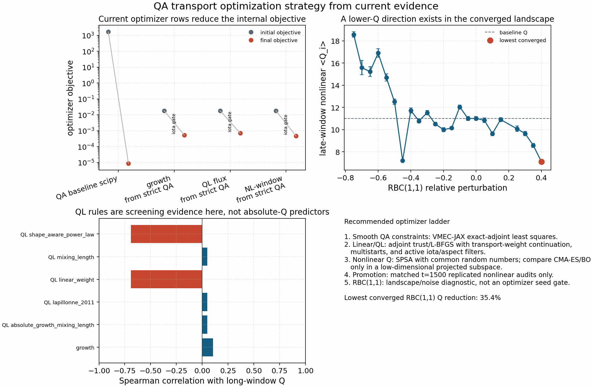

The report sidecars
:download:`vmec_jax_qa_optimizer_strategy_report.json <_static/vmec_jax_qa_optimizer_strategy_report.json>`
and
:download:`vmec_jax_qa_optimizer_strategy_report.csv <_static/vmec_jax_qa_optimizer_strategy_report.csv>`
are the machine-readable claim boundary. In particular,
``nonlinear_absolute_optimization_promoted`` is intentionally false.

Broad nonlinear matrix outcome
------------------------------

The strict broad nonlinear turbulent-flux optimization gate is intentionally
separate from the scoped matched-audit examples above. It requires a completed
18-point matrix with three surfaces, two field-line labels, three ``k_y`` values,
seed/timestep replication, and the post-transient averaging window
``t=[1100,1500]``. The current max-mode-5 campaign did not pass this gate:

- accepted QA/ESS passed ``9/18`` samples and failed the required pass fraction;
- projected weight ``1e-3`` failed early with only ``1/18`` passing samples and
  mean relative reduction below the ``2%`` policy threshold;
- projected weight ``5e-4`` increased heat flux by about ``2.99%`` on its first
  completed sample, so the family was stopped under the all-sample policy.

This is negative broad-promotion evidence, not a release failure for the scoped
examples. It means the current release can cite reduced-objective plumbing and
selected single-point matched audits, but it must not claim broad nonlinear
turbulent-flux stellarator optimization. The machine-readable ledger is
:download:`broad_nonlinear_transport_matrix_negative_evidence.json <_static/broad_nonlinear_transport_matrix_negative_evidence.json>`.

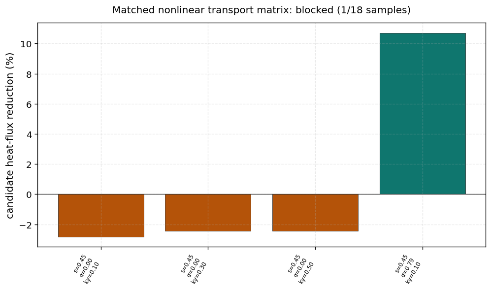

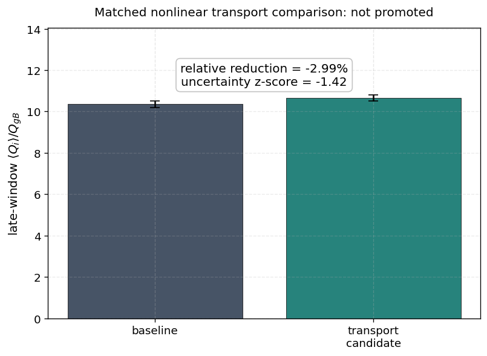

The early-stop logic is part of the scientific guardrail: under a required
``pass_fraction=1.0`` policy, one failed sample is enough to prevent broad
promotion. Stopping a failed family avoids spending GPU time on a candidate that
cannot satisfy the documented gate.

Optimizer-Comparison Manifest
-----------------------------

Optimizer comparisons should be launched from a single manifest, not from
hand-edited shell history.  The generator
:download:`write_vmec_jax_optimizer_comparison_manifest.py <../tools/campaigns/write_vmec_jax_optimizer_comparison_manifest.py>`
writes a strict QA baseline command, matched deterministic transport optimizer
commands, derivative-free outer-loop contracts, and the corresponding
long-window nonlinear-audit commands:

.. code-block:: bash

   python3 tools/campaigns/write_vmec_jax_optimizer_comparison_manifest.py \
     --campaign-root tools_out/vmec_jax_qa_optimizer_comparison_campaign \
     --out-json docs/_static/vmec_jax_qa_optimizer_comparison_manifest.json

The tracked manifest sidecar
:download:`vmec_jax_qa_optimizer_comparison_manifest.json <_static/vmec_jax_qa_optimizer_comparison_manifest.json>`
currently emits:

- one strict upstream QA baseline using SciPy least squares;
- matched ``scipy``/``lsmr``, ``scalar_trust``, and ``lbfgs_adjoint`` transport
  commands for ``growth``, ``quasilinear_flux``, and
  ``nonlinear_window_heat_flux`` from the strict simple-seed QA baseline
  ``input.final``;
- SPSA, CMA-ES, and Bayesian-optimization (``bo``) outer-loop contracts with
  deterministic metric-evaluation and nonlinear-audit command templates.

The manifest comparison fingerprint is part of the campaign contract.  A
method comparison is valid only when the sample set, Boozer resolution,
moment resolution, objective transform, transport weight, optimizer budget, and
strict nonlinear-audit policy match. The machine-readable
``landscape_policy`` keeps the ``RBC(1,1)`` scan diagnostic-only: it diagnoses
objective roughness, metric disagreement, and required nonlinear averaging
windows, but it does not admit optimized candidates or replace the VMEC-JAX
simple-seed QA baseline. The ``optimizer_ladder_policy`` then fixes the
campaign order: continuation/multistart for deterministic linear/QL residuals,
SPSA first for noisy long-window nonlinear ``Q``, and CMA-ES/Bayesian
optimization only as low-dimensional projected comparators. The SPSA entries
also include a concrete ``spsa_candidate_campaign_command`` generated by
``tools/campaigns/write_vmec_jax_spsa_candidate_campaign.py``; it writes simultaneous
plus/minus VMEC inputs, reduced nonlinear-window metric-evaluation commands,
and matched seed/timestep nonlinear-audit config commands. The derivative-free
entries are not claimed to be implemented VMEC-JAX optimizer methods; they are
reproducible outer-loop protocols for noisy objective studies. They become
paper evidence only after the proposed candidates are evaluated and promoted
through the same matched long-window nonlinear audit gates as the
differentiable optimizer outputs.

The first office execution of this ladder is tracked as reduced-metric
strategy evidence:
:download:`vmec_jax_qa_optimizer_ladder_resume_status.json <_static/vmec_jax_qa_optimizer_ladder_resume_status.json>`
and
:download:`vmec_jax_qa_optimizer_ladder_spsa_metric_summary.json <_static/vmec_jax_qa_optimizer_ladder_spsa_metric_summary.json>`.
The scalar-trust and LBFGS-adjoint deterministic runs completed and passed the
authoritative rerun-WOUT admission gate, but their solved-candidate gates
remained false. The four SPSA plus/minus reduced nonlinear-window pairs also
completed; the best reduced metrics are useful for optimizer-design triage,
not for claiming a reduced long-window turbulent heat flux.

Key references for this policy are:

- `Optimization of nonlinear turbulence in stellarators
  <https://www.cambridge.org/core/journals/journal-of-plasma-physics/article/optimization-of-nonlinear-turbulence-in-stellarators/916FCC56452B5B166C14868F56D99AF5>`_:
  direct nonlinear heat-flux optimization, SPSA for noisy heat-flux objectives,
  Boozer ``|B|`` panels, field-line/radius scans, and matched heat-flux traces.
- `Direct Microstability Optimization of Stellarator Devices
  <https://arxiv.org/abs/2301.09356>`_: linear gyrokinetic/quasilinear
  transport-proxy optimization balanced against quasisymmetry.
- `SciPy least_squares
  <https://docs.scipy.org/doc/scipy-1.13.0/reference/generated/scipy.optimize.least_squares.html>`_:
  trust-region reflective least-squares reference behavior.
- `JAXopt LBFGSB <https://jaxopt.github.io/stable/_autosummary/jaxopt.LBFGSB.html>`_,
  `Optax Adam <https://optax.readthedocs.io/en/stable/api/optimizers.html>`_,
  and `CMA-ES <https://cma-es.github.io/>`_: implementation references for
  gradient-based, adaptive first-order, and derivative-free noisy/rugged
  optimization comparators.

Each optimization script also writes long-window initial/final nonlinear ITG
audit manifests after saving the VMEC-JAX result. Those manifests use the same
``write_optimized_equilibrium_transport_configs.py`` path as the production
promotion pipeline. They are not launched by default because the audits are
multi-hour GPU jobs; set ``RUN_LONG_NONLINEAR_AUDIT_COMMANDS = True`` inside
the script to launch them, build replicated initial/final ensemble gates, and
write the initial-vs-final nonlinear ``Q(t)`` comparison plot, or launch the
generated ``run_manifest.json`` commands explicitly on the target workstation.
The generated manifests now use the strict staged nonlinear policy described
above; older ``t=[350,700]`` manifests should be treated as historical
diagnostics unless rerun through the current policy. The manifest separates
restart-ladder segment commands from direct full-horizon commands and adds a
runtime-output gate over the accepted window, so a final ``t=1500`` segment run
from ``t=0`` cannot be mistaken for a true ``t=1500`` nonlinear audit.

The first full-sweep matched QA audit under this strict policy has been
harvested from the office workstation, but it is not admitted. All raw
baseline, growth-optimized, quasilinear-optimized, and nonlinear-window-
optimized runtime jobs completed, yet the produced traces end near ``t=400``.
Because the strict postprocess requested ``t=[1100,1500]``, every replicated
ensemble has ``n_finite_means = 0`` and every matched baseline-vs-candidate
comparison is ``passed = false`` with no finite relative reduction. The
diagnostic artifacts are retained as
``docs/_static/optimized_equilibrium_replicates/vmec_qa_full_sweep_*`` and
``docs/_static/qa_strict_baseline_to_*_strict_baseline.*``. They are command
and admission-policy evidence, not nonlinear holdouts or optimization
successes. A true relaunch must either follow the staged ``700 -> 1100 -> 1500``
restart ladder or use the manifest ``direct_full_horizon_launch_commands``.

The corrected true-full-horizon relaunch is now fully harvested for the strict
QA baseline plus the growth-objective, quasilinear-objective, and
nonlinear-window-objective candidates.  All four rows pass the fail-closed
runtime-output gate and replicated seed/timestep ensemble gate over
``t=[1100,1500]``.  The baseline has ensemble mean ``<Q_i> = 11.580``, mean
relative spread ``0.0381``, and combined SEM/mean ``0.0195``.  The growth
candidate has ensemble mean ``<Q_i> = 11.510``, mean relative spread
``0.0427``, and combined SEM/mean ``0.0124``.  The quasilinear candidate has
ensemble mean ``<Q_i> = 11.636``, mean relative spread ``0.0234``, and combined
SEM/mean ``0.0164``.  The nonlinear-window candidate has ensemble mean
``<Q_i> = 11.609``, mean relative spread ``0.0366``, and combined SEM/mean
``0.0177``.  These artifacts close the question of whether the candidate traces
are real saturated long-window signals, but they do not promote the candidates
as transport optimizations: the matched growth comparison gives only ``0.60%``
relative reduction with uncertainty ``z = 0.26`` against the ``4%`` promotion
gate, while the quasilinear and nonlinear-window comparisons are slightly worse
than baseline (``-0.49%``, ``z = -0.19``; ``-0.25%``, ``z = -0.09``).

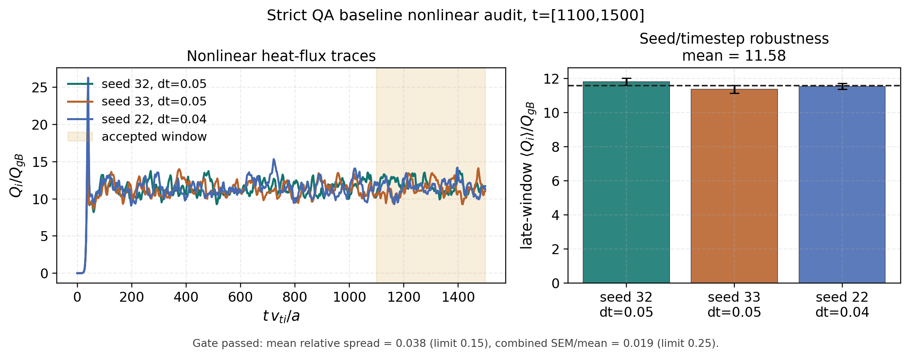

   True full-horizon strict QA baseline audit. The late window
   ``t=[1100,1500]`` passes the seed/timestep robustness gate and provides the
   matched reference for the candidate comparisons below.

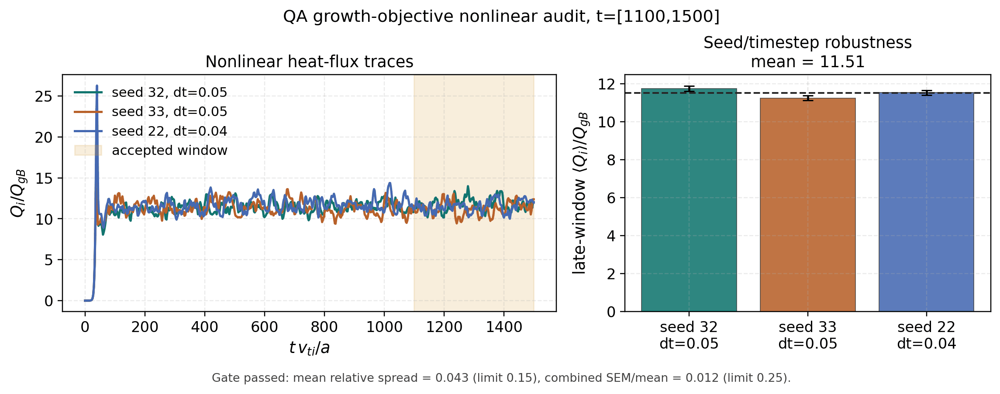

   True full-horizon growth-objective QA audit. The late window
   ``t=[1100,1500]`` passes the seed/timestep robustness gate, but the panel is
   a candidate-audit artifact rather than a matched optimization-success claim.

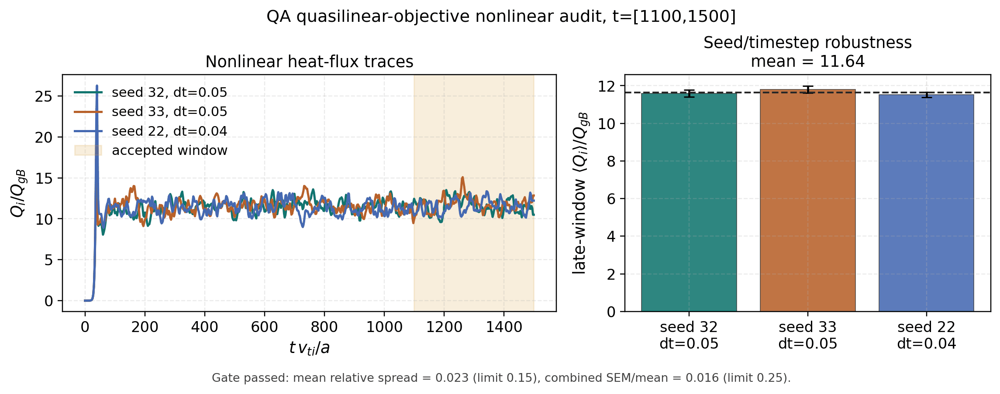

   True full-horizon quasilinear-objective QA audit. The late-window ensemble
   passes the seed/timestep robustness gate, but its matched comparison below is
   slightly worse than the strict QA baseline.

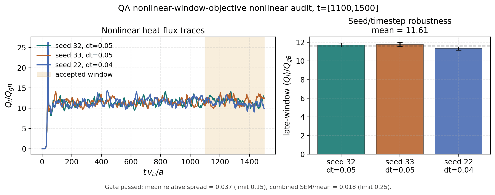

   True full-horizon nonlinear-window-objective QA audit. The late-window
   ensemble is statistically robust across two seeds and one timestep variant;
   the matched baseline comparison below does not promote it as a reduction.

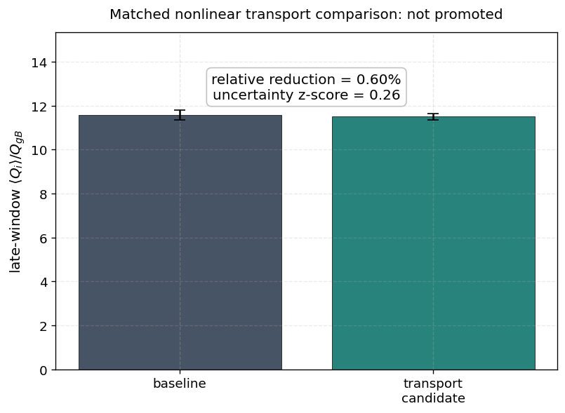

   Matched baseline-to-growth nonlinear transport comparison. The growth
   objective produces only a ``0.60%`` reduction with ``z = 0.26``, so it does
   not pass the ``4%`` promotion gate.

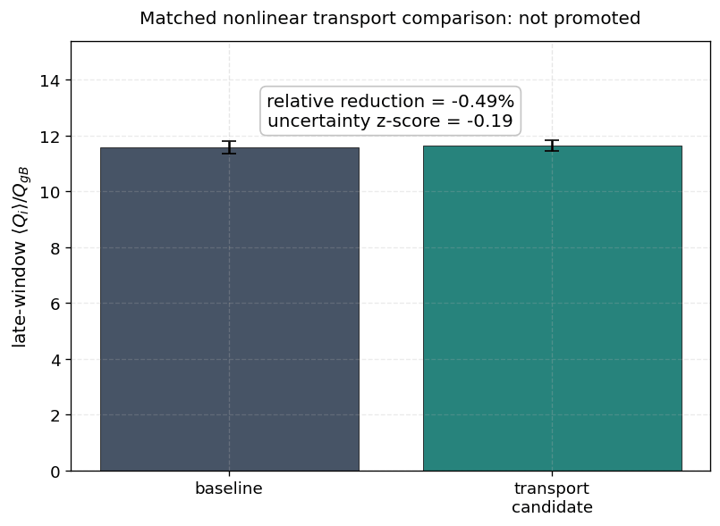

   Matched baseline-to-quasilinear transport comparison. The quasilinear
   candidate is ``0.49%`` higher than the strict QA baseline with ``z = -0.19``,
   so it is not admitted as nonlinear transport reduction evidence.

   Matched baseline-to-nonlinear-window transport comparison. The candidate is
   slightly worse than the strict QA baseline in the long post-transient window
   and is not promoted.

The parameter-scan example calls
``tools/artifacts/build_vmec_boundary_transport_landscape.py`` with top-level constants.
Its default mode reuses the tracked strict-baseline ``RBC(1,1)`` reduced-metric
JSON. Set ``EVALUATE_REDUCED = True`` to rerun the deterministic growth and
explicit quasilinear metrics for a new coefficient scan. Replicated nonlinear
transport-window ensemble gates are intentionally a separate promotion step and
are not overlaid unless explicit ensemble sidecars are supplied.

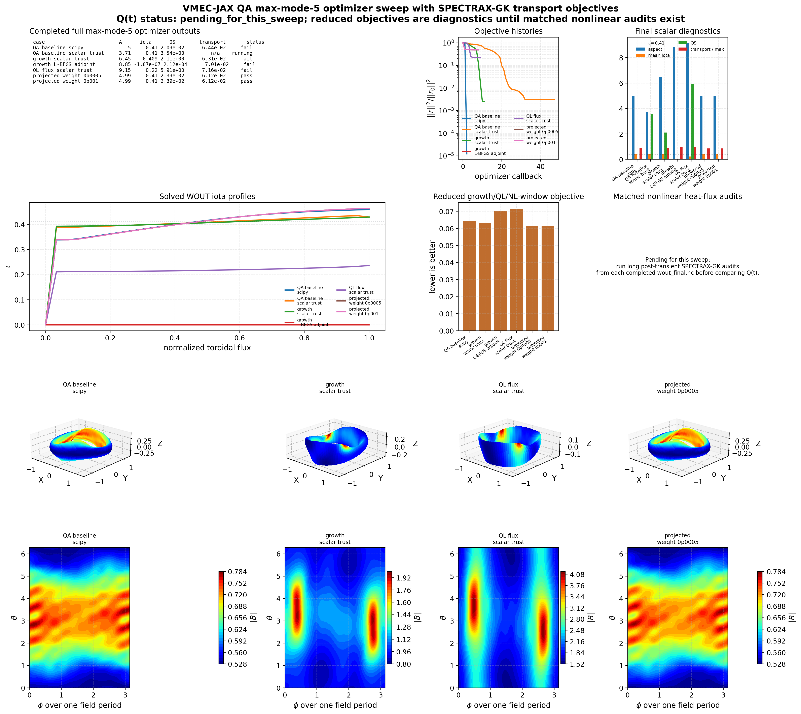

   README-facing strict QA optimizer sweep built from tracked VMEC-JAX WOUTs and
   SPECTRAX-GK reduced transport residuals. The sidecar
   :download:`vmec_jax_qa_full_sweep_panel.json <_static/vmec_jax_qa_full_sweep_panel.json>`
   records the exact artifact provenance.

Full Max-Mode-5 Optimizer Sweeps
--------------------------------

For manuscript-facing comparisons between optimizer algorithms, run the full
``max_mode = 5`` VMEC-JAX solved-boundary sweep on the workstation/GPU node and
then build the comparison panel from the real ``history.json`` and
``wout_final.nc`` outputs:

.. code-block:: bash

   # First make an admission-grade constraints-only baseline. This uses the
   # upstream VMEC-JAX QA simple seed, objective tuples, ESS scaling, and
   # max-mode-5 controls, but increases the solve budget/tightens tolerances so
   # the final WOUT can pass the strict aspect/iota/QS gate. The default iota
   # target is 0.4102 while the admission gate remains iota >= 0.41.
   python tools/campaigns/vmec_jax_qa_low_turbulence_optimization.py \
     --strict-upstream-qa-baseline --solver-device gpu \
     --outdir runs_onepoint/qa_baseline_strict_upstream

   # On the GPU node, from a clean SPECTRAX-GK/vmec_jax/booz_xform_jax clone,
   # restart transport optimizers from the strict solved QA baseline.  The
   # representative differentiable residual below is intentionally smaller than
   # the later validation grid; full multi-surface nonlinear claims require
   # separate post-optimization audits.
   python tools/campaigns/vmec_jax_qa_low_turbulence_optimization.py \
     --input runs_onepoint/qa_baseline_strict_upstream/input.final \
     --disable-mode-continuation --max-mode 5 --min-vmec-mode 7 \
     --target-aspect 5.0 --min-iota 0.41 --disable-iota-profile-floor \
     --mboz 21 --nboz 21 \
     --surfaces 0.64 --alphas 0.0 --ky-values 0.30 \
     --transport-kind growth --method scalar_trust --spectrax-weight 0.10 \
     --solver-device gpu --outdir runs_onepoint/growth_scalar_trust

   # Locally, after copying the campaign directory back:
   python tools/artifacts/build_vmec_jax_qa_full_sweep_panel.py \
     --run-root tools_out/vmec_jax_qa_full_sweep_YYYYMMDD \
     --out docs/_static/vmec_jax_qa_full_sweep_panel.png --pdf

The panel builder compares the upstream-style QA baseline plus any completed
growth-rate, quasilinear-flux, nonlinear-window, and projected/admission
variants whose run directories are present. The current README-facing sweep
uses the strict max-mode-5 QA baseline and three transport restarts from that
baseline. It plots objective histories, solved-WOUT ``iota`` profiles, final
aspect/``iota``/QS diagnostics, reduced transport metrics, 3-D LCFS surfaces
colored by ``|B|``, and LCFS ``|B|`` maps. It only plots nonlinear heat-flux
traces when matched long-window SPECTRAX-GK audit CSV files are present below
the corresponding candidate directory.

This distinction is deliberate. The optimizer residual named
``nonlinear_window_heat_flux`` is a differentiable screening objective based on
linear SPECTRAX-GK rows and a smooth late-window envelope. It is useful for
ranking candidate directions, but it is not a saturated turbulent heat-flux
measurement. A candidate can be promoted to a nonlinear transport claim only
after generating replicated post-transient SPECTRAX-GK runs from its concrete
``wout_final.nc`` and demonstrating running-average convergence of ``Q(t)``.
If a constraints-only QA baseline stops a few ``1e-5`` below
``iota >= 0.41`` because of optimizer ``xtol`` termination, treat it as
precision-limited and rerun the strict baseline preset above. Do not promote it
by relaxing the solved-WOUT gate; that would make later transport reductions
depend on an inconsistent baseline.
The strict preset uses a small target buffer rather than a relaxed gate:
``target iota = 0.4102`` and solved-WOUT admission ``iota >= 0.41``.
The tracked exact SciPy/ESS strict-baseline evidence is stored in
``docs/_static/vmec_jax_qa_strict_baseline/summary.json``. It terminates at
``nfev = 39`` with aspect ``5.000154``, mean iota ``0.4101997``, QS residual
``2.60e-4``, and a passed solved-WOUT gate. The iota-profile floor is disabled
for this baseline because the upstream ``QA_optimization.py`` objective uses a
high-weight mean-iota target, not a profile-floor constraint.
Publication-facing admission must also require input/WOUT reproducibility.
After this strict run, independent replay/rerun paths did not reproduce the
same rotational transform: a one-evaluation VMEC-JAX replay from
``input.final`` reported mean iota near ``0.4085``, while a fresh
fixed-boundary ``wout_final_rerun.nc`` reported mean iota near ``0.41169``
instead of the optimizer-state ``0.41020``. Therefore a saved optimizer-state
``wout_final.nc`` is not enough: run the driver with
``--save-rerun-wouts --require-rerun-wout-gate`` and require
``wout_final_rerun.nc`` to match the optimizer-state WOUT and pass the same
aspect/iota/profile gates before attaching SPECTRAX-GK transport metrics or
projected line-search candidates to that input deck.
There is now also an explicit rerun-WOUT-authoritative path. If that policy is
chosen, the deterministic ``wout_final_rerun.nc`` must pass its own
aspect/iota-profile/quasisymmetry admission gate, and all downstream
SPECTRAX-GK audits must use that rerun WOUT as the equilibrium source. The
current strict rerun WOUT passes this separate gate with mean iota
``0.411691`` and QS residual ``1.85e-4``, while still failing reproducibility
against the optimizer-state WOUT. Both facts must be reported.
When using ``tools/campaigns/run_vmec_jax_guarded_transport_ladder.py`` from this
baseline, pass ``--disable-iota-profile-floor`` at the ladder level; the tool
forwards the same convention to each candidate driver command.
Also pass ``--baseline-metric-json`` pointing to the eval-only reduced metric
for the same transport objective. Otherwise a constraints-only baseline has no
transport metric in ``history.json`` and should not be compared through its QA
objective value.
For the 18-point production sample set on 16 GB GPUs, use
``--surface-chunk-size 1`` for eval-only reduced-metric tools and
``--surface-gradient-chunk-size 1`` for transport-gradient diagnostics. This
evaluates the raw weighted-mean transport objective one surface chunk at a
time and applies ``raw``/``scaled``/``log1p`` only after the chunks are
aggregated, so it is the same scalar objective with lower diagnostic memory.
The full VMEC-JAX reverse-mode optimizer still OOMs at the strict
``max_mode=5``, ``mboz=nboz=21``, 18-point setting on 16 GB GPUs because the
final-state cotangent path remains monolithic. Until that VMEC/Boozer
cotangent is chunked, candidate generation should use the chunked-gradient
diagnostic plus boundary-chain-gated projected line search, with CPU replay
for boundary-chain probes when the GPU path OOMs.

Transport-admission bookkeeping for the strict baseline is separated from
optimization. After a baseline or candidate writes ``input.final``, run:

.. code-block:: bash

   python tools/campaigns/evaluate_vmec_jax_spectrax_transport_metric.py \
     --input tools_out/vmec_jax_qa_strict_baseline/input.final \
     --out-json tools_out/vmec_jax_qa_strict_baseline/growth_metric.json \
     --transport-kind growth --mboz 21 --nboz 21 --solver-device cpu

The same command accepts ``--transport-kind quasilinear_flux`` and
``--transport-kind nonlinear_window_heat_flux``. The evaluator solves the
supplied fixed boundary once through VMEC-JAX and calls the SPECTRAX-GK
objective directly; it does not update the boundary or take an outer
least-squares step. On the passing strict QA baseline, the default 18-point
sample set ``s=(0.45,0.64,0.78)``, ``alpha=(0,pi/4)``, and
``k_y rho_i=(0.10,0.30,0.50)`` gives log1p metrics ``0.03657107649`` for
growth, ``0.1230452010`` for quasilinear flux, and ``0.08010670290`` for the
nonlinear-window reduced heat-flux objective. These numbers are reduced
admission metrics only. Candidate promotion still requires solved-WOUT,
boundary-gradient/branch, and matched long-window nonlinear gates.

   Full ``max_mode=5`` optimizer-output sweep from the office GPU node. The
   admitted constraints-only row follows the upstream VMEC-JAX QA simple-seed
   setup and passes the strict aspect/iota/QS gate. The growth, quasilinear, and
   nonlinear-window transport rows restart from that solved QA input. Their
   strict solved-WOUT gate is tripped by a small mean-iota shortfall, so the
   figure treats them as diagnostic-only non-admitted candidates rather than
   promoted optimized stellarators. The subsequent matched office audit is now
   harvested but still not admitted: its traces stop near ``t=400``, outside
   the strict ``t=[1100,1500]`` acceptance window. The Boozer-LCFS ``|B|``
   panels use unfilled contours so departures from quasisymmetry remain visible
   without a filled density map.

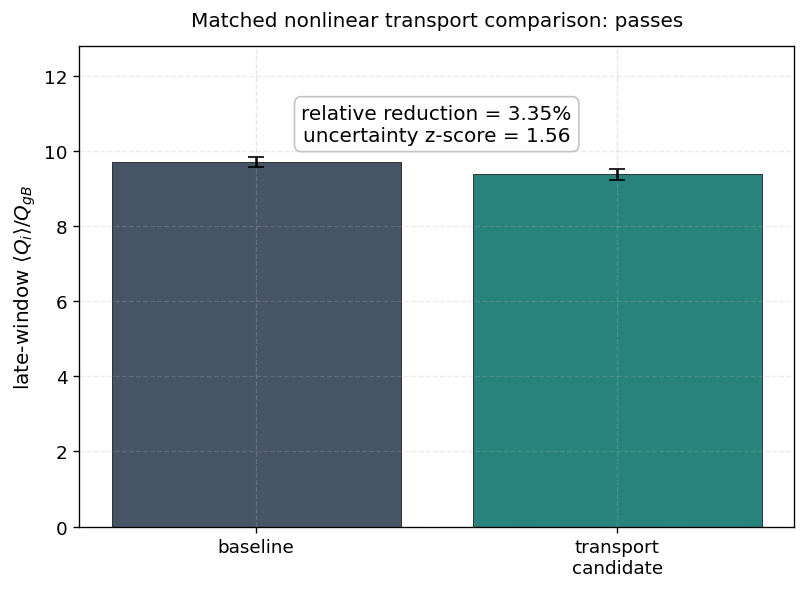

   Matched single-point nonlinear transport audit for the full max-mode-5
   projected weight ``1e-3`` candidate. Both baseline and candidate
   seed/timestep ensembles pass their individual long-window gates. The
   candidate lowers the late-window mean ion heat flux from ``9.695`` to
   ``9.370``: a ``3.35%`` reduction with uncertainty separation ``z=1.56``.
   The projected weight ``5e-4`` candidate also passes with ``2.68%``
   reduction. These are scoped single-surface, single-field-line,
   single-``k_y`` positive audits, not broad stellarator-optimization claims.
   These matched nonlinear traces are tied to the earlier sweep baseline. The
   later 18-point matrix campaign against the strict max-mode-5 baseline failed
   for both projected-weight families, so the single-point positives remain
   candidate-screening evidence only.

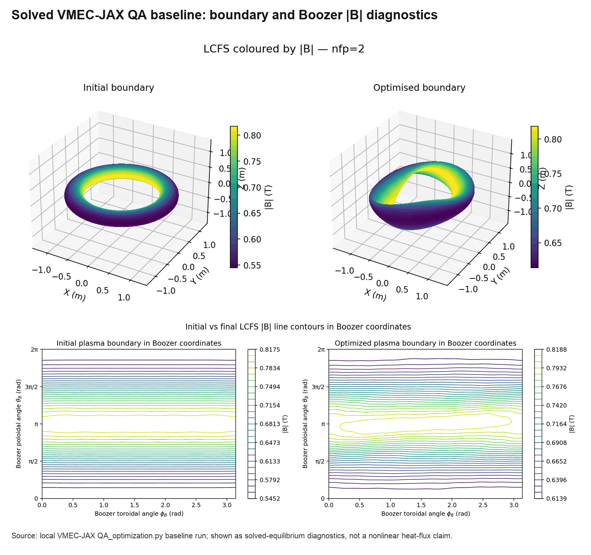

   Solved VMEC-JAX QA baseline diagnostic generated from the local
   ``QA_optimization.py`` workflow. The top row compares initial and optimized
   LCFS surfaces colored by ``|B|``; the bottom row shows the corresponding
   Boozer-LCFS ``|B|`` contours. This is the figure to use when discussing the
   solved QA baseline geometry. It is not a nonlinear heat-flux optimization
   claim.

Configurable Solved-Boundary Driver
-----------------------------------

For dry-runs, guarded transport-weight ladders, profile-floor experiments, and
small optimizer-budget checks, use the configurable driver instead of the three
literal QA scripts:

.. code-block:: bash

   python tools/campaigns/vmec_jax_qa_low_turbulence_optimization.py --dry-run

The driver can target aspect ``A = 6`` and add an explicit solved-profile floor
``iota(s) >= 0.41``. That profile floor is intentionally separate from the
upstream mean-iota target because bounded audits have shown that a candidate can
satisfy the mean target while a point in the WOUT ``iota`` profile remains below
``0.41``. The upstream QA baseline itself remains the aspect-5 VMEC-JAX script
with the high-weight ``MeanIota`` objective.

Development-Only Reduced Diagnostics
------------------------------------

The reduced max-mode-1 scripts are development diagnostics for AD/finite-
difference checks, UQ plumbing, figure rendering, and sample-set reducers. They
are intentionally outside ``examples/optimization`` and should not be used as
solved QA stellarator optimization evidence.

.. code-block:: bash

   python examples/theory_and_demos/reduced_stellarator_itg/stellarator_itg_growth_optimization.py
   python examples/theory_and_demos/reduced_stellarator_itg/stellarator_itg_quasilinear_flux_optimization.py
   python examples/theory_and_demos/reduced_stellarator_itg/stellarator_itg_nonlinear_heat_flux_optimization.py
   python examples/theory_and_demos/reduced_stellarator_itg/compare_stellarator_itg_optimizations.py

They run a reduced max-mode-1 QA control model and are deliberately fast enough
for local tests and figure regeneration. They do not generate the upstream
VMEC-JAX ``QA_optimization.py`` final WOUT, and their synthetic LCFS views must
not be used as README or manuscript evidence for solved QA geometry.

The shared constrained residual is

.. math::

   ||r(x)||^2 =
   w_A \left({A(x)-A_0 \over A_0}\right)^2
   + w_\iota \left(\iota(x)-\iota_0\right)^2
   + w_{QS} R_{QS}(x)^2
   + w_R ||x||^2
   + r_T(x)^2 ,

where ``x`` is the reduced max-mode-1 QA control vector. The transport residual
``r_T`` is one of:

- ``growth``: the positive dominant ITG growth-rate observable ``gamma``;
- ``quasilinear_flux``: a mixing-length proxy proportional to
  ``gamma Q_i / <k_perp^2>`` with tracked saturation metadata;
- ``nonlinear_heat_flux``: the late-window mean of the differentiable envelope

  .. math::

     {dE \over dt} = 2\gamma E - \alpha E^2,\qquad
     Q_{\rm env}(t) = W_i E(t).

The comparison artifact
``docs/_static/stellarator_itg_optimization_comparison.png`` shows objective
histories, reduced nonlinear ``Q_{\rm env}`` scans, fixed-gradient traces,
reduced LCFS ``|B|`` surfaces, and reduced Boozer-coordinate LCFS ``|B|`` maps.
These are reduced visualization diagnostics, not solved VMEC WOUT surfaces; in
particular, the synthetic surface can look nearly axisymmetric when the reduced
helical-control amplitude is small.

Aspect-6 QA Low-Turbulence Comparison
-------------------------------------

The new aspect-6 comparison exercises the optimization workflow that is needed
before a full ``vmec_jax -> booz_xform_jax -> SPECTRAX-GK`` nonlinear design
loop is promoted. It follows the fixed-boundary QA objective structure used by
``vmec_jax`` examples and by stellarator microturbulence optimization studies
[Jorge24]_ [Kim24]_: constrain the MHD/geometry family, then add a turbulence
objective whose gradients are audited before any design claim is made. The
current artifact is intentionally reduced and trace-safe. It is useful for
algorithm development, AD/finite-difference validation, uncertainty plumbing,
and manuscript figure layout; it is not a solved-VMEC, long-window nonlinear
transport optimization claim.

Run the complete comparison with:

.. code-block:: bash

   python tools/artifacts/build_qa_low_turbulence_comparison.py --pdf
   python tools/artifacts/build_qa_low_turbulence_time_horizon_audit.py --pdf

The command writes:

- ``docs/_static/qa_low_turbulence_comparison.png`` and ``.pdf`` for the
  publication panel;
- ``docs/_static/qa_low_turbulence_comparison.json`` as the audit source;
- ``docs/_static/qa_low_turbulence_comparison.summary.csv`` for the optimized
  design metrics;
- ``docs/_static/qa_low_turbulence_comparison.scan.csv`` for the fixed-
  ``a/L_T`` density-gradient scan.
- ``docs/_static/qa_low_turbulence_time_horizon_audit.png`` and sidecars for
  the reduced nonlinear-envelope horizon check.

To experiment with the solved-boundary VMEC-JAX path, first assemble the
objective without solving. This path requires the optional ``vmec_jax`` and
``booz_xform_jax`` packages because it works from in-memory VMEC states rather
than pre-generated geometry files:

.. code-block:: bash

   python tools/campaigns/vmec_jax_qa_low_turbulence_optimization.py \
     --dry-run \
     --use-simple-seed \
     --max-mode 5 \
     --min-vmec-mode 7

Then run the two comparable branches:

.. code-block:: bash

   python tools/campaigns/vmec_jax_qa_low_turbulence_optimization.py \
     --constraints-only \
     --use-simple-seed \
     --max-mode 5 \
     --min-vmec-mode 7 \
     --make-plots \
     --outdir runs/qa_constraints_only

   python tools/campaigns/vmec_jax_qa_low_turbulence_optimization.py \
     --use-simple-seed \
     --max-mode 5 \
     --min-vmec-mode 7 \
     --make-plots \
     --outdir runs/qa_plus_reduced_nonlinear_heat_flux \
     --spectrax-weight 0.05 \
     --transport-kind nonlinear_window_heat_flux \
     --surfaces 0.45,0.64,0.78 \
     --alphas 0.0,0.7853981633974483 \
     --ky-values 0.10,0.30,0.50

On a GPU node, append ``--solver-device gpu``; otherwise JAX will use the
available default backend. The QA-only branch defaults to the upstream
VMEC-JAX ``scipy`` optimizer. The transport-aware branch defaults to
``scalar_trust`` because dense exact SciPy Jacobians are memory-heavy for the
SPECTRAX-GK transport residual; override ``--method`` only when you have a
specific optimizer/memory reason.

Both use the upstream VMEC-JAX simple-seed convention of solving the requested
``max_mode`` branch directly rather than using mode continuation, and both use
``mboz=nboz=21`` for the transport objective and Boozer LCFS plots. The
SPECTRAX-GK low-turbulence study targets ``A=6`` and adds a signed
solved-profile floor ``iota(s) >= 0.41``. The upstream VMEC-JAX
``QA_optimization.py`` baseline targets ``A=5`` and does not include that
profile-floor gate; to reproduce it, run the constraints-only command with
``--target-aspect 5.0`` and ``--disable-iota-profile-floor``. The
transport-aware A=6 branch adds a small SPECTRAX-GK residual. A passed
VMEC-JAX optimization is still only a candidate; the next required audit is a
WOUT profile check followed by a matched long-window SPECTRAX-GK nonlinear
heat-flux comparison of the final WOUTs.

The A=6 admission artifact records ``mean_iota_lower_bound`` and
``iota_profile_floor`` fields. Legacy ``target_*`` iota fields remain in the
JSON only as compatibility aliases and should be interpreted as lower-bound
admission gates, not as the upstream QA script's exact mean-iota objective.

For bounded local candidate pairs, build the solved-boundary audit panel with:

.. code-block:: bash

   python tools/artifacts/build_vmec_jax_qa_transport_candidate_comparison.py --pdf

On this development workstation the command uses the local authoritative
sidecar directories when they are present. In a clean clone those directories
are absent, so the tool falls back to the tracked JSON payload and reproduces
the shipped panel without requiring large transient ``tools_out`` artifacts.

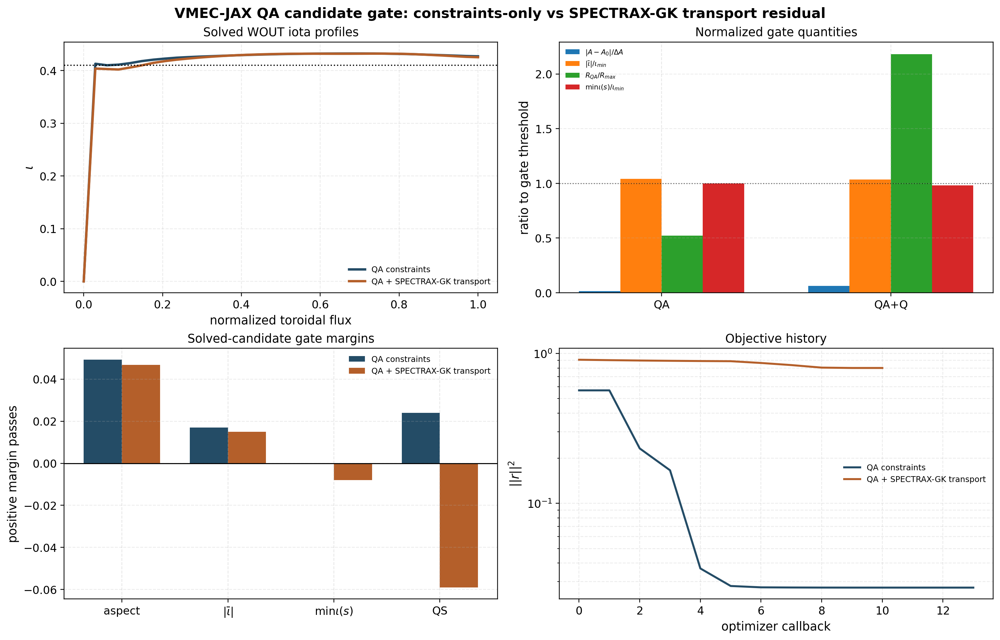

   Bounded VMEC-JAX solved-boundary plumbing audit. Admission is fail-closed:
   only a final authoritative ``solved_wout_gate.json`` can place a candidate in
   the expensive long-window nonlinear audit queue. Gates reconstructed from
   ``history.json`` plus ``wout_final.nc`` are recorded as advisory diagnostics
   only, because scalar histories can mix optimizer-residual and VMEC-state
   conventions. The current refreshed campaign admits the QA-only branch and
   blocks the scalar transport-weight refinement until a
   constraint-preserving/projection admission method produces a solved WOUT that
   keeps the aspect, profile-iota, and quasisymmetry margins.

The compact status panel combines that admission result with the reduced
growth-rate/quasilinear line-search diagnostics, the quasilinear model-selection
status, and the long-window nonlinear audit anchor:

.. code-block:: bash

   python tools/artifacts/build_vmec_jax_qa_transport_optimization_status.py \
     --campaign-admission-json docs/_static/nonlinear_campaign_admission_report.json \
     --pdf

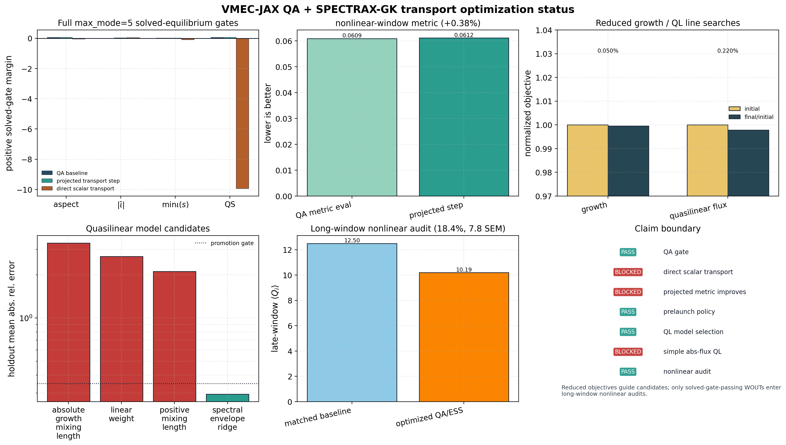

   Fail-closed max-mode-5 QA transport-optimization status. The QA
   solved-equilibrium branch passes the aspect/iota/QS gate. The direct scalar
   transport-residual branch is blocked because it breaks solved-equilibrium
   gates. Earlier projected-gradient artifacts in this status panel remain
   useful negative controls; the regenerated JSON records
   ``projected_transport_improved=false`` for this row, so it is not a promoted
   projected-candidate transport result. The quasilinear model-selection entry
   is a fail-closed model-development diagnostic, not a universal absolute-flux
   predictor. The nonlinear heat-flux bar pair is the separate replicated
   long-window audit anchor used to keep optimized-equilibrium transport claims
   distinct from reduced-objective optimization attempts. The regenerated JSON
   now also records ``claim_evidence_level`` and
   ``claim_promotion_blockers``; a raw nonlinear-audit ``passed=true`` is
   promoted only when its ``claim_level`` matches the expected matched-audit
   level and the comparison metrics are finite. The older prelaunch-policy row
   is retained as a legacy control: it combines the earlier narrow-scan
   replicated landscape admission, an 18-point selected-candidate reduced gate,
   and a deliberately failing weak-reference gate. The refreshed
   strict-baseline ``RBC(1,1)`` landscape is documented separately below and
   needs new matched nonlinear ensemble sidecars before it can feed the same
   admission policy.

For restart sweeps from an already optimized ``input.final``, pass
``--disable-mode-continuation`` to
``tools/campaigns/vmec_jax_qa_low_turbulence_optimization.py``. That
keeps the requested ``max_mode`` branch fixed instead of rebuilding the
lower-mode continuation ladder, which is the efficient path for profile-floor,
target-iota, and transport-weight refinements after a solved WOUT already
passes the basic aspect/iota/QS gates.

The driver also writes ``solved_wout_gate.json`` after each solve and fails
closed by default if the final equilibrium violates the aspect, mean-iota,
solved iota-profile, or quasisymmetry limits. This gate exists because a small
transport residual is not useful if the optimizer has moved to a degraded
equilibrium branch. Failed candidates can still be retained for diagnostics with
``--allow-failed-solved-wout-gate``, but they should not be promoted to
long-window nonlinear turbulent-flux audits.

Guarded transport-weight ladders should be run through the explicit
orchestration tool rather than by manually picking a successful-looking
``history.json``:

.. code-block:: bash

   python tools/campaigns/run_vmec_jax_guarded_transport_ladder.py \
     --constraints-dir runs/qa_constraints_only \
     --outdir runs/qa_transport_ladder \
     --weights 0.0005,0.001,0.0025,0.005 \
     --driver-args "--max-mode 5 --min-vmec-mode 7 --mboz 21 --nboz 21"

The tool restarts each transport candidate from the QA ``input.final``, keeps
failed candidates for inspection, and selects only the largest transport weight
whose final authoritative ``solved_wout_gate.json`` passes and whose selected
lower-is-better transport metric improves relative to the admitted QA baseline.
By default the ladder searches for ``transport_objective_final``,
``spectrax_objective_final``, ``transport_metric_final``, then
``objective_final`` as a last-resort proxy; use repeated
``--transport-metric-key`` options when a run records a cleaner transport-only
diagnostic, and ``--min-transport-improvement`` to require a nonzero relative
improvement. The VMEC-JAX/SPECTRAX-GK optimization example writes
``transport_objective_final`` into ``history.json`` after every completed solve,
including constraints-only baselines, so production admission does not need to
use total objective history except for legacy artifacts. If no transport-weight
candidate satisfies both the physical gate and the transport-improvement gate,
the QA-only WOUT remains the only admissible candidate for expensive matched
long-window nonlinear audits. This is an admission policy, not a proof of
reduced turbulent heat flux.

When the guarded ladder preserves the solved-equilibrium gate but reports no
improvement in the explicit transport metric, the next step is a local
boundary-gradient diagnostic rather than another blind increase in the scalar
transport weight:

.. code-block:: bash

   python tools/artifacts/build_vmec_jax_transport_gradient_diagnostic.py \
     --input runs/qa_constraints_only/input.final \
     --out-json runs/qa_constraints_only/transport_gradient.json \
     --max-mode 5 --min-vmec-mode 7 \
     --mboz 21 --nboz 21 \
     --transport-kind nonlinear_window_heat_flux \
     --surfaces 0.45,0.64,0.78 \
     --alphas 0.0,0.7853981633974483 \
     --ky-values 0.10,0.30,0.50 \
     --surface-gradient-chunk-size 1 \
     --solver-device gpu

The diagnostic rebuilds a transport-only VMEC-JAX objective at the solved
input, evaluates the residual and reverse scalar-gradient with respect to the
active boundary coefficients, ranks the leading ``R``/``Z`` Fourier directions,
and classifies the objective as either locally sensitive or locally
flat/underconditioned. A sensitive report supports a constraint-preserving
projected update or constrained line search along the leading components. A
flat report means the transport observable, sample set, finite-difference
scale, or nonlinear-window evidence must be changed before more optimization
iterations are scientifically meaningful. The gradient diagnostic now uses the
same fail-closed sample contract as the projected-input writer: the default is
the 18-point ``3 x 2 x 3`` surface/field-line/``k_y`` set above, and
single-point exploratory gradients require
``--allow-underresolved-sample-set``. Such exploratory gradients are not valid
admission evidence for long nonlinear audits.

On 16 GB GPUs, keep ``--surface-gradient-chunk-size 1`` for the 18-point
production contract. It computes raw residual gradients one surface at a time,
combines them with the original weighted-mean sample weights, and applies the
scalar transform once after aggregation. This is mathematically the same
weighted-mean gradient path for ``mean``/``weighted_mean`` reductions, but it
avoids materializing the full 18-sample reverse pass in one GPU allocation.

Before using a VMEC-JAX/SPECTRAX-GK transport gradient for a projected update,
rerun a small set of leading active-boundary components with central finite
differences:

.. code-block:: bash

   python tools/artifacts/build_vmec_jax_transport_gradient_diagnostic.py \
     --input runs/qa_constraints_only/input.final \
     --out-json runs/qa_constraints_only/transport_gradient_fd.json \
     --max-mode 5 --min-vmec-mode 7 \
     --mboz 21 --nboz 21 \
     --transport-kind nonlinear_window_heat_flux \
     --surfaces 0.45,0.64,0.78 \
     --alphas 0.0,0.7853981633974483 \
     --ky-values 0.10,0.30,0.50 \
     --surface-gradient-chunk-size 1 \
     --fd-check-indices 22,24,27,28 \
     --fd-check-step 1e-4 \
     --require-fd-consistency \
     --solver-device gpu

The finite-difference check is intentionally opt-in because each checked
coefficient requires two extra objective evaluations. With
``--surface-gradient-chunk-size`` enabled, those plus/minus evaluations use the
same chunked weighted-mean scalar residual as the reverse-gradient report, so
the comparison is between the advertised AD gradient and the actual objective
that would drive the line search. Exit code ``3`` means the reverse gradient and
central finite differences disagree or the finite-difference signal is too
small to be useful. In that case, do not promote the reverse gradient as
end-to-end differentiability evidence; repair the VMEC/Boozer/SPECTRAX AD path
or use sparse finite differences only as diagnostics.

The historical tracked blocker artifact is
``docs/_static/vmec_jax_transport_gradient_single_fd_gate.json``. It is an
under-resolved single-sample diagnostic, not production admission evidence. It
records the earlier failure mode where sparse central finite differences were
nonzero but the reported reverse gradient was zero. That artifact remains a
regression example, but the current validation path is more precise: use the
chain probe below to separate final-state transport cotangents, raw exact-solve
finite differences, frozen-axis initial-state finite differences, and VMEC-JAX
exact-tape JVP/VJP replay.

The SPECTRAX-GK growth-rate scalar used by this VMEC-JAX transport residual
uses a branch-fixed implicit eigenvalue VJP rather than raw reverse-mode AD
through non-Hermitian eigenvectors. The local solver-ready gates compare that
VJP against central finite differences. The full VMEC-JAX/Boozer path still
must pass the sparse coefficient checks above before a projected update is
promoted, because branch changes, Boozer replay memory pressure, or
ill-conditioned equilibria can invalidate an otherwise correct local
eigenvalue derivative.

The equal-arc VMEC/Boozer remap keeps the moving-coordinate sensitivity in the
SPECTRAX-GK geometry path. Office diagnostics showed that nonfinite geometry
cotangents originated one level upstream in ``booz_xform_jax`` inactive Fourier
branches; safe denominators in those branches make VMEC state, Boozer input,
Boozer output, and SPECTRAX-GK geometry profile gradients finite. The audited
upstream fix is ``booz_xform_jax`` commit ``1d5e8c`` or newer.

When sparse AD/FD checks fail, run the boundary-chain probe on one leading
coefficient before changing the optimizer:

.. code-block:: bash

   python tools/campaigns/audit_vmec_jax_boundary_chain.py \
     --input runs/qa_constraints_only/input.final \
     --out-json runs/qa_constraints_only/boundary_chain_rc14.json \
     --index 28 \
     --step 1e-4 \
     --max-mode 5 --min-vmec-mode 7 \
     --transport-kind nonlinear_window_heat_flux \
     --surfaces 0.45,0.64,0.78 \
     --alphas 0.0,0.7853981633974483 \
     --ky-values 0.10,0.30,0.50 \
     --mboz 21 --nboz 21 \
     --inner-max-iter 500 --inner-ftol 1e-10

The probe writes a ``summary`` generated by
``spectraxgk.geometry.vmec_boundary_chain.build_boundary_chain_summary``. The key
distinction is the VMEC-JAX optimizer's frozen-axis convention: the accepted
magnetic-axis branch is held fixed when differentiating the boundary-to-initial
state map. Raw plus/minus exact solves may move that initialization branch and
can therefore disagree with the optimizer derivative even when the frozen-axis
JVP and VJP are internally transposed.

The latest clean-stack local audit used ``vmec_jax`` main commit ``f14787b``,
``booz_xform_jax`` commit ``1d5e8c``, and the authoritative QA restart. With a
short ``120``-iteration exact-solve budget, the raw ``rc14`` exact-solve finite
difference was branch-sensitive: the raw initial-state FD norm was about
``115`` times larger than the frozen-axis FD norm, while the frozen-axis tape
JVP and VJP agreed to roundoff. Raising the exact-solve budget to ``500`` or
``1000`` iterations reduced the same ``rc14`` cost-gradient AD/FD discrepancy
to about ``7.5%`` at ``eps = 1e-4``. The interpretation is therefore not a
generic SPECTRAX final-state derivative failure: the promoted derivative
contract is frozen-axis, convergence-controlled, and must be checked with a
sparse FD tolerance appropriate to the VMEC solve residual and branch
conditioning. Raw exact-solve FD remains a diagnostic for convergence and
branch sensitivity, not the sole definition of the optimizer derivative.

A four-component follow-up at the same mode-21 Boozer resolution tested the
previously nonzero finite-difference directions ``rc11``, ``rc12``, ``zs13``,
and ``rc14``. The collection is mixed rather than promotion-ready: all four
frozen-axis JVP/VJP contractions are internally transposed, but only ``zs13``
and ``rc14`` agree with raw exact-solve FD within the 10% sparse gate. ``rc11``
and ``rc12`` remain branch-sensitive, and increasing those two probes from
``500`` to ``1000`` VMEC iterations did not improve agreement. The tracked
summary is ``docs/_static/vmec_jax_boundary_chain_multicomponent.json``.

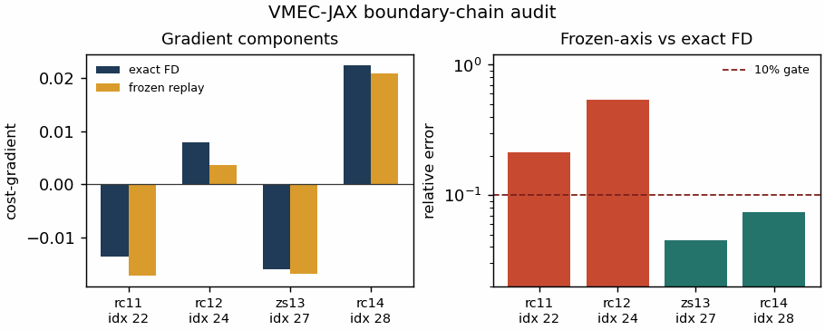

This result narrows the current differentiable-optimization scope: frozen-axis
derivatives are usable as local diagnostics, but projected VMEC boundary updates
must exclude or regularize branch-sensitive coefficients until a better
conditioned finite-difference protocol or public solved-equilibrium
linearization gate closes the mismatch.

The backend-free projected line-search helpers accept the collection JSON
through ``boundary_chain_collection`` and, by default, admit only coefficients
that pass both frozen-axis replay and exact-FD agreement. The
``require_boundary_chain_exact_fd=False`` path is diagnostic only and must not
drive promoted VMEC boundary updates unless each branch-sensitive coefficient
also carries ``frozen_axis_convention_verified = true``. That stricter gate
checks the frozen-axis finite-difference tangent against VMEC-JAX's explicit
tangent column and verifies both tape JVP/VJP contractions in that convention;
internal JVP/VJP transpose alone is no longer sufficient. When the collection
includes the growth-branch locality block from
``tools/campaigns/audit_vmec_jax_boundary_chain.py --include-growth-branch-locality``,
production projected-input generation should also use
``--require-growth-branch-locality`` so a coefficient with a switched or
under-isolated SPECTRAX growth branch is excluded before line-search replay.

The latest strict-gate rerun used the clean ``vmec_jax_latest`` checkout, local
``booz_xform_jax`` commit ``1d5e8c``, ``mboz = nboz = 21``, and the
authoritative QA restart. The two nonzero directions rerun with growth-branch
locality were ``rc14`` and ``zs13``. Exact-only admission correctly returns no
rows because the raw exact-solve FD gradients still differ from the frozen-axis
optimizer convention. Projected strict admission returns ``(28, 27)`` only
because both rows pass growth-branch locality and the explicit frozen-axis
convention gate: the frozen-axis finite-difference initial tangent matches the
VMEC-JAX linear tangent to relative errors ``5.6e-11`` and ``4.2e-11``.
This closes the convention-comparison diagnostic for projected directions; it
does not by itself promote a nonlinear heat-flux optimization claim.

After a sensitive diagnostic, generate bounded projected candidate inputs with:

.. code-block:: bash

   python tools/campaigns/write_vmec_jax_projected_transport_line_search_inputs.py \
     --input runs/qa_constraints_only/input.final \
     --gradient-json runs/qa_constraints_only/transport_gradient.json \
     --boundary-chain-collection-json docs/_static/vmec_jax_boundary_chain_multicomponent.json \
     --outdir runs/qa_projected_transport_line_search \
     --steps 2.5e-4,5e-4,1e-3,2e-3 \
     --top-n 12 \
     --require-growth-branch-locality \
     --surfaces 0.45,0.64,0.78 \
     --alphas 0.0,0.7853981633974483 \
     --ky-values 0.10,0.30,0.50 \
     --max-mode 5 --min-vmec-mode 7 \
     --mboz 21 --nboz 21 \
     --solver-device gpu

The generated ``projected_line_search_inputs.json`` records the candidate
``input.gradient_step`` decks, replay commands, and objective sample summary.
The writer requires ``--boundary-chain-collection-json`` by default, records the
accepted coefficient indices, and excludes branch-sensitive components. Ungated
boundary updates require the explicit diagnostic override
``--allow-ungated-boundary-chain``. The writer also fails closed if the
transport objective does not satisfy the multi-surface/multi-field-line/multi-
``k_y`` coverage gate. Exploratory single-point searches require
``--allow-underresolved-sample-set`` and cannot be used for production
nonlinear-audit admission. Each replay must still write an authoritative
``solved_wout_gate.json`` and explicit transport metric before any candidate is
admitted.

The current aspect-6 QA restart is locally sensitive: the transport-only
diagnostic gives ``||grad J||_2 = 0.421`` for a single
``s=0.64, alpha=0, k_y rho_i=0.30`` nonlinear-window metric. A sparse projected
line search along the leading 12 boundary components lowers the explicit metric
from ``0.0580559`` to ``0.0559975`` at projected step ``1e-3`` while preserving
the aspect, mean-iota, iota-profile, and QS gates. The next larger step
``2e-3`` is rejected because the solved QS residual rises to ``0.119846`` above
the ``0.05`` gate. This is evidence for a gate-aware projected-admission
algorithm; it is not yet a long-window nonlinear turbulent-flux optimization
claim. The matched nonlinear audit below shows that this historical
single-point reduced metric did not transfer to long-window transport, so new
projected candidates must use the multi-sample command above.

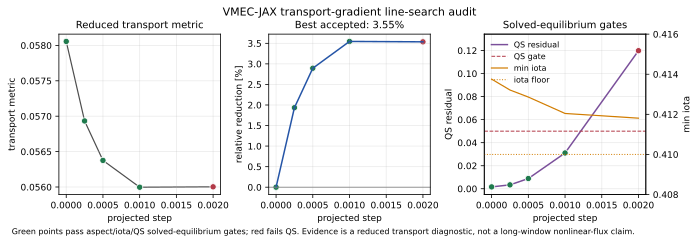

   VMEC-JAX/SPECTRAX-GK transport-gradient line-search audit. Green points pass
   the solved-equilibrium aspect, iota, and QS gates; the red point is rejected
   by the QS gate. The best accepted projected step reduces the reduced
   transport metric by ``3.55%`` and defines the candidate for the next matched
   long-window nonlinear audit.

The matched long-window nonlinear audit for that earlier aspect-6 admitted
projected candidate
has now been run at the production ``n64`` grid with two seed replicates and one
timestep replicate over ``t=[350,700]``. Both the baseline and projected
candidate ensembles pass their individual stationarity/replicate gates, but the
matched comparison does **not** promote the projected step: the baseline
late-window mean ion heat flux is ``9.833`` while the projected candidate is
``9.891``. The relative reduction is therefore ``-0.00585`` with a combined
uncertainty of ``0.293`` and uncertainty z-score ``-0.20``. This closes the
first projected-candidate audit as a negative transfer result: the reduced
single-sample transport metric is locally differentiable and useful for
admission, but it did not predict a statistically resolved lower long-window
nonlinear flux for this boundary step.

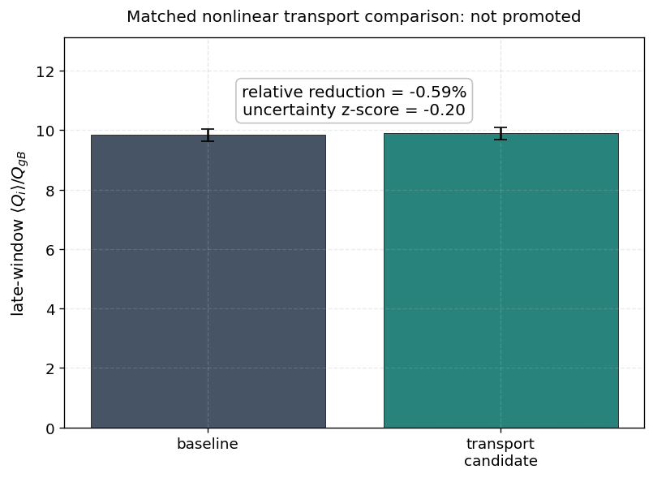

   Matched replicated nonlinear transport comparison for the accepted projected
   QA boundary step. Each bar is a passed ``t=[350,700]`` seed/timestep ensemble.
   The projected candidate is not promoted because its ensemble mean is slightly
   higher than the baseline within uncertainty.

The redesign gate in
``docs/_static/qa_projected_transport_step1e3_redesign_report.json`` converts
this negative audit into the next objective contract. It blocks promotion on
``insufficient_matched_reduction``, ``insufficient_uncertainty_separation``,
and under-resolved single-point objective coverage. The recommended next
reduced objective evaluates ``3 x 2 x 3 = 18`` points: surfaces
``s = (0.45, 0.64, 0.78)``, field-line labels
``alpha = (0, pi/4)``, and grid-compatible
``k_y rho_i = (0.10, 0.30, 0.50)``. Future
projected candidates must pass that multi-sample reduced admission before
another expensive matched nonlinear audit is scientifically justified.
The later strict top-12 QA edge candidate does pass this 18-point reduced
coverage and lowers the reduced metric by ``2.29%``, but its matched
``t=[350,700]`` nonlinear audit still fails promotion: the relative reduction
is only ``0.58%`` with uncertainty z-score ``0.20``. Its
``docs/_static/strict_qa_top12_edge_redesign_report.json`` artifact therefore
keeps the nonlinear turbulent-flux optimization claim blocked until the
reduced objective has stronger predictive margin and uncertainty-aware
admission.
The companion
:download:`strict_qa_top12_edge_prelaunch_gate.json <_static/strict_qa_top12_edge_prelaunch_gate.json>`
records the same lesson as a prelaunch rule: the ``2.2876%`` reduced margin is
below the ``4%`` calibrated threshold, so a future candidate at this margin
would be blocked before launching a new expensive nonlinear campaign.

The broad nonlinear turbulent-flux optimization gate is now encoded directly in
``examples/optimization/QA_nonlinear_ITG_transport_matrix.py`` and the
lower-level ``tools/artifacts/build_matched_nonlinear_transport_matrix.py`` helper. The
example keeps the VMEC-JAX-style top-level-constant workflow: edit the baseline
and candidate WOUT paths, then run the script to emit the full production
campaign over ``s=(0.45,0.64,0.78)``, ``alpha=(0,pi/4)``, and
``k_y rho_i=(0.10,0.30,0.50)`` with seed/timestep replicated
``t=[1100,1500]`` nonlinear windows. The generated postprocess script rebuilds
every output gate, ensemble gate, matched comparison, and the aggregate matrix
report. A broad optimization claim is allowed only when that aggregate report
passes; otherwise the candidate remains single-point or diagnostic evidence.
If several candidate families are available, the final release decision is made
by ``tools/release/check_nonlinear_transport_matrix_portfolio.py``. It consumes one or
more aggregate matrix reports, selects the passing family with the largest mean
heat-flux reduction, and records strict ``t=1500`` growth/QL/nonlinear-window
matched comparisons only as excluded negative-transfer evidence.
After that gate passes, import the selected release artifacts with
``tools/campaigns/import_nonlinear_transport_matrix_portfolio.py``. The importer is
fail-closed: it rejects blocked portfolios and writes the canonical
``docs/_static/nonlinear_transport_matrix_portfolio.{json,png}`` plus the
selected matrix report only for a passing broad matrix family.
For release candidates, prefer
``tools/campaigns/finalize_nonlinear_transport_matrix_release.py``. It wraps that import
and immediately rebuilds the manuscript-readiness and strict pre-manuscript
closure panels, so the documentation dashboard cannot lag behind the selected
matrix family.

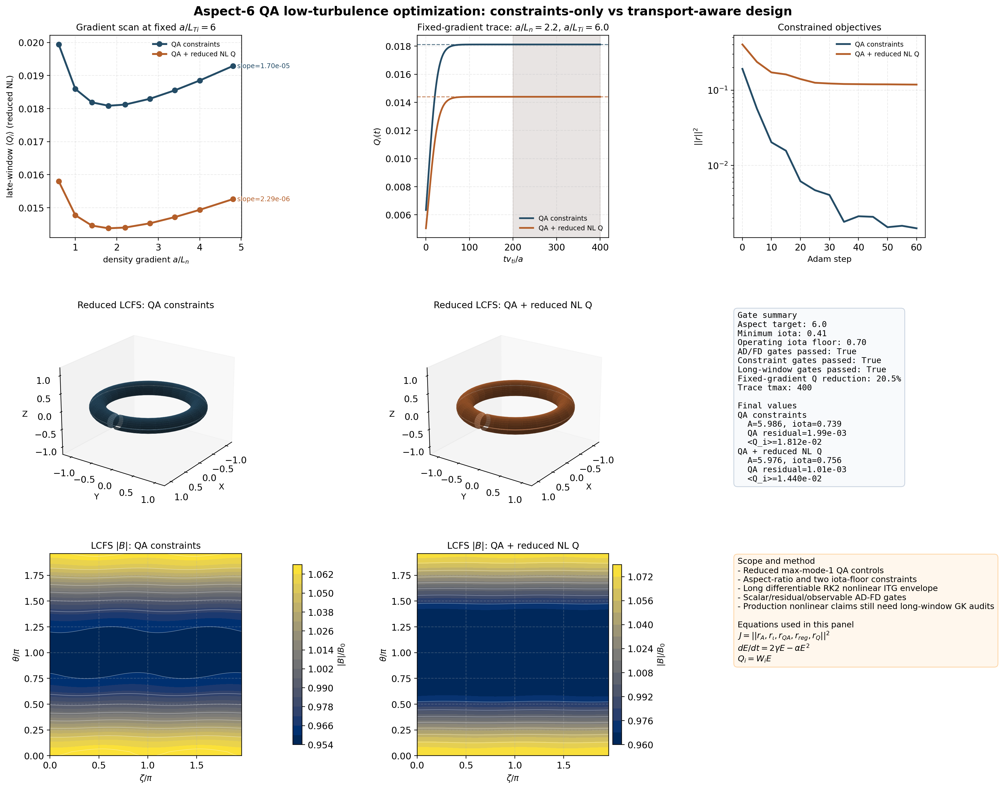

   Aspect-6 QA low-turbulence comparison. The blue design is optimized only
   for reduced quasisymmetry, aspect ratio, the minimum-iota floor, and
   regularization. The orange design adds the reduced late-window nonlinear
   heat-flux envelope residual. At fixed ``a/L_n = 2.2`` and ``a/L_Ti = 6``,
   the tracked artifact reduces the reduced late-window ``Q_env`` by about
   ``10.7%`` at ``t v_ti/a = 400`` and reduces the fitted ``Q_env`` versus
   ``a/L_n`` slope while retaining the geometry and differentiability gates.
   The smooth trace is expected because it solves
   ``dE/dt = 2 gamma E - alpha E^2`` rather than a full turbulent nonlinear
   gyrokinetic initial-value problem. The middle-row surfaces are colored by
   reduced ``|B|`` and the bottom row shows reduced Boozer-LCFS ``|B|`` maps.
   Both final designs keep a visible non-axisymmetric helical boundary
   amplitude near ``0.16`` and satisfy ``iota > 0.70``.

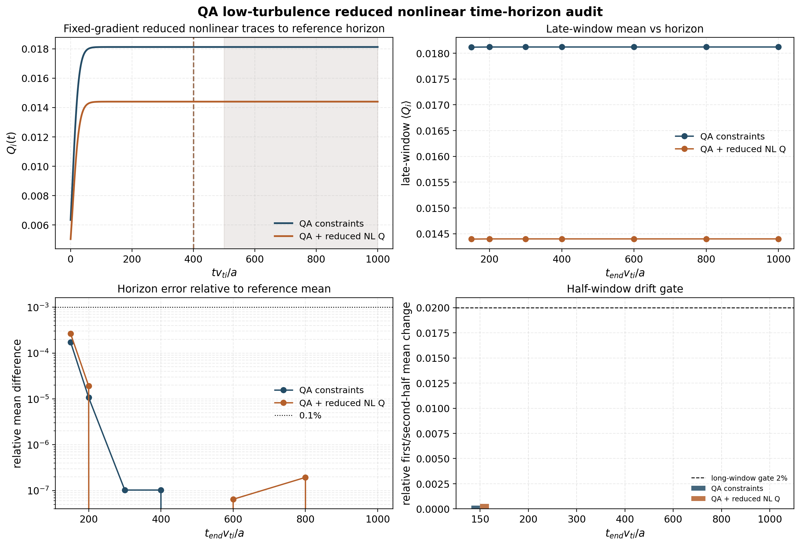

   Reduced nonlinear time-horizon audit for the same optimized designs. The
   ``t v_ti/a = 400`` late-window mean differs from the ``t=1000`` reference by
   ``1.2e-7`` for the constraints-only design and by ``6.5e-8``
   for the transport-aware design. The coefficient of variation, normalized
   trend, and first/second-half drift are all below ``1e-3`` at ``t=400``.
   Therefore the tracked reduced-envelope figure keeps ``t=400`` as a
   conservative but compact horizon; this is still not a full nonlinear
   SPECTRAX-GK transport-window convergence claim.

Model Hierarchy Used in the Panel
~~~~~~~~~~~~~~~~~~~~~~~~~~~~~~~~~

The comparison deliberately separates four layers that are often conflated in
optimization figures:

1. **Linear ITG response.** The reduced controls define smooth proxies for the
   linear growth rate ``gamma(p)``, perpendicular scale ``kperp_eff2(p)``, and
   heat-flux weight ``W_i(p)``. In the production code those quantities come
   from the SPECTRAX-GK linear operator and its selected eigenbranch; in this
   reduced gate they are analytic JAX functions chosen to exercise the same
   differentiability and branch-stability contracts without launching a full
   VMEC/Boozer solve.
2. **Quasilinear diagnostic.** The reduced quasilinear scalar follows the same
   mixing-length structure used elsewhere in the code,

   .. math::

      Q_i^{QL,red}(p) = C_{sat}\,W_i(p)\,\frac{\gamma(p)^2}{k_\perp^2(p)},

   with ``C_sat = 0.72`` in this aspect-6 reduced gate. It is recorded as a
   diagnostic and optimization-adjacent observable, not as a promoted absolute
   turbulent-flux predictor. The broader quasilinear promotion rules remain in
   :doc:`quasilinear` and follow the model-selection cautions in [Stephens21]_,
   [Parker23]_, [Staebler24]_, and [Jorge24]_.
3. **Reduced nonlinear envelope.** The transport-aware objective uses the
   differentiable RK2 energy envelope described below. This creates a stable
   local optimization target and a meaningful post-transient window diagnostic,
   but it is still a reduced model. Production nonlinear claims must use the
   replicated long-window SPECTRAX-GK audits described in
   :doc:`validation_strategy` and :doc:`release_scope`, consistent with the
   nonlinear turbulence-in-the-loop standard in [Kim24]_.
4. **End-to-end differentiability.** JAX differentiates the explicit reduced
   map from controls to residuals and observables. The artifact then checks
   the scalar objective gradient, the full residual Jacobian, and the full
   observable Jacobian against central finite differences. The same pattern is
   used before replacing the reduced row producer with ``vmec_jax`` and
   ``booz_xform_jax`` in-memory geometry.

This hierarchy is the reason the README panel uses the phrase "reduced NL Q".
It shows how the optimizer plumbing behaves and how a transport objective can
change the shape, gradient-scan slope, and late-window heat-flux envelope, while
keeping the stronger full-nonlinear-GK optimization claim gated separately.

Objective Blocks
~~~~~~~~~~~~~~~~

The two designs use the same four reduced low-order controls
``p = (p_a, p_kappa, p_h, p_s)`` exposed by
:mod:`spectraxgk.objectives.qa_low_turbulence`: a minor-radius/aspect shift, a vertical
elongation shift, a helical-ripple amplitude, and a magnetic-shear shift. The
helical amplitude is not allowed to collapse to zero: both objectives include
a high-weight QA-compatible shaping residual that keeps ``p_h`` near ``0.16``.
This is why the reduced LCFS visualization remains non-axisymmetric while the
QA residual stays small. The formal iota floor and the higher operating iota
floor also use high weights, so the optimized points remain comfortably above
``iota = 0.41``.

The
control-only objective is

.. math::

   J_{QA}(p) = \| r_A, r_{\iota,min}, r_{\iota,op}, r_{QA}, r_h, r_{reg} \|_2^2,

while the transport-aware objective is

.. math::

   J_{QA+Q}(p) = \| r_A, r_{\iota,min}, r_{\iota,op}, r_{QA}, r_h, r_{reg}, r_Q \|_2^2.

The residuals are

.. math::

   r_A = \sqrt{w_A}\, \frac{A(p)-A_0}{A_0}, \qquad A_0=6,

.. math::

   r_{\iota,min} = \sqrt{w_{\iota,min}}\,\mathrm{softplus}_{\beta}\left(\iota_{min}-\bar{\iota}(p)\right),
   \qquad \iota_{min}=0.41,

.. math::

   r_{\iota,op} = \sqrt{w_{\iota,op}}\,\mathrm{softplus}_{\beta}\left(\iota_{op}-\bar{\iota}(p)\right),
   \qquad \iota_{op}=0.70,

.. math::

   r_{QA}=\sqrt{w_{QA}}\,\epsilon_{QA}(p), \qquad
   r_{reg}=\sqrt{w_{reg}}\,p,

and, only for the transport-aware design,

.. math::

   r_Q = \sqrt{w_Q\,\langle Q_i^{red}\rangle_{late}}.

The first iota term is the formal floor requested for the configuration. The
second iota term is an operating floor, currently ``0.70``, added after QA of
the initial artifact showed that the bare ``0.41`` floor allowed low-iota
solutions that were not useful for the intended stellarator-optimization
comparison. Both terms are one-sided smooth floors, not equality targets. Once
``bar(iota)`` is above the relevant floor, that residual contributes only the
exponentially small smooth tail.

Reduced ITG Envelope
~~~~~~~~~~~~~~~~~~~~

The reduced nonlinear diagnostic integrates one smooth energy envelope,

.. math::

   \frac{dE}{dt} = 2\gamma(p, a/L_n, a/L_T)E - \alpha(p, a/L_n, a/L_T)E^2,
   \qquad Q_i^{red}(t) = W_i(p, a/L_n, a/L_T)E(t),

with a fixed-step RK2 method so the entire map is differentiable by JAX. The
late-window average is

.. math::

   \langle Q_i^{red}\rangle_{late}
      = \frac{1}{t_1-t_0}\int_{t_0}^{t_1} Q_i^{red}(t)\,dt,

where the artifact uses the final configured fraction of the trace. The
current tracked comparison runs to ``t v_ti/a = 400`` and requires ``tmax >=
300`` before the long-window gate can pass. The JSON sidecar records the
late-window coefficient of variation, linear trend, first-half/second-half
mean drift, and running-mean drift so a small heat-flux value cannot be
confused with a startup transient. The density scan keeps ``a/L_T`` fixed and
recomputes the same late-window average over the specified ``a/L_n`` grid.

Gradient, Conditioning, and UQ Gates
~~~~~~~~~~~~~~~~~~~~~~~~~~~~~~~~~~~~

Every optimized point records three differentiability gates:

- a scalar-objective AD versus central finite-difference check;
- a full weighted-residual Jacobian AD versus central finite-difference check;
- a full observable-vector AD versus central finite-difference check from
  controls to aspect, iota, QA residual, linear features, quasilinear flux, and
  long-window nonlinear heat-flux statistics.

The residual Jacobian is passed to the same Gauss-Newton covariance diagnostic
used by the inverse/UQ examples. The sidecar records singular values, rank,
condition number, covariance, and parameter correlations. This prevents a plot
from being promoted if the scalar gradient passes only because the residual map
is locally rank deficient. The observable gate checks the complete reduced
plumbing rather than only the final scalar objective.

Geometry and Claim Boundary
~~~~~~~~~~~~~~~~~~~~~~~~~~~

The 3D LCFS and ``|B|`` maps in the figure are reduced max-mode-1
visualizations derived from the same controls. They are included so readers can
see the qualitative shape change chosen by the transport-aware objective. They
are not VMEC equilibria and should not be used for final physics claims. The
production path remains:

.. code-block:: text

   vmec_jax fixed-boundary state
      -> booz_xform_jax Boozer transform, mboz >= 21, nboz >= 21
      -> SPECTRAX-GK flux-tube objective rows
      -> AD/FD and held-out geometry gates
      -> long post-transient replicated nonlinear transport audits

This is consistent with VMEC's fixed-boundary MHD-equilibrium role
[HirshmanWhitson83]_, modern high-precision quasisymmetric optimization
[LandremanPaul22]_, quasilinear microstability optimization [Jorge24]_, and
nonlinear turbulence-in-the-loop optimization evidence [Kim24]_. The reduced
comparison is therefore a validated optimization-plumbing and figure-generation
artifact, not the final production nonlinear turbulent heat-flux optimization.

Boundary-Coefficient Objective Landscapes
~~~~~~~~~~~~~~~~~~~~~~~~~~~~~~~~~~~~~~~~~

Before launching another optimizer, SPECTRAX-GK now includes a
boundary-coefficient landscape diagnostic:
:download:`build_vmec_boundary_transport_landscape.py <../tools/artifacts/build_vmec_boundary_transport_landscape.py>`.
It perturbs one VMEC input coefficient, writes the corresponding ``input.*``
decks, evaluates deterministic reduced transport objectives, and optionally
overlays true post-transient nonlinear heat-flux points with uncertainty bars. This
mirrors the optimization lesson in [Kim24]_: time-averaged nonlinear heat flux
can be noisy enough that local deterministic descent may fail near a minimum,
so the optimizer choice should be informed by a pre-optimizer landscape scan.

The current ``RBC(1,1)`` diagnostic starts from the strict max-mode-5 QA
baseline used in the optimizer sweep and scans the coefficient over
``[-75%, +75%]`` with 31 points.  The top panel evaluates the linear growth
rate and every explicit electrostatic quasilinear heat-flux rule on the same
multi-point optimizer sample set: ``s = (0.45, 0.64, 0.78)``,
``alpha = (0, pi/4)``, and ``k_y rho_i = (0.10, 0.30, 0.50)``.  The lower
panel is deliberately not a reduced nonlinear-window objective.  It accepts
only long-window post-transient nonlinear heat-flux ensemble sidecars produced
from concrete SPECTRAX-GK nonlinear outputs.  This separation is part of the
claim boundary: reduced/startup nonlinear-window diagnostics can guide launch
choices, but they cannot be plotted or cited as turbulent heat-flux
landscapes.

The reduced scan is intentionally reusable.  The batched evaluator computes
growth and all explicit quasilinear metrics in one VMEC/JAX solve per
coefficient; reduced/startup nonlinear-window metrics are excluded from this
landscape.  To regenerate the tracked figure without recomputing metrics,
reuse the stored JSON sidecar::

   python tools/artifacts/build_vmec_boundary_transport_landscape.py \
     --baseline-input tools_out/vmec_jax_qa_full_sweep_20260605/runs/qa_baseline_scipy/input.final \
     --coefficient "RBC(1,1)" \
     --reuse-reduced-json docs/_static/vmec_boundary_transport_landscape_rbc11_full.json \
     --fractions=-0.75,-0.70,-0.65,-0.60,-0.55,-0.50,-0.45,-0.40,-0.35,-0.30,-0.25,-0.20,-0.15,-0.10,-0.05,0.0,0.05,0.10,0.15,0.20,0.25,0.30,0.35,0.40,0.45,0.50,0.55,0.60,0.65,0.70,0.75 \
     --surfaces 0.45,0.64,0.78 --alphas 0.0,0.7853981633974483 --ky-values 0.10,0.30,0.50 \
     --ntheta 16 --mboz 21 --nboz 21 --n-laguerre 1 --n-hermite 2

When selected landscape points are promoted to expensive turbulence evidence,
run replicated post-transient nonlinear ensembles and rerun the plot with
``--nonlinear-ensemble coefficient_value:path/to/ensemble.json``.  Only those
ensemble sidecars should feed uncertainty-aware nonlinear admission reports.
For the current strict-baseline ``RBC(1,1)`` scan, the paper-facing nonlinear
protocol is ``t_max = 1500`` with the accepted transport window
``t = [1100, 1500]`` on the ``n64:64:64:40:40`` grid.  The earlier
``t = [350, 700]`` pilot for the ``-75%`` point remained visibly transient and
failed running-mean convergence.  A neighboring ``-70%`` point passed readiness
but failed timestep-spread robustness over ``t = [700, 1100]`` and then passed
over ``t = [1100, 1500]``.  The tracked public overlay currently includes 24
coefficients that have passed the accepted diagnostic ``t = [1100, 1500]``
seed/timestep ensemble gate: the negative side, the zero-offset baseline, and
eight positive coefficients, ``+5%``, ``+10%``, ``+15%``, ``+20%``, ``+25%``,
``+30%``, ``+35%``, and ``+40%``.  The ``+20%`` coefficient is a scoped relaxed
diagnostic admission: its mean-relative seed/timestep spread is ``15.48%``, so
it passes the explicitly selected ``20%`` landscape gate but not the stricter
``15%`` production-style gate.  The remaining higher positive coefficients are
stability-boundary/open long-window points and should not be inferred from
reduced metrics.  The shorter windows are retained only as negative convergence
diagnostics for this landscape protocol.
For diagnostic landscapes that should show failed post-transient points instead
of aborting the full scan, build each sidecar with
``tools/artifacts/build_external_vmec_replicate_ensemble.py --allow-failed-gates``.  That
flag only changes the command exit status; the JSON and plot still mark failed
readiness or ensemble gates as failed and those points must not be promoted.

When selected landscape points are promoted to expensive turbulence evidence,
the nonlinear campaign-admission report should be rebuilt from the matching
strict-baseline reduced scan and the new replicated nonlinear landscape
sidecars::

   python tools/artifacts/build_nonlinear_campaign_admission_report.py \
     --prelaunch-report path/to/current_prelaunch_gate.json \
     --landscape-admission path/to/current_landscape_admission.json \
     --out-json path/to/current_campaign_admission_report.json \
     --fail-on-blocked

Earlier ``+3% RBC(0,1)`` and sparse ``RBC(1,1)`` sidecars are retained as
historical development artifacts only. They were generated from older narrow
or reduced screening scans and should not be interpreted as admission reports
for the current strict-baseline ``[-75%, +75%]`` figure.

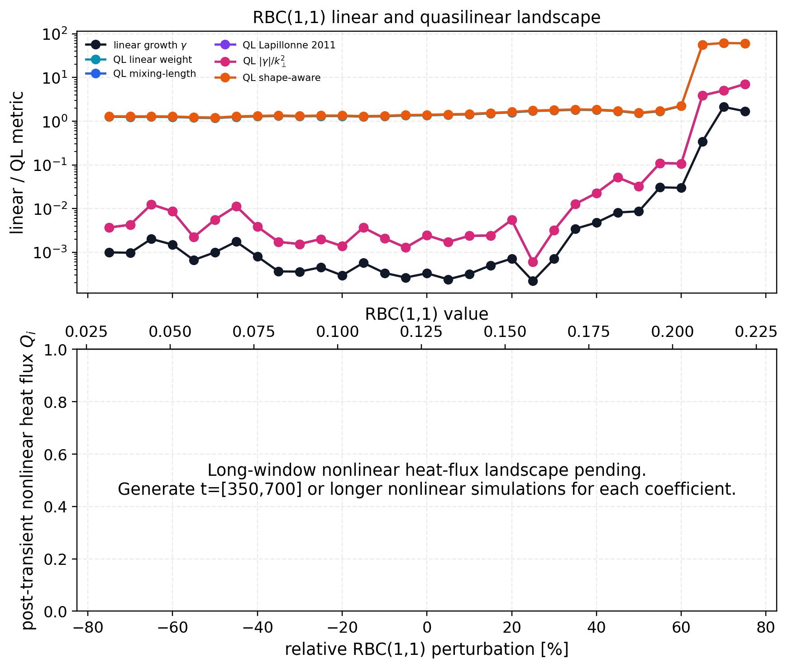

   ``RBC(1,1)`` transport-objective landscape from the strict max-mode-5 QA
   baseline. The top panel shows linear growth and the shipped quasilinear
   rules. The bottom panel is true nonlinear heat flux only when populated by
   long post-transient ensemble sidecars; reduced nonlinear-window diagnostics
   are excluded from this figure.

The VMEC-JAX WOUT files generated for this landscape currently require a
metadata-only patch because their Fourier geometry is present but scalar
summary fields such as ``Aminor_p`` can be zero. The helper
:download:`patch_vmec_jax_wout_metadata.py <../tools/patch_vmec_jax_wout_metadata.py>`
fills positive scalar metadata from the LCFS Fourier boundary without changing
the equilibrium Fourier coefficients. This patch is a runtime-EIK compatibility
step, not a geometry optimization result.

Implementation Map
~~~~~~~~~~~~~~~~~~

- Core reduced model: :mod:`spectraxgk.objectives.qa_low_turbulence`
- Artifact builder: :download:`build_qa_low_turbulence_comparison.py <../tools/artifacts/build_qa_low_turbulence_comparison.py>`
- Time-horizon audit builder: :download:`build_qa_low_turbulence_time_horizon_audit.py <../tools/artifacts/build_qa_low_turbulence_time_horizon_audit.py>`
- Boundary landscape builder: :download:`build_vmec_boundary_transport_landscape.py <../tools/artifacts/build_vmec_boundary_transport_landscape.py>`
- Nonlinear landscape admission builder: :download:`build_nonlinear_landscape_admission_report.py <../tools/artifacts/build_nonlinear_landscape_admission_report.py>`
- Reduced nonlinear-audit prelaunch builder: :download:`build_reduced_nonlinear_audit_prelaunch_report.py <../tools/artifacts/build_reduced_nonlinear_audit_prelaunch_report.py>`
- Nonlinear optimizer campaign-admission builder: :download:`build_nonlinear_campaign_admission_report.py <../tools/artifacts/build_nonlinear_campaign_admission_report.py>`
- VMEC-JAX WOUT metadata patcher: :download:`patch_vmec_jax_wout_metadata.py <../tools/patch_vmec_jax_wout_metadata.py>`
- Tests: ``tests/test_qa_low_turbulence.py`` and
  ``tests/test_vmec_boundary_transport_landscape.py`` plus the nonlinear
  admission policy tests.
- Legacy nonlinear landscape admission report from the earlier narrow scan:
  :download:`vmec_boundary_transport_landscape_admission.json <_static/vmec_boundary_transport_landscape_admission.json>`
- Legacy reduced nonlinear-audit prelaunch gate from the earlier narrow scan:
  :download:`vmec_boundary_transport_prelaunch_gate.json <_static/vmec_boundary_transport_prelaunch_gate.json>`
- Legacy nonlinear optimizer campaign-admission gate from the earlier narrow scan:
  :download:`nonlinear_campaign_admission_report.json <_static/nonlinear_campaign_admission_report.json>`
- Output JSON: :download:`qa_low_turbulence_comparison.json <_static/qa_low_turbulence_comparison.json>`
- Scan CSV: :download:`qa_low_turbulence_comparison.scan.csv <_static/qa_low_turbulence_comparison.scan.csv>`
- Horizon audit CSV: :download:`qa_low_turbulence_time_horizon_audit.csv <_static/qa_low_turbulence_time_horizon_audit.csv>`

VMEC-JAX Geometry Examples
--------------------------

The user-facing VMEC geometry examples are WOUT-backed runtime workflows. They
use small ``vmec_jax`` input decks shipped under ``examples/vmec`` and avoid
separate EIK generation for the common demo path:

.. code-block:: bash

   pip install vmec-jax
   cd examples/vmec
   ./generate_wouts.sh
   cd ../..

   spectraxgk run --config examples/linear/axisymmetric/runtime_circular_vmec_linear.toml
   spectraxgk run --config examples/linear/non-axisymmetric/runtime_hsx_linear_quasilinear.toml
   spectraxgk run --config examples/linear/non-axisymmetric/runtime_w7x_linear_quasilinear_vmec.toml

Run ``vmec_jax input.NAME`` inside ``examples/vmec`` when only one WOUT is
needed. These bundled QHS/QI/QA decks are self-contained demonstration
equilibria. Machine-specific HSX or W7-X validation should use the same TOMLs
with ``--vmec-file`` pointing to the benchmark WOUT.

This disk-WOUT path is the runtime example path, not the production optimizer
gradient contract. The production optimizer starts from an in-memory solved
``vmec_jax`` state, transforms through ``booz_xform_jax``, and then builds the
SPECTRAX-GK flux tube without relying on intermediate NetCDF files.

Production VMEC-JAX Optimization Plan
-------------------------------------

The production lane starts from the ``vmec_jax`` fixed-boundary QA optimizer:
aspect ratio is constrained, the mean rotational transform uses the original
VMEC-JAX high-weight ``MeanIota`` target by default, the quasisymmetry residual
is penalized, and a SPECTRAX-GK transport objective is added as another
residual block. The default paper-facing seed now targets ``A = 6`` and
``iota = 0.41`` at a fixed ITG flux tube, initially ``torflux = 0.64`` and
``alpha = 0.0``. A one-sided floor mode remains available for experiments, but
the target mode is the default because it prevents the low-signed-mean-iota
failure observed with the absolute-floor smoke. The optimized result must also
pass held-out field-line and surface gates before any stellarator-wide claim.

A bounded VMEC-JAX smoke run has been checked with ``max_mode=1``,
``mboz=nboz=21``, a SPECTRAX-GK growth residual, and a single scalar-trust
evaluation. It assembled the four residual blocks (aspect, absolute-iota
floor, quasisymmetry, SPECTRAX-GK transport) and retained the iota floor with
``min |iota| = 0.410000`` and mean iota ``0.481850``. This validates the
in-memory optimizer hook and iota-floor convention; it is not yet the final
transport-aware optimized equilibrium used for a turbulence claim.

The public VMEC-JAX QA transport scripts are:

- ``QA_optimization_linear_ITG.py``: append a SPECTRAX-GK ITG
  growth-rate objective to the upstream QA/aspect/iota tuple list.
- ``QA_optimization_quasilinear_ITG.py``: append a quasilinear transport
  diagnostic objective to the same solved-equilibrium optimization.
- ``QA_optimization_nonlinear_ITG.py``: append a nonlinear-window
  heat-flux screening objective, then promote only if matched baseline and
  optimized equilibria pass replicated long-window post-transient heat-flux
  audits.
- ``QA_nonlinear_ITG_matched_audit.py``: consume already accepted baseline and
  optimized nonlinear ensemble sidecars and write the matched reduction audit
  that decides whether a nonlinear turbulent-flux reduction is promoted.
- ``QA_nonlinear_ITG_transport_matrix.py``: write the broad matched
  baseline/candidate matrix over three surfaces, two field lines, and three
  ``k_y`` values. This is the required launch/postprocess contract before a
  low-turbulence QA candidate can be promoted beyond a single-point audit.

Development-only reduced diagnostics remain under
``examples/theory_and_demos/reduced_stellarator_itg`` for AD/FD and plotting
tests; they are not production QA optimization examples.

For the geometry layer, the user-facing runtime examples use WOUT files
generated from the small ``examples/vmec/input.*`` decks with ``vmec_jax``.
The optimizer path should avoid disk I/O: it should pass a solved
``vmec_jax`` state through ``booz_xform_jax`` with ``mboz >= 21`` and
``nboz >= 21``, then into the SPECTRAX-GK flux-tube contract. Disk WOUTs
remain useful for reproducibility, release artifacts, and external benchmark
comparison.

Every promoted optimization figure needs a sidecar JSON/CSV artifact and a
gate:

- objective history and coefficient trajectory;
- before/after Boozer ``|B|`` contours and quasisymmetry residuals;
- before/after growth-rate spectra;
- before/after quasilinear spectra with uncertainty intervals;
- nonlinear heat-flux time traces with transient cut, running mean, block/SEM
  uncertainty, and replicate spread;
- AD-vs-finite-difference gradient parity and sensitivity/covariance maps;
- Pareto plot of quasisymmetry residual, aspect/iota constraint error, and
  transport reduction.

The nonlinear heat-flux optimizer must not use startup or reduced-window
values as final evidence. Production evidence requires long post-transient
averages whose running means are converged and whose seed/timestep/grid
replicates agree within the documented gate.

The matched-audit example is the short user-facing command for that production
evidence path:

.. code-block:: bash

   python examples/optimization/QA_nonlinear_ITG_matched_audit.py

By default it rebuilds the tracked no-ESS reference versus optimized QA/ESS
audit. For a new low-turbulence stellarator, edit ``BASELINE_ENSEMBLE`` and
``OPTIMIZED_ENSEMBLE`` in the script after the long nonlinear campaign has
generated accepted ensemble-gate JSON files. A candidate is promotable only if
both ensembles qualify, the post-transient optimized mean is lower than the
matched baseline by the configured threshold, and the difference is separated
from the combined uncertainty. This is the required final step after the
linear, quasilinear, or nonlinear-window optimizer proposes a candidate.

The broad-matrix example is the corresponding user-facing command for
multi-surface promotion:

.. code-block:: bash

   python examples/optimization/QA_nonlinear_ITG_transport_matrix.py

It writes the campaign manifests plus GPU-split launch scripts. The generated
aggregate report is the promotion artifact: all baseline/candidate ensembles
must pass their long post-transient window gates, and the matched comparison
matrix must satisfy the configured pass-fraction and mean-reduction policy.
After postprocessing candidate families, use the portfolio gate to pick the
promoted family and to keep strict negative-transfer rows out of the promotion
count:

.. code-block:: bash

   python tools/release/check_nonlinear_transport_matrix_portfolio.py \
     --matrix-report accepted_qa_ess=tools_out/qa_ess_matrix/artifacts/qa_ess_matrix_report.json \
     --matrix-report projected_0p001=tools_out/projected_0p001_matrix/artifacts/projected_0p001_matrix_report.json \
     --excluded-comparison strict_growth=docs/_static/vmec_qa_t1500_baseline_to_growth_comparison.json \
     --excluded-comparison strict_quasilinear=docs/_static/vmec_qa_t1500_baseline_to_quasilinear_comparison.json \
     --excluded-comparison strict_nonlinear_window=docs/_static/vmec_qa_t1500_baseline_to_nonlinear_window_comparison.json \
     --out-json tools_out/nonlinear_transport_matrix_portfolio.json \
     --out-figure tools_out/nonlinear_transport_matrix_portfolio.png

Development Portfolio Gate
--------------------------

Before the VMEC/Boozer optimizer is promoted, the same reducer used by the
future production objective is exercised on a cheap differentiable sample
table. The table is rectangular in normalized toroidal flux, field-line
``alpha``, and ``k_y rho_i``. The default gate covers three surfaces, two
field-line ``alpha`` values, and three ``k_y`` values with growth-rate and
quasilinear-flux columns. It checks both the scalar reduced objective and
every unreduced row against central finite differences.

.. code-block:: bash

   python examples/theory_and_demos/reduced_stellarator_itg/stellarator_itg_portfolio_gate.py \
     --finite-difference-workers 2

By default this writes
``docs/_static/stellarator_itg_portfolio_gate.{json,png,pdf}``. Use
``--surfaces``, ``--alphas``, ``--ky-values``, and ``--objectives`` only when
the changed sample set is also recorded in the artifact sidecar. The JSON
sidecar is the audit source: it records ``claim_level``, ``sample_set``,
``backend_boundary``, scalar/row-wise pass status, and the reduced objective
table. The PNG/PDF are human-readable renderings of that sidecar, not separate
validation evidence.

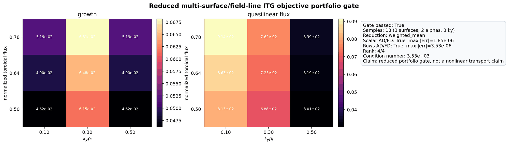

   Reduced multi-surface/field-line ITG objective portfolio gate. The
   heatmaps show the alpha-averaged growth and quasilinear-flux objective
   rows across three surfaces and three ``k_y`` values. The side panel records
   scalar and row-wise AD/finite-difference agreement, full-rank sensitivity,
   and the explicit claim boundary: this is a reduced portfolio gate, not a
   nonlinear turbulent-transport optimization claim.

The production bridge now uses the same portfolio layout for real
``vmec_jax -> booz_xform_jax -> SPECTRAX-GK`` row production:
``stellarator_itg_vmec_boozer_sample_objective_table_from_state`` evaluates
physical toroidal-flux, field-line ``alpha``, and ``k_y rho_i`` samples, while
``stellarator_itg_vmec_boozer_portfolio_objective_from_state`` applies the
same weighted reducer. The aggregate VMEC/Boozer artifact tool accepts
physical ``--ky-values`` and records the resolved solver indices, ``Ly``,
``Ny``, and per-sample ``ky_abs_error`` in the sidecar. The remaining
promotion step is scientific, not plumbing: rerun held-out surface/field-line
gates and promote nonlinear candidates only after long post-transient
replicated windows pass for matched baseline and optimized equilibria.

For CI-scale development, ``solver_objective_branch_gradient_report`` applies
the same branch-continuity and implicit AD/finite-difference logic to the
solver-ready differentiable geometry contract. It verifies that the selected
max-growth eigenbranch stays dominant under central perturbations and that
the objective-vector sensitivities pass the implicit left/right eigenpair
gate. The VMEC/Boozer offline gates remain the authority for production
stellarator optimization claims.

Optimizer drivers should use ``vmec_boozer_scalar_objective_from_state`` once
they have a solved ``vmec_jax`` state. The supported aliases are
``growth``/``gamma``, ``frequency``/``omega``, and
``quasilinear_flux``/``mixing_length_heat_flux_proxy``. This selector prevents
each optimization example from silently using a different objective index.

The production-facing geometry objective should not stay tied to one field
line or one ``k_y`` point. ``vmec_boozer_solver_objective_table_from_state``
evaluates the same solver-objective vector over explicit ``surface_indices``,
field-line ``alphas``, and ``selected_ky_indices`` and returns the full table
before any reduction. ``vmec_boozer_aggregate_scalar_objective_from_state``
then reduces that table with a mean, weighted mean, or worst-case max. Mean and
weighted mean are the preferred gradient-development targets because the
sample set is fixed. A max reduction is useful as a conservative diagnostic,
but it must not be treated as a smooth optimizer objective unless active-set
and branch-continuity diagnostics are also passed.

Before any optimizer loop is promoted, run
``vmec_boozer_scalar_objective_finite_difference_report`` on the selected
VMEC coefficient, field line, and objective. It evaluates the scalar objective
at ``x-h``, ``x``, and ``x+h`` through the same in-memory VMEC/Boozer path and
records the central finite-difference sensitivity. The report also checks a
curvature/branch-switch indicator so a non-smooth max-growth branch is not
mistaken for a usable optimization gradient. This is intentionally a
finite-difference/SPSA-compatible audit, not an automatic-differentiation claim
for eigenvector-dependent quasilinear observables.

For multi-surface or multi-``k_y`` objectives, run
``vmec_boozer_aggregate_scalar_objective_finite_difference_report`` with the
same sample set and weights used by the optimizer. The report records the
sample metadata, scalar values, objective tables, and the same
curvature/branch-switch indicator. This is the minimum gate before a
stellarator optimization study can claim that a reduced growth-rate or
quasilinear objective decreased across more than one field line, surface, or
``k_y`` point.

The first optimizer scaffold is
``vmec_boozer_scalar_objective_line_search_report``. It repeatedly applies the
finite-difference audit at the current VMEC coefficient offset and accepts only
candidate updates that both pass the same curvature gate and reduce the scalar
objective. This is useful for growth-rate and quasilinear-flux optimizer
plumbing, but it remains a one-parameter audit rather than a multi-parameter
stellarator optimization claim.

For multi-point reduced objectives, use
``vmec_boozer_aggregate_scalar_objective_line_search_report`` instead. It
applies the aggregate finite-difference gate at every attempted VMEC
coefficient update and records the same sample metadata as the aggregate gate.
This is now the preferred scaffold for growth-rate and quasilinear-flux
optimization studies that need more than one field line, surface, or ``k_y``
point before entering a full optimizer loop.

Training improvement is not enough for a geometry-wide claim.
``vmec_boozer_aggregate_line_search_holdout_report`` runs the same aggregate
line-search on a training sample set, then evaluates the final coefficient
offset on a disjoint held-out sample set. The split gate passes only if both
the training line-search gate and held-out aggregate reduction pass. This is
the minimum reduced-objective validation step before using an optimized VMEC
coefficient in manuscript figures.

Production promotion adds a stricter surface/field-line rule. The aggregate
finite-difference, line-search, and reduced holdout reports must be paired with
at least one separate passed validation artifact whose sample metadata covers a
held-out ``surface_index`` or field-line ``alpha``. A held-out ``k_y`` point
alone is useful spectrum coverage, but it is not sufficient for the
surface/field-line generalization gate. The repository-level check
``tools/release/check_vmec_boozer_aggregate_holdout_gate.py`` encodes that boundary for
frozen artifacts: it accepts the aggregate FD and line-search artifacts as
necessary optimizer-plumbing evidence, then blocks promotion until independent
surface/field-line holdout evidence is supplied. It also requires a passed
replicated nonlinear-window ensemble artifact from
``tools/release/check_nonlinear_window_ensemble.py`` before any optimized-equilibrium
production nonlinear heat-flux claim can be made. The ensemble requirement is
deliberately separate from the single-window convergence rule: a single
post-transient mean can establish a candidate window, but seed/timestep/restart
replicates are needed before that mean becomes a robust optimization target.

Objective
---------

Let

.. math::

   p =
   \left[
   \Delta \log a,\ \Delta \kappa,\ \epsilon_h,\ \Delta \hat{s}
   \right]

denote the four active max-mode-1 controls used by the examples: a minor-radius
shift, vertical-elongation shift, helical-ripple amplitude, and magnetic-shear
shift. The constrained objective is

.. math::

   J_k(p) =
      w_A \left(\frac{A(p) - A_*}{A_*}\right)^2
      + w_\iota \left(\iota(p) - \iota_*\right)^2
      + w_{QS} R_{QS}(p)^2
      + w_r \|p\|_2^2
      + w_T T_k(p),

with ``A_* = 7`` and ``iota_* = 0.41``. The turbulence term ``T_k`` selects
one of three differentiable objectives.

Growth-rate objective:

.. math::

   T_\gamma(p) = \gamma(p).

Quasilinear heat-flux objective:

.. math::

   T_{QL}(p) =
      C_{sat}\,
      \frac{\gamma_+(p)\, W_i(p)}
           {k_{\perp,\mathrm{eff}}^2(p) + \epsilon},

where ``W_i`` is the linear heat-flux weight and ``gamma_+`` is a smooth
positive growth-rate part. This mirrors the mixing-length-style objective
used in the quasilinear module and is a differentiable optimization proxy, not
a promoted absolute-flux predictor. The current train/holdout quasilinear
calibration pages show why absolute saturated-flux claims remain gated.

Nonlinear-window objective:

.. math::

   \frac{dE}{dt} = 2\gamma(p) E - \alpha(p) E^2,
   \qquad
   Q_i(t; p) = W_i(p) E(t; p),

integrated with a fixed-step RK2 update. The objective is the late-window
average

.. math::

   T_{NL}(p) =
      \frac{1}{t_2 - t_1}
      \int_{t_1}^{t_2} Q_i(t; p)\,dt,

with companion quality metrics

.. math::

   C_V = \frac{\mathrm{std}(Q_i)}{|\langle Q_i \rangle|},
   \qquad
   \mathrm{trend} =
      \frac{|dQ_i/dt| (t_2-t_1)}
           {|\langle Q_i \rangle|}.

The nonlinear objective is intentionally an envelope gate. It is useful for
testing differentiable late-window averaging and optimizer behavior before the
full nonlinear GK RHS is promoted into an end-to-end differentiated objective.

Numerics and Differentiation
----------------------------

The optimizer uses JAX reverse-mode gradients through the scalar objective and
a bounded Adam update with clipped controls. Every shipped artifact records:

- the full objective history;
- the parameter and observable histories;
- an autodiff-vs-central-finite-difference Jacobian report;
- a Gauss-Newton covariance diagnostic from the final weighted objective
  residual Jacobian;
- for the nonlinear-window objective, the initial and optimized heat-flux
  traces, averaging window, coefficient of variation, and trend.

The finite-difference gate is

.. math::

   \max_{ij} |J^{AD}_{ij} - J^{FD}_{ij}| < \epsilon_{abs}
   \quad\mathrm{or}\quad
   \frac{|J^{AD}_{ij} - J^{FD}_{ij}|}{|J^{FD}_{ij}| + \epsilon}
   < \epsilon_{rel},

with tighter tolerances when JAX x64 is enabled.

Small geometry and objective-observable checks should use the shared
``observable_gradient_validation_report`` helper. The helper reports finite
flags, absolute and relative AD/finite-difference errors, tangent-direction
agreement, rank, singular values, condition number, and a pass/fail gate in a
strict JSON-compatible payload. The tiny solver-ready objective gate in
``spectraxgk.objectives.solver_gradients`` exercises this path without running
VMEC, Boozer, or a linear eigenproblem; it is a CI and documentation check for
the reporting contract, not a transport-gradient claim.

For the VMEC/Boozer bridge reports, passing this AD/FD tolerance is necessary
but not sufficient for optimization readiness. The geometry sensitivity reports
also carry a ``conditioning`` block with singular values, numerical rank,
condition number, AD row/column norms, per-parameter finite-difference step
scaling, and the worst error location. This keeps three cases separate in the
artifacts: a failed derivative implementation, a correct but ill-conditioned
control direction, and a well-conditioned reduced optimization gate. The
current full-chain ``vmec_jax`` state-coefficient reports should therefore be
read as reduced linear/quasilinear/nonlinear-window estimator differentiability
evidence until converged nonlinear heat-flux gradients or optimized-equilibrium
finite-difference audits also pass.

The UQ diagnostic uses the weighted residual vector whose squared norm is the
reported objective:

.. math::

   r =
   \left[
   \sqrt{w_A}\frac{A-A_*}{A_*},\
   \sqrt{w_\iota}(\iota-\iota_*),\
   \sqrt{w_{QS}}R_{QS},\
   \sqrt{w_r}p,\
   \sqrt{w_T T_k}
   \right].

The local covariance is then

.. math::

   C_p =
   \sigma^2
   \left(J_r^T J_r + \lambda I\right)^{-1},

where ``J_r = dr/dp`` and ``sigma^2`` is estimated from the final residual.
This is intentionally tied to the optimization objective. It is not computed
from the initial-to-final parameter displacement, which would measure optimizer
travel rather than local uncertainty at the optimized point.

Objective-portfolio reducer gate
--------------------------------

Multi-surface, multi-field-line, and multi-``k_y`` stellarator studies should
separate two contracts:

- row production, where VMEC/Boozer/SPECTRAX-GK evaluates one objective vector
  per sample;
- row reduction, where those fixed samples are combined into one scalar for an
  optimizer or UQ ensemble.

The lightweight reducer in
:mod:`spectraxgk.objectives.portfolio_contracts` validates the second contract
without importing optional VMEC or Boozer backends. It requires a real numeric
``(surface, alpha, ky, objective)`` table, finite non-negative normalized
weights, and an explicit reduction policy. The gate below checks the weighted
mean reducer, directional JVP, reverse-mode gradient projection, and central
finite difference on a deterministic nonlinear row fixture.

.. code-block:: bash

   python tools/artifacts/build_stellarator_objective_portfolio_gate.py \
     --out docs/_static/stellarator_objective_portfolio_gate.png

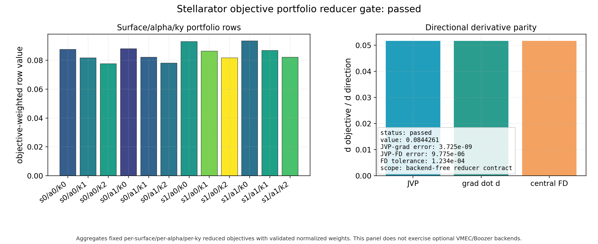

   Backend-free aggregate-objective reducer gate. It passes AD/JVP/central-FD
   parity for fixed surface/alpha/``k_y`` rows and validates the normalized
   sample/objective weights. This is a required optimization-plumbing contract,
   not a standalone VMEC/Boozer geometry-gradient or nonlinear heat-flux
   optimization claim.

The corresponding real-artifact guard is
``tools/release/check_vmec_boozer_reduced_portfolio_guard.py``. It consumes the tracked
multi-alpha VMEC/Boozer aggregate-objective JSON plus a VMEC/Boozer AD/FD
gradient JSON, rebuilds a backend-free reducer table from the real rows, and
fails closed unless the artifact has VMEC/Boozer provenance, at least two
field-line ``alpha`` values, at least two ``k_y`` samples, finite FD and AD/FD
diagnostics, growth and quasilinear objective columns, and an explicit
non-production nonlinear claim boundary.

.. code-block:: bash

   python tools/release/check_vmec_boozer_reduced_portfolio_guard.py

The tracked guard lives at
``docs/_static/vmec_boozer_reduced_portfolio_guard.json`` and passes on the QH
mode-21 multi-alpha/two-``k_y`` artifact. It admits reduced growth/QL
portfolio plumbing only; production nonlinear turbulent-transport optimization
now additionally requires the separate optimized-equilibrium long-window
transport audit tracked below. That audit is closed for the selected QA
candidate, while nonlinear turbulence gradients and broad multi-surface
optimization remain separate gates.

Development Diagnostic Results
------------------------------

Generate the three individual optimization panels with:

.. code-block:: bash

   JAX_ENABLE_X64=1 python examples/theory_and_demos/reduced_stellarator_itg/stellarator_itg_growth_optimization.py --finite-difference-workers 2
   JAX_ENABLE_X64=1 python examples/theory_and_demos/reduced_stellarator_itg/stellarator_itg_quasilinear_flux_optimization.py --finite-difference-workers 2
   JAX_ENABLE_X64=1 python examples/theory_and_demos/reduced_stellarator_itg/stellarator_itg_nonlinear_heat_flux_optimization.py --finite-difference-workers 2

Generate the comparison panel with:

.. code-block:: bash

   JAX_ENABLE_X64=1 python examples/theory_and_demos/reduced_stellarator_itg/compare_stellarator_itg_optimizations.py --workers 3 --finite-difference-workers 2
   JAX_ENABLE_X64=1 python tools/artifacts/plot_stellarator_optimization_uq.py

The ``--workers`` option parallelizes the independent growth-rate,
quasilinear-flux, and nonlinear-window objective reports while preserving the
serial ordering of the JSON payload. The ``--finite-difference-workers``
option parallelizes central finite-difference columns inside each AD/FD gate
using threads, which avoids pickling JAX objective closures. Both paths record
their worker metadata and identity contract in the JSON artifacts.

The development-only reduced comparison sidecar
``docs/_static/stellarator_itg_optimization_comparison.json`` records three
differentiable QA-control ITG residuals from the same initial control vector.
All three keep the reduced objective near ``A = 7`` and ``iota = 0.41``
while reducing the tracked transport observables. In the current artifact, the
optimized growth rate is about ``57%`` of the initial value and both
quasilinear and nonlinear-window heat-flux observables are about ``41%`` of
their initial values. This is retained as model-development and AD/FD plumbing
evidence only. Its companion rendered PNG is a synthetic max-mode-1 surface
diagnostic that can look nearly axisymmetric when the reduced helical amplitude
collapses; it is therefore not a paper-facing solved-geometry optimization
figure. Use the solved VMEC-JAX QA boundary/Boozer panel above for baseline
geometry visualization.

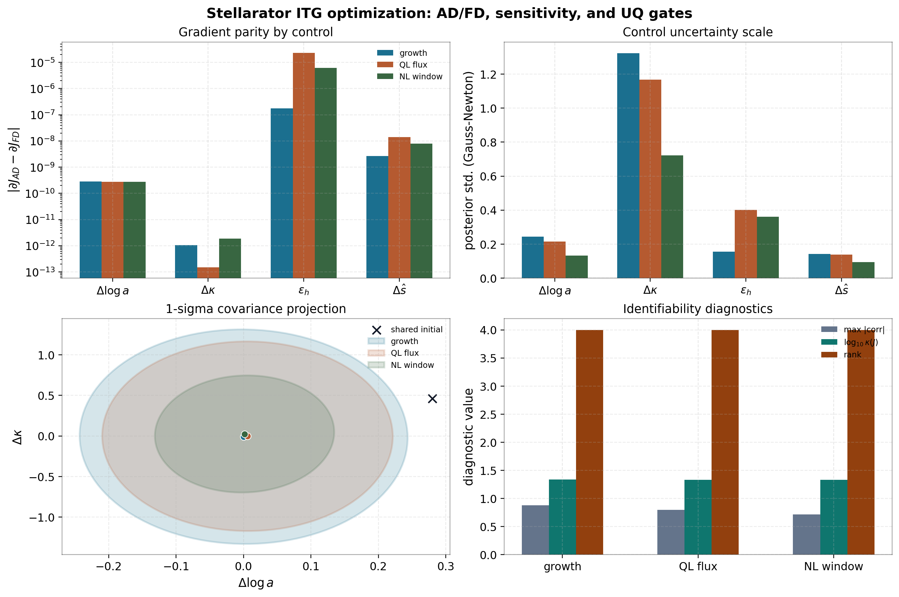

   UQ and sensitivity diagnostics for the same three reduced objectives. The
   first panel verifies AD/FD derivative parity for every active control. The
   covariance panels use the weighted objective residual map above, so the
   reported uncertainty is a local identifiability diagnostic at the optimized
   point. All three reduced objectives remain full-rank and finite-difference
   checked in this artifact; the claim is still limited to optimization
   plumbing, not full VMEC/Boozer/GK nonlinear optimization.

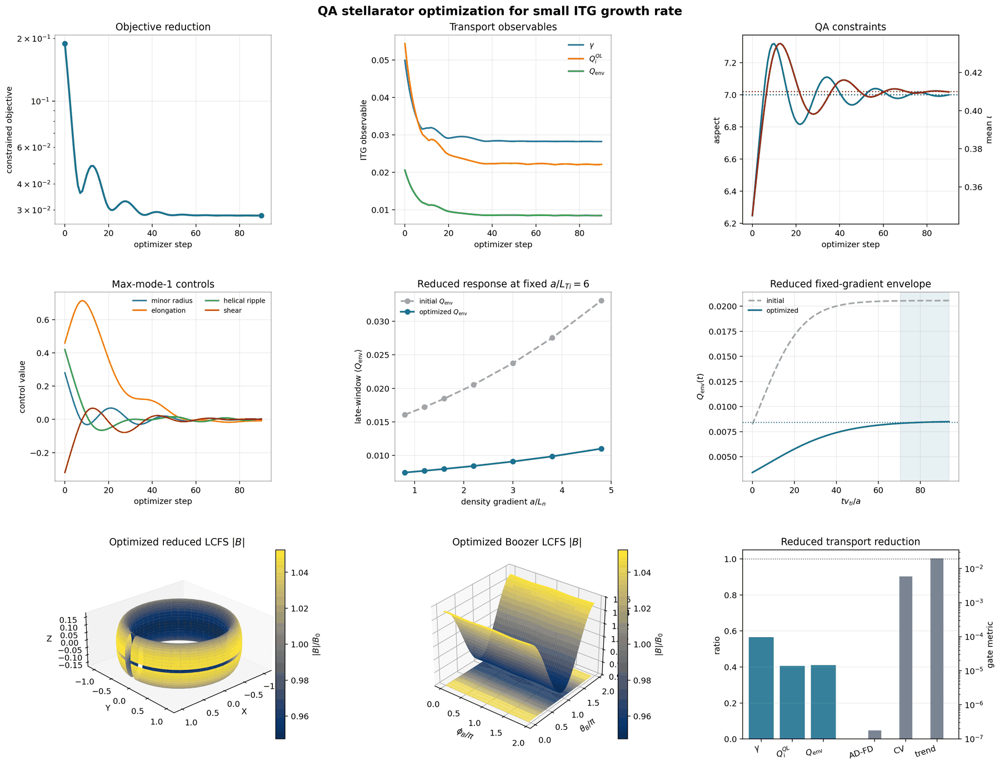

   Growth-rate objective history, coupled transport observables, reduced
   ``a/L_n`` response, fixed-gradient ``Q_env`` trace, optimized reduced LCFS
   ``|B|`` surface, and reduced Boozer-LCFS ``|B|`` map. These geometry
   panels are reduced max-mode-1 diagnostics, not solved VMEC WOUT plots.

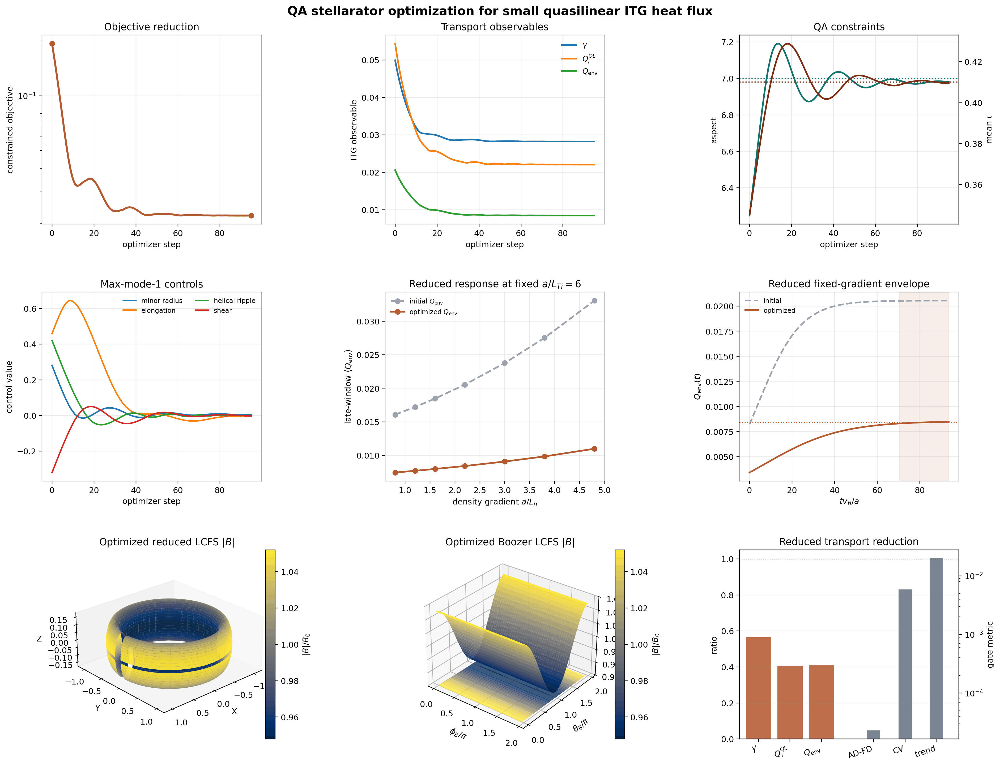

   Quasilinear heat-flux objective history and the same reduced scan, trace,
   LCFS ``|B|``, and Boozer-LCFS ``|B|`` diagnostics. The quasilinear
   objective uses the differentiable mixing-length feature map tested in
   :doc:`quasilinear`; it is still a reduced diagnostic, not a promoted
   absolute-flux predictor.

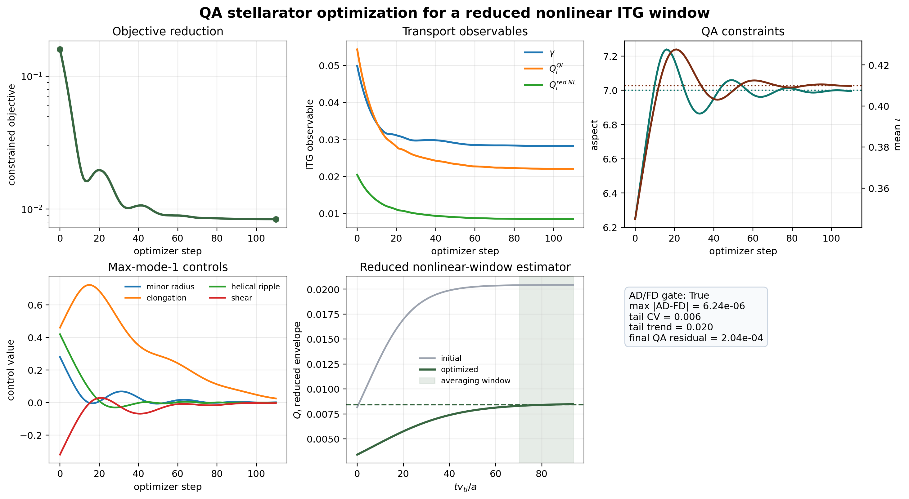

   Reduced nonlinear-window objective history, fixed-gradient heat-flux
   envelope, reduced density-gradient response, and reduced LCFS/Boozer
   ``|B|`` diagnostics. The shaded region is the averaging window used in the
   objective. The shipped artifact records a low coefficient of variation and
   trend for the optimized late-time window, so the plotted average is
   meaningful for this reduced model; production turbulent-flux optimization
   still requires solved-WOUT nonlinear transport audits.

Zonal-flow Objective Contract
-----------------------------

The next stellarator-optimization lane targets geometries with stronger zonal
response before claiming nonlinear turbulence suppression. The backend-free
contract lives in :mod:`spectraxgk.objectives.zonal`. It reduces tensors of
``residual_level``, ``damping_rate``, optional ``linear_growth_rate``, and
optional ``recurrence_amplitude`` over a ``(surface, alpha, kx)`` portfolio.
The minimization objective rewards large residual zonal flow through an
``inverse_residual`` column and penalizes damping, growth not screened by the
residual, and late-time recurrence amplitude.

This is deliberately a reduced objective gate. It is appropriate for
``vmec_jax -> booz_xform_jax -> SPECTRAX-GK`` sensitivity analysis once each
row is produced by a validated zonal-response run and the
AD/finite-difference gate passes. It is not, by itself, a turbulence-reduction
claim. A promoted result must still show matched baseline and optimized
long-window nonlinear heat-flux audits, with post-transient running averages
and seed/timestep/grid uncertainty.

The CI-scale gate is:

.. code-block:: bash

   pytest -q tests/test_zonal_objective.py tests/tools/artifacts/test_build_zonal_flow_objective_gate.py
   python tools/artifacts/build_zonal_flow_objective_gate.py

The test exercises the optimization contract that the literature motivates:
larger residuals and lower damping lower the scalar objective, the
surface/field-line/wavenumber portfolio shape is explicit, and the resulting
row map passes AD/finite-difference and conditioning checks before optimizer
use.

``tools/artifacts/build_zonal_flow_objective_gate.py`` is the artifact bridge from
validated zonal-response outputs to optimizer rows.  It currently emits a
W7-X diagnostic artifact from ``w7x_zonal_response_panel.csv`` and
``w7x_zonal_reference_compare.csv``.  Because the frozen W7-X trace still has
open long-window recurrence/damping gates, the artifact is intentionally
marked ``promotion_ready=false`` and ``gate_index_include=false``.  A promoted
QA/QH/Miller-style optimization gate should instead run the same builder with
``--missing-damping-policy=fail`` so absent GAM damping or recurrence metrics
stop the workflow.

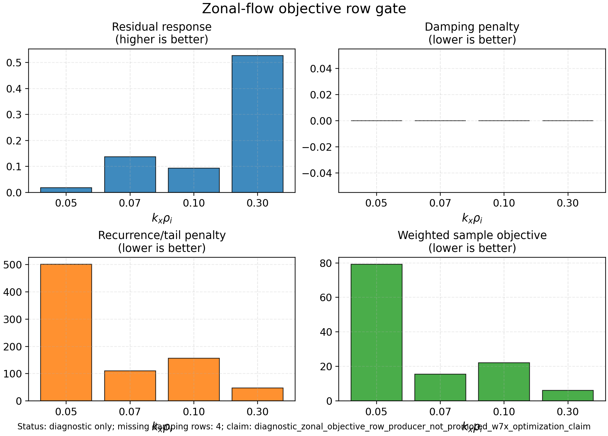

   Zonal-flow objective row-production gate.  The panel shows the row metrics
   consumed by the reduced objective for each W7-X ``k_x``.  Large residuals
   lower the inverse-residual penalty, while large late-window tail ratios
   remain explicit penalties.  The current W7-X artifact is a diagnostic
   bridge, not a promoted optimization claim, because the damping fits are not
   closed under the paper-facing normalization.

Connection to Literature
------------------------

The current implementation is closest in spirit to direct microstability
optimization [Jorge24]_: it makes a differentiable linear or quasilinear
transport proxy available inside a stellarator objective. It also follows the
lesson from nonlinear turbulence optimization [Kim24]_: final heat-flux claims
must be audited with nonlinear windows because linear and quasilinear proxies
can fail when nonlinear saturation physics changes.

The next manuscript-level step is therefore not to promote this reduced model
as an absolute flux predictor. The correct next step is to replace the reduced
feature map with a parity-checked in-memory geometry pipeline and then audit
the optimized shapes with converged nonlinear SPECTRAX-GK runs.

Solver-objective Geometry Gradients
-----------------------------------

The first production-adjacent solver-gradient gate now differentiates actual
electrostatic linear-RHS eigenpair observables with respect to solver-ready
geometry arrays. The gate uses the implicit left/right non-Hermitian eigenpair
sensitivity system and compares the result against nearest-branch central
finite differences for ``gamma``, ``omega``, ``<k_perp^2>``, linear
heat/particle-flux weights, and a mixing-length heat-flux proxy. This closes
the ``FluxTubeGeometryData`` contract-level solver-gradient check and the first
full ``vmec_jax`` state-coefficient to ``booz_xform_jax`` to solver
eigenfrequency-gradient gate. The companion QH all-surface artifact closes the
reduced full-chain quasilinear heat-flux-weight gradient gate for the tracked
manuscript fixture. A second Li383 low-resolution holdout now verifies the
same frequency and quasilinear gradient contracts at ``mboz=nboz=21``; the
combined holdout matrix has maximum relative AD/finite-difference mismatch
``4.9e-3`` across the reduced linear/quasilinear objectives. Companion QH and
Li383 reduced nonlinear-window estimator gates now differentiate a smooth
late-window heat-flux envelope through the same VMEC/Boozer state path; the
expanded matrix including those estimator rows has maximum relative mismatch
``2.7e-2``. This closes a multi-equilibrium bounded estimator-gradient check for
nonlinear-window-style reduced objectives, but it does not close converged
nonlinear-window turbulence gradients or broad optimized-equilibrium nonlinear
transport claims.

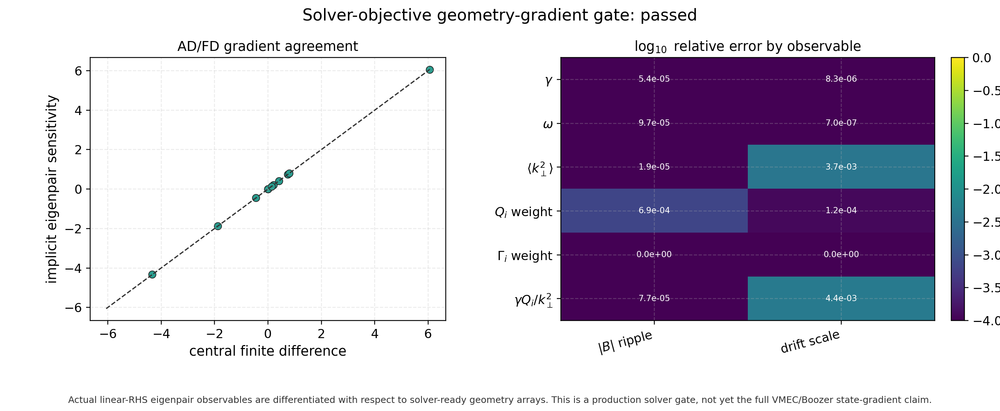

   Solver-ready geometry-gradient gate. The left panel compares implicit
   eigenpair sensitivities with central finite differences; the right panel
   shows per-observable relative errors for the two geometry controls.

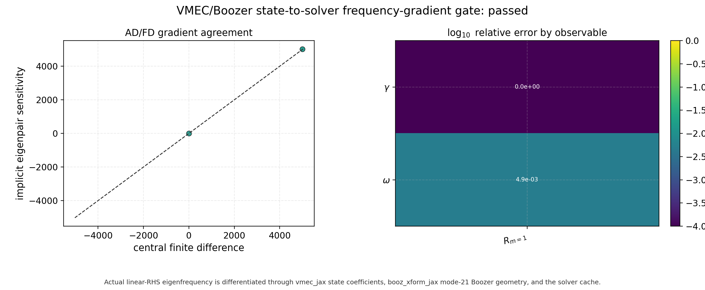

   Full-chain VMEC/Boozer eigenfrequency-gradient gate. A real ``vmec_jax``
   state coefficient is perturbed, converted through ``booz_xform_jax`` with
   ``mboz=nboz=21``, mapped into the SPECTRAX-GK linear solver, and checked
   against central finite differences.
   The artifact tools also accept explicit VMEC ``radial_index``,
   ``mode_index``, and ``surface_index`` controls so conditioning scans can
   choose physically meaningful state perturbations without changing source
   code.

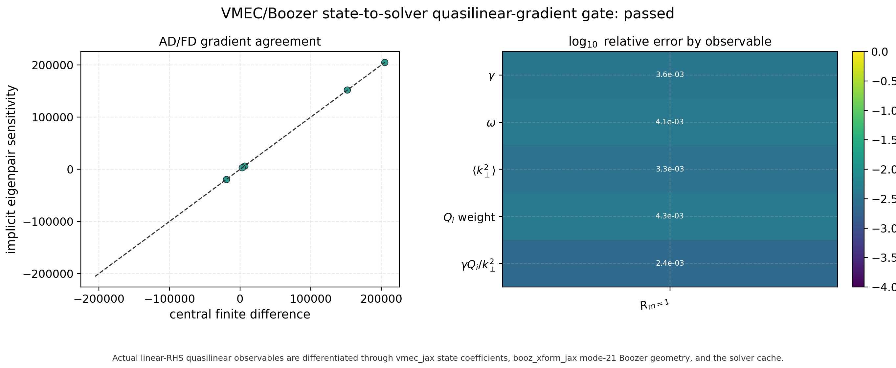

   Full-chain VMEC/Boozer quasilinear-gradient gate. The same state
   coefficient is mapped through ``vmec_jax`` and ``booz_xform_jax`` with
   ``mboz=nboz=21`` and a richer ``Nl=2, Nm=3`` SPECTRAX-GK moment basis.
   The implicit left/right eigenpair sensitivity of ``gamma``, ``omega``,
   ``<k_perp^2>``, the electrostatic heat-flux weight, and
   ``gamma Q_i/k_perp^2`` agrees with central finite differences to
   ``4.3e-3`` relative error in the tracked artifact. This closes the
   linear/quasilinear full-chain gradient gate for reduced stellarator
   objectives on the all-surface QH fixture. The optional Boozer surface-stencil
   path is a memory-bounded diagnostic for larger equilibria, not the published
   accuracy gate; QI/QA multi-equilibrium transport-gradient promotion remains
   open until all-surface or otherwise accuracy-equivalent gates pass. This is
   still not a nonlinear-window heat-flux gradient claim.

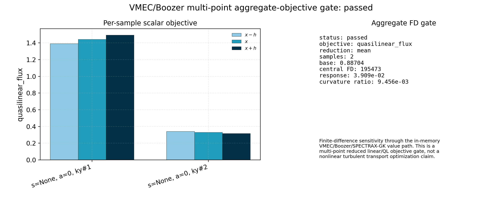

   Multi-point VMEC/Boozer aggregate-objective gate. The tracked QH fixture
   evaluates the quasilinear proxy at two resolved ``k_y`` samples using
   ``mboz=nboz=21`` and records the aggregate finite-difference response
   through the same in-memory VMEC/Boozer/SPECTRAX-GK value path. This closes
   the software and artifact path for multi-``k_y`` reduced objectives; it is
   not a nonlinear turbulent heat-flux optimization claim. The tracked
   two-``k_y`` artifact intentionally does not satisfy the held-out
   surface/field-line promotion gate by itself.

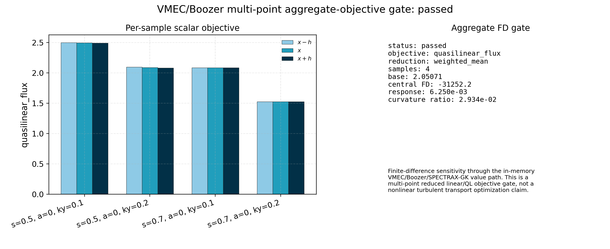

   Physical-surface VMEC/Boozer aggregate-objective gate. The same QH fixture
   evaluates the quasilinear proxy at two normalized toroidal-flux values
   (``torflux = 0.5`` and ``0.7``) and two physical ``k_y rho_i`` values
   (``0.1`` and ``0.2``). The JSON/CSV sidecars record the requested physical
   ``torflux`` and ``k_y`` values, the resolved solver ``selected_ky_index``,
   and ``ky_abs_error``. The companion
   ``vmec_boozer_torflux_reduced_portfolio_guard.json`` passes with two
   surfaces, one field line, and two ``k_y`` samples; this is surface-axis
   reduced-objective evidence, not nonlinear turbulent-transport optimization
   evidence.

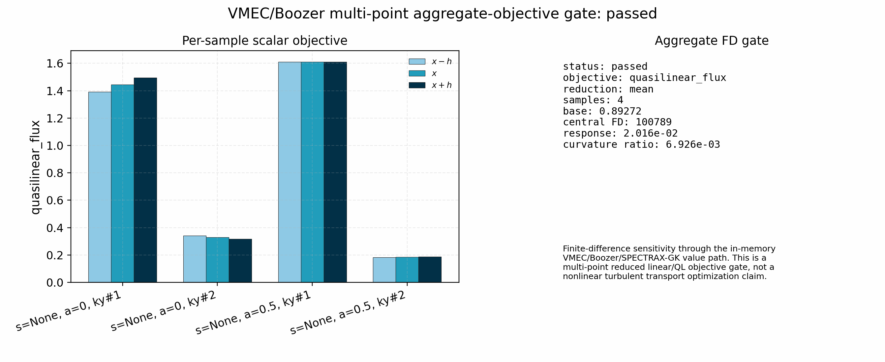

   Multi-alpha VMEC/Boozer aggregate-objective gate. The QH fixture repeats the
   same quasilinear finite-difference audit over two field lines
   (``alpha = 0`` and ``0.5``) and two ``k_y`` samples using ``mboz=nboz=21``.
   The tracked artifact has four samples, passes the curvature gate with
   curvature ratio about ``6.9e-3``, and is the current reduced-objective
   evidence for field-line coverage. It still remains a reduced
   linear/quasilinear objective gate, not an optimized-equilibrium nonlinear
   transport claim. The reduced-portfolio guard in
   ``docs/_static/vmec_boozer_reduced_portfolio_guard.json`` now verifies that
   these real rows satisfy the backend-free reducer contract and the
   growth/QL AD/FD provenance boundary.

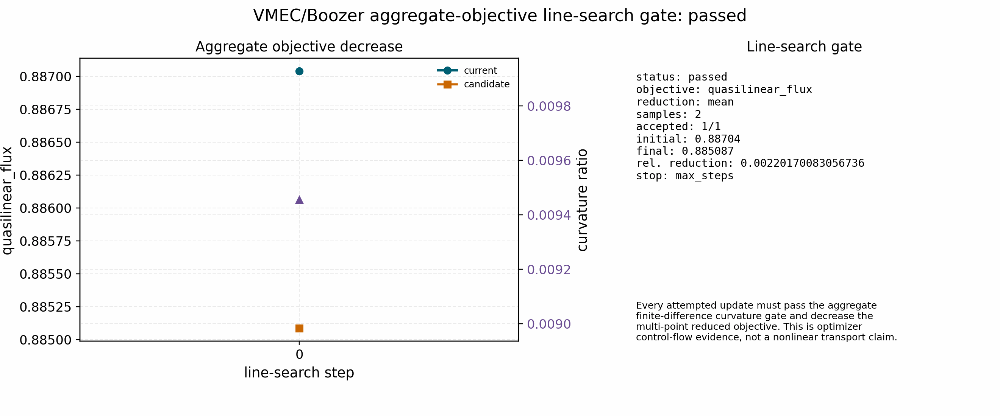

   Multi-point VMEC/Boozer aggregate-objective line-search gate. The tracked
   QH fixture applies one curvature-gated VMEC coefficient update to the
   two-``k_y`` quasilinear proxy aggregate and accepts it only because the
   candidate decreases the objective while the finite-difference gate remains
   conditioned. This is optimizer control-flow evidence for reduced objectives,
   not a nonlinear turbulent transport optimization claim. It must be paired
   with held-out ``surface_index`` or field-line ``alpha`` validation before it
   can support an optimized-equilibrium transport claim.

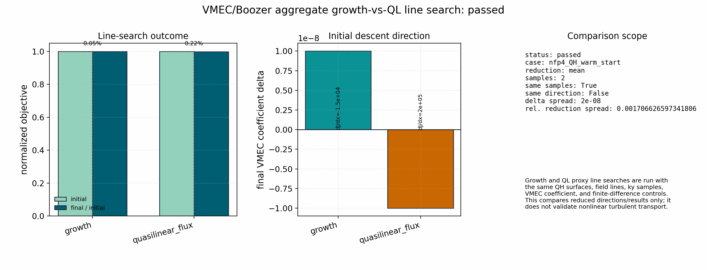

   Growth-vs-quasilinear aggregate line-search comparison. The growth and
   quasilinear proxy objectives both pass a one-step curvature-gated line
   search on the same QH sample set, but their initial descent directions
   differ. This is important for manuscript claims: optimizing growth rate,
   quasilinear proxy, and nonlinear transport are related but not identical
   objective choices, so each must carry its own validation and holdout gate.

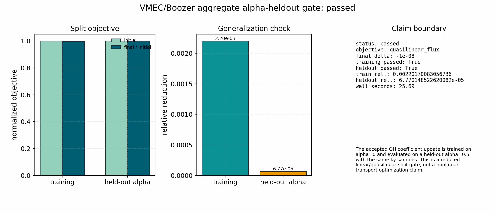

   Alpha-heldout aggregate line-search gate. The same accepted quasilinear
   update is trained on the ``alpha=0`` QH field line and evaluated on the
   held-out ``alpha=0.5`` field line with the same two ``k_y`` samples. The
   tracked artifact passes, with training relative reduction about ``2.2e-3``
   and held-out relative reduction about ``6.8e-5``. This is useful reduced
   field-line generalization evidence, but it is intentionally blocked from the
   production promotion gate because it is still a reduced linear/quasilinear
   objective split, not a nonlinear transport validation.

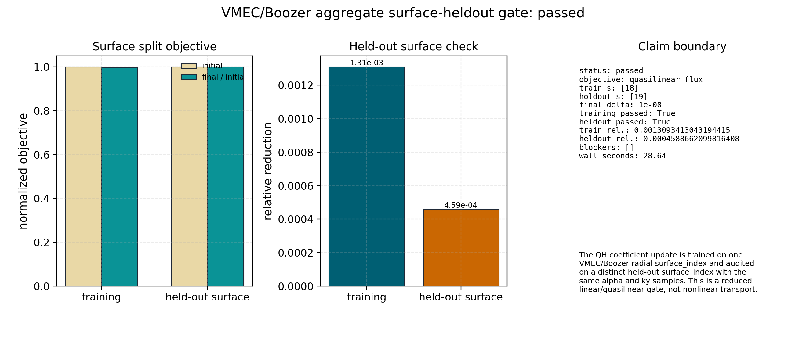

   Surface-heldout aggregate line-search gate. The QH quasilinear update is
   trained on explicit ``surface_index = 18`` and evaluated on held-out
   ``surface_index = 19`` with the same ``alpha=0`` and two ``k_y`` samples.
   The tracked artifact passes with training relative reduction about
   ``1.31e-3`` and held-out-surface relative reduction about ``4.59e-4``. This
   closes a true reduced surface-generalization check; it still remains a
   reduced linear/quasilinear objective gate rather than a nonlinear transport
   validation.

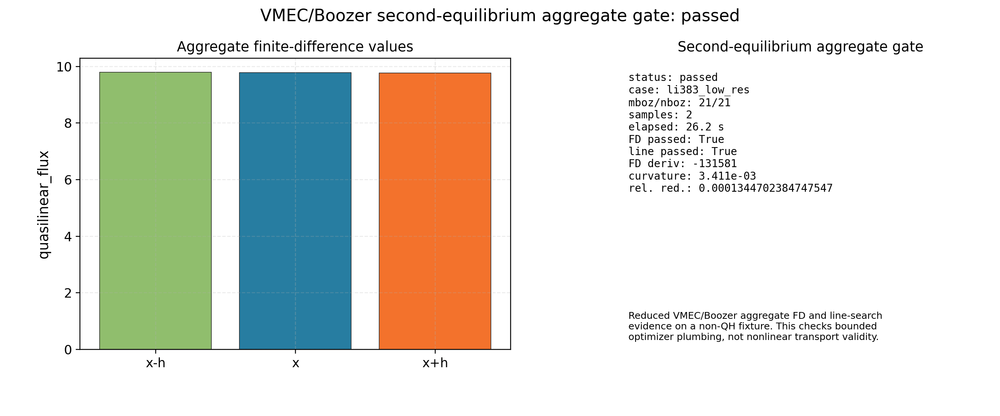

   Second-equilibrium aggregate-objective gate. The Li383 fixture passes the
   same mode-21 VMEC/Boozer aggregate finite-difference and one-step
   line-search path with two ``k_y`` samples. The finite-difference curvature
   ratio is about ``3.4e-3`` and the line search reduces the reduced
   quasilinear objective by about ``1.34e-4``. This is second-equilibrium
   optimizer-plumbing evidence, not a calibrated saturated-flux or nonlinear
   transport claim.

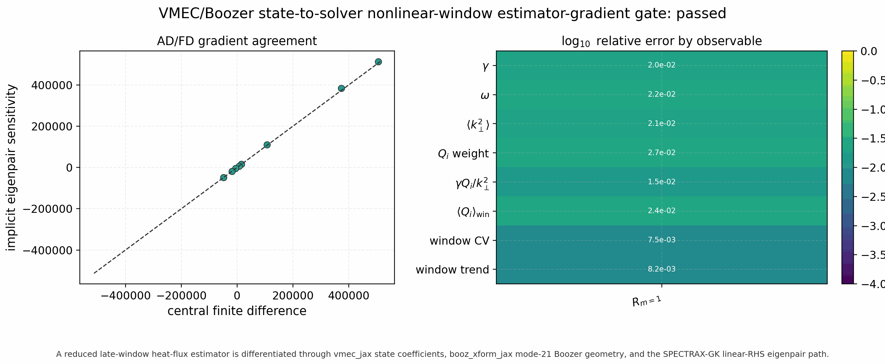

   Reduced nonlinear-window estimator-gradient gate for the QH fixture. The
   full VMEC/Boozer state-to-solver path produces linear-RHS observables, then
   a smooth RK2 late-window envelope maps those observables to mean heat flux,
   window coefficient of variation, and normalized trend. The plot compares
   implicit eigenpair AD sensitivities against central finite differences. The
   companion Li383 artifact is included in the holdout matrix. These are
   differentiability and conditioning gates for reduced objectives, not
   converged nonlinear-turbulence heat-flux-gradient claims.

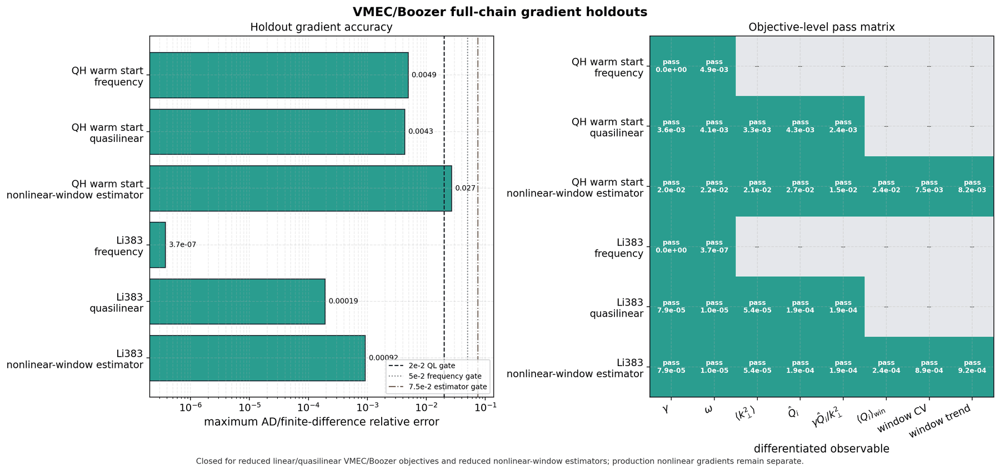

   Multi-equilibrium VMEC/Boozer gradient holdout matrix. QH and Li383
   frequency, quasilinear, and reduced nonlinear-window estimator gates all
   pass with ``mboz=nboz=21``. The matrix is a reduced differentiability gate;
   converged nonlinear-window turbulence gradients remain a separate promotion
   requirement.

Promotion Gates for Full VMEC/Boozer/GK Optimization
----------------------------------------------------

The full production stellarator optimization claim remains open until all of
the following pass:

1. ``vmec_jax`` state to ``booz_xform_jax`` to ``FluxTubeGeometryData`` works
   in memory without writing intermediate VMEC or EIK files.
   The current bridge already validates the optional ``vmec_jax`` boundary
   derivative, real ``vmec_jax`` metric-tensor derivatives, a real
   non-axisymmetric VMEC field-line tensor derivative through
   ``vmec_jax.geom`` plus ``vmec_jax.vmec_bcovar``, a real
   VMEC tensor-derived flux-tube mapping derivative, a real
   ``booz_xform_jax`` spectral derivative, and a bounded
   Boozer-``|B|``-to-flux-tube mapping derivative. It now also starts from a
   real ``vmec_jax`` ``VMECState``, perturbs VMEC Fourier coefficients,
   converts through ``booz_xform_jax``, and checks SPECTRAX-GK field-line
   geometry-observable derivatives against central finite differences. The
   same artifact now records a direct-VMEC-tensor vs imported-VMEC/EIK
   array-parity audit plus a Boozer equal-arc core audit. The core audit now
   matches the imported ``bmag``, ``bgrad``, ``gradpar``, ``q``, ``s_hat``,
   Jacobian, zero-beta ``gds*``/``grho`` metric convention, and zero-beta
   loaded ``cvdrift``/``gbdrift`` drift convention at release tolerance. The
   remaining gap is finite-beta and broader production-runtime drift parity
   beyond the tracked zero-beta equal-arc fixtures before broad transport-gradient
   claims are promoted.
   The reverse-mode state-level bridge additionally requires
   ``booz_xform_jax`` at or after commit ``1d5e8c``; earlier JAX Boozer
   transforms can have finite values but non-finite zero-mode cotangents.
2. The sampled field-line arrays match the existing imported-VMEC/EIK runtime
   path for at least one small equilibrium.
3. Geometry-observable gradients match central finite differences for the
   in-memory bridge.
4. Linear growth-rate, frequency, and quasilinear-weight gradients through the
   solver-ready geometry contract pass finite-difference or implicit-eigenpair
   checks. This is closed by
   ``docs/_static/solver_objective_gradient_gate.json`` for a small actual
   linear-RHS fixture. The full mode-21 VMEC/Boozer state-to-solver
   eigenfrequency gate is also closed by
   ``docs/_static/vmec_boozer_solver_frequency_gradient_gate.json``. The
   full mode-21 VMEC/Boozer state-to-solver quasilinear heat-flux-weight gate
   is closed by
   ``docs/_static/vmec_boozer_quasilinear_gradient_gate.json`` on the tracked
   all-surface QH fixture. The multi-equilibrium reduced linear/quasilinear
   and nonlinear-window estimator holdout gate is closed by
   ``docs/_static/vmec_boozer_gradient_holdout_matrix.json`` for QH and
   Li383 at ``mboz=nboz=21``. The finite-beta shaped-pressure
   eigenfrequency-gradient gate is closed separately by
   ``docs/_static/vmec_boozer_shaped_pressure_solver_frequency_gradient_gate.json``
   with max relative AD/finite-difference error about ``6.4e-11``. The
   finite-beta shaped-pressure quasilinear-gradient gate is closed by
   ``docs/_static/vmec_boozer_shaped_pressure_quasilinear_gradient_gate.json``
   with max relative error about ``2.1e-4``. The finite-beta shaped-pressure
   reduced nonlinear-window estimator-gradient gate is closed by
   ``docs/_static/vmec_boozer_shaped_pressure_nonlinear_window_gradient_gate.json``
   with max relative error about ``2.1e-4``; this still does not promote
   finite-beta converged nonlinear transport gradients.
   Larger QI/QA nonlinear-window transport holdouts
   are still promotion work: QI is currently conditioning-limited when forced
   through the narrow diagnostic stencil, while the QA low-resolution
   all-surface Boozer transform exceeds the available office GPU memory at
   ``mboz=nboz=21``.
5. Host scalar materialization in production runtime caches is removed or
   isolated so geometry parameters remain traceable.
6. A nonlinear heat-flux objective has a validated adjoint, VJP, or robust
   stochastic/finite-difference estimator with a documented window rule. The
   reduced estimator-gradient gate at
   ``docs/_static/vmec_boozer_nonlinear_window_gradient_gate.json`` and the
   Li383 holdout at
   ``docs/_static/vmec_boozer_li383_nonlinear_window_gradient_gate.json``
   cover the first multi-equilibrium bounded estimator path; production claims
   still need converged nonlinear-window turbulence gradients or robust
   optimized-equilibrium finite-difference audits.
7. Optimized geometries pass multi-field-line, multi-surface, grid/window
   convergence, and nonlinear holdout gates before being used for transport
   claims. The current multi-point VMEC/Boozer aggregate API closes the
   software plumbing for this gate, but the manuscript claim remains bounded
   until the corresponding aggregate artifacts pass on the selected
   equilibria. ``tools/release/check_vmec_boozer_aggregate_holdout_gate.py`` is the
   artifact-level promotion check for this boundary: aggregate finite-difference
   and line-search artifacts must pass on the same training sample set, and at
   least one independent passed validation artifact must cover a held-out
   ``surface_index`` or field-line ``alpha``. Additional ``k_y`` coverage is
   useful, but ``k_y``-only holdout evidence does not satisfy the
   surface/field-line gate. A passed replicated nonlinear-window ensemble is
   also required before the optimized-equilibrium claim can be promoted from
   reduced-objective evidence to production nonlinear transport evidence. The
   current frozen promotion artifact,
   ``docs/_static/vmec_boozer_aggregate_holdout_promotion_gate.json``, is
   blocked as intended: reduced held-out-alpha and held-out-surface artifacts
   now pass, but they remain reduced-objective evidence, while the D-shaped and
   circular replicated nonlinear-window ensembles are holdout/calibration
   evidence. The selected optimized QA equilibrium now has its own replicated
   long-window nonlinear audit, which closes the optimized-equilibrium
   post-transient transport-window evidence requirement for this scoped
   candidate.
   ``tools/campaigns/write_optimized_equilibrium_transport_configs.py`` is the launch
   contract for that final audit. Given a concrete post-optimization
   ``wout*.nc``, it writes the release ``n64`` nonlinear transport replicate
   ladder, including ``t=250,350,450,700`` continuations, two random-seed
   replicates, one timestep replicate, and the exact ensemble/guard commands.
   The current selected candidate has completed that ladder. The generated
   ``t=[350,700]`` ensemble passes finite-flux, running-window, block/SEM,
   replicate-spread, and optimized-equilibrium marker gates, with ensemble mean
   ion heat flux ``10.19``, mean-relative spread ``0.038``, and combined
   SEM/mean ``0.021``.

   Example launch-contract generation:

   .. code-block:: bash

      python tools/campaigns/write_optimized_equilibrium_transport_configs.py \
        --vmec-file /path/to/wout_optimized_equilibrium.nc \
        --case optimized_equilibrium_post_optimization \
        --out-dir tools_out/optimized_equilibrium_replicates

   The current QA ``vmec_jax`` optimized-equilibrium candidate has also been
   screened through the SPECTRAX-GK linear/quasilinear runtime before launching
   the large nonlinear campaign. On the sampled ITG branch
   ``k_y rho_i = 0.095, 0.190, 0.300, 0.476, 0.667``, all fitted growth rates
   are negative, with the least damped point at ``gamma≈-0.015``. The
   quasilinear mixing-length diagnostic therefore reports zero saturated heat
   flux because stable modes are excluded by the current growth-floor rule. The
   nonlinear audit for this candidate is therefore interpreted as a
   post-transient optimized-equilibrium transport-window check, not as evidence
   that the uncalibrated quasilinear zero-flux estimate predicts an absolute
   saturated flux. The separate projected-gradient candidate above is a negative
   long-window transfer audit and is intentionally not used as the selected
   optimized-equilibrium success case.

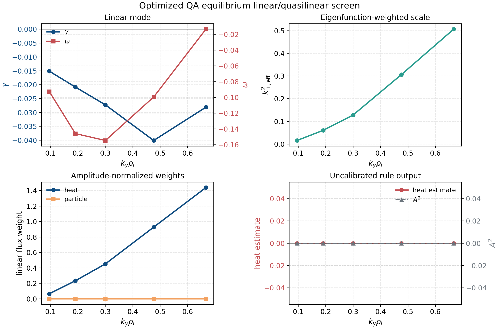

   Linear/quasilinear screen for the QA optimized-equilibrium candidate from
   ``vmec_jax``. The sampled ITG branch is linearly damped across the scan, so
   the uncalibrated quasilinear heat-flux estimate is zero under the stable-mode
   exclusion rule. The subsequent nonlinear audit shows finite post-transient
   heat flux, so this panel should be read as a stability/branch screen rather
   than as an absolute-flux prediction.

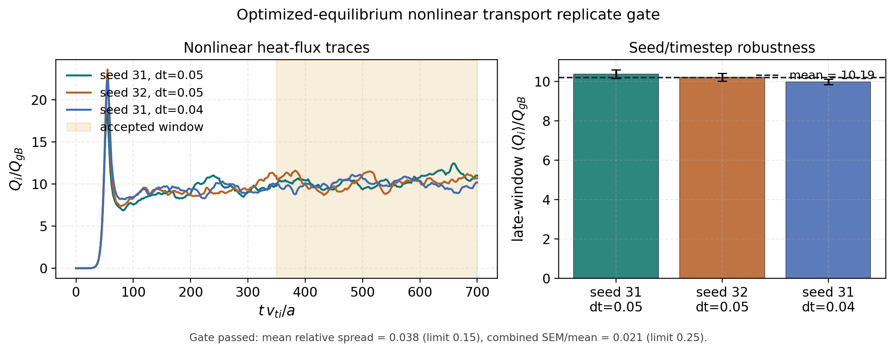

   Optimized-equilibrium nonlinear replicate gate. Two seed replicates and one
   timestep replicate are advanced to ``t≈700`` at ``n64`` and accepted over the
   post-transient window ``t=[350,700]``. The ensemble passes with mean ion heat
   flux ``10.19``, mean-relative spread ``0.038``, and combined SEM/mean
   ``0.021``. This closes the scoped optimized-equilibrium transport-window
   evidence gate; broader nonlinear turbulence-gradient and absolute-flux model
   claims remain separate gates.

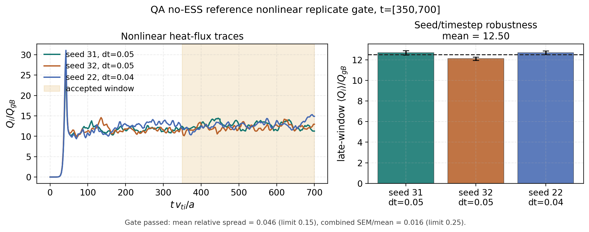

   Matched no-ESS reference replicate gate. The valid finite-transform QA
   ``no_ess`` equilibrium from the same ``vmec_jax`` campaign is advanced with
   the same grid, seeds, timestep variant, and post-transient window as the
   selected optimized QA/ESS equilibrium. The reference ensemble passes with
   mean ion heat flux ``12.50``, mean-relative spread ``0.046``, and combined
   SEM/mean ``0.016``.

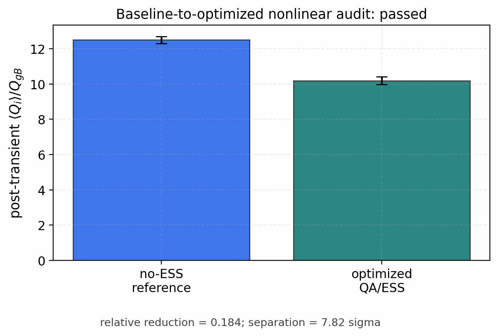

   Matched baseline-to-optimized nonlinear audit. Against the validated no-ESS
   reference ensemble, the optimized QA/ESS equilibrium reduces the
   post-transient ion heat flux from ``12.50`` to ``10.19``. The relative
   reduction is ``0.184`` and the difference is separated by ``7.82`` combined
   SEMs. The zero-transform raw ``wout_initial.nc`` from the VMEC optimization
   is intentionally excluded because it cannot define the same finite-twist
   flux-tube baseline.

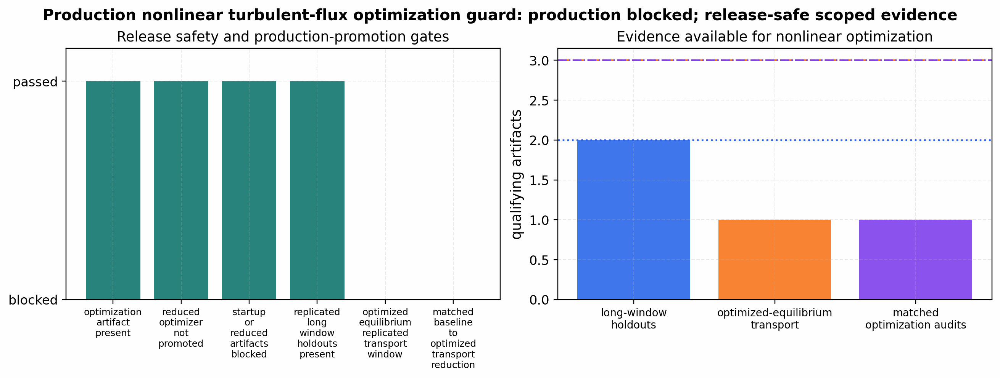

   Production nonlinear turbulent-flux optimization guard. The release-safety
   side passes because startup and reduced nonlinear artifacts are explicitly
   blocked from production promotion and three long post-transient replicated
   holdout ensembles pass: D-shaped VMEC, circular VMEC, and the QH
   VMEC/Boozer held-out surface/field-line transport run. The selected
   optimized-equilibrium audit contributes one accepted matched audit, and the
   strict ``t=1500`` growth/QL/nonlinear-window optimized-candidate traces close
   the optimized-equilibrium ensemble-count requirement. The current guard now
   promotes the scoped nonlinear turbulent-flux optimization evidence because
   ``3/3`` required matched audits pass the explicit ``2%`` long-window
   reduction policy: the no-ESS-to-optimized QA/ESS audit gives ``18.4%``,
   while two full max-mode-5 projected-weight audits give ``2.68%`` and
   ``3.35%``. Three strict ``t=1500`` QA objective candidates remain negative
   transfer evidence, so broad multi-surface, multi-field-line nonlinear
   transport-optimization claims still require separate gates.

The release claim is now: SPECTRAX-GK has a tested differentiable stellarator
ITG objective-reduction workflow, long-window nonlinear holdout evidence, and a
scoped optimized-equilibrium replicated nonlinear transport audit with a matched
finite-transform no-ESS reference comparison. It is still not a universal
absolute-flux quasilinear model, a nonlinear turbulence-gradient optimizer, or a
broad multi-surface stellarator transport-optimization claim.

The next nonlinear turbulence-gradient promotion is now encoded as a
fail-closed evidence gate in
``docs/_static/nonlinear_turbulence_gradient_evidence_gap_report.json``. That
gate requires paired ``baseline``, ``plus_delta``, and ``minus_delta`` nonlinear
campaigns around the same VMEC/profile parameter, the same seed/timestep
replicate set for every parameter state, post-transient heat-flux averages,
passed ensemble uncertainty gates for all three states, and a central
finite-difference audit with bounded response, asymmetry, condition number, and
gradient uncertainty. Existing standalone replicated transport windows remain
necessary evidence but are not sufficient to claim a production nonlinear
turbulence gradient.
The current real boundary-gradient sweep starts from the optimized QA/ESS
equilibrium, re-equilibrates each perturbed VMEC input with ``vmec_jax``, runs
three seed/timestep nonlinear replicates to ``t=900`` for each parameter state,
and analyzes the common ``t=[450,900]`` transport window. The tracked
``ZBS(1,0)`` 5% campaign closes the earlier finite-difference locality blocker:
``fd_asymmetry_rel = 0.274`` and the response fraction is ``0.0685``. It still
fails closed because the propagated gradient uncertainty is ``0.768 > 0.5``.
The companion ``ZBS(1,1)`` 5% campaign gives the complementary negative result:
``gradient_uncertainty_rel = 0.225`` passes, but ``fd_asymmetry_rel = 0.663`` is
still above the locality gate. This is now a robust production-candidate audit
set, not a promoted nonlinear turbulence-gradient validation.
A later seed-5 follow-up of the best ``ZBS(1,0)`` bracket kept the
baseline/plus/minus long-window ensembles valid but did not close the claim:
``gradient_uncertainty_rel`` increased to about ``1.18``, ``fd_asymmetry_rel``
was about ``0.520``, and one matched-seed central finite difference changed
sign. The scientific conclusion is therefore fail-closed: the current
single-control bracket is a useful diagnostic, but it is not efficient to keep
adding replicas at the same amplitude without a new locality/amplitude sweep or
a smoother composite profile-gradient direction.
``docs/_static/nonlinear_turbulence_gradient_candidate_ranking.json`` ranks the
completed ``RBC(1,1)``, ``ZBS(1,1)``, and ``ZBS(1,0)`` attempts. Its current
recommendation is to move to an overdetermined least-squares/profile-gradient
campaign: the best single-control candidates fail in complementary ways, with
``ZBS(1,1)`` statistically clean but nonlocal and ``ZBS(1,0)`` local but too
noisy.
``tools/campaigns/summarize_nonlinear_gradient_bracket_sweep.py`` is the companion
amplitude-sweep utility for this decision. It consumes completed central-FD
artifacts for one control, plots gradient, response, asymmetry, and uncertainty
against perturbation amplitude, and preserves the same claim boundary: the
sweep can recommend the next campaign, but it does not promote a nonlinear
turbulence-gradient claim unless one input artifact already passes the
production long-window gate. If resolved central finite differences change sign
across nearby amplitudes, the utility recommends a new locality/amplitude sweep
or smoother composite profile-gradient control instead of more replicas at one
amplitude. The tool now also enforces the same-control contract explicitly: a
mixed-control input set is rejected as a candidate-ranking problem, not a
bracket sweep. The tracked ``RBC(1,1)`` 5%/8% sweep is a negative but useful
result: both amplitudes have resolved responses and acceptable-to-marginal
uncertainty, but the finite-difference asymmetry worsens from about ``0.897``
to ``1.895`` as the bracket grows. The recommendation is therefore to shrink
the perturbation or move to a more local/composite profile-gradient control
before spending more nonlinear GPU time.
The concrete overdetermined campaign is tracked in
``docs/_static/qa_ess_overdetermined_nonlinear_gradient_campaign_plan.json``.
It starts from the same optimized-QA/ESS VMEC input, writes matched
``vmec_jax`` perturbation inputs for ``ZBS(1,1)``, ``ZBS(1,0)``, and
``RBC(1,1)`` at 3% relative amplitude, and launches identical
``t=900``, ``n64:64:64:40:40`` nonlinear ladders. That full campaign and the
targeted ``RBC(1,1)`` seed follow-up have now completed: all 33 relevant
runtime outputs pass the output gates, all three ``RBC(1,1)``
baseline/plus/minus five-member replicated ensembles pass, and the central-FD
artifact is local and response-resolved. It remains fail-closed because the
propagated gradient uncertainty is still above the promotion gate:
``gradient_uncertainty_rel = 0.683 > 0.5``. The companion controls fail for
complementary reasons: ``ZBS(1,1)`` passes uncertainty but is nonlocal
(``fd_asymmetry_rel = 0.605``), while ``ZBS(1,0)`` is not response-resolved.
The final status artifact,
``docs/_static/qa_ess_overdetermined_nonlinear_gradient_campaign_status.json``,
therefore reports complete runtime coverage but zero promoted controls. The
post-runtime command
``tools/campaigns/postprocess_overdetermined_nonlinear_gradient_campaign.py`` is the
reproducible fail-closed path that produced these output, ensemble,
central-FD, ranking, and status artifacts.
The bounded follow-up decision is tracked separately in
``docs/_static/qa_ess_overdetermined_nonlinear_gradient_followup_plan.json``
and can be regenerated with
``tools/campaigns/plan_nonlinear_gradient_followup.py``. That follow-up recommended only
two new matched nominal-timestep ``RBC(1,1)`` seed replicas per state
(``seed33`` and ``seed34`` for baseline, plus, and minus), because that was the
only completed overdetermined candidate whose response and locality already
passed. Those six office-GPU runs are now folded into the tracked five-member
state ensembles. The result is scientifically useful but negative: extra
replicas lowered the individual state SEMs, but the finite-difference response
remains too uncertain relative to the slope. More blind same-bracket replicas
are not the best next action; the next candidate should use a larger
response-resolved but locality-checked perturbation, variance reduction, or a
better-conditioned composite direction.
The latest bounded ``ZBS(1,0)`` follow-up uses a larger ``7.5%`` bracket and
four matched long-window outputs per state. All twelve ``t=900`` office-GPU
outputs pass the ``t=[450,900]`` runtime-output gates, and the central
finite-difference bracket now passes the response and locality gates:
``response_fraction = 0.0319`` and ``fd_asymmetry_rel = 0.044``. The claim still
fails closed because the plus-state ensemble has excessive spread
(``mean_rel_spread = 0.196 > 0.15``) and the propagated slope uncertainty is
too large (``gradient_uncertainty_rel = 1.81 > 0.5``). This is the clearest
evidence so far that the finite-difference direction can be made local, but it
also shows that plus-state turbulence variance must be reduced before any
production nonlinear turbulence-gradient claim is scientifically defensible.
``tools/campaigns/design_nonlinear_gradient_next_campaign.py`` now materializes that
decision into ``docs/_static/nonlinear_gradient_next_campaign_design.json``.
The design gate estimates the bracket scale needed to satisfy propagated
uncertainty, the locality-safe bracket scale implied by the asymmetry gate,
and the number of extra matched replicas needed after applying that locality
cap. The refreshed design scans all 16 tracked central-FD artifacts: zero are
promoted, one legacy candidate still admits a bounded matched-replica class,
and 15 require replacement, locality repair, or variance reduction. Because
the newest local ``ZBS(1,0)`` follow-up is plus-state variance limited, the
planner now recommends paired-seed or control-variate variance reduction
instead of more same-bracket replicas.
``tools/artifacts/build_nonlinear_gradient_variance_reduction_plan.py`` is the concrete
runbook for that recommendation. Applied to the rel7.5 artifact, it finds four
common plus/minus seed or timestep labels and estimates the paired response
uncertainty directly from matched differences. The paired estimator is better
conditioned than treating all state ensembles as independent, but it is still
not enough: ``paired_response_uncertainty_rel = 0.984`` and the estimated
requirement is 18 common pairs. A plus/minus midpoint common-mode screen is
promising, lowering the apparent residual uncertainty to ``0.238`` with a
``0.759`` SEM reduction, but the result is not promotable because that control
mean is not independently known. The next campaign therefore needs an
independent control-mean estimate or a better-conditioned response, not just a
few more blind paired seeds.
``tools/campaigns/write_nonlinear_gradient_control_variate_campaign.py`` converts this
screen into a launch contract for the independent control mean. With the
current sample variances and a ``1.10`` SEM safety factor, the midpoint
common-mode needs ``21`` new matched plus/minus pairs (``42`` nonlinear runs)
to project a combined response uncertainty of ``0.480``. That closes the
pre-run design question but not the physics claim; the actual runs must still
pass output, replicated-window, control-mean, and central-response gates.
The companion
``tools/artifacts/build_nonlinear_gradient_control_mean_gate.py`` consumes the post-run
plus/minus ensemble reports and evaluates the full uncertainty budget,
``SEM_total^2 = SEM_residual^2 + beta^2 SEM_control_mean^2``. This keeps the
control-variate path auditable: the sample-centered screen can motivate a
campaign, but only the independent control-mean gate can promote the response
uncertainty.
Because both single-control amplitude sweeps point away from more blind
replicas, SPECTRAX-GK now also includes
``tools/campaigns/write_vmec_boundary_profile_perturbation_inputs.py`` for a smoother
multi-coefficient direction. The tracked
``docs/_static/qa_ess_descent_profile_direction_rel2_manifest.json`` uses the
current long-window evidence signs to define a 2% descent-oriented direction:
decrease ``ZBS(1,1)`` while increasing ``ZBS(1,0)`` and ``RBC(1,1)`` with
smaller weights. The finite-difference scalar is the Euclidean norm of the
actual coefficient-change vector, so a successful downstream audit would
measure a directional sensitivity per boundary-coefficient norm. That full
campaign has now been run with real re-equilibrated VMEC files and matched
``t=900``, ``n64:64:64:40:40`` seed/timestep replicates. The output gates pass
for all nine runtime files, and the baseline and minus replicated ensembles
pass, but the plus ensemble fails its spread gate. The resulting central
finite-difference artifact remains fail-closed:
``response_fraction≈0.052`` is resolved, but
``fd_asymmetry_rel≈1.37`` and ``gradient_uncertainty_rel≈1.13`` exceed the
promotion gates. This is a useful negative production-candidate audit, not a
promoted nonlinear turbulence-gradient claim.

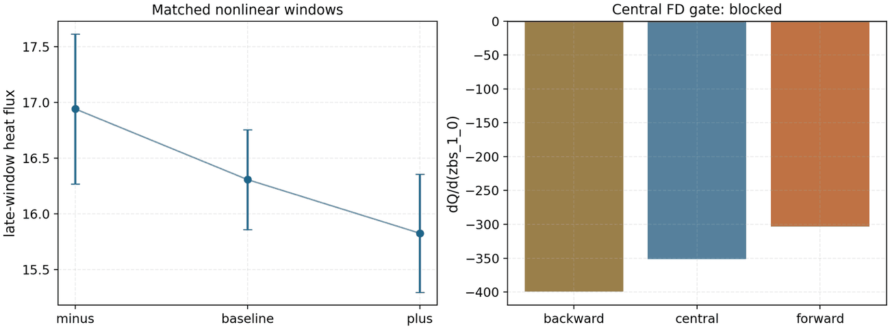

   QA/ESS ``ZBS(1,0)`` 5% long-window nonlinear turbulence-gradient gate. The left
   panel shows the replicated ``t=[450,900]`` heat-flux means for minus,
   baseline, and plus states; the right panel compares backward, central, and
   forward finite-difference gradients. The artifact is a production-candidate
   long-window campaign, but it remains blocked because the propagated
   gradient uncertainty is still above the release gate.

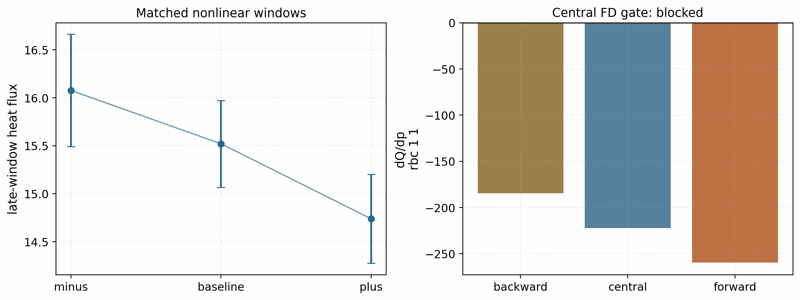

   QA/ESS overdetermined ``RBC(1,1)`` 3% long-window nonlinear-gradient gate.
   This remains the best completed overdetermined candidate after the targeted
   ``seed33``/``seed34`` follow-up: all five-member state ensembles pass and
   the backward/forward finite-difference asymmetry is below the locality gate.
   The artifact still fails closed because propagated uncertainty remains above
   the production threshold, so it supports model-development and
   next-campaign design rather than a promoted nonlinear turbulence-gradient
   claim.

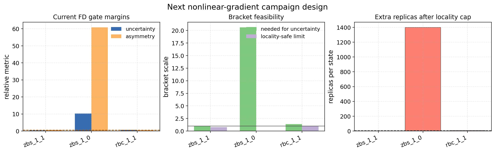

   Next nonlinear-gradient campaign design gate.  The left panel shows the
   current uncertainty and asymmetry margins, the middle panel compares the
   bracket scale required by uncertainty to the locality-safe bracket scale,
   and the right panel estimates extra replicas per state after applying the
   locality cap.  The refreshed artifact now scans all 16 tracked central-FD
   gates: no candidate is promoted, one legacy candidate admits a bounded
   matched-replica follow-up, and the remaining 15 candidates require
   replacement, locality repair, or variance reduction before more long-window
   GPU time is justified. The top-level action is now to attack the plus-state
   variance limiter with paired-seed or control-variate design.

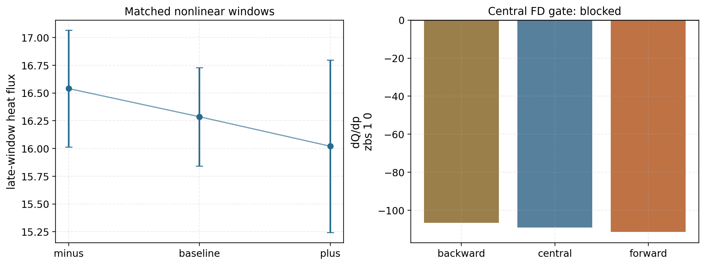

   QA/ESS ``ZBS(1,0)`` 7.5% bounded nonlinear-gradient follow-up. The response
   and finite-difference locality gates now pass, but the plus-state
   replicated window is too broad and the propagated gradient uncertainty is
   too large. This artifact should be read as fail-closed evidence motivating
   variance reduction or a better-conditioned observable, not as a promoted
   nonlinear turbulence-gradient.

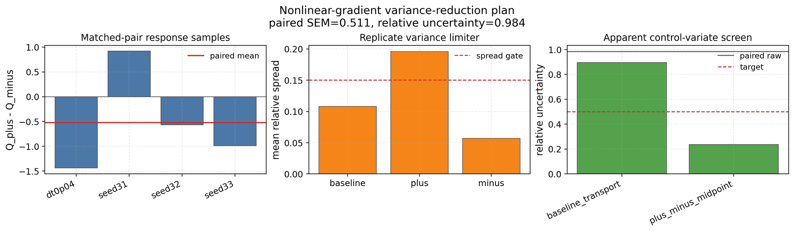

   QA/ESS ``ZBS(1,0)`` rel7.5 paired-seed variance-reduction plan. The left
   panel shows matched plus-minus response samples for common seed/timestep
   labels; the middle panel identifies the plus state as the replicated-window
   spread limiter; the right panel screens common-mode control variates. The
   plus/minus midpoint control lowers apparent residual uncertainty to
   ``0.238``. The independent control-mean follow-up below closes the missing
   control-mean uncertainty for this rel7.5 evidence lane.

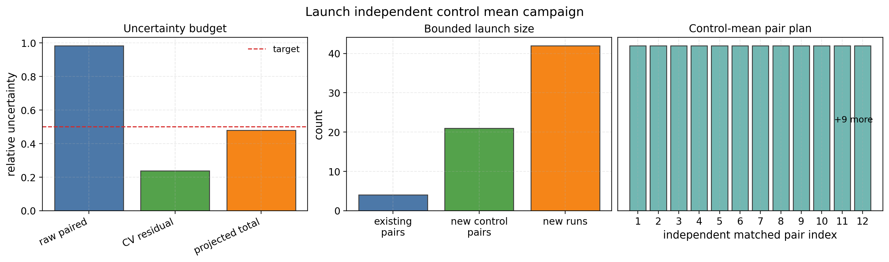

   QA/ESS ``ZBS(1,0)`` rel7.5 independent control-mean campaign plan. The
   uncertainty budget shows the raw paired response, the screened
   control-variate residual, and the projected combined uncertainty after
   adding the independent control-mean estimate. The launch size is bounded at
   ``21`` matched plus/minus pairs, or ``42`` new nonlinear runs.

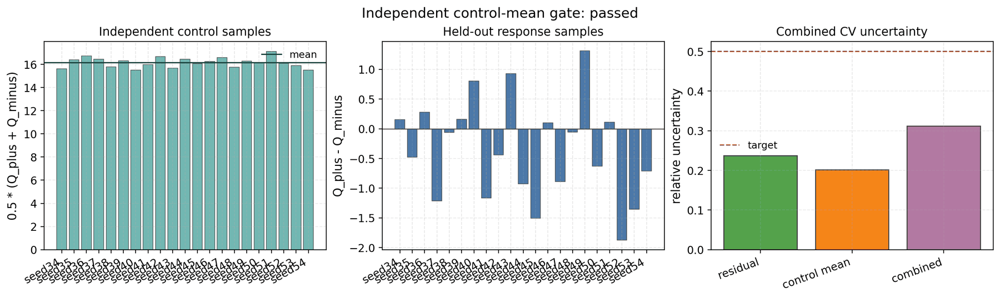

   QA/ESS ``ZBS(1,0)`` rel7.5 independent control-mean gate. The completed
   office campaign uses ``21`` matched plus/minus seed pairs and the late
   post-transient window ``t=[600,1100]``. Both state ensembles pass their
   spread and per-seed convergence gates, and the combined response
   uncertainty is ``0.311 < 0.5``. This closes the independent control-mean
   blocker for this specific variance-reduced nonlinear-gradient evidence
   lane.

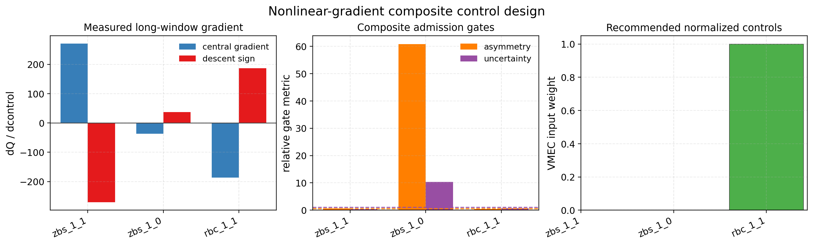

   Nonlinear-gradient composite-control admission gate.  The left panel shows
   the measured long-window central gradients and the corresponding descent
   signs, the middle panel shows locality and uncertainty admission gates, and
   the right panel shows the VMEC input weights that would be passed to the
   profile-direction writer.  The current artifact intentionally fails closed:
   only ``RBC(1,1)`` is local, resolved, and sign-robust enough to enter the
   composite direction. ``ZBS(1,1)`` is still nonlocal, and ``ZBS(1,0)`` is
   unresolved and nonlocal, so the next production campaign needs another
   local/resolved control or a checked single-control bracket before long
   nonlinear GPU runs.

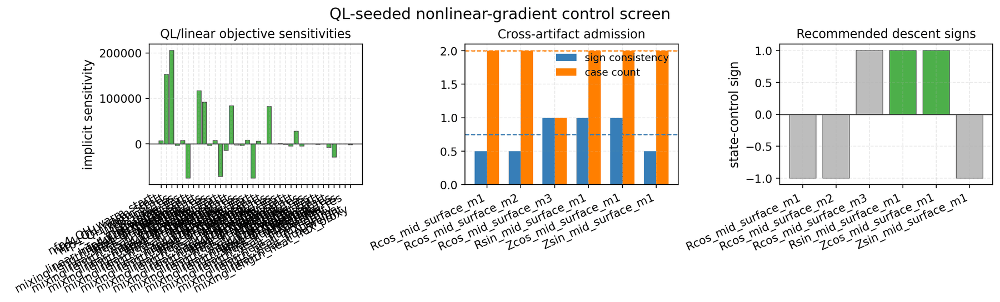

   Quasilinear-seeded nonlinear-gradient control screen.  This upstream gate
   uses full-chain ``vmec_jax`` state sensitivities to decide which controls
   should even be considered for nonlinear long-window finite differences. The
   current QH/Li383 screen is now an upstream seed-admission gate only, not a
   nonlinear launch gate.  The tracked ``Rcos`` and ``Zsin`` controls
   remain fail-closed because their primary quasilinear-proxy signs are not
   robust across the two equilibria, while ``Rsin_mid_surface_m1`` and
   ``Zcos_mid_surface_m1`` are admitted with two-case sign consistency. This is
   still an upstream control-admission result; a separate state-to-input
   mapping gate must pass before checked nonlinear bracket runs, and neither
   artifact is a converged nonlinear transport-gradient or optimized-equilibrium
   claim.

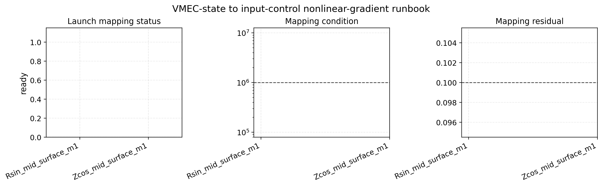

   VMEC-state to input-control nonlinear-gradient runbook.  This guardrail is
   the step between the QL seed screen and any nonlinear-gradient launch.  It
   now passes only after the ``LASYM=true`` asymmetric state-to-input response
   artifact is attached.  The accepted controls are least-squares combinations
   of four explicit ``RBS/ZBC`` VMEC input coefficients with a measured response
   condition number about ``1.02`` and residuals near machine precision. This
   closes the launch-mapping guardrail for checked short-bracket nonlinear
   runs; converged long-window nonlinear-gradient evidence remains a separate
   gate.

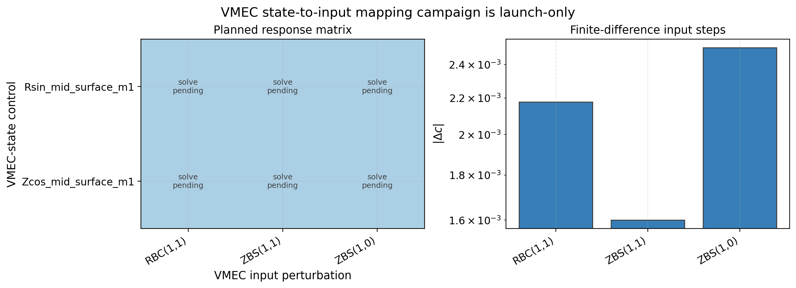

   VMEC state-to-input mapping campaign launch plan.  This is the concrete
   next-step artifact after the fail-closed runbook: it writes candidate
   ``RBC(1,1)``, ``ZBS(1,1)``, and ``ZBS(1,0)`` perturbation decks from a
   bundled QA VMEC input and records the response matrix that must be measured
   after re-equilibration.  The blank matrix cells are labeled ``solve
   pending`` because this figure is not mapping evidence; it becomes useful for
   nonlinear launches only after the VMEC response extraction produces a
   conditioned, residual-bounded state-to-input mapping artifact.

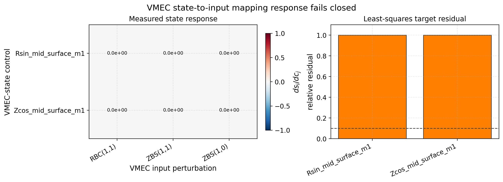

   VMEC state-to-input measured response matrix.  The nine
   baseline/plus/minus ``vmec_jax`` solves terminated normally with the stricter
   explicit iteration budget, but the measured response of the admitted
   ``Rsin/Zcos`` controls to the stellarator-symmetric ``RBC/ZBS`` directions
   is identically zero. The least-squares target residual remains ``1`` for
   both controls, so this is a negative mapping result rather than launch
   evidence. The next viable branch must either use explicit ``LASYM=true``
   ``RBS/ZBC`` controls or re-screen controls that live in the
   stellarator-symmetric subspace.

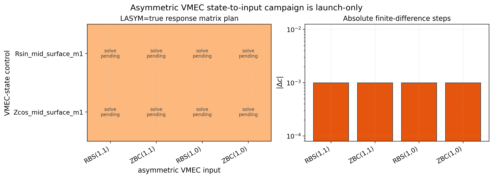

   Asymmetric VMEC state-to-input mapping campaign launch plan.  This follow-up
   uses the same QA input deck but writes ``LASYM=true`` baseline/plus/minus
   decks for four zero-baseline ``RBS/ZBC`` coefficients with absolute
   ``1e-3`` finite-difference steps.  The figure remains a launch-plan
   artifact until the generated equilibria are solved and the response matrix
   is measured.

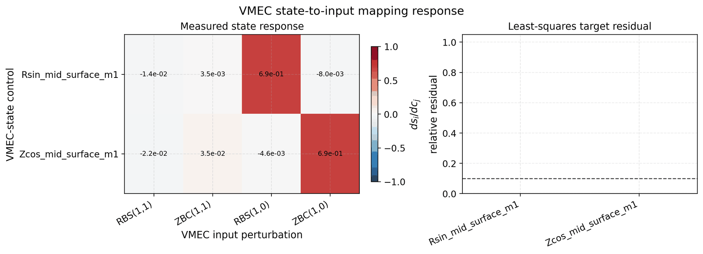

   Asymmetric VMEC state-to-input measured response matrix.  The twelve
   ``LASYM=true`` ``vmec_jax`` solves terminated normally, and the measured
   response from ``RBS/ZBC`` input coefficients to the admitted ``Rsin/Zcos``
   state controls has rank ``2`` with condition number about ``1.02``.  The
   least-squares residuals are near machine precision, so this artifact can be
   attached to the runbook to produce explicit short-bracket launch directions.

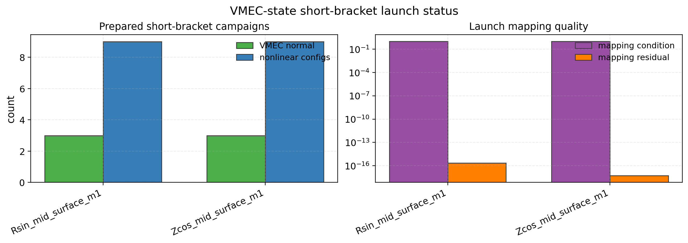

   VMEC-state short-bracket launch status.  The passing runbook is converted
   into two explicit ``LASYM=true`` VMEC input directions, one for each admitted
   state control.  All six baseline/plus/minus VMEC decks terminate normally,
   and the bounded ``t=150`` nonlinear campaign manifests are prepared. This
   panel documents readiness for the next nonlinear audit only; it is not a
   nonlinear-gradient or turbulent-flux promotion.

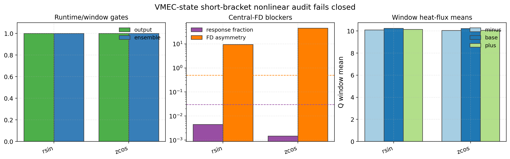

   VMEC-state short-bracket nonlinear audit status.  The prepared campaigns run
   on the office GPUs and produce all ``18`` nonlinear outputs. Runtime-output
   and replicated-window gates pass, with heat-flux means near ``10`` over
   ``t=[75,150]``. The central finite-difference gates fail closed because the
   ``1e-3`` state-control step produces response fractions well below the
   ``0.03`` promotion threshold and large plus/minus asymmetry. The next
   evidence step is therefore a bracket-amplitude sweep, not a transport-gradient
   promotion.

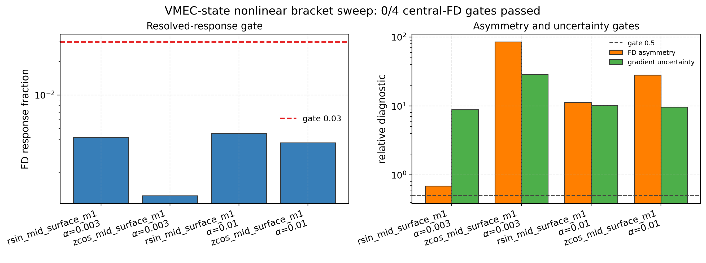

   VMEC-state bracket-amplitude sweep status.  The follow-up campaign runs both
   mapped controls at ``alpha_delta=3e-3`` and ``1e-2``. All ``36`` nonlinear
   outputs complete on the office GPUs and the window/ensemble gates remain
   stable, but none of the four central finite-difference gates pass. The
   response fractions remain below ``0.005`` while the resolved-response gate is
   ``0.03``. This is negative evidence against simply increasing the
   single-control bracket; the next path is variance reduction or a
   better-conditioned multi-control observable.

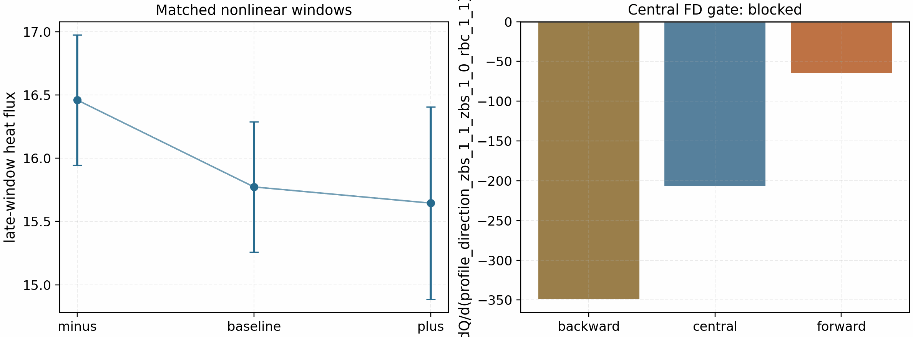

   QA/ESS composite profile-direction nonlinear-gradient audit. The nine
   matched ``t=900`` nonlinear runs all pass runtime-output gates; baseline and
   minus ensembles pass their replicated-window gates, but the plus ensemble
   has too much replicate spread. The finite-difference response is resolved
   but nonlocal and too uncertain, so the result is retained as fail-closed
   evidence for the next campaign design rather than a promoted gradient.

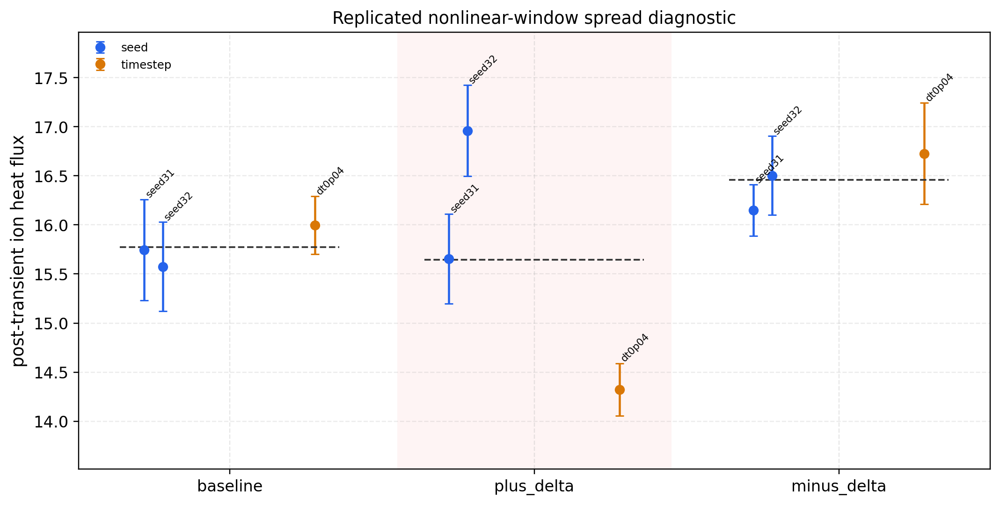

   QA/ESS composite profile-direction replicate-spread diagnostic. The
   baseline and minus states remain within the seed/timestep spread gate, while
   the plus state fails because the high window is the ``seed32`` run and the
   low window is the ``dt0p04`` timestep run. This mixed seed/timestep failure
   is exactly the case where the correct action is not to add blind replicas at
   the same bracket: the next campaign must first separate timestep sensitivity
   from seed sensitivity or shrink the finite-difference bracket.

The targeted follow-up launch artifact for that decision is
``docs/_static/qa_ess_descent_profile_rel2_plus_delta_replicate_followup_plan.json``.
It kept the nonlinear-gradient claim fail-closed and wrote only three
``plus_delta`` cross variants: ``seed22_dt0p05`` tested whether the low window
followed the seed at the nominal timestep, ``seed32_dt0p04`` tested whether the
high window persisted at the refined timestep, and ``seed33_dt0p05`` added one
fresh nominal-timestep seed. Those runs have now completed on the office GPUs.
All six ``plus_delta`` outputs pass the runtime-output gate, but the extended
plus ensemble still fails the spread gate:
``mean_rel_spread = 0.166 > 0.15``. The recomputed central finite-difference
artifact therefore remains blocked by the plus ensemble, by
``fd_asymmetry_rel = 2.84 > 0.5``, and by
``gradient_uncertainty_rel = 1.22 > 0.5``. This closes the blind-replica
question: more of the same plus-state runs are not the right next step. The
next scientifically useful campaign should shrink the finite-difference
bracket or use an overdetermined/profile-gradient design with matched
seed/timestep labels across all parameter states.

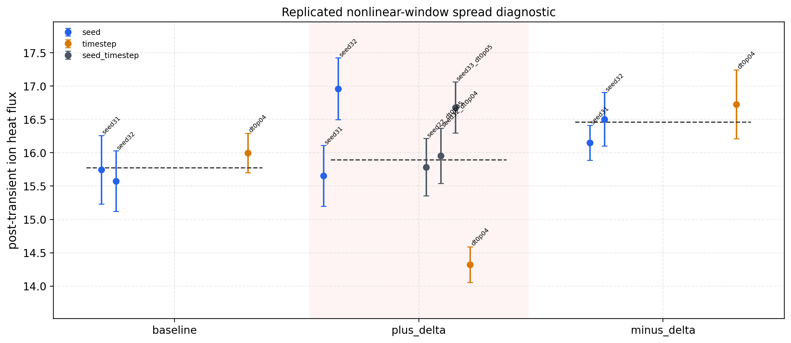

   Targeted ``plus_delta`` follow-up for the QA/ESS composite profile-direction
   nonlinear-gradient audit. The baseline and minus states remain within the
   replicate-spread gate, but the expanded plus-state ensemble still exceeds
   the spread threshold after crossing seed and timestep variants. The shaded
   plus-state panel is the reason the nonlinear turbulence-gradient claim stays
   fail-closed.

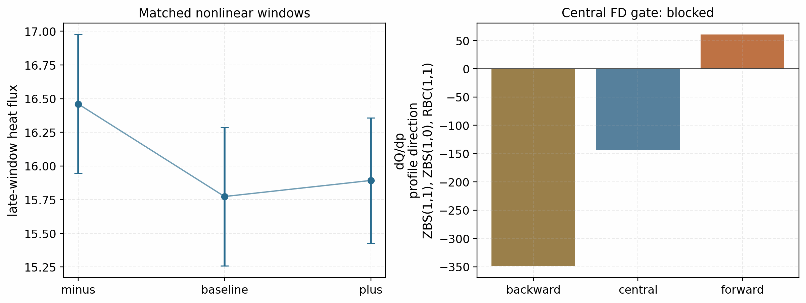

   Central finite-difference audit after the targeted plus-state follow-up. The
   mean response is resolved, but the forward/backward finite differences are
   inconsistent and the propagated uncertainty is too large. This is recorded
   as a bounded negative result, not as nonlinear turbulence-gradient evidence.

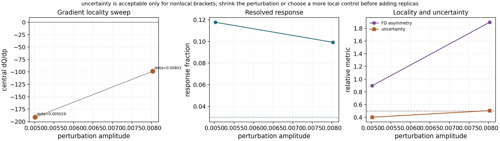

   QA/ESS ``RBC(1,1)`` same-control perturbation-amplitude sweep. The two
   completed long-window central-FD artifacts show that increasing the
   perturbation amplitude does not improve locality: the response remains
   resolved, but the forward/backward asymmetry grows. This keeps the
   single-control ``RBC(1,1)`` path fail-closed and supports the move to a
   smaller locality sweep or an overdetermined profile-gradient campaign.

For boundary-coefficient gradients, first use
``tools/campaigns/write_vmec_boundary_perturbation_inputs.py``. It starts from a concrete
VMEC input file such as the optimized-equilibrium ``input.final``, writes
matched ``baseline``, ``plus_delta``, and ``minus_delta`` input files for an
explicit ``RBC/RBS/ZBC/ZBS(m,n)`` coefficient, and records the exact
``vmec_jax`` commands plus the downstream nonlinear-gradient campaign command.
The generated files are still launch artifacts, not evidence: production
promotion only begins after ``vmec_jax`` has re-equilibrated all three inputs
and produced distinct ``wout`` files.
Once the three matched ensembles exist,
``tools/artifacts/build_nonlinear_turbulence_gradient_fd_gate.py`` is the promotion
artifact builder. It consumes the ``baseline``, ``plus_delta``, and
``minus_delta`` replicated ensemble JSON files, computes
``dQ/dp = (Q_+ - Q_-)/(2 delta_p)``, propagates the ensemble SEM into
``gradient_uncertainty_rel``, checks the response fraction, forward/backward
asymmetry, subtraction condition number, and per-state window uncertainty, and
writes JSON/CSV/PNG/PDF sidecars. When the three ensembles contain matching
``seedNN`` or ``dtNN`` replicate labels, the JSON also records
diagnostic-only paired-replicate finite-difference rows. Those rows diagnose
weak or sign-changing stochastic responses; they are not production gates and
do not relax the uncertainty, asymmetry, response, or conditioning thresholds.
The resulting JSON is then supplied to
``tools/release/check_nonlinear_turbulence_gradient_evidence.py`` together with the
three ensemble artifacts; only that paired long-window workflow can promote a
nonlinear turbulence-gradient claim.
``tools/campaigns/write_nonlinear_turbulence_gradient_campaign.py`` writes the matching
launch ladder from three explicit VMEC files first: baseline, positive
perturbation, and negative perturbation. Its manifest records the per-state run
manifests, the ensemble-builder commands, the central-FD command, and the final
evidence-check command, so office GPU campaigns and later manuscript artifacts
use one reproducible contract. The writer also performs a fail-closed VMEC
preflight: all three files must exist, must be distinct resolved paths, and must
have distinct SHA256 contents by default. Byte-identical files can only be
accepted with ``--allow-identical-vmec-content`` for plumbing smoke tests, and
that flag is recorded in the manifest as non-production evidence.
