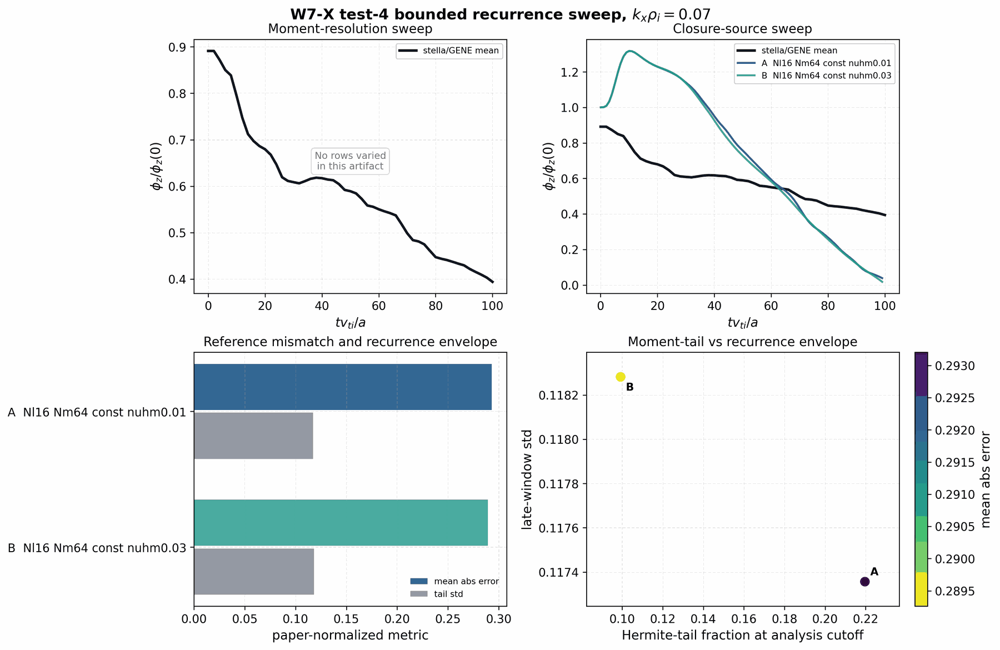
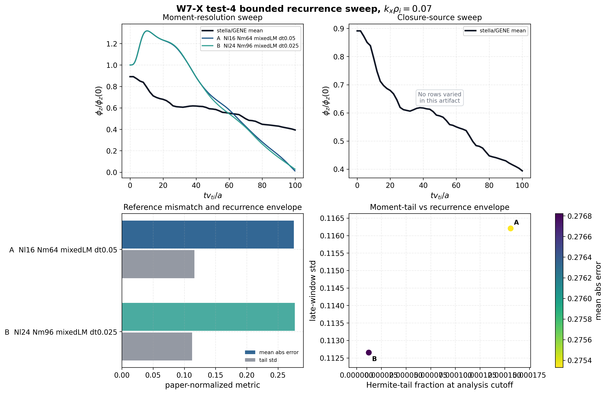
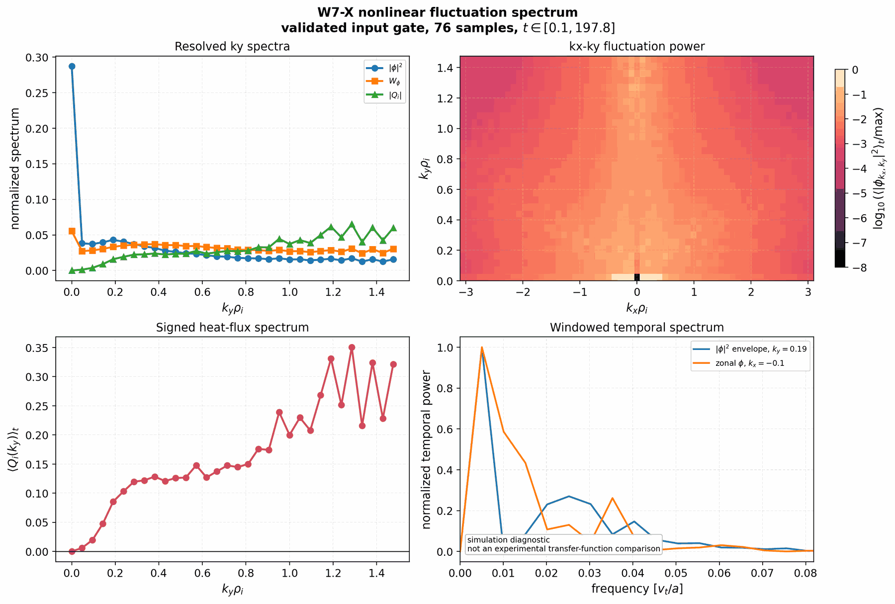
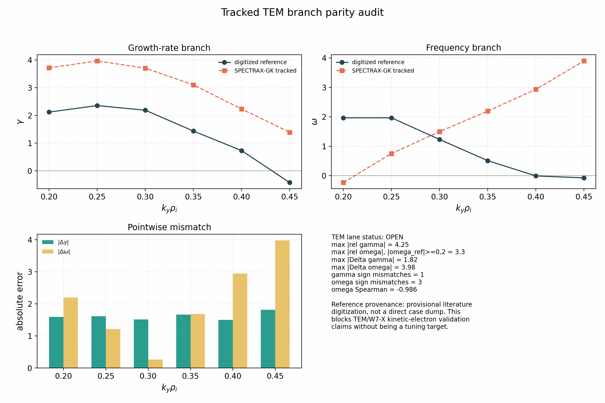
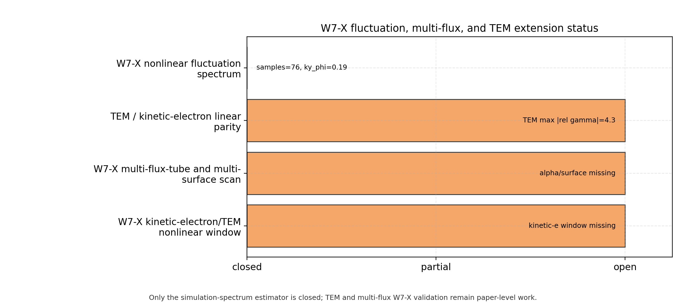

Testing
=======

Testing philosophy
------------------

SPECTRAX-GK enforces high coverage on critical solver modules and requires
physics-based checks for each numerical component. The test suite is designed
to be:

- **pedagogic**: each test explains the concept being validated
- **deterministic**: no stochastic outcomes or tolerance drift
- **future-proof**: targeted at invariants and well-posed regressions

Current testing target
----------------------

The package-wide target is 95% coverage, but the coverage number is a guardrail
rather than the scientific objective. New tests should be accepted because they
protect one of the following contracts:

- an implemented equation or reduced physical limit;
- a numerical method, convergence rate, or conservation/free-energy identity;
- a geometry, normalization, or diagnostic convention;
- a benchmark artifact and its documented fit/window policy;
- an autodiff contract checked against finite differences, tangent tests, or an
  adjoint consistency relation;
- a regression for a bug found in parity, restart, runtime, plotting, or
  geometry-adapter work.

Long reference-code runs and office/GPU comparisons should not be hidden inside
the default local suite. They should live behind explicit manifests or CI/manual
lanes so local tests remain fast enough for routine development.

The refactor branch also carries a machine-readable validation/coverage
manifest at ``tools/validation_coverage_manifest.toml``. It is checked by
``tools/check_validation_coverage_manifest.py`` and maps each critical module
to reference anchors, physics contracts, numerical contracts, fast tests,
tracked artifacts, and next tests. This is the working guardrail for reaching
95% package-wide coverage without adding shallow tests that do not validate the
implemented physics or numerics.

The manifest now has two levels of coverage ownership:

- direct ``[[modules]]`` rows for public, high-risk, or actively refactored
  surfaces that need their own contracts and artifact traceability;
- ``owned_modules`` entries for smaller implementation modules whose fast-test
  responsibility is intentionally carried by a direct row.

The checker inventories ``src/spectraxgk`` and fails if a package module is not
directly listed, owned by a listed row, or explicitly excluded as package
plumbing such as ``__init__.py`` or version metadata. This makes source
extractions fail fast until the coverage owner, fast tests, and next-test debt
are declared. New manifest tests for this policy should stay cheap and live in
``tests/test_validation_coverage_manifest.py`` or
``tests/test_refactor_coverage_*.py``.

Manifest paths are intentionally concrete. ``fast_tests`` and
``artifact_paths`` must name files, not directories or placeholder buckets, and
list fields must not repeat the same module, test, artifact, contract, or next
test. The optional Cobertura XML pass also rejects duplicate measured entries
for the same package module so coverage enforcement cannot depend on whichever
duplicate XML row happened to be parsed last.

The wide CI matrix also feeds the manifest checker with ``coverage-wide.xml``.
That pass enforces the declared package-wide coverage target and writes the
measured summary to ``docs/_static/validation_coverage_manifest_summary.json``.
Module-level rows in that summary are a debt map: they identify direct and
owned modules below their row target, but release blocking remains tied to the
package-wide gate unless the CI command is explicitly upgraded to
``--enforce-module-coverage``.

Optional external-backend artifact builders that require local ``vmec_jax`` or
``booz_xform_jax`` checkouts are kept out of the default package-wide coverage
denominator when the public CI cannot install or execute those repositories.
Their fast contracts are still covered by mocked backend tests and low-level
geometry/numerics tests, while the real physics claims are validated by the
tracked JSON/PDF artifact gates documented below. This avoids treating
unavailable optional backends as missing unit coverage while preserving the
requirement that every differentiable-geometry claim has an explicit
finite-difference or parity artifact.

Test categories
---------------

- **Basis tests**: orthonormality and recurrence checks.
- **Operator tests**: Hermite ladder streaming and mode extraction.
- **Benchmark tests**: loading reference data and growth-rate fitting.
- **Physics sanity checks**: conservation properties under simplified limits.
- **Response-function tests**: zonal-flow residuals, GAM damping, and late-time
  envelopes.
- **Spectral tests**: fluctuation spectra and windowed nonlinear statistics.
- **Autodiff tests**: tangent, finite-difference, and inverse/UQ consistency.

Unit tests (numerical invariants)
---------------------------------

Representative unit checks include:

- **Hermite/Laguerre ladder identities**:
  :func:`spectraxgk.linear.apply_hermite_v`,
  :func:`spectraxgk.linear.apply_laguerre_x`.
- **Quasineutrality consistency**:
  :func:`spectraxgk.linear.quasineutrality_phi`.
- **Streaming term validation**:
  :func:`spectraxgk.linear.grad_z_periodic`,
  :func:`spectraxgk.linear.streaming_term`.
- **Growth-rate fitting windows**:
  :func:`spectraxgk.analysis.select_fit_window`,
  :func:`spectraxgk.analysis.fit_growth_rate_auto`.
- **Grid construction and normalization**:
  :func:`spectraxgk.grids.build_spectral_grid`.
- **Normalization contract consistency**:
  :func:`spectraxgk.normalization.get_normalization_contract`,
  :func:`spectraxgk.normalization.apply_diagnostic_normalization`.
- **Modular RHS equivalence**:
  :func:`spectraxgk.linear.linear_terms_to_term_config`,
  :func:`spectraxgk.terms.assemble_rhs_cached`,
  :func:`spectraxgk.linear.linear_rhs_cached`.

These tests live in ``tests/test_linear.py`` and ``tests/test_grids.py`` and
``tests/test_normalization.py`` and ``tests/test_terms_assembly.py`` and are
designed to fail deterministically if a discretization, assembly path, or
normalization changes.

Physics regression tests
------------------------

The physics-focused tests exercise reduced or symmetry limits that should
remain invariant across refactors:

- **Term toggles**: :class:`spectraxgk.linear.LinearTerms` switches individual
  operator components without changing the equation structure.
- **Mirror/curvature activation**: nonzero drift terms create nonzero response
  when streaming and drive are turned off.
- **Diamagnetic drive structure**: the energy-weighted drive produces a
  nonzero response when gradients are enabled and vanishes at :math:`k_y=0`.
- **Normalization scaling**: ``rho_star`` rescales the cached :math:`k_y`
  values exactly.
- **End-cap damping**: the linked-boundary taper only affects :math:`k_y>0`
  modes and vanishes when ``damp_ends_amp = 0``.

These checks are in ``tests/test_linear.py`` and are meant to be future-proof
physics invariants.

Benchmark regression tests
--------------------------

Benchmark regression tests validate the Cyclone base case reference dataset and
growth-rate extraction pipeline:

- Loading the reference CSV via :func:`spectraxgk.benchmarks.load_cyclone_reference`.
- Running short linear scans via :func:`spectraxgk.benchmarks.run_cyclone_linear`
  and :func:`spectraxgk.benchmarks.run_cyclone_scan`.
- Reduced ky regression with tightened tolerances on the field-aligned grid.

These tests live in ``tests/test_benchmarks.py`` and ``tests/test_full_operator.py``.

Literature-anchored response and spectrum tests
-----------------------------------------------

The next research-facing additions should follow the published benchmark
observables rather than inventing repo-local metrics:

- **Rosenbluth-Hinton / GAM response in shaped tokamaks**: use the shaped
  benchmark conventions summarized by Merlo et al. to track residual levels and
  GAM damping alongside the linear shaping scan.
- **W7-X zonal-flow response**: use the stella/GENE W7-X benchmark conventions
  for residual level and damping envelope.
- **W7-X fluctuation spectra**: follow the W7-X Doppler-reflectometry
  comparison work for density and zonal-flow frequency spectra. The current
  closed artifact is a simulation-spectrum diagnostic; experimental transfer
  functions remain outside the release claim.
- **Electromagnetic stellarator verification**: adopt a heavy-electron
  electromagnetic lane before realistic-mass claims, following the GENE-3D
  verification pattern.

These should be implemented as reproducible, script-owned figure/artifact
lanes, not as ad hoc notebooks.

The first reusable tooling for this lane now exists:

- :func:`spectraxgk.benchmarking.zonal_flow_response_metrics`
- :func:`spectraxgk.benchmarking.load_diagnostic_time_series`
- :func:`spectraxgk.validation_gates.evaluate_scalar_gate`
- :func:`spectraxgk.validation_gates.observed_order_gate_report`
- :func:`spectraxgk.validation_gates.branch_continuity_gate_report`
- :func:`spectraxgk.validation_gates.eigenfunction_gate_report`
- :func:`spectraxgk.validation_gates.linear_metrics_gate_report`
- :func:`spectraxgk.validation_gates.nonlinear_window_gate_report`
- :func:`spectraxgk.validation_gates.zonal_response_gate_report`
- :func:`spectraxgk.zonal_validation.reference_residual_table`
- :func:`spectraxgk.zonal_validation.tail_trace_metrics`
- :func:`spectraxgk.plotting.zonal_flow_response_figure`
- ``tools/plot_zonal_flow_response.py``
- ``tools/plot_zonal_flow_response_from_output.py``
- ``tools/generate_miller_zonal_response_pilot.py``
- ``tools/generate_w7x_zonal_response_panel.py``
- ``tools/plot_w7x_zonal_contract_audit.py``
- ``tools/plot_w7x_zonal_moment_tail_audit.py``
- ``tools/plot_w7x_zonal_closure_ladder.py``
- ``tools/write_w7x_zonal_closure_sweep.py``
- ``tools/plot_w7x_zonal_state_convention_audit.py``
- ``tools/plot_w7x_zonal_recurrence_sweep.py``
- ``tools/build_zonal_flow_objective_gate.py``
- ``tools/plot_w7x_fluctuation_spectrum_panel.py``

The gate-report helpers are intentionally small and JSON-ready. They should be
used by manuscript refresh scripts so every reported artifact has the same
observable, reference, absolute/relative tolerance, and pass/fail convention.
The companion coverage manifest should be updated when a new gate helper,
artifact script, or refactor extraction changes module ownership or test
responsibility.
``tools/generate_miller_zonal_response_pilot.py`` now writes the first such
gate report into its JSON metadata for the residual, GAM frequency, and signed
GAM growth/damping comparison against the Merlo Case-III paper-scale read-off.
``tools/generate_kbm_reference_overlay.py`` writes the same gate structure for
the raw KBM eigenfunction overlay, using a strict overlap/relative-L2 policy.
The current refreshed KBM overlay passes that policy with overlap ``0.999985``
and relative ``L^2`` mismatch ``0.00721`` against the frozen GX raw mode.
``tools/generate_w7x_reference_overlay.py`` applies the same raw-mode policy to
the imported W7-X linear benchmark at ``k_y rho_i = 0.3``. It refreshes the
frozen finite GX raw-mode bundle when a matching ``.big.nc`` file is supplied
and writes ``docs/_static/w7x_eigenfunction_reference_overlay_ky0p3000.png``
plus JSON/CSV companions. The current artifact passes with overlap
``0.9999999994`` and relative ``L^2`` mismatch ``3.33e-5``.
``tools/compare_gx_nonlinear_diagnostics.py --summary-json`` now emits a
matching gate report for nonlinear diagnostic comparison figures, using the
window mean relative mismatch as the scalar acceptance metric. The summary
writer now accepts case/source labels, explicit ``tmin/tmax`` windows, and
writes strict JSON, replacing nonfinite absolute-gate relative errors with
``null``. The tracked release-window summaries cover Cyclone, Cyclone Miller,
KBM, HSX, and W7-X. The older short Cyclone diagnostic remains available as an
exploratory startup/resolved-spectrum audit, but it is not counted in the
release-gate index.
Observed-order and branch-continuity gate helpers are also available so
velocity-space convergence panels and branch-followed scan tables can use the
same JSON-ready acceptance convention.
``tools/generate_observed_order_gate.py`` is the generic no-rerun path for
CSV-backed convergence studies: it reads either an explicit step column or a
resolution column, writes an observed-order JSON gate report, and can generate
a log-log convergence figure. The tracked Cyclone velocity-space convergence
artifact lives at ``docs/_static/cyclone_resolution_observed_order.json`` and
``docs/_static/cyclone_resolution_observed_order.png``. It uses an office/GPU
``ky=0.30`` time-path sweep through ``(Nl,Nm)=(4,8),(6,12),(12,24),(16,32)``
with ``tmax=150`` and passes the strict pairwise-order and final-error gates.
``tools/compare_gx_kbm.py --branch-summary-json`` wires that convention into
the KBM branch-following workflow by summarizing adjacent ``gamma``/``omega``
jumps and successive eigenfunction-overlap continuity for the selected branch.
``tools/generate_kbm_branch_gate_summary.py`` provides the corresponding
no-rerun artifact path: it reads the existing selected KBM candidate table and
writes ``docs/_static/kbm_branch_gate_summary.json`` with the same strict gate
schema. The current continuity-first selected branch passes the adjacent
growth/frequency jump and successive-overlap gates.
``tools/make_validation_gate_index.py`` scans tracked JSON metadata and writes
``docs/_static/validation_gate_index.json``, ``.csv``, and ``.png`` so the docs
always have one compact pass/open view of the currently materialized release
validation gates. The current JSON index has ``14/14`` tracked reports passing.
Exploratory diagnostics can set ``gate_index_include=false``
to remain documented without being treated as release blockers.
``tools/plot_nonlinear_window_statistics.py`` provides the companion
manuscript-facing statistics panel for the nonlinear GX comparison gates by
plotting the per-diagnostic ``mean_rel_abs`` and ``max_rel_abs`` values from
those same tracked JSON summaries.
``tools/plot_nonlinear_feasibility_pilot.py`` is the analogous tool for new
finite nonlinear pilots that do not yet have a reference comparison or
production-resolution convergence gate. It writes PNG/PDF/JSON/CSV artifacts
with explicit ``claim_level`` and ``promotion_gate.passed = false`` metadata,
so exploratory external-VMEC runs can be documented without being promoted to
transport validation claims.

``tools/plot_external_vmec_nonlinear_convergence_gate.py`` is the promotion
gate for those pilots once at least two grid levels exist. It replays the
pilot JSON/CSV traces, compares common and least-trending late windows,
requires enough samples, bounds relative heat-flux trend and coefficient of
variation, and finally checks pairwise grid-refined heat-flux agreement. The
tracked CTH-like external-VMEC artifact intentionally fails this gate and sets
``gate_index_include=false`` because it is a research-planning negative result,
not a release-blocking validation gate.

``tools/write_external_vmec_holdout_configs.py`` is the reproducibility
companion for that lane. It writes the fixed-step nonlinear TOMLs and restart
copy commands for the standard two-grid external-VMEC holdout ladder, e.g.
``t = 150`` initial runs followed by ``t = 250`` restart continuations at
``48x48x32`` and ``64x64x40``. The script does not promote any data by itself;
the resulting traces must still pass the convergence gate above before they can
enter quasilinear calibration reports or optimization studies. For the
production nonlinear optimization evidence lane the same generator also accepts
``--seed-variant`` and ``--dt-variant`` entries. Those options write explicit
``[metadata]`` blocks and variant-specific filenames so seed and timestep
replicate windows can be launched on the office GPUs, extracted with the same
transport-window protocol, and checked by
``tools/check_nonlinear_window_ensemble_readiness.py`` before any
absolute-flux or turbulent-flux optimization wording can be considered.
For external-VMEC replicate campaigns,
``tools/build_external_vmec_replicate_ensemble.py`` is the reproducible
NetCDF-to-evidence wrapper: it extracts heat-flux traces from finished
``*.out.nc`` files, writes the transport-window summaries and convergence
reports, runs the readiness and ensemble gates, and produces the documentation
figure used by the manuscript ledger.
Before those files enter the ensemble builder, run
``tools/check_nonlinear_runtime_outputs.py`` on every produced ``*.out.nc``.
That gate verifies the grouped NetCDF contains ``Grids/time`` and the requested
heat-flux diagnostic, checks finite monotone time samples, enforces optional
``tmin/tmax`` coverage, and fails closed for restart-only or metadata-only
artifacts. It is the first campaign-level smoke check after a long office GPU
batch exits with ``rc=0``.
``tools/check_production_nonlinear_optimization_guard.py`` then consumes those
replicated long-window ensembles together with the reduced optimization and
startup finite-difference artifacts. It is the fail-closed check that allows
release-safe scoped wording while blocking production nonlinear turbulent-flux
optimization promotion until optimized equilibria have replicated
post-transient transport-window audits.
For actual nonlinear turbulence-gradient promotion, use
``tools/write_vmec_boundary_perturbation_inputs.py`` when the perturbation is a
VMEC boundary coefficient. It writes the matched ``input.*`` files and records
the exact ``vmec_jax`` commands needed to create the three real re-equilibrated
``wout`` files. Then use
``tools/write_nonlinear_turbulence_gradient_campaign.py`` to write the matched
baseline/plus/minus VMEC launch ladders and replay commands. The campaign
writer rejects missing files, duplicate resolved paths, and byte-identical VMEC
contents unless ``--allow-identical-vmec-content`` is explicitly used for a
plumbing-only smoke test; production evidence therefore requires real
``wout`` files. The generated TOMLs are restart-ladder segments: a final
``t=900`` config only advances the last segment unless the earlier restart
artifacts have been seeded. The manifest therefore records
``direct_full_horizon_launch_commands`` for one-shot final-horizon campaigns
and an ``output_gate_command`` that must pass before ensemble evidence is built.
For the direct one-shot route, launch the recorded commands with
``tools/run_nonlinear_gradient_direct_campaign.py`` instead of an ad-hoc shell
loop. The launcher reads the manifest, assigns one worker per listed GPU, writes
per-task logs and a status JSON, supports ``--skip-existing`` for safe restarts,
and keeps the command provenance identical to the manifest.
Then use
``tools/build_nonlinear_turbulence_gradient_fd_gate.py`` after the matched
``baseline``/``plus_delta``/``minus_delta`` ensembles finish. The builder writes
the central finite-difference gradient sidecar and checks response resolution,
forward/backward asymmetry, subtraction conditioning, propagated uncertainty,
and the uncertainty gates on all three replicated nonlinear windows.
The tracked optimized-QA/ESS ``ZBS(1,0)`` example is deliberately kept as a
fail-closed regression: the real ``vmec_jax`` re-equilibrated ``t=[450,900]``
baseline/plus/minus ensembles pass their replicated transport-window gates and
the initial three-replicate central finite difference is local, but
``gradient_uncertainty_rel = 0.655`` and therefore does not promote a
turbulence-gradient claim. A seed-5 follow-up for the same ``ZBS(1,0)``
bracket also remains blocked: the response fraction weakens to about ``0.037``,
``gradient_uncertainty_rel`` rises to about ``1.18``, and ``fd_asymmetry_rel``
is about ``0.520``. The companion ``RBC(1,1)`` and ``ZBS(1,1)`` controls fail
the locality/asymmetry gates. The central-FD artifact now includes
diagnostic-only paired-replicate rows when matching seed or timestep labels are
available; these rows are useful for identifying sign reversals or weak
responses, but they do not relax the production gates. A future passing
artifact must satisfy both uncertainty and locality thresholds without
weakening either threshold.
For future perturbation refreshes, keep each coefficient/amplitude in a
distinct artifact slug such as
``docs/_static/qa_ess_zbs10_rel5_nonlinear_gradient_zbs_1_0_central_fd_gradient_gate.*``.
Do not promote new prose until
``tools/check_nonlinear_turbulence_gradient_evidence.py`` reports
``passed = true`` and the JSON sidecar sets
``nonlinear_turbulence_gradient_gate = true``. Until then, describe the result
as a bounded production-candidate finite-difference audit, not as a nonlinear
turbulence-gradient claim.
The current QA/ESS composite profile-direction follow-up demonstrates this
policy. The targeted ``plus_delta`` cross variants ``seed22_dt0p05``,
``seed32_dt0p04``, and ``seed33_dt0p05`` completed and all six plus-state
outputs passed the runtime-output gate. The extended plus ensemble still fails
the spread gate with ``mean_rel_spread = 0.166`` against the ``0.15`` limit,
and the central finite-difference artifact remains blocked by
``fd_asymmetry_rel = 2.84`` and ``gradient_uncertainty_rel = 1.22``. That
artifact is tracked as
``docs/_static/qa_ess_descent_profile_rel2_nonlinear_gradient_plus_delta_followup_central_fd_gradient_gate.json``.
It is a regression target for the fail-closed workflow and a design input for
the next campaign, not promotion evidence.
``tools/rank_nonlinear_turbulence_gradient_candidates.py`` is the companion
planning utility for failed candidates. It ranks completed central-FD artifacts
by response, locality, conditioning, and propagated uncertainty margins, writes
a fail-closed JSON summary, and recommends whether the next campaign should add
replicas, shrink a bracket, or move to an overdetermined
least-squares/profile-gradient design. The current tracked ranking artifact is
``docs/_static/nonlinear_turbulence_gradient_candidate_ranking.json`` and is
not itself promotion evidence.
``tools/summarize_nonlinear_gradient_bracket_sweep.py`` is the next
same-control locality utility. It consumes one or more central-FD JSON
artifacts for the same control at different perturbation amplitudes, writes
JSON/CSV/PNG sidecars plus an optional PDF, and decides whether to promote an already passing
bracket, shrink/enlarge the amplitude, add statistical power, or abandon the
single-control direction. It also reads the diagnostic-only paired-replicate
rows when present. If those same-seed rows show sign reversals or large paired
uncertainty, the utility explicitly recommends not spending more GPU time on
more replicas at that same bracket. It also fails the campaign-planning
recommendation toward a new locality sweep or smoother composite control when
resolved central finite differences change sign across nearby amplitudes. The
tracked ``RBC(1,1)`` 5%/8% result,
``docs/_static/qa_ess_rbc11_bracket_sweep.json``, is a same-control negative
audit: response is resolved at both amplitudes, but finite-difference
asymmetry grows with amplitude, so the correct next action is a smaller
locality sweep or an overdetermined profile-gradient control.
``tools/write_overdetermined_nonlinear_gradient_campaign.py`` implements that
next launch-contract step. It writes multiple matched boundary-control VMEC
perturbation manifests from one baseline input, records the per-control
nonlinear campaign commands, and writes the final candidate-ranking command.
The tracked QA/ESS profile-gradient launch plan is
``docs/_static/qa_ess_overdetermined_nonlinear_gradient_campaign_plan.json``.
Use ``tools/check_overdetermined_nonlinear_gradient_campaign.py`` to turn that
multi-control launch plan into a machine-readable status artifact and
``tools/run_overdetermined_nonlinear_gradient_campaign.py`` to run all nested
long-window tasks through one shared CPU/GPU worker queue. The checker must
remain fail-closed until the VMEC states, nonlinear runtime outputs, ensemble
gates, central finite-difference gates, and candidate ranking all exist and
pass. Runtime outputs are only counted complete when their recorded
``Grids/time`` coverage reaches the campaign analysis-window endpoint, so
in-progress NetCDF files cannot accidentally promote a result.
After the long runtime queue completes,
``tools/postprocess_overdetermined_nonlinear_gradient_campaign.py`` runs the
per-control output gates, ensemble gates, central finite-difference gates,
candidate ranking, and final fail-closed status check in one reproducible
sequence.
The completed QA/ESS overdetermined campaign and targeted ``RBC(1,1)``
follow-up are intentionally tracked as negative gate results: all full-horizon
nonlinear outputs pass the runtime coverage checks, but no control passes every
production central-FD gate. The best candidate is ``RBC(1,1)`` with resolved
response and bounded locality, but ``gradient_uncertainty_rel = 0.683`` remains
above the ``0.5`` promotion gate after five-member state ensembles.
The status artifact
``docs/_static/qa_ess_overdetermined_nonlinear_gradient_campaign_status.json``
therefore reports complete runtime coverage and zero promoted controls. This is
a regression target for the fail-closed workflow and a design input for future
variance-reduction or smaller-bracket campaigns, not a nonlinear turbulence
gradient validation claim.
``tools/design_nonlinear_gradient_next_campaign.py`` is the follow-on planning
gate. It consumes completed central-FD artifacts and writes JSON/CSV/PNG/PDF
sidecars that compare the uncertainty-required bracket scale, locality-safe
bracket scale, and extra-replica estimate. The tracked design artifact
``docs/_static/nonlinear_gradient_next_campaign_design.json`` currently
recommends a better-conditioned control or variance-reduced observable before
more GPU replicas.
``tools/write_vmec_boundary_profile_perturbation_inputs.py`` is the companion
for a single smoother composite direction. It perturbs several VMEC boundary
coefficients together, normalizes the finite-difference scalar by the Euclidean
norm of the coefficient-change vector, and writes the same
baseline/plus/minus VMEC launch contract. The tracked
``docs/_static/qa_ess_descent_profile_direction_rel2_manifest.json`` uses the
current QA/ESS long-window evidence signs to define a 2% descent-oriented
``ZBS(1,1)``, ``ZBS(1,0)``, ``RBC(1,1)`` direction. This is still a launch
artifact; promotion requires the resulting re-equilibrated VMEC files and
long-window nonlinear FD gate.
After a detached office campaign finishes, run
``tools/run_nonlinear_gradient_manifest_postprocess.py`` on the generated
``gradient_campaign_manifest.json`` rather than replaying individual commands
by hand. With ``--require-outputs`` it fails before post-processing if any
expected ``*.out.nc`` file is missing; otherwise it runs the output gates,
baseline/plus/minus replicated ensemble builders, the central-FD gate, and the
final nonlinear-gradient evidence check in dependency order. Use
``--allow-blocked`` only when collecting a failure artifact for diagnosis; a
promotion run should keep the default fail-closed behavior.
If that central-FD gate is blocked by a replicated state, run
``tools/summarize_nonlinear_replicate_spread.py`` on the baseline, plus, and
minus ensemble JSON files before launching more nonlinear simulations. The
tool enriches the ensemble rows with seed/timestep labels and convergence
statistics, writes JSON/CSV/PNG sidecars, and classifies whether the failed
state is seed-limited, timestep-limited, mixed seed/timestep spread, or missing
metadata. The current QA/ESS composite profile-direction diagnostic is
``docs/_static/qa_ess_descent_profile_rel2_replicate_spread_diagnostic.json``:
the plus state is a mixed seed/timestep failure, so the next GPU campaign must
disambiguate timestep sensitivity or shrink the bracket rather than adding
blind replicas.
``tools/write_nonlinear_replicate_followup_campaign.py`` turns that diagnostic
back into a minimal run list. It reads the original
``gradient_campaign_manifest.json`` and the spread diagnostic, infers the seed
and timestep metadata from the already-generated TOMLs, and writes only the
cross variants needed to disambiguate the failed state. For the current QA/ESS
profile-direction audit, the tracked launch artifact is
``docs/_static/qa_ess_descent_profile_rel2_plus_delta_replicate_followup_plan.json``;
it selects ``seed22_dt0p05``, ``seed32_dt0p04``, and ``seed33_dt0p05`` for the
``plus_delta`` state. After those three GPU runs finish, rebuild the plus
ensemble with the added outputs, rerun
``tools/summarize_nonlinear_replicate_spread.py``, and only then rerun the
central-FD/evidence gates.

``tools/write_optimized_equilibrium_transport_configs.py`` is the production
optimization companion for that final audit. Given a concrete post-optimization
``wout*.nc`` file, it writes the ``t=250,350,450,700`` fixed-step nonlinear
ladder on the release ``n64`` grid, two seed replicates, one timestep
replicate, restart-copy commands, and the exact
``tools/build_external_vmec_replicate_ensemble.py`` plus
``tools/check_production_nonlinear_optimization_guard.py`` commands needed
after the runs finish. This wrapper is a launch contract only: the production
optimization claim remains blocked until the generated ``t=[350,700]`` ensemble
actually passes finite-flux, running-window, block/SEM, replicate-spread, and
optimized-equilibrium marker gates.

``tools/prepare_external_vmec_holdout_from_screen.py`` is the selector that
feeds that generator. It reads the tracked linear candidate screen, skips
excluded or already-audited cases, resolves the chosen VMEC file from the local
``vmec_jax`` checkout, and writes the next bounded holdout ladder plus a JSON
selection summary. This removes another manual step from the external-VMEC
nonlinear campaign and makes office reruns deterministic.

``tools/build_external_vmec_holdout_runbook.py`` is stricter than a positive
growth-rate sorter. It requires a configurable minimum screened growth rate
(``gamma >= 0.02`` by default) before writing nonlinear launch commands. This
keeps near-marginal branches in the manuscript evidence chain as linear/QI
feasibility data without silently promoting them to expensive nonlinear
transport holdout campaigns.

``tools/build_qi_branch_refinement_gate.py`` is the focused companion for that
near-marginal QI evidence. It checks finite low-``k_y`` branch rows, contiguous
positive support, optional Krylov consistency, and the same nonlinear-launch
growth threshold. A failed launch-growth subgate is a useful documented result,
not a release failure, because it prevents QI feasibility scans from being
misread as transport validation.

``tools/write_w7x_zonal_closure_sweep.py`` is the analogous reproducibility
companion for the open W7-X zonal-response lane. It writes a manifest of
single-``k_x`` closure probes for the paper-facing test-4 contract, separated
by operator family: baseline, constant-Hermite, ``|k_z|``-weighted Hermite,
mixed Laguerre-Hermite, Laguerre-only, and isotropic hypercollision variants.
The manifest includes the exact
``tools/generate_w7x_zonal_response_panel.py`` launch commands plus the
companion ``tools/plot_w7x_zonal_closure_ladder.py`` command needed to refresh
the bounded closure audit after the remote runs complete. Each launch command
writes a case-local ``panel.png`` and the final ladder command writes
``w7x_zonal_closure_ladder_full.{png,json,csv}``, preventing exploratory
office runs from overwriting the frozen documentation figure before the
candidate passes the residual, late-envelope, and moment-tail screens.

``tools/check_quasilinear_calibration_inputs.py`` is the corresponding
calibration-admission guard. It scans quasilinear train/holdout reports and
requires every non-audit nonlinear artifact to match a passed nonlinear gate.
This makes validation provenance executable: finite-but-unconverged pilots can
be documented in the docs, but they cannot silently become calibration or
optimization data. The public CI runs this audit during the docs/packaging
job, and the fast test suite checks the current tracked train/holdout reports
against the same gate index.

``tools/check_quasilinear_promotion_guardrails.py`` is the higher-level
absolute-flux promotion guard. It scans the tracked quasilinear reports plus
the claim-scope docs, fails if a promoted report lacks train/holdout points,
finite nonlinear window statistics, a passed holdout gate, or calibration
policy metadata, and writes
``docs/_static/quasilinear_promotion_guardrails.json`` with a normal
``gate_report`` for the validation index. This is not a runtime/TOML
absolute-flux predictor; it is a fast metadata and wording guard that prevents
overclaiming current diagnostics.
The model-development figure scripts for saturation-rule sweeps,
shape-aware saturation, and uncertainty-aware candidate scoring also validate
their nonlinear summary inputs by default and serialize an ``input_validation``
block into the tracked JSON artifacts.

The diagnostics stream now also carries ``Diagnostics/Phi_zonal_mode_kxt``, a
signed complex zonal-potential history reduced over ``z`` with the same volume
weights used elsewhere. That is the primitive to use for manuscript-grade
Rosenbluth-Hinton / GAM work. ``Diagnostics/Phi2_zonal_t`` remains useful as a
zonal-energy proxy for intermediate checks, but it is no longer the target
observable for the final paper lane.

The first case-specific shaped-Miller pilot for this lane is now reproducible
through ``examples/benchmarks/runtime_miller_zonal_response.toml`` and
``tools/generate_miller_zonal_response_pilot.py``. Its frozen artifact lives in
``docs/_static/miller_zonal_response_pilot.png``. The current frozen artifact
is pinned to Merlo et al. Case III: adiabatic electrons, zero gradients,
``k_xρ_i≈0.05``, ``k_y=0``, and an initial ion-density perturbation.  It uses
``Nz=32``, ``Nl=4``, ``Nm=24``, ``dt=0.005``, and runs to ``t≈60`` through the
same checkpoint-capable artifact writer used by long nonlinear runs.  Using the
Rosenbluth-Hinton convention ``phi(t -> infinity) / phi(0)`` gives a residual
of about ``0.192`` against the Merlo Case-III figure read-off of about
``0.19``.  The shipped extraction now follows the paper convention more
closely: positive and negative extrema of the signed residual-subtracted trace
are fit separately over a common pre-recurrence window, and the GAM frequency
is extracted from the instantaneous phase of that same window via a Hilbert
analytic signal.  With the current ``t≈30`` pre-recurrence window the artifact
gives ``ω_GAM R0 / v_i≈2.20`` and ``γ_GAM R0 / v_i≈-0.176``, both close to
the Merlo figure read-off.  The explicit remaining follow-up item is the
long-time recurrence visible in finite moment runs, rather than the
benchmark-scale residual/frequency/damping gate itself.

An additional recurrence audit now brackets the numerical trade-off more
explicitly: increasing the resolution to ``Nm=28`` and ``Nl=4`` lowers the
late-time recurrence ratio from about ``0.60`` to about ``0.54`` and brings
``ω_GAM R0 / v_i`` nearly onto the Merlo read-off, but it also pushes the
damping to roughly ``γ_GAM R0 / v_i≈-0.192``, which is more damped than the
paper-scale target near ``-0.17``. A minimal ``hypercollisions_const`` ladder
through ``10^{-4}`` is effectively inert for this case, while ``10^{-3}``
only lowers the recurrence ratio to roughly ``0.589`` and still does not beat
the clean higher-moment run. The shipped artifact therefore remains on the
``Nm=24``, ``Nl=4`` baseline until the long-time recurrence can be reduced
without moving the benchmark-scale damping gate.

The next literature lane now has a dedicated runtime contract as well:
``examples/benchmarks/runtime_w7x_zonal_response_vmec.toml`` and
``tools/generate_w7x_zonal_response_panel.py`` define the W7-X high-mirror
bean-tube zonal-flow relaxation benchmark from the stella/GENE paper. The
tool sweeps ``k_x rho_i`` over ``[0.05, 0.07, 0.10, 0.30]``. The runtime
contract seeds the published electrostatic-potential perturbation with
``init_field = "phi"`` and a Gaussian profile, while the panel extracts the
unweighted signed line-average diagnostic ``Phi_zonal_line_kxt``. The paper
text states that the line-average trace is normalized to its value at ``t=0``;
the caption also mentions the maximum value, but the source figure is clipped
at the initial point. The paper-facing default is therefore
``--initial-normalization=line_first`` and ``--time-scale=1``. The ``init_amp``
normalization and non-unit time-scale options are retained as explicit audits,
not as the validation contract. The default early-time fit-window cap is an
explicit analysis policy chosen to isolate the initial GAM before the slower
stellarator-specific oscillation. The generator forces a periodic radial box
for this ``k_y=0`` zonal response so the selected ``k_x rho_i`` values match
the published test-4 targets exactly; this avoids the linked-boundary
aspect-ratio override that is appropriate for drift-wave flux-tube runs but
wrong for this radial zonal scan.

The current frozen VMEC-backed artifact lives at
``docs/_static/w7x_zonal_response_panel.png`` with strict JSON metadata at
``docs/_static/w7x_zonal_response_panel.json``. The tracked combined trace CSV
``docs/_static/w7x_zonal_response_panel.traces.csv`` is written next to the
figure so comparison and audit scripts can be rerun without office-only
per-``k_x`` directories. It is a long-window run: ``k_x rho_i=0.05`` reaches
``t≈3460`` and the other three wavelengths reach ``t≈1980``. After the
paper-faithful line-first normalization, the late residuals are about
``0.0189``, ``0.137``, ``0.0938``, and ``0.526`` for ``k_x rho_i = 0.05``,
``0.07``, ``0.10``, and ``0.30``.
``tools/digitize_w7x_zonal_reference.py`` now extracts the stella/GENE Fig. 11
main traces and inset residual levels from the arXiv source ``figs/ZF.pdf``.
The resulting reference artifacts are
``docs/_static/w7x_zonal_reference_digitized.csv``,
``docs/_static/w7x_zonal_reference_digitized_residuals.csv``,
``docs/_static/w7x_zonal_reference_digitized.json``, and
``docs/_static/w7x_zonal_reference_digitized.png``. The comparison contract is
implemented in ``tools/compare_w7x_zonal_reference.py`` and materialized at
``docs/_static/w7x_zonal_reference_compare.png`` with JSON metadata in
``docs/_static/w7x_zonal_reference_compare.json``. The current long-window
artifact passes the time-coverage gate for all four wavelengths, but the
residual gate only passes at ``k_x rho_i=0.05`` and the late-envelope gate
fails by orders of magnitude. A previous ``init_amp``-normalized audit happened
to pass residual values for all four wavelengths, but that comparison is no
longer treated as a validation result because it does not follow the paper text
normalization. A later ``gaussian_width=4`` probe matched the clipped apparent
initial level of Fig. 11 better than the tracked width-1 profile, but the
source figure shows that the apparent ``0.8`` start is a plot-limit artifact,
not a reliable normalization target. The tracked TOML therefore keeps
``gaussian_width=1``, matching the source expression ``exp[-(z-z0)^2]``.

The runtime path now has three safeguards for this lane. First, strided nonlinear
diagnostics always retain the final step, so long traces do not silently stop
one stride before the intended horizon. Second, checkpointed artifact
generation validates each chunk for non-finite diagnostics, state, and fields
before writing or continuing. This makes high-moment W7-X recurrence sweeps
fail fast instead of running thousands of extra steps after a NaN. Third,
default VMEC/eik cache outputs are reused when valid and generated through a
unique temporary netCDF followed by atomic replacement, so parallel W7-X
validation sweeps cannot observe or corrupt a partially written geometry file.
A bounded
``k_x rho_i=0.07``, ``Nl=16``, ``Nm=64``, ``dt=0.05`` probe remained finite to
``t≈200`` and a post-fix ``t≈50`` rerun verified nonzero signed line-average
diagnostics through the retained final sample. A separate external-restart
artifact bug was then isolated to double-condensing already-active ``kx``/``ky``
diagnostic axes when appending loaded history. The writer now accepts either
full spectral axes or already-active GX output axes, and a W7-X VMEC external
resume smoke verified nonzero ``Phi_zonal_line_kxt`` and
``Phi_zonal_mode_kxt`` throughout the appended tail. A higher-moment follow-up
with ``Nl=16``, ``Nm=64``, ``dt=0.05`` then restart-continued the
``k_x rho_i=0.07`` trace to ``t≈100`` with finite diagnostics and nonzero
signed line/mode samples across the post-restart tail. A full four-wavelength
refresh at the same moment resolution also reached ``t≈100`` with finite,
nonzero signed traces for every target ``k_x rho_i``. A width-4 full-window
low-moment audit reached the digitized windows but flipped the residual sign at
``k_x rho_i=0.07``, ``0.10``, and ``0.30``. The remaining open item is
therefore not restart diagnostic continuity; it is the W7-X zonal damping,
closure, and velocity-space recurrence behavior under the paper-facing
line-first normalization.
``tools/plot_w7x_zonal_contract_audit.py`` turns the same tracked CSV/JSON
artifacts into ``docs/_static/w7x_zonal_contract_audit.png``. That panel is a
publication-facing diagnostic of the open mismatch rather than a release gate;
its JSON metadata has ``gate_index_include=false`` so the validation index does
not count it as closed.
``tools/plot_w7x_zonal_moment_tail_audit.py`` adds a no-rerun velocity-space
audit at ``docs/_static/w7x_zonal_moment_tail_audit.png``. It shows that the
long ``Nl=8``, ``Nm=32`` traces have large late normalized-trace standard
deviations and non-negligible final high-Hermite/high-Laguerre free-energy
fractions. The existing ``Nl=16``, ``Nm=64``, ``t≈100`` audit lowers the early
trace standard deviation but already carries a large high-Hermite tail, so the
next closure experiment should be a bounded moment/closure or recurrence
control sweep, not a change to the paper normalization.
``tools/plot_w7x_zonal_closure_ladder.py`` makes that bounded sweep explicit
for ``k_x rho_i=0.07`` in
``docs/_static/w7x_zonal_closure_ladder_kx070.png``. The ladder separates
closure families one knob at a time under the paper-facing initializer and
line-average observable. The refreshed office-GPU ladder covers baseline,
constant Hermite, ``k_z``-weighted Hermite, mixed Laguerre-Hermite,
Laguerre-only, and isotropic hypercollision variants at ``0.01`` and
``0.03``. The best early-window trace error is the isotropic ``nu_hyper=0.01``
case with mean absolute error ``0.2755`` versus baseline ``0.2861``, but its
late-window standard-deviation ratio is ``4.25`` versus baseline ``4.10`` and
therefore worsens the recurrence/envelope metric. Laguerre-only and mixed
Laguerre-Hermite closures show the same pattern: strong tail suppression with
no simultaneous improvement of trace error and late envelope. The ladder is
therefore a documented negative result for these bounded closure families, not
a hidden validation setting.
``tools/plot_w7x_zonal_state_convention_audit.py`` closes the state-level
initializer and observable convention layer for the same paper-facing setup.
At ``k_x rho_i=0.07``, ``Nl=16``, and ``Nm=64``, the recovered Gaussian
potential has relative ``L2`` error ``1.85e-6``, off-target spectral potential
content is zero to the reported precision, and the signed line-average and
volume-average helper diagnostics agree with manual reductions to about
``2e-16``. The line-first initial level is ``0.28209 init_amp`` while the
volume-weighted level is ``0.28450 init_amp``; that explicit difference is why
the paper-facing observable must remain ``Phi_zonal_line_kxt`` normalized by
its first nonzero sample.
``tools/plot_w7x_zonal_recurrence_sweep.py`` then performs the bounded
recurrence sweep requested for the paper lane without changing initializer or
normalization conventions. Moment resolution and closure source are varied
separately at ``k_x rho_i=0.07`` over the common ``t v_t/a <= 100`` window.
The no-closure rows give mean absolute reference errors ``0.295`` for
``Nl=8,Nm=32``, ``0.276`` for ``Nl=12,Nm=48``, and ``0.283`` for
``Nl=16,Nm=64``. At fixed ``Nl=16,Nm=64``, constant-source closure suppresses
the final Hermite-tail fraction from ``0.388`` to ``0.062`` but worsens the
trace mean absolute error to ``0.291``; the ``k_z``-weighted closure remains
close to no closure. This separates the remaining recurrence/closure problem
from a state-convention error.
The newest constant-hypercollision follow-up keeps the paper-facing
normalization and compares ``nu_hyper_m=0.01`` and ``0.03`` at
``Nl=16,Nm=64`` to ``t v_t/a=100``. Increasing ``nu_hyper_m`` lowers the final
Hermite-tail fraction from ``0.220`` to ``0.099`` and lowers the free-energy
ratio from ``0.759`` to ``0.600``, but the mean trace error remains
``0.289`` and the late-window standard deviation remains more than four times
the digitized reference. The W7-X zonal lane therefore remains a physical
closure/recurrence problem, not a normalization problem and not a simple
constant-damping fix.
The mixed Laguerre-Hermite closure audit then tests the best bounded closure
candidate under a moment-resolution increase. At ``Nl=16,Nm=64`` and
``dt=0.05``, the mixed closure gives mean absolute trace error ``0.2753`` and
late-window standard-deviation ratio ``4.24``. Raising the resolution to
``Nl=24,Nm=96`` requires ``dt=0.025`` for a finite run; it lowers the
late-window standard-deviation ratio slightly to ``4.11`` and further reduces
the Hermite/Laguerre tail fractions, but the trace error remains ``0.2768``.
The more aggressive ``Nl=32,Nm=128`` run still becomes non-finite by
``t v_t/a≈10`` even at ``dt=0.025``. This separates a real high-moment
time-step limitation from the larger physical result: the current mixed
closure does not converge toward the digitized W7-X trace in a way that can be
promoted as validation.
``tools/generate_w7x_zonal_response_panel.py`` now exposes explicit
``--nu-hyper``, ``--nu-hyper-l``, ``--nu-hyper-m``, ``--nu-hyper-lm``,
``--p-hyper-*``, ``--hypercollisions-const``, ``--hypercollisions-kz``,
``--enable-hypercollisions``, and ``--gaussian-width`` overrides so future
closure probes can be launched from the tracked benchmark tool rather than from
unrecorded local TOML edits. Non-unit Gaussian widths remain initializer
audits, not validation defaults.

.. figure:: _static/w7x_zonal_response_panel.png
   :alt: W7-X high-mirror bean-tube zonal-flow response panel

   W7-X high-mirror bean-tube zonal-flow response for the stella/GENE test-4
   target ``k_x rho_i`` values. The response is normalized to the first
   nonzero line-average sample, following the paper text. The red dashed line
   is the late-window residual estimate and the shaded band is the common
   initial-GAM extraction window.

.. figure:: _static/w7x_zonal_reference_digitized.png
   :alt: Digitized W7-X test-4 stella and GENE zonal-flow reference traces

   Digitized stella/GENE reference traces from the W7-X benchmark paper's
   Fig. 11. The horizontal lines are residual levels read from the figure
   insets and are the reference targets for the next long-window SPECTRAX
   zonal-response gate.

.. figure:: _static/w7x_zonal_reference_compare.png
   :alt: Current W7-X zonal SPECTRAX comparison against digitized references

   Current W7-X zonal comparison gate. Time coverage passes for all four
   wavelengths, but the paper-normalized residuals and late-window envelopes
   remain open validation issues.

.. figure:: _static/w7x_zonal_contract_audit.png
   :alt: W7-X zonal-response literature-contract audit

   Publication-facing audit of the open W7-X test-4 zonal-response lane. The
   top row separates residual and late-envelope discrepancies; the bottom row
   overlays representative paper-normalized traces against the digitized
   stella/GENE mean. This figure is intended to localize the remaining
   velocity-space recurrence / closure problem, not to claim validation closure.

.. figure:: _static/w7x_zonal_moment_tail_audit.png
   :alt: W7-X zonal-response velocity-space tail audit

   Velocity-space tail audit for existing W7-X test-4 outputs. The long
   ``Nl=8``, ``Nm=32`` traces have large late normalized-trace variance and
   visible Hermite/Laguerre tail content. The short ``Nl=16``, ``Nm=64`` run
   reduces the early trace envelope but does not by itself close the
   long-window recurrence question.

.. figure:: _static/w7x_zonal_closure_ladder_kx070.png
   :alt: W7-X zonal-response closure ladder at kx rho_i 0.07

   Bounded closure ladder for ``k_x rho_i=0.07``. Constant Hermite,
   ``k_z``-weighted Hermite, mixed Laguerre-Hermite, Laguerre-only, and
   isotropic hypercollision families are compared with the no-closure baseline.
   Some variants reduce mean trace error or velocity-space tails, but none
   improves the trace and late-envelope recurrence metrics together.

.. figure:: _static/w7x_zonal_state_convention_audit.png
   :alt: W7-X zonal-response state convention audit at kx rho_i 0.07

   State-level W7-X test-4 convention audit. The runtime path recovers the
   paper Gaussian potential initializer, selects only the requested zonal
   spectral mode, and verifies that the signed line-average and
   volume-weighted zonal observables are intentionally distinct but internally
   consistent.

.. figure:: _static/w7x_zonal_recurrence_sweep_kx070.png
   :alt: W7-X zonal-response recurrence sweep at kx rho_i 0.07

   Bounded W7-X test-4 recurrence sweep at ``k_x rho_i=0.07``. The left trace
   panel varies moment resolution with no closure; the right trace panel varies
   closure source at fixed high resolution. The bottom panels show that tail
   suppression alone does not yet close the literature-trace mismatch.

   Constant-Hermite-hypercollision follow-up for ``k_x rho_i=0.07``. Stronger
   constant damping reduces Hermite-tail and free-energy metrics but does not
   reduce the long-window trace error or recurrence envelope enough to match
   the digitized stella/GENE reference. This is a documented negative result
   that motivates a more physical closure/operator study.

   Mixed Laguerre-Hermite closure resolution audit for ``k_x rho_i=0.07``. The
   ``Nl=24,Nm=96`` run is finite only with the smaller ``dt=0.025`` and lowers
   the late-window variability modestly, but it does not improve the trace
   error relative to ``Nl=16,Nm=64``. The omitted ``Nl=32,Nm=128`` point is a
   tracked non-finite result under the same closure family, so this remains an
   open physics/numerics lane rather than a closed W7-X zonal validation.

Diffrax and nonlinear smoke tests
---------------------------------

Diffrax integration and the nonlinear driver are exercised with fast smoke
tests:

- ``tests/test_diffrax_integrators.py`` runs explicit and IMEX diffrax solvers
  on tiny grids.
- ``tests/test_diffrax_integrators_core.py`` hardens branch coverage for
  diffrax helper paths (solver selection, save modes, streaming fits, IMEX
  branches, parallelization, and validation errors).
- ``tests/test_linear_krylov_core.py`` hardens matrix-free Krylov internals
  (mode-family targeting, shift-invert preconditioner selection, fallback
  policy, and dominant eigenpair wrappers).
- ``tests/test_example_smoke.py`` verifies the config-driven runner (diffrax
  enabled) and a short nonlinear scan through the assembled E×B nonlinear
  bracket.
- ``tests/test_nonlinear_exb.py`` exercises the nonlinear bracket sign,
  real-FFT path, flutter coupling, scalar/precomputed gyroaverage paths, and
  EM component accounting. The targeted nonlinear-term tranche covers the
  pseudo-spectral bracket and electromagnetic decomposition branches without
  launching benchmark-size turbulence runs.
- ``tests/test_nonlinear_helpers_extra.py`` locks the higher-level nonlinear
  diagnostic contracts: Hermitian real-FFT projection, signed-mode masks,
  explicit Runge-Kutta variants, fixed-mode frequency extraction, collision
  splitting, and IMEX nonlinear terms.
- ``tests/test_runtime_config.py`` and ``tests/test_runtime_runner.py`` verify
  unified runtime TOML loading and case-agnostic linear runs (Cyclone/ETG/KBM)
  through the same solver path.
- ``tests/test_runtime_config.py`` also locks the public nonlinear stellarator
  runtime contract, including the absence of adaptive-step truncation caps and
  the presence of default ``tools_out/...`` artifact paths for W7-X and HSX.

Parallelization identity gates
------------------------------

Independent scan and ensemble parallelization is tested before it is used for
performance claims:

- ``tests/test_parallel.py`` locks the ``batch_map`` / ``ky_scan_batches``
  helper semantics, including deterministic padding, one-device fallback, and
  pytree outputs used by UQ and sensitivity workflows.
- ``tests/test_velocity_sharding.py`` locks the GX-inspired species/Hermite
  velocity-decomposition planner. These tests verify load balance metadata,
  Hermite ghost-exchange flags, and field-reduction axes before any production
  ``shard_map`` implementation can use that layout. The same test file also
  covers the full-array Hermite-neighbor reference and one-device fallback for
  the communication kernel.
- ``tests/test_sharded_integrators.py`` locks the sharded linear RK2 wrapper in
  both no-sharding and explicit-sharding modes using a mocked RHS and mocked
  ``pjit``. It also locks the fixed-step nonlinear state-sharded wrapper,
  including final-state-only profiling mode and the config-runner route through
  ``TimeConfig.state_sharding``. These are numerical-identity and control-flow
  gates, not speedup claims.
- ``tests/test_nonlinear_domain_parallel.py`` and
  ``tests/test_nonlinear_spectral_communication_gate.py`` lock the diagnostic
  nonlinear decomposition gates. The first covers one-cell halo chunks for a
  bounded local stencil. The second covers split/reassemble spectral layout
  identity for FFT round trip, pseudo-spectral bracket, and field-solve layout.
  Both fail closed and carry no production routing or speedup claim.
- ``tests/test_generate_parallel_ky_scan_gate.py`` tests the artifact writer
  for the real Cyclone ``k_y``-batch gate.
- ``tests/test_parallel_artifact_contracts.py`` locks the tracked large-run
  scaling artifacts themselves. It requires the performance and validation
  manifests to list the CPU/GPU split artifacts, verifies serial numerical
  identity for independent ``k_y`` and quasilinear/UQ rows, checks that
  nonlinear whole-state sharding embeds per-device profiler/profile payloads,
  and fails if docs detach speedup wording from the current artifact set.
- ``tools/generate_parallel_ky_scan_gate.py`` runs the actual linear solver
  serially and with fixed-shape ``k_y`` batching, then writes
  ``docs/_static/parallel_ky_scan_gate.{png,pdf,csv,json}``. The JSON gate
  requires numerical identity for growth rate and frequency; the speedup value
  is reported separately for engineering tracking.
- ``tools/generate_logical_cpu_parallel_scan_gate.py`` exercises
  ``RuntimeParallelConfig`` and ``batch_map`` over logical CPU devices with a
  structured JAX-native scan output. Its artifact
  ``docs/_static/logical_cpu_parallel_scan_gate.{png,pdf,csv,json}`` is an API
  identity gate, not a gyrokinetic physics benchmark.
- ``tools/generate_hermite_exchange_gate.py`` runs the first actual
  ``jax.shard_map`` communication-kernel gate for nearest-neighbor Hermite
  ghost exchange and writes
  ``docs/_static/hermite_exchange_gate.{png,pdf,csv,json}``. This is a
  prerequisite for production velocity-space decomposition, but it is not a
  nonlinear runtime speedup claim.
- ``tools/generate_velocity_field_reduce_gate.py`` runs the matching
  ``jax.shard_map`` field-reduction gate with ``lax.psum`` over the Hermite
  mesh and writes
  ``docs/_static/velocity_field_reduce_gate.{png,pdf,csv,json}``. Its
  tolerance is a float32 communication/reduction-tree tolerance, not a physics
  acceptance tolerance.
- ``tools/generate_electrostatic_field_reduce_gate.py`` applies that reduction
  pattern to the production electrostatic quasineutrality density moment and
  writes ``docs/_static/electrostatic_field_reduce_gate.{png,pdf,csv,json}``.
  It is currently scoped to single-species periodic electrostatic cases.
- ``tools/generate_hermite_streaming_ladder_gate.py`` combines the Hermite
  exchange with the actual ``sqrt(m+1)`` / ``sqrt(m)`` streaming-ladder
  coefficients and writes
  ``docs/_static/hermite_streaming_ladder_gate.{png,pdf,csv,json}``. This is
  the last isolated communication/coefficient gate before a linear streaming
  microkernel can be wired.
- ``tools/generate_electrostatic_drift_gate.py`` gates the single-species
  periodic electrostatic mirror and curvature/grad-B drift slices against the
  production linear RHS. It uses offset-1 and offset-2 Hermite exchanges and
  writes ``docs/_static/electrostatic_drift_gate.{png,pdf,csv,json}``.
- ``tools/generate_electrostatic_diamagnetic_gate.py`` gates the
  single-species periodic electrostatic diamagnetic drive against the
  production diamagnetic-only linear RHS. It uses the Hermite-sharded
  electrostatic field reduction plus local ``m=0`` and ``m=2`` drive masks and
  writes ``docs/_static/electrostatic_diamagnetic_gate.{png,pdf,csv,json}``.
- ``tools/generate_periodic_streaming_microkernel_gate.py`` adds the periodic
  spectral parallel derivative and compares the shard-map path directly
  against ``spectraxgk.terms.operators.streaming_term``. Its artifact
  ``docs/_static/periodic_streaming_microkernel_gate.{png,pdf,csv,json}``
  gates the first opt-in linear streaming microkernel before full RHS wiring.
- ``tools/generate_linear_rhs_streaming_gate.py`` routes the same sharded
  periodic streaming kernel through production ``linear_rhs_cached`` with all
  non-streaming terms and electromagnetic channels disabled. Its artifact
  ``docs/_static/linear_rhs_streaming_gate.{png,pdf,csv,json}`` is the first
  full-call-graph linear-RHS identity gate for velocity-space streaming.
- ``tools/generate_linear_rhs_streaming_electrostatic_gate.py`` repeats that
  gate with an ``m=0`` density perturbation and nonzero electrostatic ``phi``.
  Its artifact
  ``docs/_static/linear_rhs_streaming_electrostatic_gate.{png,pdf,csv,json}``
  gates the field-reduction-to-streaming call graph for the current
  single-species periodic electrostatic route.
- ``tools/generate_linear_rhs_electrostatic_slices_gate.py`` compares the
  composed opt-in ``backend="electrostatic_linear_slices"`` route against
  serial ``linear_rhs_cached`` with streaming, mirror, curvature, grad-B, and
  diamagnetic drive enabled. Its artifact
  ``docs/_static/linear_rhs_electrostatic_slices_gate.{png,pdf,csv,json}``
  is the current single-species periodic electrostatic linear-RHS identity
  gate for velocity-space parallelization.
- ``tools/profile_linear_rhs_parallel_slices.py`` times that same composed
  route on a larger bounded CPU workload and writes
  ``docs/_static/linear_rhs_parallel_slices_profile.{png,pdf,csv,json}``.
  The tracked profile is explicitly an engineering artifact, not a publication
  speedup claim; it uses a Hermite-heavy workload and a float32
  reduction-order tolerance so the stricter composed identity gate remains the
  release correctness check. The office GPU companion artifact
  ``docs/_static/linear_rhs_parallel_slices_profile_gpu.{png,pdf,csv,json}``
  is currently a negative performance baseline: it passes identity but is much
  slower than the single-GPU serial JIT path.
- ``tools/profile_nonlinear_sharding.py`` runs a bounded fixed-step nonlinear
  serial-vs-sharded final-state comparison and writes
  ``docs/_static/nonlinear_sharding_profile.json`` locally and
  ``docs/_static/nonlinear_sharding_profile_office_gpu.json`` for the two-GPU
  office run. The release-gated nonlinear axes are ``auto``/``ky`` and ``kx``;
  ``z``-axis FFT sharding remains an exploratory domain-decomposition lane and
  must pass its own identity gate before it can be exposed as a runtime option.
  This keeps nonlinear state-sharding work profiler-backed while preventing
  unsupported runtime claims from entering the README.

Nonlinear parity snapshots
--------------------------

Recent GX parity spot checks are tracked outside the automated test suite:

- **Cyclone nonlinear short replay**: the GX `cyclone_salpha_short.in` replay
  (`dt=0.05`, `t_max=5`, collisions off, diagnostics stride 1) now uses the
  explicit short-reference runtime contract in
  ``examples/nonlinear/axisymmetric/runtime_cyclone_nonlinear_short.toml``.
  The main short-run drift turned out to be configuration-level: the replay
  needed ``p_hyper = 2`` and no end damping to match the public GX short input.
  With that contract restored, the tracked comparison improves to
  ``mean_rel_abs(Wphi) ~= 2.11e-1`` and
  ``mean_rel_abs(HeatFlux) ~= 2.51e-1``. The resolved audit remains in
  ``docs/_static/nonlinear_cyclone_short_resolved_audit_t5.{png,csv}``, where
  ``Wphi_kyst`` is still the dominant residual mismatch.
- **Secondary (`kh01a`)**: the tracked secondary comparison now uses a dense
  real GX run (`kh01a_shortdense.out.nc`, 10 samples in ``omega_kxkyt``) and
  the rebuilt ``secondary_gx_out_compare.csv``. The comparison helper now uses
  the GX file horizon automatically in ``out-nc`` mode, so it no longer mixes a
  short GX replay with a ``t_max = 100`` SPECTRAX stage-2 run. On the matched
  short window, growth rates match tightly (``max rel_gamma ~= 1.87e-4``) and
  the non-zonal ``omega`` modes also close tightly
  (``rel_omega ~= 3.23e-4`` and ``9.92e-4`` on the ``k_y = 0.1`` sidebands).
  The only large relative ``omega`` values left are the effectively zero-
  frequency ``k_y = 0`` sidebands, where the absolute mismatch stays
  ``O(1e-6)``.
- **W7-X nonlinear (`t \\approx 200`)**: the refreshed long-window NetCDF-backed
  comparison now closes at
  ``mean_rel_abs(Phi2) ~= 9.74e-2``,
  ``mean_rel_abs(Wg) ~= 3.20e-2``,
  ``mean_rel_abs(Wphi) ~= 3.02e-2``,
  ``mean_rel_abs(HeatFlux) ~= 4.53e-2``.
- **W7-X fluctuation spectrum**: ``tools/plot_w7x_fluctuation_spectrum_panel.py``
  reuses the same gated nonlinear NetCDF artifact and writes
  ``docs/_static/w7x_fluctuation_spectrum_panel.{png,pdf,json,csv}``. The JSON
  records the time window, dominant nonzonal ``k_y``, dominant heat-flux
  ``k_y``, dominant zonal ``k_x``, and ``claim_level``. This is a reproducible
  simulation diagnostic and explicitly not a Doppler-reflectometry transfer-
  function validation.
- **W7-X/TEM extension status**:
  ``tools/build_w7x_tem_extension_status.py`` reads the W7-X fluctuation panel
  plus the current TEM branch audit and writes
  ``docs/_static/w7x_tem_extension_status.{png,pdf,json,csv}``. It closes only
  the simulation-spectrum estimator. ``tools/build_tem_branch_parity_audit.py``
  writes ``docs/_static/tem_branch_parity_audit.{png,pdf,json,csv}`` from the
  tracked TEM mismatch table. TEM linear parity remains open with maximum
  absolute relative growth-rate mismatch about ``4.25``, maximum absolute
  relative frequency mismatch about ``3.3`` when near-zero reference
  denominators are excluded, one growth-rate sign mismatch, three frequency
  sign mismatches, and an inverted frequency-branch rank ordering
  (Spearman ``≈ -0.986``). Because this reference is a provisional literature
  digitization rather than a direct case dump, the audit blocks broad TEM
  claims but is not a standalone tuning target. W7-X multi-alpha,
  multi-surface, and kinetic-electron nonlinear windows remain unstarted.
- **HSX nonlinear (`t = 50`)**: the refreshed comparison closes at
  ``mean_rel_abs(Wg) ~= 2.75e-2``,
  ``mean_rel_abs(Wphi) ~= 3.61e-2``,
  ``mean_rel_abs(HeatFlux) ~= 2.91e-2``.
- **KBM nonlinear (`t = 100`)**: the refreshed long-window comparison closes at
  roughly ``9.3e-3`` mean-relative error across
  ``Wg/Wphi/Wapar/HeatFlux/ParticleFlux``.

   W7-X nonlinear fluctuation-spectrum diagnostic from the gated ``t≈200``
   VMEC-backed run. The panel summarizes resolved simulation spectra and is
   intentionally scoped below an experimental Doppler-reflectometry comparison.

   Executable TEM branch audit. The growth-rate and frequency branches fail
   simultaneously, with the frequency branch ordered oppositely to the
   digitized reference over the tracked low-``k_y`` interval.

   Executable status of the W7-X fluctuation/TEM extension lane. The released
   simulation-spectrum diagnostic is closed, but TEM linear parity,
   alpha/surface-resolved W7-X scans, and kinetic-electron nonlinear windows
   remain open before broad W7-X/TEM validation claims.

Linear physics checks
---------------------

Before nonlinear validation, we exercise linear physics checks grounded in
published benchmarks and trend tests:

- **ITG/Cyclone base case**: reproduce the standard Cyclone base case growth
  rates and frequencies across a reduced ky scan. [Dimits00]_ [Lin99]_
- **GX term-by-term audit**: use the term-dump tooling to compare SPECTRAX-GK
  streaming and linear-kernel RHS components against GX for a single Cyclone
  state (see ``tools/dump_rhs_terms.py`` and ``tools/compare_gx_rhs_terms.py``).
- **GX nonlinear term audit (KBM/Cyclone)**: compare nonlinear
  derivative, bracket, electromagnetic split, and total RHS dumps using
  ``tools/compare_gx_nonlinear_terms.py``. The tool supports GX dump folders
  with ``nl_apar.bin``/``nl_bpar.bin`` and can infer shape metadata when
  ``rhs_terms_shape.txt`` is absent.
- **ETG linear instability**: verify that growth rates remain positive across
  reduced electron-scale gradients and that the real frequency follows the
  electron diamagnetic direction. [Dorland00]_ [Jenko00]_
- **KBM beta scan**: verify the transition between ITG-like and KBM branches
  in a fixed-:math:`k_y` beta sweep against the tracked benchmark reference and
  exact-diagnostic audits.

Running tests
-------------

.. code-block:: bash

   pytest

Benchmark reproducibility stack
-------------------------------

The public CI and the tracked benchmark atlas are currently validated against a
tested numerical stack:

- ``jax>=0.8,<0.9``
- ``jaxlib>=0.8,<0.9``
- ``numpy>=2.3,<2.4``
- ``diffrax>=0.7,<0.8``
- ``equinox>=0.13,<0.14``

This is not a claim that newer releases are unsupported. It is a statement
about benchmark reproducibility. Near-marginal or branch-sensitive lanes such
as TEM, ETG runtime scans, and some imported-linear stellarator cases can move
materially under newer JAX/NumPy combinations even when the code still runs.
When investigating parity regressions, reproduce the issue on the tested stack
first before changing solver logic.
For runtime-example parity reproduction across recent precision-policy changes,
also set ``JAX_ENABLE_X64=1``. Default precision can be faster while still
moving parity-sensitive linear example outputs.

Stress-matrix parity gates
--------------------------

In addition to unit/regression tests, SPECTRAX-GK includes a small set of
"stress-matrix" gates meant to catch parity regressions early (before tracked
benchmark figures move):

- **Restart parity**: ``tests/test_restart_gate.py`` verifies that a nonlinear
  run resumed from a compatible restart reproduces the same final state as a
  continuous run. This now covers both the raw binary state path and the
  nonlinear ``*.restart.nc`` bundle path, together with append-on-restart
  history preservation in ``*.out.nc``.
- **CPU/GPU short-window parity** (optional): ``tests/test_device_parity_gate.py``
  compares a short nonlinear trajectory norm on CPU vs GPU. Enable explicitly:

  .. code-block:: bash

     SPECTRAXGK_DEVICE_PARITY=1 pytest -q tests/test_device_parity_gate.py

- **VMEC roundtrip determinism** (optional): ``tests/test_vmec_roundtrip_gate.py``
  regenerates an ``*.eik.nc`` from a provided VMEC file twice and asserts the
  imported geometry arrays are bitwise identical. Enable explicitly:

  .. code-block:: bash

     SPECTRAXGK_VMEC_FILE=/path/to/wout.nc pytest -q tests/test_vmec_roundtrip_gate.py

For developer workflows that require local reference benchmark NetCDFs or dump
artifacts, use:

- ``tools/run_gx_linear_stress_matrix.py`` (KAW, Cyclone kinetic electrons, KBM Miller)
- ``tools/run_imported_linear_targeted_audit.py`` (generic per-``ky`` targeted imported-linear wrapper)
- ``tools/compare_gx_imported_window.py`` (exact imported-linear one-window replay against reference ``diag_state`` dumps)
- ``tools/run_kbm_lowky_extractor_audit.py`` (direct cached-trajectory KBM low-``ky`` extractor audit)
- ``tools/run_exact_state_audit.py`` (manifest-driven wrapper around the exact-state audit tools)
- ``tools/plot_w7x_exact_state_audit.py`` (no-rerun W7-X exact-state convention audit panel)
- ``tools/run_restart_parity_gate.py`` (manifest-driven nonlinear restart/continuation parity gate)
- ``tools/run_device_parity_gate.py`` (manifest-driven CPU/GPU short-window parity gate)
- ``tools/run_vmec_roundtrip_gate.py`` (manifest-driven VMEC ``vmec -> eik.nc`` determinism gate)

The current full-GK nonlinear ETG lane is now explicitly tracked as a pilot
runtime contract via
``examples/nonlinear/axisymmetric/runtime_etg_nonlinear.toml``. That lane is
separate from the reduced ``cETG`` solver and should be used for future
GX-backed nonlinear ETG parity work.

For ETG nonlinear audit runs, use dense short-window overrides first:

.. code-block:: bash

   JAX_ENABLE_X64=1 spectrax-gk examples/nonlinear/axisymmetric/runtime_etg_nonlinear.toml \
     --steps 10 \
     --sample-stride 1 \
     --diagnostics-stride 1

This lane is currently expensive enough that short persisted windows are the
right first diagnostic step before attempting long production horizons.

The ETG short-window startup mismatch was traced to the GX input contract, not
the nonlinear ETG operator. GX reads ``init_single`` from ``[Expert]`` rather
than ``[Initialization]``, so the audited GX pilot was actually using the
Gaussian startup branch. The shipped runtime ETG pilot now matches that
contract with ``gaussian_init = true``, ``init_single = false``,
``Lx = 1.25``, and GX-style ``kz`` hypercollisions. On the matched
``Nx=10``, ``Ny=22``, ``ntheta=16``, ``Nl=4``, ``Nm=4``, ``dt=1e-4``,
``t_max=0.001`` pilot, the refreshed short-window comparison lands at
``mean_rel_abs(Wg) ~= 1.31e-2`` and ``mean_rel_abs(Wphi) ~= 5.18e-3``, with
the final heat-flux point within a few percent of GX.

The targeted imported-linear wrapper and the underlying
``compare_gx_imported_linear.py`` comparator now support two important controls
for honest stress-lane scoring without changing the default full-window
behavior:

- ``--sample-step-stride``: subsample the saved diagnostic sample indices
  before scoring.
- ``--max-samples``: truncate scoring to the first N selected samples.

The lower-level comparator also supports ``--cache-dir`` plus ``--reuse-cache``
to persist per-``ky`` trajectory/result arrays (``gamma``, ``omega``,
``Wg``, ``Wphi``, ``Wapar``) as compressed ``.npz`` files keyed by the actual
reference file, geometry file, reference input, selected ``ky``, Hermite/Laguerre
resolution, mode selector, and sample-window contract. This makes the
stress-lane tooling incremental instead of rerunning a full lane every time.
It now also writes absolute diagnostic-error columns and the reference
``|gamma|`` / ``|omega|`` scales alongside the relative metrics. That matters
for near-marginal imported-linear stellarator lanes such as HSX, where
``mean_rel_gamma`` can look large simply because the reference growth rate is
close to zero even while the absolute growth-rate mismatch and the field-energy
diagnostics remain small.

For VMEC-backed exact-state audits, the runtime bridge now prefers a local
``booz_xform_jax`` checkout and injects a temporary ``booz_xform`` compatibility
shim only into the external geometry-helper subprocess. This preserves the
audited reference workflow while avoiding a host-level dependency on the original ``booz_xform``
Python package.

The bridge auto-discovers ``booz_xform_jax`` from
``BOOZ_XFORM_JAX_PATH`` / ``SPECTRAX_BOOZ_XFORM_JAX_PATH`` or from a checkout placed
next to the SPECTRAX-GK workspace. When a specific
Python environment is needed for the helper subprocesses, set
``geometry.gx_python`` in the runtime TOML. On ``office``, the normal audited
path is:

.. code-block:: bash

   export BOOZ_XFORM_JAX_PATH=/path/to/booz_xform_jax
   export SPECTRAX_VENV_PYTHON=/path/to/venv/bin/python
   export SPECTRAX_OFFICE_ROOT=/path/to/SPECTRAX-GK
   W7X_VMEC_FILE=/path/to/wout_w7x.nc \
   HSX_VMEC_FILE=/path/to/wout_HSX_QHS_vac.nc \
   "$SPECTRAX_VENV_PYTHON" tools/run_exact_state_audit.py \
     --manifest tools/exact_state_lanes.office.toml \
     --outdir tools_out/exact_state_audit_office

The tracked ``office`` manifest now pins these audit lanes to
``JAX_PLATFORMS=cpu``. These are parity/reference jobs, not performance runs,
and CPU pinning avoids spurious GPU ``RESOURCE_EXHAUSTED`` failures when
``booz_xform_jax`` or grid-default assembly would otherwise grab a busy device.

The restart/continuation gate uses the same environment model and should be
run against the tracked nonlinear lanes with ``PYTHONPATH`` set to the source
tree so the office venv does not pick up a stale installed package:

.. code-block:: bash

   PYTHONPATH="$SPECTRAX_OFFICE_ROOT/src" \
   "$SPECTRAX_VENV_PYTHON" tools/run_restart_parity_gate.py \
     --manifest tools/restart_gate_lanes.office.toml \
     --outdir tools_out/restart_parity_office

The current ``office`` exact-state manifest now includes:

- startup audits for Cyclone, KBM, W7-X, and HSX
- late dumped-state audits for Cyclone Miller, Cyclone runtime, W7-X, and KBM

The tracked W7-X exact-state convention panel is generated by
``tools/plot_w7x_exact_state_audit.py`` from the ``office`` W7-X startup and
late diagnostic-state dumps. It closes the VMEC geometry, Fourier-grid,
fieldsolve, and scalar-diagnostic convention layer against GX with a
``1e-4`` pointwise relative-error gate: startup ``g_state``/``phi`` are below
``7.4e-7``, late ``kperp2``/``fluxfac``/``kx``/``ky``/``phi`` arrays have
maximum finite relative error ``4.62e-5`` with ``phi`` RMS relative error
``3.77e-7``, and late scalar diagnostics are below ``1.8e-7``. This panel is
not a replacement for the open W7-X zonal-response literature lane; it rules
out the geometry/diagnostic convention layer as the source of that separate
recurrence/damping-envelope mismatch.

.. figure:: _static/w7x_exact_state_audit.png
   :alt: W7-X nonlinear exact-state convention audit against GX

   W7-X nonlinear exact-state convention audit. Startup state, late dumped
   geometry/field arrays, and re-evaluated scalar diagnostics are compared
   directly against GX dumps from the same VMEC equilibrium and nonlinear
   runtime contract.

For KBM specifically, the startup audit, late dumped-state audit, nonlinear
term replay, and first RK4 partial-step replay now all close on the shipped
nonlinear config for the current release pass. The remaining KBM work is
therefore future long-window cleanup rather than a blocking startup-state,
diagnostic-reconstruction, or first-step assembly mismatch.

The device-parity gate now has audited ``office`` manifests for one tokamak and
one stellarator lane, both requiring stable nonzero outputs rather than the
older zero-norm smoke probe:

.. code-block:: bash

   PYTHONPATH="$SPECTRAX_OFFICE_ROOT/src" \
   "$SPECTRAX_VENV_PYTHON" tools/run_device_parity_gate.py \
     --manifest tools/device_parity_lanes.office.toml \
     --outdir tools_out/device_parity_office

The VMEC roundtrip gate uses the same manifest pattern and currently covers the
tracked W7-X and HSX VMEC lanes:

.. code-block:: bash

   PYTHONPATH="$SPECTRAX_OFFICE_ROOT/src" \
   "$SPECTRAX_VENV_PYTHON" tools/run_vmec_roundtrip_gate.py \
     --manifest tools/vmec_roundtrip_lanes.office.toml \
     --outdir tools_out/vmec_roundtrip_office

If the helper must be forced to another interpreter, set ``geometry.gx_python``
in the runtime TOML used by the audit and rerun the same command. The old
environment-variable override is no longer documented because the preferred
path is the internal ``booz_xform_jax`` backend.

CI split: fast PR vs manual full
--------------------------------

CI is split into two tiers to keep pull requests fast while preserving full
physics rigor:

- **Fast PR/push tier**: the quick-test matrix runs mypy and targeted test
  subsets across fundamentals, release artifacts, linear core, runtime,
  nonlinear, and parallel/autodiff contracts. This catches solver and dtype
  regressions quickly.
- **Wide coverage tier**: CI runs the 48 top-level coverage shards as a matrix,
  uploads the per-shard ``coverage.py`` data, then combines the artifacts in one
  final ``wide-coverage`` check that enforces the package-wide ``>=95%`` target.
  The same helper, ``tools/run_wide_coverage_gate.py``, is used locally and in
  CI so the threshold is not weakened when the job is parallelized. Each shard
  has its own timeout so a single slow validation slice cannot become an
  unbounded release job. The combine step also requires labeled coverage data
  for every CI shard and writes ``coverage-wide-shard-manifest.json`` before
  refreshing the package-wide Codecov flag.
  Optional VMEC/Boozer artifact builders remain validated by their tracked
  offline artifact gates and mocked CI contracts, not by importing unavailable
  external repositories in the public coverage job.
- **Manual full tier**: full ``pytest`` suite plus strict coverage gates:
  ``spectraxgk.terms >= 90%`` and per-module core gates for
  ``linear_krylov.py`` and ``diffrax_integrators.py``.

This keeps iteration latency low for development and still enforces complete
coverage and regression checks on demand without relying on scheduled runners.

For bounded local feedback, use the per-file runner:

.. code-block:: bash

   python tools/run_tests_fast.py

It enforces both a per-file timeout and a whole-run timeout of 300 seconds by
default, then reports any remaining files as ``not_run(total_timeout)`` instead
of leaving orphaned pytest children. Use ``--total-timeout 0`` only for an
explicit full sequential local pass.

The same wide gate can be run locally in one process with:

.. code-block:: bash

   python tools/run_wide_coverage_gate.py \
     --shards 48 \
     --timeout 300 \
     --fail-under 95 \
     --pytest-arg=-o \
     --pytest-arg=addopts= \
     --pytest-arg=-m \
     --pytest-arg="not slow"

On local machines where every pytest process must stay below the five-minute
release timeout, run one shard at a time and combine afterward. This is the
same data-flow used by CI, except CI runs the ``--only-shard`` jobs in
parallel and downloads the resulting coverage artifacts before the
``--combine-only`` gate:

.. code-block:: bash

   python -m coverage erase
   for shard in $(seq 1 48); do
     python tools/run_wide_coverage_gate.py \
       --shards 48 \
       --timeout 300 \
       --only-shard "${shard}" \
       --keep-existing-coverage \
       --skip-combine \
       --pytest-arg=-o \
       --pytest-arg=addopts= \
       --pytest-arg=-m \
       --pytest-arg="not slow"
   done
   python tools/run_wide_coverage_gate.py \
     --shards 48 \
     --combine-only \
     --fail-under 95 \
     --pytest-arg=-o \
     --pytest-arg=addopts= \
     --pytest-arg=-m \
     --pytest-arg="not slow"

Core modular coverage gate
--------------------------

To keep the modular RHS path future-proof, CI also enforces a dedicated
coverage gate for ``spectraxgk.terms``:

.. code-block:: bash

   pytest -q tests/test_terms_assembly.py \
          tests/test_terms_operators.py \
          tests/test_terms_fields.py \
          tests/test_terms_integrators.py \
          tests/test_terms_validation.py \
          --maxfail=1 --disable-warnings \
          --cov=src/spectraxgk/terms \
          --cov-fail-under=90

This guard ensures term-wise kernels, field solves, custom-VJP behavior, and
assembly plumbing stay highly covered while the rest of the benchmark and
cross-code harness keeps evolving.

Core solver coverage gates
--------------------------

CI also enforces dedicated per-module thresholds for the two linear solver
engines that are most likely to regress during algorithm work:

- ``spectraxgk.linear_krylov`` (matrix-free Arnoldi/shift-invert path)
- ``spectraxgk.diffrax_integrators`` (explicit/IMEX/implicit diffrax path)

The gate runs focused tests and checks each module from ``coverage-core.xml``:

.. code-block:: bash

   pytest -q tests/test_linear_krylov_core.py \
          tests/test_diffrax_integrators.py \
          tests/test_diffrax_integrators_core.py \
          --maxfail=1 --disable-warnings \
          --cov=src/spectraxgk \
          --cov-report=xml:coverage-core.xml

Both modules are required to stay at or above 90% line coverage in CI.
