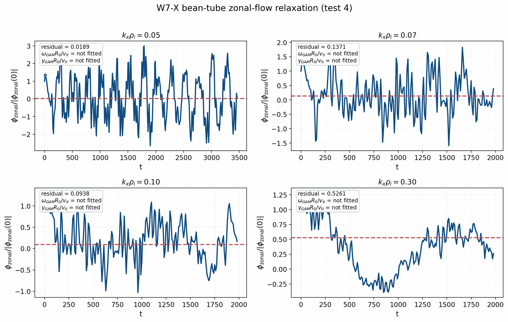
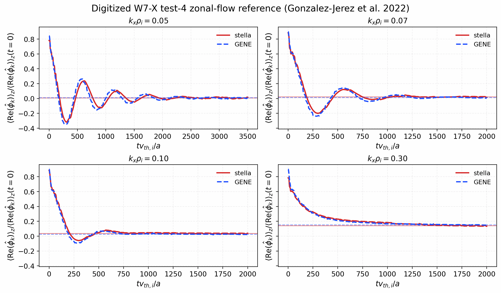
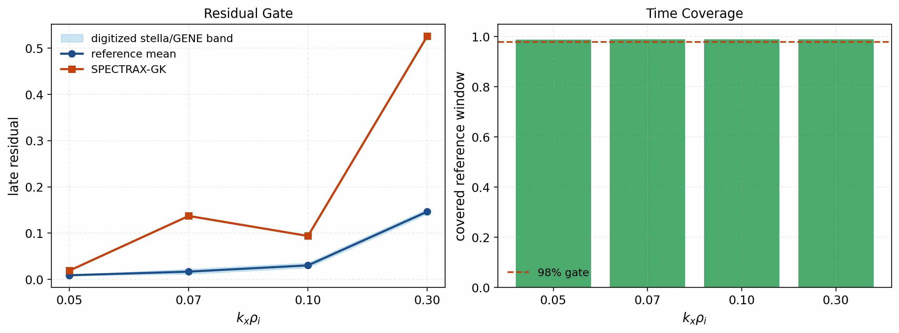
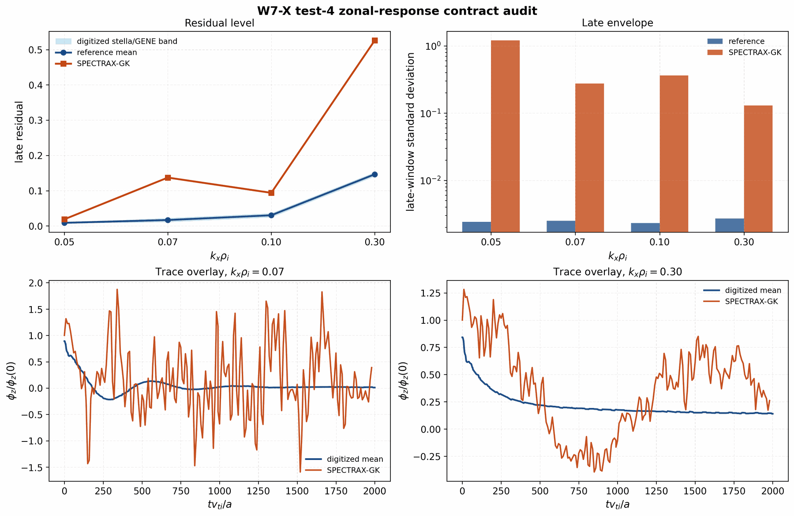
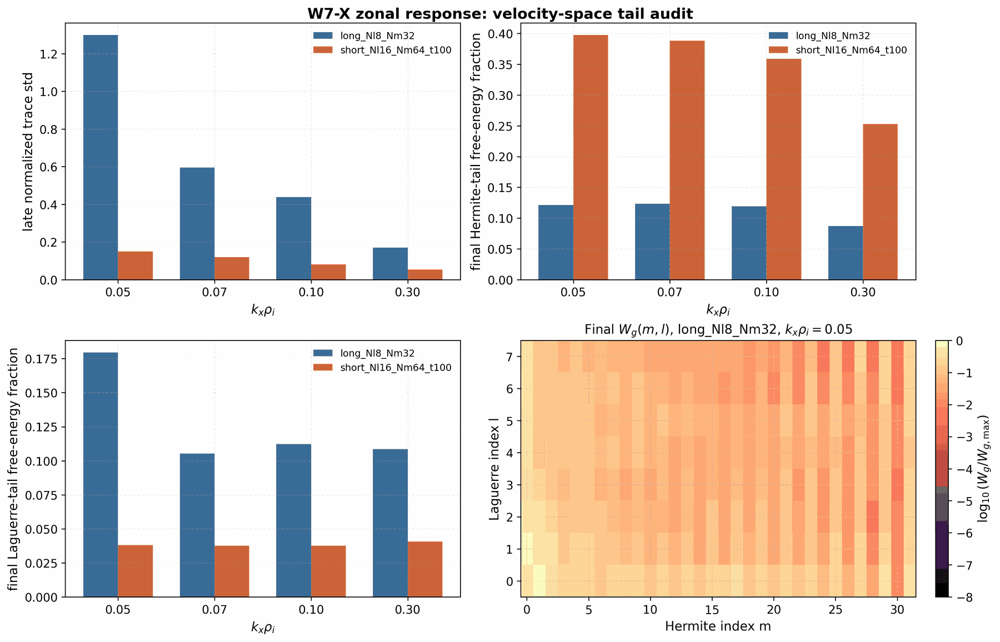
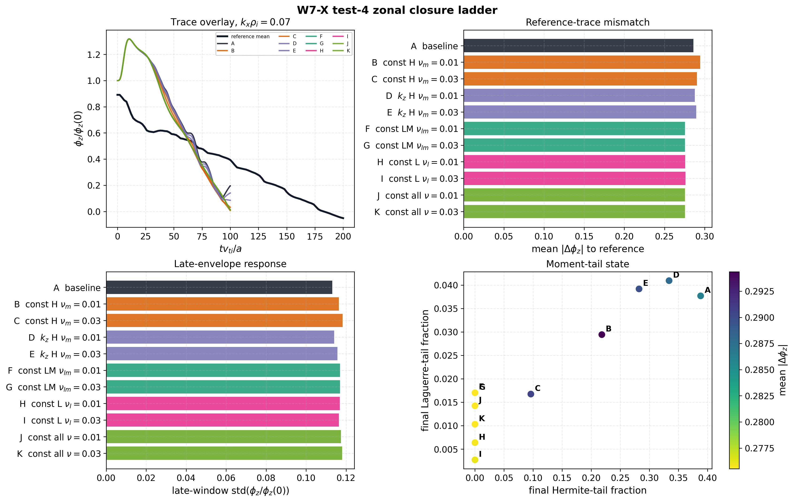
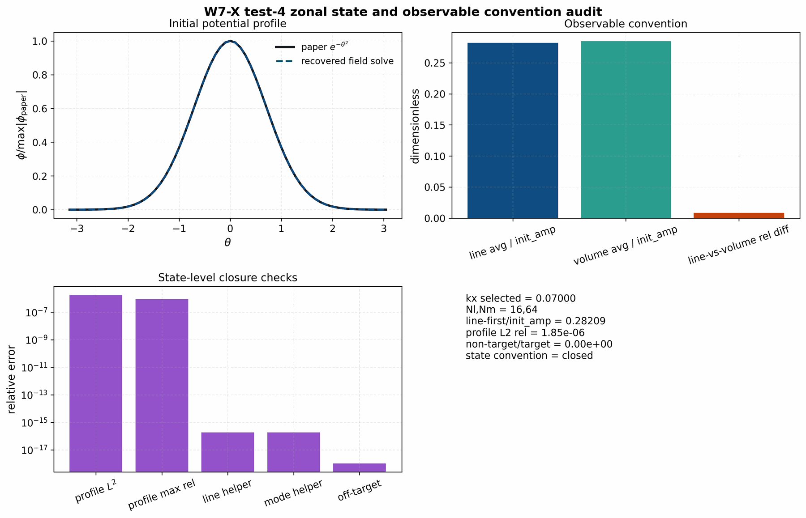
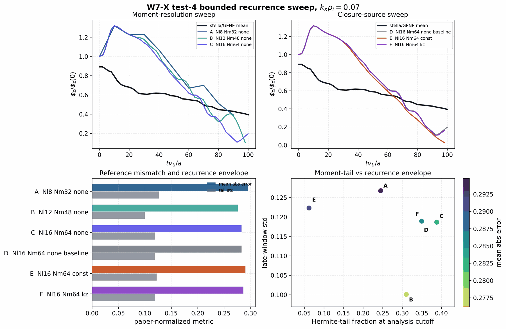
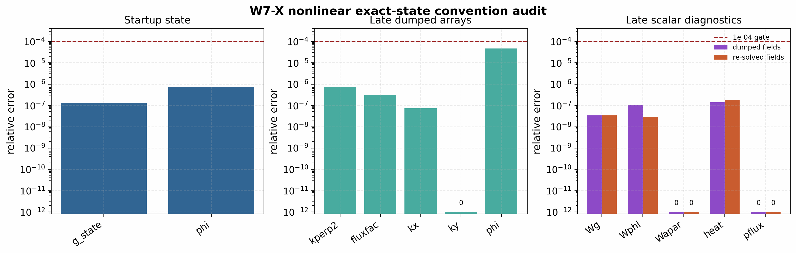

Testing
=======

Testing philosophy
------------------

SPECTRAX-GK enforces high coverage on critical solver modules and requires
physics-based checks for each numerical component. The test suite is designed
to be:

- **pedagogic**: each test explains the concept being validated
- **deterministic**: no stochastic outcomes or tolerance drift
- **future-proof**: targeted at invariants and well-posed regressions

Current testing target
----------------------

The package-wide target is 95% coverage, but the coverage number is a guardrail
rather than the scientific objective. New tests should be accepted because they
protect one of the following contracts:

- an implemented equation or reduced physical limit;
- a numerical method, convergence rate, or conservation/free-energy identity;
- a geometry, normalization, or diagnostic convention;
- a benchmark artifact and its documented fit/window policy;
- an autodiff contract checked against finite differences, tangent tests, or an
  adjoint consistency relation;
- a regression for a bug found in parity, restart, runtime, plotting, or
  geometry-adapter work.

Long reference-code runs and office/GPU comparisons should not be hidden inside
the default local suite. They should live behind explicit manifests or CI/manual
lanes so local tests remain fast enough for routine development.

The refactor branch also carries a machine-readable validation/coverage
manifest at ``tools/validation_coverage_manifest.toml``. It is checked by
``tools/check_validation_coverage_manifest.py`` and maps each critical module
to reference anchors, physics contracts, numerical contracts, fast tests,
tracked artifacts, and next tests. This is the working guardrail for reaching
95% package-wide coverage without adding shallow tests that do not validate the
implemented physics or numerics.

Test categories
---------------

- **Basis tests**: orthonormality and recurrence checks.
- **Operator tests**: Hermite ladder streaming and mode extraction.
- **Benchmark tests**: loading reference data and growth-rate fitting.
- **Physics sanity checks**: conservation properties under simplified limits.
- **Response-function tests**: zonal-flow residuals, GAM damping, and late-time
  envelopes.
- **Spectral tests**: fluctuation spectra and windowed nonlinear statistics.
- **Autodiff tests**: tangent, finite-difference, and inverse/UQ consistency.

Unit tests (numerical invariants)
---------------------------------

Representative unit checks include:

- **Hermite/Laguerre ladder identities**:
  :func:`spectraxgk.linear.apply_hermite_v`,
  :func:`spectraxgk.linear.apply_laguerre_x`.
- **Quasineutrality consistency**:
  :func:`spectraxgk.linear.quasineutrality_phi`.
- **Streaming term validation**:
  :func:`spectraxgk.linear.grad_z_periodic`,
  :func:`spectraxgk.linear.streaming_term`.
- **Growth-rate fitting windows**:
  :func:`spectraxgk.analysis.select_fit_window`,
  :func:`spectraxgk.analysis.fit_growth_rate_auto`.
- **Grid construction and normalization**:
  :func:`spectraxgk.grids.build_spectral_grid`.
- **Normalization contract consistency**:
  :func:`spectraxgk.normalization.get_normalization_contract`,
  :func:`spectraxgk.normalization.apply_diagnostic_normalization`.
- **Modular RHS equivalence**:
  :func:`spectraxgk.linear.linear_terms_to_term_config`,
  :func:`spectraxgk.terms.assemble_rhs_cached`,
  :func:`spectraxgk.linear.linear_rhs_cached`.

These tests live in ``tests/test_linear.py`` and ``tests/test_grids.py`` and
``tests/test_normalization.py`` and ``tests/test_terms_assembly.py`` and are
designed to fail deterministically if a discretization, assembly path, or
normalization changes.

Physics regression tests
------------------------

The physics-focused tests exercise reduced or symmetry limits that should
remain invariant across refactors:

- **Term toggles**: :class:`spectraxgk.linear.LinearTerms` switches individual
  operator components without changing the equation structure.
- **Mirror/curvature activation**: nonzero drift terms create nonzero response
  when streaming and drive are turned off.
- **Diamagnetic drive structure**: the energy-weighted drive produces a
  nonzero response when gradients are enabled and vanishes at :math:`k_y=0`.
- **Normalization scaling**: ``rho_star`` rescales the cached :math:`k_y`
  values exactly.
- **End-cap damping**: the linked-boundary taper only affects :math:`k_y>0`
  modes and vanishes when ``damp_ends_amp = 0``.

These checks are in ``tests/test_linear.py`` and are meant to be future-proof
physics invariants.

Benchmark regression tests
--------------------------

Benchmark regression tests validate the Cyclone base case reference dataset and
growth-rate extraction pipeline:

- Loading the reference CSV via :func:`spectraxgk.benchmarks.load_cyclone_reference`.
- Running short linear scans via :func:`spectraxgk.benchmarks.run_cyclone_linear`
  and :func:`spectraxgk.benchmarks.run_cyclone_scan`.
- Reduced ky regression with tightened tolerances on the field-aligned grid.

These tests live in ``tests/test_benchmarks.py`` and ``tests/test_full_operator.py``.

Literature-anchored response and spectrum tests
-----------------------------------------------

The next research-facing additions should follow the published benchmark
observables rather than inventing repo-local metrics:

- **Rosenbluth-Hinton / GAM response in shaped tokamaks**: use the shaped
  benchmark conventions summarized by Merlo et al. to track residual levels and
  GAM damping alongside the linear shaping scan.
- **W7-X zonal-flow response**: use the stella/GENE W7-X benchmark conventions
  for residual level and damping envelope.
- **W7-X fluctuation spectra**: follow the W7-X Doppler-reflectometry
  comparison work for density and zonal-flow frequency spectra.
- **Electromagnetic stellarator verification**: adopt a heavy-electron
  electromagnetic lane before realistic-mass claims, following the GENE-3D
  verification pattern.

These should be implemented as reproducible, script-owned figure/artifact
lanes, not as ad hoc notebooks.

The first reusable tooling for this lane now exists:

- :func:`spectraxgk.benchmarking.zonal_flow_response_metrics`
- :func:`spectraxgk.benchmarking.load_diagnostic_time_series`
- :func:`spectraxgk.validation_gates.evaluate_scalar_gate`
- :func:`spectraxgk.validation_gates.observed_order_gate_report`
- :func:`spectraxgk.validation_gates.branch_continuity_gate_report`
- :func:`spectraxgk.validation_gates.eigenfunction_gate_report`
- :func:`spectraxgk.validation_gates.linear_metrics_gate_report`
- :func:`spectraxgk.validation_gates.nonlinear_window_gate_report`
- :func:`spectraxgk.validation_gates.zonal_response_gate_report`
- :func:`spectraxgk.zonal_validation.reference_residual_table`
- :func:`spectraxgk.zonal_validation.tail_trace_metrics`
- :func:`spectraxgk.plotting.zonal_flow_response_figure`
- ``tools/plot_zonal_flow_response.py``
- ``tools/plot_zonal_flow_response_from_output.py``
- ``tools/generate_miller_zonal_response_pilot.py``
- ``tools/generate_w7x_zonal_response_panel.py``
- ``tools/plot_w7x_zonal_contract_audit.py``
- ``tools/plot_w7x_zonal_moment_tail_audit.py``
- ``tools/plot_w7x_zonal_closure_ladder.py``
- ``tools/plot_w7x_zonal_state_convention_audit.py``
- ``tools/plot_w7x_zonal_recurrence_sweep.py``

The gate-report helpers are intentionally small and JSON-ready. They should be
used by manuscript refresh scripts so every reported artifact has the same
observable, reference, absolute/relative tolerance, and pass/fail convention.
The companion coverage manifest should be updated when a new gate helper,
artifact script, or refactor extraction changes module ownership or test
responsibility.
``tools/generate_miller_zonal_response_pilot.py`` now writes the first such
gate report into its JSON metadata for the residual, GAM frequency, and signed
GAM growth/damping comparison against the Merlo Case-III paper-scale read-off.
``tools/generate_kbm_reference_overlay.py`` writes the same gate structure for
the raw KBM eigenfunction overlay, using a strict overlap/relative-L2 policy.
The current refreshed KBM overlay passes that policy with overlap ``0.999985``
and relative ``L^2`` mismatch ``0.00721`` against the frozen GX raw mode.
``tools/generate_w7x_reference_overlay.py`` applies the same raw-mode policy to
the imported W7-X linear benchmark at ``k_y rho_i = 0.3``. It refreshes the
frozen finite GX raw-mode bundle when a matching ``.big.nc`` file is supplied
and writes ``docs/_static/w7x_eigenfunction_reference_overlay_ky0p3000.png``
plus JSON/CSV companions. The current artifact passes with overlap
``0.9999999994`` and relative ``L^2`` mismatch ``3.33e-5``.
``tools/compare_gx_nonlinear_diagnostics.py --summary-json`` now emits a
matching gate report for nonlinear diagnostic comparison figures, using the
window mean relative mismatch as the scalar acceptance metric. The summary
writer now accepts case/source labels, explicit ``tmin/tmax`` windows, and
writes strict JSON, replacing nonfinite absolute-gate relative errors with
``null``. The tracked release-window summaries cover Cyclone, Cyclone Miller,
KBM, HSX, and W7-X. The older short Cyclone diagnostic remains available as an
exploratory startup/resolved-spectrum audit, but it is not counted in the
release-gate index.
Observed-order and branch-continuity gate helpers are also available so
velocity-space convergence panels and branch-followed scan tables can use the
same JSON-ready acceptance convention.
``tools/generate_observed_order_gate.py`` is the generic no-rerun path for
CSV-backed convergence studies: it reads either an explicit step column or a
resolution column, writes an observed-order JSON gate report, and can generate
a log-log convergence figure. The tracked Cyclone velocity-space convergence
artifact lives at ``docs/_static/cyclone_resolution_observed_order.json`` and
``docs/_static/cyclone_resolution_observed_order.png``. It uses an office/GPU
``ky=0.30`` time-path sweep through ``(Nl,Nm)=(4,8),(6,12),(12,24),(16,32)``
with ``tmax=150`` and passes the strict pairwise-order and final-error gates.
``tools/compare_gx_kbm.py --branch-summary-json`` wires that convention into
the KBM branch-following workflow by summarizing adjacent ``gamma``/``omega``
jumps and successive eigenfunction-overlap continuity for the selected branch.
``tools/generate_kbm_branch_gate_summary.py`` provides the corresponding
no-rerun artifact path: it reads the existing selected KBM candidate table and
writes ``docs/_static/kbm_branch_gate_summary.json`` with the same strict gate
schema. The current continuity-first selected branch passes the adjacent
growth/frequency jump and successive-overlap gates.
``tools/make_validation_gate_index.py`` scans tracked JSON metadata and writes
``docs/_static/validation_gate_index.json``, ``.csv``, and ``.png`` so the docs
always have one compact pass/open view of the currently materialized release
validation gates. The current index has ``10/10`` tracked reports passing.
Exploratory diagnostics can set ``gate_index_include=false``
to remain documented without being treated as release blockers.
``tools/plot_nonlinear_window_statistics.py`` provides the companion
manuscript-facing statistics panel for the nonlinear GX comparison gates by
plotting the per-diagnostic ``mean_rel_abs`` and ``max_rel_abs`` values from
those same tracked JSON summaries.

The diagnostics stream now also carries ``Diagnostics/Phi_zonal_mode_kxt``, a
signed complex zonal-potential history reduced over ``z`` with the same volume
weights used elsewhere. That is the primitive to use for manuscript-grade
Rosenbluth-Hinton / GAM work. ``Diagnostics/Phi2_zonal_t`` remains useful as a
zonal-energy proxy for intermediate checks, but it is no longer the target
observable for the final paper lane.

The first case-specific shaped-Miller pilot for this lane is now reproducible
through ``examples/benchmarks/runtime_miller_zonal_response.toml`` and
``tools/generate_miller_zonal_response_pilot.py``. Its frozen artifact lives in
``docs/_static/miller_zonal_response_pilot.png``. The current frozen artifact
is pinned to Merlo et al. Case III: adiabatic electrons, zero gradients,
``k_xρ_i≈0.05``, ``k_y=0``, and an initial ion-density perturbation.  It uses
``Nz=32``, ``Nl=4``, ``Nm=24``, ``dt=0.005``, and runs to ``t≈60`` through the
same checkpoint-capable artifact writer used by long nonlinear runs.  Using the
Rosenbluth-Hinton convention ``phi(t -> infinity) / phi(0)`` gives a residual
of about ``0.192`` against the Merlo Case-III figure read-off of about
``0.19``.  The shipped extraction now follows the paper convention more
closely: positive and negative extrema of the signed residual-subtracted trace
are fit separately over a common pre-recurrence window, and the GAM frequency
is extracted from the instantaneous phase of that same window via a Hilbert
analytic signal.  With the current ``t≈30`` pre-recurrence window the artifact
gives ``ω_GAM R0 / v_i≈2.20`` and ``γ_GAM R0 / v_i≈-0.176``, both close to
the Merlo figure read-off.  The explicit remaining follow-up item is the
long-time recurrence visible in finite moment runs, rather than the
benchmark-scale residual/frequency/damping gate itself.

An additional recurrence audit now brackets the numerical trade-off more
explicitly: increasing the resolution to ``Nm=28`` and ``Nl=4`` lowers the
late-time recurrence ratio from about ``0.60`` to about ``0.54`` and brings
``ω_GAM R0 / v_i`` nearly onto the Merlo read-off, but it also pushes the
damping to roughly ``γ_GAM R0 / v_i≈-0.192``, which is more damped than the
paper-scale target near ``-0.17``. A minimal ``hypercollisions_const`` ladder
through ``10^{-4}`` is effectively inert for this case, while ``10^{-3}``
only lowers the recurrence ratio to roughly ``0.589`` and still does not beat
the clean higher-moment run. The shipped artifact therefore remains on the
``Nm=24``, ``Nl=4`` baseline until the long-time recurrence can be reduced
without moving the benchmark-scale damping gate.

The next literature lane now has a dedicated runtime contract as well:
``examples/benchmarks/runtime_w7x_zonal_response_vmec.toml`` and
``tools/generate_w7x_zonal_response_panel.py`` define the W7-X high-mirror
bean-tube zonal-flow relaxation benchmark from the stella/GENE paper. The
tool sweeps ``k_x rho_i`` over ``[0.05, 0.07, 0.10, 0.30]``. The runtime
contract seeds the published electrostatic-potential perturbation with
``init_field = "phi"`` and a Gaussian profile, while the panel extracts the
unweighted signed line-average diagnostic ``Phi_zonal_line_kxt``. The paper
text states that the line-average trace is normalized to its value at ``t=0``;
the caption also mentions the maximum value, but the source figure is clipped
at the initial point. The paper-facing default is therefore
``--initial-normalization=line_first`` and ``--time-scale=1``. The ``init_amp``
normalization and non-unit time-scale options are retained as explicit audits,
not as the validation contract. The default early-time fit-window cap is an
explicit analysis policy chosen to isolate the initial GAM before the slower
stellarator-specific oscillation. The generator forces a periodic radial box
for this ``k_y=0`` zonal response so the selected ``k_x rho_i`` values match
the published test-4 targets exactly; this avoids the linked-boundary
aspect-ratio override that is appropriate for drift-wave flux-tube runs but
wrong for this radial zonal scan.

The current frozen VMEC-backed artifact lives at
``docs/_static/w7x_zonal_response_panel.png`` with strict JSON metadata at
``docs/_static/w7x_zonal_response_panel.json``. The tracked combined trace CSV
``docs/_static/w7x_zonal_response_panel.traces.csv`` is written next to the
figure so comparison and audit scripts can be rerun without office-only
per-``k_x`` directories. It is a long-window run: ``k_x rho_i=0.05`` reaches
``t≈3460`` and the other three wavelengths reach ``t≈1980``. After the
paper-faithful line-first normalization, the late residuals are about
``0.0189``, ``0.137``, ``0.0938``, and ``0.526`` for ``k_x rho_i = 0.05``,
``0.07``, ``0.10``, and ``0.30``.
``tools/digitize_w7x_zonal_reference.py`` now extracts the stella/GENE Fig. 11
main traces and inset residual levels from the arXiv source ``figs/ZF.pdf``.
The resulting reference artifacts are
``docs/_static/w7x_zonal_reference_digitized.csv``,
``docs/_static/w7x_zonal_reference_digitized_residuals.csv``,
``docs/_static/w7x_zonal_reference_digitized.json``, and
``docs/_static/w7x_zonal_reference_digitized.png``. The comparison contract is
implemented in ``tools/compare_w7x_zonal_reference.py`` and materialized at
``docs/_static/w7x_zonal_reference_compare.png`` with JSON metadata in
``docs/_static/w7x_zonal_reference_compare.json``. The current long-window
artifact passes the time-coverage gate for all four wavelengths, but the
residual gate only passes at ``k_x rho_i=0.05`` and the late-envelope gate
fails by orders of magnitude. A previous ``init_amp``-normalized audit happened
to pass residual values for all four wavelengths, but that comparison is no
longer treated as a validation result because it does not follow the paper text
normalization. A later ``gaussian_width=4`` probe matched the clipped apparent
initial level of Fig. 11 better than the tracked width-1 profile, but the
source figure shows that the apparent ``0.8`` start is a plot-limit artifact,
not a reliable normalization target. The tracked TOML therefore keeps
``gaussian_width=1``, matching the source expression ``exp[-(z-z0)^2]``.

The runtime path now has three safeguards for this lane. First, strided nonlinear
diagnostics always retain the final step, so long traces do not silently stop
one stride before the intended horizon. Second, checkpointed artifact
generation validates each chunk for non-finite diagnostics, state, and fields
before writing or continuing. This makes high-moment W7-X recurrence sweeps
fail fast instead of running thousands of extra steps after a NaN. Third,
default VMEC/eik cache outputs are reused when valid and generated through a
unique temporary netCDF followed by atomic replacement, so parallel W7-X
validation sweeps cannot observe or corrupt a partially written geometry file.
A bounded
``k_x rho_i=0.07``, ``Nl=16``, ``Nm=64``, ``dt=0.05`` probe remained finite to
``t≈200`` and a post-fix ``t≈50`` rerun verified nonzero signed line-average
diagnostics through the retained final sample. A separate external-restart
artifact bug was then isolated to double-condensing already-active ``kx``/``ky``
diagnostic axes when appending loaded history. The writer now accepts either
full spectral axes or already-active GX output axes, and a W7-X VMEC external
resume smoke verified nonzero ``Phi_zonal_line_kxt`` and
``Phi_zonal_mode_kxt`` throughout the appended tail. A higher-moment follow-up
with ``Nl=16``, ``Nm=64``, ``dt=0.05`` then restart-continued the
``k_x rho_i=0.07`` trace to ``t≈100`` with finite diagnostics and nonzero
signed line/mode samples across the post-restart tail. A full four-wavelength
refresh at the same moment resolution also reached ``t≈100`` with finite,
nonzero signed traces for every target ``k_x rho_i``. A width-4 full-window
low-moment audit reached the digitized windows but flipped the residual sign at
``k_x rho_i=0.07``, ``0.10``, and ``0.30``. The remaining open item is
therefore not restart diagnostic continuity; it is the W7-X zonal damping,
closure, and velocity-space recurrence behavior under the paper-facing
line-first normalization.
``tools/plot_w7x_zonal_contract_audit.py`` turns the same tracked CSV/JSON
artifacts into ``docs/_static/w7x_zonal_contract_audit.png``. That panel is a
publication-facing diagnostic of the open mismatch rather than a release gate;
its JSON metadata has ``gate_index_include=false`` so the validation index does
not count it as closed.
``tools/plot_w7x_zonal_moment_tail_audit.py`` adds a no-rerun velocity-space
audit at ``docs/_static/w7x_zonal_moment_tail_audit.png``. It shows that the
long ``Nl=8``, ``Nm=32`` traces have large late normalized-trace standard
deviations and non-negligible final high-Hermite/high-Laguerre free-energy
fractions. The existing ``Nl=16``, ``Nm=64``, ``t≈100`` audit lowers the early
trace standard deviation but already carries a large high-Hermite tail, so the
next closure experiment should be a bounded moment/closure or recurrence
control sweep, not a change to the paper normalization.
``tools/plot_w7x_zonal_closure_ladder.py`` makes that bounded sweep explicit
for ``k_x rho_i=0.07`` in
``docs/_static/w7x_zonal_closure_ladder_kx070.png``. The ladder separates
paper-contract resolution changes from weak-closure and non-contract
initializer audits. The current result is useful but not closed:
higher moments and weak closure reduce some envelope metrics, while the
early-window trace mismatch remains too large under the paper-facing
normalization. The newest paper-width ``Nl=16``, ``Nm=64``,
``nu_hyper_m=3e-3`` row reduces the final Hermite-tail fraction from
``0.388`` to ``0.064`` relative to the no-closure high-moment probe, but the
reference-trace mean absolute error worsens slightly from ``0.283`` to
``0.292``; that supports a moment-tail mitigation hypothesis but not a closed
validation claim.
``tools/plot_w7x_zonal_state_convention_audit.py`` closes the state-level
initializer and observable convention layer for the same paper-facing setup.
At ``k_x rho_i=0.07``, ``Nl=16``, and ``Nm=64``, the recovered Gaussian
potential has relative ``L2`` error ``1.85e-6``, off-target spectral potential
content is zero to the reported precision, and the signed line-average and
volume-average helper diagnostics agree with manual reductions to about
``2e-16``. The line-first initial level is ``0.28209 init_amp`` while the
volume-weighted level is ``0.28450 init_amp``; that explicit difference is why
the paper-facing observable must remain ``Phi_zonal_line_kxt`` normalized by
its first nonzero sample.
``tools/plot_w7x_zonal_recurrence_sweep.py`` then performs the bounded
recurrence sweep requested for the paper lane without changing initializer or
normalization conventions. Moment resolution and closure source are varied
separately at ``k_x rho_i=0.07`` over the common ``t v_t/a <= 100`` window.
The no-closure rows give mean absolute reference errors ``0.295`` for
``Nl=8,Nm=32``, ``0.276`` for ``Nl=12,Nm=48``, and ``0.283`` for
``Nl=16,Nm=64``. At fixed ``Nl=16,Nm=64``, constant-source closure suppresses
the final Hermite-tail fraction from ``0.388`` to ``0.062`` but worsens the
trace mean absolute error to ``0.291``; the ``k_z``-weighted closure remains
close to no closure. This separates the remaining recurrence/closure problem
from a state-convention error.
``tools/generate_w7x_zonal_response_panel.py`` now exposes explicit
``--nu-hyper``, ``--nu-hyper-l``, ``--nu-hyper-m``, ``--nu-hyper-lm``,
``--p-hyper-*``, ``--hypercollisions-const``, ``--hypercollisions-kz``,
``--enable-hypercollisions``, and ``--gaussian-width`` overrides so future
closure probes can be launched from the tracked benchmark tool rather than from
unrecorded local TOML edits. Non-unit Gaussian widths remain initializer
audits, not validation defaults.

   W7-X high-mirror bean-tube zonal-flow response for the stella/GENE test-4
   target ``k_x rho_i`` values. The response is normalized to the first
   nonzero line-average sample, following the paper text. The red dashed line
   is the late-window residual estimate and the shaded band is the common
   initial-GAM extraction window.

   Digitized stella/GENE reference traces from the W7-X benchmark paper's
   Fig. 11. The horizontal lines are residual levels read from the figure
   insets and are the reference targets for the next long-window SPECTRAX
   zonal-response gate.

   Current W7-X zonal comparison gate. Time coverage passes for all four
   wavelengths, but the paper-normalized residuals and late-window envelopes
   remain open validation issues.

   Publication-facing audit of the open W7-X test-4 zonal-response lane. The
   top row separates residual and late-envelope discrepancies; the bottom row
   overlays representative paper-normalized traces against the digitized
   stella/GENE mean. This figure is intended to localize the remaining
   velocity-space recurrence / closure problem, not to claim validation closure.

   Velocity-space tail audit for existing W7-X test-4 outputs. The long
   ``Nl=8``, ``Nm=32`` traces have large late normalized-trace variance and
   visible Hermite/Laguerre tail content. The short ``Nl=16``, ``Nm=64`` run
   reduces the early trace envelope but does not by itself close the
   long-window recurrence question.

   Bounded closure ladder for ``k_x rho_i=0.07``. Paper-contract resolution
   changes, weak velocity-space closure, and non-contract initializer probes
   are shown separately. The non-contract width-four high-resolution probe
   improves the short early window, but it is not a validation result because
   the benchmark source specifies the width-one Gaussian potential initializer.

   State-level W7-X test-4 convention audit. The runtime path recovers the
   paper Gaussian potential initializer, selects only the requested zonal
   spectral mode, and verifies that the signed line-average and
   volume-weighted zonal observables are intentionally distinct but internally
   consistent.

   Bounded W7-X test-4 recurrence sweep at ``k_x rho_i=0.07``. The left trace
   panel varies moment resolution with no closure; the right trace panel varies
   closure source at fixed high resolution. The bottom panels show that tail
   suppression alone does not yet close the literature-trace mismatch.

Diffrax and nonlinear smoke tests
---------------------------------

Diffrax integration and the nonlinear driver are exercised with fast smoke
tests:

- ``tests/test_diffrax_integrators.py`` runs explicit and IMEX diffrax solvers
  on tiny grids.
- ``tests/test_diffrax_integrators_core.py`` hardens branch coverage for
  diffrax helper paths (solver selection, save modes, streaming fits, IMEX
  branches, parallelization, and validation errors).
- ``tests/test_linear_krylov_core.py`` hardens matrix-free Krylov internals
  (mode-family targeting, shift-invert preconditioner selection, fallback
  policy, and dominant eigenpair wrappers).
- ``tests/test_example_smoke.py`` verifies the config-driven runner (diffrax
  enabled) and a short nonlinear scan with placeholder nonlinear terms.
- ``tests/test_nonlinear_exb.py`` exercises the nonlinear bracket sign,
  real-FFT path, flutter coupling, and EM toggle behavior.
- ``tests/test_runtime_config.py`` and ``tests/test_runtime_runner.py`` verify
  unified runtime TOML loading and case-agnostic linear runs (Cyclone/ETG/KBM)
  through the same solver path.
- ``tests/test_runtime_config.py`` also locks the public nonlinear stellarator
  runtime contract, including the absence of adaptive-step truncation caps and
  the presence of default ``tools_out/...`` artifact paths for W7-X and HSX.

Parallelization identity gates
------------------------------

Independent scan and ensemble parallelization is tested before it is used for
performance claims:

- ``tests/test_parallel.py`` locks the ``batch_map`` / ``ky_scan_batches``
  helper semantics, including deterministic padding and one-device fallback.
- ``tests/test_generate_parallel_ky_scan_gate.py`` tests the artifact writer
  for the real Cyclone ``k_y``-batch gate.
- ``tools/generate_parallel_ky_scan_gate.py`` runs the actual linear solver
  serially and with fixed-shape ``k_y`` batching, then writes
  ``docs/_static/parallel_ky_scan_gate.{png,pdf,csv,json}``. The JSON gate
  requires numerical identity for growth rate and frequency; the speedup value
  is reported separately for engineering tracking.

Nonlinear parity snapshots
--------------------------

Recent GX parity spot checks are tracked outside the automated test suite:

- **Cyclone nonlinear short replay**: the GX `cyclone_salpha_short.in` replay
  (`dt=0.05`, `t_max=5`, collisions off, diagnostics stride 1) now uses the
  explicit short-reference runtime contract in
  ``examples/nonlinear/axisymmetric/runtime_cyclone_nonlinear_short.toml``.
  The main short-run drift turned out to be configuration-level: the replay
  needed ``p_hyper = 2`` and no end damping to match the public GX short input.
  With that contract restored, the tracked comparison improves to
  ``mean_rel_abs(Wphi) ~= 2.11e-1`` and
  ``mean_rel_abs(HeatFlux) ~= 2.51e-1``. The resolved audit remains in
  ``docs/_static/nonlinear_cyclone_short_resolved_audit_t5.{png,csv}``, where
  ``Wphi_kyst`` is still the dominant residual mismatch.
- **Secondary (`kh01a`)**: the tracked secondary comparison now uses a dense
  real GX run (`kh01a_shortdense.out.nc`, 10 samples in ``omega_kxkyt``) and
  the rebuilt ``secondary_gx_out_compare.csv``. The comparison helper now uses
  the GX file horizon automatically in ``out-nc`` mode, so it no longer mixes a
  short GX replay with a ``t_max = 100`` SPECTRAX stage-2 run. On the matched
  short window, growth rates match tightly (``max rel_gamma ~= 1.87e-4``) and
  the non-zonal ``omega`` modes also close tightly
  (``rel_omega ~= 3.23e-4`` and ``9.92e-4`` on the ``k_y = 0.1`` sidebands).
  The only large relative ``omega`` values left are the effectively zero-
  frequency ``k_y = 0`` sidebands, where the absolute mismatch stays
  ``O(1e-6)``.
- **W7-X nonlinear (`t \\approx 200`)**: the refreshed long-window NetCDF-backed
  comparison now closes at
  ``mean_rel_abs(Phi2) ~= 9.74e-2``,
  ``mean_rel_abs(Wg) ~= 3.20e-2``,
  ``mean_rel_abs(Wphi) ~= 3.02e-2``,
  ``mean_rel_abs(HeatFlux) ~= 4.53e-2``.
- **HSX nonlinear (`t = 50`)**: the refreshed comparison closes at
  ``mean_rel_abs(Wg) ~= 2.75e-2``,
  ``mean_rel_abs(Wphi) ~= 3.61e-2``,
  ``mean_rel_abs(HeatFlux) ~= 2.91e-2``.
- **KBM nonlinear (`t = 100`)**: the refreshed long-window comparison closes at
  roughly ``9.3e-3`` mean-relative error across
  ``Wg/Wphi/Wapar/HeatFlux/ParticleFlux``.

Linear physics checks
---------------------

Before nonlinear validation, we exercise linear physics checks grounded in
published benchmarks and trend tests:

- **ITG/Cyclone base case**: reproduce the standard Cyclone base case growth
  rates and frequencies across a reduced ky scan. [Dimits00]_ [Lin99]_
- **GX term-by-term audit**: use the term-dump tooling to compare SPECTRAX-GK
  streaming and linear-kernel RHS components against GX for a single Cyclone
  state (see ``tools/dump_rhs_terms.py`` and ``tools/compare_gx_rhs_terms.py``).
- **GX nonlinear term audit (KBM/Cyclone)**: compare nonlinear
  derivative, bracket, electromagnetic split, and total RHS dumps using
  ``tools/compare_gx_nonlinear_terms.py``. The tool supports GX dump folders
  with ``nl_apar.bin``/``nl_bpar.bin`` and can infer shape metadata when
  ``rhs_terms_shape.txt`` is absent.
- **ETG linear instability**: verify that growth rates remain positive across
  reduced electron-scale gradients and that the real frequency follows the
  electron diamagnetic direction. [Dorland00]_ [Jenko00]_
- **KBM beta scan**: verify the transition between ITG-like and KBM branches
  in a fixed-:math:`k_y` beta sweep against the tracked benchmark reference and
  exact-diagnostic audits.

Running tests
-------------

.. code-block:: bash

   pytest

Benchmark reproducibility stack
-------------------------------

The public CI and the tracked benchmark atlas are currently validated against a
tested numerical stack:

- ``jax>=0.8,<0.9``
- ``jaxlib>=0.8,<0.9``
- ``numpy>=2.3,<2.4``
- ``diffrax>=0.7,<0.8``
- ``equinox>=0.13,<0.14``

This is not a claim that newer releases are unsupported. It is a statement
about benchmark reproducibility. Near-marginal or branch-sensitive lanes such
as TEM, ETG runtime scans, and some imported-linear stellarator cases can move
materially under newer JAX/NumPy combinations even when the code still runs.
When investigating parity regressions, reproduce the issue on the tested stack
first before changing solver logic.
For runtime-example parity reproduction across recent precision-policy changes,
also set ``JAX_ENABLE_X64=1``. Default precision can be faster while still
moving parity-sensitive linear example outputs.

Stress-matrix parity gates
--------------------------

In addition to unit/regression tests, SPECTRAX-GK includes a small set of
"stress-matrix" gates meant to catch parity regressions early (before tracked
benchmark figures move):

- **Restart parity**: ``tests/test_restart_gate.py`` verifies that a nonlinear
  run resumed from a compatible restart reproduces the same final state as a
  continuous run. This now covers both the raw binary state path and the
  nonlinear ``*.restart.nc`` bundle path, together with append-on-restart
  history preservation in ``*.out.nc``.
- **CPU/GPU short-window parity** (optional): ``tests/test_device_parity_gate.py``
  compares a short nonlinear trajectory norm on CPU vs GPU. Enable explicitly:

  .. code-block:: bash

     SPECTRAXGK_DEVICE_PARITY=1 pytest -q tests/test_device_parity_gate.py

- **VMEC roundtrip determinism** (optional): ``tests/test_vmec_roundtrip_gate.py``
  regenerates an ``*.eik.nc`` from a provided VMEC file twice and asserts the
  imported geometry arrays are bitwise identical. Enable explicitly:

  .. code-block:: bash

     SPECTRAXGK_VMEC_FILE=/path/to/wout.nc pytest -q tests/test_vmec_roundtrip_gate.py

For developer workflows that require local reference benchmark NetCDFs or dump
artifacts, use:

- ``tools/run_gx_linear_stress_matrix.py`` (KAW, Cyclone kinetic electrons, KBM Miller)
- ``tools/run_imported_linear_targeted_audit.py`` (generic per-``ky`` targeted imported-linear wrapper)
- ``tools/compare_gx_imported_window.py`` (exact imported-linear one-window replay against reference ``diag_state`` dumps)
- ``tools/run_kbm_lowky_extractor_audit.py`` (direct cached-trajectory KBM low-``ky`` extractor audit)
- ``tools/run_exact_state_audit.py`` (manifest-driven wrapper around the exact-state audit tools)
- ``tools/plot_w7x_exact_state_audit.py`` (no-rerun W7-X exact-state convention audit panel)
- ``tools/run_restart_parity_gate.py`` (manifest-driven nonlinear restart/continuation parity gate)
- ``tools/run_device_parity_gate.py`` (manifest-driven CPU/GPU short-window parity gate)
- ``tools/run_vmec_roundtrip_gate.py`` (manifest-driven VMEC ``vmec -> eik.nc`` determinism gate)

The current full-GK nonlinear ETG lane is now explicitly tracked as a pilot
runtime contract via
``examples/nonlinear/axisymmetric/runtime_etg_nonlinear.toml``. That lane is
separate from the reduced ``cETG`` solver and should be used for future
GX-backed nonlinear ETG parity work.

For ETG nonlinear audit runs, use dense short-window overrides first:

.. code-block:: bash

   JAX_ENABLE_X64=1 spectrax-gk examples/nonlinear/axisymmetric/runtime_etg_nonlinear.toml \
     --steps 10 \
     --sample-stride 1 \
     --diagnostics-stride 1

This lane is currently expensive enough that short persisted windows are the
right first diagnostic step before attempting long production horizons.

The ETG short-window startup mismatch was traced to the GX input contract, not
the nonlinear ETG operator. GX reads ``init_single`` from ``[Expert]`` rather
than ``[Initialization]``, so the audited GX pilot was actually using the
Gaussian startup branch. The shipped runtime ETG pilot now matches that
contract with ``gaussian_init = true``, ``init_single = false``,
``Lx = 1.25``, and GX-style ``kz`` hypercollisions. On the matched
``Nx=10``, ``Ny=22``, ``ntheta=16``, ``Nl=4``, ``Nm=4``, ``dt=1e-4``,
``t_max=0.001`` pilot, the refreshed short-window comparison lands at
``mean_rel_abs(Wg) ~= 1.31e-2`` and ``mean_rel_abs(Wphi) ~= 5.18e-3``, with
the final heat-flux point within a few percent of GX.

The targeted imported-linear wrapper and the underlying
``compare_gx_imported_linear.py`` comparator now support two important controls
for honest stress-lane scoring without changing the default full-window
behavior:

- ``--sample-step-stride``: subsample the saved diagnostic sample indices
  before scoring.
- ``--max-samples``: truncate scoring to the first N selected samples.

The lower-level comparator also supports ``--cache-dir`` plus ``--reuse-cache``
to persist per-``ky`` trajectory/result arrays (``gamma``, ``omega``,
``Wg``, ``Wphi``, ``Wapar``) as compressed ``.npz`` files keyed by the actual
reference file, geometry file, reference input, selected ``ky``, Hermite/Laguerre
resolution, mode selector, and sample-window contract. This makes the
stress-lane tooling incremental instead of rerunning a full lane every time.
It now also writes absolute diagnostic-error columns and the reference
``|gamma|`` / ``|omega|`` scales alongside the relative metrics. That matters
for near-marginal imported-linear stellarator lanes such as HSX, where
``mean_rel_gamma`` can look large simply because the reference growth rate is
close to zero even while the absolute growth-rate mismatch and the field-energy
diagnostics remain small.

For VMEC-backed exact-state audits, the runtime bridge now prefers a local
``booz_xform_jax`` checkout and injects a temporary ``booz_xform`` compatibility
shim only into the external geometry-helper subprocess. This preserves the
audited reference workflow while avoiding a host-level dependency on the original ``booz_xform``
Python package.

The bridge auto-discovers ``booz_xform_jax`` from
``BOOZ_XFORM_JAX_PATH`` / ``SPECTRAX_BOOZ_XFORM_JAX_PATH`` or from a checkout placed
next to the SPECTRAX-GK workspace. When a specific
Python environment is needed for the helper subprocesses, set
``geometry.gx_python`` in the runtime TOML. On ``office``, the normal audited
path is:

.. code-block:: bash

   export BOOZ_XFORM_JAX_PATH=/path/to/booz_xform_jax
   export SPECTRAX_VENV_PYTHON=/path/to/venv/bin/python
   export SPECTRAX_OFFICE_ROOT=/path/to/SPECTRAX-GK
   W7X_VMEC_FILE=/path/to/wout_w7x.nc \
   HSX_VMEC_FILE=/path/to/wout_HSX_QHS_vac.nc \
   "$SPECTRAX_VENV_PYTHON" tools/run_exact_state_audit.py \
     --manifest tools/exact_state_lanes.office.toml \
     --outdir tools_out/exact_state_audit_office

The tracked ``office`` manifest now pins these audit lanes to
``JAX_PLATFORMS=cpu``. These are parity/reference jobs, not performance runs,
and CPU pinning avoids spurious GPU ``RESOURCE_EXHAUSTED`` failures when
``booz_xform_jax`` or grid-default assembly would otherwise grab a busy device.

The restart/continuation gate uses the same environment model and should be
run against the tracked nonlinear lanes with ``PYTHONPATH`` set to the source
tree so the office venv does not pick up a stale installed package:

.. code-block:: bash

   PYTHONPATH="$SPECTRAX_OFFICE_ROOT/src" \
   "$SPECTRAX_VENV_PYTHON" tools/run_restart_parity_gate.py \
     --manifest tools/restart_gate_lanes.office.toml \
     --outdir tools_out/restart_parity_office

The current ``office`` exact-state manifest now includes:

- startup audits for Cyclone, KBM, W7-X, and HSX
- late dumped-state audits for Cyclone Miller, Cyclone runtime, W7-X, and KBM

The tracked W7-X exact-state convention panel is generated by
``tools/plot_w7x_exact_state_audit.py`` from the ``office`` W7-X startup and
late diagnostic-state dumps. It closes the VMEC geometry, Fourier-grid,
fieldsolve, and scalar-diagnostic convention layer against GX with a
``1e-4`` pointwise relative-error gate: startup ``g_state``/``phi`` are below
``7.4e-7``, late ``kperp2``/``fluxfac``/``kx``/``ky``/``phi`` arrays have
maximum finite relative error ``4.62e-5`` with ``phi`` RMS relative error
``3.77e-7``, and late scalar diagnostics are below ``1.8e-7``. This panel is
not a replacement for the open W7-X zonal-response literature lane; it rules
out the geometry/diagnostic convention layer as the source of that separate
recurrence/damping-envelope mismatch.

   W7-X nonlinear exact-state convention audit. Startup state, late dumped
   geometry/field arrays, and re-evaluated scalar diagnostics are compared
   directly against GX dumps from the same VMEC equilibrium and nonlinear
   runtime contract.

For KBM specifically, the startup audit, late dumped-state audit, nonlinear
term replay, and first RK4 partial-step replay now all close on the shipped
nonlinear config for the current release pass. The remaining KBM work is
therefore future long-window cleanup rather than a blocking startup-state,
diagnostic-reconstruction, or first-step assembly mismatch.

The device-parity gate now has audited ``office`` manifests for one tokamak and
one stellarator lane, both requiring stable nonzero outputs rather than the
older zero-norm smoke probe:

.. code-block:: bash

   PYTHONPATH="$SPECTRAX_OFFICE_ROOT/src" \
   "$SPECTRAX_VENV_PYTHON" tools/run_device_parity_gate.py \
     --manifest tools/device_parity_lanes.office.toml \
     --outdir tools_out/device_parity_office

The VMEC roundtrip gate uses the same manifest pattern and currently covers the
tracked W7-X and HSX VMEC lanes:

.. code-block:: bash

   PYTHONPATH="$SPECTRAX_OFFICE_ROOT/src" \
   "$SPECTRAX_VENV_PYTHON" tools/run_vmec_roundtrip_gate.py \
     --manifest tools/vmec_roundtrip_lanes.office.toml \
     --outdir tools_out/vmec_roundtrip_office

If the helper must be forced to another interpreter, set ``geometry.gx_python``
in the runtime TOML used by the audit and rerun the same command. The old
environment-variable override is no longer documented because the preferred
path is the internal ``booz_xform_jax`` backend.

CI split: fast PR vs manual full
--------------------------------

CI is split into two tiers to keep pull requests fast while preserving full
physics rigor:

- **Fast PR/push tier**: three parallel shards run mypy and targeted test
  subsets (fundamentals, linear core, runtime/nonlinear). This catches solver
  and dtype regressions quickly.
- **Wide coverage tier**: ``tools/run_wide_coverage_gate.py`` runs top-level
  test files in bounded shards, combines coverage data, and enforces the
  package-wide ``>=95%`` target. Each shard has its own timeout so a single
  slow validation slice cannot become an unbounded release job.
- **Manual full tier**: full ``pytest`` suite plus strict coverage gates:
  ``spectraxgk.terms >= 90%`` and per-module core gates for
  ``linear_krylov.py`` and ``diffrax_integrators.py``.

This keeps iteration latency low for development and still enforces complete
coverage and regression checks on demand without relying on scheduled runners.

The same wide gate can be run locally with:

.. code-block:: bash

   python tools/run_wide_coverage_gate.py --shards 6 --timeout 300 --fail-under 95

Core modular coverage gate
--------------------------

To keep the modular RHS path future-proof, CI also enforces a dedicated
coverage gate for ``spectraxgk.terms``:

.. code-block:: bash

   pytest -q tests/test_terms_assembly.py \
          tests/test_terms_operators.py \
          tests/test_terms_fields.py \
          tests/test_terms_integrators.py \
          tests/test_terms_validation.py \
          --maxfail=1 --disable-warnings \
          --cov=src/spectraxgk/terms \
          --cov-fail-under=90

This guard ensures term-wise kernels, field solves, custom-VJP behavior, and
assembly plumbing stay highly covered while the rest of the benchmark and
cross-code harness keeps evolving.

Core solver coverage gates
--------------------------

CI also enforces dedicated per-module thresholds for the two linear solver
engines that are most likely to regress during algorithm work:

- ``spectraxgk.linear_krylov`` (matrix-free Arnoldi/shift-invert path)
- ``spectraxgk.diffrax_integrators`` (explicit/IMEX/implicit diffrax path)

The gate runs focused tests and checks each module from ``coverage-core.xml``:

.. code-block:: bash

   pytest -q tests/test_linear_krylov_core.py \
          tests/test_diffrax_integrators.py \
          tests/test_diffrax_integrators_core.py \
          --maxfail=1 --disable-warnings \
          --cov=src/spectraxgk \
          --cov-report=xml:coverage-core.xml

Both modules are required to stay at or above 90% line coverage in CI.
