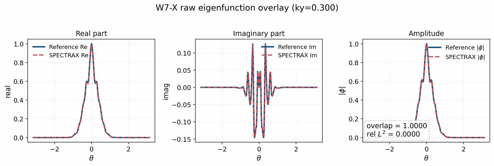
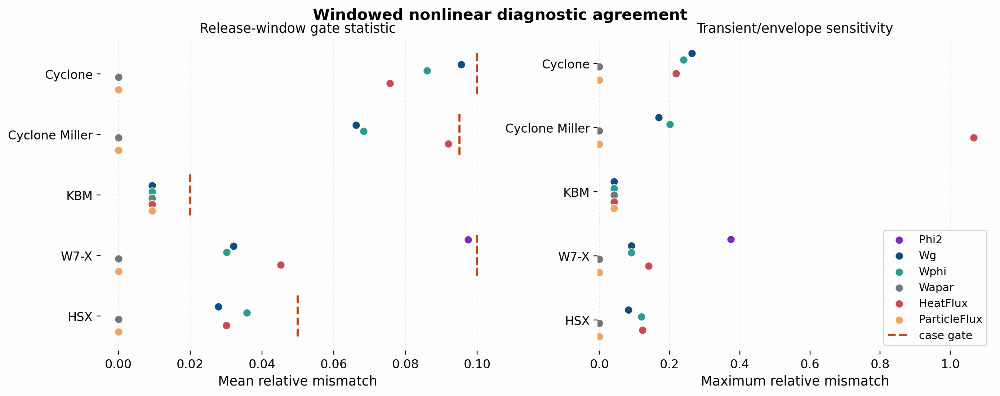

Verification Matrix
===================

Purpose
-------

This page is the research-facing index of what SPECTRAX-GK treats as verified,
validated, exploratory, or deferred. It is meant to answer four questions for
each lane:

1. what physical model is being exercised,
2. what observable is compared,
3. what the reference is,
4. what acceptance gate applies.

Literature Baselines Reviewed
-----------------------------

The current matrix is anchored on these published baselines:

- Tronko et al., *Verification of Gyrokinetic codes: theoretical background and applications*:
  verification methodology, observed-order checks, and benchmark-observable
  framing.
- Mandell et al., *GX: a GPU-native gyrokinetic turbulence code for tokamak and stellarator design*:
  CBC, W7-X, KBM, nonlinear transport, velocity-space convergence, and
  performance figure conventions.
- González-Jerez et al., *Electrostatic gyrokinetic simulations in W7-X geometry*:
  W7-X ITG/TEM scans, zonal-flow response, and nonlinear ITG heat flux.
- Nevins et al., *Characterizing electron temperature gradient turbulence*:
  ETG operating-point conventions.
- Monreal et al., *Residual zonal flows in tokamaks and stellarators at arbitrary wavelengths*:
  residual-zonal-flow metrics and damping interpretation.
- Merlo et al., *Linear multispecies gyrokinetic flux tube benchmarks in shaped
  tokamak plasmas*:
  shaping scans, ballooning-angle handling, Rosenbluth-Hinton residuals, and
  GAM damping.
- González-Jerez et al., *Electrostatic microturbulence in W7-X: comparison of
  local gyrokinetic simulations with Doppler reflectometry measurements*:
  fluctuation amplitudes, frequency spectra, and zonal-flow spectral content.
- Maurer et al., *Global electromagnetic turbulence simulations of W7-X-like
  plasmas with GENE-3D*:
  heavy-electron electromagnetic verification before realistic-mass stellarator
  production runs.

Status Legend
-------------

- ``Closed``: benchmark lane is accepted for research claims.
- ``Open``: lane is active and expected to close.
- ``Exploratory``: useful for development, not yet a paper claim.
- ``Deferred``: intentionally out of scope for the current paper/release.

Tokamak Linear
--------------

.. list-table::
   :header-rows: 1

   * - Lane
     - Observable
     - Reference
     - Status
     - Baseline gate
   * - Cyclone ITG
     - ``gamma(k_y)``, ``omega(k_y)``, eigenfunction overlap
     - GX + CBC literature
     - Closed
     - ``rtol <= 1e-2`` except documented low-``k_y`` / near-marginal cases
   * - ETG
     - ``gamma(k_y)``, ``omega(k_y)``
     - GX + ETG benchmark literature
     - Closed
     - ``rtol <= 1e-2`` on the tracked branch
   * - KBM
     - ``gamma(k_y)``, ``omega(k_y)``, branch continuity vs ``beta``
     - GX
     - Closed
     - ``rtol <= 1e-2`` on the accepted branch
   * - KAW
     - branch-followed linear response
     - GX
     - Deferred
     - close branch identity before publication use
   * - TEM
     - ``gamma(k_y)``, ``omega(k_y)``
     - GX / literature
     - Open
     - close branch-following and reference selection first
   * - Shaped multispecies tokamak
     - ``gamma``, ``omega``, eigenfunction shape
     - Sauter benchmark set
     - Open
     - literature-backed operating point and overlap gate required
   * - Shaped tokamak zonal-flow / GAM
     - residual level, damping rate, GAM envelope
     - Merlo et al. + analytical Rosenbluth-Hinton estimates where applicable
     - Open
     - residual and damping must match literature/code-backed references before publication use; signed ``Phi_zonal_mode_kxt`` is now available. The current artifact is ``docs/_static/miller_zonal_response_pilot.png`` from ``tools/generate_miller_zonal_response_pilot.py`` using Merlo Case-III Table-III parameters, an initial density perturbation, a common pre-recurrence fit window ``t≈30``, separate positive/negative-extrema damping fits, and a Hilbert-phase frequency extraction on that same window. It gives ``residual≈0.192`` against a paper-scale target of about ``0.19``, ``ω_GAM R0 / v_i≈2.20`` against a figure read-off near ``2.24``, and ``γ_GAM R0 / v_i≈-0.176`` against a figure read-off near ``-0.17``. The remaining explicit follow-up item is the later finite-moment recurrence rather than the benchmark-scale Merlo gate

Frozen artifact paths for the currently closed tokamak linear lanes:

- ``docs/_static/cyclone_comparison.png``
- ``docs/_static/etg_comparison.png``
- ``docs/_static/kbm_comparison.png``
- ``docs/_static/kbm_eigenfunction_overlap_summary.png``
- ``docs/_static/reference_modes/kbm_linear_gx_ky0p3000.npz``
- ``docs/_static/benchmark_core_linear_atlas.png``

Closed raw-overlay diagnostic artifacts for the KBM lane:

- ``docs/_static/reference_modes/kbm_linear_spectrax_ky0p3000.csv``
- ``docs/_static/kbm_eigenfunction_reference_overlay_ky0p3000.png``
- ``docs/_static/reference_modes/kbm_eigenfunction_reference_overlay_ky0p3000.json``
- ``tools/generate_kbm_reference_overlay.py``

The refreshed bounded-cost extraction produces normalized overlap
``0.999985`` and relative ``L^2`` mismatch ``0.00721`` against the frozen GX
raw mode at ``k_y \approx 0.3`` when run with the exact KBM grid contract, the
selected growth-fit window, and a late-time eigenfunction tail window. The
generator writes a machine-readable gate report with ``overlap >= 0.95`` and
``relative L^2 <= 0.25`` as the acceptance policy, and this raw-overlay
artifact now passes.

Branch-followed scan tables should use the same gate-report convention:
observed-order gates for resolution or velocity-space convergence, and
branch-continuity gates for adjacent ``gamma``/``omega`` jumps and successive
eigenfunction overlap when overlap data are available. The tracked KBM
candidate table now has a no-rerun summary path through
``tools/generate_kbm_branch_gate_summary.py`` and
``docs/_static/kbm_branch_gate_summary.json``. That summary now uses the
continuity-first selected branch and passes the strict checks:
``max_rel_gamma_jump ~= 0.388``, ``max_rel_omega_jump ~= 0.320``, and no
successive-overlap deficit.

Observed-order convergence tables should also gate both the asymptotic finest
refinement and the full set of pairwise refinement orders. The generic
``tools/generate_observed_order_gate.py`` path now records this policy in JSON.
The tracked Cyclone velocity-space convergence artifact
``docs/_static/cyclone_resolution_observed_order.json`` is closed on an
office/GPU ``ky=0.30`` time-path sweep with all pairwise orders positive,
final-pair order above ``4.8``, and finest-grid relative growth-rate error
about ``1.1e-3``.

The current materialized gate reports are indexed by
``tools/make_validation_gate_index.py`` in
``docs/_static/validation_gate_index.json`` and
``docs/_static/validation_gate_index.png``. Exploratory diagnostics can set
``gate_index_include=false`` so they remain documented but do not count as
release blockers. The current release-gate index has ``16/16`` tracked reports
passing.

Stellarator Linear
------------------

.. list-table::
   :header-rows: 1

   * - Lane
     - Observable
     - Reference
     - Status
     - Baseline gate
   * - W7-X ITG flux tube
     - ``gamma(k_y)``, ``omega(k_y)``
     - stella/GENE benchmark paper + GX
     - Closed
     - ``rtol <= 1e-2`` on closed adiabatic-electron ITG branches. This row
       does not close W7-X TEM or kinetic-electron validation; those remain
       blocked by the explicit TEM branch audit below.
   * - W7-X TEM / kinetic-electron extension
     - ``gamma(k_y)``, ``omega(k_y)``, multi-alpha/multi-surface windows
     - stella/GENE benchmark paper + W7-X TEM literature
     - Open
     - ``docs/_static/tem_branch_parity_audit.json`` is outside the publication
       parity envelope and ``docs/_static/w7x_tem_extension_status.json`` keeps
       multi-alpha, multi-surface, and kinetic-electron nonlinear windows open.
       Do not use the closed W7-X ITG row as a TEM claim.
   * - W7-X zonal flow
     - residual level, damping envelope
     - stella/GENE benchmark paper + zonal-flow literature
     - Open; time coverage closed, residual and late-envelope gates open
     - a case-specific runtime/tool path exists through ``examples/benchmarks/runtime_w7x_zonal_response_vmec.toml`` and ``tools/generate_w7x_zonal_response_panel.py``. The runtime now supports the paper-facing ``init_field="phi"`` Gaussian potential initializer and writes both the older volume-weighted ``Phi_zonal_mode_kxt`` diagnostic and the W7-X line-average ``Phi_zonal_line_kxt`` observable. The frozen VMEC-backed artifact now lives at ``docs/_static/w7x_zonal_response_panel.png`` with metadata in ``docs/_static/w7x_zonal_response_panel.json`` and replayable traces in ``docs/_static/w7x_zonal_response_panel.traces.csv``; it uses line-first normalization, following the paper text. The stella/GENE Fig. 11 reference traces and inset residuals are digitized by ``tools/digitize_w7x_zonal_reference.py`` into ``docs/_static/w7x_zonal_reference_digitized.csv`` and ``docs/_static/w7x_zonal_reference_digitized_residuals.csv``. ``tools/compare_w7x_zonal_reference.py`` writes the residual/time-coverage/envelope artifact ``docs/_static/w7x_zonal_reference_compare.json`` and can now replay the comparison from the tracked combined trace CSV. ``tools/plot_w7x_zonal_contract_audit.py`` writes ``docs/_static/w7x_zonal_contract_audit.png`` as a publication-facing open-lane diagnostic, ``tools/plot_w7x_zonal_moment_tail_audit.py`` writes ``docs/_static/w7x_zonal_moment_tail_audit.png`` to track the velocity-space recurrence / moment-tail hypothesis, ``tools/plot_w7x_zonal_closure_ladder.py`` writes ``docs/_static/w7x_zonal_closure_ladder_kx070.png`` to compare bounded closure attempts at ``k_x rho_i=0.07``, ``tools/plot_w7x_zonal_state_convention_audit.py`` writes ``docs/_static/w7x_zonal_state_convention_audit.png`` to close the initializer/observable convention layer, and ``tools/plot_w7x_zonal_recurrence_sweep.py`` writes ``docs/_static/w7x_zonal_recurrence_sweep_kx070.png`` to separate moment-resolution and closure-source effects. The current SPECTRAX artifact enforces the intended test-4 ``k_x rho_i`` values ``[0.05, 0.07, 0.10, 0.30]`` with a periodic radial box for the ``k_y=0`` zonal run and reaches ``t≈3460`` for ``k_x rho_i=0.05`` and ``t≈1980`` for the other three wavelengths. Under the paper-facing normalization, residuals fail at ``k_x rho_i=0.07``, ``0.10``, and ``0.30`` and late envelopes fail for all wavelengths. The state-level audit closes the convention question with Gaussian-profile relative ``L2`` error ``1.85e-6`` and helper/manual observable agreement near ``2e-16``. The bounded recurrence sweep shows that ``Nl=12,Nm=48`` has the best no-closure trace error on ``t v_t/a <= 100`` and that constant-source closure suppresses the final Hermite tail but worsens the trace error. The remaining closure step is therefore a physical velocity-space recurrence / damping fix rather than a documentation or normalization change
   * - W7-X fluctuation spectra
     - resolved ``k_y`` spectra, ``k_x``-``k_y`` fluctuation power, and temporal spectra
     - W7-X nonlinear gate plus Doppler-reflectometry comparison conventions
     - Initial simulation diagnostic closed; experimental transfer-function validation deferred
     - ``tools/plot_w7x_fluctuation_spectrum_panel.py`` writes ``docs/_static/w7x_fluctuation_spectrum_panel.png`` with CSV/JSON/PDF companions from the gated W7-X ``t≈200`` nonlinear NetCDF output. The script refuses failed nonlinear gate summaries by default and marks the JSON with ``claim_level = "validated_nonlinear_simulation_spectrum_not_experimental_validation"`` and ``gate_index_include = false``. It therefore closes the reproducible spectrum-estimator layer while leaving density/zonal-frequency comparison through a Doppler-reflectometry transfer function as a future manuscript extension
   * - HSX
     - ``gamma(k_y)``, ``omega(k_y)``
     - GX / internal frozen references
     - Closed
     - near-marginal deviations documented explicitly
   * - Electromagnetic stellarator verification
     - heavy-electron linear/nonlinear EM response
     - GENE-3D verification conventions
     - Open
     - close heavy-electron EM lane before realistic-mass claims

Frozen artifact paths for the currently closed stellarator linear lanes:

- ``docs/_static/w7x_linear_t2_scan.csv``
- ``docs/_static/hsx_linear_t2_scan.csv``
- ``docs/_static/w7x_linear_t2_lastvalue.csv``
- ``docs/_static/hsx_linear_t2_lastvalue.csv``
- ``docs/_static/reference_modes/w7x_linear_gx_ky0p3000.npz``
- ``docs/_static/reference_modes/w7x_linear_spectrax_ky0p3000.csv``
- ``docs/_static/w7x_eigenfunction_reference_overlay_ky0p3000.png``
- ``docs/_static/reference_modes/w7x_eigenfunction_reference_overlay_ky0p3000.json``
- ``docs/_static/benchmark_core_linear_atlas.png``

For W7-X, the whole-window scan and the late-time last-value reduction tell the
same story. For HSX, the whole-window ``mean_rel_gamma`` metric is kept as an
honest near-marginal stress signal, but the late-time closure should be read
from ``docs/_static/hsx_linear_t2_lastvalue.csv`` because the final
``(gamma, omega)`` values are much tighter than the whole-window average.

The W7-X raw eigenfunction overlay is now closed at ``k_y rho_i = 0.3`` using
``tools/generate_w7x_reference_overlay.py``. The frozen GX bundle was refreshed
from the finite ``t≈2`` raw field history because the older bundle source
contained non-finite late-time fields. The matched imported-geometry
SPECTRAX-GK extraction uses the validated ``z_index`` diagnostic contract and
gives normalized overlap ``0.9999999994`` and relative ``L^2`` mismatch
``3.33e-5`` against the frozen GX raw mode.

Nonlinear Validation
--------------------

.. list-table::
   :header-rows: 1

   * - Lane
     - Observable
     - Reference
     - Status
     - Baseline gate
   * - Cyclone ITG
     - heat-flux window mean/std/RMS, ``Wphi``, ``Wg``
     - GX
     - Closed
     - current release gate ``<= 1e-1``; mature target ``<= 5e-2`` after further tightening
   * - Cyclone Miller
     - same as above
     - GX
     - Closed
     - allow documented low-amplitude / overlap-only adjustments
   * - KBM
     - ``Wg``, ``Wphi``, ``Wapar``, heat flux
     - GX
     - Closed
     - mature lane
   * - W7-X
     - heat-flux windows, saturation trend
     - GX + W7-X benchmark conventions
     - Closed
     - release gate ``<= 1e-1``; manuscript target tighter where feasible. The exact-state convention audit at ``docs/_static/w7x_exact_state_audit.png`` separately closes startup state, late geometry/field arrays, and scalar diagnostic reconstruction against GX dumps with maximum finite pointwise relative error ``4.62e-5`` under a ``1e-4`` gate and scalar diagnostics below ``1.8e-7``.
   * - HSX
     - heat-flux windows, saturation trend
     - GX / internal frozen references
     - Closed
     - near-threshold behavior documented
   * - ETG full-GK pilot
     - short-window nonlinear transport
     - GX + ETG operating-point convention
     - Exploratory
     - manuscript use only if the pilot is explicitly framed as such
   * - kinetic-electron Cyclone
     - electromagnetic nonlinear transport
     - GX
     - Deferred
     - keep out of the paper until branch identity and runtime cost are closed

Frozen artifact paths for the currently closed nonlinear lanes:

- ``docs/_static/nonlinear_cyclone_diag_compare_t400.png``
- ``docs/_static/nonlinear_cyclone_miller_diag_compare_t122.png``
- ``docs/_static/nonlinear_kbm_diag_compare_t400_stats.png``
- ``docs/_static/nonlinear_w7x_diag_compare_t200.png``
- ``docs/_static/hsx_nonlinear_compare_t50_true.png``
- ``docs/_static/benchmark_core_nonlinear_atlas.png``

Machine-readable nonlinear window gates are now tracked for the first refreshed
subset:

The summary panel above is generated by
``tools/plot_nonlinear_window_statistics.py`` from the frozen gate-summary JSON
files. It plots the gate statistic (windowed mean relative mismatch) and the
maximum relative mismatch for each diagnostic, excluding exploratory summaries
with ``gate_index_include=false``.

- ``docs/_static/nonlinear_cyclone_miller_gate_summary.json``: passed at the
  tightened case gate ``0.095``.
- ``docs/_static/nonlinear_kbm_gate_summary.json``: passed at the tightened
  case gate ``0.02``.
- ``docs/_static/nonlinear_hsx_gate_summary.json``: passed at the tightened
  case gate ``0.05``.
- ``docs/_static/nonlinear_w7x_gate_summary.json``: passed at the current
  ``0.10`` mean-relative release gate after the corrected adaptive state
  continuation and GX-style ``Phi2`` artifact refresh.
- ``docs/_static/nonlinear_cyclone_gate_summary.json``: passed on the mature
  Cyclone ``t=100..400`` transport window at the current ``0.10``
  mean-relative release gate.
- ``docs/_static/nonlinear_cyclone_short_gate_summary.json``: retained only as
  an exploratory ``t=5`` startup/resolved-spectrum audit and excluded from the
  release-gate index.

Quasilinear Diagnostics and Model Selection
-------------------------------------------

The quasilinear verification surface is deliberately split between validated
linear-state diagnostics, rejected absolute-flux calibration attempts, and one
scoped model-selection result. A closed model-selection status must not be read
as a promoted runtime predictor.

.. list-table::
   :header-rows: 1

   * - Lane
     - Observable
     - Reference or artifact
     - Status
     - Baseline gate
   * - Electrostatic quasilinear weights and spectra
     - heat/particle weights, growth/frequency spectra, and channel metadata
     - ``docs/_static/quasilinear_*_spectrum.*`` and
       ``docs/_static/quasilinear_validated_calibration_inputs.json``
     - Closed as diagnostics
     - electrostatic channel validation and reproducible spectrum generation;
       this is not calibrated absolute-flux prediction
   * - One-constant and simple saturation-rule absolute-flux models
     - train/holdout heat-flux prediction error
     - ``docs/_static/quasilinear_stellarator_train_holdout_report.json`` and
       ``docs/_static/quasilinear_saturation_rule_sweep.json``
     - Rejected / unpromoted
     - current one-constant and simple-rule reports fail the held-out
       absolute-flux gate and must not be exposed as a user-facing saturation
       law
   * - ``spectral_envelope_ridge`` model selection
     - leave-one-geometry-out error and interval coverage
     - ``docs/_static/quasilinear_candidate_uncertainty.json`` and
       ``docs/_static/quasilinear_model_selection_status.json``
     - Closed as scoped model-selection result
     - the accepted candidate is a manuscript model-selection result only; the
       status gate does not promote a runtime/TOML absolute-flux predictor,
       universal nonlinear transport model, or shipped saturation option
   * - Future absolute-flux promotion
     - calibrated heat-flux prediction on nonlinear holdouts
     - future late-window convergence metadata and promotion JSON
     - Open
     - every holdout needs finite passed post-transient convergence metadata:
       transient cutoff, running-mean drift, block/bootstrap uncertainty,
       finite sample count, and source provenance

These gates do not change the deferred W7-X lanes: W7-X zonal long-window
recurrence/damping and W7-X TEM / kinetic-electron validation remain outside
the current manuscript/release scope. They also do not promote a universal
absolute-flux model. Production nonlinear optimization is promoted only for the
selected optimized-equilibrium audit now attached to the guard; nonlinear
turbulence gradients and broad multi-surface claims remain separate gates.

Autodiff Validation
-------------------

.. list-table::
   :header-rows: 1

   * - Workflow
     - Observable
     - Validation type
     - Status
   * - Sensitivity analysis
     - ``gamma``, ``omega``, transport windows
     - finite-difference / complex-step / tangent consistency
     - Open
   * - Two-mode inverse problem
     - planted parameter recovery
     - gradient check + covariance estimate
     - Closed
   * - UQ / Laplace example
     - posterior covariance and propagated uncertainty
     - Hessian/Jacobian validation
     - Open
   * - Stellarator optimization prototype
     - low-dimensional objective reduction
     - gradient consistency + constrained solve behavior
     - Closed for reduced objective plumbing; open for production nonlinear
       heat-flux optimization

The single-mode inverse figure is intentionally a sensitivity and
non-identifiability demonstration. The two-mode figure is the closed
parameter-recovery validation. Both examples now write finite-difference
Jacobian checks, Jacobian rank/condition number, covariance, standard
deviations, correlations, and one-sigma UQ ellipse area into their summary
JSON files. Those metadata are part of the validation gate: differentiated
observables are not promoted to inverse-design or UQ claims unless the
derivative check is conditioned and the inverse problem is identifiable.

Differentiable Geometry and Stellarator Objectives
--------------------------------------------------

The VMEC/Boozer objective lane is split into three claim levels. The first two
are currently release/manuscript scoped; the third remains a future promotion
gate.

.. list-table::
   :header-rows: 1

   * - Workflow
     - Observable
     - Reference or artifact
     - Status
     - Baseline gate
   * - VMEC/Boozer equal-arc geometry parity
     - ``bmag``, ``bgrad``, ``gradpar``, zero-beta metric profiles, drift
       profiles, ``q``, ``s_hat``, and solver Jacobian
     - ``docs/_static/vmec_boozer_parity_matrix.json``
     - Closed for artifact-passing rows
     - ``mboz,nboz >= 21`` and row-level parity tolerances pass; QI scope is
       limited to the fixed-resolution row plus evaluated robustness variants
   * - Solver-ready objective gradients
     - linear eigenfrequency, growth, ``<k_perp^2>``, electrostatic heat-flux
       weight, and ``gamma Q_i/k_perp^2``
     - ``docs/_static/solver_objective_gradient_gate.json`` and
       ``docs/_static/vmec_boozer_gradient_holdout_matrix.json``
     - Closed for reduced QH/Li383 gates
     - implicit AD/finite-difference mismatch remains within the tracked gate;
       current combined maximum relative mismatch is about ``2.7e-2`` after
       adding reduced nonlinear-window estimator rows
   * - VMEC/Boozer aggregate optimization promotion
     - aggregate objective decrease plus surface/field-line generalization
     - ``docs/_static/vmec_boozer_aggregate_objective_gate.json``,
       ``docs/_static/vmec_boozer_multi_point_objective_gate.json``,
       ``docs/_static/vmec_boozer_reduced_portfolio_guard.json``,
       ``docs/_static/vmec_boozer_aggregate_line_search_gate.json``,
       ``docs/_static/vmec_boozer_aggregate_line_search_comparison.json``,
       ``docs/_static/vmec_boozer_aggregate_alpha_holdout_gate.json``,
       ``docs/_static/vmec_boozer_aggregate_surface_holdout_gate.json``,
       ``docs/_static/vmec_boozer_second_equilibrium_aggregate_gate.json``,
       ``docs/_static/vmec_boozer_aggregate_holdout_promotion_gate.json``, and
       ``tools/check_vmec_boozer_aggregate_holdout_gate.py``
     - Open for production transport claims
     - aggregate finite-difference and line-search artifacts must pass on the
       same training sample set, then an independent passed production-scope
       validation artifact must cover a held-out ``surface_index`` or field-line
       ``alpha``. Production nonlinear optimization promotion additionally
       requires a passed replicated nonlinear-window ensemble artifact, so a
       single converged window cannot by itself support an optimized-equilibrium
       heat-flux claim.
       The multi-alpha finite-difference artifact passes and the growth-vs-QL
       comparison shows objective-dependent descent directions. The
       reduced-portfolio guard now verifies that the multi-alpha rows have real
       VMEC/Boozer provenance, multi-alpha/multi-``k_y`` metadata, finite
       aggregate FD fields, finite growth/QL AD/FD diagnostics, and no
       production nonlinear claim. The alpha-heldout and surface-heldout
       splits pass as reduced generalization
       evidence, and Li383 passes as a second-equilibrium aggregate
       finite-difference/line-search check. The aggregate artifacts remain
       reduced optimizer-plumbing evidence. The separate production nonlinear
       optimization guard now includes long-window D-shaped/circular holdouts
       and the selected optimized-equilibrium seed/timestep audit; broader
       nonlinear turbulence gradients and multi-surface transport optimization
       are still separate gates.
   * - Reduced stellarator ITG optimization and UQ
     - objective reduction history, AD/finite-difference derivative parity,
       local covariance, and projected uncertainty
     - ``docs/_static/stellarator_itg_optimization_comparison.json`` and
       ``docs/_static/stellarator_itg_optimization_uq.json``
     - Closed as reduced optimization plumbing
     - objective/UQ metadata pass for the tracked QA control vector; the
       nonlinear entry is a smooth reduced window estimator
   * - VMEC/Boozer nonlinear startup FD audit
     - compact startup-window heat-flux response to geometry perturbation
     - ``docs/_static/vmec_boozer_nonlinear_window_fd_audit.json``
     - Exploratory plumbing gate
     - finite-output and finite-difference-response checks pass, but
       ``transport_average_gate = false``
   * - Selected optimized-equilibrium nonlinear transport audit
     - optimized-equilibrium post-transient heat-flux average with uncertainty
       and nonlinear audit bars
     - ``docs/_static/optimized_equilibrium_replicates/optimized_equilibrium_replicate_t700_ensemble_gate.json``
       and ``docs/_static/production_nonlinear_optimization_guard.json``
     - Closed for selected optimized-equilibrium replicated transport audit
     - the selected QA optimized equilibrium passes the ``t=[350,700]`` seed
       and timestep ensemble gate; nonlinear turbulence-gradient and broad
       multi-surface/multi-field-line optimization claims remain open

Use this section as the verification boundary for README figures: the
VMEC/Boozer parity, gradient-holdout, and reduced optimization/UQ panels can be
cited as reduced objective evidence. Startup-window finite-difference panels
and reduced nonlinear-window estimators must not be cited as saturated
transport-gradient validation. The optimized-equilibrium replicate panel may be
cited as a post-transient transport-window audit for the selected candidate,
not as a universal quasilinear absolute-flux model.

Parallelization Validation
--------------------------

Independent ``k_y`` and ensemble parallelization is accepted only when a
serial numerical-identity gate accompanies the timing data. The current closed
artifact is ``docs/_static/parallel_ky_scan_gate.png`` with metadata in
``docs/_static/parallel_ky_scan_gate.json``. It runs the real Cyclone linear
solver with ``ky_batch=1`` and a fixed-shape batched scan, then requires
``max_gamma_rel_error <= 1e-8`` and ``max_omega_abs_error <= 1e-8``. The
observed speedup is reported as an engineering metric, not as the gate itself.
The larger CPU/GPU strong-scaling artifacts
``docs/_static/independent_ky_scan_scaling_large.json`` and
``docs/_static/quasilinear_uq_ensemble_scaling_large.json`` are the current
release references for production independent-work scaling. Their split CPU
and GPU companions must keep per-row identity, timing, and worker/profile
metadata synchronized with the performance and validation manifests.
``docs/_static/parallelization_completion_status.json`` is the release ledger
that turns those artifacts into a scoped production-closure claim while keeping
nonlinear domain-decomposition speedup out of scope.
Fixed-step nonlinear full-state sharding now has an engineering identity
artifact at ``docs/_static/nonlinear_sharding_profile.json`` generated by
``tools/profile_nonlinear_sharding.py``. That closes the control-flow and
final-state identity layer for the pjit state-sharded scan. The corresponding
two-GPU office artifact,
``docs/_static/nonlinear_sharding_profile_office_gpu.json``, confirms active
``auto``/``kx`` sharding with zero final-state error on the bounded profiling
grid. The large combined sweep
``docs/_static/nonlinear_sharding_strong_scaling_large.json`` is a
profiler/identity artifact, not a production nonlinear speedup claim. The same
diagnostic keeps ``z``-axis FFT sharding out of the release claim until it has
a dedicated communication/layout design and a passing identity gate. True
nonlinear domain decomposition with halo/FFT communication, conservation
checks, and benchmark-size speedup remains outside the release claim.

Notes
-----

- A lane should not move from ``Open`` to ``Closed`` without an owning script,
  frozen artifact path, and literature/reference statement.
- README figures should use only ``Closed`` lanes unless a panel is explicitly
  marked exploratory.
- Raw eigenfunction overlays for manuscript use should be rendered only from
  frozen reference bundles checked into ``docs/_static/reference_modes/``.
  Do not build publication figures from transient external files or ad hoc
  office-machine outputs.
- Experimental-facing figures such as W7-X fluctuation spectra should remain
  scoped as simulation diagnostics unless the diagnostic transfer function and
  access model are encoded directly in the repo.
- Electromagnetic stellarator claims should be split explicitly into
  heavy-electron verification and realistic-electron research runs.
